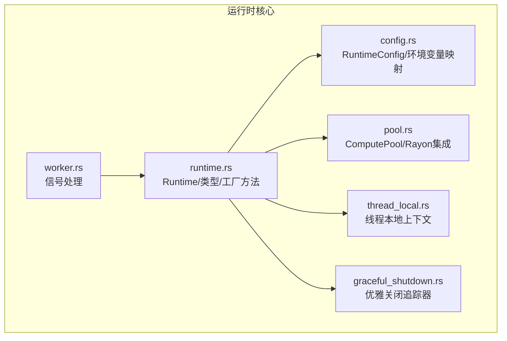
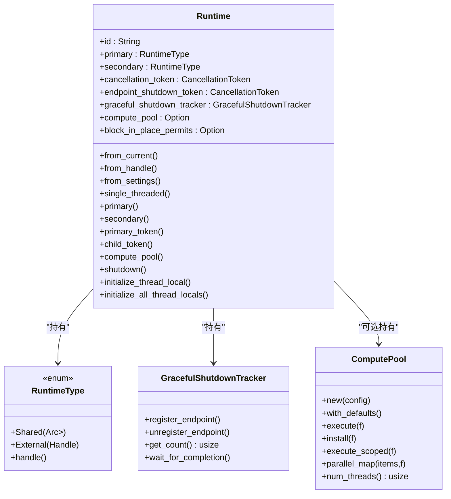
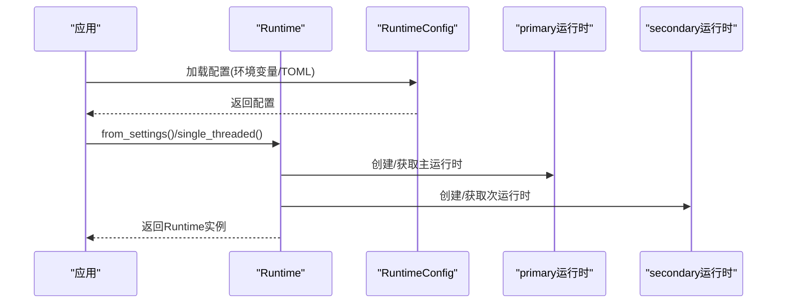
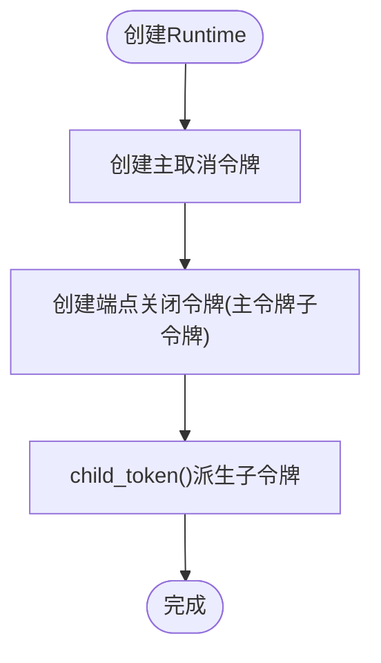
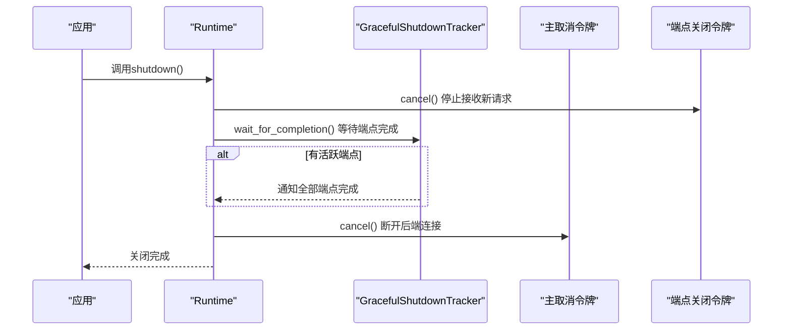
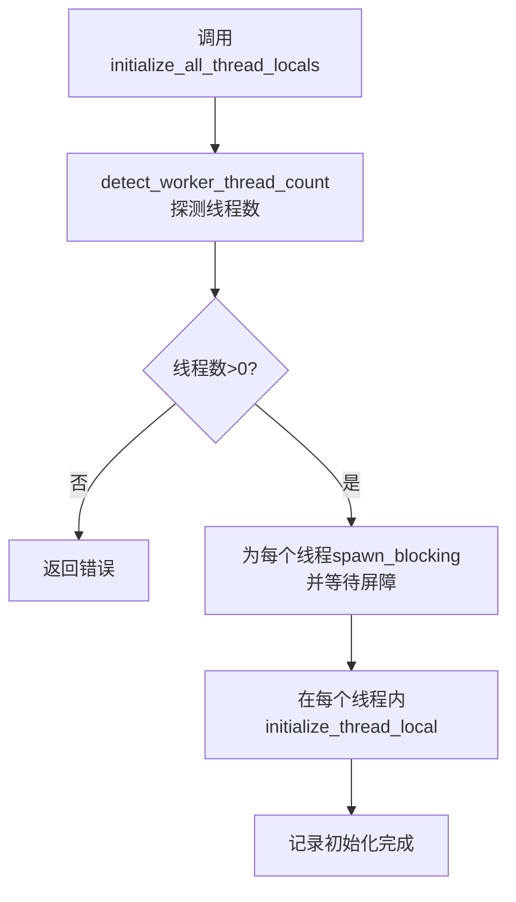
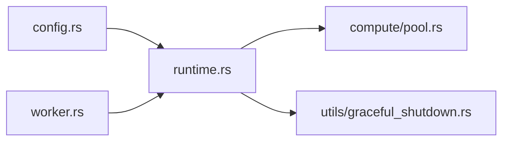

# 分布式运行时

<cite>
**本文引用的文件**
- [runtime.rs](file://lib/runtime/src/runtime.rs)
- [config.rs](file://lib/runtime/src/config.rs)
- [graceful_shutdown.rs](file://lib/runtime/src/utils/graceful_shutdown.rs)
- [worker.rs](file://lib/runtime/src/worker.rs)
- [pool.rs](file://lib/runtime/src/compute/pool.rs)
- [thread_local.rs](file://lib/runtime/src/compute/thread_local.rs)
- [graceful_shutdown.md](file://docs/fault_tolerance/graceful_shutdown.md)
- [graceful-shutdown.md](file://fern/pages/fault-tolerance/graceful-shutdown.md)
</cite>

## 目录
1. [简介](#简介)
2. [项目结构](#项目结构)
3. [核心组件](#核心组件)
4. [架构总览](#架构总览)
5. [组件详解](#组件详解)
6. [依赖关系分析](#依赖关系分析)
7. [性能考量](#性能考量)
8. [故障排查指南](#故障排查指南)
9. [结论](#结论)
10. [附录](#附录)

## 简介
本文件面向Dynamo分布式运行时系统，围绕Runtime结构体设计、主次运行时分离架构、线程池与计算资源分配、组件生命周期、取消令牌与优雅关闭机制进行系统化技术说明，并提供可直接定位到源码的路径指引，帮助读者快速理解并正确使用运行时API。

## 项目结构
运行时相关代码主要位于lib/runtime子模块中，包含运行时主体、配置、计算池、线程本地上下文以及工具模块（如优雅关闭追踪器）。同时，文档目录下提供了关于优雅关闭的详细说明。

**图表来源**
- [runtime.rs](file://lib/runtime/src/runtime.rs#L39-L344)
- [config.rs](file://lib/runtime/src/config.rs#L71-L378)
- [pool.rs](file://lib/runtime/src/compute/pool.rs#L74-L285)
- [thread_local.rs](file://lib/runtime/src/compute/thread_local.rs#L80-L112)
- [graceful_shutdown.rs](file://lib/runtime/src/utils/graceful_shutdown.rs#L7-L82)
- [worker.rs](file://lib/runtime/src/worker.rs#L208-L238)

**章节来源**
- [runtime.rs](file://lib/runtime/src/runtime.rs#L39-L344)
- [config.rs](file://lib/runtime/src/config.rs#L71-L378)

## 核心组件
- Runtime：封装主/次Tokio运行时、取消令牌、优雅关闭追踪器、计算池与阻塞任务许可等共享资源，提供统一的生命周期与资源访问接口。
- RuntimeConfig：从环境变量与配置文件加载运行时参数，支持多级优先级合并与校验。
- ComputePool：基于Rayon的CPU密集型任务执行池，提供与Tokio的桥接执行能力。
- GracefulShutdownTracker：跟踪端点活跃数量并在全部结束时通知等待方，支撑三阶段优雅关闭。
- 线程本地上下文：在每个Tokio工作线程上初始化，确保宏/函数能正确将CPU密集任务卸载至计算池。

**章节来源**
- [runtime.rs](file://lib/runtime/src/runtime.rs#L39-L141)
- [config.rs](file://lib/runtime/src/config.rs#L71-L180)
- [pool.rs](file://lib/runtime/src/compute/pool.rs#L74-L113)
- [graceful_shutdown.rs](file://lib/runtime/src/utils/graceful_shutdown.rs#L7-L53)
- [thread_local.rs](file://lib/runtime/src/compute/thread_local.rs#L80-L112)

## 架构总览
Dynamo运行时采用“主次分离”的双运行时模型：
- 主运行时：承载应用异步任务与端点服务，负责业务逻辑调度。
- 次运行时：通常为单线程外部句柄，用于后台任务（如etcd/nats）或避免与主运行时竞争。

取消令牌体系分为两层：
- 主令牌：全局终止信号，触发连接断开与最终清理。
- 端点关闭令牌：专门用于停止接收新请求，配合优雅关闭追踪器协调端点退出。

**图表来源**
- [runtime.rs](file://lib/runtime/src/runtime.rs#L39-L344)
- [graceful_shutdown.rs](file://lib/runtime/src/utils/graceful_shutdown.rs#L7-L82)
- [pool.rs](file://lib/runtime/src/compute/pool.rs#L74-L113)

## 组件详解

### Runtime结构体与主次运行时分离
- 主次运行时类型：通过RuntimeType枚举区分“共享Tokio运行时”和“外部Tokio句柄”，前者适合自建多线程运行时，后者适合嵌入已有运行时。
- 创建方式：
  - from_current：从当前Tokio句柄创建，主/次均为外部句柄。
  - from_handle：显式传入Handle，主/次均为外部句柄。
  - from_settings：从配置构建多线程运行时，主为共享运行时，次为该运行时的外部句柄。
  - single_threaded：创建两个单线程Tokio运行时实例。
- 资源初始化：
  - 默认不启用计算池；当从配置创建时，根据compute_threads等参数构建ComputePool。
  - 初始化阻塞任务许可数，保留至少一个线程给异步任务。

**图表来源**
- [runtime.rs](file://lib/runtime/src/runtime.rs#L237-L262)
- [config.rs](file://lib/runtime/src/config.rs#L306-L378)

**章节来源**
- [runtime.rs](file://lib/runtime/src/runtime.rs#L237-L262)
- [config.rs](file://lib/runtime/src/config.rs#L306-L378)

### 取消令牌系统与端点关闭令牌
- 主令牌：全局取消信号，用于最终断开后端连接（如NATS/ETCD）。
- 端点关闭令牌：继承自主令牌的子令牌，专门用于停止接受新请求。
- 使用场景：
  - child_token：为端点或组件创建与端点关闭生命周期绑定的子令牌。
  - primary_token：为需要全局控制的任务创建主令牌。

**图表来源**
- [runtime.rs](file://lib/runtime/src/runtime.rs#L57-L61)
- [runtime.rs](file://lib/runtime/src/runtime.rs#L279-L287)

**章节来源**
- [runtime.rs](file://lib/runtime/src/runtime.rs#L57-L61)
- [runtime.rs](file://lib/runtime/src/runtime.rs#L279-L287)

### 优雅关闭机制（三阶段）
- 阶段一：取消端点关闭令牌，立即停止接收新请求。
- 阶段二：等待所有已注册的“优雅端点”完成处理。
- 阶段三：取消主令牌，断开与后端服务的连接，释放资源。

**图表来源**
- [runtime.rs](file://lib/runtime/src/runtime.rs#L301-L333)
- [graceful_shutdown.rs](file://lib/runtime/src/utils/graceful_shutdown.rs#L60-L78)

**章节来源**
- [runtime.rs](file://lib/runtime/src/runtime.rs#L301-L333)
- [graceful_shutdown.rs](file://lib/runtime/src/utils/graceful_shutdown.rs#L24-L78)
- [graceful_shutdown.md](file://docs/fault_tolerance/graceful_shutdown.md#L1-L275)
- [graceful-shutdown.md](file://fern/pages/fault-tolerance/graceful-shutdown.md#L1-L262)

### 线程本地上下文初始化与阻塞任务权限
- initialize_thread_local：在当前线程初始化线程本地上下文，使计算宏/函数能将CPU密集任务卸载到ComputePool。
- initialize_all_thread_locals：探测工作线程数量，使用屏障同步确保每个线程都完成初始化。
- detect_worker_thread_count：通过大量spawn_blocking探测实际工作线程集合大小。
- 阻塞任务许可：基于可用工作线程数预留至少一个许可给异步任务，其余作为block_in_place的并发上限。

**图表来源**
- [runtime.rs](file://lib/runtime/src/runtime.rs#L151-L205)
- [runtime.rs](file://lib/runtime/src/runtime.rs#L207-L235)

**章节来源**
- [runtime.rs](file://lib/runtime/src/runtime.rs#L143-L205)
- [runtime.rs](file://lib/runtime/src/runtime.rs#L207-L235)
- [thread_local.rs](file://lib/runtime/src/compute/thread_local.rs#L80-L112)

### 计算池与资源分配策略
- ComputePool：基于Rayon ThreadPool，提供execute/install/join/parallel_map等能力，支持与Tokio协作。
- 资源分配：
  - compute_threads决定线程数；为0时禁用计算池，CPU密集操作回退到spawn_blocking。
  - stack_size与thread_prefix用于线程栈大小与命名前缀。
  - 通过semaphore限制block_in_place并发，避免阻塞线程耗尽。
- 性能特性：
  - 小任务存在约25μs桥接开销，建议对极小任务直接在Tokio或spawn_blocking中执行。

**章节来源**
- [pool.rs](file://lib/runtime/src/compute/pool.rs#L74-L113)
- [pool.rs](file://lib/runtime/src/compute/pool.rs#L140-L162)
- [pool.rs](file://lib/runtime/src/compute/pool.rs#L271-L284)
- [runtime.rs](file://lib/runtime/src/runtime.rs#L98-L141)

### 组件生命周期管理（注册/初始化/启动/销毁）
- 注册：通过Registry（位于component子模块）维护组件注册表（默认实现），用于集中管理组件状态与生命周期。
- 初始化：Runtime提供initialize_all_thread_locals以确保所有工作线程具备线程本地上下文。
- 启动：由具体组件在各自服务中启动（例如端点服务），并通过child_token与端点关闭令牌协同。
- 销毁：优雅关闭流程在关闭阶段三取消主令牌并断开后端连接，随后释放资源。

**章节来源**
- [registry.rs](file://lib/runtime/src/component/registry.rs#L14-L26)
- [runtime.rs](file://lib/runtime/src/runtime.rs#L151-L205)
- [runtime.rs](file://lib/runtime/src/runtime.rs#L301-L333)

### 运行时API使用示例（路径指引）
以下示例均提供到源码的精确路径，便于查阅具体实现与参数：

- 单线程运行时
  - 创建：[single_threaded](file://lib/runtime/src/runtime.rs#L257-L262)
  - 适用场景：调试、最小化资源占用、单核环境。

- 外部运行时（嵌入已有Tokio）
  - 从当前句柄创建：[from_current](file://lib/runtime/src/runtime.rs#L237-L239)
  - 从指定Handle创建：[from_handle](file://lib/runtime/src/runtime.rs#L241-L245)
  - 适用场景：Python绑定或其他框架已拥有Tokio运行时。

- 配置化运行时
  - 从设置加载配置并创建：[from_settings](file://lib/runtime/src/runtime.rs#L247-L255)
  - 配置项来源与映射：[RuntimeConfig::from_settings](file://lib/runtime/src/config.rs#L306-L336)
  - 环境变量映射规则：[RuntimeConfig::figment](file://lib/runtime/src/config.rs#L222-L289)

- 线程本地上下文初始化
  - 当前线程初始化：[initialize_thread_local](file://lib/runtime/src/runtime.rs#L143-L149)
  - 批量初始化（含屏障）：[initialize_all_thread_locals](file://lib/runtime/src/runtime.rs#L151-L205)

- 优雅关闭
  - 触发关闭：[shutdown](file://lib/runtime/src/runtime.rs#L301-L333)
  - 信号处理触发关闭：[signal_handler](file://lib/runtime/src/worker.rs#L208-L238)

**章节来源**
- [runtime.rs](file://lib/runtime/src/runtime.rs#L237-L262)
- [config.rs](file://lib/runtime/src/config.rs#L306-L336)
- [worker.rs](file://lib/runtime/src/worker.rs#L208-L238)

## 依赖关系分析
- 运行时依赖配置模块生成Tokio运行时与计算池参数。
- 计算池依赖Rayon与tokio_rayon桥接库，实现与Tokio的协作。
- 优雅关闭追踪器通过Notify与原子计数协调端点完成事件。
- 信号处理模块监听Unix信号并触发Runtime主令牌取消。

**图表来源**
- [config.rs](file://lib/runtime/src/config.rs#L368-L378)
- [runtime.rs](file://lib/runtime/src/runtime.rs#L91-L141)
- [pool.rs](file://lib/runtime/src/compute/pool.rs#L66-L73)
- [graceful_shutdown.rs](file://lib/runtime/src/utils/graceful_shutdown.rs#L4-L11)
- [worker.rs](file://lib/runtime/src/worker.rs#L208-L238)

**章节来源**
- [config.rs](file://lib/runtime/src/config.rs#L368-L378)
- [runtime.rs](file://lib/runtime/src/runtime.rs#L91-L141)
- [pool.rs](file://lib/runtime/src/compute/pool.rs#L66-L73)
- [graceful_shutdown.rs](file://lib/runtime/src/utils/graceful_shutdown.rs#L4-L11)
- [worker.rs](file://lib/runtime/src/worker.rs#L208-L238)

## 性能考量
- 计算池线程数与栈大小：通过compute_threads与compute_stack_size控制，过小导致CPU利用不足，过大增加上下文切换成本。
- 阻塞线程与许可：max_blocking_threads与block_in_place许可共同决定同步阻塞任务并发度，需结合工作线程数合理配置。
- 小任务开销：execute存在约25μs桥接开销，对极短任务建议直接在Tokio或spawn_blocking中执行。
- 端点并发与优雅等待：端点数量越多，阶段二等待时间越长，应结合迁移策略与超时配置优化整体停机时间。

[本节为通用指导，无需列出章节来源]

## 故障排查指南
- 无法创建计算池：检查compute_threads是否为None或>0，查看日志中的警告信息。
  - 参考：[new_with_config](file://lib/runtime/src/runtime.rs#L91-L141)
- 线程本地上下文未初始化：调用assert_compute_context会panic，确保在每个工作线程上执行initialize_thread_local或initialize_all_thread_locals。
  - 参考：[assert_compute_context](file://lib/runtime/src/compute/thread_local.rs#L84-L92)
- 优雅关闭卡住：确认所有端点均已正确注册/注销，使用wait_for_completion等待期间可通过日志观察剩余活跃端点数。
  - 参考：[wait_for_completion](file://lib/runtime/src/utils/graceful_shutdown.rs#L60-L78)
- 信号未触发关闭：检查信号处理逻辑是否注册，确认cancel_token被触发。
  - 参考：[signal_handler](file://lib/runtime/src/worker.rs#L208-L238)

**章节来源**
- [runtime.rs](file://lib/runtime/src/runtime.rs#L91-L141)
- [thread_local.rs](file://lib/runtime/src/compute/thread_local.rs#L84-L92)
- [graceful_shutdown.rs](file://lib/runtime/src/utils/graceful_shutdown.rs#L60-L78)
- [worker.rs](file://lib/runtime/src/worker.rs#L208-L238)

## 结论
Dynamo分布式运行时通过主次运行时分离、双令牌取消机制与优雅关闭追踪器，实现了对端点生命周期的精细化控制与资源的有序释放。结合可配置的计算池与线程本地上下文初始化，既保证了高并发下的CPU利用率，又避免了阻塞任务对异步线程的抢占。建议在生产环境中结合迁移策略与健康检查，进一步缩短停机窗口并提升稳定性。

[本节为总结性内容，无需列出章节来源]

## 附录
- 信号与优雅关闭文档（参考）
  - [Graceful Shutdown 文档](file://docs/fault_tolerance/graceful_shutdown.md#L1-L275)
  - [Graceful Shutdown 页面](file://fern/pages/fault-tolerance/graceful-shutdown.md#L1-L262)

**章节来源**
- [graceful_shutdown.md](file://docs/fault_tolerance/graceful_shutdown.md#L1-L275)
- [graceful-shutdown.md](file://fern/pages/fault-tolerance/graceful-shutdown.md#L1-L262)