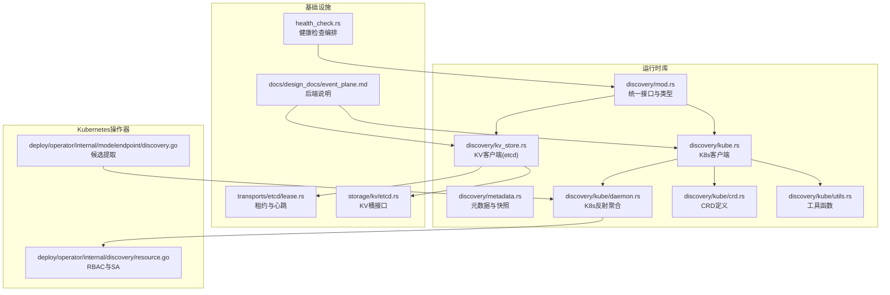
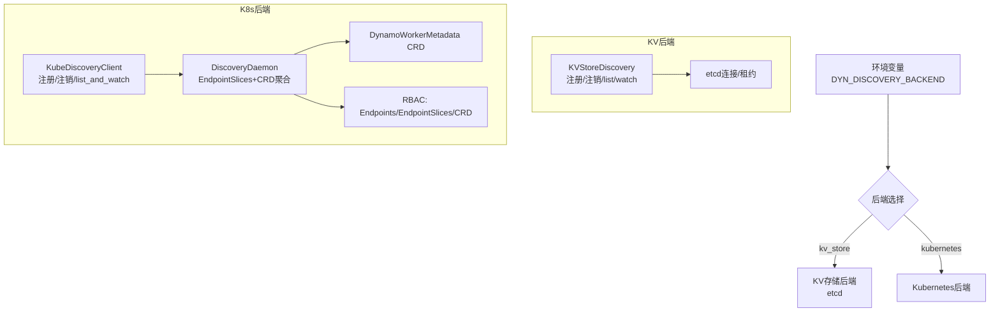
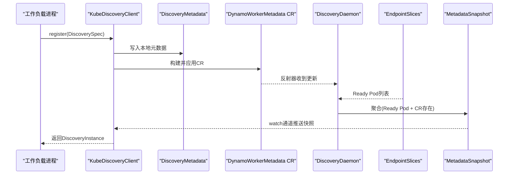
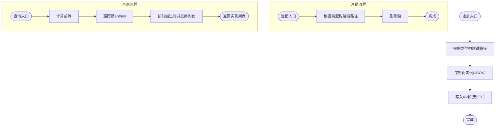
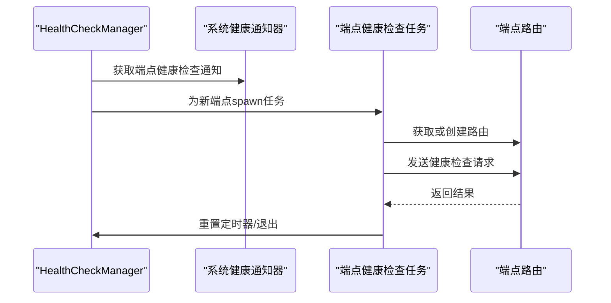
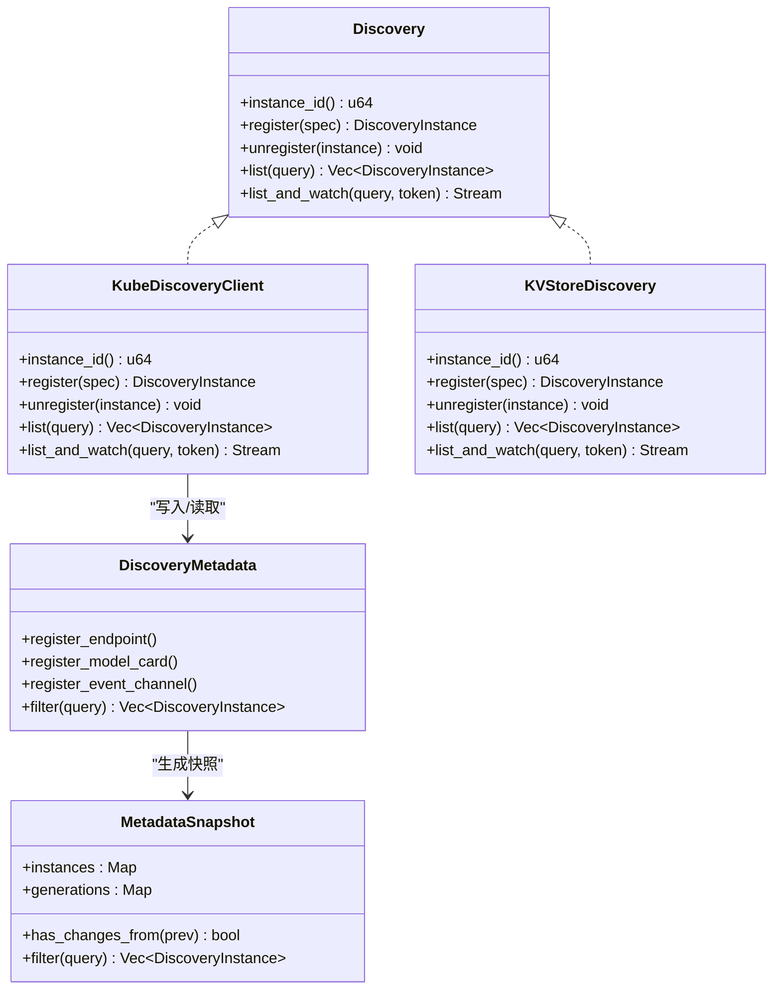

# 服务发现机制

<cite>
**本文引用的文件**
- [lib/runtime/src/discovery/mod.rs](file://lib/runtime/src/discovery/mod.rs)
- [lib/runtime/src/discovery/kube.rs](file://lib/runtime/src/discovery/kube.rs)
- [lib/runtime/src/discovery/kv_store.rs](file://lib/runtime/src/discovery/kv_store.rs)
- [lib/runtime/src/discovery/metadata.rs](file://lib/runtime/src/discovery/metadata.rs)
- [lib/runtime/src/discovery/kube/daemon.rs](file://lib/runtime/src/discovery/kube/daemon.rs)
- [lib/runtime/src/discovery/kube/crd.rs](file://lib/runtime/src/discovery/kube/crd.rs)
- [lib/runtime/src/discovery/kube/utils.rs](file://lib/runtime/src/discovery/kube/utils.rs)
- [lib/runtime/src/transports/etcd/lease.rs](file://lib/runtime/src/transports/etcd/lease.rs)
- [lib/runtime/src/storage/kv/etcd.rs](file://lib/runtime/src/storage/kv/etcd.rs)
- [lib/runtime/src/health_check.rs](file://lib/runtime/src/health_check.rs)
- [docs/design_docs/event_plane.md](file://docs/design_docs/event_plane.md)
- [deploy/operator/internal/discovery/resource.go](file://deploy/operator/internal/discovery/resource.go)
- [deploy/operator/internal/modelendpoint/discovery.go](file://deploy/operator/internal/modelendpoint/discovery.go)
</cite>

## 目录
1. [简介](#简介)
2. [项目结构](#项目结构)
3. [核心组件](#核心组件)
4. [架构总览](#架构总览)
5. [详细组件分析](#详细组件分析)
6. [依赖关系分析](#依赖关系分析)
7. [性能考量](#性能考量)
8. [故障排查指南](#故障排查指南)
9. [结论](#结论)

## 简介
本文件系统化阐述Dynamo的服务发现机制，覆盖两类后端：基于Kubernetes原生资源的“Kubernetes服务发现”与默认的基于etcd的“键值存储服务发现”。内容包括：
- 元数据管理与快照机制
- 资源监控与动态更新（EndpointSlices、CRD监听、KV变更）
- 命名空间隔离与多租户支持
- 心跳与失效处理
- 配置项与性能优化建议
- 实际配置示例与故障排查

## 项目结构
Dynamo的服务发现由运行时库与操作器共同实现：
- 运行时库(lib/runtime)提供统一的Discovery接口与两种实现：Kubernetes客户端与KV存储客户端
- 操作器(deploy/operator)负责在K8s中部署RBAC、CRD以及生成工作负载所需的环境变量
- 文档(docs/design_docs)定义了后端选择与默认行为

**图表来源**
- [lib/runtime/src/discovery/mod.rs](file://lib/runtime/src/discovery/mod.rs#L1-L711)
- [lib/runtime/src/discovery/kube.rs](file://lib/runtime/src/discovery/kube.rs#L1-L463)
- [lib/runtime/src/discovery/kv_store.rs](file://lib/runtime/src/discovery/kv_store.rs#L1-L724)
- [lib/runtime/src/discovery/metadata.rs](file://lib/runtime/src/discovery/metadata.rs#L1-L558)
- [lib/runtime/src/discovery/kube/daemon.rs](file://lib/runtime/src/discovery/kube/daemon.rs#L1-L280)
- [lib/runtime/src/discovery/kube/crd.rs](file://lib/runtime/src/discovery/kube/crd.rs#L1-L160)
- [lib/runtime/src/discovery/kube/utils.rs](file://lib/runtime/src/discovery/kube/utils.rs#L1-L46)
- [lib/runtime/src/transports/etcd/lease.rs](file://lib/runtime/src/transports/etcd/lease.rs#L1-L191)
- [lib/runtime/src/storage/kv/etcd.rs](file://lib/runtime/src/storage/kv/etcd.rs#L51-L107)
- [lib/runtime/src/health_check.rs](file://lib/runtime/src/health_check.rs#L116-L268)
- [docs/design_docs/event_plane.md](file://docs/design_docs/event_plane.md#L54-L151)
- [deploy/operator/internal/discovery/resource.go](file://deploy/operator/internal/discovery/resource.go#L1-L103)
- [deploy/operator/internal/modelendpoint/discovery.go](file://deploy/operator/internal/modelendpoint/discovery.go#L1-L111)

**章节来源**
- [lib/runtime/src/discovery/mod.rs](file://lib/runtime/src/discovery/mod.rs#L1-L711)
- [docs/design_docs/event_plane.md](file://docs/design_docs/event_plane.md#L54-L151)

## 核心组件
- 统一接口与类型
  - 定义DiscoveryTrait、DiscoverySpec/Instance、DiscoveryQuery、事件流等核心类型，支持端点、模型卡、事件通道三类对象的注册与查询
- Kubernetes客户端
  - 通过DynamoWorkerMetadata CR持久化本地元数据，并监听EndpointSlices与CR以构建快照
- 键值存储客户端(etcd)
  - 使用KV桶存储端点/模型/事件通道实例，支持前缀查询与watch事件转换
- 元数据与快照
  - DiscoveryMetadata按路径索引三类实例；MetadataSnapshot聚合各实例元数据并记录CR生成号用于变更检测
- 租约与心跳
  - etcd租约保活确保实例存活，异常时触发取消与清理

**章节来源**
- [lib/runtime/src/discovery/mod.rs](file://lib/runtime/src/discovery/mod.rs#L286-L711)
- [lib/runtime/src/discovery/kube.rs](file://lib/runtime/src/discovery/kube.rs#L27-L84)
- [lib/runtime/src/discovery/kv_store.rs](file://lib/runtime/src/discovery/kv_store.rs#L23-L56)
- [lib/runtime/src/discovery/metadata.rs](file://lib/runtime/src/discovery/metadata.rs#L10-L30)
- [lib/runtime/src/transports/etcd/lease.rs](file://lib/runtime/src/transports/etcd/lease.rs#L10-L41)

## 架构总览
Dynamo支持两种服务发现后端，通过环境变量选择：
- DYN_DISCOVERY_BACKEND=kv_store：默认后端，使用etcd作为KV存储
- DYN_DISCOVERY_BACKEND=kubernetes：在K8s环境中由操作器注入，使用K8s原生资源

**图表来源**
- [docs/design_docs/event_plane.md](file://docs/design_docs/event_plane.md#L54-L151)
- [lib/runtime/src/discovery/kv_store.rs](file://lib/runtime/src/discovery/kv_store.rs#L153-L594)
- [lib/runtime/src/discovery/kube.rs](file://lib/runtime/src/discovery/kube.rs#L86-L462)
- [lib/runtime/src/discovery/kube/daemon.rs](file://lib/runtime/src/discovery/kube/daemon.rs#L45-L181)
- [lib/runtime/src/discovery/kube/crd.rs](file://lib/runtime/src/discovery/kube/crd.rs#L25-L38)
- [deploy/operator/internal/discovery/resource.go](file://deploy/operator/internal/discovery/resource.go#L42-L73)

## 详细组件分析

### Kubernetes服务发现
- 注册流程
  - 本地写入DiscoveryMetadata，序列化为JSON，构建DynamoWorkerMetadata CR，应用到K8s命名空间
  - 通过写锁保护CR写入，失败时回滚本地状态
- 发现与动态更新
  - Daemon同时监听EndpointSlices与DynamoWorkerMetadata CR
  - 仅当Pod在EndpointSlice中标记为Ready且存在对应CR时才纳入快照
  - 使用debounce合并事件，避免抖动
- 查询与流式通知
  - list返回当前快照过滤结果
  - list_and_watch基于watch通道，计算新增/移除事件，发送DiscoveryEvent

**图表来源**
- [lib/runtime/src/discovery/kube.rs](file://lib/runtime/src/discovery/kube.rs#L92-L169)
- [lib/runtime/src/discovery/kube/daemon.rs](file://lib/runtime/src/discovery/kube/daemon.rs#L45-L181)
- [lib/runtime/src/discovery/kube/crd.rs](file://lib/runtime/src/discovery/kube/crd.rs#L25-L38)
- [lib/runtime/src/discovery/metadata.rs](file://lib/runtime/src/discovery/metadata.rs#L22-L172)

**章节来源**
- [lib/runtime/src/discovery/kube.rs](file://lib/runtime/src/discovery/kube.rs#L92-L241)
- [lib/runtime/src/discovery/kube/daemon.rs](file://lib/runtime/src/discovery/kube/daemon.rs#L45-L280)
- [lib/runtime/src/discovery/kube/crd.rs](file://lib/runtime/src/discovery/kube/crd.rs#L1-L160)
- [lib/runtime/src/discovery/metadata.rs](file://lib/runtime/src/discovery/metadata.rs#L288-L363)

### 基于etcd的分布式服务发现
- 存储布局
  - 端点实例：/services/{namespace}/{component}/{endpoint}/{instance_id}
  - 模型卡：/models/{namespace}/{component}/{endpoint}/{instance_id}（可选LoRA后缀）
  - 事件通道：/channels/{namespace}/{component}/{topic}/{instance_id}
- 注册/注销/查询
  - register序列化DiscoveryInstance并写入对应桶，不设置TTL以保持持久
  - unregister删除键
  - list按前缀匹配并反序列化
- watch事件转换
  - 将KV watch事件转换为Added/Removed事件，Removed时从键路径解析DiscoveryInstanceId
- 租约与心跳
  - 通过租约保活维持连接，异常自动重连与取消

**图表来源**
- [lib/runtime/src/discovery/kv_store.rs](file://lib/runtime/src/discovery/kv_store.rs#L159-L279)
- [lib/runtime/src/discovery/kv_store.rs](file://lib/runtime/src/discovery/kv_store.rs#L281-L374)
- [lib/runtime/src/discovery/kv_store.rs](file://lib/runtime/src/discovery/kv_store.rs#L376-L421)
- [lib/runtime/src/discovery/kv_store.rs](file://lib/runtime/src/discovery/kv_store.rs#L423-L594)

**章节来源**
- [lib/runtime/src/discovery/kv_store.rs](file://lib/runtime/src/discovery/kv_store.rs#L19-L56)
- [lib/runtime/src/discovery/kv_store.rs](file://lib/runtime/src/discovery/kv_store.rs#L159-L594)
- [lib/runtime/src/transports/etcd/lease.rs](file://lib/runtime/src/transports/etcd/lease.rs#L10-L191)
- [lib/runtime/src/storage/kv/etcd.rs](file://lib/runtime/src/storage/kv/etcd.rs#L51-L107)

### 健康检查与失效处理
- 动态端点发现
  - 通过通道接收新端点注册通知，启动独立健康检查任务
  - 基于端点目标构造路由，周期性发送健康检查请求
- 失效处理
  - 未活动时长超过阈值则标记为不可用，停止对应任务
  - 通过Removed事件感知实例下线，清理任务

**图表来源**
- [lib/runtime/src/health_check.rs](file://lib/runtime/src/health_check.rs#L116-L268)

**章节来源**
- [lib/runtime/src/health_check.rs](file://lib/runtime/src/health_check.rs#L116-L268)

### 命名空间隔离与多租户
- 命名空间隔离
  - 所有键路径均包含namespace层级，不同命名空间彼此隔离
  - K8s后端仅聚合同命名空间内的Ready Pod与CR
- 多租户支持
  - 通过不同命名空间实现租户级资源隔离
  - 操作器为服务发现配置专用ServiceAccount与RBAC规则，限定对Endpoints、EndpointSlices与DynamoWorkerMetadata的访问范围

**章节来源**
- [docs/design_docs/event_plane.md](file://docs/design_docs/event_plane.md#L54-L80)
- [lib/runtime/src/discovery/kv_store.rs](file://lib/runtime/src/discovery/kv_store.rs#L37-L55)
- [lib/runtime/src/discovery/kube/daemon.rs](file://lib/runtime/src/discovery/kube/daemon.rs#L61-L111)
- [deploy/operator/internal/discovery/resource.go](file://deploy/operator/internal/discovery/resource.go#L42-L102)

## 依赖关系分析

**图表来源**
- [lib/runtime/src/discovery/mod.rs](file://lib/runtime/src/discovery/mod.rs#L686-L711)
- [lib/runtime/src/discovery/kube.rs](file://lib/runtime/src/discovery/kube.rs#L86-L462)
- [lib/runtime/src/discovery/kv_store.rs](file://lib/runtime/src/discovery/kv_store.rs#L153-L594)
- [lib/runtime/src/discovery/metadata.rs](file://lib/runtime/src/discovery/metadata.rs#L10-L363)

**章节来源**
- [lib/runtime/src/discovery/mod.rs](file://lib/runtime/src/discovery/mod.rs#L686-L711)
- [lib/runtime/src/discovery/metadata.rs](file://lib/runtime/src/discovery/metadata.rs#L288-L363)

## 性能考量
- 缓存策略
  - K8s后端采用MetadataSnapshot与watch通道，避免频繁全量扫描
  - KV后端list遍历桶entries，建议使用前缀查询减少扫描范围
- 批量更新与去抖
  - K8s后端使用DEBOUNCE_DURATION合并事件，降低快照更新频率
- 租约与重连
  - etcd租约保活采用指数退避与截止时间重试，提升网络波动下的稳定性
- 建议
  - 在高并发注册场景下，优先使用K8s后端以利用CRD的原子性与一致性
  - 对KV后端，合理划分命名空间与组件层级，缩小前缀范围

[本节为通用指导，无需具体文件分析]

## 故障排查指南
- 后端未生效
  - 确认环境变量DYN_DISCOVERY_BACKEND设置正确（默认为kv_store）
  - 在K8s环境中，确认操作器已注入该变量
- K8s后端问题
  - 检查Pod是否被EndpointSlice标记为Ready
  - 确认DynamoWorkerMetadata CR是否存在且数据可反序列化
  - 核对RBAC权限：Endpoints/EndpointSlices/DynamoWorkerMetadatas的get/list/watch/create/update/patch/delete
- etcd后端问题
  - 检查ETCD_*环境变量配置（端点、认证、TLS）
  - 观察租约保活日志，确认心跳正常
- 健康检查异常
  - 关注健康检查任务是否被spawn与退出原因
  - 检查Removed事件是否及时触发，导致任务提前结束

**章节来源**
- [docs/design_docs/event_plane.md](file://docs/design_docs/event_plane.md#L54-L151)
- [lib/runtime/src/discovery/kube/daemon.rs](file://lib/runtime/src/discovery/kube/daemon.rs#L137-L181)
- [lib/runtime/src/discovery/kube/crd.rs](file://lib/runtime/src/discovery/kube/crd.rs#L119-L160)
- [deploy/operator/internal/discovery/resource.go](file://deploy/operator/internal/discovery/resource.go#L42-L102)
- [lib/runtime/src/transports/etcd/lease.rs](file://lib/runtime/src/transports/etcd/lease.rs#L10-L191)
- [lib/runtime/src/health_check.rs](file://lib/runtime/src/health_check.rs#L116-L268)

## 结论
Dynamo的服务发现机制通过统一接口抽象，分别对接K8s原生资源与etcd键值存储，既满足云原生环境的零外部依赖，也提供默认的分布式一致性保障。其核心优势在于：
- 明确的元数据模型与快照机制
- K8s后端的原生集成与RBAC隔离
- etcd后端的租约保活与健壮的重连策略
- 动态健康检查与失效处理
结合合理的命名空间与组件分层，Dynamo可在多租户环境下实现稳定、可观测的服务发现。