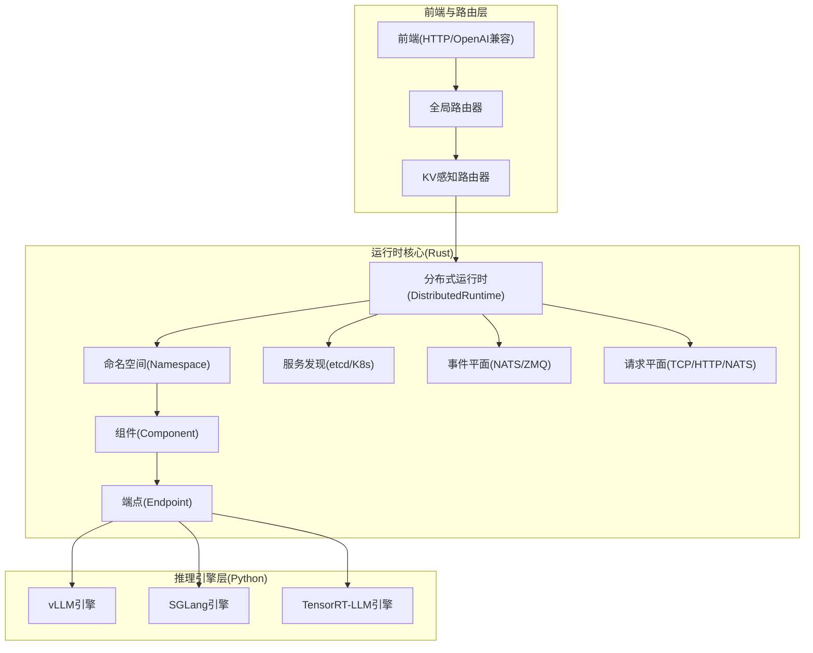
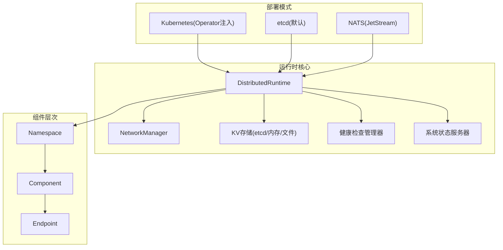
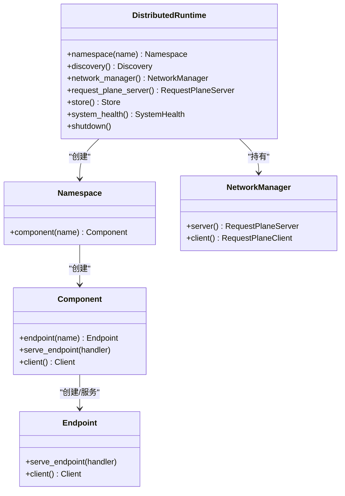
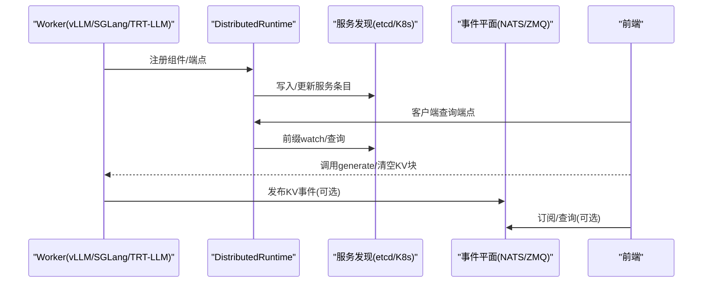
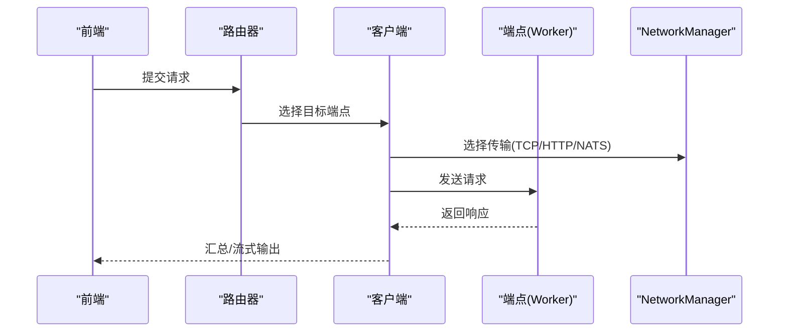
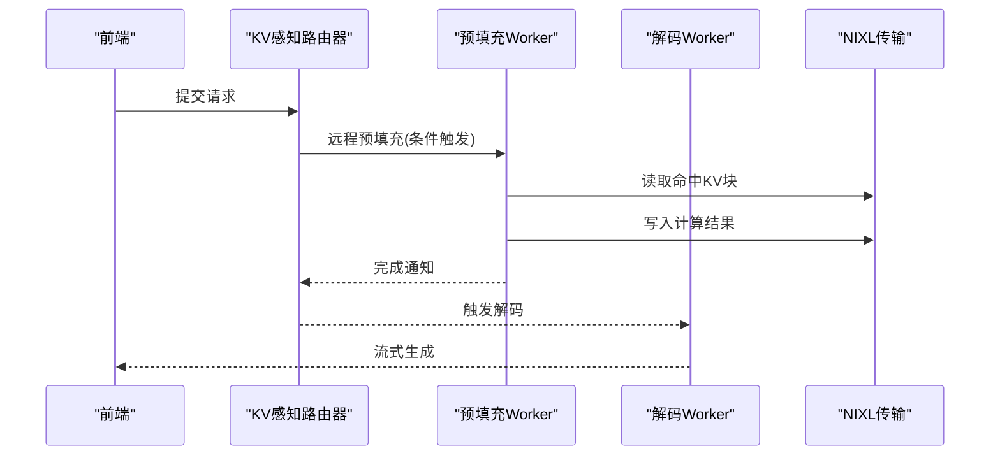
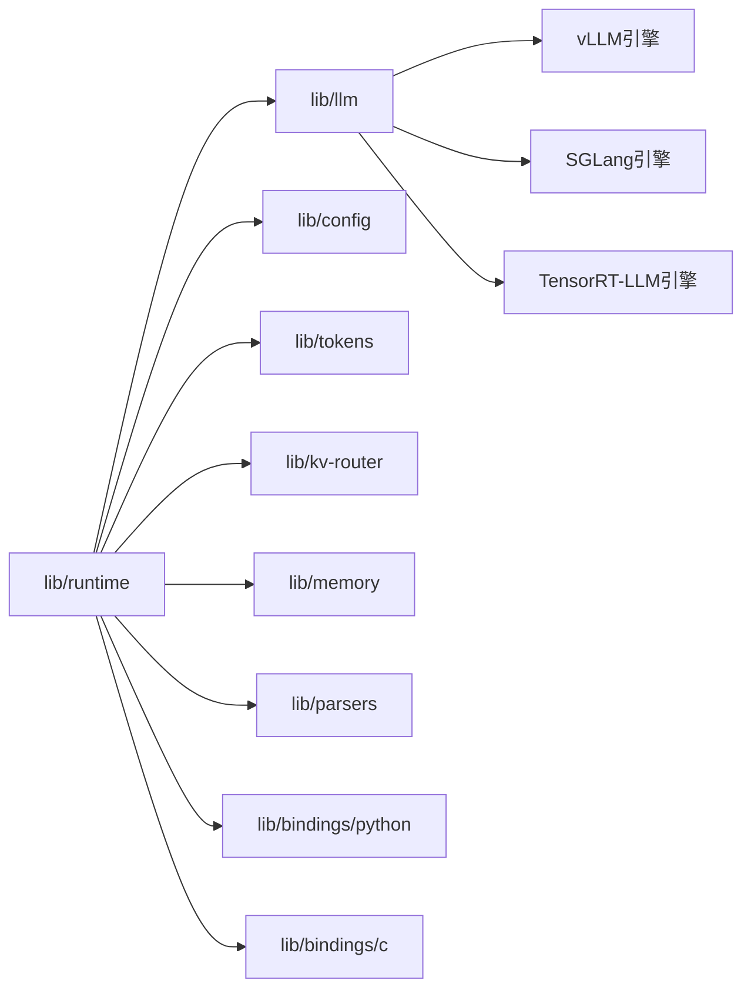

# 核心架构

<cite>
**本文引用的文件**
- [README.md](file://README.md)
- [architecture.md](file://docs/design_docs/architecture.md)
- [distributed_runtime.md](file://docs/design_docs/distributed_runtime.md)
- [event_plane.md](file://docs/design_docs/event_plane.md)
- [request_plane.md](file://docs/design_docs/request_plane.md)
- [disagg_serving.md](file://docs/design_docs/disagg_serving.md)
- [main.py（前端）](file://components/src/dynamo/frontend/main.py)
- [main.py（vLLM引擎）](file://components/src/dynamo/vllm/main.py)
- [main.py（SGLang引擎）](file://components/src/dynamo/sglang/main.py)
- [main.py（TensorRT-LLM引擎）](file://components/src/dynamo/trtllm/main.py)
- [lib.rs（运行时入口）](file://lib/runtime/src/lib.rs)
- [distributed.rs（分布式运行时）](file://lib/runtime/src/distributed.rs)
- [nats-server.conf](file://deploy/nats-server.conf)
- [Cargo.toml（工作区）](file://Cargo.toml)
</cite>

## 目录
1. [引言](#引言)
2. [项目结构](#项目结构)
3. [核心组件](#核心组件)
4. [架构总览](#架构总览)
5. [详细组件分析](#详细组件分析)
6. [依赖关系分析](#依赖关系分析)
7. [性能考量](#性能考量)
8. [故障排查指南](#故障排查指南)
9. [结论](#结论)
10. [附录](#附录)

## 引言
本架构文档聚焦Dynamo的核心分布式运行时设计与实现，系统性阐述其事件驱动架构、组件间交互模式、服务发现机制、消息传递体系（基于NATS与ZMQ）、状态同步与KV缓存路由、以及无共享架构下的动态扩缩容与故障恢复能力。文档同时解释技术决策（如Rust实现核心运行时）的权衡，并给出系统边界、数据流与组件关系图示，帮助读者快速理解Dynamo在多节点、多引擎异构环境中的运行机理。

## 项目结构
Dynamo采用“多引擎统一抽象 + Rust核心运行时 + Python扩展”的混合架构：引擎侧以Python封装各推理后端（vLLM、SGLang、TensorRT-LLM），运行时核心以Rust实现，提供跨进程/跨节点的服务发现、请求平面、事件平面、健康检查与度量等基础设施；部署侧通过Kubernetes或etcd/NATS组合实现弹性与可观测性。

图表来源
- [architecture.md](file://docs/design_docs/architecture.md#L53-L68)
- [distributed_runtime.md](file://docs/design_docs/distributed_runtime.md#L22-L42)
- [main.py（前端）](file://components/src/dynamo/frontend/main.py#L329-L440)
- [main.py（vLLM引擎）](file://components/src/dynamo/vllm/main.py#L76-L151)
- [main.py（SGLang引擎）](file://components/src/dynamo/sglang/main.py#L69-L123)
- [main.py（TensorRT-LLM引擎）](file://components/src/dynamo/trtllm/main.py#L128-L160)

章节来源
- [README.md](file://README.md#L29-L49)
- [architecture.md](file://docs/design_docs/architecture.md#L19-L68)

## 核心组件
- 分布式运行时（DistributedRuntime）
  - 职责：统一管理服务发现、请求平面、事件平面、健康检查、度量与生命周期；为上层组件提供命名空间、组件与端点的注册与调用接口。
  - 关键能力：命名空间隔离、组件注册、端点服务、客户端发现与负载均衡、请求平面抽象（TCP/HTTP/NATS）、事件发布订阅（NATS/ZMQ）。
- 命名空间（Namespace）/组件（Component）/端点（Endpoint）
  - 命名空间用于逻辑隔离不同模型部署；组件代表可发现的逻辑单元（如后端、预填充、解码、编码器等）；端点提供具体服务（如generate、clear_kv_blocks）。
- 服务发现与事件平面
  - 发现后端：etcd（默认）或Kubernetes原生资源（Operator注入时启用）。
  - 事件平面：NATS（JetStream持久化）或ZMQ（vLLM内部前缀缓存事件聚合）。
- 请求平面
  - 支持TCP（默认，低延迟）、HTTP/2（易调试与兼容）、NATS（历史遗留与部分特性）。
- 引擎适配层
  - vLLM/SGLang/TRT-LLM通过统一的注册接口接入Dynamo，暴露generate等端点，支持多模态、LoRA、工具调用等扩展。

章节来源
- [distributed_runtime.md](file://docs/design_docs/distributed_runtime.md#L22-L42)
- [distributed.rs（分布式运行时）](file://lib/runtime/src/distributed.rs#L42-L80)
- [lib.rs（运行时入口）](file://lib/runtime/src/lib.rs#L20-L56)

## 架构总览
Dynamo的分布式运行时采用“无共享”设计：每个进程拥有独立的DistributedRuntime实例，但共享同一命名空间进行服务发现与事件通信。请求平面与事件平面相互独立，既可混用也可单独配置，满足从单机到多节点、从低延迟到高可靠性的多样化部署需求。

图表来源
- [event_plane.md](file://docs/design_docs/event_plane.md#L26-L31)
- [distributed_runtime.md](file://docs/design_docs/distributed_runtime.md#L52-L76)
- [distributed.rs（分布式运行时）](file://lib/runtime/src/distributed.rs#L103-L281)

章节来源
- [event_plane.md](file://docs/design_docs/event_plane.md#L20-L52)
- [request_plane.md](file://docs/design_docs/request_plane.md#L20-L54)

## 详细组件分析

### 分布式运行时（DistributedRuntime）
- 初始化流程
  - 解析环境变量（DYN_DISCOVERY_BACKEND、DYN_REQUEST_PLANE、NATS_SERVER等），按需连接etcd/K8s、NATS与构建网络管理器。
  - 启动系统状态服务器与健康检查管理器，注册度量与引擎路由回调。
- 组件生命周期
  - 命名空间/组件/端点的创建与注册；客户端对端点变更的监听与重连；优雅停机与租约清理。
- 请求平面抽象
  - NetworkManager集中管理TCP/HTTP/NATS三种传输，屏蔽上层差异；支持连接池、超时、缓冲等参数化配置。
- 事件平面抽象
  - 提供NATS客户端与ZMQ事件发布/订阅接口；KV路由器在需要时通过NATS/JetStream进行事件分发与持久化。

图表来源
- [distributed.rs（分布式运行时）](file://lib/runtime/src/distributed.rs#L42-L80)
- [distributed.rs（分布式运行时）](file://lib/runtime/src/distributed.rs#L328-L384)
- [distributed_runtime.md](file://docs/design_docs/distributed_runtime.md#L77-L96)

章节来源
- [distributed_runtime.md](file://docs/design_docs/distributed_runtime.md#L44-L96)
- [distributed.rs（分布式运行时）](file://lib/runtime/src/distributed.rs#L103-L281)

### 服务发现与事件平面
- 服务发现
  - etcd：默认后端，使用租约与前缀watch实现端点注册与变更通知；支持原子操作与事务保障一致性。
  - Kubernetes：Operator注入DYN_DISCOVERY_BACKEND=kubernetes后，使用CRD与EndpointSlices实现原生发现，无需外部etcd。
- 事件平面
  - NATS：JetStream持久化、消费者组、确认跟踪；用于KV缓存事件、路由器副本同步与历史遗留请求平面。
  - ZMQ：vLLM内部前缀缓存事件聚合（Consolidator），减少事件风暴与网络开销。
- 配置与切换
  - 通过环境变量控制后端与功能开关；支持禁用NATS（近似模式KV路由）以简化部署。

图表来源
- [event_plane.md](file://docs/design_docs/event_plane.md#L144-L204)
- [event_plane.md](file://docs/design_docs/event_plane.md#L227-L294)
- [main.py（vLLM引擎）](file://components/src/dynamo/vllm/main.py#L212-L286)

章节来源
- [event_plane.md](file://docs/design_docs/event_plane.md#L54-L89)
- [event_plane.md](file://docs/design_docs/event_plane.md#L91-L170)
- [event_plane.md](file://docs/design_docs/event_plane.md#L227-L294)

### 请求平面与路由
- 请求平面
  - TCP：默认、低延迟、二进制序列化；适合生产与低时延场景。
  - HTTP/2：标准协议、易调试、兼容广泛；适合集成与可观测性。
  - NATS：历史遗留与部分特性（如JetStream持久化）；注意消息大小限制。
- 路由策略
  - 轮询/随机/基于KV缓存命中率的智能路由；支持路由器副本同步与快照阈值控制。
- 端到端调用
  - 客户端根据命名空间/组件/端点名称解析目标实例列表，结合负载均衡策略发起请求。

图表来源
- [request_plane.md](file://docs/design_docs/request_plane.md#L208-L225)
- [main.py（前端）](file://components/src/dynamo/frontend/main.py#L379-L413)

章节来源
- [request_plane.md](file://docs/design_docs/request_plane.md#L20-L54)
- [request_plane.md](file://docs/design_docs/request_plane.md#L56-L116)
- [main.py（前端）](file://components/src/dynamo/frontend/main.py#L329-L440)

### 引擎适配与多模态
- vLLM/SGLang/TRT-LLM通过统一注册接口接入Dynamo，暴露generate等端点；支持多模态、LoRA、工具调用与推理统计导出。
- 多模态链路：编码器/处理器/解码器/预填充协同，内部端点通过runtime客户端发现与调用。
- 预填充与解码分离
  - 条件化拆分：根据输入长度与队列状态决定是否远程预填充；NIXL加速KV块在GPU之间的非阻塞传输。

图表来源
- [disagg_serving.md](file://docs/design_docs/disagg_serving.md#L19-L43)
- [disagg_serving.md](file://docs/design_docs/disagg_serving.md#L60-L91)

章节来源
- [main.py（vLLM引擎）](file://components/src/dynamo/vllm/main.py#L418-L528)
- [main.py（SGLang引擎）](file://components/src/dynamo/sglang/main.py#L125-L210)
- [main.py（TensorRT-LLM引擎）](file://components/src/dynamo/trtllm/main.py#L162-L214)
- [disagg_serving.md](file://docs/design_docs/disagg_serving.md#L19-L43)

## 依赖关系分析
- 工作区与模块
  - 工作区包含运行时、LLM抽象、配置、KV路由、内存、解析器、C/Python绑定等子包；默认成员聚焦核心能力。
- 外部依赖
  - NATS（async-nats）、etcd-client、ZMQ（async_zmq、zmq）、Tokio生态、Prometheus等。
- 运行时与引擎耦合
  - 运行时以抽象接口对接引擎；引擎通过注册接口暴露端点，避免直接耦合底层实现细节。

图表来源
- [Cargo.toml（工作区）](file://Cargo.toml#L4-L32)
- [lib.rs（运行时入口）](file://lib/runtime/src/lib.rs#L20-L56)

章节来源
- [Cargo.toml（工作区）](file://Cargo.toml#L4-L32)
- [lib.rs（运行时入口）](file://lib/runtime/src/lib.rs#L20-L56)

## 性能考量
- 低延迟请求平面
  - TCP默认、二进制序列化、连接池与缓冲参数可调；适合生产部署与低时延场景。
- 事件风暴治理
  - NATS JetStream持久化与消费者组；ZMQ Consolidator聚合vLLM事件；KV事件可禁用以降低复杂度。
- KV缓存与传输优化
  - 前缀命中优先、NIXL非阻塞传输、块描述符懒加载与合并、布局转换内核优化。
- 动态扩缩容
  - 租约过期自动清理、watch事件实时更新、优雅停机与迁移；支持运行时增删Worker与预填充Worker。

## 故障排查指南
- NATS相关
  - NATS配置文件设置最大载荷与JetStream；若出现消息过大或不可达，检查NATS_SERVER、JetStream启用与监控端口。
- 服务发现异常
  - etcd连接失败：检查ETCD_ENDPOINTS、认证与TLS；租约心跳中断导致实例下线：检查TTL与网络稳定性。
- 请求平面问题
  - TCP/HTTP端口冲突：调整DYN_TCP_RPC_PORT或DYN_HTTP_RPC_PORT；NATS请求平面注意payload上限。
- 路由与事件
  - KV感知路由未生效：确认NATS可用且启用KV事件；近似模式可通过TTL与树大小参数调节。

章节来源
- [nats-server.conf](file://deploy/nats-server.conf#L1-L14)
- [event_plane.md](file://docs/design_docs/event_plane.md#L227-L294)
- [request_plane.md](file://docs/design_docs/request_plane.md#L264-L292)

## 结论
Dynamo通过Rust实现高性能、类型安全的分布式运行时，配合Python引擎适配层与灵活的请求/事件平面，实现了面向多节点、多引擎的无共享架构。其服务发现、事件与请求平面的解耦设计，使系统在低延迟、高可靠性与运维简易性之间取得平衡；动态扩缩容与故障恢复能力进一步增强了生产可用性。未来可在事件聚合、跨域一致性与跨平台部署标准化方面持续演进。

## 附录
- 架构演进与技术决策
  - 选择Rust实现核心运行时：并发安全、零成本抽象、与Tokio生态契合；Python用于快速迭代与生态集成。
  - 选择NATS/JetStream：事件持久化与消息编排；ZMQ用于引擎内部事件聚合；Kubernetes原生发现降低外部依赖。
- 无共享架构与一致性
  - 通过租约与watch实现最终一致的服务发现；通过事件持久化与本地索引平衡一致性与性能；通过优雅停机与迁移保证可用性。
- 系统边界
  - 前端与路由：OpenAI兼容API、预处理与路由；运行时：服务发现、事件与请求平面、健康检查；引擎：推理执行与端点暴露。