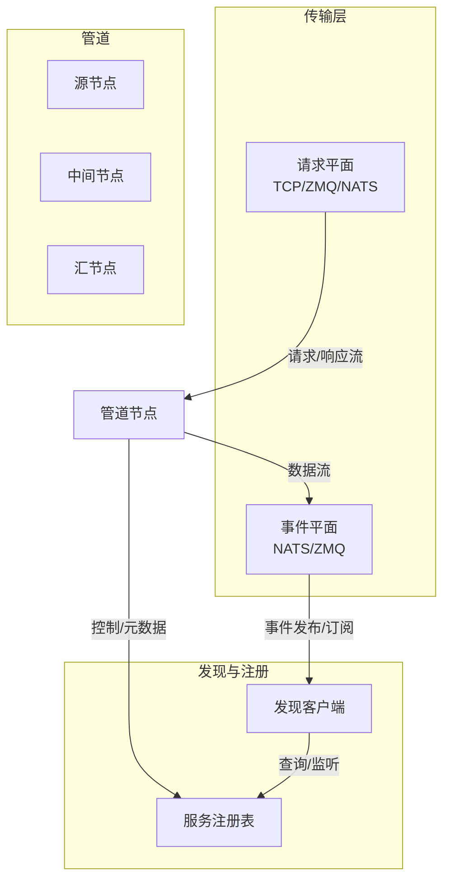
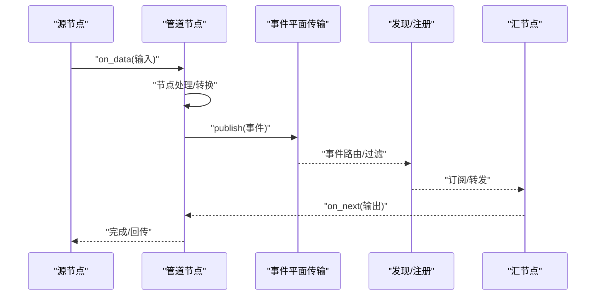
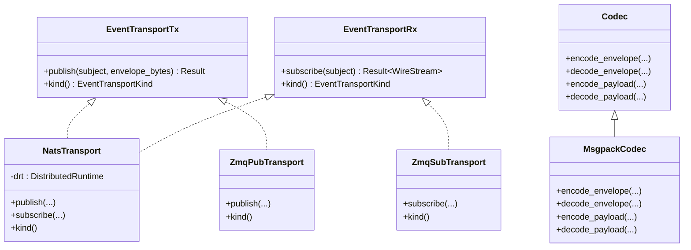
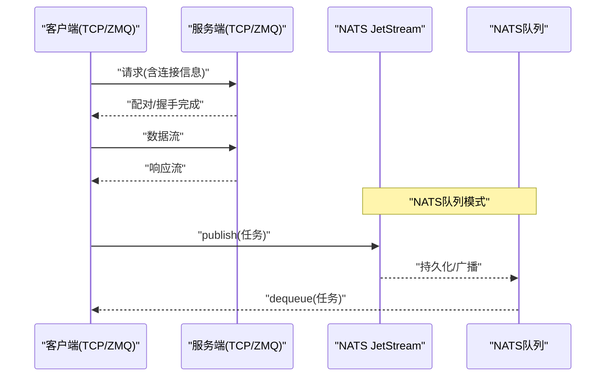
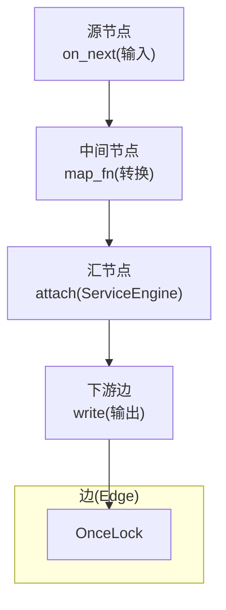
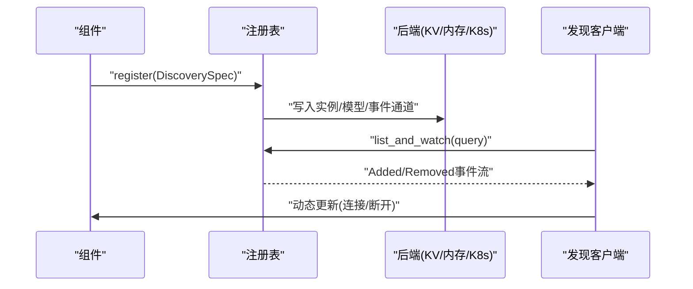
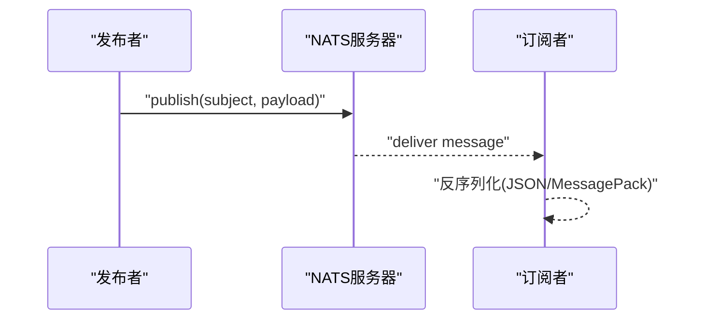
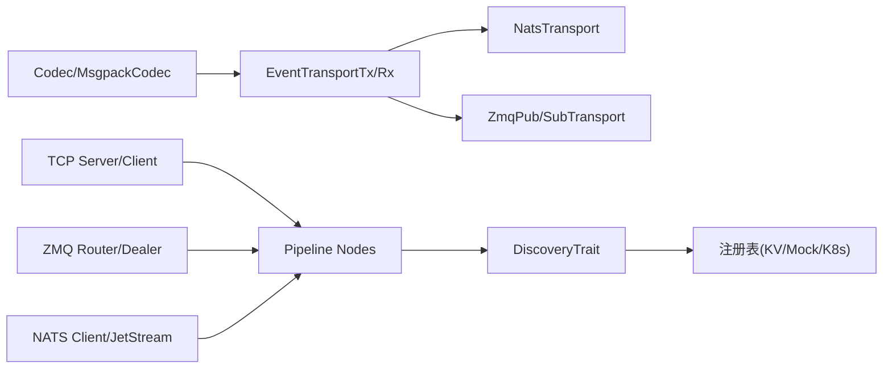

# 组件通信机制

<cite>
**本文引用的文件**
- [lib/runtime/src/transports/event_plane/transport.rs](file://lib/runtime/src/transports/event_plane/transport.rs)
- [lib/runtime/src/transports/event_plane/codec.rs](file://lib/runtime/src/transports/event_plane/codec.rs)
- [lib/runtime/src/transports/event_plane/frame.rs](file://lib/runtime/src/transports/event_plane/frame.rs)
- [lib/runtime/src/transports/event_plane/nats_transport.rs](file://lib/runtime/src/transports/event_plane/nats_transport.rs)
- [lib/runtime/src/transports/event_plane/zmq_transport.rs](file://lib/runtime/src/transports/event_plane/zmq_transport.rs)
- [lib/runtime/src/transports/nats.rs](file://lib/runtime/src/transports/nats.rs)
- [lib/runtime/src/transports/tcp.rs](file://lib/runtime/src/transports/tcp.rs)
- [lib/runtime/src/transports/zmq.rs](file://lib/runtime/src/transports/zmq.rs)
- [lib/runtime/src/pipeline/network/tcp.rs](file://lib/runtime/src/pipeline/network/tcp.rs)
- [lib/runtime/src/discovery/mod.rs](file://lib/runtime/src/discovery/mod.rs)
- [lib/runtime/src/discovery/kv_store.rs](file://lib/runtime/src/discovery/kv_store.rs)
- [lib/runtime/src/discovery/mock.rs](file://lib/runtime/src/discovery/mock.rs)
- [lib/runtime/src/component/service.rs](file://lib/runtime/src/component/service.rs)
- [lib/runtime/src/pipeline/nodes.rs](file://lib/runtime/src/pipeline/nodes.rs)
- [lib/runtime/src/pipeline/nodes/sinks/base.rs](file://lib/runtime/src/pipeline/nodes/sinks/base.rs)
- [lib/runtime/src/pipeline/nodes/sinks/segment.rs](file://lib/runtime/src/pipeline/nodes/sinks/segment.rs)
- [lib/runtime/src/pipeline/nodes/sources.rs](file://lib/runtime/src/pipeline/nodes/sources.rs)
- [lib/runtime/src/service.rs](file://lib/runtime/src/service.rs)
- [lib/runtime/src/distributed.rs](file://lib/runtime/src/distributed.rs)
</cite>

## 目录
1. [引言](#引言)
2. [项目结构](#项目结构)
3. [核心组件](#核心组件)
4. [架构总览](#架构总览)
5. [详细组件分析](#详细组件分析)
6. [依赖关系分析](#依赖关系分析)
7. [性能考量](#性能考量)
8. [故障排查指南](#故障排查指南)
9. [结论](#结论)
10. [附录](#附录)

## 引言
本文件面向Dynamo分布式运行时的组件通信机制，系统性阐述以下关键主题：
- 管道系统：从源节点到汇节点的数据流组织与调度
- 网络传输层：TCP、ZMQ、NATS三种协议的抽象与差异
- 事件平面：统一的事件发布/订阅接口与编解码
- 组件注册与发现：服务注册表、实例生命周期与动态更新
- 基于NATS的消息传递：主题订阅、消息序列化/反序列化流程
- 实际代码示例路径：如何建立组件间通信与数据流处理

目标是帮助读者快速理解并正确使用Dynamo的组件通信能力，覆盖从高层架构到具体实现细节。

## 项目结构
Dynamo的组件通信涉及多个子模块：
- 传输层（Transports）：事件平面（NATS/ZMQ）、请求平面（TCP/ZMQ/NATS）
- 管道（Pipeline）：节点模型（源/汇/中间节点）、边（Edge）与流（Stream）
- 发现与注册（Discovery）：实例注册、查询、监听与KV存储后端
- 组件服务（Component）：NATS服务封装与运行时集成

图示来源
- [lib/runtime/src/transports/event_plane/transport.rs](file://lib/runtime/src/transports/event_plane/transport.rs#L1-L37)
- [lib/runtime/src/transports/tcp.rs](file://lib/runtime/src/transports/tcp.rs#L1-L5)
- [lib/runtime/src/transports/zmq.rs](file://lib/runtime/src/transports/zmq.rs#L1-L409)
- [lib/runtime/src/transports/nats.rs](file://lib/runtime/src/transports/nats.rs#L1-L1195)
- [lib/runtime/src/pipeline/nodes.rs](file://lib/runtime/src/pipeline/nodes.rs#L287-L325)
- [lib/runtime/src/discovery/mod.rs](file://lib/runtime/src/discovery/mod.rs#L1-L711)

章节来源
- [lib/runtime/src/transports/event_plane/transport.rs](file://lib/runtime/src/transports/event_plane/transport.rs#L1-L37)
- [lib/runtime/src/transports/tcp.rs](file://lib/runtime/src/transports/tcp.rs#L1-L5)
- [lib/runtime/src/transports/zmq.rs](file://lib/runtime/src/transports/zmq.rs#L1-L409)
- [lib/runtime/src/transports/nats.rs](file://lib/runtime/src/transports/nats.rs#L1-L1195)
- [lib/runtime/src/pipeline/nodes.rs](file://lib/runtime/src/pipeline/nodes.rs#L287-L325)
- [lib/runtime/src/discovery/mod.rs](file://lib/runtime/src/discovery/mod.rs#L1-L711)

## 核心组件
- 事件平面传输抽象：定义统一的发布/订阅接口，屏蔽NATS与ZMQ差异
- 编解码器：支持JSON与MessagePack，用于事件载荷与信封序列化
- 二进制帧格式：固定头+版本+长度字段，确保边界检测与协议演进
- 请求平面传输：TCP路由（Router/Dealer模式），ZMQ Harmony模式，NATS队列与JetStream
- 管道节点：源节点、汇节点、中间节点，通过边（Edge）连接形成数据流
- 发现与注册：支持多种后端（内存、KV存储、Kubernetes），提供注册、注销、列表与监听

章节来源
- [lib/runtime/src/transports/event_plane/transport.rs](file://lib/runtime/src/transports/event_plane/transport.rs#L18-L37)
- [lib/runtime/src/transports/event_plane/codec.rs](file://lib/runtime/src/transports/event_plane/codec.rs#L12-L61)
- [lib/runtime/src/transports/event_plane/frame.rs](file://lib/runtime/src/transports/event_plane/frame.rs#L13-L74)
- [lib/runtime/src/transports/nats.rs](file://lib/runtime/src/transports/nats.rs#L412-L834)
- [lib/runtime/src/transports/tcp.rs](file://lib/runtime/src/transports/tcp.rs#L1-L180)
- [lib/runtime/src/transports/zmq.rs](file://lib/runtime/src/transports/zmq.rs#L1-L409)
- [lib/runtime/src/pipeline/nodes.rs](file://lib/runtime/src/pipeline/nodes.rs#L287-L325)
- [lib/runtime/src/discovery/mod.rs](file://lib/runtime/src/discovery/mod.rs#L124-L184)

## 架构总览
Dynamo的组件通信采用“事件平面 + 请求平面 + 管道”的分层设计：
- 事件平面：用于跨组件广播事件（如KV缓存事件、指标事件），通过统一的传输抽象实现NATS或ZMQ
- 请求平面：用于点对点或一对多的请求/响应流，支持TCP（Router/Dealer）、ZMQ、NATS队列
- 管道：以节点为中心的数据流拓扑，源节点产生数据，中间节点转换，汇节点消费

图示来源
- [lib/runtime/src/pipeline/nodes.rs](file://lib/runtime/src/pipeline/nodes.rs#L301-L325)
- [lib/runtime/src/transports/event_plane/nats_transport.rs](file://lib/runtime/src/transports/event_plane/nats_transport.rs#L25-L54)
- [lib/runtime/src/discovery/mod.rs](file://lib/runtime/src/discovery/mod.rs#L686-L710)

## 详细组件分析

### 事件平面：传输抽象与编解码
- 传输抽象：定义EventTransportTx/EventTransportRx，统一发布/订阅接口，返回原始字节流
- NATS实现：通过DistributedRuntime桥接NATS JetStream发布/订阅
- ZMQ实现：基于ZMQ PUB/SUB，支持HWM、超时与广播通道
- 编解码：默认JSON（NATS）与MessagePack（ZMQ），支持事件载荷与信封序列化
- 帧格式：固定5字节头（版本+载荷长度），保证边界与协议演进

图示来源
- [lib/runtime/src/transports/event_plane/transport.rs](file://lib/runtime/src/transports/event_plane/transport.rs#L22-L37)
- [lib/runtime/src/transports/event_plane/nats_transport.rs](file://lib/runtime/src/transports/event_plane/nats_transport.rs#L15-L54)
- [lib/runtime/src/transports/event_plane/zmq_transport.rs](file://lib/runtime/src/transports/event_plane/zmq_transport.rs#L1-L544)
- [lib/runtime/src/transports/event_plane/codec.rs](file://lib/runtime/src/transports/event_plane/codec.rs#L12-L61)

章节来源
- [lib/runtime/src/transports/event_plane/transport.rs](file://lib/runtime/src/transports/event_plane/transport.rs#L18-L37)
- [lib/runtime/src/transports/event_plane/codec.rs](file://lib/runtime/src/transports/event_plane/codec.rs#L12-L61)
- [lib/runtime/src/transports/event_plane/frame.rs](file://lib/runtime/src/transports/event_plane/frame.rs#L13-L74)
- [lib/runtime/src/transports/event_plane/nats_transport.rs](file://lib/runtime/src/transports/event_plane/nats_transport.rs#L15-L54)
- [lib/runtime/src/transports/event_plane/zmq_transport.rs](file://lib/runtime/src/transports/event_plane/zmq_transport.rs#L1-L544)

### 请求平面：TCP、ZMQ与NATS
- TCP：Router/Dealer模式，支持CallHome握手、连接信息封装、双向流
- ZMQ：Harmony模式，基于Router/Dealer的连接池化，内部路由状态管理
- NATS：JetStream队列（Pull Consumer）、对象存储上传/下载、广播统计收集

图示来源
- [lib/runtime/src/pipeline/network/tcp.rs](file://lib/runtime/src/pipeline/network/tcp.rs#L36-L83)
- [lib/runtime/src/transports/zmq.rs](file://lib/runtime/src/transports/zmq.rs#L83-L297)
- [lib/runtime/src/transports/nats.rs](file://lib/runtime/src/transports/nats.rs#L412-L834)

章节来源
- [lib/runtime/src/pipeline/network/tcp.rs](file://lib/runtime/src/pipeline/network/tcp.rs#L1-L180)
- [lib/runtime/src/transports/zmq.rs](file://lib/runtime/src/transports/zmq.rs#L1-L409)
- [lib/runtime/src/transports/nats.rs](file://lib/runtime/src/transports/nats.rs#L1-L1195)

### 管道节点：源/汇/中间节点
- 源节点：接收外部输入，写入下游边
- 中间节点：执行映射函数，将上游输出转发至下游
- 汇节点：连接引擎生成流，再写入下游边
- 边（Edge）：单次写入锁，避免重复设置

图示来源
- [lib/runtime/src/pipeline/nodes.rs](file://lib/runtime/src/pipeline/nodes.rs#L287-L325)
- [lib/runtime/src/pipeline/nodes/sinks/base.rs](file://lib/runtime/src/pipeline/nodes/sinks/base.rs#L15-L31)
- [lib/runtime/src/pipeline/nodes/sinks/segment.rs](file://lib/runtime/src/pipeline/nodes/sinks/segment.rs#L28-L50)

章节来源
- [lib/runtime/src/pipeline/nodes.rs](file://lib/runtime/src/pipeline/nodes.rs#L287-L325)
- [lib/runtime/src/pipeline/nodes/sinks/base.rs](file://lib/runtime/src/pipeline/nodes/sinks/base.rs#L15-L31)
- [lib/runtime/src/pipeline/nodes/sinks/segment.rs](file://lib/runtime/src/pipeline/nodes/sinks/segment.rs#L28-L50)

### 组件注册与发现：服务注册表与动态更新
- 注册表：统一的DiscoveryTrait接口，支持注册、注销、列表与监听
- 后端：内存Mock、KV存储（基于NATS对象存储）、Kubernetes
- 查询：支持命名空间/组件/端点/模型/事件通道等多级前缀查询
- 动态更新：通过watch_and_extract_field等工具提取变更并驱动动态更新

图示来源
- [lib/runtime/src/discovery/mod.rs](file://lib/runtime/src/discovery/mod.rs#L686-L710)
- [lib/runtime/src/discovery/kv_store.rs](file://lib/runtime/src/discovery/kv_store.rs#L278-L308)
- [lib/runtime/src/discovery/mock.rs](file://lib/runtime/src/discovery/mock.rs#L160-L236)

章节来源
- [lib/runtime/src/discovery/mod.rs](file://lib/runtime/src/discovery/mod.rs#L1-L711)
- [lib/runtime/src/discovery/kv_store.rs](file://lib/runtime/src/discovery/kv_store.rs#L278-L308)
- [lib/runtime/src/discovery/mock.rs](file://lib/runtime/src/discovery/mock.rs#L160-L236)

### 基于NATS的消息传递：主题订阅与序列化
- NATS客户端：支持用户密码、Token、NKey、凭证文件认证；JetStream队列与对象存储
- 队列：Pull Consumer持久化、广播模式、消费者组、清理与确认
- 序列化：对象存储使用bincode二进制序列化；事件平面使用JSON（NATS）或MessagePack（ZMQ）
- 服务封装：组件可启动NATS服务，便于传统请求平面兼容

图示来源
- [lib/runtime/src/transports/nats.rs](file://lib/runtime/src/transports/nats.rs#L101-L119)
- [lib/runtime/src/transports/nats.rs](file://lib/runtime/src/transports/nats.rs#L841-L866)
- [lib/runtime/src/transports/event_plane/codec.rs](file://lib/runtime/src/transports/event_plane/codec.rs#L66-L86)
- [lib/runtime/src/component/service.rs](file://lib/runtime/src/component/service.rs#L10-L34)

章节来源
- [lib/runtime/src/transports/nats.rs](file://lib/runtime/src/transports/nats.rs#L1-L1195)
- [lib/runtime/src/transports/event_plane/codec.rs](file://lib/runtime/src/transports/event_plane/codec.rs#L12-L86)
- [lib/runtime/src/component/service.rs](file://lib/runtime/src/component/service.rs#L10-L34)

## 依赖关系分析
- 事件平面依赖：TransportTrait抽象 + 具体NATS/ZMQ实现 + 编解码器
- 请求平面依赖：TCP/ZMQ/NATS各自独立实现，但共享统一的连接信息封装
- 管道依赖：节点模型依赖边（Edge）与上下文（Context），通过异步流传递
- 发现依赖：统一的DiscoveryTrait接口，后端可插拔（内存/KV/K8s）

图示来源
- [lib/runtime/src/transports/event_plane/transport.rs](file://lib/runtime/src/transports/event_plane/transport.rs#L22-L37)
- [lib/runtime/src/transports/event_plane/nats_transport.rs](file://lib/runtime/src/transports/event_plane/nats_transport.rs#L15-L54)
- [lib/runtime/src/transports/event_plane/zmq_transport.rs](file://lib/runtime/src/transports/event_plane/zmq_transport.rs#L1-L544)
- [lib/runtime/src/transports/event_plane/codec.rs](file://lib/runtime/src/transports/event_plane/codec.rs#L12-L61)
- [lib/runtime/src/pipeline/nodes.rs](file://lib/runtime/src/pipeline/nodes.rs#L287-L325)
- [lib/runtime/src/discovery/mod.rs](file://lib/runtime/src/discovery/mod.rs#L686-L710)

章节来源
- [lib/runtime/src/transports/event_plane/transport.rs](file://lib/runtime/src/transports/event_plane/transport.rs#L1-L37)
- [lib/runtime/src/transports/event_plane/codec.rs](file://lib/runtime/src/transports/event_plane/codec.rs#L12-L61)
- [lib/runtime/src/pipeline/nodes.rs](file://lib/runtime/src/pipeline/nodes.rs#L287-L325)
- [lib/runtime/src/discovery/mod.rs](file://lib/runtime/src/discovery/mod.rs#L1-L711)

## 性能考量
- NATS队列与JetStream：Pull Consumer适合高吞吐场景，支持消费者组与确认清理；对象存储适合大文件传输
- ZMQ：HWM与超时参数可调，避免阻塞；广播通道适合低延迟事件分发
- TCP：Router/Dealer模式减少连接数，适合高并发请求/响应
- 编解码：MessagePack在事件平面更高效；对象存储使用bincode二进制序列化
- 管道：边（Edge）单次写入锁避免竞争；汇节点attach引擎后直接转发，减少拷贝

## 故障排查指南
- NATS连接失败：检查NATS_SERVER与认证配置（用户名/密码、Token、NKey、凭证文件）
- 队列无消息：确认Stream已创建、消费者组存在、消息未被确认导致滞留
- 事件未到达：核对主题前缀/订阅地址、编解码格式（JSON vs MessagePack）
- 发现未生效：确认注册表后端可用、键路径正确、watch流未被提前取消
- TCP/ZMQ握手失败：检查地址绑定/连接、消息帧格式、请求ID匹配

章节来源
- [lib/runtime/src/transports/nats.rs](file://lib/runtime/src/transports/nats.rs#L271-L340)
- [lib/runtime/src/transports/nats.rs](file://lib/runtime/src/transports/nats.rs#L496-L568)
- [lib/runtime/src/transports/event_plane/codec.rs](file://lib/runtime/src/transports/event_plane/codec.rs#L66-L86)
- [lib/runtime/src/discovery/mod.rs](file://lib/runtime/src/discovery/mod.rs#L686-L710)
- [lib/runtime/src/transports/zmq.rs](file://lib/runtime/src/transports/zmq.rs#L144-L255)

## 结论
Dynamo通过“事件平面 + 请求平面 + 管道”的分层设计，提供了高内聚、低耦合的组件通信框架。事件平面统一抽象与编解码，请求平面灵活适配TCP/ZMQ/NATS，管道节点模型清晰表达数据流拓扑，发现与注册机制保障动态更新。结合NATS的JetStream与对象存储能力，Dynamo能够满足大规模分布式推理服务的高性能与可靠性需求。

## 附录
- 实际代码示例路径（不展示具体代码内容）：
  - 建立NATS队列并发布事件：[lib/runtime/src/transports/nats.rs](file://lib/runtime/src/transports/nats.rs#L841-L866)
  - 使用NATS对象存储上传/下载：[lib/runtime/src/transports/nats.rs](file://lib/runtime/src/transports/nats.rs#L164-L268)
  - TCP请求/响应流示例：[lib/runtime/src/pipeline/network/tcp.rs](file://lib/runtime/src/pipeline/network/tcp.rs#L97-L179)
  - ZMQ Router/Dealer示例：[lib/runtime/src/transports/zmq.rs](file://lib/runtime/src/transports/zmq.rs#L357-L395)
  - 事件平面发布/订阅桥接：[lib/runtime/src/transports/event_plane/nats_transport.rs](file://lib/runtime/src/transports/event_plane/nats_transport.rs#L25-L54)
  - 管道节点构建与连接：[lib/runtime/src/pipeline/nodes.rs](file://lib/runtime/src/pipeline/nodes.rs#L287-L325)
  - 组件注册与动态更新：[lib/runtime/src/discovery/mod.rs](file://lib/runtime/src/discovery/mod.rs#L686-L710)