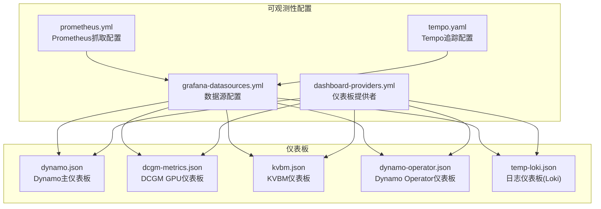
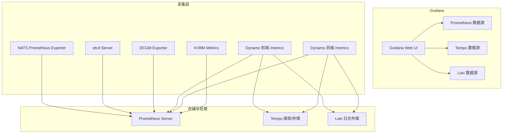
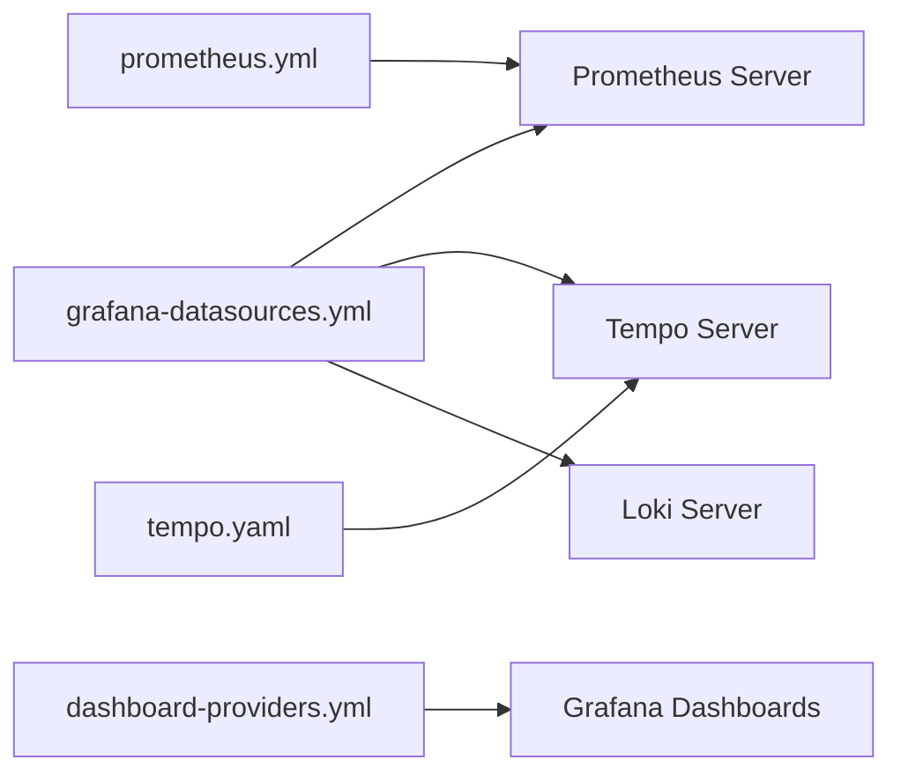

# Grafana仪表板

<cite>
**本文档引用的文件**
- [dynamo.json](file://deploy/observability/grafana_dashboards/dynamo.json)
- [dcgm-metrics.json](file://deploy/observability/grafana_dashboards/dcgm-metrics.json)
- [kvbm.json](file://deploy/observability/grafana_dashboards/kvbm.json)
- [dynamo-operator.json](file://deploy/observability/grafana_dashboards/dynamo-operator.json)
- [temp-loki.json](file://deploy/observability/grafana_dashboards/temp-loki.json)
- [dashboard-providers.yml](file://deploy/observability/grafana_dashboards/dashboard-providers.yml)
- [grafana-datasources.yml](file://deploy/observability/grafana-datasources.yml)
- [prometheus.yml](file://deploy/observability/prometheus.yml)
- [tempo.yaml](file://deploy/observability/tempo.yaml)
- [metrics.md](file://docs/observability/metrics.md)
- [prometheus-grafana.md](file://docs/observability/prometheus-grafana.md)
- [tracing.md](file://docs/observability/tracing.md)
- [metrics.md](file://docs/kubernetes/observability/metrics.md)
- [README.md](file://deploy/observability/grafana_dashboards/README.md)
</cite>

## 目录
1. [简介](#简介)
2. [项目结构](#项目结构)
3. [核心组件](#核心组件)
4. [架构总览](#架构总览)
5. [详细组件分析](#详细组件分析)
6. [依赖关系分析](#依赖关系分析)
7. [性能考虑](#性能考虑)
8. [故障排除指南](#故障排除指南)
9. [结论](#结论)
10. [附录](#附录)

## 简介
本文件为Dynamo项目的Grafana仪表板系统提供全面的技术文档。内容涵盖仪表板设计理念、布局原则、关键指标可视化与告警配置，以及Dynamo主仪表板、DCGM GPU仪表板、KVBM仪表板的功能说明。同时详细解释数据源配置（Prometheus与Tempo）、模板变量与动态过滤、自定义仪表板创建指南与最佳实践，并提供性能优化与共享配置方法。

## 项目结构
Grafana仪表板相关文件主要位于部署目录的可观测性子模块中，包含多个JSON格式的仪表板定义、数据源与提供者配置，以及Prometheus和Tempo的采集配置。

**图表来源**
- [grafana-datasources.yml](file://deploy/observability/grafana-datasources.yml#L18-L24)
- [dashboard-providers.yml](file://deploy/observability/grafana_dashboards/dashboard-providers.yml#L18-L29)
- [prometheus.yml](file://deploy/observability/prometheus.yml#L20-L63)
- [tempo.yaml](file://deploy/observability/tempo.yaml#L1-L37)
- [dynamo.json](file://deploy/observability/grafana_dashboards/dynamo.json#L1-L120)
- [dcgm-metrics.json](file://deploy/observability/grafana_dashboards/dcgm-metrics.json#L1-L120)
- [kvbm.json](file://deploy/observability/grafana_dashboards/kvbm.json#L1-L140)
- [dynamo-operator.json](file://deploy/observability/grafana_dashboards/dynamo-operator.json#L1-L120)
- [temp-loki.json](file://deploy/observability/grafana_dashboards/temp-loki.json#L1-L70)

**章节来源**
- [README.md](file://deploy/observability/grafana_dashboards/README.md#L1-L12)

## 核心组件
- 数据源配置：通过grafana-datasources.yml声明Prometheus数据源并设为默认数据源，确保所有仪表板可直接查询指标。
- 仪表板提供者：dashboard-providers.yml启用文件系统提供者，自动从指定路径加载仪表板JSON文件，并支持按文件夹结构组织仪表板。
- 抓取配置：prometheus.yml定义了NATS、etcd、DCGM、Dynamo前端/后端等多类目标的抓取任务与间隔，保证指标覆盖运行时各组件。
- 追踪配置：tempo.yaml提供OTLP接收端点、存储与压缩策略，支撑分布式追踪在Grafana Explore中的可视化。

**章节来源**
- [grafana-datasources.yml](file://deploy/observability/grafana-datasources.yml#L18-L24)
- [dashboard-providers.yml](file://deploy/observability/grafana_dashboards/dashboard-providers.yml#L18-L29)
- [prometheus.yml](file://deploy/observability/prometheus.yml#L20-L63)
- [tempo.yaml](file://deploy/observability/tempo.yaml#L1-L37)

## 架构总览
下图展示了Grafana仪表板与数据源、采集器及后端服务之间的交互关系：

**图表来源**
- [prometheus.yml](file://deploy/observability/prometheus.yml#L20-L63)
- [tempo.yaml](file://deploy/observability/tempo.yaml#L1-L37)
- [grafana-datasources.yml](file://deploy/observability/grafana-datasources.yml#L18-L24)

## 详细组件分析

### Dynamo主仪表板（dynamo.json）
设计理念与布局原则
- 分区式布局：将请求指标、延迟指标、序列长度、GPU/硬件指标、字节流量等分组展示，便于快速定位问题域。
- 多面板组合：同一指标采用不同聚合维度（如按请求类型、状态、模型）进行对比，支持多维分析。
- 时间窗口与采样：面板统一使用时间序列视图，结合速率函数与均值计算，平衡实时性与稳定性。

关键指标可视化
- 前端请求/秒：基于计数器速率，区分请求类型与状态，用于评估吞吐与错误率。
- 首Token时间、Token间延迟、请求时长：采用均值口径，标注单位毫秒，便于SLA监控。
- 输入/输出序列长度：分别展示平均输入长度与输出长度，辅助容量规划。
- GPU利用率与功耗：直接映射DCGM指标，支持多GPU并行观测。
- 组件字节流量：请求/响应字节速率，用于带宽与网络瓶颈诊断。

告警配置建议
- 请求失败率阈值：对“状态非2xx”的请求速率设定阈值，触发告警。
- 延迟上限：对首Token时间、请求时长的P95/P99设定上限阈值。
- GPU异常：GPU利用率持续高于阈值或温度超过上限时告警。
- 网络异常：字节速率骤降或异常升高。

模板变量与动态过滤
- 可选：在实际部署中，可在仪表板中增加模板变量（如模型名、命名空间、组件类型），通过PromQL过滤实现动态筛选。

**章节来源**
- [dynamo.json](file://deploy/observability/grafana_dashboards/dynamo.json#L24-L720)
- [metrics.md](file://docs/observability/metrics.md#L101-L175)

### DCGM GPU仪表板（dcgm-metrics.json）
设计理念与布局原则
- 专用GPU面板：聚焦GPU利用率、显存占用、温度、功耗、时钟频率、引擎活动、PCIe带宽等关键硬件指标。
- 单位与量程：明确百分比、字节、摄氏度、瓦特、赫兹等单位，便于跨集群横向对比。
- 聚合与细分：面板既提供整体趋势，也支持按GPU实例细分，便于定位热点设备。

关键指标可视化
- GPU利用率：按GPU实例分组显示，支持多GPU并行对比。
- 显存使用：已用/空闲显存曲线，辅助显存压力分析。
- 温度与功耗：温度与功耗阈值预警，防止热关机与能耗异常。
- 时钟频率：SM与内存频率变化，辅助性能调优。
- 引擎活动：图形引擎与张量核活动占比，反映计算负载类型。
- PCIe带宽：接收/发送字节速率，识别I/O瓶颈。

告警配置建议
- 利用率/温度/功耗阈值：针对GPU实例设置上限告警。
- 显存不足：已用显存接近上限时告警。
- 引擎异常：引擎活动异常波动可能指示驱动或拓扑问题。

**章节来源**
- [dcgm-metrics.json](file://deploy/observability/grafana_dashboards/dcgm-metrics.json#L25-L800)

### KVBM仪表板（kvbm.json）
设计理念与布局原则
- 分层展示：按缓存命中、卸载/上载、板卡管理三个维度组织面板，逻辑清晰。
- 指标粒度：覆盖命中率、匹配令牌数、设备/主机/磁盘块的卸载/上载速率等，满足不同运维视角需求。

关键指标可视化
- 缓存命中率：主机缓存与磁盘缓存命中率，用于评估缓存策略有效性。
- 匹配令牌数：反映KV匹配效率，辅助容量与预取策略优化。
- 卸载/上载速率：设备到主机、主机到磁盘、设备到磁盘（旁路）的块移动速率，定位数据迁移瓶颈。

告警配置建议
- 命中率下降：命中率低于阈值时告警，提示缓存策略或工作负载变化。
- 卸载/上载异常：速率异常升高或降低可能指示IO或内存压力。

**章节来源**
- [kvbm.json](file://deploy/observability/grafana_dashboards/kvbm.json#L24-L858)

### Dynamo Operator仪表板（dynamo-operator.json）
设计理念与布局原则
- 控制面可观测性：聚焦控制器协调、Webhook验证与资源库存，帮助Operator运维人员掌握平台健康状况。
- 动态模板变量：通过模板变量过滤资源类型、命名空间，提升多租户场景下的可操作性。

关键指标可视化
- 协调速率与持续时间：按资源类型与结果统计协调速率与P95持续时间。
- 协调错误：按资源类型与错误类型统计错误速率。
- Webhook请求与拒绝：按资源类型、操作与结果统计请求速率与P95持续时间；按资源类型、操作与原因统计拒绝速率。
- 资源库存：按状态与命名空间统计资源数量，支持按状态汇总卡片视图。

告警配置建议
- 协调错误率：错误速率超过阈值时告警。
- Webhook拒绝：拒绝速率上升可能指示准入策略或配置问题。
- 资源异常：库存异常波动可能指示资源泄漏或部署失败。

**章节来源**
- [dynamo-operator.json](file://deploy/observability/grafana_dashboards/dynamo-operator.json#L24-L800)

### 日志仪表板（temp-loki.json）
设计理念与布局原则
- 日志检索：以Loki为数据源，支持按命名空间、组件类型、DynamoGraph部署名称、Trace ID与关键词检索日志。
- 实时滚动：默认开启日志详情，便于快速定位问题。

关键指标可视化
- 日志流：按标签过滤的日志流，支持反向滚动与排序。
- 模板变量：命名空间、组件、部署、Trace ID、搜索关键词等，实现动态过滤。

告警配置建议
- 错误/致命日志：通过日志规则或Grafana告警规则对错误级别日志进行告警。
- Trace ID关联：结合Tempo追踪，通过Trace ID在日志与追踪之间建立关联。

**章节来源**
- [temp-loki.json](file://deploy/observability/grafana_dashboards/temp-loki.json#L22-L215)

## 依赖关系分析
- 数据源依赖：所有仪表板依赖Prometheus数据源；日志仪表板依赖Loki；追踪仪表板依赖Tempo。
- 抓取依赖：Prometheus抓取配置决定可用指标范围，需与组件暴露的/metrics端点一致。
- 提供者依赖：dashboard-providers.yml控制仪表板加载路径与更新周期，影响仪表板可见性与热更新能力。

**图表来源**
- [grafana-datasources.yml](file://deploy/observability/grafana-datasources.yml#L18-L24)
- [dashboard-providers.yml](file://deploy/observability/grafana_dashboards/dashboard-providers.yml#L18-L29)
- [prometheus.yml](file://deploy/observability/prometheus.yml#L20-L63)
- [tempo.yaml](file://deploy/observability/tempo.yaml#L1-L37)

**章节来源**
- [prometheus.yml](file://deploy/observability/prometheus.yml#L20-L63)
- [tempo.yaml](file://deploy/observability/tempo.yaml#L1-L37)
- [grafana-datasources.yml](file://deploy/observability/grafana-datasources.yml#L18-L24)
- [dashboard-providers.yml](file://deploy/observability/grafana_dashboards/dashboard-providers.yml#L18-L29)

## 性能考虑
- 抓取间隔与目标数量：合理设置抓取间隔，避免Prometheus过载；对高频指标使用更短抓取间隔，低频指标适当延长。
- 查询复杂度：避免在单个面板中使用过于复杂的PromQL，优先使用预聚合与记录规则。
- 图表渲染：减少面板数量与复杂动画，提高Grafana渲染性能。
- 存储与保留：根据业务需要调整Prometheus与Tempo的保留策略，平衡成本与查询时效性。
- 模板变量数量：限制模板变量的可选项数量，避免查询膨胀。

[本节为通用指导，无需特定文件引用]

## 故障排除指南
常见问题与排查步骤
- 仪表板空白或无数据
  - 检查Prometheus目标状态，确认抓取成功。
  - 验证Grafana数据源URL与认证信息。
  - 确认dashboard-providers.yml的路径与权限正确。
- 指标缺失
  - 检查组件是否正确暴露/metrics端点。
  - 核对prometheus.yml中的抓取目标与网络连通性。
- 追踪无法显示
  - 确认Dynamo组件已启用JSONL日志与OTLP导出。
  - 检查Tempo端点可达性与OTLP端口配置。
- 日志检索异常
  - 确认Loki服务可用，检查标签过滤条件与时间范围。

**章节来源**
- [prometheus-grafana.md](file://docs/observability/prometheus-grafana.md#L94-L107)
- [tracing.md](file://docs/observability/tracing.md#L1-L215)

## 结论
Dynamo的Grafana仪表板体系通过标准化的数据源配置、完善的抓取与追踪配置，以及分层次的仪表板设计，实现了从前端到后端、从软件到硬件的全栈可观测性。建议在生产环境中结合模板变量实现动态过滤，在Prometheus侧引入记录规则与告警规则，配合Loki与Tempo形成“指标+日志+追踪”的三位一体监控方案。

[本节为总结性内容，无需特定文件引用]

## 附录

### 数据源配置方法（Prometheus与Tempo）
- Prometheus数据源
  - 在grafana-datasources.yml中声明Prometheus数据源并设为默认。
  - 在prometheus.yml中配置抓取目标与间隔，确保与组件/metrics端点一致。
- Tempo数据源
  - 在grafana-datasources.yml中声明Tempo数据源（若未内置）。
  - 在tempo.yaml中配置OTLP接收端点与存储路径，确保Dynamo组件正确导出追踪。

**章节来源**
- [grafana-datasources.yml](file://deploy/observability/grafana-datasources.yml#L18-L24)
- [prometheus.yml](file://deploy/observability/prometheus.yml#L20-L63)
- [tempo.yaml](file://deploy/observability/tempo.yaml#L1-L37)

### 模板变量与动态过滤
- 在仪表板中添加模板变量，如模型名、命名空间、组件类型、部署名称等。
- 使用PromQL中的$var语法进行过滤，结合记录规则与告警规则实现自动化监控。

**章节来源**
- [dynamo-operator.json](file://deploy/observability/grafana_dashboards/dynamo-operator.json#L113-L125)
- [temp-loki.json](file://deploy/observability/grafana_dashboards/temp-loki.json#L103-L140)

### 自定义仪表板创建指南与最佳实践
- 设计阶段
  - 明确监控目标与关键指标，划分功能区域与面板分组。
  - 选择合适的图表类型（时间序列、分布直方图、状态卡片等）。
- 开发阶段
  - 先在PromQL编辑器中验证查询，再粘贴到仪表板。
  - 使用记录规则预聚合高频查询，减少Grafana压力。
- 发布阶段
  - 将仪表板以JSON形式放入dashboard-providers.yml指定的目录。
  - 通过Kubernetes ConfigMap或持久化挂载方式注入Grafana容器。

**章节来源**
- [dashboard-providers.yml](file://deploy/observability/grafana_dashboards/dashboard-providers.yml#L18-L29)
- [README.md](file://deploy/observability/grafana_dashboards/README.md#L1-L12)

### 仪表板性能优化与共享配置
- 性能优化
  - 合理设置查询时间范围与分辨率，避免过度采样。
  - 使用模板变量限制查询维度，减少面板数量。
  - 对复杂查询使用记录规则与告警规则。
- 共享配置
  - 通过Git管理仪表板JSON与提供者配置，实现版本控制与复用。
  - 在团队内共享模板变量与常用查询片段，统一监控口径。

**章节来源**
- [prometheus-grafana.md](file://docs/observability/prometheus-grafana.md#L78-L113)