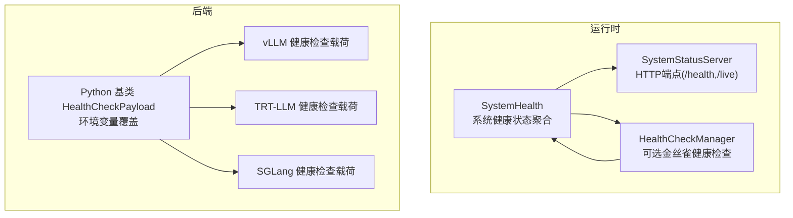
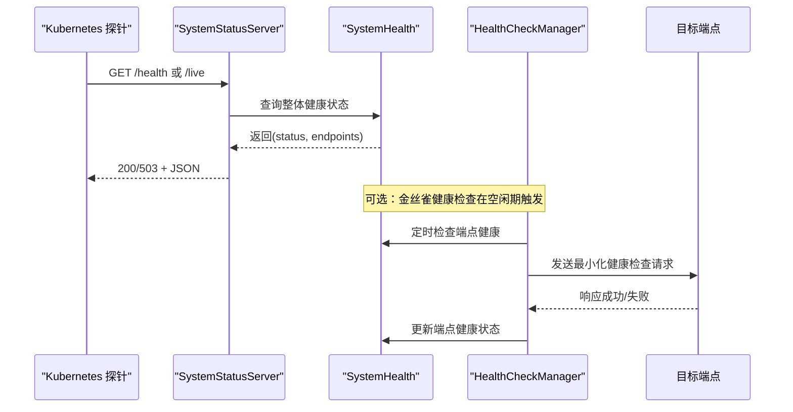
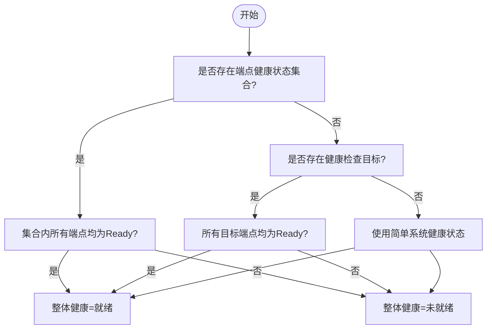
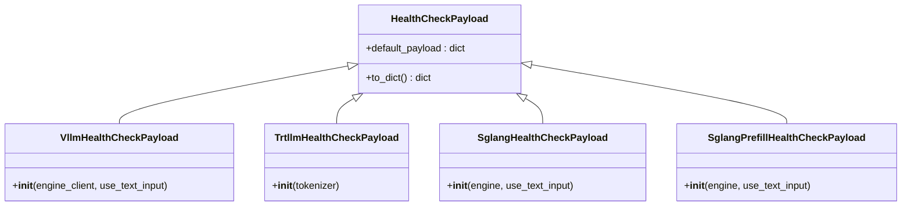
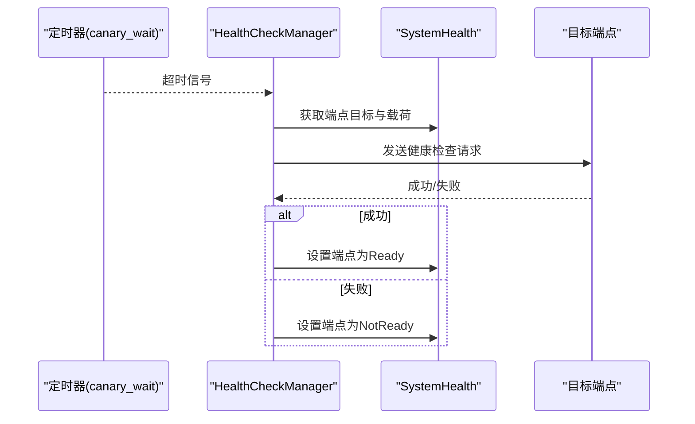
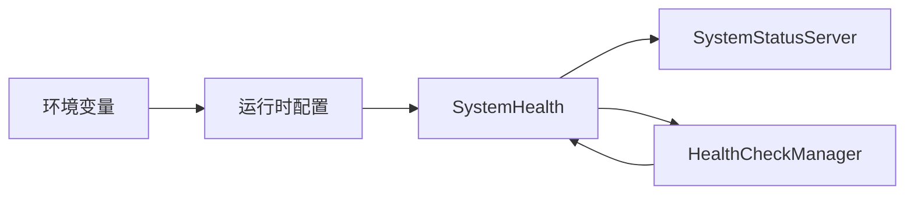

# 健康检查

<cite>
**本文引用的文件**
- [components/src/dynamo/sglang/health_check.py](file://components/src/dynamo/sglang/health_check.py)
- [components/src/dynamo/trtllm/health_check.py](file://components/src/dynamo/trtllm/health_check.py)
- [components/src/dynamo/vllm/health_check.py](file://components/src/dynamo/vllm/health_check.py)
- [lib/bindings/python/src/dynamo/health_check.py](file://lib/bindings/python/src/dynamo/health_check.py)
- [lib/runtime/src/system_health.rs](file://lib/runtime/src/system_health.rs)
- [lib/runtime/src/system_status_server.rs](file://lib/runtime/src/system_status_server.rs)
- [lib/runtime/src/health_check.rs](file://lib/runtime/src/health_check.rs)
- [lib/runtime/src/config.rs](file://lib/runtime/src/config.rs)
- [docs/observability/health-checks.md](file://docs/observability/health-checks.md)
- [docs/kubernetes/autoscaling.md](file://docs/kubernetes/autoscaling.md)
- [tests/fault_tolerance/test_vllm_health_check.py](file://tests/fault_tolerance/test_vllm_health_check.py)
- [fern/pages/kv-router-ab-testing.md](file://fern/pages/kv-router-ab-testing.md)
</cite>

## 目录
1. [简介](#简介)
2. [项目结构](#项目结构)
3. [核心组件](#核心组件)
4. [架构总览](#架构总览)
5. [详细组件分析](#详细组件分析)
6. [依赖关系分析](#依赖关系分析)
7. [性能考量](#性能考量)
8. [故障排除指南](#故障排除指南)
9. [结论](#结论)
10. [附录](#附录)

## 简介
本文件系统性地阐述Dynamo健康检查体系的设计与实现，覆盖以下关键主题：
- 健康检查端点（/health）与存活端点（/live）的差异与用途
- 启动阶段健康状态配置、端点级健康状态管理与动态切换
- 在Kubernetes中的集成方式及对自动扩缩容的影响
- 失败诊断方法与常见原因分析
- 配置最佳实践与故障排除指南
- 自定义健康检查逻辑的实现示例路径

## 项目结构
Dynamo的健康检查由“运行时健康状态管理”和“后端特定健康检查载荷”两部分组成：
- 运行时层：负责系统健康状态聚合、端点注册、HTTP端点暴露、可选的主动“金丝雀”健康检查任务
- 后端层：为不同推理引擎（vLLM、TensorRT-LLM、SGLang）提供最小化、快速且能验证完整推理链路的健康检查载荷

图表来源
- [lib/runtime/src/system_health.rs](file://lib/runtime/src/system_health.rs#L40-L139)
- [lib/runtime/src/system_status_server.rs](file://lib/runtime/src/system_status_server.rs#L132-L200)
- [lib/runtime/src/health_check.rs](file://lib/runtime/src/health_check.rs#L100-L187)
- [lib/bindings/python/src/dynamo/health_check.py](file://lib/bindings/python/src/dynamo/health_check.py#L63-L105)
- [components/src/dynamo/vllm/health_check.py](file://components/src/dynamo/vllm/health_check.py#L82-L121)
- [components/src/dynamo/trtllm/health_check.py](file://components/src/dynamo/trtllm/health_check.py#L51-L92)
- [components/src/dynamo/sglang/health_check.py](file://components/src/dynamo/sglang/health_check.py#L50-L121)

章节来源
- [lib/runtime/src/system_health.rs](file://lib/runtime/src/system_health.rs#L40-L139)
- [lib/runtime/src/system_status_server.rs](file://lib/runtime/src/system_status_server.rs#L132-L200)
- [lib/bindings/python/src/dynamo/health_check.py](file://lib/bindings/python/src/dynamo/health_check.py#L63-L105)
- [components/src/dynamo/vllm/health_check.py](file://components/src/dynamo/vllm/health_check.py#L82-L121)
- [components/src/dynamo/trtllm/health_check.py](file://components/src/dynamo/trtllm/health_check.py#L51-L92)
- [components/src/dynamo/sglang/health_check.py](file://components/src/dynamo/sglang/health_check.py#L50-L121)

## 核心组件
- 健康检查载荷基类与环境变量覆盖
  - Python基类提供默认载荷与环境变量覆盖能力，支持JSON字符串或文件路径两种格式
- 后端特定载荷
  - vLLM：根据是否使用文本输入选择prompt或token_ids，并注入最小采样与停止条件
  - TRT-LLM：基于分词器BOS ID构造token_ids，设置最小化采样与停止条件
  - SGLang：区分decode与prefill场景，确保请求结构符合处理器期望
- 运行时健康状态管理
  - 维护系统整体健康状态与端点级健康映射；支持通过环境变量声明需要参与“就绪”判定的端点集合
- HTTP端点
  - 暴露/health与/live，返回统一的JSON结构，包含status与各端点状态
- 可选金丝雀健康检查
  - 在无活动期间触发，向目标端点发送轻量请求以检测可用性，避免对正常流量造成影响

章节来源
- [lib/bindings/python/src/dynamo/health_check.py](file://lib/bindings/python/src/dynamo/health_check.py#L21-L105)
- [components/src/dynamo/vllm/health_check.py](file://components/src/dynamo/vllm/health_check.py#L52-L121)
- [components/src/dynamo/trtllm/health_check.py](file://components/src/dynamo/trtllm/health_check.py#L17-L92)
- [components/src/dynamo/sglang/health_check.py](file://components/src/dynamo/sglang/health_check.py#L20-L121)
- [lib/runtime/src/system_health.rs](file://lib/runtime/src/system_health.rs#L98-L139)
- [lib/runtime/src/system_status_server.rs](file://lib/runtime/src/system_status_server.rs#L159-L194)
- [lib/runtime/src/health_check.rs](file://lib/runtime/src/health_check.rs#L100-L187)

## 架构总览
Dynamo健康检查的端到端流程如下：

图表来源
- [lib/runtime/src/system_status_server.rs](file://lib/runtime/src/system_status_server.rs#L159-L194)
- [lib/runtime/src/system_health.rs](file://lib/runtime/src/system_health.rs#L98-L139)
- [lib/runtime/src/health_check.rs](file://lib/runtime/src/health_check.rs#L100-L187)

## 详细组件分析

### 健康检查端点与存活端点
- /health与/live在运行时中指向同一处理逻辑，返回一致的JSON结构
- 初次启动时默认为“未就绪”，当满足“端点健康状态集合”或“系统健康状态”要求后变为“就绪”
- 前端健康端点还会列出已注册的实例与端点信息；工作节点健康端点展示各端点的就绪状态

章节来源
- [lib/runtime/src/system_status_server.rs](file://lib/runtime/src/system_status_server.rs#L159-L194)
- [docs/observability/health-checks.md](file://docs/observability/health-checks.md#L16-L217)

### 系统健康状态与端点级健康状态
- SystemHealth维护：
  - 整体健康状态（Ready/NotReady）
  - 端点级健康映射（endpoint_subject -> Ready/NotReady）
  - 健康检查目标映射（endpoint_subject -> 实例与载荷）
  - 端点专属通知器（用于空闲检测与重置）
- 健康判定规则：
  - 若配置了“需参与就绪”的端点列表，则所有端点均需为Ready
  - 否则若存在健康检查目标，按目标全部Ready判定
  - 否则回退到简单系统健康状态

图表来源
- [lib/runtime/src/system_health.rs](file://lib/runtime/src/system_health.rs#L98-L139)

章节来源
- [lib/runtime/src/system_health.rs](file://lib/runtime/src/system_health.rs#L40-L139)

### 后端特定健康检查载荷
- vLLM
  - 支持文本输入(prompt)或token_ids两种模式，后者优先从引擎客户端的分词器组提取BOS ID
  - 默认仅生成1个token，禁用EOS，温度等采样参数设为极小值
- TRT-LLM
  - 从分词器（可能为包装后的HF分词器）提取BOS ID，构造token_ids
  - 提供stop_conditions与采样选项的最小集
- SGLang
  - decode场景：使用字典结构，包含stop_conditions、采样参数与BOS token
  - prefill场景：请求结构需包含request与sampling_params字段

图表来源
- [lib/bindings/python/src/dynamo/health_check.py](file://lib/bindings/python/src/dynamo/health_check.py#L63-L105)
- [components/src/dynamo/vllm/health_check.py](file://components/src/dynamo/vllm/health_check.py#L82-L121)
- [components/src/dynamo/trtllm/health_check.py](file://components/src/dynamo/trtllm/health_check.py#L51-L92)
- [components/src/dynamo/sglang/health_check.py](file://components/src/dynamo/sglang/health_check.py#L50-L121)

章节来源
- [components/src/dynamo/vllm/health_check.py](file://components/src/dynamo/vllm/health_check.py#L21-L121)
- [components/src/dynamo/trtllm/health_check.py](file://components/src/dynamo/trtllm/health_check.py#L17-L92)
- [components/src/dynamo/sglang/health_check.py](file://components/src/dynamo/sglang/health_check.py#L20-L121)
- [lib/bindings/python/src/dynamo/health_check.py](file://lib/bindings/python/src/dynamo/health_check.py#L21-L105)

### 可选金丝雀健康检查（主动监控）
- 触发条件：在无活动期间等待指定秒数后触发
- 执行动作：向目标端点发送最小化健康检查请求（通常生成1个token），超时则标记为未就绪
- 与HTTP端点的关系：/live与/health共享同一处理逻辑；金丝雀健康检查独立于HTTP端点，但会更新端点健康状态
- 默认行为：在Kubernetes中默认启用，在本地开发环境中默认关闭

图表来源
- [lib/runtime/src/health_check.rs](file://lib/runtime/src/health_check.rs#L125-L187)
- [lib/runtime/src/system_health.rs](file://lib/runtime/src/system_health.rs#L93-L96)

章节来源
- [lib/runtime/src/health_check.rs](file://lib/runtime/src/health_check.rs#L21-L187)
- [docs/observability/health-checks.md](file://docs/observability/health-checks.md#L219-L345)

### HTTP端点实现与响应
- 路由注册：/health与/live绑定到同一处理器
- 响应内容：包含status字段（ready/notready/live），以及端点级状态映射与运行时指标
- 端口与路径：可通过环境变量自定义端口与路径

章节来源
- [lib/runtime/src/system_status_server.rs](file://lib/runtime/src/system_status_server.rs#L159-L194)
- [docs/observability/health-checks.md](file://docs/observability/health-checks.md#L14-L26)

## 依赖关系分析
- 运行时配置与环境变量映射
  - 健康检查开关、超时、金丝雀等待时间等通过环境变量映射到运行时配置
- 端点注册与通知
  - SystemHealth维护端点目标与通知器，HealthCheckManager通过通道接收新端点注册
- HTTP端点与健康状态联动
  - SystemStatusServer读取SystemHealth的健康状态并返回

图表来源
- [lib/runtime/src/config.rs](file://lib/runtime/src/config.rs#L273-L303)
- [lib/runtime/src/system_health.rs](file://lib/runtime/src/system_health.rs#L40-L88)
- [lib/runtime/src/system_status_server.rs](file://lib/runtime/src/system_status_server.rs#L132-L153)
- [lib/runtime/src/health_check.rs](file://lib/runtime/src/health_check.rs#L100-L123)

章节来源
- [lib/runtime/src/config.rs](file://lib/runtime/src/config.rs#L273-L303)
- [lib/runtime/src/system_health.rs](file://lib/runtime/src/system_health.rs#L40-L88)
- [lib/runtime/src/system_status_server.rs](file://lib/runtime/src/system_status_server.rs#L132-L153)
- [lib/runtime/src/health_check.rs](file://lib/runtime/src/health_check.rs#L100-L123)

## 性能考量
- 金丝雀健康检查的频率与超时
  - canary_wait_time过短会增加额外负载；过长可能导致故障发现延迟
  - request_timeout过短可能误判慢响应；过长会延长故障感知时间
- 载荷大小与执行开销
  - 后端载荷设计为最小化（如仅生成1个token），以降低GPU与网络开销
- 并发与资源竞争
  - HealthCheckManager为每个端点独立任务，注意端点数量增长带来的并发压力

[本节为通用指导，无需具体文件引用]

## 故障排除指南
- 健康检查未生效
  - 确认DYN_HEALTH_CHECK_ENABLED已开启（K8s默认开启）
  - 确认DYN_SYSTEM_USE_ENDPOINT_HEALTH_STATUS包含目标端点
  - 确认工作节点已正确注册端点并对外提供服务
- 健康检查频繁超时
  - 增大DYN_HEALTH_CHECK_REQUEST_TIMEOUT
  - 检查工作节点日志与网络连通性
  - 评估canary_wait_time是否过短导致过于频繁的探测
- /health返回503
  - 初次启动默认为notready，待端点健康状态变为ready后才会返回200
  - 检查端点是否被SystemHealth识别并标记为Ready
- Kubernetes探针失败
  - 参考部署示例中的startupProbe、livenessProbe与readinessProbe配置
  - 确保探针端口与DYN_SYSTEM_PORT一致，路径与DYN_SYSTEM_HEALTH_PATH/DYN_SYSTEM_LIVE_PATH一致

章节来源
- [docs/observability/health-checks.md](file://docs/observability/health-checks.md#L324-L345)
- [fern/pages/kv-router-ab-testing.md](file://fern/pages/kv-router-ab-testing.md#L176-L199)

## 结论
Dynamo的健康检查体系通过“运行时健康状态聚合 + 后端最小化载荷 + 可选金丝雀主动探测”的组合，实现了对推理服务端到端可用性的可靠保障。结合Kubernetes探针与自动扩缩容策略，可在生产环境中实现更稳健的服务可用性与弹性伸缩。

[本节为总结，无需具体文件引用]

## 附录

### 在Kubernetes中的集成与自动扩缩容
- 探针配置建议
  - startupProbe：较长初始延迟与失败阈值，允许模型加载完成
  - livenessProbe：较短周期与超时，持续检测存活
  - readinessProbe：与liveness一致或稍长，确保流量只在真正可用时进入
- 自动扩缩容
  - 通过DynamoGraphDeploymentScalingAdapter与HPA/KEDA/Planner对接
  - 健康检查状态直接影响探针结果，从而影响扩缩容决策

章节来源
- [docs/kubernetes/autoscaling.md](file://docs/kubernetes/autoscaling.md#L175-L530)
- [fern/pages/kv-router-ab-testing.md](file://fern/pages/kv-router-ab-testing.md#L176-L199)

### 环境变量与配置要点
- 系统端口与路径
  - DYN_SYSTEM_PORT、DYN_SYSTEM_HEALTH_PATH、DYN_SYSTEM_LIVE_PATH
- 初始健康状态
  - DYN_SYSTEM_STARTING_HEALTH_STATUS
- 端点健康状态集合
  - DYN_SYSTEM_USE_ENDPOINT_HEALTH_STATUS
- 健康检查开关与参数
  - DYN_HEALTH_CHECK_ENABLED、DYN_CANARY_WAIT_TIME、DYN_HEALTH_CHECK_REQUEST_TIMEOUT

章节来源
- [docs/observability/health-checks.md](file://docs/observability/health-checks.md#L14-L26)
- [lib/runtime/src/config.rs](file://lib/runtime/src/config.rs#L273-L303)

### 自定义健康检查逻辑示例（实现路径）
- Python基类与环境变量覆盖
  - [lib/bindings/python/src/dynamo/health_check.py](file://lib/bindings/python/src/dynamo/health_check.py#L21-L105)
- vLLM预填充场景载荷
  - [components/src/dynamo/vllm/health_check.py](file://components/src/dynamo/vllm/health_check.py#L104-L121)
- TRT-LLM载荷
  - [components/src/dynamo/trtllm/health_check.py](file://components/src/dynamo/trtllm/health_check.py#L51-L92)
- SGLang载荷（含prefill）
  - [components/src/dynamo/sglang/health_check.py](file://components/src/dynamo/sglang/health_check.py#L88-L121)

### 测试与验证参考
- vLLM健康检查端到端测试（包含健康端点校验）
  - [tests/fault_tolerance/test_vllm_health_check.py](file://tests/fault_tolerance/test_vllm_health_check.py#L76-L93)