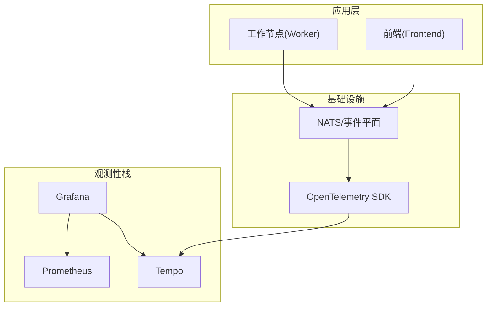
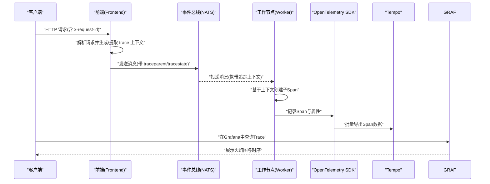
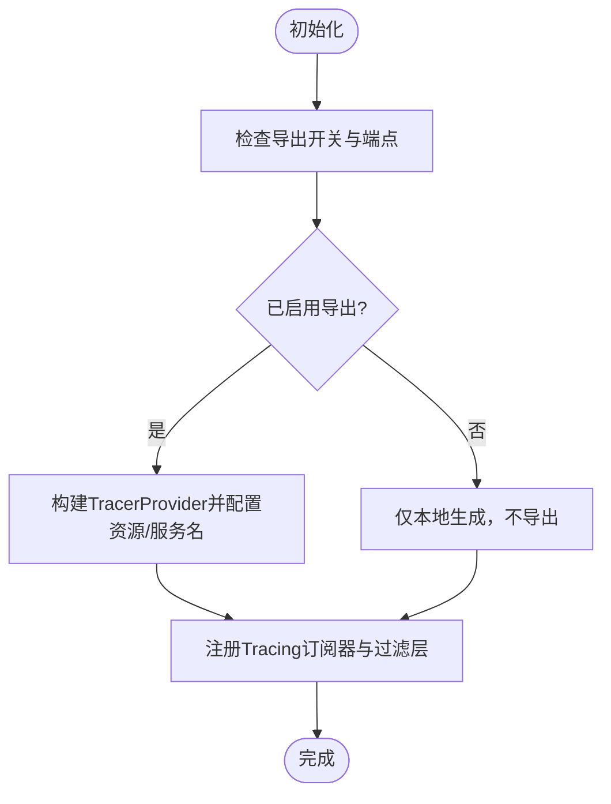
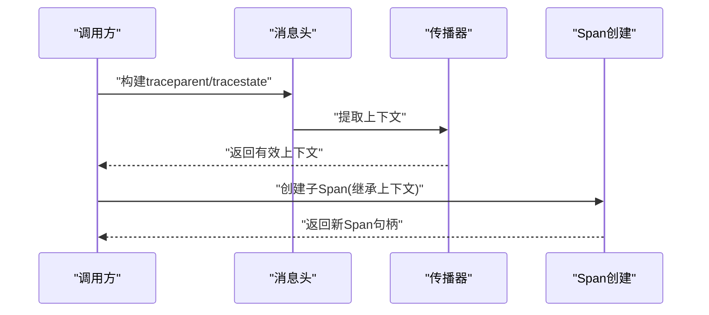
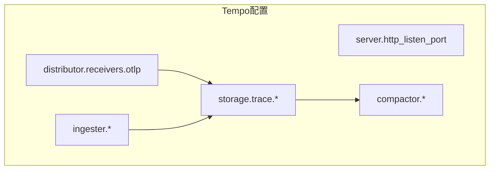
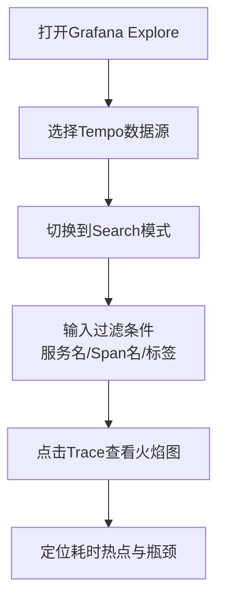
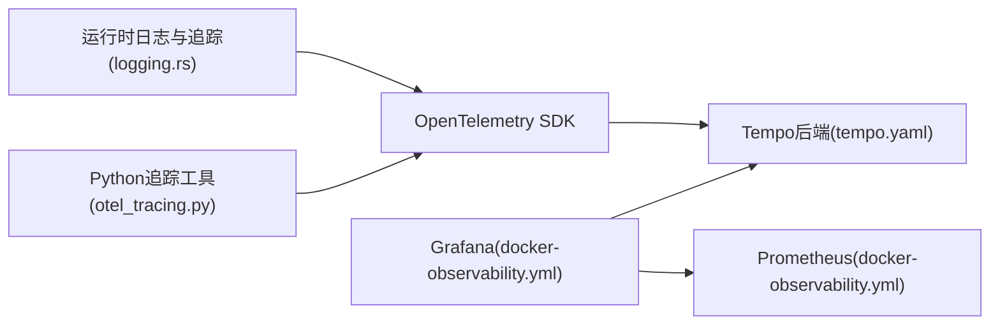

# 分布式追踪

<cite>
**本文引用的文件**
- [tracing.md](file://docs/observability/tracing.md)
- [tempo.yaml](file://deploy/observability/tempo.yaml)
- [docker-observability.yml](file://deploy/docker-observability.yml)
- [logging.rs](file://lib/runtime/src/logging.rs)
- [otel_tracing.py](file://components/src/dynamo/common/utils/otel_tracing.py)
- [grafana-datasources.yml](file://deploy/observability/grafana-datasources.yml)
- [temp-loki.json](file://deploy/observability/grafana_dashboards/temp-loki.json)
- [dashboard.json](file://deploy/observability/k8s/logging/grafana/dashboard.json)
</cite>

## 目录
1. [简介](#简介)
2. [项目结构](#项目结构)
3. [核心组件](#核心组件)
4. [架构总览](#架构总览)
5. [详细组件分析](#详细组件分析)
6. [依赖关系分析](#依赖关系分析)
7. [性能考量](#性能考量)
8. [故障排查指南](#故障排查指南)
9. [结论](#结论)
10. [附录](#附录)

## 简介
本文件面向Dynamo的分布式追踪系统，围绕OpenTelemetry集成、Span创建与传播、上下文管理、Tempo后端配置与使用、分布式请求链路可视化、采样策略与性能影响评估、查询语法与过滤条件、以及分布式调试最佳实践与常见问题诊断进行系统化说明。内容既覆盖代码级实现细节，也提供面向运维与开发的实操指引。

## 项目结构
Dynamo的追踪能力由以下部分协同构成：
- 文档与示例：用于环境变量配置、启动流程与可视化操作指导
- 运行时日志与追踪：在Rust运行时中初始化OpenTelemetry追踪器、注入/提取W3C Trace Context、生成Span并可导出到OTLP
- Python侧工具：构建trace headers以跨语言/进程传播追踪上下文
- 观测性栈：通过Docker Compose或Kubernetes部署Prometheus、Grafana、Tempo，并配置数据源与仪表盘

**图表来源**
- [docker-observability.yml](file://deploy/docker-observability.yml#L86-L136)
- [logging.rs](file://lib/runtime/src/logging.rs#L935-L995)
- [otel_tracing.py](file://components/src/dynamo/common/utils/otel_tracing.py#L12-L25)

**章节来源**
- [tracing.md](file://docs/observability/tracing.md#L1-L215)
- [docker-observability.yml](file://deploy/docker-observability.yml#L1-L138)

## 核心组件
- OpenTelemetry初始化与导出
  - 在运行时根据环境变量启用OTLP导出，设置服务名，注册Tracing订阅器与过滤层
  - 支持本地生成与远程导出两种模式
- 上下文传播与Span创建
  - 基于W3C Trace Context（traceparent/tracestate）在消息头中传递追踪上下文
  - 在进入关键处理阶段时创建子Span，确保父子关系正确
- Tempo后端配置
  - 配置接收端口、存储路径、压缩与保留策略
- 可视化与查询
  - Grafana中通过Tempo数据源进行Trace搜索与火焰图查看
  - 支持按服务名、Span名、标签等条件检索

**章节来源**
- [logging.rs](file://lib/runtime/src/logging.rs#L135-L156)
- [logging.rs](file://lib/runtime/src/logging.rs#L454-L523)
- [logging.rs](file://lib/runtime/src/logging.rs#L573-L589)
- [logging.rs](file://lib/runtime/src/logging.rs#L935-L995)
- [otel_tracing.py](file://components/src/dynamo/common/utils/otel_tracing.py#L12-L25)
- [tempo.yaml](file://deploy/observability/tempo.yaml#L1-L37)
- [tracing.md](file://docs/observability/tracing.md#L130-L151)

## 架构总览
下图展示了从请求进入前端、经事件平面分发到工作节点、在各组件内部创建Span并最终导出到Tempo的完整链路。

**图表来源**
- [logging.rs](file://lib/runtime/src/logging.rs#L484-L523)
- [logging.rs](file://lib/runtime/src/logging.rs#L573-L589)
- [docker-observability.yml](file://deploy/docker-observability.yml#L86-L136)
- [tracing.md](file://docs/observability/tracing.md#L113-L151)

## 详细组件分析

### OpenTelemetry初始化与导出
- 启用条件
  - 通过环境变量控制是否启用OTLP导出与JSONL日志格式
  - 服务名通过环境变量指定，用于区分不同组件
- 导出配置
  - 当启用导出时，SDK使用批处理导出器连接到OTLP端点
  - 关闭导出时，仍可在本地生成Span，便于日志内追踪ID核验
- 订阅器与过滤
  - 注册OpenTelemetry层与自定义追踪ID层，结合环境过滤器控制输出粒度

**图表来源**
- [logging.rs](file://lib/runtime/src/logging.rs#L935-L995)

**章节来源**
- [logging.rs](file://lib/runtime/src/logging.rs#L135-L156)
- [logging.rs](file://lib/runtime/src/logging.rs#L935-L995)

### 上下文传播与Span创建
- W3C Trace Context解析与注入
  - 从消息头中解析traceparent，提取trace_id与parent_span_id
  - 将上下文注入到OpenTelemetry传播器，生成有效的Span上下文
- 客户端Span创建
  - 在发起下游请求前，将当前上下文注入到消息头
  - 基于父上下文创建新的子Span，保证调用链连续性
- 跨语言传播
  - Python侧工具函数生成符合W3C规范的traceparent头，便于跨语言/进程传播

**图表来源**
- [logging.rs](file://lib/runtime/src/logging.rs#L484-L523)
- [logging.rs](file://lib/runtime/src/logging.rs#L573-L589)
- [otel_tracing.py](file://components/src/dynamo/common/utils/otel_tracing.py#L12-L25)

**章节来源**
- [logging.rs](file://lib/runtime/src/logging.rs#L212-L216)
- [logging.rs](file://lib/runtime/src/logging.rs#L484-L523)
- [logging.rs](file://lib/runtime/src/logging.rs#L573-L589)
- [otel_tracing.py](file://components/src/dynamo/common/utils/otel_tracing.py#L12-L25)

### Tempo后端配置与使用
- 接收端口
  - OTLP gRPC/HTTP接收端点对外暴露，供SDK导出使用
- 存储与压缩
  - WAL与本地块存储路径配置，支持块级压缩与保留策略
- 可视化
  - Grafana默认数据源指向Prometheus；Tempo数据源通过独立YAML配置
  - 提供示例仪表盘，支持按服务名、Span名、标签检索Trace

**图表来源**
- [tempo.yaml](file://deploy/observability/tempo.yaml#L4-L37)

**章节来源**
- [tempo.yaml](file://deploy/observability/tempo.yaml#L1-L37)
- [docker-observability.yml](file://deploy/docker-observability.yml#L86-L136)
- [tracing.md](file://docs/observability/tracing.md#L130-L151)
- [grafana-datasources.yml](file://deploy/observability/grafana-datasources.yml#L1-L24)

### 分布式请求链路可视化与性能瓶颈分析
- 可视化入口
  - Grafana Explore中选择Tempo数据源，使用“Search”模式按服务名、Span名、标签检索
- 查询与过滤
  - 支持按服务名、Span名称、标签键值（如x-request-id）进行过滤
  - 仪表盘提供组件类型、Trace ID、搜索关键字等筛选项
- 性能分析
  - 通过火焰图识别耗时热点，结合Span层级定位瓶颈所在组件与阶段

**图表来源**
- [tracing.md](file://docs/observability/tracing.md#L130-L151)
- [temp-loki.json](file://deploy/observability/grafana_dashboards/temp-loki.json#L141-L196)
- [dashboard.json](file://deploy/observability/k8s/logging/grafana/dashboard.json#L141-L196)

**章节来源**
- [tracing.md](file://docs/observability/tracing.md#L130-L151)
- [temp-loki.json](file://deploy/observability/grafana_dashboards/temp-loki.json#L141-L196)
- [dashboard.json](file://deploy/observability/k8s/logging/grafana/dashboard.json#L141-L196)

### 追踪采样策略与性能影响评估
- 采样策略
  - 运行时可基于W3C trace_flags字段控制采样（示例中固定采样位），实际部署可根据需求调整
- 性能影响
  - 启用导出会引入网络开销与序列化成本；批处理导出器有助于降低频繁写入的开销
  - 通过合理设置服务名与过滤层，减少无关Span与日志噪声，平衡可观测性与性能

**章节来源**
- [otel_tracing.py](file://components/src/dynamo/common/utils/otel_tracing.py#L21-L24)
- [logging.rs](file://lib/runtime/src/logging.rs#L935-L995)

### 追踪数据查询语法与过滤条件
- 常用过滤维度
  - 服务名：区分Frontend/Worker等组件
  - Span名：如http-request、handle_payload等
  - 标签：如x-request-id、trace_id等
- 仪表盘筛选
  - 组件类型、Trace ID、搜索关键字等交互式筛选项

**章节来源**
- [tracing.md](file://docs/observability/tracing.md#L136-L141)
- [temp-loki.json](file://deploy/observability/grafana_dashboards/temp-loki.json#L141-L196)
- [dashboard.json](file://deploy/observability/k8s/logging/grafana/dashboard.json#L141-L196)

## 依赖关系分析
- 组件耦合
  - 运行时通过OpenTelemetry SDK与传播器实现跨组件上下文一致性
  - Python工具负责生成标准trace headers，确保跨语言传播
- 外部依赖
  - Tempo作为分布式追踪后端，接收OTLP数据并提供查询接口
  - Grafana作为可视化界面，整合Prometheus与Tempo数据源

**图表来源**
- [logging.rs](file://lib/runtime/src/logging.rs#L935-L995)
- [otel_tracing.py](file://components/src/dynamo/common/utils/otel_tracing.py#L12-L25)
- [tempo.yaml](file://deploy/observability/tempo.yaml#L1-L37)
- [docker-observability.yml](file://deploy/docker-observability.yml#L86-L136)

**章节来源**
- [logging.rs](file://lib/runtime/src/logging.rs#L935-L995)
- [otel_tracing.py](file://components/src/dynamo/common/utils/otel_tracing.py#L12-L25)
- [tempo.yaml](file://deploy/observability/tempo.yaml#L1-L37)
- [docker-observability.yml](file://deploy/docker-observability.yml#L86-L136)

## 性能考量
- 导出频率与批处理
  - 使用批处理导出器降低网络与磁盘压力
- 过滤与采样
  - 通过环境过滤层减少冗余Span；根据trace_flags控制采样率
- 存储与保留
  - 合理设置块大小、最大块持续时间与保留周期，避免过度占用磁盘

[本节为通用建议，无需特定文件引用]

## 故障排查指南
- 无法看到Trace
  - 检查导出开关与端点是否正确配置
  - 确认服务名一致且消息头包含traceparent
- Trace缺失或断链
  - 核对trace_id与span_id格式（必须满足W3C规范）
  - 检查传播器是否正确注入/提取上下文
- Grafana无法连接Tempo
  - 确认Tempo数据源配置与端口映射
  - 检查容器网络与防火墙设置

**章节来源**
- [logging.rs](file://lib/runtime/src/logging.rs#L146-L156)
- [logging.rs](file://lib/runtime/src/logging.rs#L484-L523)
- [tracing.md](file://docs/observability/tracing.md#L130-L151)
- [docker-observability.yml](file://deploy/docker-observability.yml#L86-L136)

## 结论
Dynamo的分布式追踪体系以OpenTelemetry为核心，结合W3C Trace Context实现跨组件与跨语言的上下文传播，并通过Tempo与Grafana提供完整的可视化与分析能力。通过合理的采样与过滤策略，可在保障可观测性的同时控制性能开销。建议在生产环境中统一服务命名、严格校验trace_id/span_id格式，并利用仪表盘的多维过滤快速定位性能瓶颈。

[本节为总结性内容，无需特定文件引用]

## 附录
- 快速开始
  - 启动观测性栈，设置导出开关与端点，启动Frontend与Worker，发送请求并在Grafana中查看Trace
- Kubernetes部署
  - 在DynamoGraphDeployment中添加公共环境变量与各组件的服务名，确保Traces导出至集群内的Tempo实例

**章节来源**
- [tracing.md](file://docs/observability/tracing.md#L27-L151)
- [tracing.md](file://docs/observability/tracing.md#L155-L215)