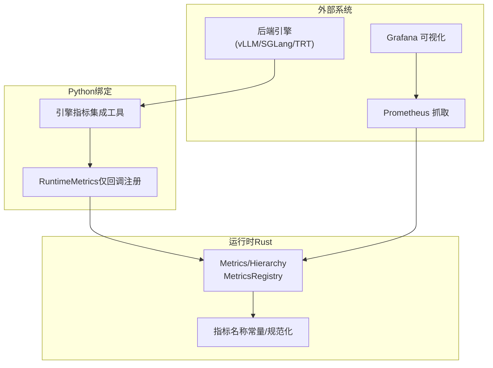
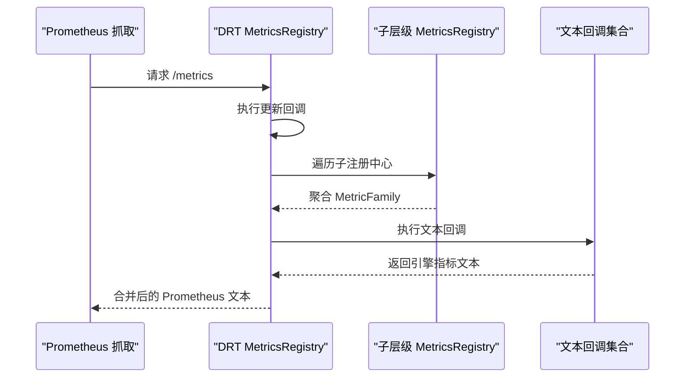
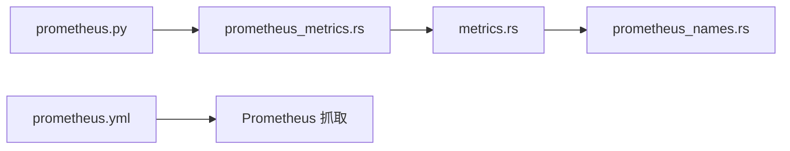

# 指标收集

<cite>
**本文引用的文件**
- [metrics.rs](file://lib/runtime/src/metrics.rs)
- [prometheus_names.rs](file://lib/runtime/src/metrics/prometheus_names.rs)
- [prometheus.py](file://components/src/dynamo/common/utils/prometheus.py)
- [prometheus_metrics.rs](file://lib/bindings/python/rust/prometheus_metrics.rs)
- [prometheus.yml](file://deploy/observability/prometheus.yml)
- [metrics.md](file://docs/observability/metrics.md)
- [metrics-developer-guide.md](file://docs/observability/metrics-developer-guide.md)
- [metrics.md（K8s）](file://docs/kubernetes/observability/metrics.md)
</cite>

## 目录
1. [简介](#简介)
2. [项目结构](#项目结构)
3. [核心组件](#核心组件)
4. [架构总览](#架构总览)
5. [详细组件分析](#详细组件分析)
6. [依赖关系分析](#依赖关系分析)
7. [性能考量](#性能考量)
8. [故障排查指南](#故障排查指南)
9. [结论](#结论)
10. [附录](#附录)

## 简介
本文件系统性梳理Dynamo的指标收集体系，覆盖Prometheus指标采集机制、指标类型与命名规范、标签管理策略、内置关键指标、自定义指标创建流程（Rust与Python）、指标查询与聚合、导出器配置与性能优化，以及最佳实践与常见问题。

## 项目结构
Dynamo的指标能力由运行时层统一提供，并通过Python绑定暴露给后端引擎（如vLLM/SGLang/TensorRT-LLM），最终在统一的/metrics端点以Prometheus文本格式输出。关键位置如下：
- 运行时指标API与注册中心：lib/runtime/src/metrics.rs
- 指标名称常量与规范化：lib/runtime/src/metrics/prometheus_names.rs
- Python侧引擎指标集成工具：components/src/dynamo/common/utils/prometheus.py
- Python绑定（仅回调注册，无指标创建）：lib/bindings/python/rust/prometheus_metrics.rs
- 观测性配置（Prometheus抓取任务）：deploy/observability/prometheus.yml
- 文档：docs/observability/metrics.md、docs/observability/metrics-developer-guide.md、docs/kubernetes/observability/metrics.md

图表来源
- [metrics.rs](file://lib/runtime/src/metrics.rs#L546-L574)
- [prometheus_names.rs](file://lib/runtime/src/metrics/prometheus_names.rs#L64-L83)
- [prometheus_metrics.rs](file://lib/bindings/python/rust/prometheus_metrics.rs#L20-L33)
- [prometheus.py](file://components/src/dynamo/common/utils/prometheus.py#L28-L77)
- [prometheus.yml](file://deploy/observability/prometheus.yml#L20-L50)

章节来源
- [metrics.rs](file://lib/runtime/src/metrics.rs#L546-L574)
- [prometheus_names.rs](file://lib/runtime/src/metrics/prometheus_names.rs#L64-L83)
- [prometheus.py](file://components/src/dynamo/common/utils/prometheus.py#L1-L240)
- [prometheus_metrics.rs](file://lib/bindings/python/rust/prometheus_metrics.rs#L1-L82)
- [prometheus.yml](file://deploy/observability/prometheus.yml#L1-L63)

## 核心组件
- 指标层级与注册中心
  - MetricsHierarchy：在DistributedRuntime/Namespace/Component/Endpoint上提供.metrics()访问点，统一生成自动标签（命名空间、组件、端点）。
  - MetricsRegistry：持有Prometheus Registry，支持子注册中心合并输出、更新回调、文本回调追加。
- 指标创建API
  - 支持Counter/Gauge/Histogram及对应Vec变体；支持自定义桶、常量标签；自动注入dynamo_namespace/dynamo_component/dynamo_endpoint标签。
- 名称与标签规范化
  - 统一前缀与后缀规则，避免重复；严格校验标签名合法性；提供前端前缀安全转换。
- Python侧集成
  - 提供register_engine_metrics_callback与get_prometheus_expfmt，用于将后端引擎指标拼接到Dynamo的/metrics输出中。

章节来源
- [metrics.rs](file://lib/runtime/src/metrics.rs#L380-L539)
- [metrics.rs](file://lib/runtime/src/metrics.rs#L605-L638)
- [prometheus_names.rs](file://lib/runtime/src/metrics/prometheus_names.rs#L16-L684)
- [prometheus.py](file://components/src/dynamo/common/utils/prometheus.py#L28-L240)
- [prometheus_metrics.rs](file://lib/bindings/python/rust/prometheus_metrics.rs#L20-L76)

## 架构总览
Dynamo的指标架构遵循“分层注册、统一合并”的设计：
- 分层注册：每个层级（Endpoint/Component/Namespace/DRT）维护独立Registry，按需注册指标。
- 合并输出：根级合并抓取时遍历所有子Registry，去重series，合并HELP/TYPE一致的MetricFamily。
- 自动标签：基于层级路径自动注入命名空间、组件、端点标签，避免冲突。
- 引擎指标拼接：通过文本回调将后端引擎指标拼接到/metrics输出。

图表来源
- [metrics.rs](file://lib/runtime/src/metrics.rs#L724-L830)
- [metrics.rs](file://lib/runtime/src/metrics.rs#L840-L878)

章节来源
- [metrics.rs](file://lib/runtime/src/metrics.rs#L688-L830)

## 详细组件分析

### 指标类型与命名规范
- 指标类型
  - 基础计数器/仪表盘：Counter、Gauge、IntCounter、IntGauge
  - 标签化向量：CounterVec、GaugeVec、IntCounterVec、IntGaugeVec
  - 直方图：Histogram（可自定义桶）
- 命名规范
  - 统一前缀：dynamo_component_（组件）、dynamo_frontend_（前端）
  - 后缀约定：时间用_seconds/_ms，字节用_bytes，总量用_total，百分比用_percent，当前值不加_total
  - 常见转换：避免_counter/_gauge/_time/_size等模糊后缀
- 标签管理
  - 自动标签：dynamo_namespace、dynamo_component、dynamo_endpoint
  - 标签名不允许冒号，且禁止以双下划线开头（保留给Prometheus内部）

章节来源
- [prometheus_names.rs](file://lib/runtime/src/metrics/prometheus_names.rs#L16-L684)
- [metrics.rs](file://lib/runtime/src/metrics.rs#L389-L406)

### 内置关键指标
- 后端组件（dynamo_component_*）
  - inflight_requests：当前处理中的请求数（仪表盘）
  - request_bytes_total / response_bytes_total：请求/响应字节数（累计计数器）
  - request_duration_seconds：请求处理时延直方图
  - requests_total：请求总数（累计计数器）
  - uptime_seconds：分布式运行时启动时长（仪表盘）
- 前端服务（dynamo_frontend_*）
  - inflight_requests、queued_requests、disconnected_clients（仪表盘）
  - input_sequence_tokens、output_sequence_tokens、cached_tokens（直方图）
  - inter_token_latency_seconds、time_to_first_token_seconds（直方图）
  - output_tokens_total（累计计数器）
  - model_*系列：来自Worker注册的模型配置信息（上下文长度、KV块大小、最大序列数等）

章节来源
- [metrics.md](file://docs/observability/metrics.md#L103-L175)

### 自定义指标创建（Rust）
- 访问路径：DistributedRuntime/Namespace/Component/Endpoint均提供.metrics()方法
- 创建方法
  - create_counter/create_gauge/create_histogram
  - create_countervec/create_gaugevec/create_intcountervec/create_intgaugevec
- 使用要点
  - Histogram可传入自定义桶；Vector类指标需提供标签名列表
  - 自动注入dynamo_*标签，用户不可手动设置同名标签
  - 常量标签与动态标签组合使用

章节来源
- [metrics-developer-guide.md](file://docs/observability/metrics-developer-guide.md#L29-L138)
- [metrics.rs](file://lib/runtime/src/metrics.rs#L410-L539)

### 自定义指标创建（Python）
- 仅能注册“文本回调”，将外部引擎指标拼接到/metrics输出
- 关键函数
  - register_engine_metrics_callback：注册回调，支持过滤前缀、排除前缀、添加前缀
  - get_prometheus_expfmt：从引擎Registry生成Prometheus文本，支持多进程CollectorRegistry
- 注意事项
  - prometheus_client导入时机：需在SGLang设置多进程目录后再导入，避免TokenizerMetricsCollector异常

章节来源
- [prometheus.py](file://components/src/dynamo/common/utils/prometheus.py#L28-L240)
- [prometheus_metrics.rs](file://lib/bindings/python/rust/prometheus_metrics.rs#L20-L76)

### 指标查询与聚合
- 查询入口：Prometheus表达式浏览器或Grafana面板
- 常用聚合
  - rate/delta：计算增量速率（如每秒请求数）
  - irate：瞬时变化率（适合突发流量）
  - increase：累计增量（适合计数器）
  - histogram_quantile：从直方图计算分位数（如P50/P95/P99）
  - sum by（...）：按标签聚合
- 示例查询（基于内置指标）
  - 总请求速率：rate(dynamo_component_requests_total[5m])
  - 平均请求时延：histogram_quantile(0.95, sum by(le, __name__) (rate(dynamo_component_request_duration_seconds_bucket[5m])))
  - 当前并发：dynamo_component_inflight_requests
  - 首Token时延分位：histogram_quantile(0.90, rate(dynamo_frontend_time_to_first_token_seconds_bucket[5m]))

章节来源
- [metrics.md](file://docs/observability/metrics.md#L152-L156)

### 导出器配置与抓取
- Prometheus配置
  - 静态目标：nats、etcd、dcgm-exporter、Dynamo前端（8000）、Dynamo后端（默认8081，可通过环境变量DYN_SYSTEM_PORT调整）
  - 抓取间隔：根据组件特性设置（如NATS/etcd 2s，Dynamo组件6s，前端10s，GPU 5s）
- Kubernetes观测
  - 通过PodMonitor自动发现Dynamo组件（启用metrics标签）
  - Grafana仪表板：Dynamo前端请求率、首Token时延、请求时延、输入/输出序列长度、GPU/节点/CPU/内存等

章节来源
- [prometheus.yml](file://deploy/observability/prometheus.yml#L16-L63)
- [metrics.md（K8s）](file://docs/kubernetes/observability/metrics.md#L107-L175)

## 依赖关系分析
- 运行时指标API依赖Prometheus库进行注册与序列化
- Python绑定仅暴露回调注册接口，指标创建在Rust侧完成
- 引擎指标通过文本拼接方式接入，避免直接耦合Prometheus类型

图表来源
- [metrics.rs](file://lib/runtime/src/metrics.rs#L23-L26)
- [prometheus_metrics.rs](file://lib/bindings/python/rust/prometheus_metrics.rs#L10-L13)
- [prometheus.py](file://components/src/dynamo/common/utils/prometheus.py#L14-L25)
- [prometheus.yml](file://deploy/observability/prometheus.yml#L20-L50)

章节来源
- [metrics.rs](file://lib/runtime/src/metrics.rs#L1-L50)
- [prometheus_metrics.rs](file://lib/bindings/python/rust/prometheus_metrics.rs#L1-L20)
- [prometheus.py](file://components/src/dynamo/common/utils/prometheus.py#L1-L25)
- [prometheus.yml](file://deploy/observability/prometheus.yml#L1-L20)

## 性能考量
- 指标数量与标签基数控制
  - 避免高基数标签（如用户ID、请求ID）；对模型名、设备ID等有限枚举使用常量标签
- 直方图桶选择
  - 结合业务时延分布设定桶，避免过细导致Series过多或过粗影响分位计算精度
- 回调执行开销
  - 文本回调应尽量轻量；必要时缓存编译正则表达式（已内置LRU缓存）
- 合并输出稳定性
  - 合并时对重复series进行告警与去重，确保抓取稳定性

## 故障排查指南
- 指标未出现
  - 确认DYN_SYSTEM_PORT已设置且端口可达；检查/metrics端点是否返回dynamo_*前缀指标
- 标签名冲突或非法
  - 自动标签不可手动设置；标签名不得含冒号且不能以双下划线开头
- 引擎指标缺失
  - 确认register_engine_metrics_callback已正确注册；检查过滤/排除前缀逻辑；确认prometheus_client导入时机
- 抓取失败
  - 检查Prometheus静态目标与网络连通性；核对抓取间隔与目标存活状态

章节来源
- [metrics-developer-guide.md](file://docs/observability/metrics-developer-guide.md#L10-L22)
- [prometheus.py](file://components/src/dynamo/common/utils/prometheus.py#L28-L77)
- [prometheus.yml](file://deploy/observability/prometheus.yml#L36-L50)

## 结论
Dynamo通过统一的运行时指标API与层级化注册机制，实现了跨组件的一致可观测性；结合Python侧引擎指标拼接与完善的命名/标签规范，既保证了易用性也兼顾了可维护性。建议在生产环境中严格控制标签基数、合理设置直方图桶、利用聚合函数进行高效查询，并通过Kubernetes自动发现简化抓取配置。

## 附录
- 快速开始
  - 启动前端与后端组件，分别在8000与8081端口暴露指标
  - 使用Prometheus抓取配置文件进行抓取，或在K8s中通过PodMonitor自动发现
- 相关文档
  - 指标概览与可用指标：docs/observability/metrics.md
  - 开发者指南（Rust自定义指标）：docs/observability/metrics-developer-guide.md
  - Kubernetes观测指南：docs/kubernetes/observability/metrics.md