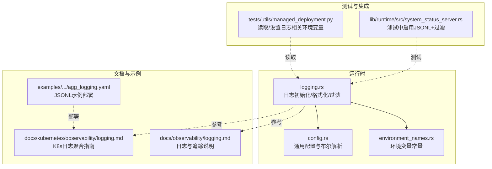
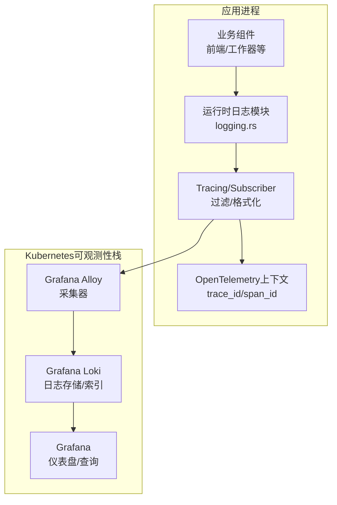
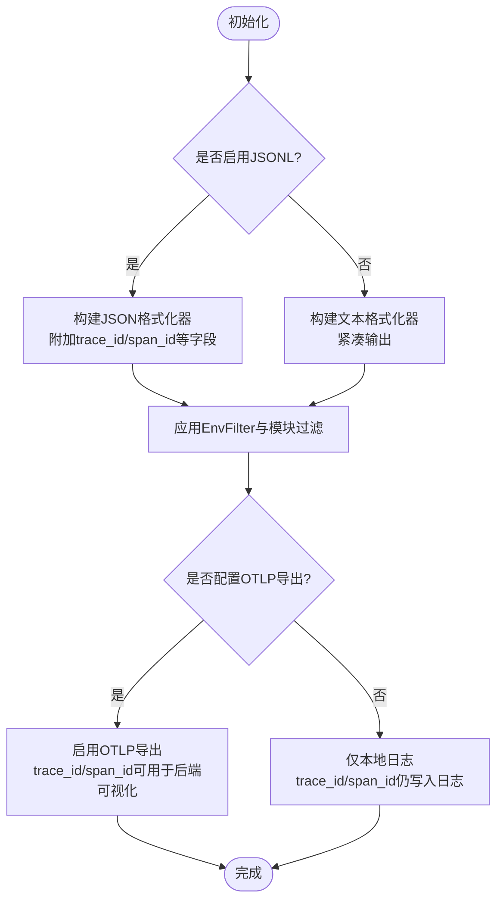
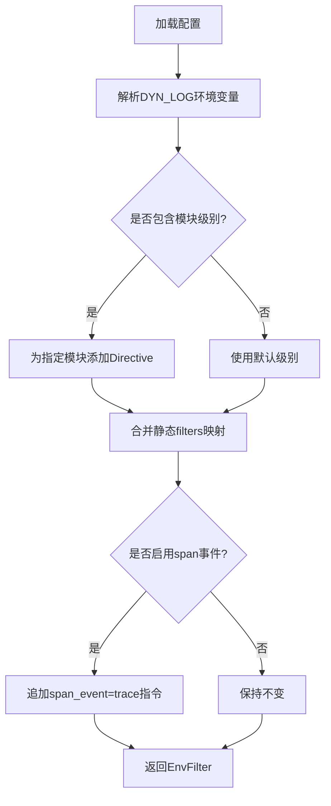
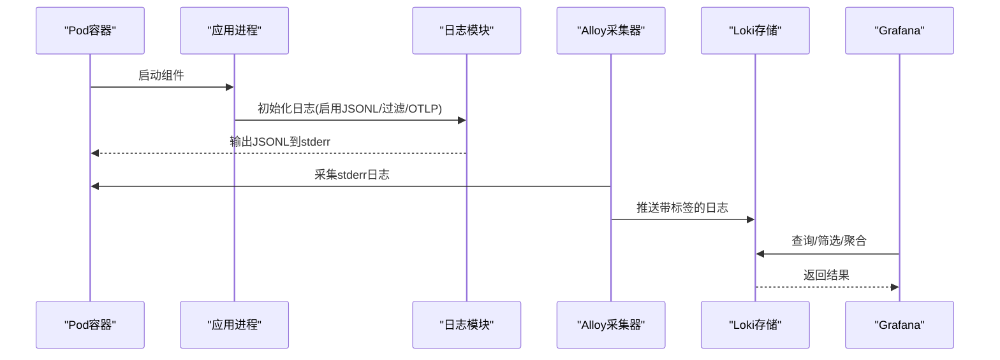
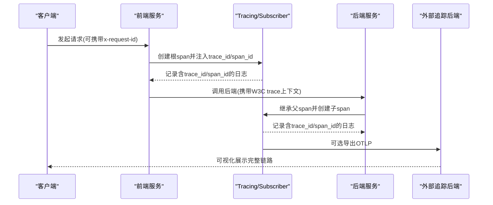
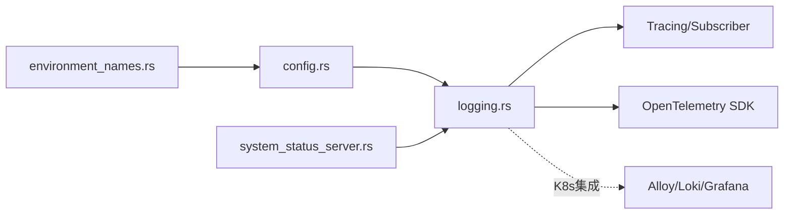

# 日志系统

<cite>
**本文引用的文件**
- [lib/rust/src/logging.rs](file://lib/rust/src/logging.rs)
- [lib/rust/src/config.rs](file://lib/rust/src/config.rs)
- [lib/rust/src/config/environment_names.rs](file://lib/rust/src/config/environment_names.rs)
- [docs/kubernetes/observability/logging.md](file://docs/kubernetes/observability/logging.md)
- [docs/observability/logging.md](file://docs/observability/logging.md)
- [examples/backends/sglang/deploy/agg_logging.yaml](file://examples/backends/sglang/deploy/agg_logging.yaml)
- [tests/utils/managed_deployment.py](file://tests/utils/managed_deployment.py)
- [lib/runtime/src/system_status_server.rs](file://lib/runtime/src/system_status_server.rs)
</cite>

## 目录
1. [简介](#简介)
2. [项目结构](#项目结构)
3. [核心组件](#核心组件)
4. [架构总览](#架构总览)
5. [详细组件分析](#详细组件分析)
6. [依赖关系分析](#依赖关系分析)
7. [性能考量](#性能考量)
8. [故障排查指南](#故障排查指南)
9. [结论](#结论)
10. [附录](#附录)

## 简介
本文件系统性阐述Dynamo的日志体系：结构化日志（可选JSONL与可读文本）的实现机制、日志级别与过滤规则、输出目标与可观测性栈集成、分布式追踪上下文注入与统一标识符传递、以及在Kubernetes环境中的日志聚合与检索方案。同时给出性能优化与存储成本控制建议，并提供最佳实践与排障方法。

## 项目结构
Dynamo的日志能力由Rust运行时模块提供，核心位于lib/rust/src/logging.rs；配置解析与环境变量定义位于lib/rust/src/config.rs与lib/rust/src/config/environment_names.rs；Kubernetes侧的日志聚合与可视化参考docs/kubernetes/observability/logging.md；开发者快速上手与示例参考docs/observability/logging.md；示例部署中通过环境变量启用JSONL格式；测试工具中也对日志相关环境变量进行读取与设置。

**图表来源**
- [lib/rust/src/logging.rs](file://lib/rust/src/logging.rs#L1-L1464)
- [lib/rust/src/config.rs](file://lib/rust/src/config.rs#L458-L483)
- [lib/rust/src/config/environment_names.rs](file://lib/rust/src/config/environment_names.rs#L32-L55)
- [docs/kubernetes/observability/logging.md](file://docs/kubernetes/observability/logging.md#L1-L155)
- [docs/observability/logging.md](file://docs/observability/logging.md#L1-L263)
- [examples/backends/sglang/deploy/agg_logging.yaml](file://examples/backends/sglang/deploy/agg_logging.yaml#L1-L44)
- [tests/utils/managed_deployment.py](file://tests/utils/managed_deployment.py#L315-L352)
- [lib/runtime/src/system_status_server.rs](file://lib/runtime/src/system_status_server.rs#L869-L885)

**章节来源**
- [lib/rust/src/logging.rs](file://lib/rust/src/logging.rs#L1-L1464)
- [lib/rust/src/config.rs](file://lib/rust/src/config.rs#L458-L483)
- [lib/rust/src/config/environment_names.rs](file://lib/rust/src/config/environment_names.rs#L32-L55)
- [docs/kubernetes/observability/logging.md](file://docs/kubernetes/observability/logging.md#L1-L155)
- [docs/observability/logging.md](file://docs/observability/logging.md#L1-L263)
- [examples/backends/sglang/deploy/agg_logging.yaml](file://examples/backends/sglang/deploy/agg_logging.yaml#L1-L44)
- [tests/utils/managed_deployment.py](file://tests/utils/managed_deployment.py#L315-L352)
- [lib/runtime/src/system_status_server.rs](file://lib/runtime/src/system_status_server.rs#L869-L885)

## 核心组件
- 结构化日志格式选择
  - 可读文本（默认）：适合本地开发与人类阅读。
  - JSONL（可选）：便于机器解析与日志聚合系统采集，支持trace_id、span_id等追踪字段。
- 过滤与级别
  - 支持按模块路径粒度过滤，环境变量DYN_LOG或配置文件filters键生效。
  - 默认级别为info，可通过环境变量或配置文件调整。
- 追踪上下文
  - 在JSONL模式下自动注入trace_id、span_id、span_name等字段，便于跨服务关联。
  - 可通过DYN_LOGGING_SPAN_EVENTS开启span事件（如首次进入/关闭）记录。
- 时间与时区
  - 默认UTC时间戳；可通过DYN_LOG_USE_LOCAL_TZ切换为本地时区。
- 输出目标
  - 默认输出到stderr；在Kubernetes环境中配合Loki/Alloy进行采集与查询。

**章节来源**
- [lib/rust/src/logging.rs](file://lib/rust/src/logging.rs#L1-L1464)
- [docs/observability/logging.md](file://docs/observability/logging.md#L1-L263)

## 架构总览
Dynamo日志子系统以Tracing/Subscriber生态为核心，结合OpenTelemetry上下文传播，在Rust侧完成日志格式化、过滤与导出配置。在Kubernetes环境下，通过Alloy收集容器stderr中的JSONL日志并推送到Loki，再在Grafana中进行查询与可视化。

**图表来源**
- [lib/rust/src/logging.rs](file://lib/rust/src/logging.rs#L901-L996)
- [docs/kubernetes/observability/logging.md](file://docs/kubernetes/observability/logging.md#L1-L155)

## 详细组件分析

### 结构化日志实现与格式选择
- 初始化流程
  - 首次调用init()时，根据环境变量与配置文件构建EnvFilter与格式化器，随后注册到全局订阅器。
  - 若启用JSONL，则使用自定义JSON格式化器，输出包含时间、级别、消息、目标、文件/行号及追踪字段。
  - 若未启用JSONL，则使用紧凑文本格式化器，输出更易读的文本日志。
- JSON Schema校验
  - 提供JSONL行级Schema，用于验证每行日志字段完整性与格式正确性，便于在CI或测试中捕获异常。
- 时间与时区
  - 使用TimeFormatter统一生成时间戳，支持UTC与本地时区两种格式。

**图表来源**
- [lib/rust/src/logging.rs](file://lib/rust/src/logging.rs#L901-L996)
- [lib/rust/src/logging.rs](file://lib/rust/src/logging.rs#L1057-L1111)
- [lib/rust/src/logging.rs](file://lib/rust/src/logging.rs#L1360-L1449)

**章节来源**
- [lib/rust/src/logging.rs](file://lib/rust/src/logging.rs#L1-L1464)

### 日志级别管理与过滤规则
- 级别与默认值
  - 默认级别为info；可通过DYN_LOG设置全局级别与模块特定级别。
  - 模块过滤支持逗号分隔的key=value对，key为crate/module路径，value为级别。
- 配置来源优先级
  - 环境变量最高优先级；其次可选TOML配置文件（通过DYN_LOGGING_CONFIG_PATH或默认路径）。
- 内置静默第三方库噪声
  - 默认对若干高频第三方库设置较高阈值，避免干扰业务日志。

**图表来源**
- [lib/rust/src/logging.rs](file://lib/rust/src/logging.rs#L998-L1022)
- [lib/rust/src/logging.rs](file://lib/rust/src/logging.rs#L1046-L1055)

**章节来源**
- [lib/rust/src/logging.rs](file://lib/rust/src/logging.rs#L1-L1464)

### 输出目标与Kubernetes日志聚合
- 输出目标
  - 默认输出至stderr；在容器中可被Alloy采集器收集。
- Loki/Alloy集成
  - 通过Alloy从Kubernetes API或容器目录采集日志，将日志标签映射到Loki标签（如level、namespace、组件类型等），便于查询与筛选。
- 示例部署
  - 示例DynamoGraphDeployment通过设置DYN_LOGGING_JSONL=1启用结构化日志，便于与Loki/Alloy配合。

**图表来源**
- [docs/kubernetes/observability/logging.md](file://docs/kubernetes/observability/logging.md#L1-L155)
- [examples/backends/sglang/deploy/agg_logging.yaml](file://examples/backends/sglang/deploy/agg_logging.yaml#L1-L44)

**章节来源**
- [docs/kubernetes/observability/logging.md](file://docs/kubernetes/observability/logging.md#L1-L155)
- [examples/backends/sglang/deploy/agg_logging.yaml](file://examples/backends/sglang/deploy/agg_logging.yaml#L1-L44)

### 分布式追踪集成与统一标识符
- 上下文注入
  - 在JSONL模式下自动注入trace_id、span_id、span_name等字段，便于跨服务关联。
  - 支持从请求头（如x-request-id）提取并注入到追踪上下文中，形成统一请求标识。
- OTLP导出
  - 可通过OTEL_EXPORT_ENABLED与OTEL_EXPORTER_OTLP_TRACES_ENDPOINT等环境变量启用OTLP导出，将追踪数据发送至外部后端（如Tempo/Jaeger）。
- 测试与验证
  - 测试中通过临时环境变量组合（如DYN_LOGGING_JSONL、DYN_LOG）验证日志中trace_id一致性与span关系。

**图表来源**
- [lib/rust/src/logging.rs](file://lib/rust/src/logging.rs#L616-L710)
- [lib/rust/src/logging.rs](file://lib/rust/src/logging.rs#L901-L996)
- [docs/observability/logging.md](file://docs/observability/logging.md#L1-L263)
- [lib/runtime/src/system_status_server.rs](file://lib/runtime/src/system_status_server.rs#L869-L885)

**章节来源**
- [lib/rust/src/logging.rs](file://lib/rust/src/logging.rs#L616-L710)
- [lib/rust/src/logging.rs](file://lib/rust/src/logging.rs#L901-L996)
- [docs/observability/logging.md](file://docs/observability/logging.md#L1-L263)
- [lib/runtime/src/system_status_server.rs](file://lib/runtime/src/system_status_server.rs#L869-L885)

### 环境变量与配置要点
- 关键环境变量
  - DYN_LOGGING_JSONL：启用JSONL格式（推荐与Loki/Alloy配合）
  - DYN_LOG：模块级过滤规则（如info,dynamo_runtime::system_status_server:trace）
  - DYN_LOG_USE_LOCAL_TZ：使用本地时区
  - DYN_LOGGING_SPAN_EVENTS：开启span事件记录
  - DYN_LOGGING_CONFIG_PATH：自定义TOML配置路径
  - OTEL_EXPORT_ENABLED/OTEL_EXPORTER_OTLP_TRACES_ENDPOINT/OTEL_SERVICE_NAME：OTLP导出配置
- 配置加载顺序
  - 环境变量 > 自定义TOML > 默认路径(/opt/dynamo/etc/logging.toml)

**章节来源**
- [lib/rust/src/config/environment_names.rs](file://lib/rust/src/config/environment_names.rs#L32-L55)
- [lib/rust/src/config.rs](file://lib/rust/src/config.rs#L458-L483)
- [lib/rust/src/logging.rs](file://lib/rust/src/logging.rs#L1046-L1055)
- [docs/observability/logging.md](file://docs/observability/logging.md#L1-L263)

## 依赖关系分析
- 模块耦合
  - logging.rs依赖config.rs提供的布尔解析与环境变量常量，确保配置加载与行为一致。
  - system_status_server.rs在测试场景中组合使用JSONL与过滤，验证日志输出。
- 外部依赖
  - Tracing/Subscriber用于事件格式化与过滤。
  - OpenTelemetry SDK用于上下文传播与可选导出。
  - Kubernetes可观测性栈（Alloy/Loki/Grafana）用于日志采集与可视化。

**图表来源**
- [lib/rust/src/config/environment_names.rs](file://lib/rust/src/config/environment_names.rs#L32-L55)
- [lib/rust/src/config.rs](file://lib/rust/src/config.rs#L458-L483)
- [lib/rust/src/logging.rs](file://lib/rust/src/logging.rs#L901-L996)
- [lib/runtime/src/system_status_server.rs](file://lib/runtime/src/system_status_server.rs#L869-L885)

**章节来源**
- [lib/rust/src/config/environment_names.rs](file://lib/rust/src/config/environment_names.rs#L32-L55)
- [lib/rust/src/config.rs](file://lib/rust/src/config.rs#L458-L483)
- [lib/rust/src/logging.rs](file://lib/rust/src/logging.rs#L901-L996)
- [lib/runtime/src/system_status_server.rs](file://lib/runtime/src/system_status_server.rs#L869-L885)

## 性能考量
- 日志级别与过滤
  - 将非关键模块提升至更高级别（如error），减少INFO/DEBUG开销。
  - 使用模块级过滤，避免无关模块频繁格式化与序列化。
- JSONL与文本格式
  - 生产环境建议启用JSONL，便于高效解析与索引；本地调试可使用文本格式提高可读性。
- OTLP导出
  - 导出会引入额外网络与序列化开销，仅在需要可视化追踪时启用。
- 时区与格式化
  - 本地时区可能带来格式化开销，生产建议使用UTC。
- 存储成本控制
  - 通过严格过滤与合理保留策略降低日志体量。
  - 利用Loki的压缩与索引策略，结合Grafana查询优化减少无效扫描。

[本节为通用指导，无需特定文件引用]

## 故障排查指南
- JSONL格式不匹配
  - 使用内置Schema校验函数定位具体行号与字段错误，修正日志字段或格式。
- 追踪ID缺失或不一致
  - 确认已启用JSONL与OTLP导出（如需），检查请求头是否正确传递trace上下文。
- 过滤规则不生效
  - 检查DYN_LOG环境变量格式与模块路径是否正确；确认未被默认filters覆盖。
- Kubernetes日志未采集
  - 确认DynamoGraphDeployment已设置DYN_LOGGING_JSONL=1；检查Alloy配置与Loki标签映射。
- 测试中日志初始化冲突
  - 注意logging初始化为进程级Once，多测试并发时可能出现输出格式差异，建议隔离测试或在测试前清理状态。

**章节来源**
- [lib/rust/src/logging.rs](file://lib/rust/src/logging.rs#L1360-L1449)
- [lib/runtime/src/system_status_server.rs](file://lib/runtime/src/system_status_server.rs#L869-L885)
- [docs/kubernetes/observability/logging.md](file://docs/kubernetes/observability/logging.md#L1-L155)

## 结论
Dynamo的日志系统以Rust运行时为核心，提供灵活的结构化与文本日志输出、精细的模块级过滤、可选的追踪上下文注入与OTLP导出，并在Kubernetes环境中与Loki/Alloy/Grafana形成完整的日志聚合与可视化闭环。通过合理的环境变量配置与过滤策略，可在保证可观测性的同时控制性能与存储成本。

[本节为总结，无需特定文件引用]

## 附录

### 快速开始（启用结构化日志）
- 设置环境变量
  - DYN_LOGGING_JSONL=true
  - DYN_LOG=debug（或按需调整）
- 启动组件并在stderr查看JSONL输出
- 如需追踪可视化，设置OTEL_EXPORT_ENABLED与OTEL_EXPORTER_OTLP_TRACES_ENDPOINT

**章节来源**
- [docs/observability/logging.md](file://docs/observability/logging.md#L1-L263)

### 示例部署（启用JSONL）
- 在DynamoGraphDeployment中设置DYN_LOGGING_JSONL=1，即可在Kubernetes中启用结构化日志

**章节来源**
- [examples/backends/sglang/deploy/agg_logging.yaml](file://examples/backends/sglang/deploy/agg_logging.yaml#L1-L44)

### 测试工具中的日志环境变量读取
- 测试工具可读取DYN_LOGGING_JSONL与DYN_LOG等环境变量，便于自动化测试与验证

**章节来源**
- [tests/utils/managed_deployment.py](file://tests/utils/managed_deployment.py#L315-L352)