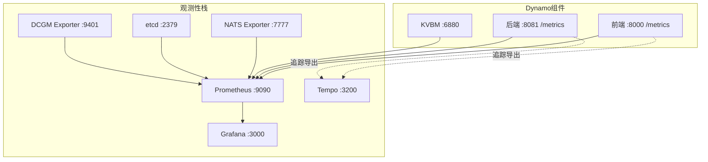
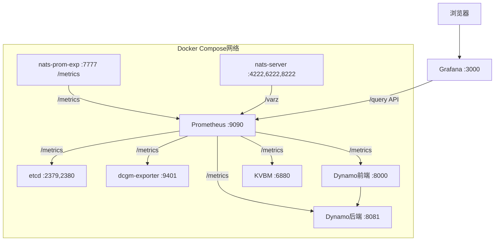
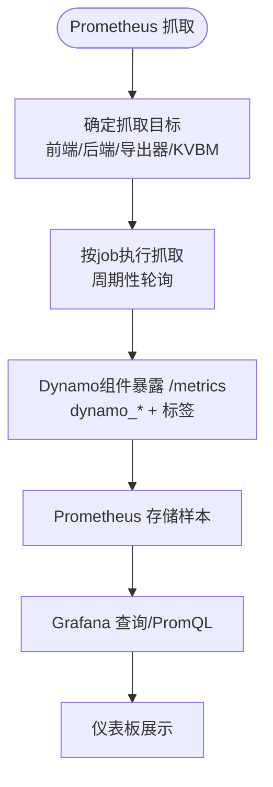
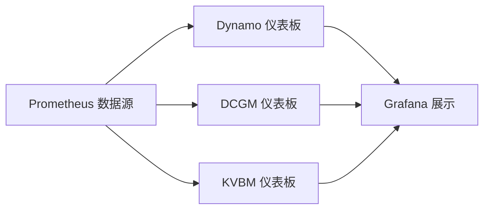
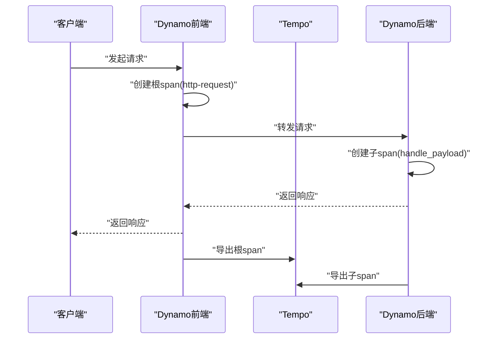
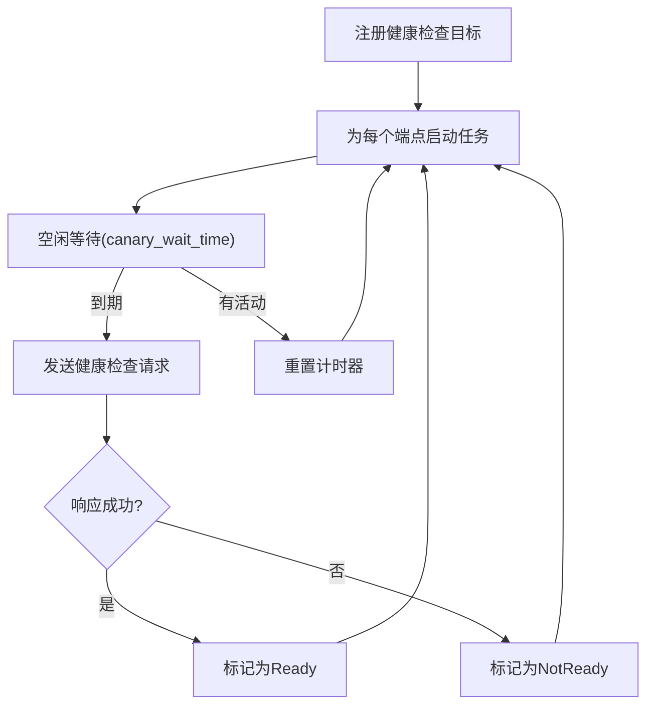
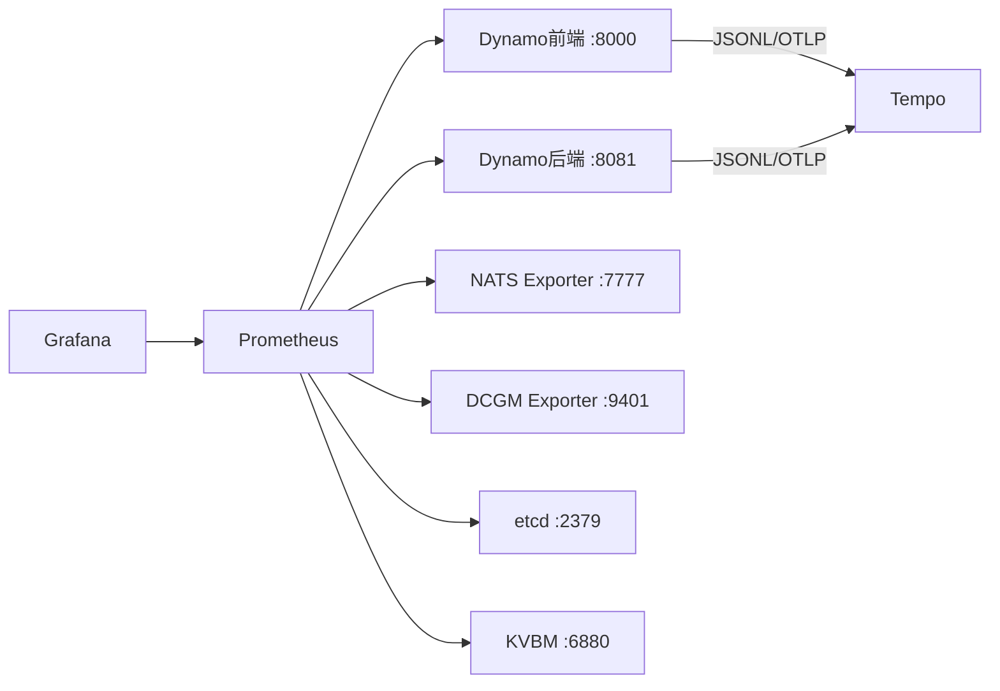

# 监控和可观测性

<cite>
**本文引用的文件**
- [README.md](file://deploy/observability/README.md)
- [prometheus.yml](file://deploy/observability/prometheus.yml)
- [grafana-datasources.yml](file://deploy/observability/grafana-datasources.yml)
- [tempo.yaml](file://deploy/observability/tempo.yaml)
- [README.md](file://docs/observability/README.md)
- [metrics.md](file://docs/observability/metrics.md)
- [logging.md](file://docs/observability/logging.md)
- [tracing.md](file://docs/observability/tracing.md)
- [health-checks.md](file://docs/observability/health-checks.md)
- [dynamo.json](file://deploy/observability/grafana_dashboards/dynamo.json)
- [dcgm-metrics.json](file://deploy/observability/grafana_dashboards/dcgm-metrics.json)
- [kvbm.json](file://deploy/observability/grafana_dashboards/kvbm.json)
- [system_health.rs](file://lib/runtime/src/system_health.rs)
- [health_check.rs](file://lib/runtime/src/health_check.rs)
- [health_check.py](file://components/src/dynamo/vllm/health_check.py)
- [health_check.py](file://components/src/dynamo/sglang/health_check.py)
- [health_check.py](file://components/src/dynamo/trtllm/health_check.py)
</cite>

## 目录
1. [简介](#简介)
2. [项目结构](#项目结构)
3. [核心组件](#核心组件)
4. [架构总览](#架构总览)
5. [详细组件分析](#详细组件分析)
6. [依赖关系分析](#依赖关系分析)
7. [性能考量](#性能考量)
8. [故障排查指南](#故障排查指南)
9. [结论](#结论)
10. [附录](#附录)

## 简介
本文件面向Dynamo的监控与可观测性体系，系统化阐述Prometheus指标采集、Grafana仪表板配置、日志与分布式追踪（OpenTelemetry + Tempo）、健康检查与告警配置，并提供生产级最佳实践与安全建议。内容覆盖指标命名规范、标签管理、查询优化策略以及故障排查方法，帮助读者快速搭建并维护高可用的可观测性平台。

## 项目结构
Dynamo的可观测性由“基础设施编排 + 指标采集 + 可视化 + 日志与追踪 + 健康检查”五部分组成：
- 观测性基础设施：通过Docker Compose启动Prometheus、Grafana、Tempo及各类Exporter（NATS、etcd、DCGM）。
- 指标采集：Dynamo后端组件在系统状态端口暴露Prometheus指标；前端组件亦暴露相关指标。
- 可视化：Grafana仪表板聚合系统运行时指标与硬件指标。
- 日志与追踪：支持结构化日志（JSONL），并可导出OpenTelemetry追踪到Tempo。
- 健康检查：提供就绪/存活探针与主动“金丝雀”健康检查，保障服务可用性。

图表来源
- [prometheus.yml](file://deploy/observability/prometheus.yml#L20-L57)
- [grafana-datasources.yml](file://deploy/observability/grafana-datasources.yml#L18-L24)
- [tempo.yaml](file://deploy/observability/tempo.yaml#L4-L15)

章节来源
- [README.md](file://docs/observability/README.md#L19-L34)
- [prometheus.yml](file://deploy/observability/prometheus.yml#L20-L57)
- [grafana-datasources.yml](file://deploy/observability/grafana-datasources.yml#L18-L24)
- [tempo.yaml](file://deploy/observability/tempo.yaml#L4-L15)

## 核心组件
- Prometheus：负责定时抓取各目标指标，提供查询与告警能力。
- Grafana：可视化展示，内置多套仪表板（Dynamo、DCGM、KVBM）。
- Tempo：接收OTLP追踪数据，提供分布式追踪可视化。
- Dynamo指标：统一以dynamo_*前缀暴露，含命名空间、组件、端点等标签，便于分层聚合与查询。
- 健康检查：提供/health与/liveness端点，支持按端点就绪状态判定整体健康，并具备“金丝雀”主动探测。

章节来源
- [metrics.md](file://docs/observability/metrics.md#L63-L124)
- [health-checks.md](file://docs/observability/health-checks.md#L14-L47)

## 架构总览
下图展示了Dynamo可观测性在单机演示环境中的拓扑关系与数据流：

图表来源
- [README.md](file://docs/observability/README.md#L70-L84)

章节来源
- [README.md](file://docs/observability/README.md#L61-L84)

## 详细组件分析

### Prometheus指标采集机制
- 指标前缀与标签
  - 统一前缀：dynamo_*，便于过滤与聚合。
  - 关键标签：dynamo_namespace、dynamo_component、dynamo_endpoint，用于区分来源与粒度。
- 指标类别
  - 前端指标（dynamo_frontend_*）：请求总量、队列长度、首Token延迟、输出序列长度、模型配置等。
  - 后端指标（dynamo_component_*）：并发请求数、请求/响应字节、处理时延、运行时长等。
  - 引擎指标（如vLLM/SGlang/TRT-LLM）：引擎原生指标透传，便于对比不同后端性能。
- 抓取配置
  - Prometheus按job抓取NATS、etcd、DCGM、Dynamo前端/后端/KVBM等目标，抓取间隔按场景调优。

图表来源
- [prometheus.yml](file://deploy/observability/prometheus.yml#L20-L57)
- [metrics.md](file://docs/observability/metrics.md#L63-L124)

章节来源
- [metrics.md](file://docs/observability/metrics.md#L63-L124)
- [prometheus.yml](file://deploy/observability/prometheus.yml#L20-L57)

### Grafana仪表板配置与设计
- 数据源
  - Prometheus作为默认数据源，Grafana通过配置文件注册。
- 预置仪表板
  - Dynamo通用面板：聚合前端吞吐、时延、GPU利用率、字节速率等。
  - DCGM GPU面板：展示GPU利用率、温度、功耗、显存占用、时钟频率等。
  - KVBM面板：缓存命中率、块迁移速率等。
- 设计要点
  - 使用rate()、increase()等函数对计数器进行规范化，避免趋势漂移。
  - 对直方图指标采用sum/count计算平均值，或使用histogram_quantile()估算分位数。
  - 通过标签过滤（如model、endpoint）实现多维度对比。

图表来源
- [grafana-datasources.yml](file://deploy/observability/grafana-datasources.yml#L18-L24)
- [dynamo.json](file://deploy/observability/grafana_dashboards/dynamo.json#L24-L117)
- [dcgm-metrics.json](file://deploy/observability/grafana_dashboards/dcgm-metrics.json#L25-L122)
- [kvbm.json](file://deploy/observability/grafana_dashboards/kvbm.json#L24-L131)

章节来源
- [dynamo.json](file://deploy/observability/grafana_dashboards/dynamo.json#L24-L117)
- [dcgm-metrics.json](file://deploy/observability/grafana_dashboards/dcgm-metrics.json#L25-L122)
- [kvbm.json](file://deploy/observability/grafana_dashboards/kvbm.json#L24-L131)

### 日志记录策略
- 结构化日志
  - 支持文本与JSONL两种格式；启用JSONL后，日志包含trace_id与span_id，便于追踪关联。
  - 可选开启span事件（进入/退出）日志，辅助短时调试。
- 日志级别
  - ERROR/WARN/INFO/DEBUG/TRACE逐级细化，便于按需降噪或深入定位。
- 追踪上下文
  - JSONL日志可直接查看请求跨度信息；结合Tempo可实现持久化追踪与火焰图分析。
- 请求ID关联
  - 支持自定义x-request-id头，贯穿所有日志与span，提升跨系统关联效率。

章节来源
- [logging.md](file://docs/observability/logging.md#L15-L27)
- [logging.md](file://docs/observability/logging.md#L97-L118)
- [logging.md](file://docs/observability/logging.md#L220-L243)

### 分布式追踪（OpenTelemetry + Tempo）
- 导出配置
  - 通过环境变量启用JSONL与OTLP导出，指定Tempo gRPC端点。
- 跨组件追踪
  - 前端根span（http-request）与后端decode/prefill子span协同，形成完整链路。
- 可视化
  - 在Grafana Explore中选择Tempo数据源，基于服务名、span名、标签（如x-request-id）检索与对比。

图表来源
- [tracing.md](file://docs/observability/tracing.md#L18-L26)
- [tracing.md](file://docs/observability/tracing.md#L130-L142)

章节来源
- [tracing.md](file://docs/observability/tracing.md#L18-L26)
- [tracing.md](file://docs/observability/tracing.md#L130-L142)

### 健康检查端点与系统状态监控
- 端点类型
  - /health：综合健康状态，包含已注册端点与实例列表（前端）；就绪条件可按端点集合决定。
  - /live：仅反映进程存活状态（前端）。
- 就绪判定
  - 若声明了use_endpoint_health_status，则需全部端点达到Ready才视为整体Ready。
  - 否则根据是否注册健康检查目标与系统健康状态综合判断。
- 金丝雀健康检查（主动探测）
  - 在无活动期间触发，向目标端点发送轻量测试请求，超时即标记为不健康。
  - 可配置等待时间与请求超时，降低对在线流量的影响。

图表来源
- [system_health.rs](file://lib/runtime/src/system_health.rs#L141-L194)
- [health_check.rs](file://lib/runtime/src/health_check.rs#L100-L123)
- [health_check.rs](file://lib/runtime/src/health_check.rs#L125-L187)
- [health_check.rs](file://lib/runtime/src/health_check.rs#L240-L380)

章节来源
- [health-checks.md](file://docs/observability/health-checks.md#L14-L47)
- [health-checks.md](file://docs/observability/health-checks.md#L147-L217)
- [health-checks.md](file://docs/observability/health-checks.md#L219-L344)
- [system_health.rs](file://lib/runtime/src/system_health.rs#L98-L139)
- [health_check.rs](file://lib/runtime/src/health_check.rs#L100-L187)

### 后端健康检查负载定义（Python）
- vLLM/SGLang/TRT-LLM分别提供默认健康检查payload，确保最小化开销与一致性。
- payload包含采样参数与停止条件，生成单token以验证推理链路可用性。
- 支持从引擎/分词器提取BOS token ID，提高与模型一致性的健康检查。

章节来源
- [health_check.py](file://components/src/dynamo/vllm/health_check.py#L52-L79)
- [health_check.py](file://components/src/dynamo/sglang/health_check.py#L50-L84)
- [health_check.py](file://components/src/dynamo/trtllm/health_check.py#L51-L91)

## 依赖关系分析
- 组件耦合
  - Prometheus与各导出器/组件之间为弱耦合的拉取模式，Prometheus集中管理抓取策略。
  - Dynamo内部通过SystemHealth与HealthCheckManager解耦健康检查逻辑与业务端点。
- 外部依赖
  - Grafana依赖Prometheus作为数据源；Tempo依赖OTLP端点。
  - DCGM Exporter与NATS Exporter独立于Dynamo，但被Prometheus统一抓取。

图表来源
- [prometheus.yml](file://deploy/observability/prometheus.yml#L20-L57)
- [grafana-datasources.yml](file://deploy/observability/grafana-datasources.yml#L18-L24)

章节来源
- [prometheus.yml](file://deploy/observability/prometheus.yml#L20-L57)
- [grafana-datasources.yml](file://deploy/observability/grafana-datasources.yml#L18-L24)

## 性能考量
- 抓取间隔与样本保留
  - 根据指标变化频率与查询复杂度调整抓取间隔，避免过度抓取导致Prometheus压力。
- 查询优化
  - 使用标签过滤减少Series数量；优先使用rate()/increase()等函数进行规范化。
  - 对直方图使用histogram_quantile()估算分位数，避免对桶级数据进行复杂聚合。
- 追踪开销控制
  - 生产环境按需采样，避免高频span影响在线性能；短时调试可开启span事件日志。
- 健康检查频率
  - 合理设置canary等待时间与请求超时，避免对在线流量造成干扰。

## 故障排查指南
- 指标缺失/抓取失败
  - 检查Dynamo系统状态端口是否正确暴露（DYN_SYSTEM_PORT）；确认Prometheus抓取地址与端口。
  - 核对标签完整性（dynamo_namespace/dynamo_component/dynamo_endpoint）。
- 健康检查异常
  - 查看金丝雀健康检查日志，确认canary_wait_time与request_timeout配置是否合理。
  - 若端点未就绪，检查use_endpoint_health_status是否包含目标端点。
- 追踪不可见
  - 确认JSONL与OTEL_EXPORT_ENABLED已启用，且OTLP端点指向Tempo。
  - 在Grafana Explore中使用x-request-id快速定位特定请求链路。
- 日志关联困难
  - 为请求添加x-request-id头，确保日志与span中均携带该ID，便于跨系统关联。

章节来源
- [health-checks.md](file://docs/observability/health-checks.md#L324-L344)
- [logging.md](file://docs/observability/logging.md#L220-L243)
- [tracing.md](file://docs/observability/tracing.md#L149-L152)

## 结论
Dynamo的可观测性体系以Prometheus为核心，结合Grafana仪表板、Tempo分布式追踪与健康检查机制，实现了从指标、日志到追踪的全链路可观测。通过清晰的指标命名与标签管理、合理的抓取与查询策略、以及主动健康检查，能够有效支撑生产环境的稳定性与可运维性。建议在生产部署中持续优化抓取策略、限制追踪采样率、完善告警阈值，并定期复盘故障案例以迭代监控方案。

## 附录

### 指标命名约定与标签管理
- 命名约定
  - 前缀：dynamo_*（前端dynamo_frontend_*，组件dynamo_component_*，特殊组件dynamo_preprocessor_*等）。
  - 类型：counter/gauge/histogram，遵循Prometheus最佳实践。
- 标签管理
  - 必填标签：dynamo_namespace、dynamo_component、dynamo_endpoint。
  - 其他常用标签：model（前端模型指标）、instance（实例标识）等。
- 查询优化建议
  - 使用标签过滤减少Series数量。
  - 对计数器使用rate()，对直方图使用sum/count或histogram_quantile()。

章节来源
- [metrics.md](file://docs/observability/metrics.md#L63-L89)
- [metrics.md](file://docs/observability/metrics.md#L101-L175)

### 健康检查配置清单
- 环境变量
  - DYN_SYSTEM_PORT：系统状态端口（默认8081）。
  - DYN_SYSTEM_STARTING_HEALTH_STATUS：初始健康状态（notready/ready）。
  - DYN_SYSTEM_HEALTH_PATH/DYN_SYSTEM_LIVE_PATH：自定义健康/存活路径。
  - DYN_SYSTEM_USE_ENDPOINT_HEALTH_STATUS：声明需要就绪的端点列表。
  - DYN_HEALTH_CHECK_ENABLED：启用金丝雀健康检查。
  - DYN_CANARY_WAIT_TIME：空闲等待时间（秒）。
  - DYN_HEALTH_CHECK_REQUEST_TIMEOUT：请求超时（秒）。

章节来源
- [health-checks.md](file://docs/observability/health-checks.md#L14-L26)
- [health-checks.md](file://docs/observability/health-checks.md#L273-L280)

### 生产环境最佳实践与安全考虑
- 最佳实践
  - 指标与标签：保持标签基数可控，避免高基数标签导致存储膨胀。
  - 抓取与查询：合理设置抓取间隔与查询窗口，避免PromQL过载。
  - 追踪：生产环境按需采样，短时调试再开启详细span事件。
  - 健康检查：根据端点特性设置合适的canary等待与超时，避免误判。
- 安全考虑
  - 临时禁用防火墙仅限本地开发；生产环境严格限制访问端口与网络策略。
  - 通过环境变量统一注入OTEL_EXPORT_ENABLED与OTLP端点，避免硬编码。
  - Grafana/Temoto/Prometheus的访问凭据与网络隔离应符合企业安全基线。

章节来源
- [README.md](file://docs/observability/README.md#L19-L34)
- [tracing.md](file://docs/observability/tracing.md#L155-L214)