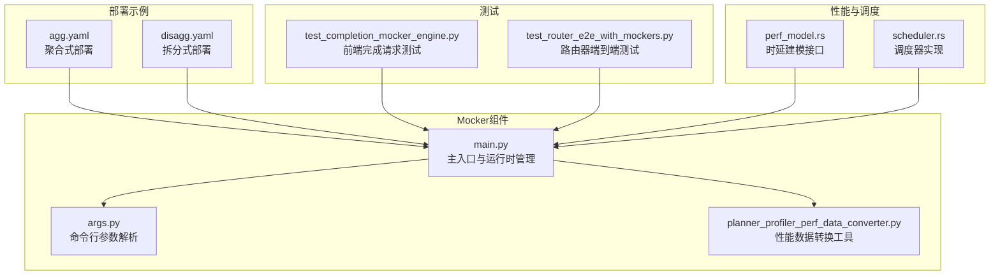
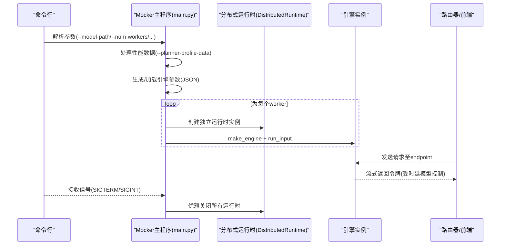
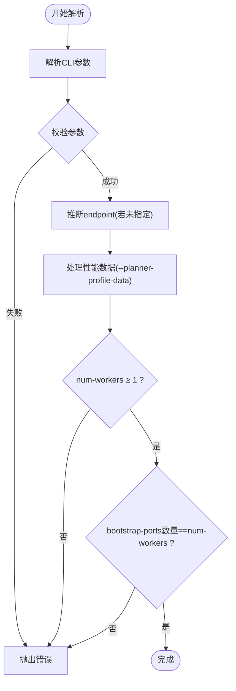
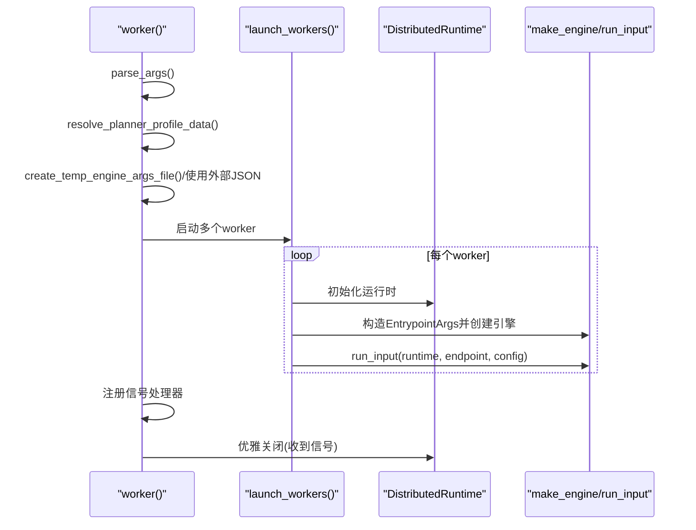
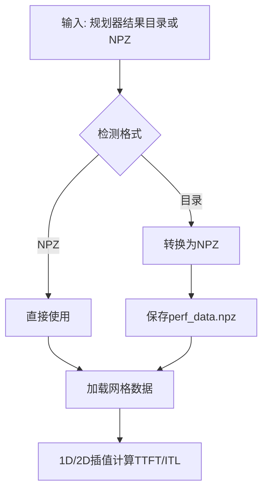
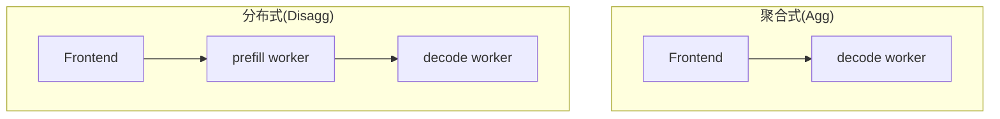
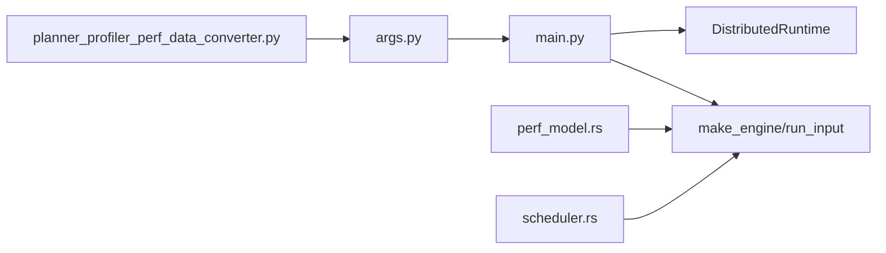

# Mocker后端示例

<cite>
**本文引用的文件**
- [README.md](file://components/src/dynamo/mocker/README.md)
- [main.py](file://components/src/dynamo/mocker/main.py)
- [args.py](file://components/src/dynamo/mocker/args.py)
- [planner_profiler_perf_data_converter.py](file://components/src/dynamo/mocker/utils/planner_profiler_perf_data_converter.py)
- [agg.yaml](file://examples/backends/mocker/deploy/agg.yaml)
- [disagg.yaml](file://examples/backends/mocker/deploy/disagg.yaml)
- [test_completion_mocker_engine.py](file://tests/frontend/test_completion_mocker_engine.py)
- [test_router_e2e_with_mockers.py](file://tests/router/test_router_e2e_with_mockers.py)
- [perf_model.rs](file://lib/llm/src/mocker/perf_model.rs)
- [scheduler.rs](file://lib/llm/src/mocker/scheduler.rs)
- [benchmarking.md](file://docs/benchmarks/benchmarking.md)
- [vllm/README.md](file://docs/backends/vllm/README.md)
</cite>

## 目录
1. [简介](#简介)
2. [项目结构](#项目结构)
3. [核心组件](#核心组件)
4. [架构总览](#架构总览)
5. [详细组件分析](#详细组件分析)
6. [依赖关系分析](#依赖关系分析)
7. [性能考虑](#性能考虑)
8. [故障排查指南](#故障排查指南)
9. [结论](#结论)
10. [附录](#附录)

## 简介
Mocker后端是Dynamo生态中的测试与演示型引擎，用于模拟真实的大模型推理时序，无需实际GPU即可验证分布式系统、路由与规划器等组件。它支持聚合式与分布式（拆分式）部署模式，并提供基于规划器性能数据的高保真时延建模能力。本文面向开发者与测试工程师，提供从安装、配置到部署、测试与性能基准的完整示例与最佳实践。

## 项目结构
Mocker相关代码主要位于以下位置：
- 组件入口与CLI：components/src/dynamo/mocker
- 部署示例：examples/backends/mocker/deploy
- 测试用例：tests/frontend、tests/router
- 性能建模与调度：lib/llm/src/mocker
- 文档与对比：docs/backends/vllm、docs/benchmarks

**图表来源**
- [main.py](file://components/src/dynamo/mocker/main.py#L1-L174)
- [args.py](file://components/src/dynamo/mocker/args.py#L1-L359)
- [planner_profiler_perf_data_converter.py](file://components/src/dynamo/mocker/utils/planner_profiler_perf_data_converter.py#L1-L183)
- [agg.yaml](file://examples/backends/mocker/deploy/agg.yaml#L1-L37)
- [disagg.yaml](file://examples/backends/mocker/deploy/disagg.yaml#L1-L61)
- [test_completion_mocker_engine.py](file://tests/frontend/test_completion_mocker_engine.py#L1-L128)
- [test_router_e2e_with_mockers.py](file://tests/router/test_router_e2e_with_mockers.py#L1-L935)
- [perf_model.rs](file://lib/llm/src/mocker/perf_model.rs#L1-L42)
- [scheduler.rs](file://lib/llm/src/mocker/scheduler.rs#L238-L276)

**章节来源**
- [README.md](file://components/src/dynamo/mocker/README.md#L1-L78)
- [main.py](file://components/src/dynamo/mocker/main.py#L1-L174)
- [args.py](file://components/src/dynamo/mocker/args.py#L1-L359)

## 核心组件
- 命令行参数解析与校验：负责解析vLLM风格的参数、默认值设置、worker类型与端口校验等。
- 主运行流程：创建分布式运行时实例、按需生成临时引擎参数文件、启动多个worker并注册信号处理。
- 性能数据转换：支持规划器输出的原始结果目录或NPZ格式，转换为Mocker可用的插值网格。
- 部署配置：提供聚合式与拆分式两种DGD示例，便于Kubernetes一键部署。

关键职责与行为：
- 参数解析与兼容性：支持直接JSON文件覆盖与CLI参数混合；自动推断endpoint默认值；校验worker数量与bootstrap端口一致性。
- 运行时隔离：每个worker拥有独立的分布式运行时，共享事件循环但各自连接KV存储与请求平面。
- 性能建模：默认使用多项式公式估算时延；可加载规划器导出的插值网格以提升仿真精度。

**章节来源**
- [args.py](file://components/src/dynamo/mocker/args.py#L155-L359)
- [main.py](file://components/src/dynamo/mocker/main.py#L40-L174)
- [planner_profiler_perf_data_converter.py](file://components/src/dynamo/mocker/utils/planner_profiler_perf_data_converter.py#L44-L183)

## 架构总览
Mocker通过统一的入口启动多个worker，每个worker绑定到相同的命名空间与endpoint，但可选择是否为prefill或decode角色。在拆分式部署中，prefill与decode分别注册不同endpoint，decode不发布KV事件且跳过prefill成本估算。

**图表来源**
- [main.py](file://components/src/dynamo/mocker/main.py#L79-L159)
- [args.py](file://components/src/dynamo/mocker/args.py#L155-L359)

## 详细组件分析

### 命令行参数与配置
- 必填项与常用参数
  - 模型路径：用于加载tokenizer与模型元信息
  - 端点与模型名：默认根据worker类型自动选择endpoint
  - 并发与批大小：控制每轮最大序列数与token数
  - KV缓存：块大小、GPU块数、水位线
  - 启动加速：speedup-ratio控制仿真速度
  - 数据并行：dp_size模拟多副本
  - 工作进程：num-workers在同一进程中共享Tokio运行时
  - worker类型：is-prefill-worker/is-decode-worker
  - 插值网格：planner-profile-data
  - 存储与请求平面：store-kv、request-plane
- 兼容性与校验
  - 不允许同时指定prefill与decode标志
  - num-workers必须≥1
  - bootstrap-ports数量需等于num-workers

**图表来源**
- [args.py](file://components/src/dynamo/mocker/args.py#L155-L359)

**章节来源**
- [args.py](file://components/src/dynamo/mocker/args.py#L155-L359)

### 主运行流程与生命周期
- 启动阶段
  - 解析参数并处理性能数据
  - 若未提供额外引擎参数文件，则从CLI构造临时JSON
  - 为每个worker创建独立的分布式运行时
  - 构造EntrypointArgs并创建引擎实例
- 运行阶段
  - 所有worker并发运行，共享事件循环
  - 注册信号处理器，接收SIGTERM/SIGINT后优雅关闭
- 清理阶段
  - 关闭所有运行时
  - 删除临时文件与临时目录

**图表来源**
- [main.py](file://components/src/dynamo/mocker/main.py#L40-L174)

**章节来源**
- [main.py](file://components/src/dynamo/mocker/main.py#L40-L174)

### 性能建模与数据转换
- 默认时延模型
  - 使用硬编码多项式公式估算prefill与decode时延
- 插值网格模型
  - 支持规划器输出的原始目录或NPZ文件
  - 自动转换为Mocker所需的网格数据结构
  - 在K8s中可通过ConfigMap/PVC挂载

**图表来源**
- [planner_profiler_perf_data_converter.py](file://components/src/dynamo/mocker/utils/planner_profiler_perf_data_converter.py#L44-L183)
- [perf_model.rs](file://lib/llm/src/mocker/perf_model.rs#L1-L42)

**章节来源**
- [planner_profiler_perf_data_converter.py](file://components/src/dynamo/mocker/utils/planner_profiler_perf_data_converter.py#L44-L183)
- [perf_model.rs](file://lib/llm/src/mocker/perf_model.rs#L1-L42)

### 调度与指标
- 调度器
  - 基于KV资源管理的调度策略
  - 保持活跃解码块计数等指标
- 指标通道
  - 通过watch通道暴露Mocker指标，供监控与观测使用

**章节来源**
- [scheduler.rs](file://lib/llm/src/mocker/scheduler.rs#L238-L276)

### 聚合式与分布式部署配置
- 聚合式部署
  - 单一decode worker承载完整推理流程
  - 适合快速验证与轻量负载
- 分布式部署
  - 明确区分prefill与decode worker
  - decode不发布KV事件，prefill仅处理前填充
  - 可启用bootstrap rendezvous以支持跨worker发现

**图表来源**
- [agg.yaml](file://examples/backends/mocker/deploy/agg.yaml#L1-L37)
- [disagg.yaml](file://examples/backends/mocker/deploy/disagg.yaml#L1-L61)

**章节来源**
- [agg.yaml](file://examples/backends/mocker/deploy/agg.yaml#L1-L37)
- [disagg.yaml](file://examples/backends/mocker/deploy/disagg.yaml#L1-L61)

### 使用示例与最佳实践
- 基础用法
  - 通过vLLM风格CLI启动Mocker与前端
  - 使用--num-workers在单进程内并行多个引擎，共享Tokio运行时
- 性能建模
  - 使用--planner-profile-data加载规划器导出的插值网格
  - 在K8s中通过ConfigMap或PVC挂载性能数据
- 路由与测试
  - 结合路由器与前端完成端到端验证
  - 利用测试用例验证KV缓存复用、DP路由与过载保护

**章节来源**
- [README.md](file://components/src/dynamo/mocker/README.md#L10-L78)
- [test_completion_mocker_engine.py](file://tests/frontend/test_completion_mocker_engine.py#L1-L128)
- [test_router_e2e_with_mockers.py](file://tests/router/test_router_e2e_with_mockers.py#L1-L935)

## 依赖关系分析
- 组件耦合
  - main.py依赖args.py进行参数解析与默认值推断
  - 性能数据转换模块被args.py调用以解析--planner-profile-data
  - 运行时与引擎通过Dynamo运行时框架集成
- 外部依赖
  - NATS/etcd作为服务发现与KV存储后端
  - uvloop优化异步I/O性能
  - Rust侧的性能建模与调度器提供底层支撑

**图表来源**
- [args.py](file://components/src/dynamo/mocker/args.py#L1-L359)
- [main.py](file://components/src/dynamo/mocker/main.py#L1-L174)
- [planner_profiler_perf_data_converter.py](file://components/src/dynamo/mocker/utils/planner_profiler_perf_data_converter.py#L1-L183)
- [perf_model.rs](file://lib/llm/src/mocker/perf_model.rs#L1-L42)
- [scheduler.rs](file://lib/llm/src/mocker/scheduler.rs#L238-L276)

**章节来源**
- [args.py](file://components/src/dynamo/mocker/args.py#L1-L359)
- [main.py](file://components/src/dynamo/mocker/main.py#L1-L174)

## 性能考虑
- 仿真加速
  - speedup-ratio可显著提升吞吐，便于快速压测与验证
- 资源限制
  - 通过block-size、num-gpu-blocks、max-num-seqs与max-num-batched-tokens控制内存与并发
- 时延建模
  - 默认多项式模型简单高效；规划器网格模型更贴近真实硬件
- 请求平面
  - tcp通常更快，nats提供事件驱动的KV路由能力
- 存储后端
  - etcd适合生产级发现与持久化；file适合本地开发与CI

[本节为通用指导，无需特定文件引用]

## 故障排查指南
- 常见参数错误
  - 同时设置--is-prefill-worker与--is-decode-worker
  - --num-workers小于1
  - --bootstrap-ports数量与--num-workers不一致
- 性能数据问题
  - --planner-profile-data既非NPZ也非有效目录
  - 缺少必要的插值键值对
- 运行时异常
  - 优雅关闭失败或临时文件清理失败
  - 多worker共享TCP端点导致路由冲突（测试场景）
- 路由与KV事件
  - JetStream与NATS Core模式下的消费者一致性差异
  - 过载保护触发导致503状态

**章节来源**
- [args.py](file://components/src/dynamo/mocker/args.py#L136-L359)
- [main.py](file://components/src/dynamo/mocker/main.py#L29-L77)
- [planner_profiler_perf_data_converter.py](file://components/src/dynamo/mocker/utils/planner_profiler_perf_data_converter.py#L98-L157)
- [test_router_e2e_with_mockers.py](file://tests/router/test_router_e2e_with_mockers.py#L1-L935)

## 结论
Mocker后端为Dynamo提供了低成本、高可扩展性的测试与演示能力。通过聚合式与分布式部署、灵活的参数体系与高保真的时延建模，开发者可以在无GPU环境下完成端到端验证与性能基准测试。配合规划器网格数据与多种存储/请求平面选项，Mocker能够满足从本地开发到Kubernetes生产的多样化需求。

[本节为总结，无需特定文件引用]

## 附录

### 与真实后端的对比与选择
- vLLM
  - 特性覆盖全面，支持KV感知路由、LMCache、KVBM等
  - 适合生产级部署与大规模推理
- Mocker
  - 无需GPU，启动快、易集成
  - 适合CI/CD、路由与规划器验证、基础设施压测
- 选择建议
  - 开发联调与CI：优先Mocker
  - 生产部署与性能验证：使用vLLM或其他真实后端

**章节来源**
- [vllm/README.md](file://docs/backends/vllm/README.md#L1-L200)
- [benchmarking.md](file://docs/benchmarks/benchmarking.md#L530-L542)

### 启动与停止脚本使用指南
- 本地启动
  - 启动Mocker：使用vLLM风格CLI参数
  - 启动前端：启动HTTP前端服务
- Kubernetes部署
  - 应用聚合式或拆分式DGD配置
  - 通过ConfigMap/PVC挂载模型与性能数据

**章节来源**
- [README.md](file://components/src/dynamo/mocker/README.md#L30-L78)
- [agg.yaml](file://examples/backends/mocker/deploy/agg.yaml#L1-L37)
- [disagg.yaml](file://examples/backends/mocker/deploy/disagg.yaml#L1-L61)

### 功能测试与性能基准
- 功能测试
  - 完成请求与数组提示符测试
  - 路由器端到端测试（含KV事件同步、DP路由、过载保护）
- 性能基准
  - 使用--speedup-ratio进行吞吐放大
  - 结合规划器网格数据评估真实时延

**章节来源**
- [test_completion_mocker_engine.py](file://tests/frontend/test_completion_mocker_engine.py#L1-L128)
- [test_router_e2e_with_mockers.py](file://tests/router/test_router_e2e_with_mockers.py#L1-L935)
- [benchmarking.md](file://docs/benchmarks/benchmarking.md#L530-L542)