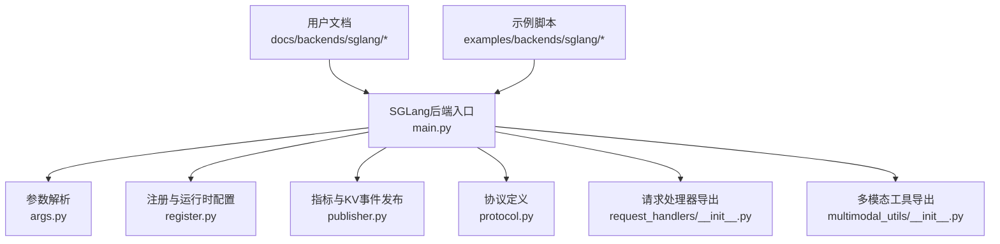
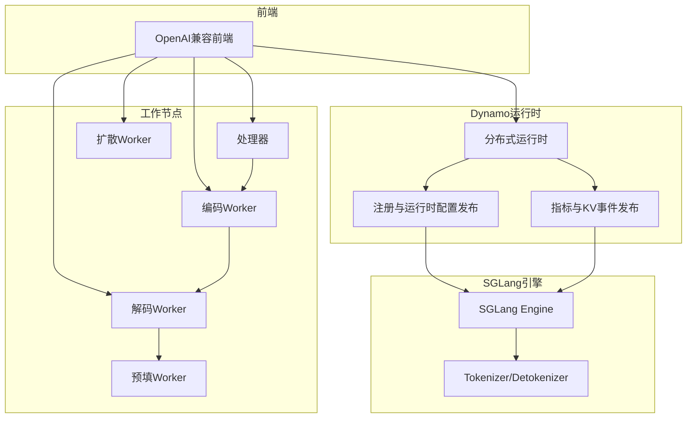
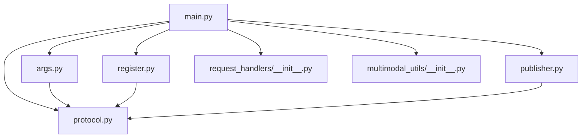

# SGLang后端示例

<cite>
**本文引用的文件**
- [components/src/dynamo/sglang/main.py](file://components/src/dynamo/sglang/main.py)
- [components/src/dynamo/sglang/args.py](file://components/src/dynamo/sglang/args.py)
- [components/src/dynamo/sglang/protocol.py](file://components/src/dynamo/sglang/protocol.py)
- [components/src/dynamo/sglang/register.py](file://components/src/dynamo/sglang/register.py)
- [components/src/dynamo/sglang/publisher.py](file://components/src/dynamo/sglang/publisher.py)
- [components/src/dynamo/sglang/request_handlers/__init__.py](file://components/src/dynamo/sglang/request_handlers/__init__.py)
- [components/src/dynamo/sglang/multimodal_utils/__init__.py](file://components/src/dynamo/sglang/multimodal_utils/__init__.py)
- [docs/backends/sglang/README.md](file://docs/backends/sglang/README.md)
- [docs/backends/sglang/sglang-disaggregation.md](file://docs/backends/sglang/sglang-disaggregation.md)
- [docs/backends/sglang/diffusion-lm.md](file://docs/backends/sglang/diffusion-lm.md)
- [docs/backends/sglang/sgl-hicache-example.md](file://docs/backends/sglang/sgl-hicache-example.md)
- [docs/multimodal/sglang.md](file://docs/multimodal/sglang.md)
- [examples/backends/sglang/launch/agg.sh](file://examples/backends/sglang/launch/agg.sh)
- [examples/backends/sglang/launch/disagg.sh](file://examples/backends/sglang/launch/disagg.sh)
- [examples/backends/sglang/deploy/README.md](file://examples/backends/sglang/deploy/README.md)
</cite>

## 目录
1. [简介](#简介)
2. [项目结构](#项目结构)
3. [核心组件](#核心组件)
4. [架构总览](#架构总览)
5. [详细组件分析](#详细组件分析)
6. [依赖关系分析](#依赖关系分析)
7. [性能考量](#性能考量)
8. [故障排查指南](#故障排查指南)
9. [结论](#结论)
10. [附录](#附录)

## 简介
本文件面向希望在Dynamo平台上集成并部署SGLang后端的工程师与运维人员，系统性地阐述SGLang在Dynamo中的部署配置、运行机制与性能特性，并对聚合式与分布式（解耦式）两种部署模式进行对比分析。文档还覆盖以下主题：
- 不同模型类型的配置方法与优化参数
- 扩散语言模型（Diffusion-LM）的特殊配置与部署流程
- 多模态模型（图像）的集成示例与关键配置点
- 日志配置与路由优化策略
- 完整启动脚本使用指南与性能基准测试方法
- SGLang特有的HiCache（分层缓存）功能配置与适用场景
- 常见问题与性能调优实践

## 项目结构
围绕SGLang后端的关键代码与文档分布如下：
- 后端入口与运行时：components/src/dynamo/sglang/main.py
- 参数解析与配置：components/src/dynamo/sglang/args.py
- 协议定义（含多模态）：components/src/dynamo/sglang/protocol.py
- 注册与运行时配置发布：components/src/dynamo/sglang/register.py
- 指标与KV事件发布：components/src/dynamo/sglang/publisher.py
- 请求处理器导出：components/src/dynamo/sglang/request_handlers/__init__.py
- 多模态工具导出：components/src/dynamo/sglang/multimodal_utils/__init__.py
- 文档与示例：docs/backends/sglang/* 与 examples/backends/sglang/*

图表来源
- [components/src/dynamo/sglang/main.py](file://components/src/dynamo/sglang/main.py#L1-L664)
- [components/src/dynamo/sglang/args.py](file://components/src/dynamo/sglang/args.py#L1-L640)
- [components/src/dynamo/sglang/register.py](file://components/src/dynamo/sglang/register.py#L1-L265)
- [components/src/dynamo/sglang/publisher.py](file://components/src/dynamo/sglang/publisher.py#L1-L201)
- [components/src/dynamo/sglang/protocol.py](file://components/src/dynamo/sglang/protocol.py#L1-L134)
- [components/src/dynamo/sglang/request_handlers/__init__.py](file://components/src/dynamo/sglang/request_handlers/__init__.py#L1-L35)
- [components/src/dynamo/sglang/multimodal_utils/__init__.py](file://components/src/dynamo/sglang/multimodal_utils/__init__.py#L1-L19)

章节来源
- [components/src/dynamo/sglang/main.py](file://components/src/dynamo/sglang/main.py#L1-L664)
- [components/src/dynamo/sglang/args.py](file://components/src/dynamo/sglang/args.py#L1-L640)
- [docs/backends/sglang/README.md](file://docs/backends/sglang/README.md#L1-L278)

## 核心组件
- 运行时主程序：负责解析参数、初始化Dynamo分布式运行时、根据服务模式选择合适的处理器、注册模型、暴露指标与健康检查等。
- 参数解析器：统一解析SGLang原生参数与Dynamo扩展参数，支持嵌套配置文件抽取、自动推断端点、禁用/启用令牌化器、多模态与扩散等模式识别。
- 注册模块：将引擎与Dynamo运行时对接，发布运行时配置（如最大批内token数、页大小、本地索引器开关等），并可设置就绪门以实现平滑上线。
- 指标与事件发布：通过ZMQ接收SGLang调度器指标，向Dynamo指标端点发布；可选启用Prometheus多进程收集。
- 协议定义：标准化预处理请求、采样参数、停止条件、多模态消息结构等，支撑多模态与解耦式流水线。
- 请求处理器：按模式（解码、预填、扩散、嵌入、多模态编码/解码/处理器）组织请求处理链路。

章节来源
- [components/src/dynamo/sglang/main.py](file://components/src/dynamo/sglang/main.py#L69-L123)
- [components/src/dynamo/sglang/args.py](file://components/src/dynamo/sglang/args.py#L324-L585)
- [components/src/dynamo/sglang/register.py](file://components/src/dynamo/sglang/register.py#L18-L68)
- [components/src/dynamo/sglang/publisher.py](file://components/src/dynamo/sglang/publisher.py#L51-L134)
- [components/src/dynamo/sglang/protocol.py](file://components/src/dynamo/sglang/protocol.py#L14-L134)

## 架构总览
下图展示了SGLang在Dynamo中的典型部署形态与交互关系，涵盖聚合式与解耦式两种模式以及多模态与扩散等扩展能力。

图表来源
- [components/src/dynamo/sglang/main.py](file://components/src/dynamo/sglang/main.py#L125-L210)
- [components/src/dynamo/sglang/register.py](file://components/src/dynamo/sglang/register.py#L18-L68)
- [components/src/dynamo/sglang/publisher.py](file://components/src/dynamo/sglang/publisher.py#L170-L201)
- [docs/backends/sglang/sglang-disaggregation.md](file://docs/backends/sglang/sglang-disaggregation.md#L17-L32)

## 详细组件分析

### 聚合式与分布式（解耦式）部署对比
- 聚合式（Aggregated）
  - 特点：单个解码Worker同时承担预填与解码职责，适合开发与小规模部署。
  - 配置要点：无需专门的预填/解码Worker，直接以解码模式启动；可通过页面大小、张量并行度等参数优化吞吐。
  - 性能特征：资源占用相对集中，延迟较低；但无法独立扩展预填与解码阶段。
- 分布式（解耦式，Disaggregated）
  - 特点：预填与解码分离为独立Worker，通过RDMA/NIXL进行KV缓存传输，支持独立扩缩容与更优资源利用率。
  - 配置要点：需分别启动预填Worker（prefill）与解码Worker（decode），并配置引导端口、传输后端（如NIXL）、路由策略（KV感知或预测）。
  - 性能特征：预填（计算密集）与解码（内存密集）解耦，整体吞吐更高；首次预填TTFT可能较高，可通过预热降低。

章节来源
- [docs/backends/sglang/sglang-disaggregation.md](file://docs/backends/sglang/sglang-disaggregation.md#L10-L89)
- [examples/backends/sglang/launch/disagg.sh](file://examples/backends/sglang/launch/disagg.sh#L56-L88)

### 参数解析与配置要点
- SGLang原生参数透传：绝大多数SGLang参数可直接传递给dynamo.sglang，如模型路径、张量并行度、信任远程代码等。
- Dynamo扩展参数：
  - 端点与平面：endpoint、request-plane、event-plane、store-kv等，用于控制请求与事件平面、键值存储后端。
  - 预处理与模板：use-sglang-tokenizer、custom-jinja-template、dyn-endpoint-types等，决定是否使用SGLang内置tokenizer及可用的前端端点类型。
  - 多模态与扩散：multimodal-processor、multimodal-encode-worker、multimodal-worker、embedding-worker、diffusion-worker等，用于选择组件角色。
  - 其他：migration-limit、enable-local-indexer等，影响迁移策略与本地KV索引器。
- 自动推断与校验：支持从嵌套YAML中抽取子段落、自动设置默认端点、校验自定义模板文件存在性、下载模型等。

章节来源
- [components/src/dynamo/sglang/args.py](file://components/src/dynamo/sglang/args.py#L32-L134)
- [components/src/dynamo/sglang/args.py](file://components/src/dynamo/sglang/args.py#L324-L585)

### 注册与运行时配置发布
- 注册流程：在引擎初始化后，将输入/输出类型、模型路径、服务名、KV缓存页大小、迁移限制、自定义模板等信息注册到Dynamo运行时。
- 运行时配置：提取SGLang引擎的调度器信息（如最大总token数、页大小）生成ModelRuntimeConfig，发布到发现服务，供路由与规划器使用。
- 就绪门：注册完成后触发就绪事件，允许排队请求开始处理，确保前端可见性与一致性。

章节来源
- [components/src/dynamo/sglang/register.py](file://components/src/dynamo/sglang/register.py#L18-L68)
- [components/src/dynamo/sglang/register.py](file://components/src/dynamo/sglang/register.py#L147-L222)
- [components/src/dynamo/sglang/register.py](file://components/src/dynamo/sglang/register.py#L224-L265)

### 指标与KV事件发布
- 指标发布：通过ZMQ从SGLang调度器接收KV活跃块数等指标，封装为Dynamo指标并通过专用端点发布；也可启用Prometheus多进程收集以暴露SGLang指标。
- KV事件发布：基于配置的KV事件后端（如ZMQ）发布KV块状态变更事件，支持本地索引器以跟踪自身KV缓存状态。

章节来源
- [components/src/dynamo/sglang/publisher.py](file://components/src/dynamo/sglang/publisher.py#L51-L134)
- [components/src/dynamo/sglang/publisher.py](file://components/src/dynamo/sglang/publisher.py#L136-L168)
- [components/src/dynamo/sglang/publisher.py](file://components/src/dynamo/sglang/publisher.py#L170-L201)

### 协议与数据结构
- 标准LLM协议：包含停止条件、采样选项、预处理后的请求体等，统一前后端交互格式。
- 多模态协议：定义文本、图像URL、视频URL等消息内容，以及多模态请求结构，支撑图像URL输入与嵌入形状等元数据。
- 解耦式多模态请求：在多模态场景下，将预处理请求与采样参数、数据并行rank等打包，便于跨Worker传递。

章节来源
- [components/src/dynamo/sglang/protocol.py](file://components/src/dynamo/sglang/protocol.py#L14-L134)

### 请求处理器与组件角色
- 解码/预填/扩散/嵌入处理器：根据服务模式选择对应处理器，注册引擎路由并处理请求。
- 多模态处理器链路：处理器（HTTP入口）→编码Worker（生成视觉嵌入）→解码/预填Worker（执行推理），内部通过NATS通信，必要时通过NIXL传输嵌入张量。
- 组件导出：集中导出各类处理器，便于按需导入与使用。

章节来源
- [components/src/dynamo/sglang/request_handlers/__init__.py](file://components/src/dynamo/sglang/request_handlers/__init__.py#L1-L35)
- [docs/multimodal/sglang.md](file://docs/multimodal/sglang.md#L129-L253)

### 扩散语言模型（Diffusion-LM）配置与流程
- 启动方式：通过专门的扩散Worker启动，指定算法（如LowConfidence）与必要的推理参数。
- 测试验证：提供curl示例，验证聊天与补全端点。
- 注意事项：扩散LM与自回归LM不同，采用迭代细化过程，需正确配置算法与后端。

章节来源
- [docs/backends/sglang/diffusion-lm.md](file://docs/backends/sglang/diffusion-lm.md#L10-L82)

### 多模态模型集成（图像）
- 支持矩阵：图像URL（HTTP/HTTPS）在聚合与解耦式均受支持；视频/音频当前不支持。
- 部署模式：
  - EPD（简单聚合）：内部编码，直接由解码Worker处理。
  - E/PD（编码分离）：处理器→编码Worker→解码/预填Worker，编码与推理分离。
  - E/P/D（完全解耦）：处理器→编码Worker→解码Worker→预填Worker，KV缓存通过SGLang引导机制传输。
- 关键配置：多模态组件标志、聊天模板、NIXL传输后端、引导端口等。
- 数据流：处理器将文本+图像URL转换为SGLang请求，编码Worker生成嵌入并通过NIXL传输至下游Worker。

章节来源
- [docs/multimodal/sglang.md](file://docs/multimodal/sglang.md#L22-L47)
- [docs/multimodal/sglang.md](file://docs/multimodal/sglang.md#L77-L128)
- [docs/multimodal/sglang.md](file://docs/multimodal/sglang.md#L129-L253)

### 日志配置与路由优化
- 日志：通过Dynamo日志配置接口统一设置日志级别与输出格式；示例脚本可启用JSONL与OpenTelemetry导出。
- 路由优化：
  - KV感知路由：结合KV事件与本地索引器，提升命中率与减少迁移。
  - 请求平面与事件平面：可选择NATS/TCP/HTTP作为请求分发平面，NATS/ZMQ作为事件发布平面，依据网络与延迟需求选择。
  - 端点类型：根据是否使用SGLang内置tokenizer，决定可用的前端端点类型（chat/completions）。

章节来源
- [examples/backends/sglang/launch/agg.sh](file://examples/backends/sglang/launch/agg.sh#L48-L75)
- [components/src/dynamo/sglang/args.py](file://components/src/dynamo/sglang/args.py#L113-L134)
- [components/src/dynamo/sglang/register.py](file://components/src/dynamo/sglang/register.py#L162-L164)

### 启动脚本使用指南
- 聚合式启动：示例脚本展示如何启动前端与SGLang Worker，支持OTEL追踪、系统指标端口、模型参数透传等。
- 解耦式启动：分别启动预填与解码Worker，设置引导端口、传输后端与系统指标端口，确保两端一致。
- Kubernetes部署：提供CRD模板与说明，支持聚合与解耦式部署，包含资源管理、容器镜像、HuggingFace密钥等配置要点。

章节来源
- [examples/backends/sglang/launch/agg.sh](file://examples/backends/sglang/launch/agg.sh#L1-L75)
- [examples/backends/sglang/launch/disagg.sh](file://examples/backends/sglang/launch/disagg.sh#L1-L89)
- [examples/backends/sglang/deploy/README.md](file://examples/backends/sglang/deploy/README.md#L1-L163)

### 性能基准测试方法
- 基准脚本：提供LLM基准脚本perf.sh，支持并发、输入/输出序列长度、张量并行度等参数组合。
- 建议流程：先在聚合式模式下进行基线测试，再切换到解耦式模式评估收益；针对多模态场景，分别测试编码与解码阶段的瓶颈。

章节来源
- [docs/backends/sglang/sgl-hicache-example.md](file://docs/backends/sglang/sgl-hicache-example.md#L54-L66)

### SGLang分层缓存（HiCache）配置与使用
- 启用方式：通过--enable-hierarchical-cache、--hicache-ratio、--hicache-write-policy、--hicache-storage-backend等参数启用与调优。
- 使用场景：在设备显存受限而CPU内存充足时，利用主机侧缓存池承载更多KV缓存，缓解显存压力。
- 验证步骤：启动Worker并开启HiCache，发送一次请求验证功能；随后可运行基准脚本进行性能评估。

章节来源
- [docs/backends/sglang/sgl-hicache-example.md](file://docs/backends/sglang/sgl-hicache-example.md#L10-L35)

## 依赖关系分析
SGLang后端组件之间的依赖关系如下：

图表来源
- [components/src/dynamo/sglang/main.py](file://components/src/dynamo/sglang/main.py#L13-L34)
- [components/src/dynamo/sglang/args.py](file://components/src/dynamo/sglang/args.py#L18-L25)
- [components/src/dynamo/sglang/register.py](file://components/src/dynamo/sglang/register.py#L13-L15)
- [components/src/dynamo/sglang/publisher.py](file://components/src/dynamo/sglang/publisher.py#L17-L24)

章节来源
- [components/src/dynamo/sglang/main.py](file://components/src/dynamo/sglang/main.py#L1-L664)
- [components/src/dynamo/sglang/args.py](file://components/src/dynamo/sglang/args.py#L1-L640)

## 性能考量
- 张量并行与页面大小：合理设置tp与page-size可显著影响吞吐与显存占用。
- 解耦式优势：预填与解码分离后，可独立扩容与优化；首次预填TTFT可通过预热降低。
- 多模态开销：图像加载与编码会引入额外延迟，建议在编码阶段使用高性能GPU并启用NIXL传输。
- 指标与观测：启用系统指标端口与Prometheus多进程收集，结合KV事件与本地索引器，定位瓶颈与热点。
- HiCache：在显存紧张场景下，适度提高hicache-ratio并选择合适的写策略可提升稳定性与吞吐。

## 故障排查指南
- 注册失败：检查模型路径、服务名、KV缓存页大小与迁移限制；确认引擎初始化成功后再注册。
- 解耦式预填/解码通信异常：核对引导端口、传输后端（NIXL）与网络连通性；确保两端配置一致。
- 多模态编码失败：确认图像URL可达且格式符合要求；检查编码Worker日志与NIXL元数据序列化。
- 指标缺失：确认ZMQ端点格式（IPv6需括号包裹）、Prometheus多进程目录已正确设置。
- 取消请求：在聚合式模式下通常支持取消；解耦式预填阶段可能不支持，需关注日志与错误码。

章节来源
- [components/src/dynamo/sglang/register.py](file://components/src/dynamo/sglang/register.py#L247-L265)
- [components/src/dynamo/sglang/publisher.py](file://components/src/dynamo/sglang/publisher.py#L27-L49)
- [docs/backends/sglang/README.md](file://docs/backends/sglang/README.md#L72-L87)

## 结论
SGLang在Dynamo中的集成提供了从简单聚合到复杂解耦的完整能力谱系。通过统一的参数解析、注册与运行时配置发布机制，以及完善的指标与事件体系，用户可在不同规模与场景下灵活部署。多模态与扩散等扩展能力进一步丰富了应用场景。配合HiCache与KV感知路由等优化手段，可在资源受限与高并发场景下获得更佳的性能表现。

## 附录
- 快速参考
  - 聚合式启动：参见示例脚本与文档说明。
  - 解耦式启动：分别启动预填与解码Worker，配置引导端口与传输后端。
  - 多模态：选择合适模式（EPD/E/PD/E/P/D），配置聊天模板与NIXL。
  - 扩散LM：指定算法与必要参数，验证聊天/补全端点。
  - HiCache：启用分层缓存并调整ratio与写策略，结合基准脚本评估。

章节来源
- [examples/backends/sglang/launch/agg.sh](file://examples/backends/sglang/launch/agg.sh#L1-L75)
- [examples/backends/sglang/launch/disagg.sh](file://examples/backends/sglang/launch/disagg.sh#L1-L89)
- [docs/multimodal/sglang.md](file://docs/multimodal/sglang.md#L1-L434)
- [docs/backends/sglang/diffusion-lm.md](file://docs/backends/sglang/diffusion-lm.md#L1-L82)
- [docs/backends/sglang/sgl-hicache-example.md](file://docs/backends/sglang/sgl-hicache-example.md#L1-L66)