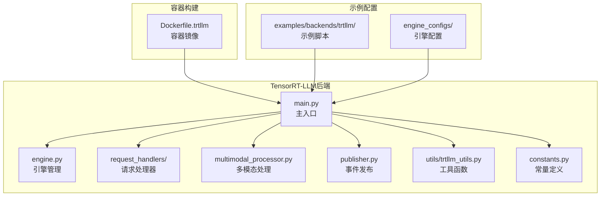
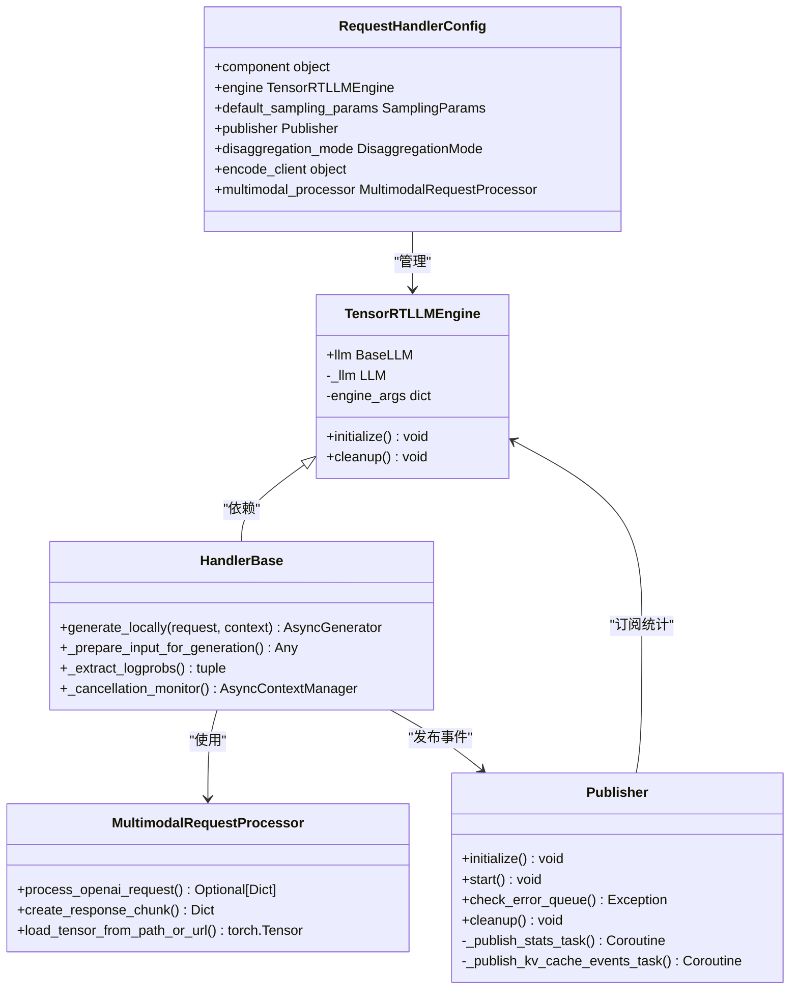
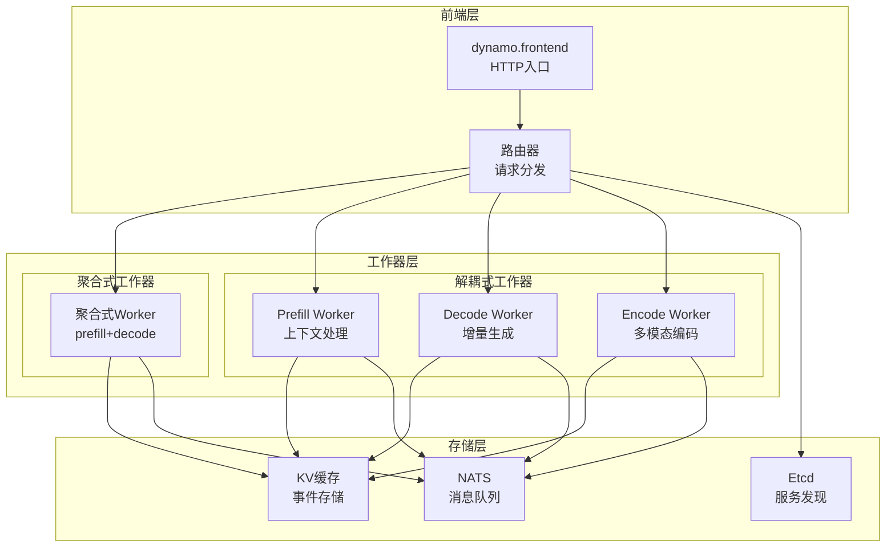
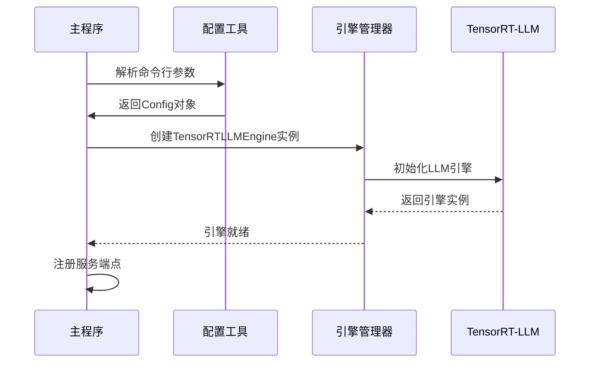
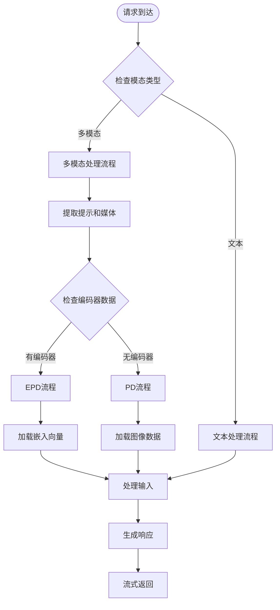
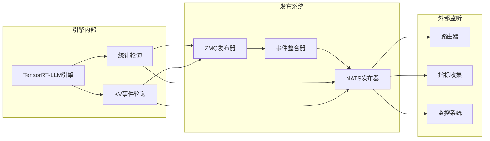
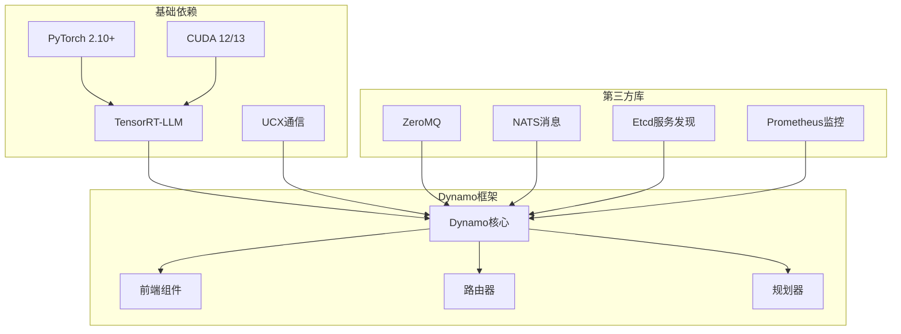

# TensorRT-LLM后端示例

<cite>
**本文档引用的文件**
- [components/src/dynamo/trtllm/main.py](file://components/src/dynamo/trtllm/main.py)
- [components/src/dynamo/trtllm/engine.py](file://components/src/dynamo/trtllm/engine.py)
- [components/src/dynamo/trtllm/constants.py](file://components/src/dynamo/trtllm/constants.py)
- [components/src/dynamo/trtllm/multimodal_processor.py](file://components/src/dynamo/trtllm/multimodal_processor.py)
- [components/src/dynamo/trtllm/publisher.py](file://components/src/dynamo/trtllm/publisher.py)
- [components/src/dynamo/trtllm/utils/trtllm_utils.py](file://components/src/dynamo/trtllm/utils/trtllm_utils.py)
- [components/src/dynamo/trtllm/request_handlers/handler_base.py](file://components/src/dynamo/trtllm/request_handlers/handler_base.py)
- [container/Dockerfile.trtllm](file://container/Dockerfile.trtllm)
- [docs/backends/trtllm/README.md](file://docs/backends/trtllm/README.md)
- [examples/backends/trtllm/launch/agg.sh](file://examples/backends/trtllm/launch/agg.sh)
- [examples/backends/trtllm/engine_configs/deepseek-r1/agg/mtp/mtp_agg.yaml](file://examples/backends/trtllm/engine_configs/deepseek-r1/agg/mtp/mtp_agg.yaml)
- [examples/backends/trtllm/engine_configs/gemma3/vswa_agg.yaml](file://examples/backends/trtllm/engine_configs/gemma3/vswa_agg.yaml)
- [examples/backends/trtllm/engine_configs/gpt-oss-120b/decode.yaml](file://examples/backends/trtllm/engine_configs/gpt-oss-120b/decode.yaml)
- [examples/backends/trtllm/engine_configs/llama4/eagle/eagle_agg.yml](file://examples/backends/trtllm/engine_configs/llama4/eagle/eagle_agg.yml)
- [examples/backends/trtllm/engine_configs/llava-v1.6-mistral-7b-hf/decode.yaml](file://examples/backends/trtllm/engine_configs/llava-v1.6-mistral-7b-hf/decode.yaml)
- [examples/backends/trtllm/engine_configs/qwen2-vl-7b-instruct/agg.yaml](file://examples/backends/trtllm/engine_configs/qwen2-vl-7b-instruct/agg.yaml)
- [examples/backends/trtllm/engine_configs/qwen3/agg.yaml](file://examples/backends/trtllm/engine_configs/qwen3/agg.yaml)
</cite>

## 目录
1. [简介](#简介)
2. [项目结构](#项目结构)
3. [核心组件](#核心组件)
4. [架构概览](#架构概览)
5. [详细组件分析](#详细组件分析)
6. [依赖关系分析](#依赖关系分析)
7. [性能考虑](#性能考虑)
8. [故障排除指南](#故障排除指南)
9. [结论](#结论)
10. [附录](#附录)

## 简介
本文件为TensorRT-LLM后端的详细集成示例文档，基于Dynamo平台实现。文档深入解释了TensorRT-LLM在Dynamo中的部署配置、性能优化方法以及多节点部署策略。涵盖了不同模型架构的引擎配置，包括GPT-oss、DeepSeek-R1、Gemma3、Llama4等主流模型，并重点介绍了多模态模型（如LLaVA、Qwen2-VL）的特殊配置与模板使用方法。

## 项目结构
Dynamo项目采用模块化设计，TensorRT-LLM后端位于components/src/dynamo/trtllm目录下，包含以下关键子模块：



**图表来源**
- [components/src/dynamo/trtllm/main.py](file://components/src/dynamo/trtllm/main.py#L1-L528)
- [container/Dockerfile.trtllm](file://container/Dockerfile.trtllm#L1-L885)

**章节来源**
- [components/src/dynamo/trtllm/main.py](file://components/src/dynamo/trtllm/main.py#L1-L528)
- [container/Dockerfile.trtllm](file://container/Dockerfile.trtllm#L1-L885)

## 核心组件
TensorRT-LLM后端由多个核心组件构成，每个组件负责特定的功能领域：

### 主要组件职责
- **主入口模块**: 负责初始化运行时环境、配置引擎参数、注册服务端点
- **引擎管理器**: 提供TensorRT-LLM引擎的生命周期管理和上下文封装
- **请求处理器**: 处理生成请求、多模态输入、流式响应等
- **多模态处理器**: 支持图像、嵌入向量等多模态数据的预处理
- **事件发布器**: 管理KV缓存事件和指标的发布
- **工具函数库**: 提供配置解析、命令行参数处理等功能

### 组件交互关系


**图表来源**
- [components/src/dynamo/trtllm/engine.py](file://components/src/dynamo/trtllm/engine.py#L24-L142)
- [components/src/dynamo/trtllm/request_handlers/handler_base.py](file://components/src/dynamo/trtllm/request_handlers/handler_base.py#L49-L821)
- [components/src/dynamo/trtllm/multimodal_processor.py](file://components/src/dynamo/trtllm/multimodal_processor.py#L45-L278)
- [components/src/dynamo/trtllm/publisher.py](file://components/src/dynamo/trtllm/publisher.py#L257-L684)

**章节来源**
- [components/src/dynamo/trtllm/engine.py](file://components/src/dynamo/trtllm/engine.py#L1-L142)
- [components/src/dynamo/trtllm/request_handlers/handler_base.py](file://components/src/dynamo/trtllm/request_handlers/handler_base.py#L1-L821)
- [components/src/dynamo/trtllm/multimodal_processor.py](file://components/src/dynamo/trtllm/multimodal_processor.py#L1-L278)
- [components/src/dynamo/trtllm/publisher.py](file://components/src/dynamo/trtllm/publisher.py#L1-L684)

## 架构概览
Dynamo的TensorRT-LLM后端采用分布式架构设计，支持聚合式和解耦式两种部署模式：



**图表来源**
- [components/src/dynamo/trtllm/main.py](file://components/src/dynamo/trtllm/main.py#L128-L520)
- [docs/backends/trtllm/README.md](file://docs/backends/trtllm/README.md#L165-L175)

## 详细组件分析

### 引擎配置与初始化
TensorRT-LLM引擎通过复杂的参数体系实现高性能推理：

#### 核心配置参数
- **并行度配置**: tensor_parallel_size、pipeline_parallel_size、expert_parallel_size
- **内存管理**: free_gpu_memory_fraction、max_batch_size、max_num_tokens
- **调度策略**: DynamicBatchConfig、SchedulerConfig、CapacitySchedulerPolicy
- **事件系统**: kv_cache_config、event_buffer_max_size

#### 引擎初始化流程


**图表来源**
- [components/src/dynamo/trtllm/main.py](file://components/src/dynamo/trtllm/main.py#L162-L310)
- [components/src/dynamo/trtllm/engine.py](file://components/src/dynamo/trtllm/engine.py#L54-L86)

**章节来源**
- [components/src/dynamo/trtllm/main.py](file://components/src/dynamo/trtllm/main.py#L197-L231)
- [components/src/dynamo/trtllm/engine.py](file://components/src/dynamo/trtllm/engine.py#L24-L92)

### 多模态处理机制
多模态模型支持图像和嵌入向量的联合处理：

#### 多模态数据流


**图表来源**
- [components/src/dynamo/trtllm/multimodal_processor.py](file://components/src/dynamo/trtllm/multimodal_processor.py#L167-L232)
- [components/src/dynamo/trtllm/request_handlers/handler_base.py](file://components/src/dynamo/trtllm/request_handlers/handler_base.py#L444-L513)

**章节来源**
- [components/src/dynamo/trtllm/multimodal_processor.py](file://components/src/dynamo/trtllm/multimodal_processor.py#L45-L278)
- [components/src/dynamo/trtllm/request_handlers/handler_base.py](file://components/src/dynamo/trtllm/request_handlers/handler_base.py#L444-L513)

### 事件发布与监控
KV缓存事件系统提供实时的缓存状态监控：

#### 事件发布架构


**图表来源**
- [components/src/dynamo/trtllm/publisher.py](file://components/src/dynamo/trtllm/publisher.py#L257-L470)
- [components/src/dynamo/trtllm/main.py](file://components/src/dynamo/trtllm/main.py#L465-L519)

**章节来源**
- [components/src/dynamo/trtllm/publisher.py](file://components/src/dynamo/trtllm/publisher.py#L257-L684)
- [components/src/dynamo/trtllm/main.py](file://components/src/dynamo/trtllm/main.py#L465-L519)

## 依赖关系分析

### 模型架构配置矩阵
不同模型架构需要不同的引擎配置参数：

| 模型类型 | 关键参数 | 推荐配置 | 性能特点 |
|---------|----------|----------|----------|
| GPT-oss | max_seq_len, max_batch_size | decode.yaml | 长序列支持 |
| DeepSeek-R1 | tensor_parallel_size, mtp | mtp_agg.yaml | 多令牌预测 |
| Gemma3 | sliding_window, attention | vswa_agg.yaml | 滑动窗口注意力 |
| Llama4 | eagle_speculation, pipeline_parallel | eagle_agg.yml | 鹰眼推测解码 |
| LLaVA | multimodal, encode_workers | decode.yaml | 多模态融合 |

### 依赖关系图


**图表来源**
- [container/Dockerfile.trtllm](file://container/Dockerfile.trtllm#L518-L621)
- [docs/backends/trtllm/README.md](file://docs/backends/trtllm/README.md#L48-L68)

**章节来源**
- [container/Dockerfile.trtllm](file://container/Dockerfile.trtllm#L1-L885)
- [docs/backends/trtllm/README.md](file://docs/backends/trtllm/README.md#L1-L300)

## 性能考虑

### 精度配置对性能的影响
不同精度设置对推理性能有显著影响：

#### FP8配置优化
- **优势**: 显著降低内存占用，提升吞吐量
- **适用场景**: 生产环境、批量推理
- **注意事项**: 可能影响生成质量

#### FP4配置优化  
- **优势**: 进一步降低内存占用
- **适用场景**: 资源受限环境
- **风险**: 质量损失较大

### 性能调优策略
1. **批处理优化**: 调整max_batch_size和max_num_tokens
2. **并行度配置**: 合理设置tensor_parallel_size和pipeline_parallel_size
3. **内存管理**: 优化free_gpu_memory_fraction参数
4. **事件系统**: 启用事件发布以实现KV缓存复用

## 故障排除指南

### 常见问题诊断
- **引擎初始化失败**: 检查CUDA版本兼容性和GPU内存
- **多模态处理错误**: 验证媒体文件路径和权限
- **事件发布异常**: 确认ZMQ/NATS连接状态
- **请求取消问题**: 检查异步任务管理和信号处理

### 日志分析
通过Dynamo的日志系统可以定位大部分问题：
- 设置DYN_LOG环境变量调整日志级别
- 启用JSON格式日志便于机器解析
- 使用OpenTelemetry进行分布式追踪

**章节来源**
- [components/src/dynamo/trtllm/main.py](file://components/src/dynamo/trtllm/main.py#L71-L78)
- [components/src/dynamo/trtllm/request_handlers/handler_base.py](file://components/src/dynamo/trtllm/request_handlers/handler_base.py#L544-L561)

## 结论
TensorRT-LLM后端为Dynamo提供了强大的推理能力，支持多种部署模式和模型架构。通过合理的配置优化和监控策略，可以在保证性能的同时实现高可用的服务。建议根据具体应用场景选择合适的配置参数，并建立完善的监控和故障排除机制。

## 附录

### 完整启动脚本使用指南
```bash
# 聚合式部署示例
export MODEL_PATH="Qwen/Qwen3-0.6B"
export SERVED_MODEL_NAME="Qwen3-0.6B"
export AGG_ENGINE_ARGS="./examples/backends/trtllm/engine_configs/qwen3/agg.yaml"

# 启动前端
OTEL_SERVICE_NAME=dynamo-frontend python3 -m dynamo.frontend &

# 启动工作器
OTEL_SERVICE_NAME=dynamo-worker python3 -m dynamo.trtllm \
  --model-path "$MODEL_PATH" \
  --served-model-name "$SERVED_MODEL_NAME" \
  --extra-engine-args "$AGG_ENGINE_ARGS" \
  --publish-events-and-metrics
```

### 多节点部署配置要点
1. **网络配置**: 确保所有节点间网络连通性
2. **存储一致性**: 使用共享存储或Etcd进行服务发现
3. **负载均衡**: 配置适当的路由器策略
4. **监控扩展**: 部署集中式监控系统

**章节来源**
- [examples/backends/trtllm/launch/agg.sh](file://examples/backends/trtllm/launch/agg.sh#L1-L71)
- [docs/backends/trtllm/README.md](file://docs/backends/trtllm/README.md#L165-L175)