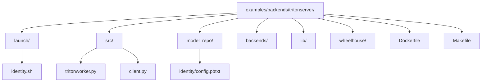
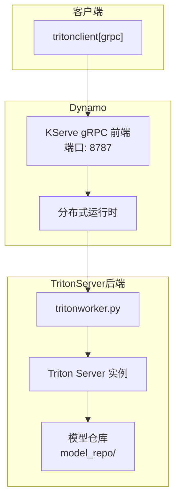
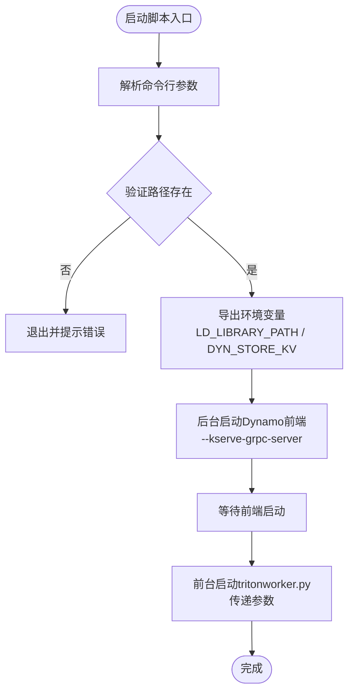
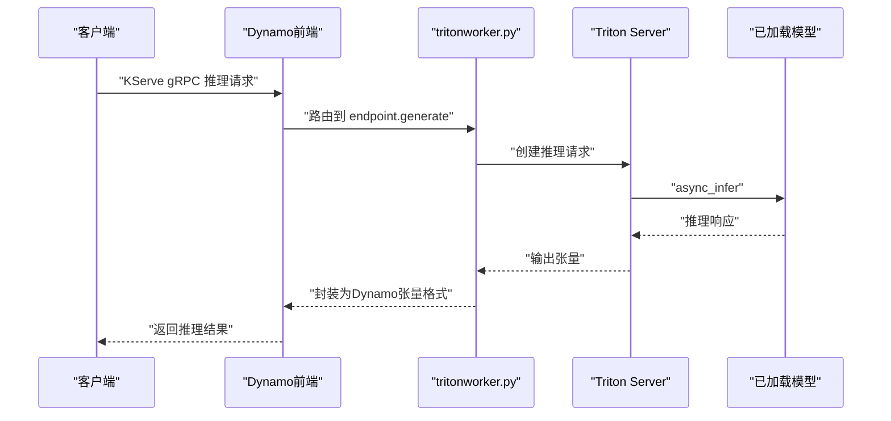
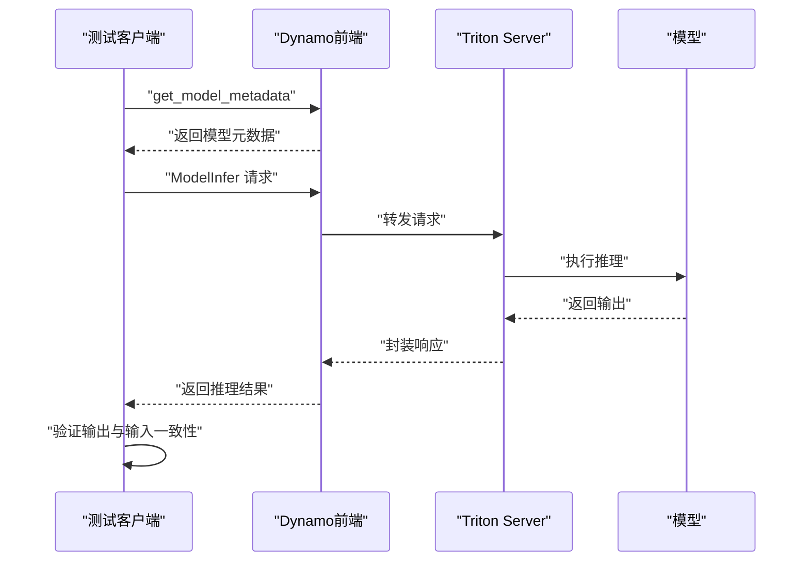
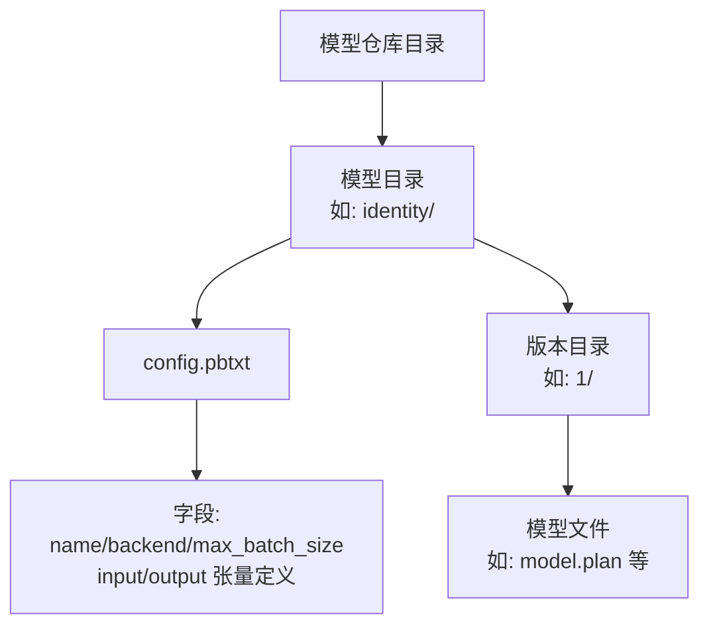
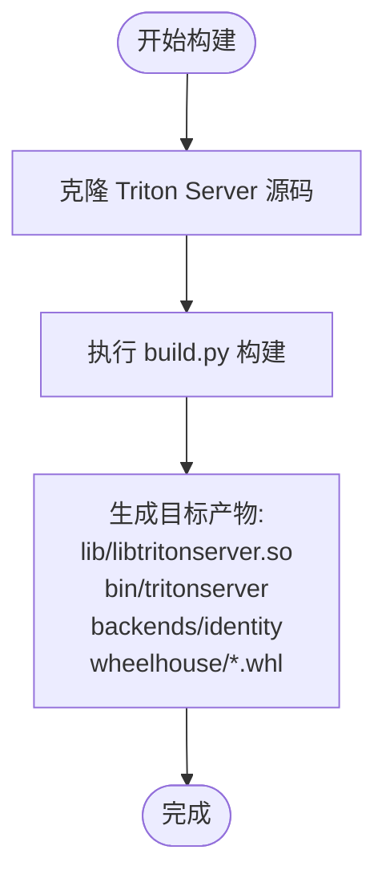
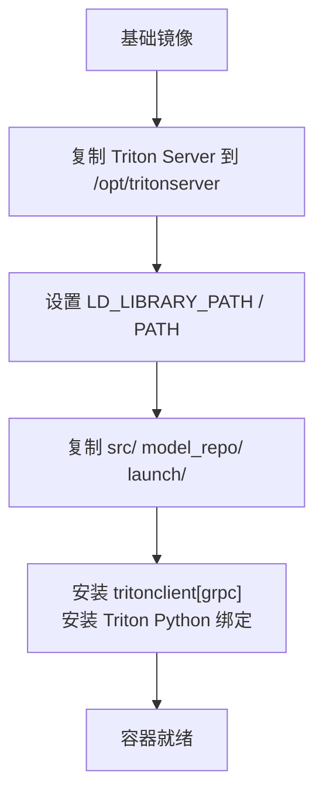
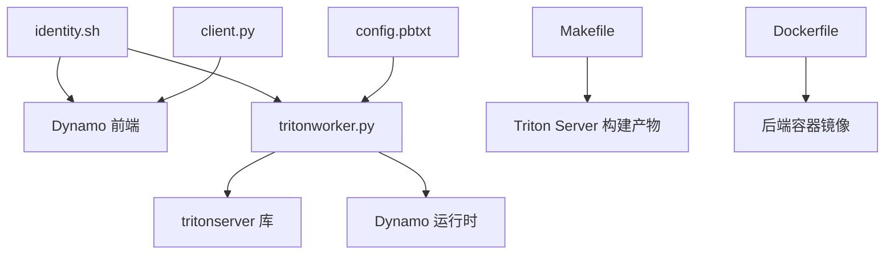

# TritonServer后端示例

<cite>
**本文档引用的文件**
- [README.md](file://examples/backends/tritonserver/README.md)
- [Makefile](file://examples/backends/tritonserver/Makefile)
- [Dockerfile](file://examples/backends/tritonserver/Dockerfile)
- [identity.sh](file://examples/backends/tritonserver/launch/identity.sh)
- [tritonworker.py](file://examples/backends/tritonserver/src/tritonworker.py)
- [client.py](file://examples/backends/tritonserver/src/client.py)
- [config.pbtxt](file://examples/backends/tritonserver/model_repo/identity/config.pbtxt)
- [backend-guide.md](file://docs/development/backend-guide.md)
- [kserve.md](file://docs/frontends/kserve.md)
- [kserve.md](file://fern/pages/frontends/kserve.md)
- [triton_echo_client.py](file://tests/frontend/grpc/triton_echo_client.py)
- [Dockerfile](file://container/Dockerfile)
</cite>

## 目录
1. [简介](#简介)
2. [项目结构](#项目结构)
3. [核心组件](#核心组件)
4. [架构概览](#架构概览)
5. [详细组件分析](#详细组件分析)
6. [依赖关系分析](#依赖关系分析)
7. [性能考虑](#性能考虑)
8. [故障排查指南](#故障排查指南)
9. [结论](#结论)
10. [附录](#附录)

## 简介
本文件为TritonServer作为Dynamo推理后端的集成示例文档。内容涵盖：
- TritonServer与Dynamo的集成方式与配置要点
- 模型仓库配置与管理（含版本管理与部署流程）
- 客户端与工作器代码示例与使用指南
- TritonServer性能特点与适用场景
- Docker容器化部署流程与配置说明
- 模型加载与推理调用的具体实现示例
- 不同格式输入输出数据的处理方法
- 故障排查与性能优化实用技巧

## 项目结构
TritonServer后端示例位于examples/backends/tritonserver目录，主要包含以下结构：
- launch：启动脚本，负责启动前端与工作器
- src：核心Python实现（工作器与测试客户端）
- model_repo：模型仓库（示例为identity模型）
- backends、lib、wheelhouse：构建产物（由Makefile生成）
- Dockerfile：容器化构建定义
- Makefile：从源码构建TritonServer及后端

**图表来源**
- [README.md](file://examples/backends/tritonserver/README.md#L92-L110)
- [Makefile](file://examples/backends/tritonserver/Makefile#L1-L43)

**章节来源**
- [README.md](file://examples/backends/tritonserver/README.md#L92-L110)
- [Makefile](file://examples/backends/tritonserver/Makefile#L1-L43)

## 核心组件
- 启动脚本（identity.sh）：负责设置环境变量、启动Dynamo前端（KServe gRPC），并运行tritonworker.py工作器
- 工作器（tritonworker.py）：基于Dynamo分布式运行时，集成Triton Server，注册模型并通过KServe协议暴露推理接口
- 客户端（client.py）：基于tritonclient[grpc]，通过KServe gRPC前端进行推理测试
- 模型仓库（model_repo/identity/config.pbtxt）：定义模型名称、后端类型、输入输出张量元数据
- 构建系统（Makefile）：克隆并构建Triton Server，生成核心库、二进制与Python绑定
- 容器化（Dockerfile）：将Trition Server与Dynamo基础镜像结合，打包为可运行的后端镜像

**章节来源**
- [identity.sh](file://examples/backends/tritonserver/launch/identity.sh#L1-L130)
- [tritonworker.py](file://examples/backends/tritonserver/src/tritonworker.py#L1-L186)
- [client.py](file://examples/backends/tritonserver/src/client.py#L1-L118)
- [config.pbtxt](file://examples/backends/tritonserver/model_repo/identity/config.pbtxt#L1-L21)
- [Makefile](file://examples/backends/tritonserver/Makefile#L1-L43)
- [Dockerfile](file://examples/backends/tritonserver/Dockerfile#L1-L26)

## 架构概览
TritonServer后端通过Dynamo的KServe gRPC前端暴露推理服务，工作器在本地启动Triton Server并加载指定模型，随后将模型元数据注册到Dynamo运行时，使前端能够识别与路由请求。

**图表来源**
- [README.md](file://examples/backends/tritonserver/README.md#L12-L24)
- [identity.sh](file://examples/backends/tritonserver/launch/identity.sh#L111-L128)
- [tritonworker.py](file://examples/backends/tritonserver/src/tritonworker.py#L92-L166)

## 详细组件分析

### 启动脚本（identity.sh）
- 功能：解析命令行参数与环境变量，设置LD_LIBRARY_PATH，启动Dynamo前端（启用KServe gRPC），然后启动tritonworker.py工作器
- 关键点：
  - 支持--model-name、--model-repository、--backend-directory、--log-verbose、--store-kv等选项
  - 默认KV存储为file，可通过DYN_STORE_KV覆盖
  - 导出DYN_SYSTEM_PORT用于工作器指标端口，默认8081
  - 设置HTTP端口为8000（可通过DYN_HTTP_PORT覆盖）

**图表来源**
- [identity.sh](file://examples/backends/tritonserver/launch/identity.sh#L30-L128)

**章节来源**
- [identity.sh](file://examples/backends/tritonserver/launch/identity.sh#L1-L130)

### 工作器（tritonworker.py）
- 功能：初始化Triton Server实例，加载指定模型，读取config.pbtxt，将模型元数据注册到Dynamo运行时，并通过endpoint.serve_endpoint提供推理服务
- 关键点：
  - 使用tritonserver.Server以显式模式加载模型
  - 将Triton模型配置序列化为Tensor模型配置的一部分
  - 通过register_llm注册Tensor模型，跳过HuggingFace下载
  - RequestHandler负责将输入张量转换为NumPy数组，调用model.async_infer，再将输出转换回Dynamo张量格式

**图表来源**
- [tritonworker.py](file://examples/backends/tritonserver/src/tritonworker.py#L40-L90)
- [tritonworker.py](file://examples/backends/tritonserver/src/tritonworker.py#L118-L166)

**章节来源**
- [tritonworker.py](file://examples/backends/tritonserver/src/tritonworker.py#L1-L186)

### 客户端（client.py）
- 功能：连接Dynamo前端的KServe gRPC端点，查询模型元数据，构造输入张量，执行推理并验证输出
- 关键点：
  - 支持--host/--port/--model/--shape/--iterations参数
  - 使用tritonclient.grpc.InferenceServerClient发起请求
  - 验证identity模型输出与输入一致

**图表来源**
- [client.py](file://examples/backends/tritonserver/src/client.py#L66-L112)

**章节来源**
- [client.py](file://examples/backends/tritonserver/src/client.py#L1-L118)

### 模型仓库与配置（config.pbtxt）
- 功能：定义模型名称、后端类型、最大批大小以及输入输出张量的名称、数据类型与维度
- 示例：identity模型使用identity后端，输入输出均为INT32类型的一维张量

**图表来源**
- [config.pbtxt](file://examples/backends/tritonserver/model_repo/identity/config.pbtxt#L1-L21)

**章节来源**
- [config.pbtxt](file://examples/backends/tritonserver/model_repo/identity/config.pbtxt#L1-L21)

### 构建系统（Makefile）
- 功能：克隆Triton Server源码，使用build.py构建核心库、二进制与Python绑定，并生成backends、lib、wheelhouse产物
- 关键点：
  - 支持--enable-logging、--enable-stats、--enable-metrics、--endpoint=http、--backend=identity等参数
  - 生成目标：lib/libtritonserver.so、bin/tritonserver、backends/identity、wheelhouse/*.whl

**图表来源**
- [Makefile](file://examples/backends/tritonserver/Makefile#L26-L43)

**章节来源**
- [Makefile](file://examples/backends/tritonserver/Makefile#L1-L43)

### 容器化（Dockerfile）
- 功能：将Trition Server与Dynamo基础镜像结合，复制src、model_repo、launch等必要文件，安装tritonclient与Python绑定
- 关键点：
  - 复制/opt/tritonserver至镜像，设置LD_LIBRARY_PATH与PATH
  - 安装tritonclient[grpc]与/opt/tritonserver/python/triton*.whl

**图表来源**
- [Dockerfile](file://examples/backends/tritonserver/Dockerfile#L7-L26)

**章节来源**
- [Dockerfile](file://examples/backends/tritonserver/Dockerfile#L1-L26)

## 依赖关系分析
- 启动脚本依赖Dynamo前端与tritonworker.py
- 工作器依赖tritonserver库、Dynamo运行时与KServe前端
- 客户端依赖tritonclient[grpc]与Dynamo前端
- 模型仓库依赖config.pbtxt与具体模型文件
- 构建系统依赖Triton Server源码与Python工具链
- 容器化依赖Dynamo基础镜像与Trition Server官方镜像

**图表来源**
- [identity.sh](file://examples/backends/tritonserver/launch/identity.sh#L111-L128)
- [tritonworker.py](file://examples/backends/tritonserver/src/tritonworker.py#L10-L17)
- [client.py](file://examples/backends/tritonserver/src/client.py#L17-L18)
- [Makefile](file://examples/backends/tritonserver/Makefile#L38-L43)
- [Dockerfile](file://examples/backends/tritonserver/Dockerfile#L11-L26)

**章节来源**
- [identity.sh](file://examples/backends/tritonserver/launch/identity.sh#L1-L130)
- [tritonworker.py](file://examples/backends/tritonserver/src/tritonworker.py#L1-L186)
- [client.py](file://examples/backends/tritonserver/src/client.py#L1-L118)
- [Makefile](file://examples/backends/tritonserver/Makefile#L1-L43)
- [Dockerfile](file://examples/backends/tritonserver/Dockerfile#L1-L26)

## 性能考虑
- 模型批大小：通过config.pbtxt中的max_batch_size控制，合理设置可提升吞吐
- 日志级别：--log-verbose可调整Triton日志详细程度，生产环境建议降低以减少开销
- 端口配置：前端默认HTTP端口8000与gRPC端口8787，可通过环境变量DYN_HTTP_PORT与DYN_SYSTEM_PORT调整
- 资源隔离：容器化部署时确保GPU可见性与驱动库路径正确，避免运行时错误
- 数据类型映射：工作器中将Triton dtype映射到Dynamo dtype，注意保持输入输出数据类型一致

[本节为通用性能指导，无需特定文件引用]

## 故障排查指南
常见问题与解决步骤：
- 模型未找到
  - 检查model_repo/<model_name>/是否存在且包含config.pbtxt
  - 确认后端存在于backends/目录
- 工作器启动失败
  - 确认LD_LIBRARY_PATH包含lib/与backends/
  - 检查GPU可用性（nvidia-smi）
  - 提高日志详细度（--log-verbose 6）
- 客户端连接失败
  - 确认Frontend已启动且端口开放
  - 检查防火墙与网络策略
- 数据类型不匹配
  - 对照config.pbtxt中的输入输出数据类型与维度
  - 在工作器中确认dtype映射是否正确

**章节来源**
- [README.md](file://examples/backends/tritonserver/README.md#L209-L222)

## 结论
该示例展示了如何将TritonServer作为Dynamo的推理后端，通过KServe gRPC前端统一接入，实现模型的加载、注册与推理。借助容器化与构建脚本，可以快速搭建开发与生产环境。实际部署时需关注模型仓库配置、数据类型一致性与性能参数调优。

[本节为总结性内容，无需特定文件引用]

## 附录

### 配置与环境变量
- DYN_STORE_KV：KV存储后端（file、etcd、mem）
- DYN_LOG：日志级别（debug、info、warn、error）
- DYN_HTTP_PORT：前端HTTP端口（默认8000）
- ETCD_ENDPOINTS：etcd连接URL（仅当--store-kv etcd时）
- NATS_SERVER：NATS连接URL（仅分布式模式）
- DYN_SYSTEM_PORT：工作器指标端口（默认8081）

**章节来源**
- [README.md](file://examples/backends/tritonserver/README.md#L127-L136)

### 添加自定义模型
- 在model_repo/下创建模型目录，包含config.pbtxt与版本目录
- 在config.pbtxt中定义name、backend、max_batch_size以及输入输出张量
- 使用--model-name指定模型名启动

**章节来源**
- [README.md](file://examples/backends/tritonserver/README.md#L137-L177)

### Docker容器化部署流程
- 步骤1：构建Dynamo基础镜像与Triton后端镜像
- 步骤2：使用--network host与--gpus all运行容器
- 步骤3：在另一终端使用client.py测试推理

**章节来源**
- [README.md](file://examples/backends/tritonserver/README.md#L34-L68)

### KServe前端支持
- 支持ModelInfer、ModelStreamInfer、ModelMetadata、ModelConfig端点
- 可通过命令行或Python绑定启动前端

**章节来源**
- [kserve.md](file://docs/frontends/kserve.md#L1-L25)
- [kserve.md](file://fern/pages/frontends/kserve.md#L1-L25)

### 测试客户端参考
- triton_echo_client.py展示了健康检查、推理与流式推理的完整流程

**章节来源**
- [triton_echo_client.py](file://tests/frontend/grpc/triton_echo_client.py#L1-L144)