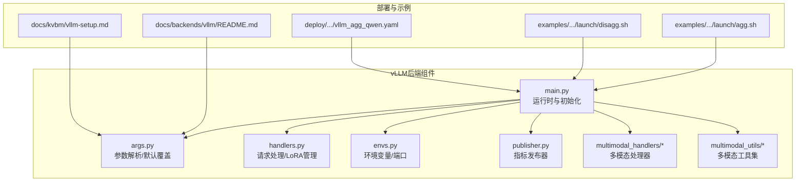
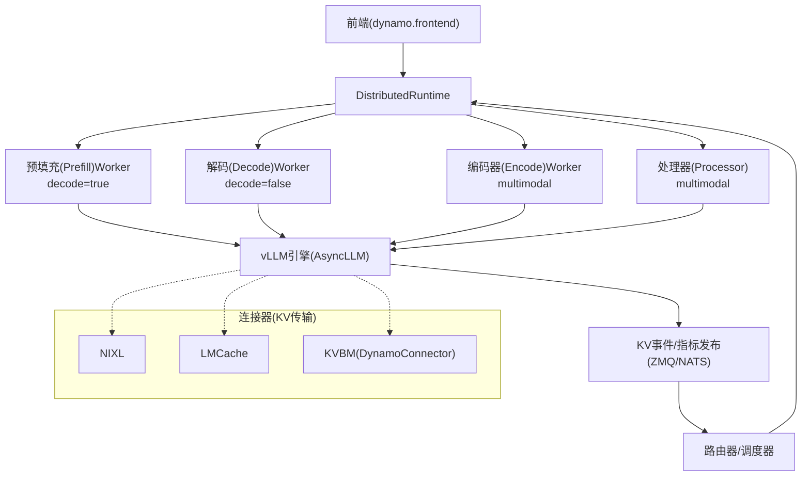
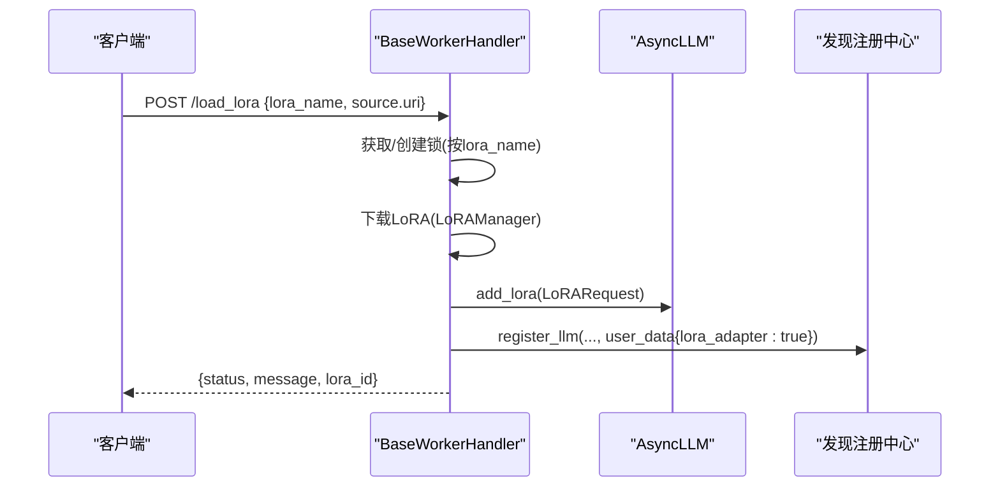
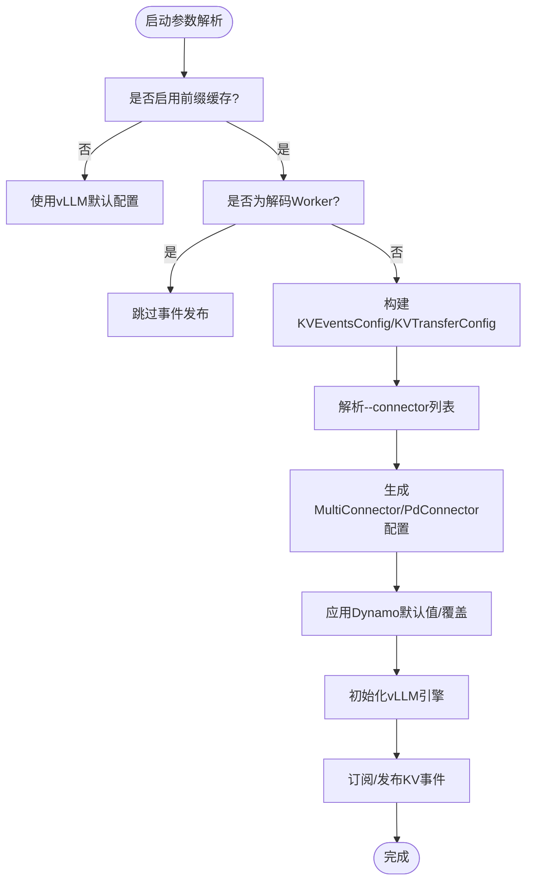
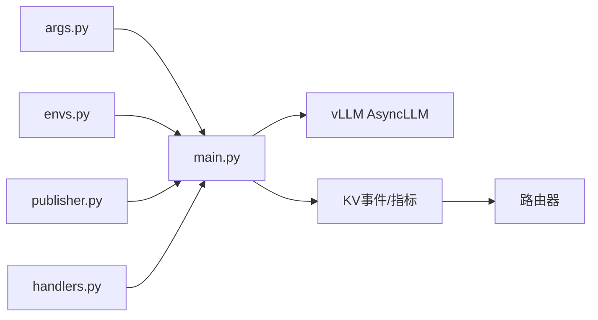

# vLLM后端示例

<cite>
**本文引用的文件**
- [components/src/dynamo/vllm/main.py](file://components/src/dynamo/vllm/main.py)
- [components/src/dynamo/vllm/args.py](file://components/src/dynamo/vllm/args.py)
- [components/src/dynamo/vllm/handlers.py](file://components/src/dynamo/vllm/handlers.py)
- [components/src/dynamo/vllm/envs.py](file://components/src/dynamo/vllm/envs.py)
- [components/src/dynamo/vllm/publisher.py](file://components/src/dynamo/vllm/publisher.py)
- [components/src/dynamo/vllm/multimodal_handlers/__init__.py](file://components/src/dynamo/vllm/multimodal_handlers/__init__.py)
- [components/src/dynamo/vllm/multimodal_utils/__init__.py](file://components/src/dynamo/vllm/multimodal_utils/__init__.py)
- [container/deps/vllm/install_vllm.sh](file://container/deps/vllm/install_vllm.sh)
- [deploy/inference-gateway/standalone/vllm_agg_qwen.yaml](file://deploy/inference-gateway/standalone/vllm_agg_qwen.yaml)
- [examples/backends/vllm/launch/agg.sh](file://examples/backends/vllm/launch/agg.sh)
- [examples/backends/vllm/launch/disagg.sh](file://examples/backends/vllm/launch/disagg.sh)
- [docs/backends/vllm/README.md](file://docs/backends/vllm/README.md)
- [docs/kvbm/vllm-setup.md](file://docs/kvbm/vllm-setup.md)
</cite>

## 目录
1. [简介](#简介)
2. [项目结构](#项目结构)
3. [核心组件](#核心组件)
4. [架构总览](#架构总览)
5. [详细组件分析](#详细组件分析)
6. [依赖关系分析](#依赖关系分析)
7. [性能考量](#性能考量)
8. [故障排查指南](#故障排查指南)
9. [结论](#结论)
10. [附录](#附录)

## 简介
本文件面向在Dynamo平台中集成与部署vLLM后端的工程师与运维人员，系统性阐述以下内容：
- Dynamo中vLLM的部署形态：聚合式（Aggregated Serving）与分布式（Disaggregated Serving）两种模式的差异、适用场景与控制流。
- 不同模型类型（如Llama系列、Qwen系列等主流开源模型）的部署参数与注意事项。
- LoRA微调模型的动态加载、卸载与发现机制。
- 多模态模型（如Qwen2-VL、LLaVA）的特殊配置与优化技巧。
- KV缓存管理与近似KV路由（KVBM/NIXL/LMCache）的配置与实践。
- 完整的启动脚本使用指南与性能调优建议。
- 不同部署模式下的资源分配与扩展策略。

## 项目结构
围绕vLLM后端的关键目录与文件如下：
- 组件入口与运行时：components/src/dynamo/vllm/main.py
- 命令行参数解析与默认值覆盖：components/src/dynamo/vllm/args.py
- 请求处理与LoRA管理：components/src/dynamo/vllm/handlers.py
- 环境变量与端口配置：components/src/dynamo/vllm/envs.py
- 指标发布器工厂：components/src/dynamo/vllm/publisher.py
- 多模态处理器与工具集：components/src/dynamo/vllm/multimodal_handlers/* 与 multimodal_utils/*
- vLLM安装脚本：container/deps/vllm/install_vllm.sh
- 部署样例与网关配置：deploy/inference-gateway/standalone/vllm_agg_qwen.yaml
- 示例启动脚本：examples/backends/vllm/launch/*.sh
- 文档与指南：docs/backends/vllm/README.md、docs/kvbm/vllm-setup.md

**图表来源**
- [components/src/dynamo/vllm/main.py](file://components/src/dynamo/vllm/main.py#L76-L152)
- [components/src/dynamo/vllm/args.py](file://components/src/dynamo/vllm/args.py#L110-L467)
- [components/src/dynamo/vllm/handlers.py](file://components/src/dynamo/vllm/handlers.py#L230-L734)
- [components/src/dynamo/vllm/envs.py](file://components/src/dynamo/vllm/envs.py#L57-L83)
- [components/src/dynamo/vllm/publisher.py](file://components/src/dynamo/vllm/publisher.py#L81-L116)
- [examples/backends/vllm/launch/agg.sh](file://examples/backends/vllm/launch/agg.sh#L1-L33)
- [examples/backends/vllm/launch/disagg.sh](file://examples/backends/vllm/launch/disagg.sh#L1-L22)
- [deploy/inference-gateway/standalone/vllm_agg_qwen.yaml](file://deploy/inference-gateway/standalone/vllm_agg_qwen.yaml#L1-L18)
- [docs/backends/vllm/README.md](file://docs/backends/vllm/README.md#L1-L204)
- [docs/kvbm/vllm-setup.md](file://docs/kvbm/vllm-setup.md#L1-L195)

**章节来源**
- [components/src/dynamo/vllm/main.py](file://components/src/dynamo/vllm/main.py#L76-L152)
- [components/src/dynamo/vllm/args.py](file://components/src/dynamo/vllm/args.py#L110-L467)
- [examples/backends/vllm/launch/agg.sh](file://examples/backends/vllm/launch/agg.sh#L1-L33)
- [examples/backends/vllm/launch/disagg.sh](file://examples/backends/vllm/launch/disagg.sh#L1-L22)
- [docs/backends/vllm/README.md](file://docs/backends/vllm/README.md#L88-L134)

## 核心组件
- 运行时与初始化（main.py）
  - 负责解析参数、设置事件平面与KV事件开关、下载模型、选择初始化路径（预填充/解码/多模态/原生编码器等）、注册端点与健康检查、优雅停机。
  - 支持非主节点（数据并行rank>=1）仅工作不对外服务的模式。
- 参数解析与默认覆盖（args.py）
  - 提供Dynamo特定参数（命名空间、组件名、端点、迁移限制、连接器列表、多模态开关、事件平面等），并根据连接器生成KV传输配置与KV事件配置。
  - 默认启用前缀缓存，并对NIXL连接器在TP=1时强制进程分离以避免GIL竞争。
- 请求处理与LoRA管理（handlers.py）
  - 封装生成、清空KV块、睡眠/唤醒引擎、请求取消监控。
  - 实现LoRA动态加载/卸载/列举，支持URI来源与并发锁保证幂等。
- 环境变量与端口（envs.py）
  - 统一管理KV事件端口等环境变量，提供端口范围校验与延迟求值。
- 指标发布器（publisher.py）
  - 工厂模式创建统计日志发布器，向Dynamo指标通道发布KV块占用等指标。
- 多模态组件（multimodal_handlers、multimodal_utils）
  - 提供处理器、编码器、预处理、协议与图像加载等能力，支撑多模态流水线。

**章节来源**
- [components/src/dynamo/vllm/main.py](file://components/src/dynamo/vllm/main.py#L51-L152)
- [components/src/dynamo/vllm/args.py](file://components/src/dynamo/vllm/args.py#L30-L467)
- [components/src/dynamo/vllm/handlers.py](file://components/src/dynamo/vllm/handlers.py#L230-L734)
- [components/src/dynamo/vllm/envs.py](file://components/src/dynamo/vllm/envs.py#L57-L83)
- [components/src/dynamo/vllm/publisher.py](file://components/src/dynamo/vllm/publisher.py#L81-L116)
- [components/src/dynamo/vllm/multimodal_handlers/__init__.py](file://components/src/dynamo/vllm/multimodal_handlers/__init__.py#L1-L25)
- [components/src/dynamo/vllm/multimodal_utils/__init__.py](file://components/src/dynamo/vllm/multimodal_utils/__init__.py#L1-L55)

## 架构总览
下图展示Dynamo中vLLM后端在聚合式与分布式两种模式下的交互关系与数据流。

**图表来源**
- [components/src/dynamo/vllm/main.py](file://components/src/dynamo/vllm/main.py#L418-L674)
- [components/src/dynamo/vllm/args.py](file://components/src/dynamo/vllm/args.py#L509-L556)
- [components/src/dynamo/vllm/handlers.py](file://components/src/dynamo/vllm/handlers.py#L230-L377)

## 详细组件分析

### 聚合式与分布式部署模式对比
- 聚合式（Aggregated Serving）
  - 单个或少量解码Worker承载完整推理流程；适合低延迟、单机/小规模部署。
  - 启动脚本参考：examples/backends/vllm/launch/agg.sh。
- 分布式（Disaggregated Serving）
  - 预填充与解码分离，可独立扩缩容；适合高吞吐、长对话、复杂路由场景。
  - 启动脚本参考：examples/backends/vllm/launch/disagg.sh。
- 关键差异
  - 预填充Worker通过--is-prefill-worker标识启用，连接到“decoder”组件以接收来自编码器/处理器的输入。
  - 分布式模式下需配置KV事件端口与侧通道端口，确保事件平面与NATS/KVBM可用。

**章节来源**
- [examples/backends/vllm/launch/agg.sh](file://examples/backends/vllm/launch/agg.sh#L1-L33)
- [examples/backends/vllm/launch/disagg.sh](file://examples/backends/vllm/launch/disagg.sh#L1-L22)
- [components/src/dynamo/vllm/main.py](file://components/src/dynamo/vllm/main.py#L418-L528)
- [components/src/dynamo/vllm/args.py](file://components/src/dynamo/vllm/args.py#L559-L605)

### 多模态模型配置与优化
- 多模态角色互斥且需显式开启
  - 通过--enable-multimodal启用，且只能选择以下之一：处理器、EC处理器、编码器Worker、多模态Worker、多模态解码Worker、统一编码+预填充Worker。
- 提示模板与媒体占位符
  - 使用--mm-prompt-template定制提示模板，将用户输入插入到特定位置。
- 编码器与处理器
  - 编码器负责图像/视频特征提取；处理器负责多模态请求编排与路由至后端。
- 优化建议
  - 合理设置block_size与KV事件端口，确保前缀缓存命中率与事件一致性。
  - 对于需要统一编码的模型（如某些视觉语言模型），可使用统一编码+预填充+解码Worker以简化拓扑。

**章节来源**
- [components/src/dynamo/vllm/args.py](file://components/src/dynamo/vllm/args.py#L332-L404)
- [components/src/dynamo/vllm/multimodal_handlers/__init__.py](file://components/src/dynamo/vllm/multimodal_handlers/__init__.py#L1-L25)
- [components/src/dynamo/vllm/multimodal_utils/__init__.py](file://components/src/dynamo/vllm/multimodal_utils/__init__.py#L1-L55)

### LoRA微调模型集成
- 动态加载/卸载/列举
  - 通过/load_lora、/unload_lora、/list_loras端点实现；内部使用LoRAManager从URI下载并注册到vLLM引擎。
- 并发与幂等
  - 按LoRA名称加锁，避免并发重复加载；成功后向发现注册中心发布ModelDeploymentCard以便路由。
- 环境要求
  - 需要启用DYN_LORA_ENABLED以激活URI加载能力。

**图表来源**
- [components/src/dynamo/vllm/handlers.py](file://components/src/dynamo/vllm/handlers.py#L392-L593)
- [components/src/dynamo/vllm/handlers.py](file://components/src/dynamo/vllm/handlers.py#L594-L734)

**章节来源**
- [components/src/dynamo/vllm/handlers.py](file://components/src/dynamo/vllm/handlers.py#L48-L73)
- [components/src/dynamo/vllm/handlers.py](file://components/src/dynamo/vllm/handlers.py#L392-L734)

### KV缓存管理与近似KV路由
- 前缀缓存与事件发布
  - 当启用前缀缓存且非解码Worker时，自动创建ZMQ事件发布器，向事件平面广播KV块状态变化。
- 近似KV路由（NIXL/LMCache/KVBM）
  - 通过--connector指定连接器顺序（如nixl、lmcache、kvbm），自动生成KVTransferConfig；也可直接传入--kv-transfer-config覆盖。
  - 在NIXL场景下，若TP=1且未显式设置执行后端，则强制使用多进程后端以规避GIL竞争。
- KVBM集成
  - 可通过--connector kvbm或直接传入KVTransferConfig启用；支持CPU/Disk分层缓存与指标采集。
  - 参考KVBM部署指南与示例脚本。

**图表来源**
- [components/src/dynamo/vllm/args.py](file://components/src/dynamo/vllm/args.py#L470-L556)
- [components/src/dynamo/vllm/args.py](file://components/src/dynamo/vllm/args.py#L559-L605)
- [components/src/dynamo/vllm/main.py](file://components/src/dynamo/vllm/main.py#L212-L286)

**章节来源**
- [components/src/dynamo/vllm/args.py](file://components/src/dynamo/vllm/args.py#L470-L556)
- [components/src/dynamo/vllm/args.py](file://components/src/dynamo/vllm/args.py#L559-L605)
- [components/src/dynamo/vllm/main.py](file://components/src/dynamo/vllm/main.py#L212-L286)
- [docs/kvbm/vllm-setup.md](file://docs/kvbm/vllm-setup.md#L1-L195)

### 模型类型配置要点（Llama/Qwen等）
- 命令行参数
  - --model 指定模型名称或本地路径；--served-model-name可覆盖展示名称。
  - 通过--dyn-endpoint-types启用chat/completions端点类型组合。
- 令牌化与文本输入
  - --use-vllm-tokenizer可启用vLLM内置分词器进行前后处理。
- 连接器与执行后端
  - --connector指定nixl/lmcache/kvbm/none；当使用NIXL且TP=1时自动切换为多进程后端。
- vLLM安装与版本
  - 容器内安装脚本固定vLLM版本与CUDA/FlashInfer/DeepGEMM依赖，确保兼容性。

**章节来源**
- [components/src/dynamo/vllm/args.py](file://components/src/dynamo/vllm/args.py#L110-L467)
- [container/deps/vllm/install_vllm.sh](file://container/deps/vllm/install_vllm.sh#L14-L178)
- [docs/backends/vllm/README.md](file://docs/backends/vllm/README.md#L153-L169)

### 启动脚本使用指南
- 聚合式
  - 设置DYN_SYSTEM_PORT，运行前端与后端；可添加--enforce-eager快速部署。
- 分布式
  - 启动一个后端作为解码Worker，另一个后端以--is-prefill-worker作为预填充Worker；分别配置KV事件端口与NIXL侧通道端口。
- 网关与模型标识
  - 使用deploy/inference-gateway/standalone/vllm_agg_qwen.yaml定义模型标识与短名，便于路由与资源命名。

**章节来源**
- [examples/backends/vllm/launch/agg.sh](file://examples/backends/vllm/launch/agg.sh#L1-L33)
- [examples/backends/vllm/launch/disagg.sh](file://examples/backends/vllm/launch/disagg.sh#L1-L22)
- [deploy/inference-gateway/standalone/vllm_agg_qwen.yaml](file://deploy/inference-gateway/standalone/vllm_agg_qwen.yaml#L1-L18)

## 依赖关系分析
- 组件耦合与职责
  - main.py协调运行时、引擎初始化、端点注册与事件发布；与args.py紧密耦合以注入默认值与连接器配置。
  - handlers.py封装LoRA与请求生命周期管理，依赖vLLM引擎接口与Dynamo注册中心。
  - publisher.py与envs.py提供指标发布与端口管理，降低全局副作用。
- 外部依赖
  - vLLM引擎（AsyncLLM）、NATS/ZMQ事件平面、KVBM/NIXL/LMCache连接器。
- 潜在风险
  - NIXL在TP=1时的GIL竞争问题；KV事件端口冲突；多模态角色互斥校验失败。

**图表来源**
- [components/src/dynamo/vllm/args.py](file://components/src/dynamo/vllm/args.py#L559-L605)
- [components/src/dynamo/vllm/main.py](file://components/src/dynamo/vllm/main.py#L289-L361)
- [components/src/dynamo/vllm/publisher.py](file://components/src/dynamo/vllm/publisher.py#L81-L116)
- [components/src/dynamo/vllm/envs.py](file://components/src/dynamo/vllm/envs.py#L57-L83)

**章节来源**
- [components/src/dynamo/vllm/args.py](file://components/src/dynamo/vllm/args.py#L559-L605)
- [components/src/dynamo/vllm/main.py](file://components/src/dynamo/vllm/main.py#L289-L361)

## 性能考量
- 执行后端选择
  - NIXL + TP=1时强制多进程后端，避免GIL阻塞；其他连接器可使用默认单进程以减少开销。
- KV缓存与事件
  - 启用前缀缓存并确保事件平面可用，提升命中率与路由效率；合理设置block_size与事件端口。
- 多模态吞吐
  - 将编码与解码分离，利用独立Worker并行处理；对统一编码+预填充+解码拓扑，减少跨组件切换。
- 指标与可观测性
  - 启用Prometheus与Dynamo指标发布器，结合KVBM指标仪表盘定位瓶颈。

[本节为通用指导，无需具体文件分析]

## 故障排查指南
- 启动失败
  - 检查--connector与--kv-transfer-config是否同时使用；确认连接器列表合法且无冲突。
- LoRA加载失败
  - 确认DYN_LORA_ENABLED已启用；检查URI可达性与并发锁状态；查看注册中心发布是否成功。
- KV事件异常
  - 核对KV事件端口范围与数据并行rank偏移；确认事件平面（NATS/ZMQ）可用。
- KVBM问题
  - 调整CPU/Disk缓存大小与过滤策略；必要时延长初始化超时或启用磁盘zerofill回退。

**章节来源**
- [components/src/dynamo/vllm/args.py](file://components/src/dynamo/vllm/args.py#L430-L458)
- [components/src/dynamo/vllm/handlers.py](file://components/src/dynamo/vllm/handlers.py#L48-L73)
- [components/src/dynamo/vllm/envs.py](file://components/src/dynamo/vllm/envs.py#L57-L83)
- [docs/kvbm/vllm-setup.md](file://docs/kvbm/vllm-setup.md#L140-L161)

## 结论
通过上述组件与配置，Dynamo中的vLLM后端可在聚合式与分布式模式间灵活切换，并针对LoRA与多模态场景提供完善的动态适配能力。结合KVBM/NIXL/LMCache等连接器，可实现高效的KV缓存管理与近似KV路由，满足从单机到大规模集群的多样化部署需求。建议在生产环境中优先启用前缀缓存与事件平面，配合指标观测与合理的资源分配策略，持续优化吞吐与延迟表现。

[本节为总结，无需具体文件分析]

## 附录
- 快速参考
  - 聚合式：examples/backends/vllm/launch/agg.sh
  - 分布式：examples/backends/vllm/launch/disagg.sh
  - KVBM：docs/kvbm/vllm-setup.md
  - vLLM安装：container/deps/vllm/install_vllm.sh
  - 网关配置：deploy/inference-gateway/standalone/vllm_agg_qwen.yaml

[本节为补充信息，无需具体文件分析]