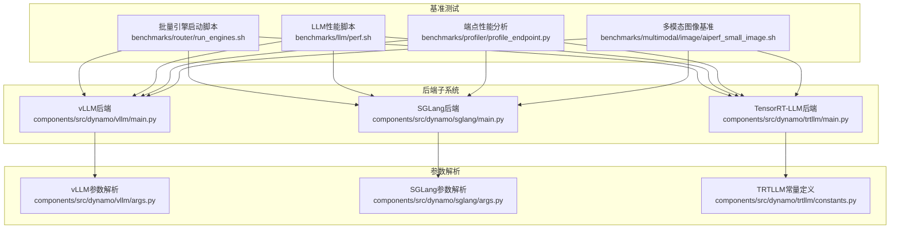
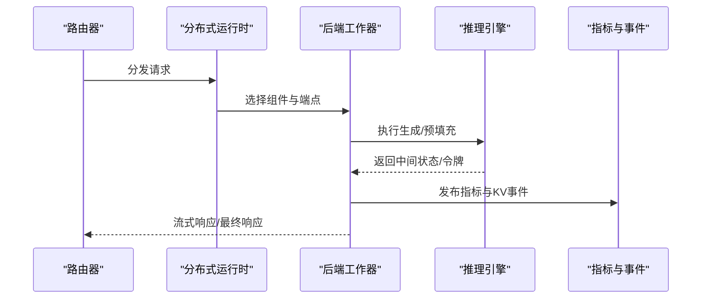
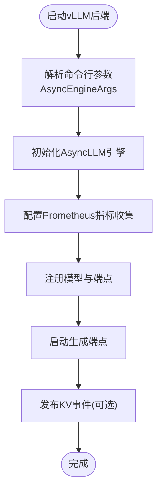
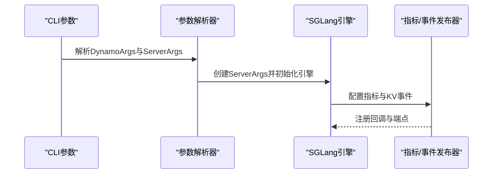
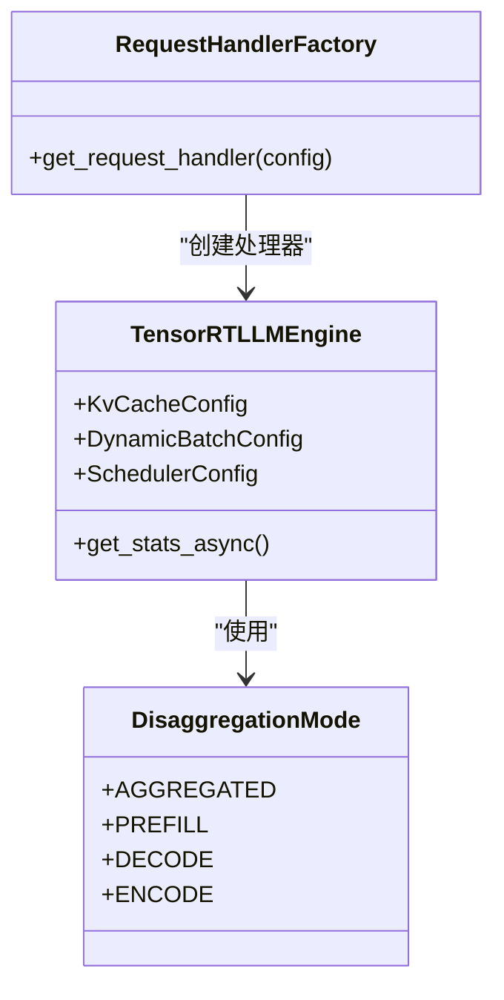
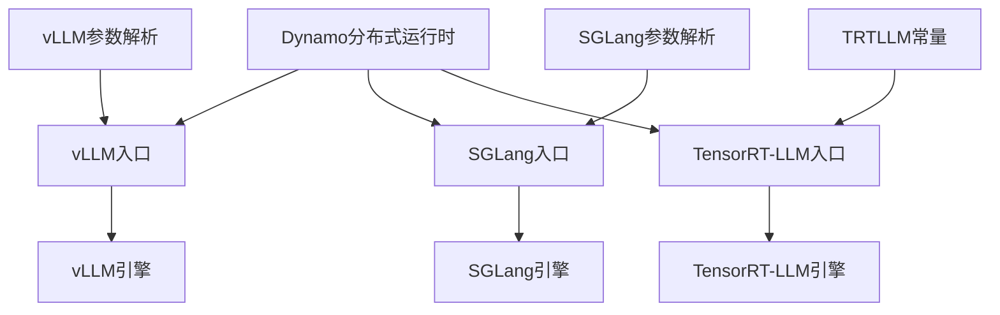

# 后端集成示例

<cite>
**本文档引用的文件**
- [components/src/dynamo/vllm/main.py](file://components/src/dynamo/vllm/main.py)
- [components/src/dynamo/vllm/args.py](file://components/src/dynamo/vllm/args.py)
- [components/src/dynamo/sglang/main.py](file://components/src/dynamo/sglang/main.py)
- [components/src/dynamo/sglang/args.py](file://components/src/dynamo/sglang/args.py)
- [components/src/dynamo/trtllm/main.py](file://components/src/dynamo/trtllm/main.py)
- [components/src/dynamo/trtllm/constants.py](file://components/src/dynamo/trtllm/constants.py)
- [benchmarks/router/run_engines.sh](file://benchmarks/router/run_engines.sh)
- [benchmarks/llm/perf.sh](file://benchmarks/llm/perf.sh)
- [benchmarks/profiler/profile_endpoint.py](file://benchmarks/profiler/profile_endpoint.py)
- [benchmarks/multimodal/image/aiperf_small_image.sh](file://benchmarks/multimodal/image/aiperf_small_image.sh)
- [deploy/inference-gateway/standalone/vllm_agg_qwen.yaml](file://deploy/inference-gateway/standalone/vllm_agg_qwen.yaml)
</cite>

## 目录
1. [简介](#简介)
2. [项目结构](#项目结构)
3. [核心组件](#核心组件)
4. [架构概览](#架构概览)
5. [详细组件分析](#详细组件分析)
6. [依赖关系分析](#依赖关系分析)
7. [性能考虑](#性能考虑)
8. [故障排查指南](#故障排查指南)
9. [结论](#结论)
10. [附录](#附录)

## 简介
本文件面向Dynamo平台的后端集成实践，系统性阐述vLLM、SGLang、TensorRT-LLM三大推理引擎在Dynamo中的集成方式与配置差异，并提供针对主流开源模型（Llama系列、Qwen系列、DeepSeek等）的部署示例。文档重点覆盖以下方面：
- 聚合式与分布式部署的配置参数与性能特征
- 多模态模型的特殊配置与优化技巧
- 完整的性能基准测试流程与结果分析
- 不同后端的适用场景与选择标准
- 常见问题的故障排查与性能调优案例

## 项目结构
Dynamo后端集成涉及三个核心子系统：vLLM、SGLang、TensorRT-LLM，每个子系统均包含独立的入口脚本、参数解析器、运行时初始化与处理逻辑。基准测试工具链提供了统一的性能评估框架。

**图表来源**
- [components/src/dynamo/vllm/main.py](file://components/src/dynamo/vllm/main.py#L1-L1028)
- [components/src/dynamo/sglang/main.py](file://components/src/dynamo/sglang/main.py#L1-L664)
- [components/src/dynamo/trtllm/main.py](file://components/src/dynamo/trtllm/main.py#L1-L528)
- [components/src/dynamo/vllm/args.py](file://components/src/dynamo/vllm/args.py#L1-L649)
- [components/src/dynamo/sglang/args.py](file://components/src/dynamo/sglang/args.py#L1-L640)
- [components/src/dynamo/trtllm/constants.py](file://components/src/dynamo/trtllm/constants.py#L1-L12)
- [benchmarks/router/run_engines.sh](file://benchmarks/router/run_engines.sh#L1-L273)
- [benchmarks/llm/perf.sh](file://benchmarks/llm/perf.sh#L1-L271)
- [benchmarks/profiler/profile_endpoint.py](file://benchmarks/profiler/profile_endpoint.py#L1-L124)
- [benchmarks/multimodal/image/aiperf_small_image.sh](file://benchmarks/multimodal/image/aiperf_small_image.sh#L1-L52)

**章节来源**
- [components/src/dynamo/vllm/main.py](file://components/src/dynamo/vllm/main.py#L1-L1028)
- [components/src/dynamo/sglang/main.py](file://components/src/dynamo/sglang/main.py#L1-L664)
- [components/src/dynamo/trtllm/main.py](file://components/src/dynamo/trtllm/main.py#L1-L528)

## 核心组件
本节从代码层面梳理三大后端的核心职责与关键实现模式：

- vLLM后端
  - 入口函数负责参数解析、模型下载、引擎初始化与端点注册
  - 支持前缀缓存事件发布、多进程Prometheus指标收集、KVBM整合
  - 提供预填充与解码两种工作角色，支持多模态处理器与编码器
  - 关键路径参考：[worker](file://components/src/dynamo/vllm/main.py#L76-L152)、[init](file://components/src/dynamo/vllm/main.py#L530-L674)、[init_prefill](file://components/src/dynamo/vllm/main.py#L418-L528)

- SGLang后端
  - 通过ServerArgs与DynamoArgs组合配置，支持聚合、前缀与解码三种服务模式
  - 非主节点仅暴露指标，避免阻塞；提供扩散语言模型与嵌入模型专用工作器
  - 关键路径参考：[worker](file://components/src/dynamo/sglang/main.py#L69-L124)、[init](file://components/src/dynamo/sglang/main.py#L125-L210)、[init_prefill](file://components/src/dynamo/sglang/main.py#L212-L287)

- TensorRT-LLM后端
  - 使用llmapi构建引擎参数，支持动态批处理、容量调度策略与KV缓存连接器
  - 提供编码器、前缀与解码三种工作器类型，支持多模态请求处理器
  - 关键路径参考：[worker](file://components/src/dynamo/trtllm/main.py#L128-L160)、[init](file://components/src/dynamo/trtllm/main.py#L162-L520)

**章节来源**
- [components/src/dynamo/vllm/main.py](file://components/src/dynamo/vllm/main.py#L76-L674)
- [components/src/dynamo/sglang/main.py](file://components/src/dynamo/sglang/main.py#L69-L287)
- [components/src/dynamo/trtllm/main.py](file://components/src/dynamo/trtllm/main.py#L128-L520)

## 架构概览
三大后端均遵循Dynamo统一的分布式运行时框架，通过命名空间与组件化端点进行路由与编排。下图展示了通用的后端工作流与关键交互点。

[此图为概念性流程图，不直接映射具体源码文件]

## 详细组件分析

### vLLM后端集成要点
- 参数与环境
  - 通过AsyncEngineArgs注入vLLM引擎参数，支持自定义采样参数与KV传输配置
  - 自动推导use_kv_events以启用ZMQ事件发布
  - 关键接口参考：[parse_args](file://components/src/dynamo/vllm/args.py#L110-L467)、[overwrite_args](file://components/src/dynamo/vllm/args.py#L559-L605)

- 引擎初始化与端点注册
  - 初始化AsyncLLM引擎，设置Prometheus多进程收集与统计日志
  - 注册模型类型（聊天/补全/预填充），并根据数据并行大小设置本地索引器
  - 关键接口参考：[setup_vllm_engine](file://components/src/dynamo/vllm/main.py#L289-L361)、[register_vllm_model](file://components/src/dynamo/vllm/main.py#L363-L416)

- 多模态支持
  - 支持处理器、编码器、统一编码-预填充-解码等多种模式
  - 通过Prompt模板与Tokenizer选项适配不同多模态模型
  - 关键接口参考：[init_multimodal_processor](file://components/src/dynamo/vllm/main.py#L702-L754)、[init_vllm_native_encoder](file://components/src/dynamo/vllm/main.py#L795-L800)

- 性能与指标
  - 支持多进程Prometheus指标合并，避免重复时间序列冲突
  - 提供KV事件发布与订阅，结合KVBM实现缓存一致性
  - 关键接口参考：[setup_metrics_collection](file://components/src/dynamo/vllm/main.py#L154-L210)、[setup_kv_event_publisher](file://components/src/dynamo/vllm/main.py#L212-L286)

**图表来源**
- [components/src/dynamo/vllm/main.py](file://components/src/dynamo/vllm/main.py#L289-L361)
- [components/src/dynamo/vllm/main.py](file://components/src/dynamo/vllm/main.py#L154-L210)
- [components/src/dynamo/vllm/args.py](file://components/src/dynamo/vllm/args.py#L559-L605)

**章节来源**
- [components/src/dynamo/vllm/args.py](file://components/src/dynamo/vllm/args.py#L110-L467)
- [components/src/dynamo/vllm/main.py](file://components/src/dynamo/vllm/main.py#L289-L416)

### SGLang后端集成要点
- 参数解析与配置合并
  - DynamoArgs与ServerArgs组合，支持从嵌套YAML提取配置段
  - 自动推导use_kv_events与扩散语言模型模式
  - 关键接口参考：[parse_args](file://components/src/dynamo/sglang/args.py#L324-L585)

- 工作器类型与服务模式
  - 支持聚合、前缀、解码三种模式；非主节点仅暴露指标
  - 提供扩散语言模型与嵌入模型专用工作器
  - 关键接口参考：[init](file://components/src/dynamo/sglang/main.py#L125-L210)、[_handle_non_leader_node](file://components/src/dynamo/sglang/main.py#L39-L67)

- 指标与事件
  - 通过共享内存暴露SGLang指标；支持KV事件发布
  - 关键接口参考：[setup_sgl_metrics](file://components/src/dynamo/sglang/main.py#L147-L149)

**图表来源**
- [components/src/dynamo/sglang/args.py](file://components/src/dynamo/sglang/args.py#L324-L585)
- [components/src/dynamo/sglang/main.py](file://components/src/dynamo/sglang/main.py#L125-L210)

**章节来源**
- [components/src/dynamo/sglang/args.py](file://components/src/dynamo/sglang/args.py#L324-L585)
- [components/src/dynamo/sglang/main.py](file://components/src/dynamo/sglang/main.py#L39-L210)

### TensorRT-LLM后端集成要点
- 引擎参数构建
  - 通过KvCacheConfig、DynamicBatchConfig、SchedulerConfig构建引擎参数
  - 支持KV缓存连接器（KVBM）与事件缓冲区配置
  - 关键接口参考：[init](file://components/src/dynamo/trtllm/main.py#L162-L310)

- 工作器类型与模式
  - 支持编码器、前缀、解码与聚合四种模式
  - 通过DisaggregationMode枚举控制工作器行为
  - 关键接口参考：[constants](file://components/src/dynamo/trtllm/constants.py#L7-L12)

- 指标与事件
  - 初始化MetricsCollector并注册到全局REGISTRY
  - 支持事件发布与KVBM整合
  - 关键接口参考：[get_publisher](file://components/src/dynamo/trtllm/main.py#L494-L504)

**图表来源**
- [components/src/dynamo/trtllm/constants.py](file://components/src/dynamo/trtllm/constants.py#L7-L12)
- [components/src/dynamo/trtllm/main.py](file://components/src/dynamo/trtllm/main.py#L162-L520)

**章节来源**
- [components/src/dynamo/trtllm/constants.py](file://components/src/dynamo/trtllm/constants.py#L7-L12)
- [components/src/dynamo/trtllm/main.py](file://components/src/dynamo/trtllm/main.py#L162-L520)

## 依赖关系分析
三大后端均依赖Dynamo的分布式运行时与统一的端点注册机制，同时各自封装了引擎特定的参数与初始化流程。

**图表来源**
- [components/src/dynamo/vllm/main.py](file://components/src/dynamo/vllm/main.py#L92-L96)
- [components/src/dynamo/sglang/main.py](file://components/src/dynamo/sglang/main.py#L91-L96)
- [components/src/dynamo/trtllm/main.py](file://components/src/dynamo/trtllm/main.py#L145-L147)

**章节来源**
- [components/src/dynamo/vllm/main.py](file://components/src/dynamo/vllm/main.py#L92-L96)
- [components/src/dynamo/sglang/main.py](file://components/src/dynamo/sglang/main.py#L91-L96)
- [components/src/dynamo/trtllm/main.py](file://components/src/dynamo/trtllm/main.py#L145-L147)

## 性能考虑
- 批处理与并发
  - vLLM：通过block_size与max_num_batched_tokens控制批处理粒度
  - SGLang：通过stream_output强制流式输出，减少累积开销
  - TRTLLM：通过DynamicBatchConfig与CapacitySchedulerPolicy优化吞吐

- 指标与可观测性
  - vLLM：多进程Prometheus指标合并，避免重复时间序列
  - SGLang：共享内存指标暴露，非主节点仅暴露指标
  - TRTLLM：MetricsCollector注册到全局REGISTRY，过滤无关指标

- 缓存与事件
  - vLLM：KV事件发布与订阅，结合KVBM实现缓存一致性
  - TRTLLM：事件缓冲区与KV缓存连接器，支持事件发布

**章节来源**
- [components/src/dynamo/vllm/main.py](file://components/src/dynamo/vllm/main.py#L154-L210)
- [components/src/dynamo/sglang/main.py](file://components/src/dynamo/sglang/main.py#L147-L154)
- [components/src/dynamo/trtllm/main.py](file://components/src/dynamo/trtllm/main.py#L407-L429)

## 故障排查指南
- vLLM常见问题
  - 多进程指标冲突：检查PROMETHEUS_MULTIPROC_DIR设置，必要时使用分离注册表
  - GIL阻塞：在TP=1且使用NIXL连接器时强制mp执行器
  - 关键接口参考：[setup_metrics_collection](file://components/src/dynamo/vllm/main.py#L154-L210)、[overwrite_args](file://components/src/dynamo/vllm/args.py#L306-L311)

- SGLang常见问题
  - 非主节点阻塞：设置SGLANG_BLOCK_NONZERO_RANK_CHILDREN=0
  - 配置文件解析：注意嵌套YAML提取与临时文件清理
  - 关键接口参考：[_handle_non_leader_node](file://components/src/dynamo/sglang/main.py#L39-L67)、[parse_args](file://components/src/dynamo/sglang/args.py#L377-L426)

- TensorRT-LLM常见问题
  - MPI初始化冲突：多进程启动时增加延迟
  - 事件发布失败：检查event_buffer_max_size与backend配置
  - 关键接口参考：[run_engines.sh](file://benchmarks/router/run_engines.sh#L262-L266)、[init](file://components/src/dynamo/trtllm/main.py#L248-L274)

**章节来源**
- [components/src/dynamo/vllm/main.py](file://components/src/dynamo/vllm/main.py#L154-L210)
- [components/src/dynamo/vllm/args.py](file://components/src/dynamo/vllm/args.py#L306-L311)
- [components/src/dynamo/sglang/main.py](file://components/src/dynamo/sglang/main.py#L39-L67)
- [components/src/dynamo/sglang/args.py](file://components/src/dynamo/sglang/args.py#L377-L426)
- [benchmarks/router/run_engines.sh](file://benchmarks/router/run_engines.sh#L262-L266)
- [components/src/dynamo/trtllm/main.py](file://components/src/dynamo/trtllm/main.py#L248-L274)

## 结论
Dynamo为vLLM、SGLang、TensorRT-LLM提供了统一的集成框架，通过参数解析、引擎初始化与端点注册实现了灵活的聚合与分布式部署。三大后端在批处理、指标与事件发布方面各有侧重，用户可根据模型规模、并发需求与硬件条件选择最适合的后端与部署模式。

## 附录

### 部署示例与配置
- vLLM聚合部署示例
  - 参考文件：[vllm_agg_qwen.yaml](file://deploy/inference-gateway/standalone/vllm_agg_qwen.yaml#L1-L18)
  - 说明：定义DynamoGraphDeployment名称与模型标识符，用于网关路由

- 模型类型与后端选择建议
  - Llama系列：优先考虑vLLM（高吞吐）、SGLang（低延迟）、TRTLLM（严格时延）
  - Qwen系列：vLLM（生态完善）、SGLang（多模态）、TRTLLM（生产级）
  - DeepSeek等MoE模型：TRTLLM（专家并行支持）、SGLang（扩散语言模型）

- 多模态配置要点
  - vLLM：通过--enable-multimodal与--mm-prompt-template配置提示模板
  - SGLang：通过--multimodal-processor与--multimodal-worker启用多模态处理器
  - TRTLLM：通过MultimodalRequestProcessor与模型配置文件支持多模态

**章节来源**
- [deploy/inference-gateway/standalone/vllm_agg_qwen.yaml](file://deploy/inference-gateway/standalone/vllm_agg_qwen.yaml#L1-L18)
- [components/src/dynamo/vllm/args.py](file://components/src/dynamo/vllm/args.py#L202-L219)
- [components/src/dynamo/sglang/args.py](file://components/src/dynamo/sglang/args.py#L76-L93)
- [components/src/dynamo/trtllm/main.py](file://components/src/dynamo/trtllm/main.py#L345-L356)

### 性能基准测试流程
- 批量引擎启动
  - 用途：快速启动多个vLLM/SGLang/TRTLLM工作器进行对比测试
  - 关键参数：--num-workers、--tensor-parallel-size、--data-parallel-size、--mode
  - 参考：[run_engines.sh](file://benchmarks/router/run_engines.sh#L1-L273)

- LLM端到端性能
  - 用途：对指定URL进行端到端性能评测，支持聚合与分布式模式
  - 关键参数：--model、--url、--concurrency、--mode、--isl/--osl
  - 参考：[perf.sh](file://benchmarks/llm/perf.sh#L1-L271)

- 端点性能分析
  - 用途：针对预填充或解码阶段进行性能分析
  - 关键参数：--mode、--model_name、--url、--num_gpus、--max_kv_tokens
  - 参考：[profile_endpoint.py](file://benchmarks/profiler/profile_endpoint.py#L1-L124)

- 多模态图像基准
  - 用途：对多模态模型进行图像输入的性能评测
  - 关键参数：--model、--concurrency、--input-file
  - 参考：[aiperf_small_image.sh](file://benchmarks/multimodal/image/aiperf_small_image.sh#L1-L52)

**章节来源**
- [benchmarks/router/run_engines.sh](file://benchmarks/router/run_engines.sh#L1-L273)
- [benchmarks/llm/perf.sh](file://benchmarks/llm/perf.sh#L1-L271)
- [benchmarks/profiler/profile_endpoint.py](file://benchmarks/profiler/profile_endpoint.py#L1-L124)
- [benchmarks/multimodal/image/aiperf_small_image.sh](file://benchmarks/multimodal/image/aiperf_small_image.sh#L1-L52)