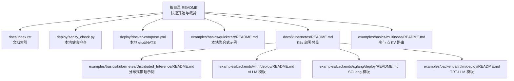
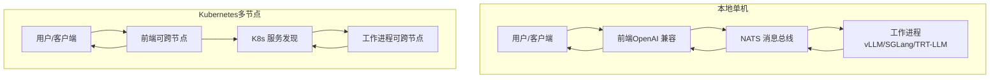
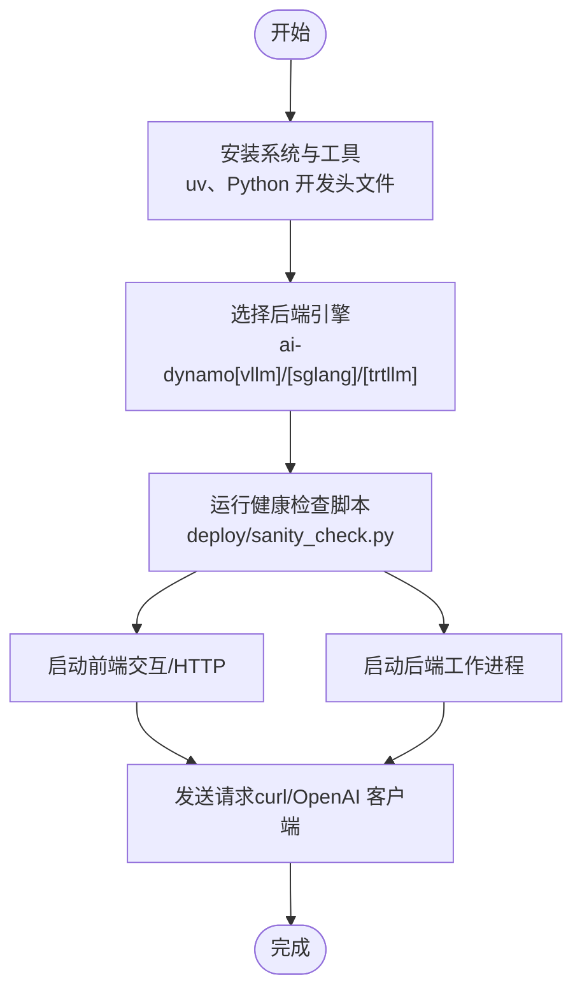
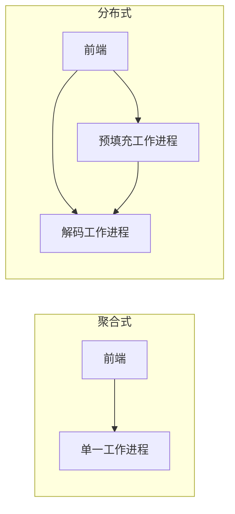
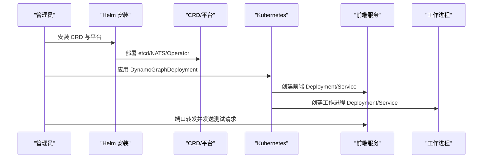
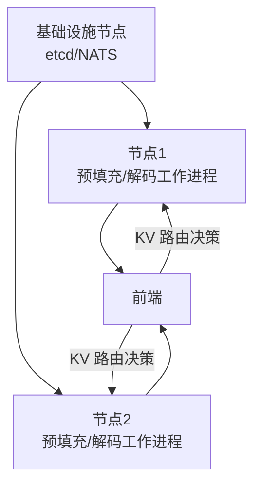
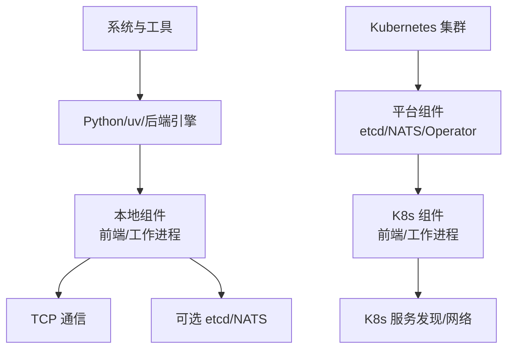

# 基础示例

<cite>
**本文引用的文件**
- [README.md](file://README.md)
- [index.rst](file://docs/index.rst)
- [sanity_check.py](file://deploy/sanity_check.py)
- [docker-compose.yml](file://deploy/docker-compose.yml)
- [README.md（快速入门）](file://examples/basics/quickstart/README.md)
- [README.md（Kubernetes 部署指南）](file://docs/kubernetes/README.md)
- [README.md（Kubernetes 安装指南）](file://docs/kubernetes/installation_guide.md)
- [README.md（分布式推理示例）](file://examples/basics/kubernetes/Distributed_Inference/README.md)
- [README.md（多节点示例）](file://examples/basics/multinode/README.md)
- [README.md（vLLM 部署模板）](file://examples/backends/vllm/deploy/README.md)
- [README.md（SGLang 部署模板）](file://examples/backends/sglang/deploy/README.md)
- [README.md（TensorRT-LLM 部署模板）](file://examples/backends/trtllm/deploy/README.md)
</cite>

## 目录
1. [简介](#简介)
2. [项目结构](#项目结构)
3. [核心组件](#核心组件)
4. [架构总览](#架构总览)
5. [详细组件分析](#详细组件分析)
6. [依赖关系分析](#依赖关系分析)
7. [性能考虑](#性能考虑)
8. [故障排查指南](#故障排查指南)
9. [结论](#结论)
10. [附录](#附录)

## 简介
本文件面向首次接触 Dynamo 的用户，提供从零开始的完整入门路径：单机开发环境搭建、依赖与验证、聚合式与分布式推理示例、Kubernetes 基础部署、多节点推理基础与配置要点，并给出端到端的完整示例流程与常见问题的解决方案。

## 项目结构
Dynamo 提供了从本地快速起步到生产级 Kubernetes 部署的全链路能力，核心入口与示例分布如下：
- 顶层说明与快速开始：根目录 README
- 文档索引与章节组织：docs/index.rst
- 本地环境健康检查工具：deploy/sanity_check.py
- 本地基础设施服务编排：deploy/docker-compose.yml
- 快速入门示例（本地聚合式）：examples/basics/quickstart/README.md
- Kubernetes 平台部署与示例：docs/kubernetes/README.md、examples/basics/kubernetes/Distributed_Inference/README.md
- 多节点 KV 路由示例：examples/basics/multinode/README.md
- 各后端部署模板（vLLM/SGLang/TRT-LLM）：examples/backends/*/deploy/README.md

图表来源
- [README.md](file://README.md#L76-L181)
- [index.rst](file://docs/index.rst#L31-L92)
- [sanity_check.py](file://deploy/sanity_check.py#L1-L120)
- [docker-compose.yml](file://deploy/docker-compose.yml#L1-L36)
- [README.md（快速入门）](file://examples/basics/quickstart/README.md#L1-L162)
- [README.md（Kubernetes 部署指南）](file://docs/kubernetes/README.md#L1-L253)
- [README.md（分布式推理示例）](file://examples/basics/kubernetes/Distributed_Inference/README.md#L1-L79)
- [README.md（多节点示例）](file://examples/basics/multinode/README.md#L1-L515)
- [README.md（vLLM 部署模板）](file://examples/backends/vllm/deploy/README.md#L1-L265)
- [README.md（SGLang 部署模板）](file://examples/backends/sglang/deploy/README.md#L1-L163)
- [README.md（TensorRT-LLM 部署模板）](file://examples/backends/trtllm/deploy/README.md#L1-L287)

章节来源
- [README.md](file://README.md#L76-L181)
- [index.rst](file://docs/index.rst#L31-L92)

## 核心组件
- 前端（Frontend）：提供 OpenAI 兼容的 HTTP 接口，负责请求预处理、路由与负载均衡。
- 路由器（Router）：支持 KV 缓存感知路由，提升缓存命中率，降低重复计算。
- 工作进程（Workers）：集成 vLLM、SGLang、TensorRT-LLM 等后端引擎，执行预填充与解码。
- 服务发现与消息（etcd/NATS）：在本地或 Kubernetes 中提供注册表与消息通道。
- 平台与 Operator（Kubernetes）：通过 CRD 自动化部署、扩缩容与运维。

章节来源
- [README.md](file://README.md#L225-L243)
- [README.md（快速入门）](file://examples/basics/quickstart/README.md#L18-L35)

## 架构总览
下图展示了本地与 Kubernetes 两种部署形态的关键差异与共同点。

图表来源
- [README.md（快速入门）](file://examples/basics/quickstart/README.md#L23-L34)
- [README.md（Kubernetes 部署指南）](file://docs/kubernetes/README.md#L160-L176)

## 详细组件分析

### 单机开发环境搭建与验证
- 系统与工具准备：推荐使用 Ubuntu 24.04，安装 Python 开发头文件与 uv 包管理器。
- 选择引擎：根据需求安装对应后端的 Python 轮子（vLLM/SGLang/TensorRT-LLM）。
- 健康检查：运行本地诊断脚本，验证系统资源、容器上下文、开发工具、框架与 Dynamo 组件状态。
- 本地启动：分别启动前端与后端工作进程；或使用内置前端交互模式与 HTTP 服务。
- 发送请求：使用 curl 或 OpenAI 兼容客户端进行测试。

图表来源
- [README.md](file://README.md#L96-L181)
- [sanity_check.py](file://deploy/sanity_check.py#L1-L120)
- [README.md（快速入门）](file://examples/basics/quickstart/README.md#L36-L86)

章节来源
- [README.md](file://README.md#L96-L181)
- [sanity_check.py](file://deploy/sanity_check.py#L1-L120)
- [README.md（快速入门）](file://examples/basics/quickstart/README.md#L36-L86)

### 聚合式与分布式推理示例
- 聚合式（Aggregated）：前端与单一工作进程在同一拓扑内，适合开发与小规模测试。
- 分布式（Disaggregated）：将预填充与解码分离为独立工作进程，通过高性能传输（如 NIXL）连接，提升吞吐与灵活性。
- 路由策略：KV 缓存感知路由可基于缓存重用度智能分配请求，减少重复计算。

图表来源
- [README.md（vLLM 部署模板）](file://examples/backends/vllm/deploy/README.md#L7-L37)
- [README.md（SGLang 部署模板）](file://examples/backends/sglang/deploy/README.md#L7-L30)
- [README.md（TensorRT-LLM 部署模板）](file://examples/backends/trtllm/deploy/README.md#L7-L54)

章节来源
- [README.md（vLLM 部署模板）](file://examples/backends/vllm/deploy/README.md#L7-L37)
- [README.md（SGLang 部署模板）](file://examples/backends/sglang/deploy/README.md#L7-L30)
- [README.md（TensorRT-LLM 部署模板）](file://examples/backends/trtllm/deploy/README.md#L7-L54)

### Kubernetes 基础部署
- 平台安装：通过 Helm 安装 CRD 与平台组件（etcd、NATS、Operator），支持共享集群与专用集群两种路径。
- 部署模型：使用示例 CRD（DynamoGraphDeployment）部署前端与工作进程，支持聚合与分布式模式。
- 访问与测试：通过服务端口转发访问前端 API，发送测试请求验证部署。

图表来源
- [README.md（Kubernetes 安装指南）](file://docs/kubernetes/installation_guide.md#L133-L167)
- [README.md（Kubernetes 部署指南）](file://docs/kubernetes/README.md#L97-L120)

章节来源
- [README.md（Kubernetes 安装指南）](file://docs/kubernetes/installation_guide.md#L133-L167)
- [README.md（Kubernetes 部署指南）](file://docs/kubernetes/README.md#L97-L120)

### 多节点推理基础与配置要点
- 场景：在多个节点上部署相同模型的多个副本，前端通过 KV 路由在副本间智能分发请求。
- 关键点：确保 etcd/NATS 在可被所有节点访问的基础设施节点上运行；正确配置网络端口与高速互连（如 InfiniBand/RoCE）以启用 GPU 到 GPU 的高效传输。
- 测试：通过多轮对话与并发请求观察 KV 路由效果与负载分布。

图表来源
- [README.md（多节点示例）](file://examples/basics/multinode/README.md#L10-L51)
- [README.md（分布式推理示例）](file://examples/basics/kubernetes/Distributed_Inference/README.md#L1-L79)

章节来源
- [README.md（多节点示例）](file://examples/basics/multinode/README.md#L70-L115)
- [README.md（分布式推理示例）](file://examples/basics/kubernetes/Distributed_Inference/README.md#L1-L79)

### 端到端示例（从模型加载到推理响应）
- 本地端到端：
  1) 启动 etcd/NATS（可选，本地开发可用文件存储避免外部依赖）
  2) 启动后端工作进程（vLLM/SGLang/TRT-LLM）
  3) 启动前端（交互或 HTTP）
  4) 发送请求并接收响应
- Kubernetes 端到端：
  1) 安装平台（CRD/Operator/etcd/NATS）
  2) 应用 CRD 部署前端与工作进程
  3) 端口转发访问前端
  4) 发送请求并观测指标

章节来源
- [README.md（快速入门）](file://examples/basics/quickstart/README.md#L36-L162)
- [README.md（Kubernetes 部署指南）](file://docs/kubernetes/README.md#L97-L120)

## 依赖关系分析
- 本地依赖：Python、uv、后端引擎包、可选的 etcd/NATS（或文件存储）。
- Kubernetes 依赖：K8s 集群（含 GPU 节点）、Helm、CRD/Operator、镜像仓库权限。
- 通信依赖：TCP 用于组件间通信；KV 路由场景需要 NATS；分布式场景建议使用 NIXL 进行 GPU 到 GPU 的高效数据传输。

图表来源
- [README.md](file://README.md#L225-L243)
- [docker-compose.yml](file://deploy/docker-compose.yml#L11-L36)
- [README.md（Kubernetes 安装指南）](file://docs/kubernetes/installation_guide.md#L86-L132)

章节来源
- [README.md](file://README.md#L225-L243)
- [docker-compose.yml](file://deploy/docker-compose.yml#L11-L36)
- [README.md（Kubernetes 安装指南）](file://docs/kubernetes/installation_guide.md#L86-L132)

## 性能考虑
- 聚合式适合低延迟与简单部署；分布式通过分离预填充与解码提升吞吐，尤其在长上下文与高并发场景。
- KV 缓存感知路由可显著减少重复计算，提高缓存命中率，适用于多轮对话与相似前缀的查询。
- 多节点部署需关注网络带宽与延迟，优先使用高速互连（如 InfiniBand/RoCE）以发挥 NIXL 的优势。
- 资源配额与扩缩容：在 Kubernetes 中合理设置 GPU/内存请求与限制，并结合 SLA 规划自动扩缩容。

## 故障排查指南
- 本地健康检查：使用诊断脚本输出系统信息、GPU/CUDA 状态、框架与 Dynamo 组件可用性，定位缺失项。
- 本地服务：确认 etcd/NATS 可用；若无外部依赖，可在本地使用文件存储方式启动前端与工作进程。
- Kubernetes：检查 CRD 是否已安装、Operator 是否正常、Pod 日志与事件；验证 HuggingFace Token Secret 是否正确创建。
- 多节点：核验 etcd/NATS 可达性、端口开放情况、NIXL 传输链路与 GPU 互联配置；通过日志观察 KV 路由决策与缓存命中情况。

章节来源
- [sanity_check.py](file://deploy/sanity_check.py#L1-L120)
- [README.md（快速入门）](file://examples/basics/quickstart/README.md#L70-L106)
- [README.md（Kubernetes 安装指南）](file://docs/kubernetes/installation_guide.md#L297-L357)
- [README.md（多节点示例）](file://examples/basics/multinode/README.md#L437-L465)

## 结论
通过本基础示例文档，您可以从单机环境快速验证 Dynamo 的核心能力，掌握聚合式与分布式两种部署模式的差异与适用场景，并在 Kubernetes 上完成最小化平台安装与模型部署。结合 KV 路由与多节点配置，可进一步优化吞吐与缓存利用率，满足生产级推理需求。

## 附录
- 快速开始命令参考与示例路径见各示例 README。
- 后端部署模板（vLLM/SGLang/TRT-LLM）提供了聚合与分布式模式的 YAML 示例，便于直接应用与定制。

章节来源
- [README.md（vLLM 部署模板）](file://examples/backends/vllm/deploy/README.md#L114-L171)
- [README.md（SGLang 部署模板）](file://examples/backends/sglang/deploy/README.md#L82-L134)
- [README.md（TensorRT-LLM 部署模板）](file://examples/backends/trtllm/deploy/README.md#L130-L194)