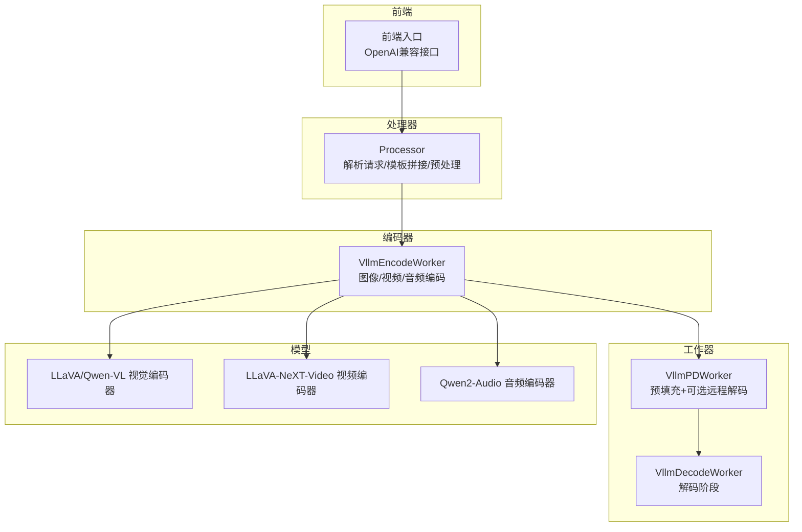
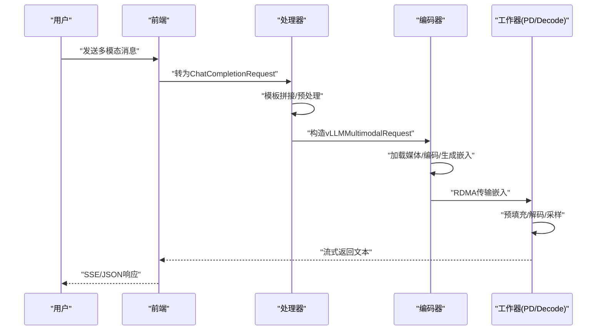
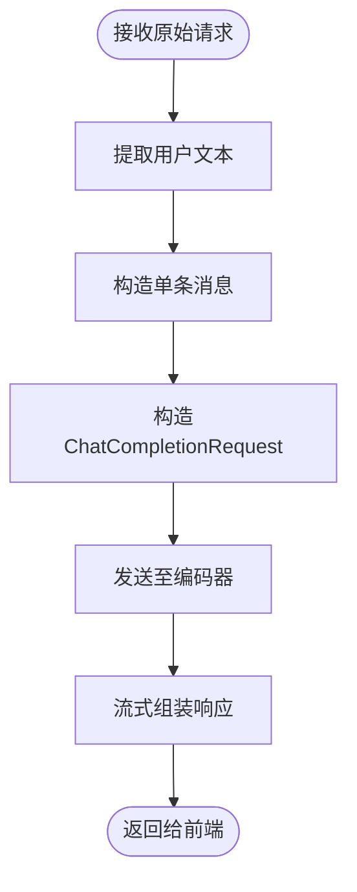
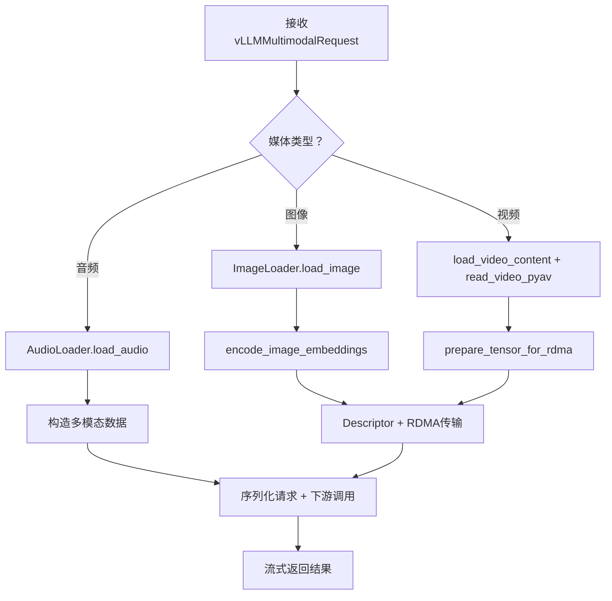
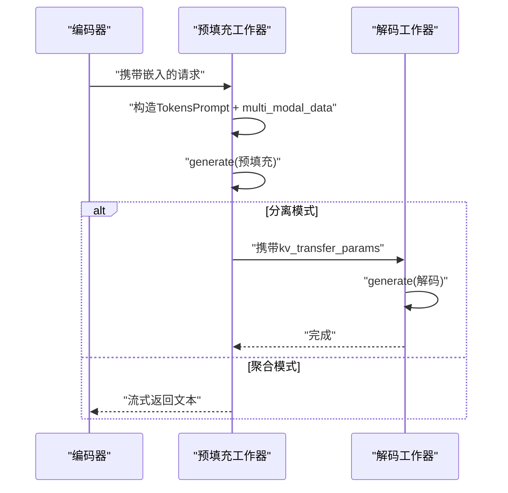
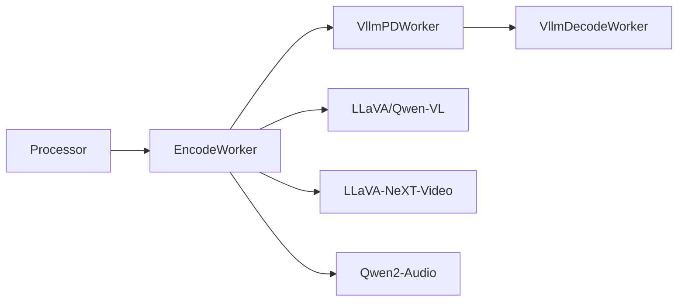

# 多模态应用示例

<cite>
**本文引用的文件**
- [examples/multimodal/deploy/agg_llava.yaml](file://examples/multimodal/deploy/agg_llava.yaml)
- [examples/multimodal/deploy/agg_qwen.yaml](file://examples/multimodal/deploy/agg_qwen.yaml)
- [examples/multimodal/utils/model.py](file://examples/multimodal/utils/model.py)
- [examples/multimodal/utils/chat_processor.py](file://examples/multimodal/utils/chat_processor.py)
- [examples/multimodal/utils/audio_loader.py](file://examples/multimodal/utils/audio_loader.py)
- [examples/multimodal/components/encode_worker.py](file://examples/multimodal/components/encode_worker.py)
- [examples/multimodal/components/worker.py](file://examples/multimodal/components/worker.py)
- [examples/multimodal/components/processor.py](file://examples/multimodal/components/processor.py)
- [examples/multimodal/utils/image_loader.py](file://examples/multimodal/utils/image_loader.py)
- [examples/multimodal/utils/video_utils.py](file://examples/multimodal/utils/video_utils.py)
- [examples/multimodal/utils/encode_utils.py](file://examples/multimodal/utils/encode_utils.py)
- [examples/multimodal/utils/http_client.py](file://examples/multimodal/utils/http_client.py)
- [examples/multimodal/utils/protocol.py](file://examples/multimodal/utils/protocol.py)
- [examples/multimodal/utils/chat_message_utils.py](file://examples/multimodal/utils/chat_message_utils.py)
- [examples/multimodal/launch/audio_agg.sh](file://examples/multimodal/launch/audio_agg.sh)
</cite>

## 目录
1. [简介](#简介)
2. [项目结构](#项目结构)
3. [核心组件](#核心组件)
4. [架构总览](#架构总览)
5. [详细组件分析](#详细组件分析)
6. [依赖关系分析](#依赖关系分析)
7. [性能与资源优化](#性能与资源优化)
8. [故障排查指南](#故障排查指南)
9. [结论](#结论)
10. [附录：端到端应用与部署](#附录端到端应用与部署)

## 简介
本文件面向希望在Dynamo平台上构建多模态应用（图像、音频、视频）的开发者，提供从媒体文件加载、特征提取、编码、到文本生成的完整推理流水线说明。文档覆盖以下要点：
- 多模态输入处理流程与配置方法（图像、音频、视频）
- 完整推理管道：前端 → 处理器 → 编码器 → 预填充/解码工作器 → 文本生成
- 主流模型集成：LLaVA、Qwen-VL、LLaVA-NeXT-Video、Qwen2-Audio
- 自定义编码器与处理器组件开发指南
- 性能优化与资源管理策略
- 多模态数据预处理与后处理方法
- 端到端应用示例与部署配置

## 项目结构
多模态示例位于examples/multimodal目录，主要由三部分组成：
- 组件层：编码器、处理器、工作器（预填充/解码/编码预填充）
- 工具层：图像/音频/视频加载器、协议定义、编码工具、聊天处理器、HTTP客户端
- 部署层：Kubernetes YAML与本地启动脚本

图表来源
- [examples/multimodal/components/processor.py](file://examples/multimodal/components/processor.py#L196-L263)
- [examples/multimodal/components/encode_worker.py](file://examples/multimodal/components/encode_worker.py#L73-L155)
- [examples/multimodal/components/worker.py](file://examples/multimodal/components/worker.py#L227-L397)

章节来源
- [examples/multimodal/deploy/agg_llava.yaml](file://examples/multimodal/deploy/agg_llava.yaml#L1-L64)
- [examples/multimodal/deploy/agg_qwen.yaml](file://examples/multimodal/deploy/agg_qwen.yaml#L1-L65)

## 核心组件
- 前端与处理器（Processor）：负责将用户消息转换为模型期望的提示词模板，构造vLLM可理解的TokensPrompt，并通过OpenAI风格的流式响应返回结果。
- 编码器（VllmEncodeWorker）：加载媒体（图像/视频/音频），调用对应编码器与投影器，生成嵌入并通过RDMA传输给下游工作器。
- 工作器（VllmPDWorker/VllmDecodeWorker）：执行预填充与解码，支持聚合或分离模式；在聚合模式下直接生成文本，在分离模式下将KV缓存转移至解码器。
- 工具模块：图像/音频/视频加载器、HTTP客户端、编码工具、聊天处理器、协议定义。

章节来源
- [examples/multimodal/components/processor.py](file://examples/multimodal/components/processor.py#L48-L111)
- [examples/multimodal/components/encode_worker.py](file://examples/multimodal/components/encode_worker.py#L47-L104)
- [examples/multimodal/components/worker.py](file://examples/multimodal/components/worker.py#L47-L120)

## 架构总览
多模态推理链路分为“前端-处理器-编码器-工作器”四段，结合RDMA进行高效数据传输，支持聚合与分离两种部署形态。

图表来源
- [examples/multimodal/components/processor.py](file://examples/multimodal/components/processor.py#L196-L263)
- [examples/multimodal/components/encode_worker.py](file://examples/multimodal/components/encode_worker.py#L73-L155)
- [examples/multimodal/components/worker.py](file://examples/multimodal/components/worker.py#L227-L397)

## 详细组件分析

### 处理器（Processor）
职责：
- 解析原始请求，提取用户文本内容
- 使用prompt_template拼接最终提示词
- 调用OpenAI风格的预处理与流式响应组装
- 将请求转发给编码器工作器

关键点：
- 支持模板占位符“<prompt>”，自动替换用户文本
- 对图像/视频/音频URL进行校验与互斥检查
- 通过register_llm注册为模型入口

图表来源
- [examples/multimodal/components/processor.py](file://examples/multimodal/components/processor.py#L207-L262)

章节来源
- [examples/multimodal/components/processor.py](file://examples/multimodal/components/processor.py#L48-L111)
- [examples/multimodal/utils/chat_processor.py](file://examples/multimodal/utils/chat_processor.py#L128-L282)
- [examples/multimodal/utils/chat_message_utils.py](file://examples/multimodal/utils/chat_message_utils.py#L7-L26)

### 编码器（VllmEncodeWorker）
职责：
- 加载图像/视频/音频
- 使用模型特定编码器与投影器生成嵌入
- 通过NIXL Connector进行RDMA传输
- 将请求回传给下游工作器并流式返回结果

关键点：
- 图像：使用AutoImageProcessor与视觉编码器/投影器
- 视频：读取容器、采样帧、调整尺寸、准备RDMA张量
- 音频：使用librosa加载，按模型要求格式化

图表来源
- [examples/multimodal/components/encode_worker.py](file://examples/multimodal/components/encode_worker.py#L73-L155)
- [examples/multimodal/utils/encode_utils.py](file://examples/multimodal/utils/encode_utils.py#L58-L103)
- [examples/multimodal/utils/video_utils.py](file://examples/multimodal/utils/video_utils.py#L37-L153)
- [examples/multimodal/utils/audio_loader.py](file://examples/multimodal/utils/audio_loader.py#L61-L81)

章节来源
- [examples/multimodal/components/encode_worker.py](file://examples/multimodal/components/encode_worker.py#L47-L104)
- [examples/multimodal/utils/image_loader.py](file://examples/multimodal/utils/image_loader.py#L41-L108)
- [examples/multimodal/utils/video_utils.py](file://examples/multimodal/utils/video_utils.py#L214-L287)
- [examples/multimodal/utils/audio_loader.py](file://examples/multimodal/utils/audio_loader.py#L30-L81)

### 工作器（VllmPDWorker/VllmDecodeWorker）
职责：
- 预填充阶段：将TokensPrompt与多模态数据送入vLLM引擎
- 可选分离模式：将KV缓存参数传递给解码器，实现远程解码
- 解码阶段：仅处理token生成，不重复计算视觉特征

关键点：
- 根据模型名选择嵌入dtype（视频/音频可能使用uint8，图像默认float16）
- 支持清空KV缓存以释放显存

图表来源
- [examples/multimodal/components/worker.py](file://examples/multimodal/components/worker.py#L227-L397)

章节来源
- [examples/multimodal/components/worker.py](file://examples/multimodal/components/worker.py#L194-L226)
- [examples/multimodal/components/worker.py](file://examples/multimodal/components/worker.py#L227-L397)

### 模型与编码工具
- SupportedModels：声明支持的模型ID（LLaVA/Qwen-VL/LLaVA-NeXT-Video/Qwen2-Audio）
- construct_mm_data：根据模型类型构造多模态数据字典（图像/视频/音频）
- encode_image_embeddings/get_encoder_components：按模型选择编码器与投影器，输出标准化嵌入

章节来源
- [examples/multimodal/utils/model.py](file://examples/multimodal/utils/model.py#L25-L92)
- [examples/multimodal/utils/encode_utils.py](file://examples/multimodal/utils/encode_utils.py#L58-L133)

### 协议与预处理
- protocol.py：定义vLLMMultimodalRequest/MultiModalInput/MyRequestOutput等序列化模型，适配vLLM的TokensPrompt与SamplingParams
- chat_processor.py：封装OpenAIServingChat/Completion的预处理与流式响应组装逻辑

章节来源
- [examples/multimodal/utils/protocol.py](file://examples/multimodal/utils/protocol.py#L157-L191)
- [examples/multimodal/utils/chat_processor.py](file://examples/multimodal/utils/chat_processor.py#L128-L282)

## 依赖关系分析
- 组件间依赖：Processor → EncodeWorker → VllmPDWorker/VllmDecodeWorker
- 数据通道：图像/视频/音频通过RDMA在组件间传输
- 模型依赖：不同模型需要不同的编码器/投影器与多模态数据格式

图表来源
- [examples/multimodal/components/processor.py](file://examples/multimodal/components/processor.py#L196-L263)
- [examples/multimodal/components/encode_worker.py](file://examples/multimodal/components/encode_worker.py#L73-L155)
- [examples/multimodal/components/worker.py](file://examples/multimodal/components/worker.py#L227-L397)

章节来源
- [examples/multimodal/utils/model.py](file://examples/multimodal/utils/model.py#L25-L92)
- [examples/multimodal/utils/encode_utils.py](file://examples/multimodal/utils/encode_utils.py#L105-L133)

## 性能与资源优化
- 嵌入dtype与设备选择
  - 视频/音频：使用CPU+uint8以降低带宽与内存占用
  - 图像：默认float16，减少显存压力
- RDMA传输
  - 将大张量（视频帧）在CPU上连续化并以uint8传输，提升跨节点效率
- 缓存策略
  - 图像/视频/音频加载器均内置LRU/队列缓存，避免重复下载与解码
- 异步I/O
  - 所有网络与磁盘操作均异步化，避免阻塞事件循环
- 清理与回收
  - 提供清空KV缓存接口，便于长会话下的显存回收

章节来源
- [examples/multimodal/components/worker.py](file://examples/multimodal/components/worker.py#L244-L248)
- [examples/multimodal/utils/video_utils.py](file://examples/multimodal/utils/video_utils.py#L390-L415)
- [examples/multimodal/utils/image_loader.py](file://examples/multimodal/utils/image_loader.py#L31-L108)
- [examples/multimodal/utils/audio_loader.py](file://examples/multimodal/utils/audio_loader.py#L30-L81)

## 故障排查指南
- 常见错误与定位
  - 缺少媒体URL或混用多种媒体类型：检查MultiModalInput校验逻辑
  - 模板未包含“<prompt>”占位符：确保prompt_template正确
  - LLaVA缺少投影器：确认模型加载时存在multi_modal_projector
  - 视频/音频嵌入形状或dtype不匹配：核对construct_mm_data与EMBEDDINGS_DTYPE
- 日志与调试
  - 启用Dynamo日志，观察各组件的请求ID与中间状态
  - 使用清空KV缓存接口验证显存回收是否生效
- 网络与依赖
  - 确保HTTP客户端可用与超时设置合理
  - 音频场景安装vllm[audio]与accelerate依赖

章节来源
- [examples/multimodal/components/processor.py](file://examples/multimodal/components/processor.py#L202-L251)
- [examples/multimodal/utils/model.py](file://examples/multimodal/utils/model.py#L53-L74)
- [examples/multimodal/utils/encode_utils.py](file://examples/multimodal/utils/encode_utils.py#L82-L96)
- [examples/multimodal/utils/http_client.py](file://examples/multimodal/utils/http_client.py#L27-L48)
- [examples/multimodal/launch/audio_agg.sh](file://examples/multimodal/launch/audio_agg.sh#L51-L84)

## 结论
本示例展示了在Dynamo平台中集成多模态模型的完整路径：从前端请求解析，到媒体加载与编码，再到vLLM引擎的预填充与解码。通过RDMA高效传输嵌入、合理的缓存与异步I/O设计，以及针对不同模型的编码器/投影器适配，系统在性能与可扩展性方面具备良好表现。开发者可基于此框架快速扩展新的多模态模型与媒体类型。

## 附录：端到端应用与部署

### 部署配置（Kubernetes）
- LLaVA与Qwen-VL聚合部署示例
  - 前端、编码器、预填充/解码工作器、处理器组件均在同一DynamoGraphDeployment中
  - 通过envFromSecret注入HuggingFace令牌
  - 指定模型ID与prompt-template参数

章节来源
- [examples/multimodal/deploy/agg_llava.yaml](file://examples/multimodal/deploy/agg_llava.yaml#L1-L64)
- [examples/multimodal/deploy/agg_qwen.yaml](file://examples/multimodal/deploy/agg_qwen.yaml#L1-L65)

### 本地启动脚本（音频多模态）
- 自动检测并安装vllm[audio]/accelerate依赖
- 启动前端、处理器、编码器与工作器进程
- 支持通过--prompt-template指定模型模板

章节来源
- [examples/multimodal/launch/audio_agg.sh](file://examples/multimodal/launch/audio_agg.sh#L1-L98)

### 自定义开发指南
- 新增模型支持
  - 在SupportedModels中添加新模型ID
  - 在construct_mm_data中增加模型分支
  - 在get_encoder_components中映射新模型的编码器/投影器
- 新增媒体类型
  - 实现对应的加载器（如视频/音频），并在encode_worker中接入
  - 在protocol中扩展MultiModalInput与消息类型
- 处理器定制
  - 修改prompt_template与消息解析逻辑
  - 如需非流式响应，参考CompletionsProcessor的渲染方式

章节来源
- [examples/multimodal/utils/model.py](file://examples/multimodal/utils/model.py#L25-L92)
- [examples/multimodal/utils/encode_utils.py](file://examples/multimodal/utils/encode_utils.py#L105-L133)
- [examples/multimodal/utils/protocol.py](file://examples/multimodal/utils/protocol.py#L102-L165)
- [examples/multimodal/utils/chat_processor.py](file://examples/multimodal/utils/chat_processor.py#L284-L348)