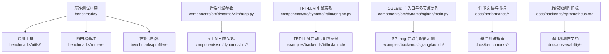
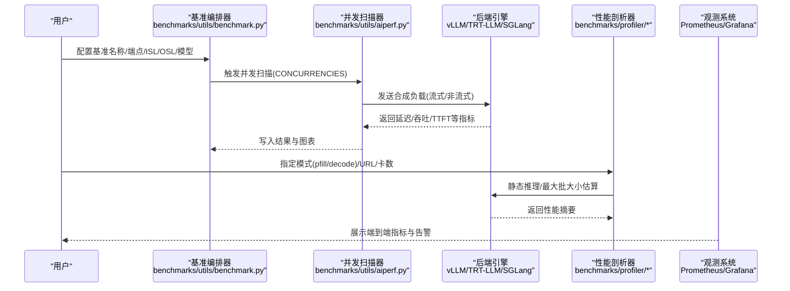
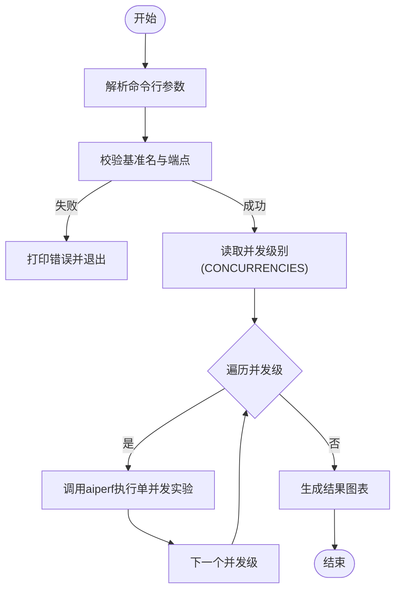
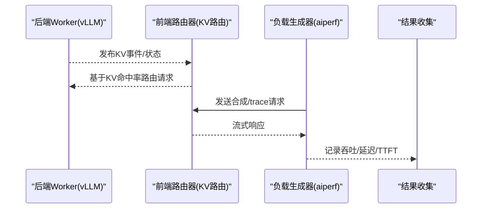
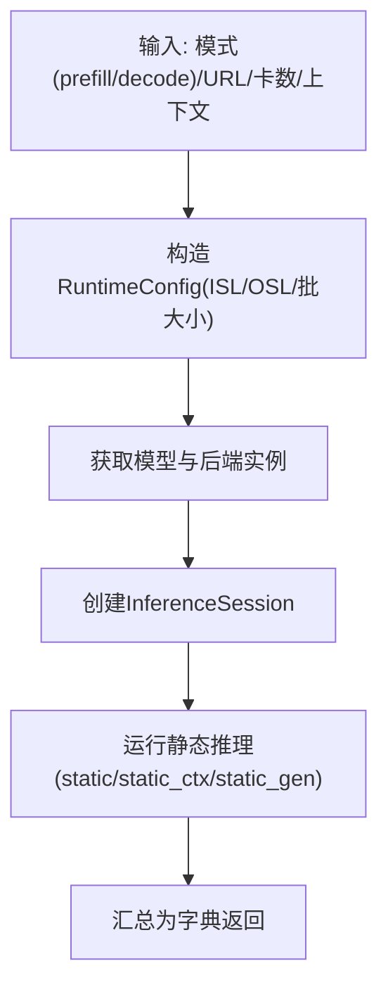
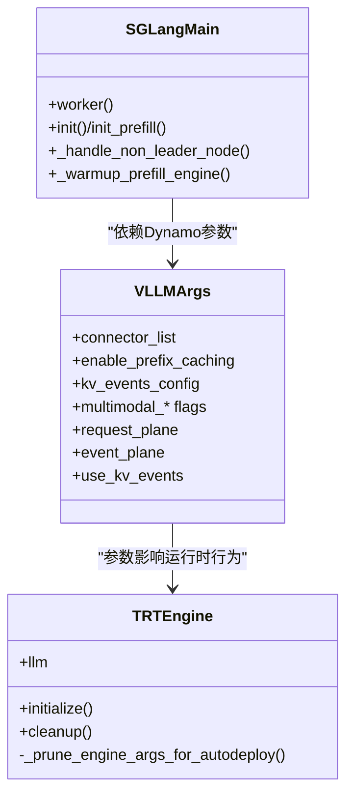
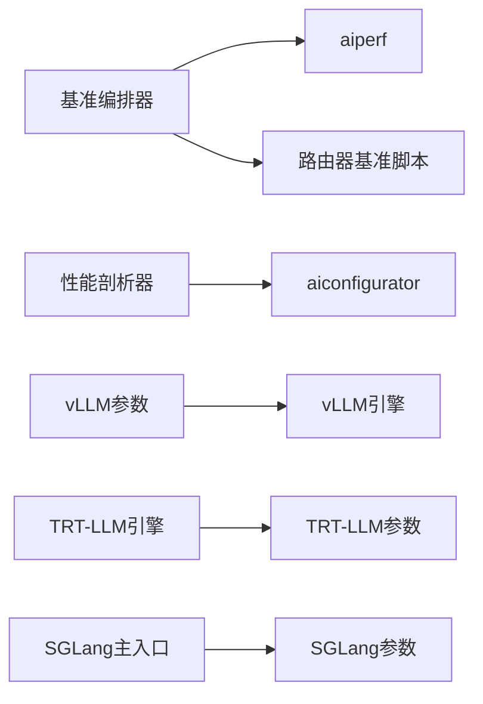

# 性能调优示例

<cite>
**本文引用的文件**
- [benchmarks/README.md](file://benchmarks/README.md)
- [benchmarks/router/README.md](file://benchmarks/router/README.md)
- [benchmarks/utils/benchmark.py](file://benchmarks/utils/benchmark.py)
- [benchmarks/utils/aiperf.py](file://benchmarks/utils/aiperf.py)
- [benchmarks/profiler/README.md](file://benchmarks/profiler/README.md)
- [benchmarks/profiler/profile_endpoint.py](file://benchmarks/profiler/profile_endpoint.py)
- [benchmarks/profiler/utils/estimate_perf.py](file://benchmarks/profiler/utils/estimate_perf.py)
- [components/src/dynamo/vllm/args.py](file://components/src/dynamo/vllm/args.py)
- [components/src/dynamo/trtllm/engine.py](file://components/src/dynamo/trtllm/engine.py)
- [components/src/dynamo/sglang/main.py](file://components/src/dynamo/sglang/main.py)
- [docs/performance/tuning.md](file://docs/performance/tuning.md)
- [docs/benchmarks/benchmarking.md](file://docs/benchmarks/benchmarking.md)
- [docs/backends/vllm/prometheus.md](file://docs/backends/vllm/prometheus.md)
- [docs/backends/trtllm/prometheus.md](file://docs/backends/trtllm/prometheus.md)
- [docs/backends/sglang/prometheus.md](file://docs/backends/sglang/prometheus.md)
- [docs/observability/metrics.md](file://docs/observability/metrics.md)
- [docs/observability/logging.md](file://docs/observability/logging.md)
- [docs/observability/tracing.md](file://docs/observability/tracing.md)
- [docs/kubernetes/deployment/create_deployment.md](file://docs/kubernetes/deployment/create_deployment.md)
- [docs/kubernetes/deployment/multinode-deployment.md](file://docs/kubernetes/deployment/multinode-deployment.md)
- [examples/backends/vllm/launch/](file://examples/backends/vllm/launch/)
- [examples/backends/trtllm/launch/](file://examples/backends/trtllm/launch/)
- [examples/backends/sglang/launch/](file://examples/backends/sglang/launch/)
</cite>

## 目录
1. [简介](#简介)
2. [项目结构](#项目结构)
3. [核心组件](#核心组件)
4. [架构总览](#架构总览)
5. [详细组件分析](#详细组件分析)
6. [依赖关系分析](#依赖关系分析)
7. [性能考虑](#性能考虑)
8. [故障排查指南](#故障排查指南)
9. [结论](#结论)
10. [附录](#附录)

## 简介
本文件面向Dynamo平台的性能调优实践，提供覆盖多后端引擎（vLLM、TensorRT-LLM、SGLang）的基准测试方法与结果分析框架，系统阐述参数调优、资源配置与架构优化策略，并解释批量大小、并发数与内存分配对性能的影响。同时给出多节点部署的优化要点、瓶颈定位方法、完整的性能测试流程与评估指标，以及成本效益与资源利用率优化技巧。最后提供性能监控与问题诊断的方法论。

## 项目结构
围绕性能调优，仓库中与之直接相关的目录与文件包括：
- 基准测试框架与脚本：benchmarks/*
- 后端引擎参数与运行时配置：components/src/dynamo/{vllm,trtllm,sglang}/*
- 文档与最佳实践：docs/performance/*、docs/benchmarks/*、docs/backends/*/prometheus.md
- 示例启动脚本：examples/backends/{vllm,trtllm,sglang}/launch/*

**图表来源**
- [benchmarks/README.md](file://benchmarks/README.md#L1-L75)
- [benchmarks/router/README.md](file://benchmarks/router/README.md#L1-L267)
- [benchmarks/utils/benchmark.py](file://benchmarks/utils/benchmark.py#L1-L103)
- [benchmarks/utils/aiperf.py](file://benchmarks/utils/aiperf.py#L1-L114)
- [benchmarks/profiler/profile_endpoint.py](file://benchmarks/profiler/profile_endpoint.py#L1-L124)
- [benchmarks/profiler/utils/estimate_perf.py](file://benchmarks/profiler/utils/estimate_perf.py#L1-L234)
- [components/src/dynamo/vllm/args.py](file://components/src/dynamo/vllm/args.py#L1-L649)
- [components/src/dynamo/trtllm/engine.py](file://components/src/dynamo/trtllm/engine.py#L1-L142)
- [components/src/dynamo/sglang/main.py](file://components/src/dynamo/sglang/main.py#L1-L664)
- [docs/performance/tuning.md](file://docs/performance/tuning.md)
- [docs/benchmarks/benchmarking.md](file://docs/benchmarks/benchmarking.md)
- [docs/backends/vllm/prometheus.md](file://docs/backends/vllm/prometheus.md)
- [docs/backends/trtllm/prometheus.md](file://docs/backends/trtllm/prometheus.md)
- [docs/backends/sglang/prometheus.md](file://docs/backends/sglang/prometheus.md)
- [docs/observability/metrics.md](file://docs/observability/metrics.md)
- [docs/observability/logging.md](file://docs/observability/logging.md)
- [docs/observability/tracing.md](file://docs/observability/tracing.md)

**章节来源**
- [benchmarks/README.md](file://benchmarks/README.md#L1-L75)
- [benchmarks/router/README.md](file://benchmarks/router/README.md#L1-L267)

## 核心组件
- 基准测试编排器：负责解析用户输入、校验端点与名称、调度并发扫描与aiperf执行，生成可复现的实验数据与可视化结果。
- 路由器基准：提供KV缓存前缀共享场景下的吞吐对比，支持聚合/拆分（prefill/decode）服务模式与真实trace数据加载。
- 性能剖析器：按预填/解码阶段分别评估端点性能，结合aiconfigurator数据库进行静态推理与最大批大小估算。
- 后端引擎参数：统一管理vLLM/TRT-LLM/SGLang的运行参数、连接器链路、事件发布、多模态与多节点配置等。

**章节来源**
- [benchmarks/utils/benchmark.py](file://benchmarks/utils/benchmark.py#L51-L103)
- [benchmarks/utils/aiperf.py](file://benchmarks/utils/aiperf.py#L36-L114)
- [benchmarks/router/README.md](file://benchmarks/router/README.md#L40-L197)
- [benchmarks/profiler/profile_endpoint.py](file://benchmarks/profiler/profile_endpoint.py#L22-L124)
- [benchmarks/profiler/utils/estimate_perf.py](file://benchmarks/profiler/utils/estimate_perf.py#L29-L234)
- [components/src/dynamo/vllm/args.py](file://components/src/dynamo/vllm/args.py#L110-L467)
- [components/src/dynamo/trtllm/engine.py](file://components/src/dynamo/trtllm/engine.py#L24-L142)
- [components/src/dynamo/sglang/main.py](file://components/src/dynamo/sglang/main.py#L39-L124)

## 架构总览
下图展示从请求到后端引擎再到观测系统的整体调优路径，涵盖并发扫描、端点验证、性能剖析与指标采集。

**图表来源**
- [benchmarks/utils/benchmark.py](file://benchmarks/utils/benchmark.py#L51-L98)
- [benchmarks/utils/aiperf.py](file://benchmarks/utils/aiperf.py#L101-L114)
- [benchmarks/profiler/profile_endpoint.py](file://benchmarks/profiler/profile_endpoint.py#L22-L124)
- [docs/backends/vllm/prometheus.md](file://docs/backends/vllm/prometheus.md)
- [docs/backends/trtllm/prometheus.md](file://docs/backends/trtllm/prometheus.md)
- [docs/backends/sglang/prometheus.md](file://docs/backends/sglang/prometheus.md)

## 详细组件分析

### 组件A：基准测试编排器
- 功能要点
  - 输入校验：基准名合法性、端点格式（本地/集群内服务URL）、并发级别环境变量解析。
  - 工作流：调用通用工作流执行并发扫描，使用aiperf驱动合成负载，输出标准化结果。
  - 可视化：配合plot工具生成对比图表，便于跨配置/后端横向比较。
- 关键参数
  - 并发级别：通过环境变量CONCURRENCIES传入或使用默认序列。
  - ISL/OSL/标准差：控制输入长度分布与输出长度均值。
  - 模型名：需与目标端点已部署模型一致。
- 典型用法
  - 单端点基准、多端点对比、结果目录与命名规范。

**图表来源**
- [benchmarks/utils/benchmark.py](file://benchmarks/utils/benchmark.py#L51-L98)
- [benchmarks/utils/aiperf.py](file://benchmarks/utils/aiperf.py#L13-L34)
- [benchmarks/utils/aiperf.py](file://benchmarks/utils/aiperf.py#L101-L114)

**章节来源**
- [benchmarks/utils/benchmark.py](file://benchmarks/utils/benchmark.py#L15-L98)
- [benchmarks/utils/aiperf.py](file://benchmarks/utils/aiperf.py#L13-L114)
- [benchmarks/README.md](file://benchmarks/README.md#L20-L40)

### 组件B：路由器基准（KV缓存前缀共享）
- 场景与目标
  - 在多轮对话/长上下文场景下，评估KV缓存路由相比轮询路由的吞吐增益。
  - 支持聚合/拆分（prefill/decode）两种服务形态，以及基于真实trace的数据集。
- 使用步骤
  - 启动多个后端worker（支持模拟器以减少GPU占用）。
  - 启动前端路由器（KV缓存路由模式），进行连通性测试。
  - 执行前缀比例扫描或真实trace加载，记录吞吐/延迟。
- 参数建议
  - ISL/OSL：根据典型对话长度设定；并发与请求数量按线性增长观察拐点。
  - 前缀比例：0.1~0.9区间，观察收益随共享程度提升的变化。

**图表来源**
- [benchmarks/router/README.md](file://benchmarks/router/README.md#L105-L197)

**章节来源**
- [benchmarks/router/README.md](file://benchmarks/router/README.md#L40-L267)

### 组件C：性能剖析器（端点级）
- 功能要点
  - 按“预填/解码”模式分别评估端点性能，支持指定最大上下文长度、注意力并行度等。
  - 利用aiconfigurator数据库进行静态推理，估算不同ISL/OSL/批大小下的吞吐与延迟。
  - 提供最大批大小与最大KV token估算，辅助容量规划。
- 关键流程
  - 解析模式与参数 → 构造运行时配置 → 创建会话 → 运行静态推理 → 输出摘要。

**图表来源**
- [benchmarks/profiler/profile_endpoint.py](file://benchmarks/profiler/profile_endpoint.py#L99-L121)
- [benchmarks/profiler/utils/estimate_perf.py](file://benchmarks/profiler/utils/estimate_perf.py#L76-L133)

**章节来源**
- [benchmarks/profiler/README.md](file://benchmarks/profiler/README.md#L1-L1)
- [benchmarks/profiler/profile_endpoint.py](file://benchmarks/profiler/profile_endpoint.py#L22-L124)
- [benchmarks/profiler/utils/estimate_perf.py](file://benchmarks/profiler/utils/estimate_perf.py#L29-L234)

### 组件D：后端引擎参数与运行时（vLLM/TRT-LLM/SGLang）
- vLLM
  - 连接器链路：支持nixl/lmcache/kvbm/null等，可组合为多连接器链路。
  - KV事件发布：启用前缀缓存时自动配置事件发布通道，支持ZMQ。
  - 多模态：编码/解码/处理器角色分离，支持统一/拆分模式。
  - 默认行为：在特定条件下强制分布式执行后端以避免GIL竞争。
- TRT-LLM
  - 引擎类型：PyTorch/AutoDeploy；拆分模式下编码器与LLM使用不同初始化路径。
  - 参数修剪：AutoDeploy不支持部分参数，会发出警告并忽略。
- SGLang
  - 多节点：非主节点仅运行调度器进程并暴露指标，主节点处理请求。
  - 预热：预填拆分模式下进行dummy预热以降低首次TTFT。
  - 指标：注册Prometheus指标回调，支持共享内存指标导出。

**图表来源**
- [components/src/dynamo/vllm/args.py](file://components/src/dynamo/vllm/args.py#L30-L467)
- [components/src/dynamo/trtllm/engine.py](file://components/src/dynamo/trtllm/engine.py#L24-L142)
- [components/src/dynamo/sglang/main.py](file://components/src/dynamo/sglang/main.py#L39-L124)

**章节来源**
- [components/src/dynamo/vllm/args.py](file://components/src/dynamo/vllm/args.py#L110-L467)
- [components/src/dynamo/trtllm/engine.py](file://components/src/dynamo/trtllm/engine.py#L24-L142)
- [components/src/dynamo/sglang/main.py](file://components/src/dynamo/sglang/main.py#L39-L124)

## 依赖关系分析
- 基准测试依赖
  - 编排器依赖aiperf进行并发扫描与负载注入。
  - 路由器基准依赖etcd/NATS协调与KV事件发布。
  - 性能剖析器依赖aiconfigurator数据库与后端SDK。
- 后端引擎依赖
  - vLLM：连接器链路与KV事件配置；多模态角色互斥校验。
  - TRT-LLM：AutoDeploy参数白名单；拆分模式参数差异。
  - SGLang：多节点调度器与指标导出；预填预热机制。

**图表来源**
- [benchmarks/utils/benchmark.py](file://benchmarks/utils/benchmark.py#L89-L97)
- [benchmarks/utils/aiperf.py](file://benchmarks/utils/aiperf.py#L46-L99)
- [benchmarks/profiler/utils/estimate_perf.py](file://benchmarks/profiler/utils/estimate_perf.py#L44-L64)
- [components/src/dynamo/vllm/args.py](file://components/src/dynamo/vllm/args.py#L510-L556)
- [components/src/dynamo/trtllm/engine.py](file://components/src/dynamo/trtllm/engine.py#L94-L126)
- [components/src/dynamo/sglang/main.py](file://components/src/dynamo/sglang/main.py#L125-L144)

**章节来源**
- [benchmarks/utils/benchmark.py](file://benchmarks/utils/benchmark.py#L89-L97)
- [benchmarks/utils/aiperf.py](file://benchmarks/utils/aiperf.py#L46-L99)
- [benchmarks/profiler/utils/estimate_perf.py](file://benchmarks/profiler/utils/estimate_perf.py#L44-L64)
- [components/src/dynamo/vllm/args.py](file://components/src/dynamo/vllm/args.py#L510-L556)
- [components/src/dynamo/trtllm/engine.py](file://components/src/dynamo/trtllm/engine.py#L94-L126)
- [components/src/dynamo/sglang/main.py](file://components/src/dynamo/sglang/main.py#L125-L144)

## 性能考虑
- 批量大小与并发数
  - 批大小受显存限制与KV缓存容量约束；可通过性能剖析器估算最大批大小与最大KV token。
  - 并发数应从低到高扫描，观察吞吐饱和点与尾延迟变化，避免过载导致排队与抖动。
- 内存分配与KV缓存
  - 启用前缀缓存与KV事件发布可显著降低重复计算；注意KV缓存占用与事件通道带宽。
  - 多模态场景下，编码器/解码器/处理器角色分离可提升资源利用率，但需平衡网络开销。
- 多节点部署
  - SGLang非主节点仅运行调度器并导出指标；主节点承担请求处理与注册。
  - vLLM在NIXL连接器且TP=1时强制多进程以避免GIL竞争；TRT-LLM拆分模式下编码器与LLM初始化路径不同。
- 成本效益与资源利用率
  - 通过并发扫描与最大批大小估算确定最优配置，避免过度预留；结合观测指标识别空闲资源与热点。
  - 对于大模型，优先采用拆分服务与KV缓存，减少重复计算与冷启动时间。

**章节来源**
- [benchmarks/profiler/utils/estimate_perf.py](file://benchmarks/profiler/utils/estimate_perf.py#L157-L234)
- [components/src/dynamo/vllm/args.py](file://components/src/dynamo/vllm/args.py#L295-L312)
- [components/src/dynamo/sglang/main.py](file://components/src/dynamo/sglang/main.py#L39-L67)
- [components/src/dynamo/trtllm/engine.py](file://components/src/dynamo/trtllm/engine.py#L94-L126)

## 故障排查指南
- 端点不可达/超时
  - 校验端点URL格式与协议；在集群内使用服务名/端口；必要时调整并发或请求规模。
- OOM/显存不足
  - 降低最大批大小、最大上下文长度或KV缓存容量；检查连接器链路是否引入额外缓冲。
- GIL竞争/调度阻塞
  - vLLM在NIXL连接器且TP=1时强制多进程；确认分布式执行后端设置正确。
- 多节点异常
  - 非主节点仅暴露指标，不处理请求；确保主节点正常注册与健康检查。
- 路由器基准问题
  - 确认etcd/NATS可用；检查KV事件发布端口与DP rank偏移；必要时禁用KV事件追踪。

**章节来源**
- [benchmarks/utils/benchmark.py](file://benchmarks/utils/benchmark.py#L15-L33)
- [components/src/dynamo/vllm/args.py](file://components/src/dynamo/vllm/args.py#L295-L312)
- [components/src/dynamo/sglang/main.py](file://components/src/dynamo/sglang/main.py#L39-L67)
- [benchmarks/router/README.md](file://benchmarks/router/README.md#L261-L267)

## 结论
通过统一的基准测试框架、端点级性能剖析与后端引擎参数治理，Dynamo可在多后端与多节点环境下实现稳定、可观测且高性价比的推理服务。建议以并发扫描与最大批大小估作为起点，结合KV缓存与拆分服务策略，持续迭代参数与资源配置，最终达成吞吐与延迟的平衡。

## 附录

### 完整性能测试流程与评估指标
- 流程
  - 准备：部署后端引擎与前端，启动etcd/NATS（如需）。
  - 基准：使用编排器扫描并发级别，记录吞吐、P50/P95延迟、TTFT、首Token耗时。
  - 剖析：针对预填/解码阶段分别评估，获取静态推理摘要与最大批大小。
  - 分析：对比不同配置/后端的指标，绘制帕累托曲线与成本效益图。
- 指标
  - 吞吐（req/s）、延迟（P50/P95/ms）、TTFT、首Token耗时、KV命中率、批大小、显存占用。

**章节来源**
- [benchmarks/README.md](file://benchmarks/README.md#L20-L40)
- [benchmarks/router/README.md](file://benchmarks/router/README.md#L165-L267)
- [docs/benchmarks/benchmarking.md](file://docs/benchmarks/benchmarking.md)
- [docs/performance/tuning.md](file://docs/performance/tuning.md)

### 不同工作负载下的最优配置方案
- 高共享前缀（多轮对话/文档问答）
  - 启用KV缓存与KV事件发布；提高并发以利用缓存命中；适度增大批大小。
- 长上下文/高OSL
  - 控制最大上下文长度与KV缓存容量；拆分服务以降低峰值显存。
- 多模态
  - 编码/解码/处理器分离；平衡网络与计算开销；启用共享存储以复用嵌入。

**章节来源**
- [components/src/dynamo/vllm/args.py](file://components/src/dynamo/vllm/args.py#L332-L404)
- [components/src/dynamo/trtllm/engine.py](file://components/src/dynamo/trtllm/engine.py#L54-L77)
- [components/src/dynamo/sglang/main.py](file://components/src/dynamo/sglang/main.py#L436-L521)

### 成本效益分析与资源利用率优化
- 成本效益
  - 以吞吐/延迟为目标函数，结合硬件成本与能耗，选择性价比最高的配置。
- 资源利用率
  - 通过并发扫描与最大批大小估算，避免过度预留；利用拆分服务与KV缓存减少重复计算。

**章节来源**
- [benchmarks/profiler/utils/estimate_perf.py](file://benchmarks/profiler/utils/estimate_perf.py#L157-L234)
- [docs/performance/tuning.md](file://docs/performance/tuning.md)

### 性能监控与问题诊断方法论
- 指标体系
  - 后端观测：参考各后端Prometheus指标文档，关注吞吐、延迟、显存、KV缓存命中率。
  - 通用观测：日志分级、链路追踪、指标聚合与告警。
- 诊断步骤
  - 快速验证：端点健康检查、并发扫描最小化实验。
  - 深入分析：剖析器静态推理、最大批大小估算、多节点指标核对。

**章节来源**
- [docs/backends/vllm/prometheus.md](file://docs/backends/vllm/prometheus.md)
- [docs/backends/trtllm/prometheus.md](file://docs/backends/trtllm/prometheus.md)
- [docs/backends/sglang/prometheus.md](file://docs/backends/sglang/prometheus.md)
- [docs/observability/metrics.md](file://docs/observability/metrics.md)
- [docs/observability/logging.md](file://docs/observability/logging.md)
- [docs/observability/tracing.md](file://docs/observability/tracing.md)