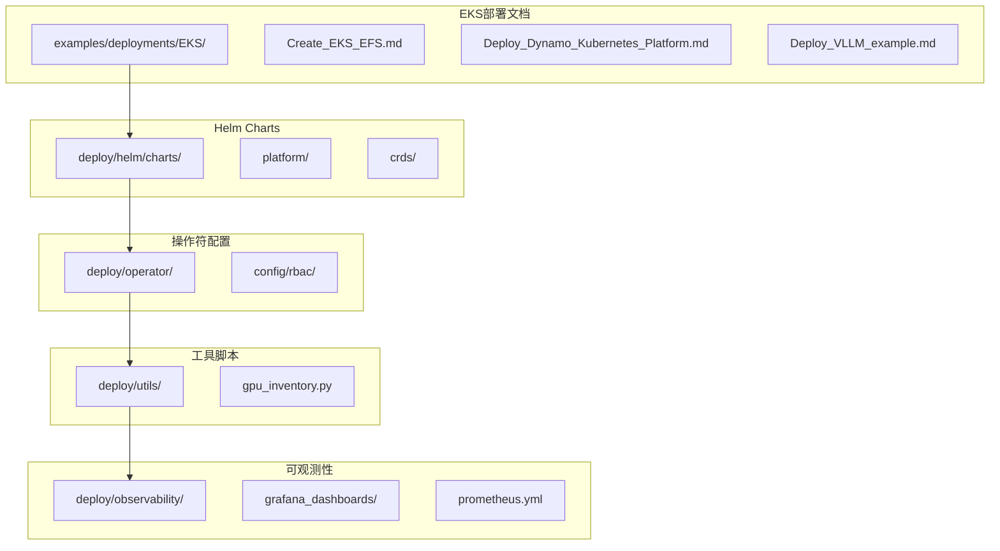
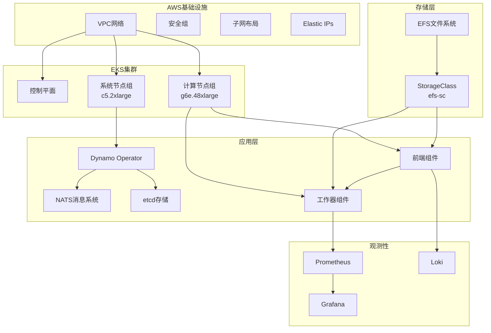
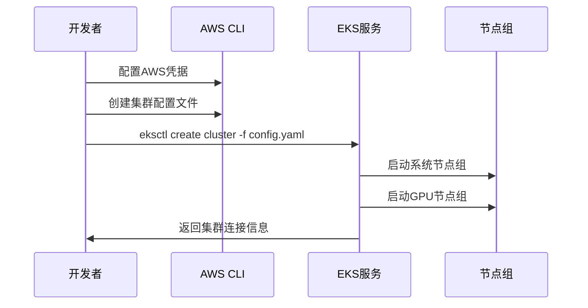
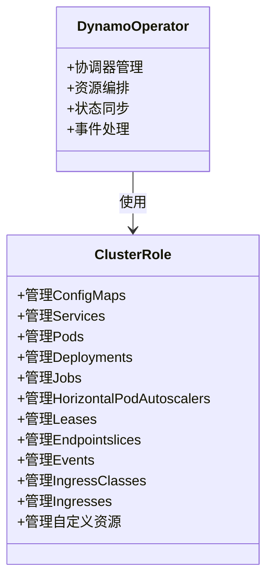
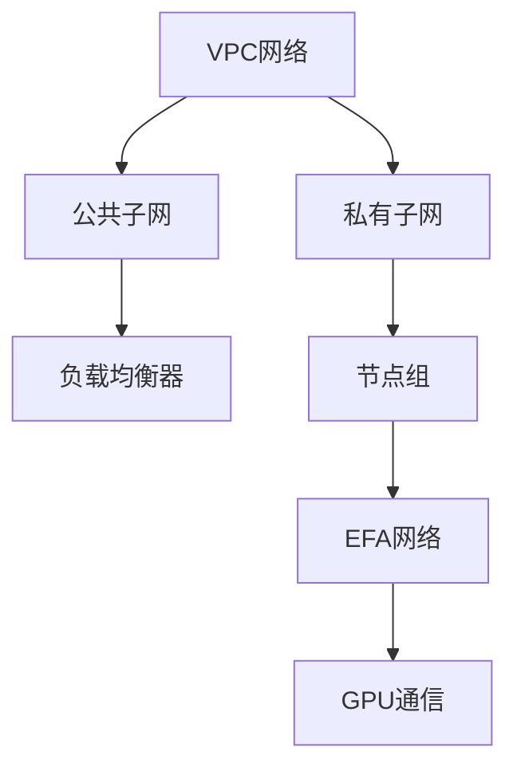

# AWS EKS部署

<cite>
**本文档引用的文件**
- [Create_EKS_EFS.md](file://examples/deployments/EKS/Create_EKS_EFS.md)
- [Deploy_Dynamo_Kubernetes_Platform.md](file://examples/deployments/EKS/Deploy_Dynamo_Kubernetes_Platform.md)
- [Deploy_VLLM_example.md](file://examples/deployments/EKS/Deploy_VLLM_example.md)
- [values.yaml](file://deploy/helm/charts/platform/values.yaml)
- [Chart.yaml](file://deploy/helm/charts/platform/Chart.yaml)
- [role.yaml](file://deploy/operator/config/rbac/role.yaml)
- [gpu_inventory.py](file://deploy/utils/gpu_inventory.py)
- [logging.md](file://docs/kubernetes/observability/logging.md)
- [metrics.md](file://docs/kubernetes/observability/metrics.md)
- [prometheus.yml](file://deploy/observability/prometheus.yml)
- [dynamo.json](file://deploy/observability/grafana_dashboards/dynamo.json)
</cite>

## 目录
1. [简介](#简介)
2. [项目结构](#项目结构)
3. [核心组件](#核心组件)
4. [架构概览](#架构概览)
5. [详细组件分析](#详细组件分析)
6. [依赖关系分析](#依赖关系分析)
7. [性能考虑](#性能考虑)
8. [故障排查指南](#故障排查指南)
9. [结论](#结论)
10. [附录](#附录)

## 简介

本指南详细介绍了Dynamo在AWS EKS（Amazon Elastic Kubernetes Service）上的完整部署流程。内容涵盖EKS集群创建、NodeGroup配置、IAM角色和策略设置，以及Amazon EFS持久化存储配置、Load Balancer服务暴露和Ingress控制器设置。

该部署方案基于AWS官方最佳实践，结合Dynamo平台的特性，提供了从基础设施到应用层的端到端解决方案。文档特别关注以下关键方面：

- **GPU实例类型选择**：针对不同工作负载需求的实例类型建议
- **网络配置**：VPC、子网、安全组的详细规划
- **存储架构**：EFS共享存储的配置和管理
- **监控体系**：Prometheus、Grafana、Loki的完整观测性栈
- **成本优化**：Spot实例使用和资源调度策略
- **故障排查**：系统化的诊断和问题解决方法

## 项目结构

Dynamo项目的EKS部署相关文件主要分布在以下几个目录中：



**图表来源**
- [Create_EKS_EFS.md](file://examples/deployments/EKS/Create_EKS_EFS.md#L1-L153)
- [values.yaml](file://deploy/helm/charts/platform/values.yaml#L1-L732)
- [role.yaml](file://deploy/operator/config/rbac/role.yaml#L1-L247)

**章节来源**
- [Create_EKS_EFS.md](file://examples/deployments/EKS/Create_EKS_EFS.md#L1-L153)
- [values.yaml](file://deploy/helm/charts/platform/values.yaml#L1-L732)

## 核心组件

### EKS集群组件

Dynamo在EKS上的部署采用多组件架构，主要包括：

#### 1. 控制平面节点组
- **实例类型**：c5.2xlarge（CPU密集型）
- **用途**：运行EKS控制平面组件
- **配置特点**：专用节点，不承载工作负载

#### 2. 计算节点组（GPU）
- **实例类型**：g6e.48xlarge（8个NVIDIA L40S GPU）
- **网络支持**：启用EFA（Elastic Fabric Adapter）
- **存储配置**：300GB根卷空间
- **安全配置**：私有网络访问

#### 3. 存储组件
- **EFS文件系统**：共享存储后端
- **StorageClass**：efs-sc（默认存储类）
- **权限管理**：IAM角色绑定

**章节来源**
- [Create_EKS_EFS.md](file://examples/deployments/EKS/Create_EKS_EFS.md#L44-L108)
- [values.yaml](file://deploy/helm/charts/platform/values.yaml#L115-L135)

### 平台组件

#### 1. Dynamo Operator
- **功能**：核心控制器管理
- **依赖**：NATS消息系统、etcd键值存储
- **安全**：RBAC权限控制

#### 2. NATS消息系统
- **用途**：组件间通信
- **配置**：JetStream持久化存储
- **存储**：10Gi PVC卷

#### 3. etcd分布式存储
- **用途**：状态存储
- **配置**：1Gi PVC卷
- **简化**：禁用认证以减少启动复杂度

**章节来源**
- [Chart.yaml](file://deploy/helm/charts/platform/Chart.yaml#L24-L46)
- [values.yaml](file://deploy/helm/charts/platform/values.yaml#L234-L287)

## 架构概览

Dynamo在EKS上的整体架构如下：



**图表来源**
- [Create_EKS_EFS.md](file://examples/deployments/EKS/Create_EKS_EFS.md#L44-L108)
- [values.yaml](file://deploy/helm/charts/platform/values.yaml#L234-L490)

## 详细组件分析

### EKS集群创建流程

#### 1. 前期准备

**CLI安装步骤**：
- AWS CLI：用于基础设施管理
- kubectl：Kubernetes集群管理
- eksctl：EKS集群创建工具
- Helm：应用包管理

**配置要求**：
```bash
# AWS CLI配置
aws configure

# 验证安装
eksctl version
kubectl version
helm version
```

#### 2. 集群配置文件

集群配置采用eksctl ClusterConfig格式，包含以下关键配置：

**元数据配置**：
- 集群名称：`<CLUSTER_NAME>`
- Kubernetes版本：`1.32`
- 区域：`<REGION_NAME>`
- OIDC支持：启用

**节点组配置**：

```yaml
managedNodeGroups:
  # 系统节点组
  - name: sys-ng
    instanceType: c5.2xlarge
    minSize: 1
    desiredCapacity: 1
    maxSize: 1
    iam:
      withAddonPolicies:
        imageBuilder: true
        autoScaler: true
        ebs: true
        efs: true
        awsLoadBalancerController: true
        cloudWatch: true
        albIngress: true

  # GPU计算节点组
  - name: efa-compute-ng
    instanceType: g6e.48xlarge
    minSize: 1
    desiredCapacity: 1
    maxSize: 1
    volumeSize: 300
    efaEnabled: true
    privateNetworking: true
    iam:
      withAddonPolicies:
        imageBuilder: true
        autoScaler: true
        ebs: true
        efs: true
        awsLoadBalancerController: true
        cloudWatch: true
        albIngress: true
```

#### 3. 创建流程



**图表来源**
- [Create_EKS_EFS.md](file://examples/deployments/EKS/Create_EKS_EFS.md#L46-L108)

**章节来源**
- [Create_EKS_EFS.md](file://examples/deployments/EKS/Create_EKS_EFS.md#L42-L108)

### EFS持久化存储配置

#### 1. IAM角色创建

为EFS CSI驱动程序创建必要的IAM角色：

**角色要求**：
- EFS文件系统访问权限
- VPC网络资源访问
- 容器存储接口(CSI)权限

#### 2. EFS CSI驱动程序安装

通过Amazon EKS控制台安装并验证驱动程序状态。

#### 3. 文件系统创建

按照AWS官方文档创建EFS文件系统，并正确配置挂载目标的子网。

#### 4. StorageClass配置

```yaml
kind: StorageClass
apiVersion: storage.k8s.io/v1
metadata:
  name: efs-sc
  annotations:
    storageclass.kubernetes.io/is-default-class: "true"
provisioner: efs.csi.aws.com
parameters:
  fileSystemId: fs-01e72da3fcdbf8a4d
  provisioningMode: efs-ap
  directoryPerms: "777"
  uid: "1000"
  gid: "1000"
```

**章节来源**
- [Create_EKS_EFS.md](file://examples/deployments/EKS/Create_EKS_EFS.md#L110-L153)

### Dynamo平台部署

#### 1. 基础镜像构建

**ECR仓库创建**：
```bash
aws ecr create-repository --repository-name <ECR_REPOSITORY>
```

**镜像构建和推送**：
```bash
# 设置环境变量
export NAMESPACE=dynamo-system
export DOCKER_SERVER=<ECR_REGISTRY>
export DOCKER_USERNAME=AWS
export DOCKER_PASSWORD="$(aws ecr get-login-password --region <ECR_REGION>)"
export IMAGE_TAG=0.3.2.1

# 构建镜像
./container/build.sh

# 推送到ECR
docker tag dynamo:latest-vllm <ECR_REGISTRY>/<ECR_REPOSITORY>:$IMAGE_TAG
aws ecr get-login-password | docker login --username AWS --password-stdin <ECR_REGISTRY>
docker push <ECR_REGISTRY>/<ECR_REPOSITORY>:$IMAGE_TAG
```

#### 2. 平台组件安装

**Operator镜像构建**：
```bash
cd deploy/operator
docker build -t $DOCKER_SERVER/dynamo-operator:$IMAGE_TAG .
docker push $DOCKER_SERVER/dynamo-operator:$IMAGE_TAG
```

**密钥创建**：
```bash
kubectl create namespace ${NAMESPACE}
kubectl create secret docker-registry docker-imagepullsecret \
  --docker-server=${DOCKER_SERVER} \
  --docker-username=${DOCKER_USERNAME} \
  --docker-password=${DOCKER_PASSWORD} \
  --namespace=${NAMESPACE}

kubectl create secret generic hf-token-secret \
  --from-literal=HF_TOKEN=${HF_TOKEN} \
  -n ${NAMESPACE}
```

**平台安装**：
```bash
# 安装CRDs
helm install dynamo-crds ./crds/ \
  --namespace default \
  --wait \
  --atomic

# 安装平台
helm dep build ./platform/
helm install dynamo-platform ./platform/ \
  --namespace ${NAMESPACE} \
  --set "dynamo-operator.controllerManager.manager.image.repository=${DOCKER_SERVER}/dynamo-operator" \
  --set "dynamo-operator.controllerManager.manager.image.tag=${IMAGE_TAG}" \
  --set "dynamo-operator.imagePullSecrets[0].name=docker-imagepullsecret"
```

**章节来源**
- [Deploy_Dynamo_Kubernetes_Platform.md](file://examples/deployments/EKS/Deploy_Dynamo_Kubernetes_Platform.md#L1-L96)

### vLLM示例部署

#### 1. 图形部署

```bash
cd examples/backends/vllm/deploy
vim agg_router.yaml    # 添加命名空间和镜像配置
kubectl apply -f agg_router.yaml
```

#### 2. 部署验证

```bash
kubectl get pods -A
```

预期输出：
```
dynamo-system   dynamo-platform-dynamo-operator-controller-manager-86795c5f4j4k   2/2     Running   0          4h17m
dynamo-system   dynamo-platform-etcd-0                                            1/1     Running   0          4h17m
dynamo-system   dynamo-platform-nats-0                                            2/2     Running   0          4h17m
dynamo-system   dynamo-platform-nats-box-5dbf45c748-bxqj7                         1/1     Running   0          4h17m
dynamo-system   vllm-agg-router-frontend-79d599bb9c-fg97p                         1/1     Running   0          4m9s
dynamo-system   vllm-agg-router-vllmdecodeworker-787d575485-hrcjp                 1/1     Running   0          4m9s
dynamo-system   vllm-agg-router-vllmdecodeworker-787d575485-zkwdd                 1/1     Running   0          4m9s
```

#### 3. 功能测试

```bash
kubectl port-forward deployment/vllm-agg-router-frontend 8000:8000 -n dynamo-system
curl localhost:8000/v1/chat/completions \
  -H "Content-Type: application/json" \
  -d '{
    "model": "Qwen/Qwen3-0.6B",
    "messages": [{"role": "user","content": "测试消息"}],
    "stream": false,
    "max_tokens": 30
  }'
```

**章节来源**
- [Deploy_VLLM_example.md](file://examples/deployments/EKS/Deploy_VLLM_example.md#L1-L48)

## 依赖关系分析

### Helm Chart依赖关系

Dynamo平台的Helm Chart具有复杂的依赖关系：

```mermaid
graph TB
subgraph "Dynamo平台Chart"
DP[dynamo-platform]
end
subgraph "外部依赖"
NO[nats (1.3.2)]
ET[etcd (12.0.18)]
KS[kai-scheduler (v0.9.4)]
GV[grove (v0.1.0-alpha.3)]
end
subgraph "内部组件"
DO[dynamo-operator]
CRD[CRDs]
end
DP --> DO
DP --> NO
DP --> ET
DP --> KS
DP --> GV
DO --> CRD
```

**图表来源**
- [Chart.yaml](file://deploy/helm/charts/platform/Chart.yaml#L24-L46)

### RBAC权限模型

Dynamo Operator需要广泛的Kubernetes权限：



**图表来源**
- [role.yaml](file://deploy/operator/config/rbac/role.yaml#L21-L247)

**章节来源**
- [role.yaml](file://deploy/operator/config/rbac/role.yaml#L1-L247)

## 性能考虑

### GPU资源管理

#### 1. GPU库存检查

```bash
python deploy/utils/gpu_inventory.py --format table --enrich-smi
```

该工具提供以下功能：
- 收集节点GPU信息
- 检测GPU型号和显存容量
- 支持MIG资源配置检测
- 提供聚合统计信息

#### 2. 实例类型选择建议

**GPU密集型工作负载**：
- **g6e.48xlarge**：8个L40S GPU，适合大规模推理
- **g6e.32xlarge**：6个A100 GPU，平衡成本和性能
- **g5.48xlarge**：12个H100 GPU，最高性能选项

**混合工作负载**：
- **g5.24xlarge**：6个H100 GPU + CPU资源
- **g6.12xlarge**：6个L40S GPU + CPU资源

#### 3. Spot实例优化

**成本优化策略**：
- 使用Spot实例替换空闲计算节点
- 实施弹性伸缩策略
- 监控实例中断率
- 准备备用资源池

### 网络性能优化

#### 1. EFA配置

EFA（Elastic Fabric Adapter）提供：
- 高带宽、低延迟网络
- RDMA支持
- 多节点通信优化

#### 2. 网络拓扑



## 故障排查指南

### 观测性配置

#### 1. 日志收集

**Loki + Grafana Alloy配置**：
```bash
# 安装Loki
helm install --values deploy/observability/k8s/logging/values/loki-values.yaml loki grafana/loki -n monitoring

# 安装Grafana Alloy
envsubst < deploy/observability/k8s/logging/values/alloy-values.yaml > alloy-custom-values.yaml
helm install --values alloy-custom-values.yaml alloy grafana/k8s-monitoring -n monitoring

# 配置数据源和仪表板
envsubst < deploy/observability/k8s/logging/grafana/loki-datasource.yaml | kubectl apply -n monitoring -f -
envsubst < deploy/observability/k8s/logging/grafana/logging-dashboard.yaml | kubectl apply -n monitoring -f -
```

#### 2. 指标监控

**Prometheus配置**：
```yaml
scrape_configs:
  - job_name: 'nats-prometheus-exporter'
    scrape_interval: 2s
    static_configs:
      - targets: ['nats-prometheus-exporter:7777']
  
  - job_name: 'etcd-server'
    scrape_interval: 2s
    static_configs:
      - targets: ['etcd-server:2379']
  
  - job_name: 'dcgm-exporter'
    scrape_interval: 5s
    static_configs:
      - targets: ['dcgm-exporter:9401']
```

#### 3. Grafana仪表板

**Dynamo仪表板功能**：
- 前端请求速率和延迟
- GPU利用率和功耗
- 内存和CPU使用情况
- 组件健康状态

### 常见问题诊断

#### 1. 集群连接问题

**检查步骤**：
```bash
# 验证集群状态
kubectl get nodes
kubectl get pods -A

# 检查网络配置
eksctl utils describe-addon-status --cluster=<CLUSTER_NAME> --region=<REGION>

# 验证IAM角色
aws sts get-caller-identity
```

#### 2. 存储问题

**EFS故障排查**：
```bash
# 检查EFS CSI驱动状态
kubectl get pods -l app=efs-csi-controller -n kube-system

# 验证文件系统连接
kubectl get pv,pvc

# 检查挂载点
kubectl describe pod <pod-name>
```

#### 3. GPU资源问题

**GPU库存检查**：
```bash
# 使用GPU库存工具
python deploy/utils/gpu_inventory.py --format table --enrich-smi

# 检查GPU设备插件
kubectl get nodes -o jsonpath='{range .items[*]}{.metadata.name}{"\n"}{range .status.capacity}{@key}{"="}{@value}{"\n"}{end}{"\n"}'

# 验证NVIDIA设备插件
kubectl get pods -l app=nvidia-device-plugin-daemonset -n kube-system
```

**章节来源**
- [logging.md](file://docs/kubernetes/observability/logging.md#L1-L155)
- [metrics.md](file://docs/kubernetes/observability/metrics.md#L1-L181)
- [gpu_inventory.py](file://deploy/utils/gpu_inventory.py#L1-L490)

## 结论

Dynamo在AWS EKS上的部署提供了一个完整、可扩展的AI推理平台解决方案。通过合理的架构设计和最佳实践，可以实现：

**技术优势**：
- 高性能GPU计算资源
- 弹性扩缩容能力
- 完整的观测性栈
- 成本优化策略

**运维价值**：
- 标准化的部署流程
- 自动化的监控告警
- 快速的问题诊断能力
- 可扩展的架构设计

**建议实践**：
- 在生产环境中使用多可用区部署
- 实施适当的备份和灾难恢复策略
- 定期进行性能基准测试
- 建立完善的变更管理流程

通过遵循本指南的步骤和最佳实践，可以成功部署一个高性能、高可用的Dynamo推理平台。

## 附录

### 1. 完整部署命令清单

**集群创建**：
```bash
# 1. CLI安装
curl "https://awscli.amazonaws.com/awscli-exe-linux-x86_64.zip" -o "awscliv2.zip"
unzip awscliv2.zip
sudo ./aws/install

# 2. 集群创建
eksctl create cluster -f eks_cluster_config.yaml
```

**平台部署**：
```bash
# 1. 镜像构建和推送
./container/build.sh
docker push <ECR_REGISTRY>/<ECR_REPOSITORY>:$IMAGE_TAG

# 2. 平台安装
helm install dynamo-crds ./crds/ --namespace default
helm install dynamo-platform ./platform/ --namespace dynamo-system
```

**验证部署**：
```bash
# 检查Pod状态
kubectl get pods -n dynamo-system

# 测试API
kubectl port-forward deployment/vllm-agg-router-frontend 8000:8000 -n dynamo-system
curl localhost:8000/v1/chat/completions -H "Content-Type: application/json" -d '{}'
```

### 2. 成本优化建议

**实例类型选择**：
- 生产环境：优先考虑GPU实例类型
- 开发环境：可使用通用实例类型降低成本
- 混合环境：结合Spot实例和On-Demand实例

**存储优化**：
- 使用EFS作为共享存储
- 合理设置存储容量和IOPS
- 实施存储生命周期管理

**网络优化**：
- 启用EFA提升GPU通信性能
- 优化VPC和子网布局
- 合理配置安全组规则