# Amazon ECS部署

<cite>
**本文档引用的文件**
- [examples/deployments/ECS/README.md](file://examples/deployments/ECS/README.md)
- [examples/deployments/ECS/task_definition_frontend.json](file://examples/deployments/ECS/task_definition_frontend.json)
- [examples/deployments/ECS/task_definition_etcd_nats.json](file://examples/deployments/ECS/task_definition_etcd_nats.json)
- [examples/deployments/ECS/task_definition_prefillworker.json](file://examples/deployments/ECS/task_definition_prefillworker.json)
- [container/Dockerfile.vllm](file://container/Dockerfile.vllm)
- [container/Dockerfile](file://container/Dockerfile)
- [deploy/docker-compose.yml](file://deploy/docker-compose.yml)
- [docs/observability/logging.md](file://docs/observability/logging.md)
- [docs/observability/health-checks.md](file://docs/observability/health-checks.md)
- [docs/kubernetes/observability/logging.md](file://docs/kubernetes/observability/logging.md)
</cite>

## 目录
1. [简介](#简介)
2. [项目结构](#项目结构)
3. [核心组件](#核心组件)
4. [架构概览](#架构概览)
5. [详细组件分析](#详细组件分析)
6. [依赖关系分析](#依赖关系分析)
7. [性能考虑](#性能考虑)
8. [故障排查指南](#故障排查指南)
9. [结论](#结论)
10. [附录](#附录)

## 简介

本指南基于Dynamo项目的ECS部署示例，提供在Amazon ECS上部署Dynamo vLLM推理服务的完整方案。该部署采用混合架构：使用EC2集群承载GPU推理工作负载，使用Fargate集群运行ETCD和NATS等基础设施服务。

Dynamo是一个分布式推理平台，支持多种后端框架（vLLM、TensorRT-LLM、SGLang），通过ETCD进行服务发现，通过NATS进行消息传递。该部署示例展示了如何在ECS中配置GPU任务、网络设置和存储挂载。

## 项目结构

基于仓库中的ECS部署相关文件，主要涉及以下关键目录和文件：

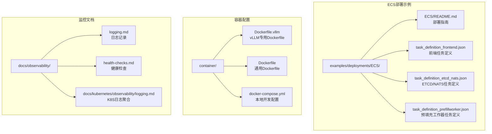

**图表来源**
- [examples/deployments/ECS/README.md](file://examples/deployments/ECS/README.md#L1-L129)
- [container/Dockerfile.vllm](file://container/Dockerfile.vllm#L1-L864)
- [container/Dockerfile](file://container/Dockerfile#L1-L655)

**章节来源**
- [examples/deployments/ECS/README.md](file://examples/deployments/ECS/README.md#L1-L129)
- [container/Dockerfile.vllm](file://container/Dockerfile.vllm#L1-L864)
- [container/Dockerfile](file://container/Dockerfile#L1-L655)

## 核心组件

### ECS集群类型对比

Dynamo的ECS部署采用了两种不同的集群类型以适应不同服务的需求：

#### EC2集群（GPU推理工作负载）
- **适用场景**：需要GPU资源的推理服务
- **实例类型**：g6e.2xlarge或更高规格
- **网络模式**：host模式，直接访问宿主机网络
- **GPU支持**：原生支持GPU资源分配

#### Fargate集群（无服务器基础设施服务）
- **适用场景**：ETCD、NATS等基础设施服务
- **计算模式**：完全托管，无需管理底层实例
- **网络模式**：awsvpc模式，提供容器级别的网络隔离

### 任务定义核心要素

每个任务定义都包含以下关键配置：

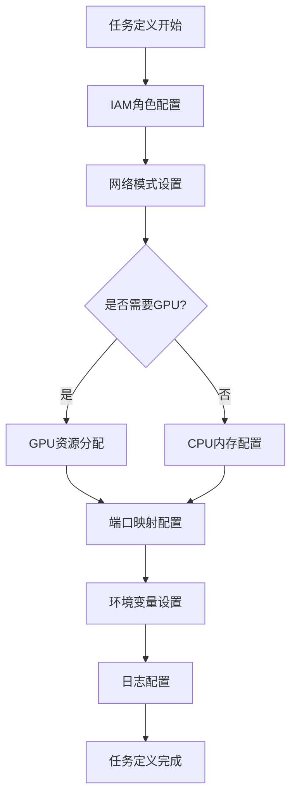

**图表来源**
- [examples/deployments/ECS/task_definition_frontend.json](file://examples/deployments/ECS/task_definition_frontend.json#L1-L79)
- [examples/deployments/ECS/task_definition_etcd_nats.json](file://examples/deployments/ECS/task_definition_etcd_nats.json#L1-L112)
- [examples/deployments/ECS/task_definition_prefillworker.json](file://examples/deployments/ECS/task_definition_prefillworker.json#L1-L71)

**章节来源**
- [examples/deployments/ECS/README.md](file://examples/deployments/ECS/README.md#L2-L21)
- [examples/deployments/ECS/task_definition_frontend.json](file://examples/deployments/ECS/task_definition_frontend.json#L1-L79)
- [examples/deployments/ECS/task_definition_etcd_nats.json](file://examples/deployments/ECS/task_definition_etcd_nats.json#L1-L112)
- [examples/deployments/ECS/task_definition_prefillworker.json](file://examples/deployments/ECS/task_definition_prefillworker.json#L1-L71)

## 架构概览

Dynamo在ECS中的整体架构采用分层设计，将不同类型的组件分离到最适合的运行环境中：

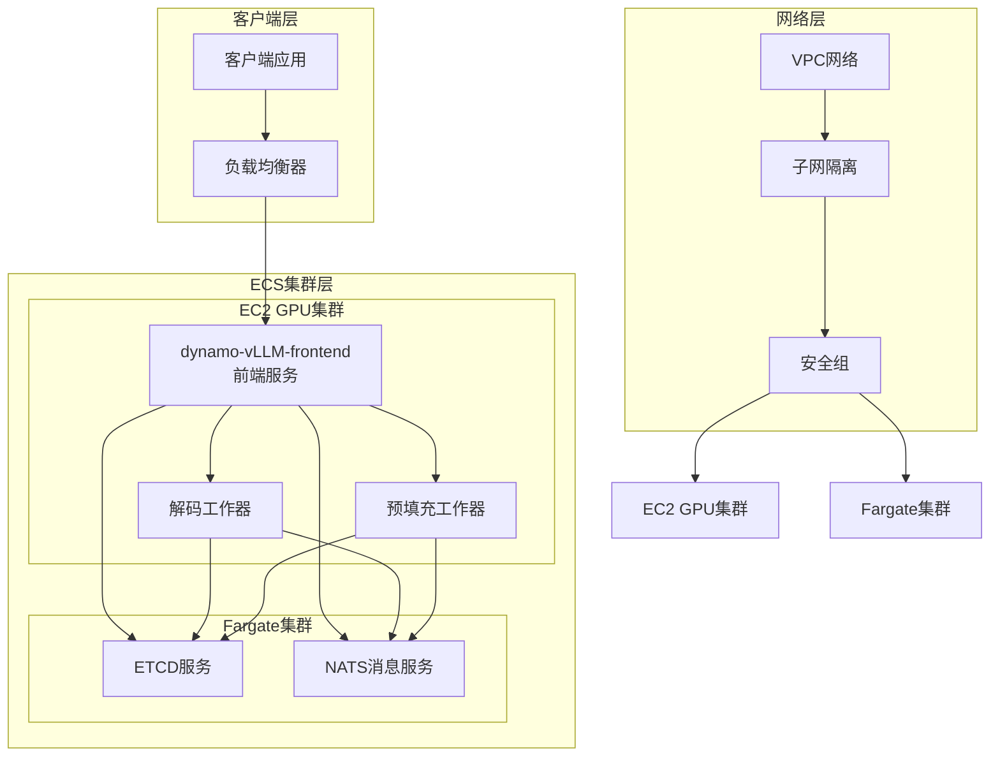

**图表来源**
- [examples/deployments/ECS/README.md](file://examples/deployments/ECS/README.md#L1-L129)

### 服务发现机制

Dynamo通过ETCD实现服务发现，通过NATS实现消息传递和事件驱动架构：

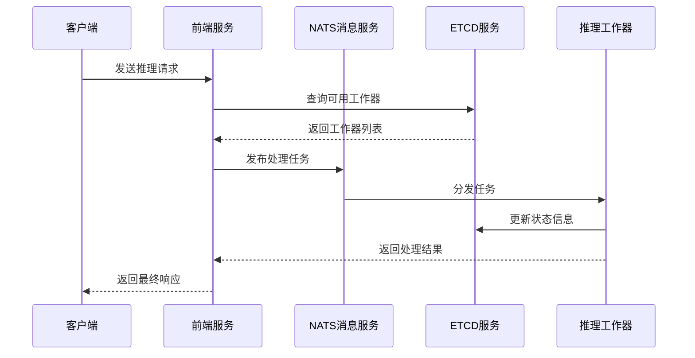

**图表来源**
- [examples/deployments/ECS/task_definition_etcd_nats.json](file://examples/deployments/ECS/task_definition_etcd_nats.json#L1-L112)
- [examples/deployments/ECS/task_definition_frontend.json](file://examples/deployments/ECS/task_definition_frontend.json#L1-L79)

## 详细组件分析

### 前端服务任务定义

前端服务负责接收客户端请求、路由到合适的推理工作器，并协调整个推理流程：

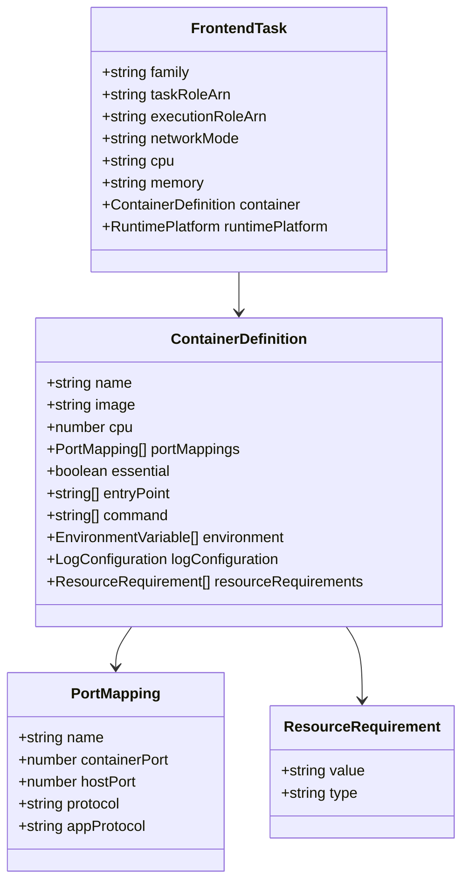

**图表来源**
- [examples/deployments/ECS/task_definition_frontend.json](file://examples/deployments/ECS/task_definition_frontend.json#L1-L79)

#### 关键配置要点

1. **GPU资源配置**：使用`resourceRequirements`指定1个GPU
2. **网络模式**：采用host模式以充分利用GPU性能
3. **端口映射**：开放8000端口用于HTTP服务
4. **环境变量**：配置ETCD和NATS连接参数

**章节来源**
- [examples/deployments/ECS/task_definition_frontend.json](file://examples/deployments/ECS/task_definition_frontend.json#L1-L79)

### ETCD和NATS基础设施服务

ETCD和NATS作为基础设施服务，提供服务发现和消息传递功能：

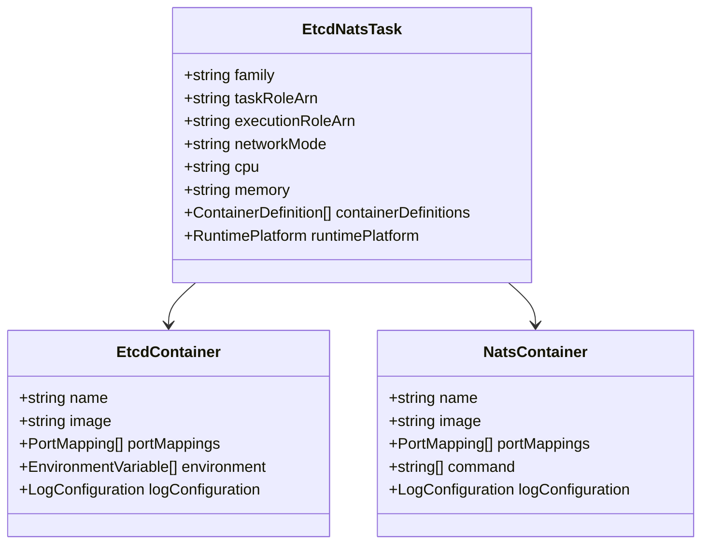

**图表来源**
- [examples/deployments/ECS/task_definition_etcd_nats.json](file://examples/deployments/ECS/task_definition_etcd_nats.json#L1-L112)

#### ETCD配置特点

- **端口映射**：2379（客户端通信）、2380（集群通信）
- **认证设置**：允许无认证访问（开发环境）
- **日志配置**：使用awslogs驱动

#### NATS配置特点

- **端口映射**：4222（客户端）、6222（集群）、8222（管理）
- **启动参数**：启用JetStream和调试跟踪
- **日志配置**：使用awslogs驱动

**章节来源**
- [examples/deployments/ECS/task_definition_etcd_nats.json](file://examples/deployments/ECS/task_definition_etcd_nats.json#L1-L112)

### 预填充工作器任务定义

预填充工作器专门处理序列的预填充阶段，与解码工作器配合实现分层推理：

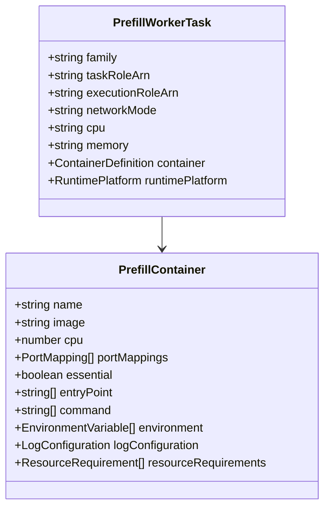

**图表来源**
- [examples/deployments/ECS/task_definition_prefillworker.json](file://examples/deployments/ECS/task_definition_prefillworker.json#L1-L71)

#### 配置差异

与前端服务相比，预填充工作器有以下特点：
- **网络模式**：使用bridge模式而非host模式
- **端口映射**：无公开端口映射
- **命令配置**：指定`--is-prefill-worker`参数

**章节来源**
- [examples/deployments/ECS/task_definition_prefillworker.json](file://examples/deployments/ECS/task_definition_prefillworker.json#L1-L71)

### 容器镜像构建配置

Dynamo提供了针对不同后端框架的专用Dockerfile配置：

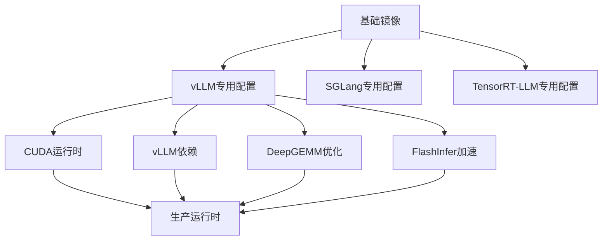

**图表来源**
- [container/Dockerfile.vllm](file://container/Dockerfile.vllm#L588-L800)
- [container/Dockerfile](file://container/Dockerfile#L450-L655)

#### vLLM专用配置

- **CUDA版本**：12.9运行时环境
- **深度学习框架**：vLLM 0.14.1
- **性能优化**：DeepGEMM和FlashInfer集成
- **编译工具链**：支持多架构构建（x86_64/arm64）

**章节来源**
- [container/Dockerfile.vllm](file://container/Dockerfile.vllm#L1-L864)
- [container/Dockerfile](file://container/Dockerfile#L1-L655)

## 依赖关系分析

### 网络依赖关系

Dynamo在ECS部署中的网络依赖关系如下：

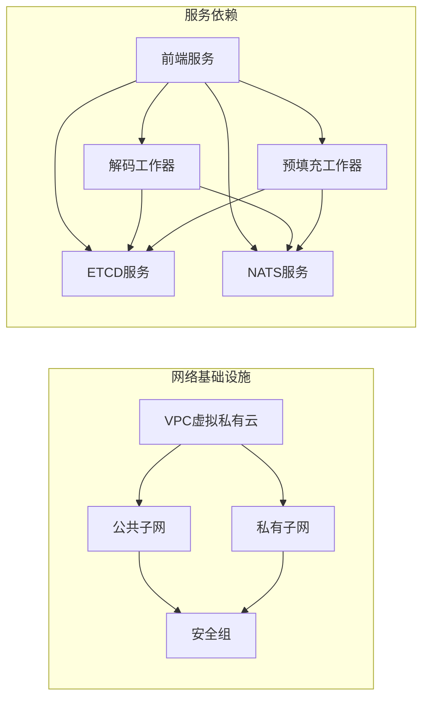

**图表来源**
- [examples/deployments/ECS/README.md](file://examples/deployments/ECS/README.md#L1-L129)

### 存储依赖关系

虽然当前示例主要使用内存存储，但Dynamo支持多种存储配置：

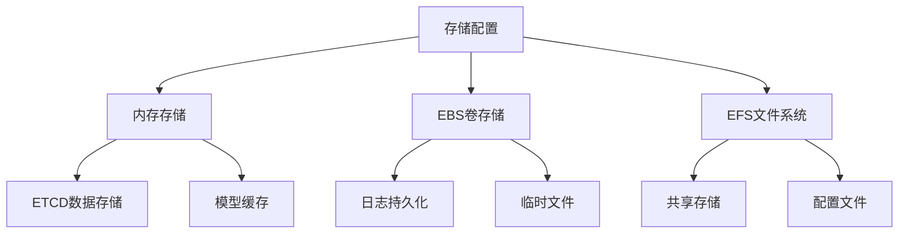

**章节来源**
- [examples/deployments/ECS/README.md](file://examples/deployments/ECS/README.md#L1-L129)

## 性能考虑

### GPU资源优化

Dynamo的ECS部署针对GPU推理进行了专门优化：

1. **GPU资源分配**：通过`resourceRequirements`精确控制GPU使用
2. **网络模式选择**：host模式减少网络开销
3. **CUDA设备管理**：设置`CUDA_DEVICE_ORDER=PCI_BUS_ID`确保设备ID一致性

### 内存和CPU配置

- **前端服务**：2vCPU + 40GB内存，适合高并发请求处理
- **工作器服务**：根据模型大小调整内存配置
- **ETCD服务**：较小的CPU和内存需求，但需要稳定的存储

### 网络性能优化

- **端口映射**：最小化不必要的端口暴露
- **网络模式**：host模式提供最佳网络性能
- **负载均衡**：结合ECS服务自动扩展功能

## 故障排查指南

### 健康检查

Dynamo提供了全面的健康检查机制：

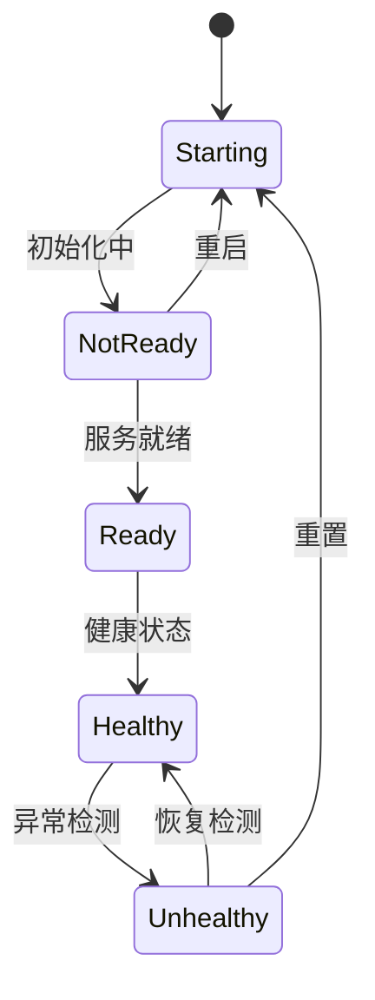

**图表来源**
- [docs/observability/health-checks.md](file://docs/observability/health-checks.md#L1-L345)

#### 健康检查端点

- **前端服务**：`/health`（查询注册的工作器状态）
- **工作器服务**：`/health`（检查服务就绪状态）
- **Liveness检查**：`/live`（仅检查进程存活）

#### 常见问题诊断

1. **服务未就绪**：检查`DYN_SYSTEM_USE_ENDPOINT_HEALTH_STATUS`配置
2. **GPU资源不足**：验证EC2实例类型和GPU分配
3. **网络连接失败**：确认ETCD和NATS服务可达性
4. **内存溢出**：调整容器内存限制和模型批处理大小

**章节来源**
- [docs/observability/health-checks.md](file://docs/observability/health-checks.md#L1-L345)

### 日志记录

Dynamo支持多种日志格式和输出方式：

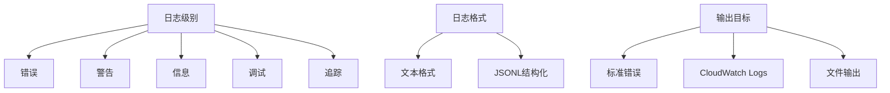

**图表来源**
- [docs/observability/logging.md](file://docs/observability/logging.md#L1-L263)

#### 结构化日志配置

- **JSONL格式**：支持`trace_id`和`span_id`字段
- **OpenTelemetry集成**：兼容分布式追踪
- **自定义请求ID**：通过`x-request-id`头字段

**章节来源**
- [docs/observability/logging.md](file://docs/observability/logging.md#L1-L263)

### 本地开发测试

Dynamo提供了完整的本地开发环境配置：

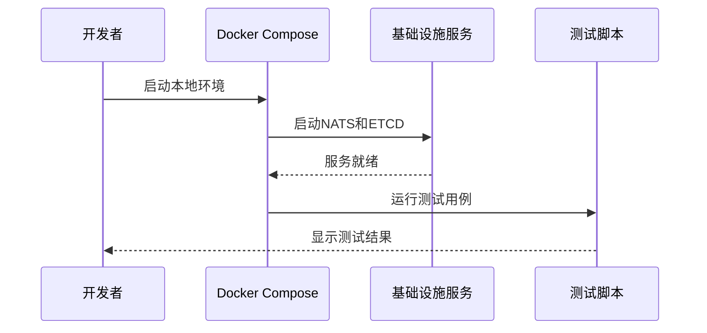

**图表来源**
- [deploy/docker-compose.yml](file://deploy/docker-compose.yml#L1-L36)

**章节来源**
- [deploy/docker-compose.yml](file://deploy/docker-compose.yml#L1-L36)

## 结论

Dynamo在Amazon ECS上的部署方案展现了现代容器化推理服务的最佳实践。通过混合使用EC2和Fargate集群，实现了计算资源的最优配置和成本效益。

该部署方案的关键优势包括：

1. **架构清晰**：前端服务与工作器分离，便于独立扩展
2. **资源优化**：针对GPU推理的专门优化配置
3. **监控完善**：内置健康检查和日志记录机制
4. **可扩展性**：支持自动扩缩容和负载均衡
5. **可靠性**：通过ETCD和NATS实现高可用架构

对于生产环境部署，建议进一步增强安全配置、监控告警和自动化运维能力。

## 附录

### AWS CLI命令示例

以下是一些常用的AWS ECS命令示例：

```bash
# 创建ECS集群
aws ecs create-cluster --cluster-name dynamo-GPU

# 注册任务定义
aws ecs register-task-definition --cli-input-json file://task_definition_frontend.json

# 创建ECS服务
aws ecs create-service --cluster dynamo-GPU \
    --service-name dynamo-frontend \
    --task-definition Dynamo-frontend \
    --desired-count 1 \
    --launch-type EC2 \
    --network-configuration "awsvpcConfiguration={subnets=[subnet-12345],securityGroups=[sg-12345],assignPublicIp=ENABLED}"

# 更新服务配置
aws ecs update-service --cluster dynamo-GPU \
    --service dynamo-frontend \
    --desired-count 2
```

### IAM权限配置

为确保ECS任务正常运行，需要配置以下IAM权限：

- **AmazonECSTaskExecutionRolePolicy**：拉取镜像和写入CloudWatch日志
- **CloudWatch Logs权限**：创建和管理日志组
- **Secrets Manager权限**：访问NGC认证凭据
- **EC2实例权限**：访问GPU资源和网络接口

### 监控仪表板配置

建议配置以下监控指标：

- **CPU利用率**：监控EC2实例的CPU使用情况
- **GPU利用率**：跟踪GPU资源使用率
- **内存使用量**：监控容器内存占用
- **网络吞吐量**：观察服务间通信流量
- **错误率**：统计API调用错误比例
- **延迟分布**：分析请求响应时间