# Azure AKS部署

<cite>
**本文档引用的文件**
- [AKS部署指南](file://examples/deployments/AKS/AKS-deployment.md)
- [平台Helm值配置](file://deploy/helm/charts/platform/values.yaml)
- [Dynamo图部署CRD](file://deploy/helm/charts/crds/templates/nvidia.com_dynamographdeployments.yaml)
- [Dynamo图部署类型定义](file://deploy/operator/api/v1alpha1/dynamographdeployment_types.go)
- [GPU库存检查工具](file://deploy/utils/gpu_inventory.py)
- [Kubernetes工具集](file://deploy/utils/kubernetes.py)
- [发现配置示例](file://deploy/discovery/dgd.yaml)
- [PVC声明模板](file://deploy/utils/manifests/pvc.yaml)
- [PVC访问Pod模板](file://deploy/utils/manifests/pvc-access-pod.yaml)
- [Prometheus监控配置](file://deploy/observability/prometheus.yml)
- [Grafana数据源配置](file://deploy/observability/grafana-datasources.yml)
</cite>

## 目录
1. [简介](#简介)
2. [项目结构](#项目结构)
3. [核心组件](#核心组件)
4. [架构概览](#架构概览)
5. [详细组件分析](#详细组件分析)
6. [依赖关系分析](#依赖关系分析)
7. [性能考虑](#性能考虑)
8. [故障排除指南](#故障排除指南)
9. [结论](#结论)

## 简介

本指南提供了在Azure Kubernetes Service (AKS)上部署Dynamo的完整解决方案。Dynamo是一个分布式推理平台，支持多种后端框架（如vLLM、TensorRT-LLM、SGLang），通过Kubernetes原生的Operator模式实现自动化的模型服务编排。

本部署方案涵盖了从基础设施准备到生产环境监控的完整流程，包括GPU节点池配置、存储持久化、网络访问控制以及成本优化策略。

## 项目结构

Dynamo在AKS部署相关的代码组织主要分布在以下目录：

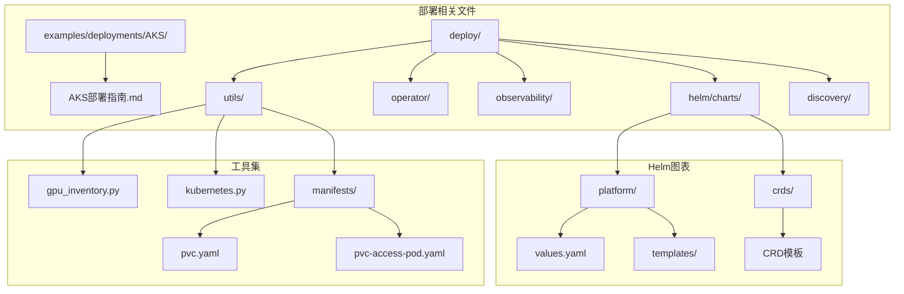

**图表来源**
- [AKS部署指南](file://examples/deployments/AKS/AKS-deployment.md#L1-L79)
- [平台Helm值配置](file://deploy/helm/charts/platform/values.yaml#L1-L732)

**章节来源**
- [AKS部署指南](file://examples/deployments/AKS/AKS-deployment.md#L1-L79)
- [平台Helm值配置](file://deploy/helm/charts/platform/values.yaml#L1-L732)

## 核心组件

### NVIDIA GPU Operator

Dynamo通过NVIDIA GPU Operator实现GPU资源的自动化管理：

- **GPU驱动程序**: 自动安装和更新NVIDIA设备驱动
- **容器工具包**: 提供容器运行时的GPU支持
- **设备插件**: 暴露GPU资源给Kubernetes调度器
- **监控工具**: 集成DCGM进行GPU性能监控

### Dynamo Kubernetes Operator

Dynamo的核心控制器负责：

- **资源编排**: 自动创建和管理推理服务的Kubernetes资源
- **状态管理**: 监控服务状态并处理故障恢复
- **配置管理**: 处理DynamoGraphDeployment自定义资源
- **服务发现**: 在Kubernetes集群内自动发现推理服务

### 存储系统

支持多种存储后端以满足不同场景需求：

- **Azure Files**: 支持ReadWriteMany访问模式，适合多副本共享
- **Azure Disks**: 单节点读写，高性能本地存储
- **持久卷声明**: 通过动态供应实现弹性存储管理

**章节来源**
- [AKS部署指南](file://examples/deployments/AKS/AKS-deployment.md#L22-L55)
- [平台Helm值配置](file://deploy/helm/charts/platform/values.yaml#L20-L120)

## 架构概览

Dynamo在AKS上的整体架构如下：

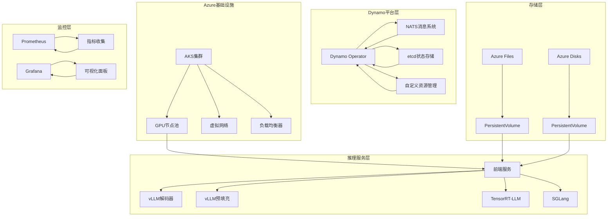

**图表来源**
- [平台Helm值配置](file://deploy/helm/charts/platform/values.yaml#L234-L490)
- [Dynamo图部署CRD](file://deploy/helm/charts/crds/templates/nvidia.com_dynamographdeployments.yaml#L48-L110)

## 详细组件分析

### AKS集群配置

#### GPU节点池设置

推荐使用NC系列或ND系列VM SKU以获得最佳GPU性能：

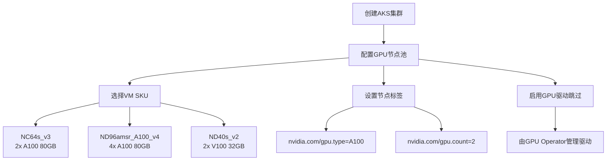

**图表来源**
- [AKS部署指南](file://examples/deployments/AKS/AKS-deployment.md#L14-L20)

#### 虚拟网络配置

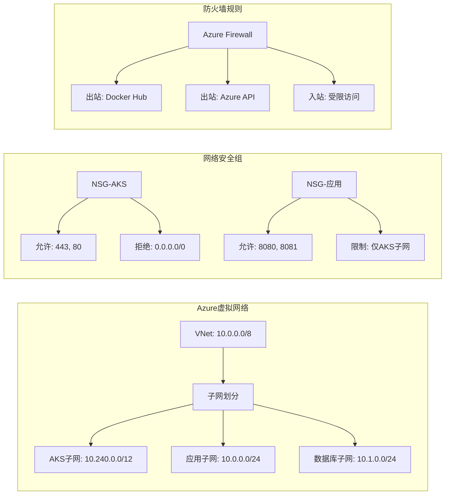

### 存储配置

#### Azure Files持久化

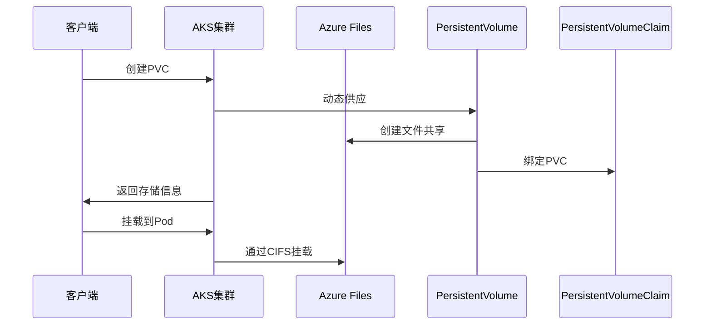

**图表来源**
- [PVC声明模板](file://deploy/utils/manifests/pvc.yaml#L1-L17)
- [PVC访问Pod模板](file://deploy/utils/manifests/pvc-access-pod.yaml#L36-L40)

#### Azure Disks配置

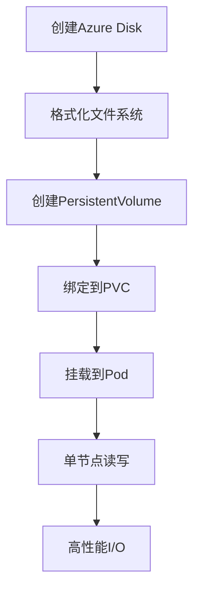

### 网络配置

#### Load Balancer设置

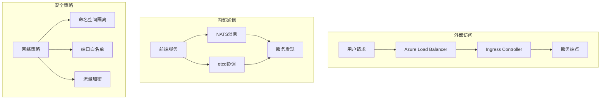

#### Application Gateway集成

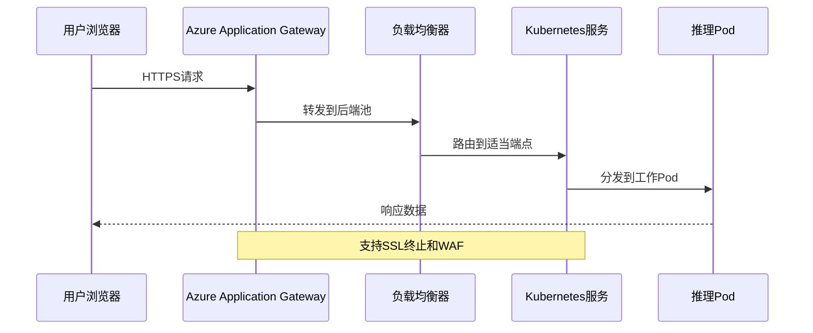

### 监控和日志

#### Prometheus集成

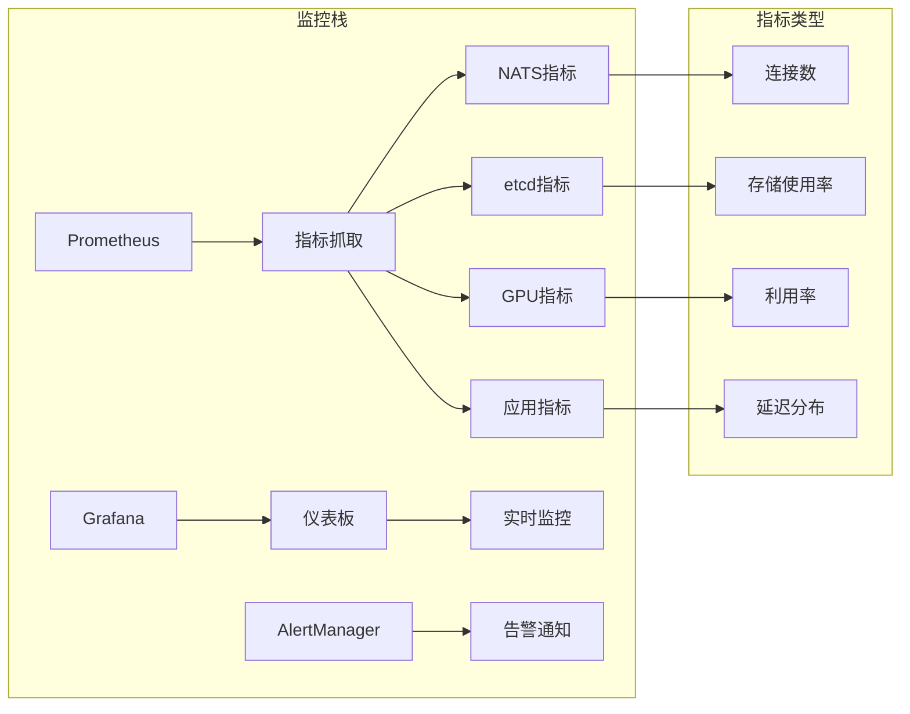

**图表来源**
- [Prometheus监控配置](file://deploy/observability/prometheus.yml#L20-L50)
- [Grafana数据源配置](file://deploy/observability/grafana-datasources.yml#L18-L24)

**章节来源**
- [Prometheus监控配置](file://deploy/observability/prometheus.yml#L1-L63)
- [Grafana数据源配置](file://deploy/observability/grafana-datasources.yml#L1-L24)

## 依赖关系分析

### 组件依赖图

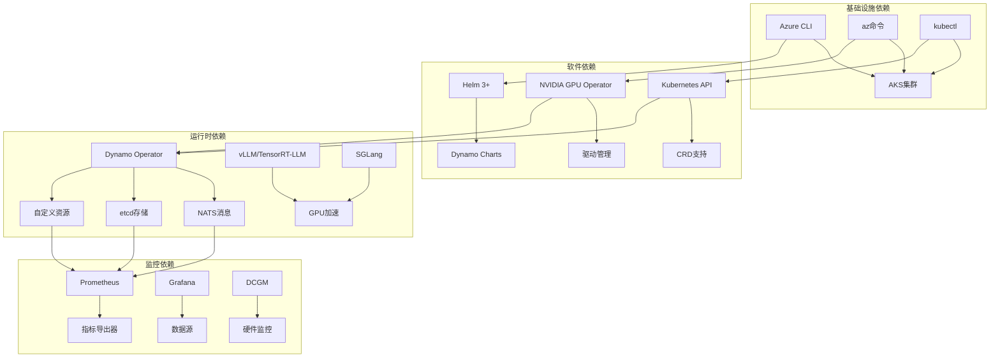

**图表来源**
- [平台Helm值配置](file://deploy/helm/charts/platform/values.yaml#L1-L100)
- [Dynamo图部署CRD](file://deploy/helm/charts/crds/templates/nvidia.com_dynamographdeployments.yaml#L1-L50)

### 资源配额和限制

| 组件 | CPU请求 | 内存请求 | GPU限制 | 存储需求 |
|------|---------|----------|---------|----------|
| Dynamo Operator | 200m | 256Mi | 无 | 无 |
| NATS服务器 | 500m | 1Gi | 无 | 10Gi |
| etcd集群 | 1核 | 2Gi | 无 | 1Gi |
| vLLM解码器 | 2核 | 8Gi | 1个A100 | 50Gi |
| vLLM预填充 | 1核 | 4Gi | 1个A100 | 50Gi |
| TensorRT-LLM | 4核 | 16Gi | 1个A100 | 50Gi |
| SGLang引擎 | 2核 | 8Gi | 1个A100 | 50Gi |

**章节来源**
- [平台Helm值配置](file://deploy/helm/charts/platform/values.yaml#L234-L490)
- [Dynamo图部署类型定义](file://deploy/operator/api/v1alpha1/dynamographdeployment_types.go#L47-L69)

## 性能考虑

### GPU VM SKU选择策略

```mermaid
flowchart TD
A[性能需求评估] --> B{模型大小}
B --> |小模型(<7B)| C[NC64s_v3<br/>2x A100 80GB]
B --> |中等模型(7B-65B)| D[ND40s_v2<br/>2x V100 32GB]
B --> |大模型(>65B)| E[ND96amsr_A100_v4<br/>4x A100 80GB]
C --> F[成本优化]
D --> F
E --> F
F --> G{预算约束}
G --> |充足| H[专用实例]
G --> |有限| I[Spot实例]
H --> J[稳定性能]
I --> K[成本降低]
```

### Spot VM使用策略

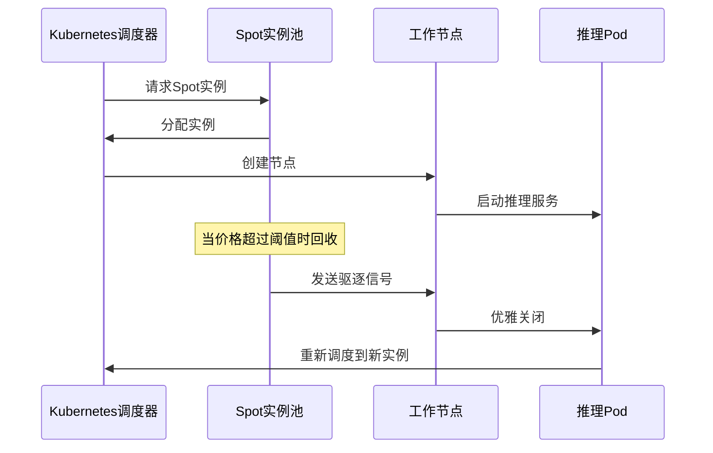

### 成本优化建议

1. **实例类型选择**: 根据模型大小选择合适的GPU实例
2. **Spot实例使用**: 对可容忍中断的工作负载使用Spot实例
3. **自动伸缩**: 配置HPA根据CPU和内存使用率自动调整
4. **存储优化**: 使用Azure Files进行共享存储，避免重复数据
5. **网络优化**: 合理配置负载均衡器和防火墙规则

## 故障排除指南

### 常见问题诊断

#### GPU资源不可用

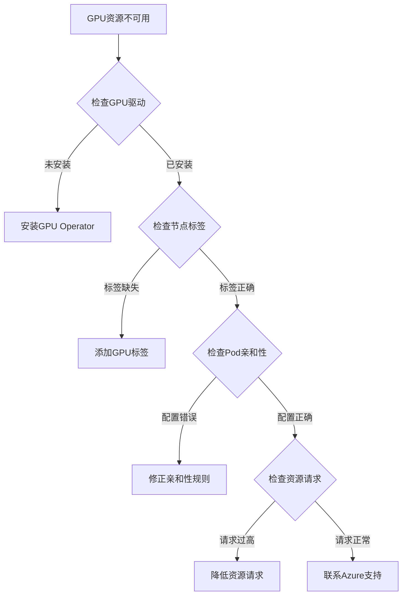

#### 存储挂载失败

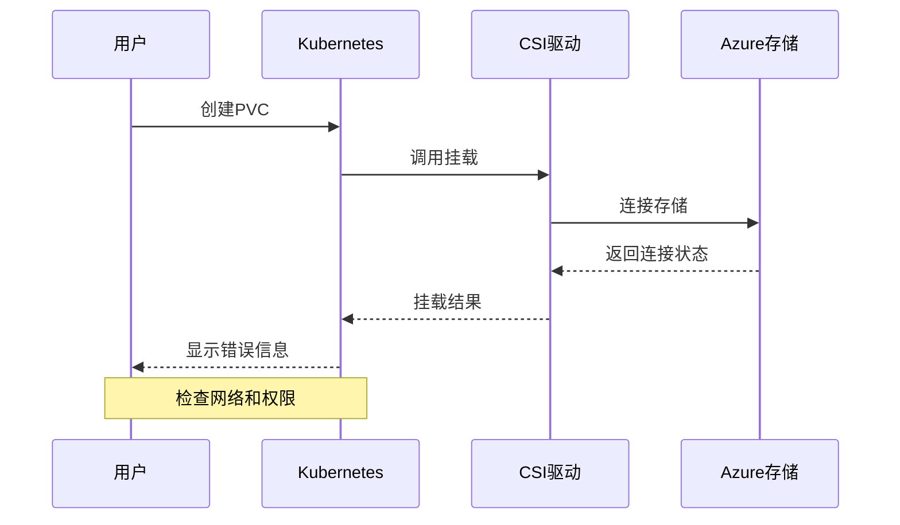

#### 网络连接问题

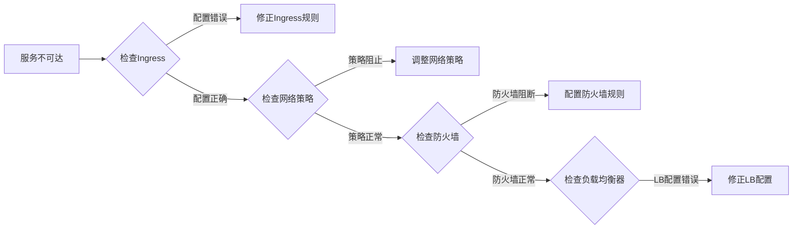

### 监控和日志分析

#### 关键指标监控

| 指标类别 | 关键指标 | 阈值设置 | 告警级别 |
|----------|----------|----------|----------|
| GPU性能 | 利用率 > 80% | 80% | 中等 |
| 内存使用 | 使用率 > 85% | 85% | 高 |
| 网络延迟 | P95 > 100ms | 100ms | 中等 |
| 服务可用性 | 可用性 < 99% | 99% | 高 |
| 存储IO | IOPS < 预期值的50% | 50% | 中等 |

#### 日志分析流程

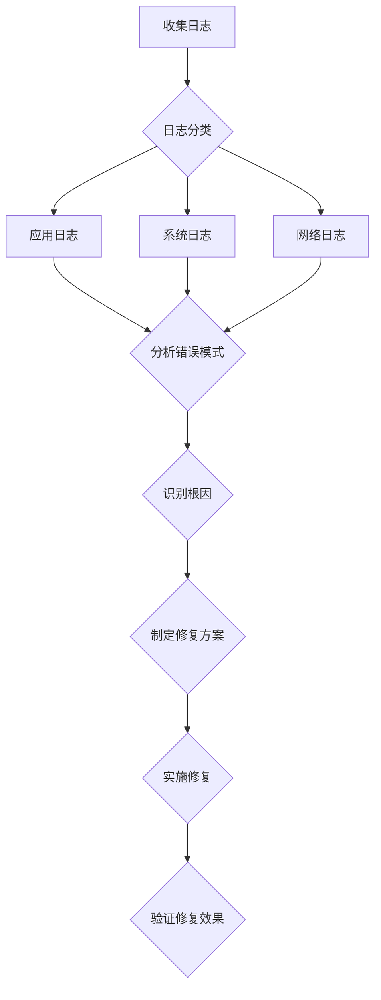

**章节来源**
- [GPU库存检查工具](file://deploy/utils/gpu_inventory.py#L152-L190)
- [Kubernetes工具集](file://deploy/utils/kubernetes.py#L55-L108)

## 结论

Dynamo在Azure AKS上的部署提供了一个完整的、生产就绪的推理服务平台。通过合理配置GPU节点池、存储系统和网络访问，可以实现高性能、高可用的AI推理服务。

关键成功因素包括：
- 选择合适的GPU VM SKU以平衡性能和成本
- 正确配置存储持久化以确保数据可靠性
- 实施全面的监控和告警机制
- 建立完善的故障排除和恢复流程
- 采用成本优化策略如Spot实例和自动伸缩

这个部署方案为大规模AI推理应用提供了坚实的技术基础，可以根据具体业务需求进行进一步定制和优化。