# Google GKE部署

<cite>
**本文档引用的文件**
- [GKE部署指南](file://examples/deployments/GKE/README.md)
- [安装指南](file://docs/kubernetes/installation_guide.md)
- [平台Helm图表](file://deploy/helm/charts/platform/README.md)
- [预部署检查脚本](file://deploy/pre-deployment/README.md)
- [GPU库存工具](file://deploy/utils/gpu_inventory.py)
- [Kubernetes工具](file://deploy/utils/kubernetes.py)
- [持久卷声明模板](file://deploy/utils/manifests/pvc.yaml)
- [多节点部署文档](file://docs/kubernetes/deployment/multinode-deployment.md)
- [观测性文档](file://docs/observability/tracing.md)
- [性能调优指南](file://docs/performance/tuning.md)
- [防火墙注入服务API](file://tests/fault_tolerance/hardware/fault_injection_service/api_service/main.py)
- [Dynamo组件部署类型定义](file://deploy/operator/api/v1alpha1/dynamocomponentdeployment_types.go)
- [Scale资源控制器](file://deploy/operator/internal/controller_common/scale.go)
- [Dynamo操作员构建文件](file://deploy/operator/Makefile)
</cite>

## 目录
1. [简介](#简介)
2. [项目结构概览](#项目结构概览)
3. [核心组件](#核心组件)
4. [架构概览](#架构概览)
5. [详细组件分析](#详细组件分析)
6. [依赖关系分析](#依赖关系分析)
7. [性能考虑](#性能考虑)
8. [故障排除指南](#故障排除指南)
9. [结论](#结论)

## 简介

本文档提供了Dynamo在Google Cloud GKE（Google Kubernetes Engine）上的完整部署指南。涵盖了从集群创建到生产环境部署的全过程，包括NodePool配置、IAM Service Account设置、存储配置、网络负载均衡器和Ingress设置。

Dynamo是一个高性能的推理图平台，支持多种后端引擎（vLLM、SGLang、TensorRT-LLM），通过Kubernetes Operator实现自动化管理和扩展。该平台特别适合大规模语言模型的部署和管理。

## 项目结构概览

基于仓库中的GKE部署相关文件，主要涉及以下关键组件：

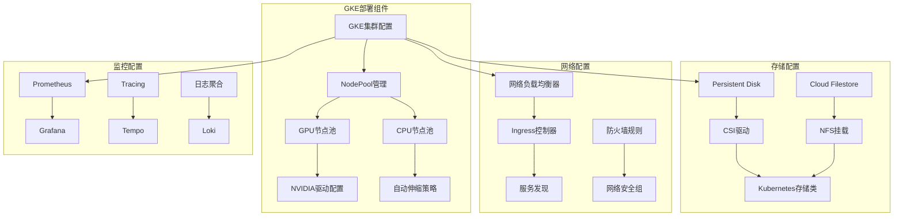

**图表来源**
- [GKE部署指南](file://examples/deployments/GKE/README.md#L1-L189)
- [平台Helm图表](file://deploy/helm/charts/platform/README.md#L1-L187)

**章节来源**
- [GKE部署指南](file://examples/deployments/GKE/README.md#L1-L189)
- [平台Helm图表](file://deploy/helm/charts/platform/README.md#L1-L187)

## 核心组件

### GKE集群基础设施

Dynamo在GKE上部署的核心基础设施包括：

#### 集群创建参数
- **项目ID**: 指定Google Cloud项目
- **区域/可用区**: 支持多区域部署
- **机器类型**: n2-standard-4用于控制平面
- **磁盘大小**: 默认200GB
- **节点数量**: 控制平面2个节点

#### GPU节点池配置
- **GPU类型**: NVIDIA L4 (可配置为其他GPU类型)
- **GPU数量**: 每节点2个GPU
- **机器类型**: g2-standard-24
- **自动伸缩**: 最小1个，最大3个节点
- **驱动版本**: 使用最新GPU驱动

**章节来源**
- [GKE部署指南](file://examples/deployments/GKE/README.md#L8-L46)

### 存储解决方案

#### Persistent Disk配置
Dynamo支持多种存储方案：

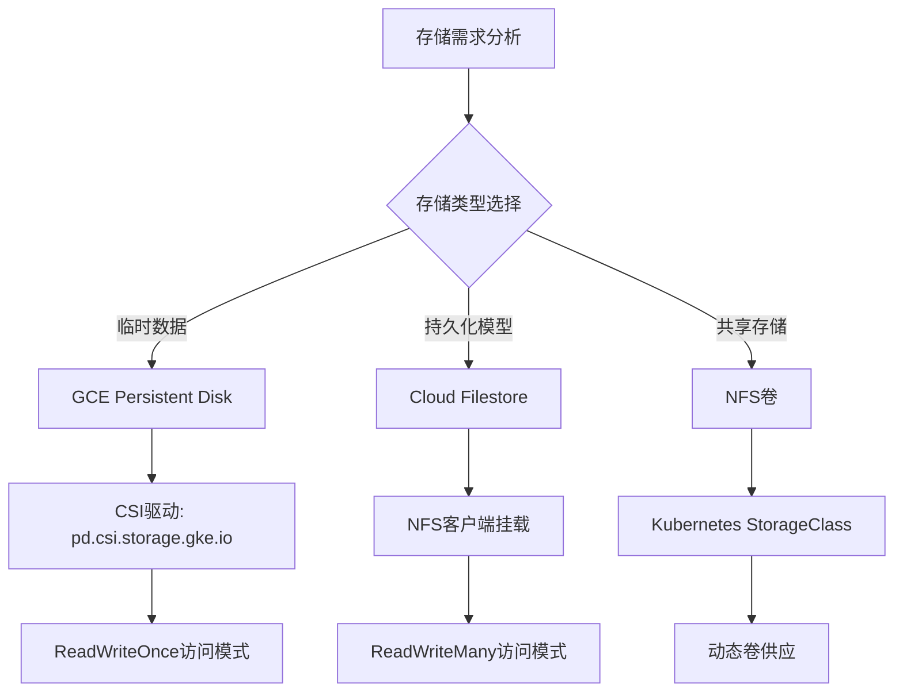

**图表来源**
- [Dynamo组件部署类型定义](file://deploy/operator/api/v1alpha1/dynamocomponentdeployment_types.go#L149-L170)

#### 存储类配置
- **默认存储类**: 需要设置为集群默认存储类
- **访问模式**: ReadWriteOnce (RWO) 或 ReadWriteMany (RWX)
- **性能特性**: 根据工作负载选择SSD或平衡型存储

**章节来源**
- [预部署检查脚本](file://deploy/pre-deployment/README.md#L51-L94)
- [持久卷声明模板](file://deploy/utils/manifests/pvc.yaml#L1-L16)

### 网络配置

#### 负载均衡器设置
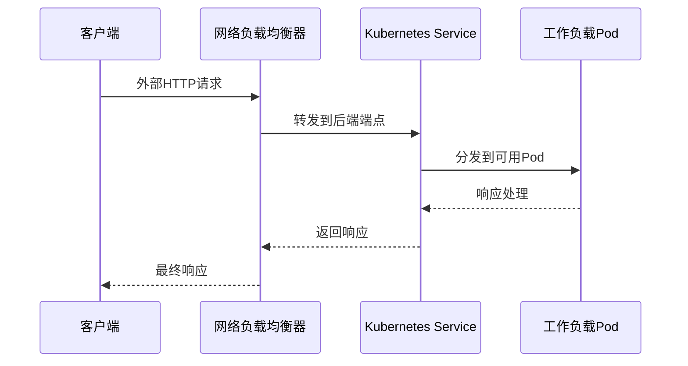

**图表来源**
- [GKE部署指南](file://examples/deployments/GKE/README.md#L1-L189)

#### Ingress配置选项
- **标准Ingress**: 使用Nginx控制器
- **虚拟服务**: 适用于Istio服务网格
- **TLS终止**: 支持HTTPS流量
- **注解配置**: 自定义Ingress行为

**章节来源**
- [Dynamo组件部署类型定义](file://deploy/operator/api/v1alpha1/dynamocomponentdeployment_types.go#L149-L170)

## 架构概览

Dynamo在GKE上的整体架构设计如下：

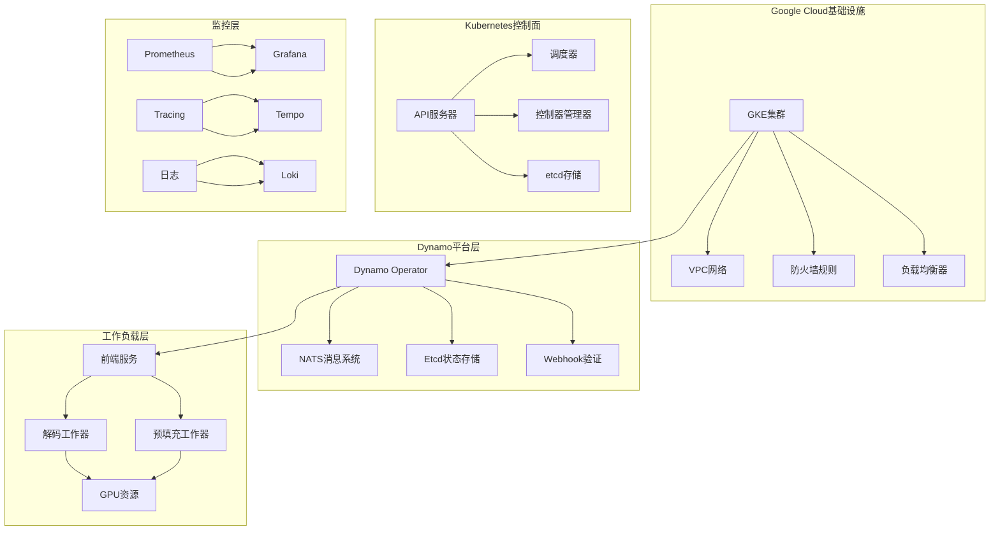

**图表来源**
- [安装指南](file://docs/kubernetes/installation_guide.md#L1-L386)
- [平台Helm图表](file://deploy/helm/charts/platform/README.md#L1-L187)

## 详细组件分析

### GPU节点池配置

#### NVIDIA驱动配置
在GKE环境中，正确配置GPU驱动是关键步骤：

```mermaid
flowchart TD
A[创建GPU节点池] --> B[安装GPU驱动]
B --> C[验证驱动状态]
C --> D[配置环境变量]
D --> E[测试GPU可用性]
F[LD_LIBRARY_PATH设置] --> G[/usr/local/nvidia/lib64]
H[PATH设置] --> I[/usr/local/nvidia/bin]
J[ldconfig更新] --> K[库缓存重建]
C --> F
C --> H
C --> J
```

**图表来源**
- [GKE部署指南](file://examples/deployments/GKE/README.md#L105-L134)

#### GPU资源管理
- **GPU产品**: 支持多种NVIDIA GPU型号
- **内存分配**: 自动检测GPU内存容量
- **MIG支持**: 可选的多实例GPU配置
- **资源标签**: 用于节点选择和亲和性

**章节来源**
- [GPU库存工具](file://deploy/utils/gpu_inventory.py#L270-L312)

### 自动伸缩策略

#### HPA配置
Dynamo支持基于CPU使用率和自定义指标的自动伸缩：

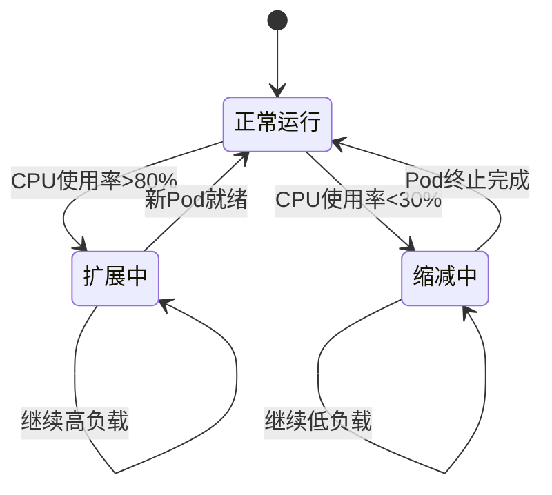

#### 自定义伸缩指标
- **请求延迟**: 基于P95/P99延迟
- **队列长度**: 待处理请求数量
- **GPU利用率**: GPU计算资源使用率

**章节来源**
- [Scale资源控制器](file://deploy/operator/internal/controller_common/scale.go#L1-L76)

### 存储配置详解

#### Persistent Volume (PV) 生命周期
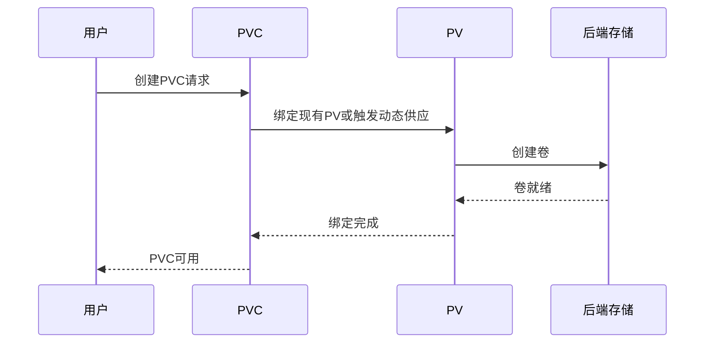

**图表来源**
- [Kubernetes工具](file://deploy/utils/kubernetes.py#L144-L185)

#### 存储类最佳实践
- **性能优先**: SSD存储类用于高IOPS需求
- **成本优化**: HDD存储类用于冷数据
- **可用性**: 多副本配置确保数据冗余
- **安全**: 启用加密和访问控制

**章节来源**
- [持久卷声明模板](file://deploy/utils/manifests/pvc.yaml#L1-L16)

### 网络安全配置

#### 防火墙规则管理
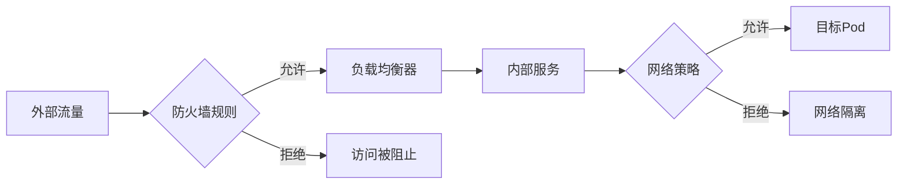

**图表来源**
- [防火墙注入服务API](file://tests/fault_tolerance/hardware/fault_injection_service/api_service/main.py#L685-L844)

#### 网络策略配置
- **入站规则**: 仅允许必要的端口和协议
- **出站规则**: 控制对外部服务的访问
- **命名空间隔离**: 不同租户间的网络隔离
- **DNS访问**: 允许必要的DNS查询

**章节来源**
- [防火墙注入服务API](file://tests/fault_tolerance/hardware/fault_injection_service/api_service/main.py#L685-L844)

## 依赖关系分析

### Helm图表依赖关系

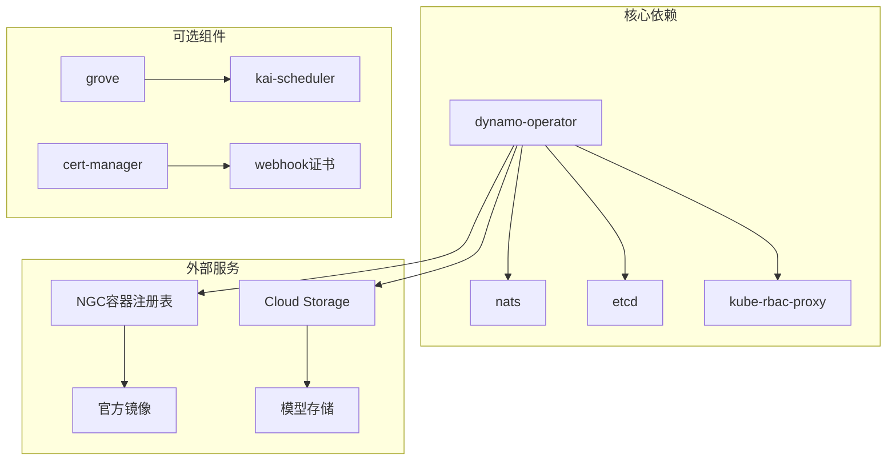

**图表来源**
- [平台Helm图表](file://deploy/helm/charts/platform/README.md#L85-L187)

### 组件间通信

#### 服务发现机制
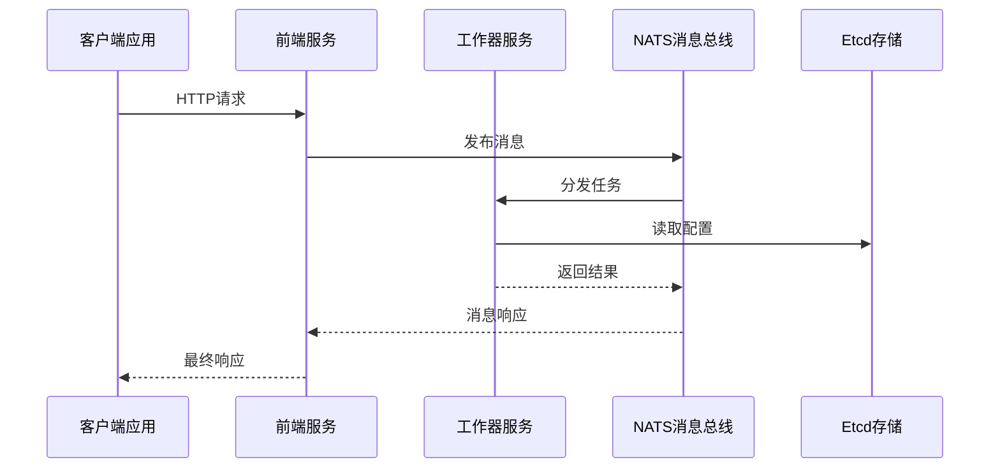

**图表来源**
- [安装指南](file://docs/kubernetes/installation_guide.md#L265-L274)

**章节来源**
- [平台Helm图表](file://deploy/helm/charts/platform/README.md#L1-L187)
- [安装指南](file://docs/kubernetes/installation_guide.md#L1-L386)

## 性能考虑

### GPU资源优化

#### 张量并行配置
根据多节点部署文档，张量并行度需要与GPU总数匹配：

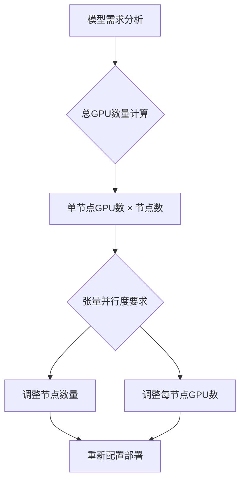

**图表来源**
- [多节点部署文档](file://docs/kubernetes/deployment/multinode-deployment.md#L117-L178)

#### 性能调优建议
- **批处理大小**: 根据GPU内存调整批处理大小
- **序列长度**: 平衡延迟和吞吐量
- **KV缓存**: 优化注意力机制性能
- **混合精度**: 使用FP16/BF16提高吞吐量

**章节来源**
- [性能调优指南](file://docs/performance/tuning.md#L31-L46)

### 成本优化策略

#### 资源预留和限制
- **CPU限制**: 避免过度预留导致资源浪费
- **内存限制**: 根据工作负载峰值设置
- **GPU分配**: 合理的GPU份额分配
- **存储配额**: 监控和限制存储使用

#### 自动伸缩配置
- **最小实例数**: 保证服务可用性的基础容量
- **最大实例数**: 控制成本上限
- **伸缩阈值**: 基于业务需求调整
- **冷却时间**: 避免频繁伸缩

## 故障排除指南

### 常见部署问题

#### GPU驱动问题
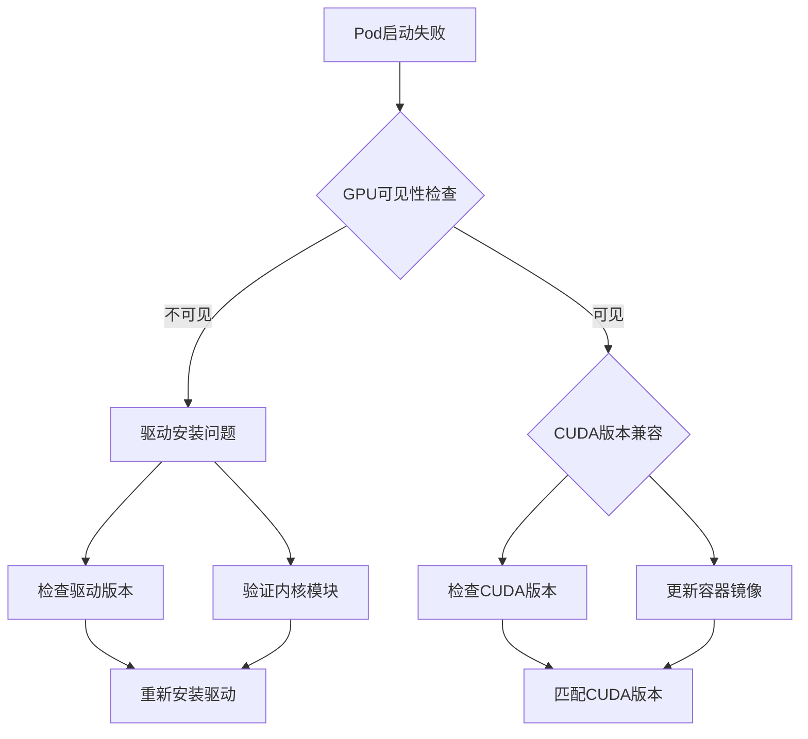

#### 存储问题诊断
- **PVC绑定失败**: 检查存储类配置和权限
- **IO性能问题**: 监控存储延迟和吞吐量
- **容量不足**: 扩展存储卷或清理历史数据

**章节来源**
- [预部署检查脚本](file://deploy/pre-deployment/README.md#L51-L94)

### 监控和调试

#### 观测性配置
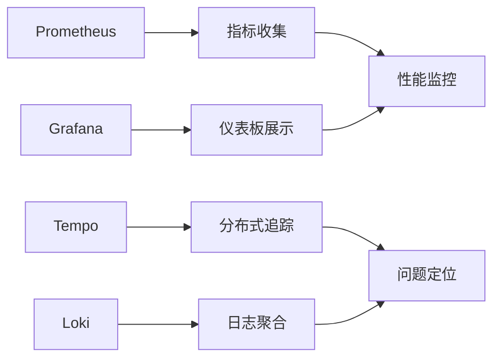

**图表来源**
- [观测性文档](file://docs/observability/tracing.md#L113-L157)

#### 调试工具
- **kubectl命令**: 基础的集群状态检查
- **日志查看**: 实时监控服务状态
- **指标分析**: 性能瓶颈识别
- **追踪分析**: 请求路径可视化

**章节来源**
- [观测性文档](file://docs/observability/tracing.md#L113-L157)

## 结论

Dynamo在GKE上的部署提供了企业级的AI推理服务解决方案。通过合理的资源配置、网络规划和监控设置，可以实现高性能、高可用的推理服务。

关键成功因素包括：
- **正确的GPU配置和驱动管理**
- **灵活的存储架构设计**
- **完善的网络和安全策略**
- **全面的监控和可观测性**
- **成本优化和资源管理**

建议在生产部署前进行充分的性能测试和容量规划，确保系统能够满足预期的业务需求。