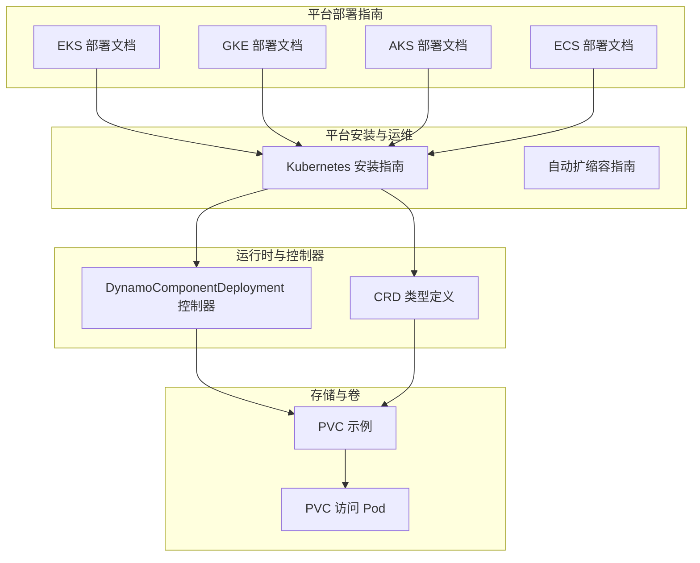
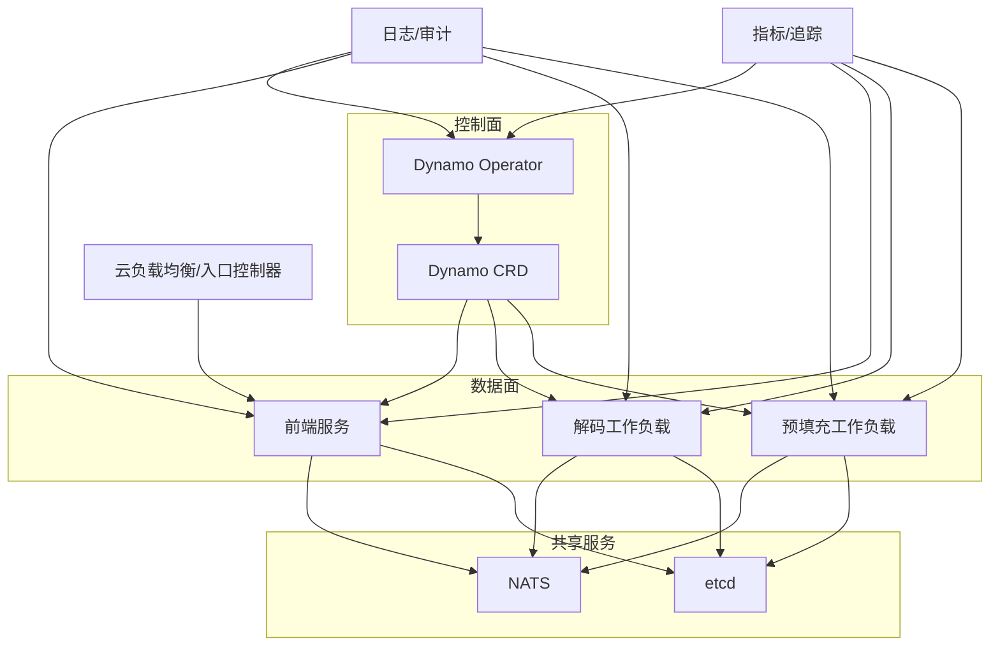
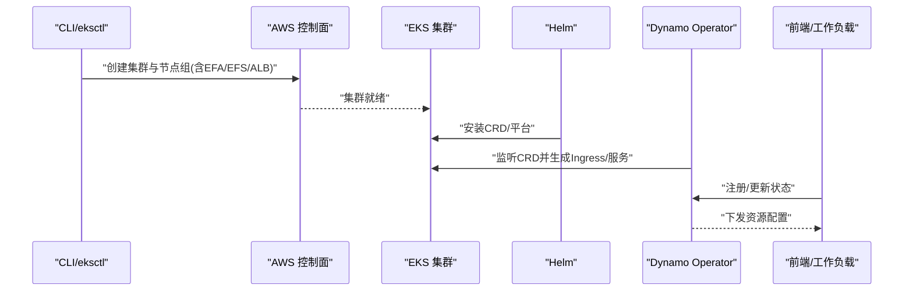
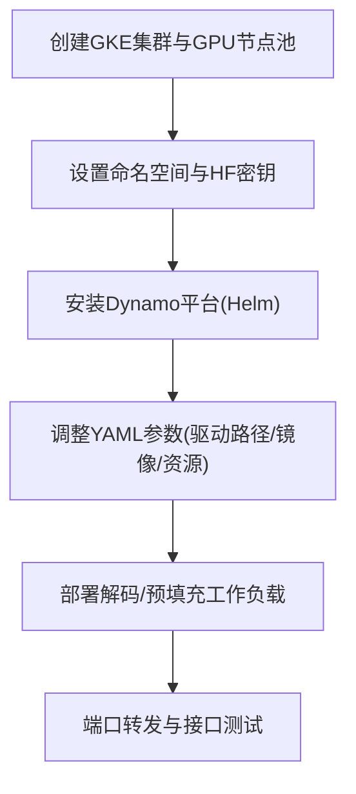
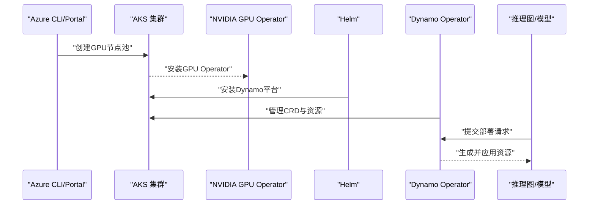
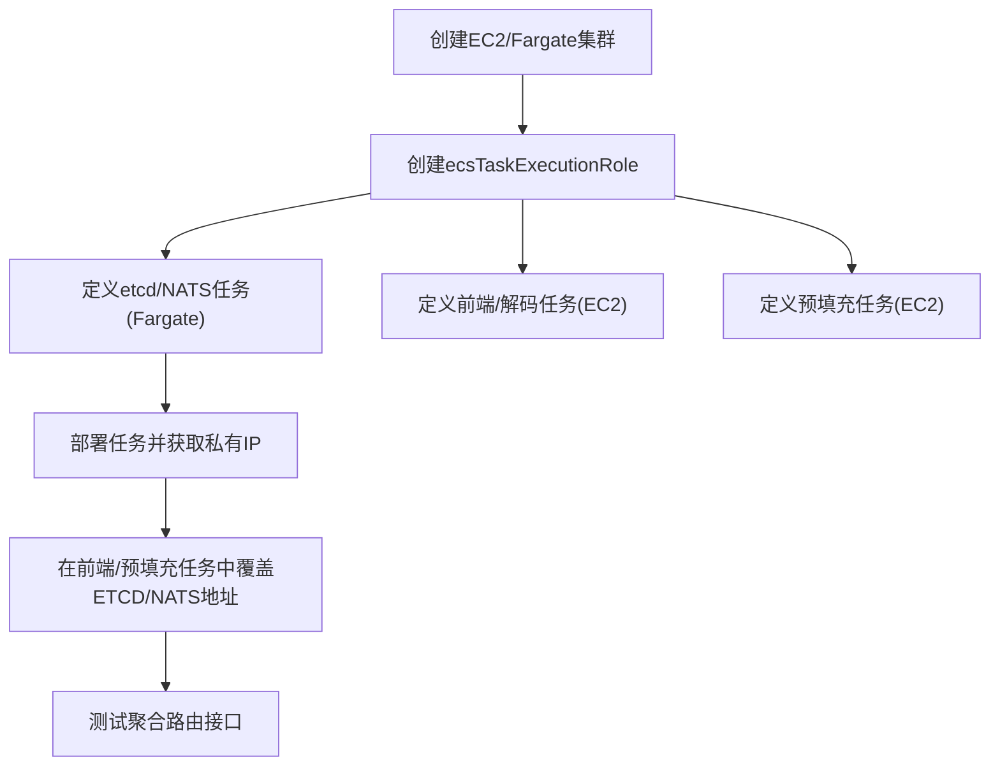
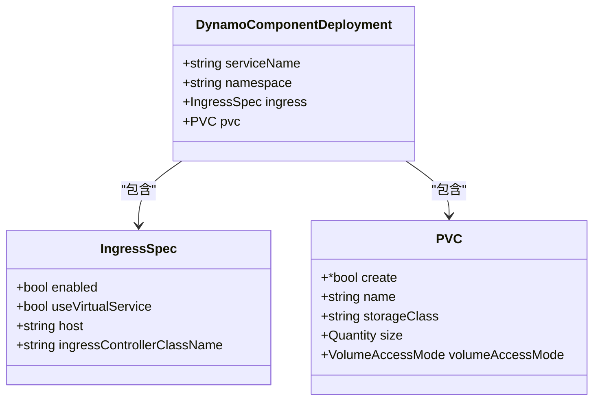
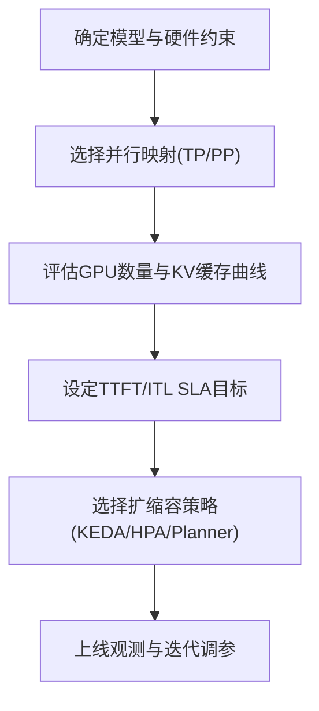

# 云平台部署

<cite>
**本文引用的文件**
- [examples/deployments/EKS/Create_EKS_EFS.md](file://examples/deployments/EKS/Create_EKS_EFS.md)
- [examples/deployments/EKS/Deploy_Dynamo_Kubernetes_Platform.md](file://examples/deployments/EKS/Deploy_Dynamo_Kubernetes_Platform.md)
- [examples/deployments/EKS/Deploy_VLLM_example.md](file://examples/deployments/EKS/Deploy_VLLM_example.md)
- [examples/deployments/GKE/README.md](file://examples/deployments/GKE/README.md)
- [examples/deployments/AKS/AKS-deployment.md](file://examples/deployments/AKS/AKS-deployment.md)
- [examples/deployments/ECS/README.md](file://examples/deployments/ECS/README.md)
- [examples/deployments/ECS/task_definition_frontend.json](file://examples/deployments/ECS/task_definition_frontend.json)
- [examples/deployments/ECS/task_definition_prefillworker.json](file://examples/deployments/ECS/task_definition_prefillworker.json)
- [examples/deployments/ECS/task_definition_etcd_nats.json](file://examples/deployments/ECS/task_definition_etcd_nats.json)
- [docs/kubernetes/installation_guide.md](file://docs/kubernetes/installation_guide.md)
- [docs/kubernetes/autoscaling.md](file://docs/kubernetes/autoscaling.md)
- [docs/performance/tuning.md](file://docs/performance/tuning.md)
- [deploy/operator/internal/controller/dynamocomponentdeployment_controller.go](file://deploy/operator/internal/controller/dynamocomponentdeployment_controller.go)
- [deploy/operator/internal/controller/dynamocomponentdeployment_controller_test.go](file://deploy/operator/internal/controller/dynamocomponentdeployment_controller_test.go)
- [deploy/operator/api/v1alpha1/dynamocomponentdeployment_types.go](file://deploy/operator/api/v1alpha1/dynamocomponentdeployment_types.go)
- [deploy/operator/api/v1alpha1/common.go](file://deploy/operator/api/v1alpha1/common.go)
- [deploy/utils/manifests/pvc.yaml](file://deploy/utils/manifests/pvc.yaml)
- [deploy/utils/manifests/pvc-access-pod.yaml](file://deploy/utils/manifests/pvc-access-pod.yaml)
- [fern/pages/performance/tuning.md](file://fern/pages/performance/tuning.md)
- [fern/pages/benchmarks/sla-driven-profiling.md](file://fern/pages/benchmarks/sla-driven-profiling.md)
- [fern/pages/kubernetes/autoscaling.md](file://fern/pages/kubernetes/autoscaling.md)
</cite>

## 目录
1. [简介](#简介)
2. [项目结构](#项目结构)
3. [核心组件](#核心组件)
4. [架构总览](#架构总览)
5. [详细组件分析](#详细组件分析)
6. [依赖关系分析](#依赖关系分析)
7. [性能与成本优化](#性能与成本优化)
8. [故障排查指南](#故障排查指南)
9. [结论](#结论)
10. [附录](#附录)

## 简介
本指南面向在多云平台（AWS EKS、Google GKE、Azure AKS、Amazon ECS）上进行Dynamo生产级部署的工程团队，覆盖基础设施准备、IAM与GPU驱动、网络与负载均衡、存储配置、平台安装与验证、以及成本优化与性能调优。文档以仓库内现有部署脚本、Helm与Operator实现、以及官方文档为依据，提供可落地的步骤与最佳实践。

## 项目结构
围绕“云平台部署”的相关材料主要分布在以下位置：
- 平台部署指南：examples/deployments 下的各云平台独立文档与任务定义
- 平台安装与运维：docs/kubernetes 下的安装与自动扩缩容指南
- 运行时与控制器：deploy/operator 内部控制器与CRD类型定义
- 存储与卷：deploy/utils/manifests 下的PVC与访问Pod示例
- 性能与调优：docs 与 fern/pages 中的调优与基准页面

**图表来源**
- [examples/deployments/EKS/Deploy_Dynamo_Kubernetes_Platform.md](file://examples/deployments/EKS/Deploy_Dynamo_Kubernetes_Platform.md#L31-L84)
- [docs/kubernetes/installation_guide.md](file://docs/kubernetes/installation_guide.md#L133-L206)
- [deploy/operator/internal/controller/dynamocomponentdeployment_controller.go](file://deploy/operator/internal/controller/dynamocomponentdeployment_controller.go#L951-L979)
- [deploy/operator/api/v1alpha1/dynamocomponentdeployment_types.go](file://deploy/operator/api/v1alpha1/dynamocomponentdeployment_types.go#L172-L177)
- [deploy/utils/manifests/pvc.yaml](file://deploy/utils/manifests/pvc.yaml#L1-L17)
- [deploy/utils/manifests/pvc-access-pod.yaml](file://deploy/utils/manifests/pvc-access-pod.yaml#L1-L41)

**章节来源**
- [examples/deployments/EKS/Deploy_Dynamo_Kubernetes_Platform.md](file://examples/deployments/EKS/Deploy_Dynamo_Kubernetes_Platform.md#L31-L84)
- [docs/kubernetes/installation_guide.md](file://docs/kubernetes/installation_guide.md#L133-L206)

## 核心组件
- 平台安装（Helm）：通过Helm安装CRD与平台组件，支持预构建镜像或从源码自建
- Operator控制器：根据Dynamo CRD生成与管理Ingress/VirturalService、服务与副本等资源
- 存储与卷：通过PVC与CSI驱动提供持久化能力；示例中包含ReadWriteOnce与RWX场景建议
- 自动扩缩容：支持基于KEDA/Prometheus/Helm的HPA，以及Dynamo Planner的LLM感知扩缩放

**章节来源**
- [docs/kubernetes/installation_guide.md](file://docs/kubernetes/installation_guide.md#L133-L206)
- [deploy/operator/internal/controller/dynamocomponentdeployment_controller.go](file://deploy/operator/internal/controller/dynamocomponentdeployment_controller.go#L951-L979)
- [deploy/operator/api/v1alpha1/dynamocomponentdeployment_types.go](file://deploy/operator/api/v1alpha1/dynamocomponentdeployment_types.go#L172-L177)
- [deploy/utils/manifests/pvc.yaml](file://deploy/utils/manifests/pvc.yaml#L1-L17)

## 架构总览
下图展示了跨云平台的通用部署视图：控制面（Operator/CRD）、数据面（前端/解码/预填充工作负载）、共享服务（etcd/NATS）与外部系统（负载均衡/日志/监控）。

**图表来源**
- [docs/kubernetes/installation_guide.md](file://docs/kubernetes/installation_guide.md#L133-L206)
- [examples/deployments/ECS/README.md](file://examples/deployments/ECS/README.md#L39-L111)

## 详细组件分析

### AWS EKS 部署
- 基础设施与网络
  - 使用 eksctl 创建含EFA与EFS附加策略的节点组，启用OIDC与ALB控制器
  - 建议先以单节点启动，后续扩容确保GPU节点在同一子网以满足EFA互联
- 存储
  - 通过EFS CSI创建StorageClass并挂载到节点，用于模型缓存/日志等共享数据
- 平台安装
  - 构建并推送基础镜像与Operator镜像，创建命名空间与镜像拉取密钥
  - 安装CRD与平台，校验Operator/etcd/nats等核心Pod状态
- 应用部署
  - 参考vLLM示例部署聚合路由与工作负载，使用端口转发测试接口
- 负载均衡
  - 通过Ingress与ALB控制器暴露服务；Operator支持生成Ingress/VirtualService

**图表来源**
- [examples/deployments/EKS/Create_EKS_EFS.md](file://examples/deployments/EKS/Create_EKS_EFS.md#L42-L108)
- [examples/deployments/EKS/Deploy_Dynamo_Kubernetes_Platform.md](file://examples/deployments/EKS/Deploy_Dynamo_Kubernetes_Platform.md#L31-L84)
- [examples/deployments/EKS/Deploy_VLLM_example.md](file://examples/deployments/EKS/Deploy_VLLM_example.md#L1-L48)
- [deploy/operator/internal/controller/dynamocomponentdeployment_controller.go](file://deploy/operator/internal/controller/dynamocomponentdeployment_controller.go#L951-L979)

**章节来源**
- [examples/deployments/EKS/Create_EKS_EFS.md](file://examples/deployments/EKS/Create_EKS_EFS.md#L42-L153)
- [examples/deployments/EKS/Deploy_Dynamo_Kubernetes_Platform.md](file://examples/deployments/EKS/Deploy_Dynamo_Kubernetes_Platform.md#L31-L96)
- [examples/deployments/EKS/Deploy_VLLM_example.md](file://examples/deployments/EKS/Deploy_VLLM_example.md#L1-L48)
- [deploy/operator/internal/controller/dynamocomponentdeployment_controller.go](file://deploy/operator/internal/controller/dynamocomponentdeployment_controller.go#L951-L979)

### Google GKE 部署
- 基础设施与GPU
  - 创建含GPU节点池的GKE集群，启用GPU驱动版本与自动伸缩
- 平台安装
  - 设置命名空间与HuggingFace令牌密钥，按官方安装指南完成平台部署
- 应用部署
  - 在YAML中设置LD_LIBRARY_PATH与PATH以适配GKE GPU驱动，并部署解码/预填充工作负载
- 测试
  - 通过端口转发与curl验证聚合路由接口

**图表来源**
- [examples/deployments/GKE/README.md](file://examples/deployments/GKE/README.md#L8-L189)

**章节来源**
- [examples/deployments/GKE/README.md](file://examples/deployments/GKE/README.md#L1-L189)

### Azure AKS 部署
- 基础设施与GPU
  - 使用GPU节点池并跳过节点驱动安装，由GPU Operator接管
- 平台安装
  - 按官方指南安装Dynamo Operator与平台组件，验证核心Pod状态
- 应用部署
  - 参考模型部署流程进行推理图部署与测试

**图表来源**
- [examples/deployments/AKS/AKS-deployment.md](file://examples/deployments/AKS/AKS-deployment.md#L14-L79)

**章节来源**
- [examples/deployments/AKS/AKS-deployment.md](file://examples/deployments/AKS/AKS-deployment.md#L1-L79)

### Amazon ECS 部署
- 基础设施
  - EC2集群：使用ECS优化GPU AMI，配置安全组与公网IP；Fargate集群：用于etcd/NATS等轻量服务
- IAM与任务执行角色
  - 手动创建ecsTaskExecutionRole并附加必要策略，以便拉取镜像与写入CloudWatch
- 任务定义
  - etcd/NATS：Fargate，awsvpc网络模式；前端/解码/预填充：EC2，host网络模式，分配GPU
  - 通过容器环境变量注入ETCD_ENDPOINTS与NATS_SERVER
- 部署与测试
  - 先部署etcd/NATS，获取私有IP后在前端/预填充任务中覆盖；随后通过公网IP测试接口

**图表来源**
- [examples/deployments/ECS/README.md](file://examples/deployments/ECS/README.md#L1-L129)
- [examples/deployments/ECS/task_definition_etcd_nats.json](file://examples/deployments/ECS/task_definition_etcd_nats.json#L1-L112)
- [examples/deployments/ECS/task_definition_frontend.json](file://examples/deployments/ECS/task_definition_frontend.json#L1-L79)
- [examples/deployments/ECS/task_definition_prefillworker.json](file://examples/deployments/ECS/task_definition_prefillworker.json#L1-L71)

**章节来源**
- [examples/deployments/ECS/README.md](file://examples/deployments/ECS/README.md#L1-L129)
- [examples/deployments/ECS/task_definition_etcd_nats.json](file://examples/deployments/ECS/task_definition_etcd_nats.json#L1-L112)
- [examples/deployments/ECS/task_definition_frontend.json](file://examples/deployments/ECS/task_definition_frontend.json#L1-L79)
- [examples/deployments/ECS/task_definition_prefillworker.json](file://examples/deployments/ECS/task_definition_prefillworker.json#L1-L71)

## 依赖关系分析
- 控制器与Ingress生成
  - 控制器根据DynamoComponentDeployment生成Ingress；当启用VirtualService时同步生成VirtualService
- PVC与存储
  - PVC结构要求当create为true时必须提供size、storageClass与volumeAccessMode
  - 提供PVC与访问Pod示例，便于验证读写与权限

**图表来源**
- [deploy/operator/api/v1alpha1/dynamocomponentdeployment_types.go](file://deploy/operator/api/v1alpha1/dynamocomponentdeployment_types.go#L172-L177)
- [deploy/operator/api/v1alpha1/common.go](file://deploy/operator/api/v1alpha1/common.go#L26-L39)
- [deploy/operator/internal/controller/dynamocomponentdeployment_controller.go](file://deploy/operator/internal/controller/dynamocomponentdeployment_controller.go#L951-L979)

**章节来源**
- [deploy/operator/internal/controller/dynamocomponentdeployment_controller.go](file://deploy/operator/internal/controller/dynamocomponentdeployment_controller.go#L951-L979)
- [deploy/operator/api/v1alpha1/dynamocomponentdeployment_types.go](file://deploy/operator/api/v1alpha1/dynamocomponentdeployment_types.go#L172-L177)
- [deploy/operator/api/v1alpha1/common.go](file://deploy/operator/api/v1alpha1/common.go#L26-L39)

## 性能与成本优化
- 引擎与并行映射
  - 对稠密模型优先采用节点内TP、跨节点PP；GPU数量与KV缓存大小存在权衡曲线
- 解码/预填充引擎规模
  - 根据TTFT/ITL与SLA选择最优的预填充与解码引擎数量；高负载下需关注KV缓存容量与队列深度
- 自动扩缩容
  - 使用Dynamo Planner或KEDA/Prometheus/Helm HPA进行LLM感知扩缩放
- 成本优化
  - 合理选择实例规格与批量/预留策略；在ECS中区分EC2/Fargate用途，避免不必要的Fargate开销

**图表来源**
- [docs/performance/tuning.md](file://docs/performance/tuning.md#L31-L74)
- [fern/pages/performance/tuning.md](file://fern/pages/performance/tuning.md#L18-L68)
- [fern/pages/benchmarks/sla-driven-profiling.md](file://fern/pages/benchmarks/sla-driven-profiling.md#L327-L362)
- [docs/kubernetes/autoscaling.md](file://docs/kubernetes/autoscaling.md#L148-L732)
- [fern/pages/kubernetes/autoscaling.md](file://fern/pages/kubernetes/autoscaling.md#L154-L738)

**章节来源**
- [docs/performance/tuning.md](file://docs/performance/tuning.md#L31-L149)
- [fern/pages/performance/tuning.md](file://fern/pages/performance/tuning.md#L18-L68)
- [fern/pages/benchmarks/sla-driven-profiling.md](file://fern/pages/benchmarks/sla-driven-profiling.md#L327-L362)
- [docs/kubernetes/autoscaling.md](file://docs/kubernetes/autoscaling.md#L148-L732)
- [fern/pages/kubernetes/autoscaling.md](file://fern/pages/kubernetes/autoscaling.md#L154-L738)

## 故障排查指南
- 安装与CRD
  - 若提示无法安装集群级Operator，检查是否存在命名空间受限Operator并添加相应标志
  - 如CRD已存在，跳过CRD安装步骤直接安装平台
- Pod健康与日志
  - 使用describe与logs定位问题；确认镜像拉取密钥与GPU驱动安装
- etcd镜像兼容
  - 若出现“非标准镜像”错误，按指南添加legacy镜像与安全开关
- 清理
  - 卸载平台与CRD，或参考各平台部署文档中的清理步骤

**章节来源**
- [docs/kubernetes/installation_guide.md](file://docs/kubernetes/installation_guide.md#L297-L386)

## 结论
通过本指南，可在AWS EKS、GKE、AKS与ECS上完成Dynamo的生产级部署。关键在于：正确的基础设施与网络配置、合适的Operator与CRD管理、稳定的存储与日志监控、以及基于LLM指标的自动扩缩容与持续调优。建议结合平台特性与业务负载，制定差异化的部署策略与SLA保障方案。

## 附录
- 命名空间与密钥
  - 在各平台安装前，确保命名空间已创建并配置镜像拉取密钥与HuggingFace令牌
- PVC与访问验证
  - 使用提供的PVC与访问Pod示例验证读写权限与存储类可用性

**章节来源**
- [examples/deployments/EKS/Deploy_Dynamo_Kubernetes_Platform.md](file://examples/deployments/EKS/Deploy_Dynamo_Kubernetes_Platform.md#L41-L54)
- [examples/deployments/GKE/README.md](file://examples/deployments/GKE/README.md#L59-L70)
- [deploy/utils/manifests/pvc.yaml](file://deploy/utils/manifests/pvc.yaml#L1-L17)
- [deploy/utils/manifests/pvc-access-pod.yaml](file://deploy/utils/manifests/pvc-access-pod.yaml#L1-L41)