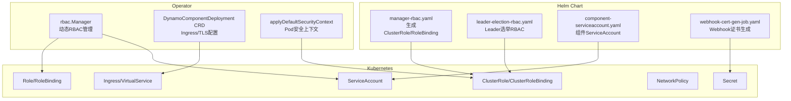
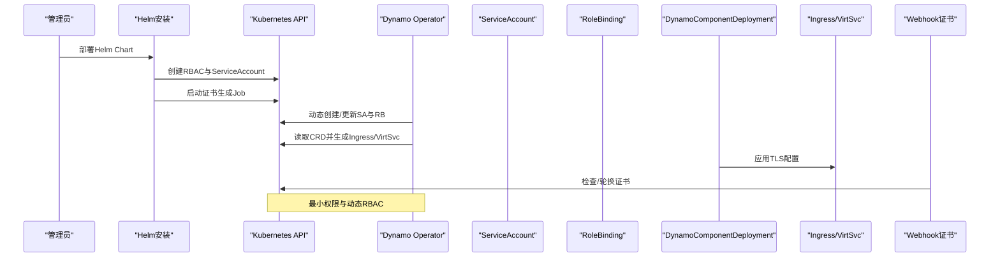
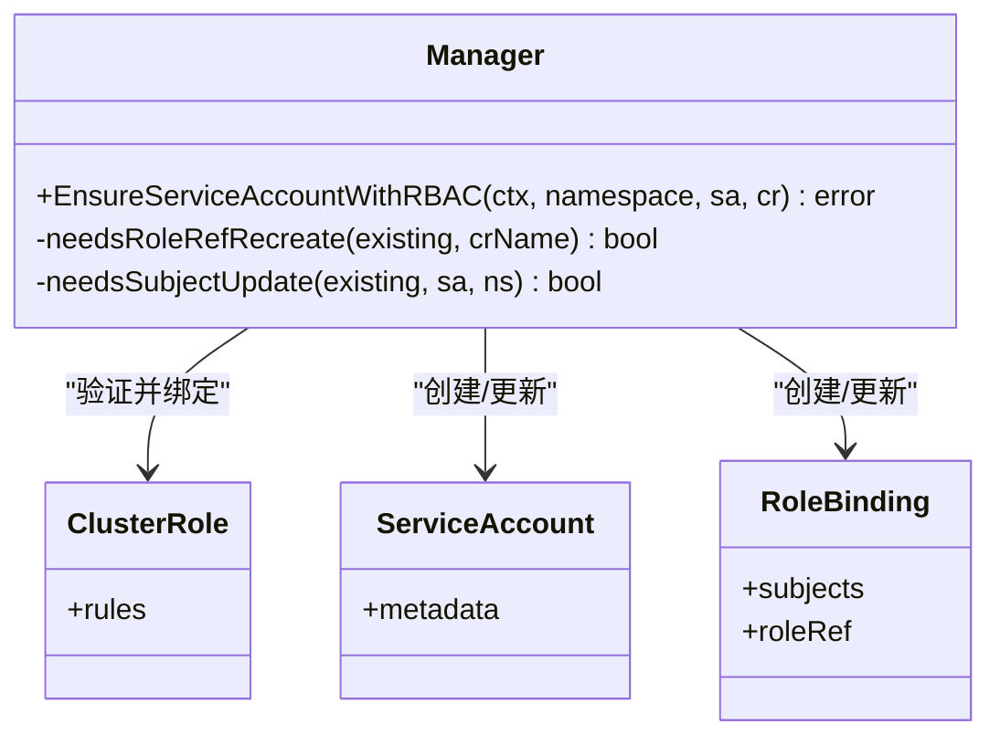
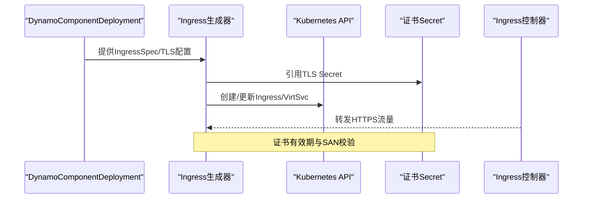
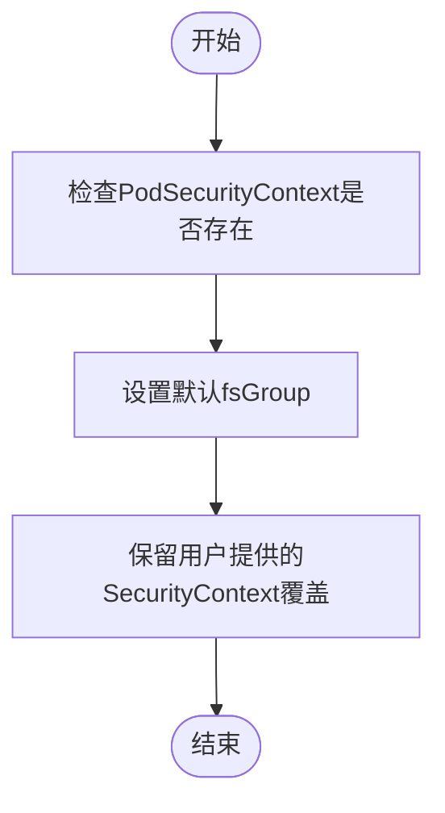
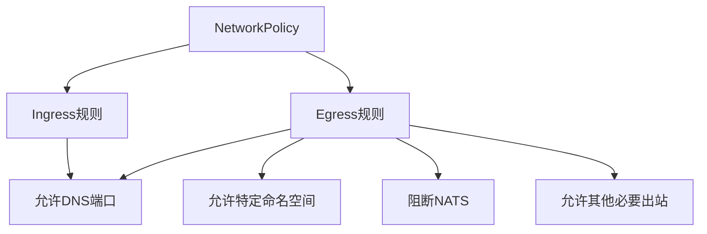
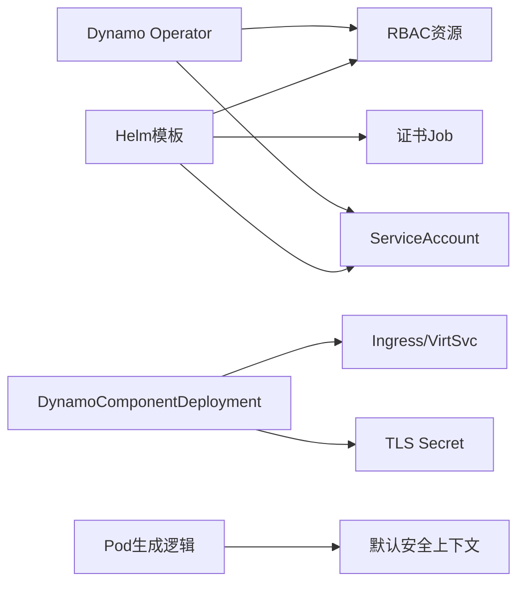

# 安全与网络配置

<cite>
**本文档引用的文件**
- [manager.go](file://deploy/operator/internal/rbac/manager.go)
- [manager_test.go](file://deploy/operator/internal/rbac/manager_test.go)
- [manager-rbac.yaml](file://deploy/helm/charts/platform/components/operator/templates/manager-rbac.yaml)
- [leader-election-rbac.yaml](file://deploy/helm/charts/platform/components/operator/templates/leader-election-rbac.yaml)
- [component-serviceaccount.yaml](file://deploy/helm/charts/platform/components/operator/templates/component-serviceaccount.yaml)
- [role.yaml](file://deploy/operator/config/rbac/role.yaml)
- [dynamocomponentdeployment_types.go](file://deploy/operator/api/v1alpha1/dynamocomponentdeployment_types.go)
- [webhook-cert-gen-job.yaml](file://deploy/helm/charts/platform/components/operator/templates/webhook-cert-gen-job.yaml)
- [graph.go](file://deploy/operator/internal/dynamo/graph.go)
- [main.py](file://tests/fault_tolerance/hardware/fault_injection_service/api_service/main.py)
</cite>

## 目录
1. [简介](#简介)
2. [项目结构](#项目结构)
3. [核心组件](#核心组件)
4. [架构总览](#架构总览)
5. [详细组件分析](#详细组件分析)
6. [依赖关系分析](#依赖关系分析)
7. [性能考虑](#性能考虑)
8. [故障排除指南](#故障排除指南)
9. [结论](#结论)

## 简介
本指南面向Dynamo生产环境，提供全面的安全与网络配置方案，涵盖RBAC权限管理、ServiceAccount配置、Pod安全上下文、网络策略、Ingress与服务网格集成、TLS证书管理、密钥与机密存储最佳实践，以及网络隔离、流量加密与访问控制策略。文档同时给出安全审计与合规性检查的配置建议，并通过可视化图示帮助读者快速理解各组件之间的交互关系。

## 项目结构
Dynamo在部署层面提供了Operator与Helm Chart，配合自定义资源类型（CRD）实现对推理组件的编排与安全配置。RBAC由Helm模板生成，运行时通过Operator动态管理ServiceAccount与RoleBinding；Ingress与服务网格通过CRD字段控制；TLS证书通过Job自动轮换；Pod安全上下文在生成逻辑中应用默认安全策略。

**图表来源**
- [manager-rbac.yaml](file://deploy/helm/charts/platform/components/operator/templates/manager-rbac.yaml#L15-L554)
- [leader-election-rbac.yaml](file://deploy/helm/charts/platform/components/operator/templates/leader-election-rbac.yaml#L15-L91)
- [component-serviceaccount.yaml](file://deploy/helm/charts/platform/components/operator/templates/component-serviceaccount.yaml#L15-L31)
- [manager.go](file://deploy/operator/internal/rbac/manager.go#L27-L208)
- [dynamocomponentdeployment_types.go](file://deploy/operator/api/v1alpha1/dynamocomponentdeployment_types.go#L144-L170)
- [graph.go](file://deploy/operator/internal/dynamo/graph.go#L865-L882)

**章节来源**
- [manager-rbac.yaml](file://deploy/helm/charts/platform/components/operator/templates/manager-rbac.yaml#L15-L554)
- [leader-election-rbac.yaml](file://deploy/helm/charts/platform/components/operator/templates/leader-election-rbac.yaml#L15-L91)
- [component-serviceaccount.yaml](file://deploy/helm/charts/platform/components/operator/templates/component-serviceaccount.yaml#L15-L31)
- [manager.go](file://deploy/operator/internal/rbac/manager.go#L27-L208)
- [dynamocomponentdeployment_types.go](file://deploy/operator/api/v1alpha1/dynamocomponentdeployment_types.go#L144-L170)
- [graph.go](file://deploy/operator/internal/dynamo/graph.go#L865-L882)

## 核心组件
- RBAC与ServiceAccount：Helm模板生成Operator所需RBAC；Operator在集群范围内动态为命名空间创建ServiceAccount与绑定，确保最小权限原则。
- Ingress与服务网格：通过CRD中的IngressSpec与TLS字段控制对外暴露方式与证书来源。
- TLS证书：Helm Job负责证书生成与轮换，校验SAN与有效期。
- Pod安全上下文：默认设置fsGroup以解决卷权限问题，避免强制UID/GID破坏兼容性。
- 网络策略：测试代码展示了如何构建NetworkPolicy的入站/出站规则，可作为生产参考。

**章节来源**
- [manager.go](file://deploy/operator/internal/rbac/manager.go#L68-L208)
- [manager-rbac.yaml](file://deploy/helm/charts/platform/components/operator/templates/manager-rbac.yaml#L15-L554)
- [leader-election-rbac.yaml](file://deploy/helm/charts/platform/components/operator/templates/leader-election-rbac.yaml#L15-L91)
- [component-serviceaccount.yaml](file://deploy/helm/charts/platform/components/operator/templates/component-serviceaccount.yaml#L15-L31)
- [dynamocomponentdeployment_types.go](file://deploy/operator/api/v1alpha1/dynamocomponentdeployment_types.go#L144-L170)
- [webhook-cert-gen-job.yaml](file://deploy/helm/charts/platform/components/operator/templates/webhook-cert-gen-job.yaml#L160-L265)
- [graph.go](file://deploy/operator/internal/dynamo/graph.go#L865-L882)
- [main.py](file://tests/fault_tolerance/hardware/fault_injection_service/api_service/main.py#L685-L717)

## 架构总览
下图展示Dynamo生产环境安全与网络配置的关键交互路径：Helm安装RBAC与ServiceAccount，Operator动态管理RBAC，Ingress/服务网格与TLS配置由CRD驱动，证书由Job管理，Pod安全上下文在生成阶段应用。

**图表来源**
- [manager-rbac.yaml](file://deploy/helm/charts/platform/components/operator/templates/manager-rbac.yaml#L15-L554)
- [component-serviceaccount.yaml](file://deploy/helm/charts/platform/components/operator/templates/component-serviceaccount.yaml#L15-L31)
- [manager.go](file://deploy/operator/internal/rbac/manager.go#L68-L208)
- [dynamocomponentdeployment_types.go](file://deploy/operator/api/v1alpha1/dynamocomponentdeployment_types.go#L144-L170)
- [webhook-cert-gen-job.yaml](file://deploy/helm/charts/platform/components/operator/templates/webhook-cert-gen-job.yaml#L160-L265)

## 详细组件分析

### RBAC权限管理与ServiceAccount配置
- Helm模板生成管理器RBAC与Leader选举RBAC，支持命名空间限制模式与集群范围模式，分别使用Role/ClusterRole与RoleBinding/ClusterRoleBinding。
- Operator在集群模式下动态为每个目标命名空间创建ServiceAccount与RoleBinding，绑定到已存在的ClusterRole，确保最小权限与按需授权。
- 测试覆盖了多命名空间、资源存在性、Subject与RoleRef一致性等场景，保障RBAC的幂等与正确性。

**图表来源**
- [manager.go](file://deploy/operator/internal/rbac/manager.go#L27-L208)
- [manager_test.go](file://deploy/operator/internal/rbac/manager_test.go#L316-L365)

**章节来源**
- [manager.go](file://deploy/operator/internal/rbac/manager.go#L68-L208)
- [manager_test.go](file://deploy/operator/internal/rbac/manager_test.go#L316-L365)
- [manager-rbac.yaml](file://deploy/helm/charts/platform/components/operator/templates/manager-rbac.yaml#L15-L554)
- [leader-election-rbac.yaml](file://deploy/helm/charts/platform/components/operator/templates/leader-election-rbac.yaml#L15-L91)
- [component-serviceaccount.yaml](file://deploy/helm/charts/platform/components/operator/templates/component-serviceaccount.yaml#L15-L31)

### Ingress控制器与TLS证书管理
- CRD提供IngressSpec与IngressTLSSpec，支持标准Ingress与Istio VirtualService两种出口方式，可通过注解与标签定制。
- TLS证书由Helm Job负责生成与轮换，检查有效期与SAN是否匹配服务名称，避免过期或SAN不一致导致的连接失败。
- 建议在生产中为Ingress配置专用Secret，并启用HTTP/2与TLS 1.3，结合HSTS与OCSP Stapling提升安全性。

**图表来源**
- [dynamocomponentdeployment_types.go](file://deploy/operator/api/v1alpha1/dynamocomponentdeployment_types.go#L144-L170)
- [webhook-cert-gen-job.yaml](file://deploy/helm/charts/platform/components/operator/templates/webhook-cert-gen-job.yaml#L160-L265)

**章节来源**
- [dynamocomponentdeployment_types.go](file://deploy/operator/api/v1alpha1/dynamocomponentdeployment_types.go#L144-L170)
- [webhook-cert-gen-job.yaml](file://deploy/helm/charts/platform/components/operator/templates/webhook-cert-gen-job.yaml#L160-L265)

### Pod安全上下文与容器安全
- 默认设置fsGroup以解决卷权限问题，保持与镜像可能需要root的兼容性，避免强制runAsNonRoot影响现有部署。
- CRD与生成逻辑中可进一步细化SecurityContext，如seccomp、SELinux、capabilities等，结合PSP替代方案（如PodSecurity Admission）进行强化。

**图表来源**
- [graph.go](file://deploy/operator/internal/dynamo/graph.go#L865-L882)

**章节来源**
- [graph.go](file://deploy/operator/internal/dynamo/graph.go#L865-L882)

### 网络策略与流量控制
- 可基于NetworkPolicy实现网络隔离与最小权限放行，建议默认拒绝所有入站/出站，仅允许必要的DNS、服务间通信与外部访问。
- 测试代码展示了如何根据配置构建Egress与Ingress规则，包括DNS放行、特定命名空间与Pod放行、NATS阻断等，可直接用于生产网络隔离策略。

**图表来源**
- [main.py](file://tests/fault_tolerance/hardware/fault_injection_service/api_service/main.py#L685-L717)

**章节来源**
- [main.py](file://tests/fault_tolerance/hardware/fault_injection_service/api_service/main.py#L685-L717)

### 密钥管理、机密存储与敏感信息保护
- 使用Kubernetes Secret存储TLS证书、镜像仓库凭据等敏感信息，配合ServiceAccount的imagePullSecrets实现私有镜像拉取安全。
- 建议启用KMS插件加密Secret，定期轮换证书与密钥，限制Secret访问范围至最小必要命名空间与角色。

**章节来源**
- [component-serviceaccount.yaml](file://deploy/helm/charts/platform/components/operator/templates/component-serviceaccount.yaml#L27-L30)

## 依赖关系分析
- Helm模板与Operator共同完成RBAC与ServiceAccount的生命周期管理，确保集群模式下的动态授权。
- CRD驱动Ingress/VirtSvc与TLS配置，证书由Job保障有效性。
- Pod安全上下文在生成阶段应用默认策略，避免破坏镜像兼容性。

**图表来源**
- [manager-rbac.yaml](file://deploy/helm/charts/platform/components/operator/templates/manager-rbac.yaml#L15-L554)
- [component-serviceaccount.yaml](file://deploy/helm/charts/platform/components/operator/templates/component-serviceaccount.yaml#L15-L31)
- [webhook-cert-gen-job.yaml](file://deploy/helm/charts/platform/components/operator/templates/webhook-cert-gen-job.yaml#L160-L265)
- [manager.go](file://deploy/operator/internal/rbac/manager.go#L68-L208)
- [dynamocomponentdeployment_types.go](file://deploy/operator/api/v1alpha1/dynamocomponentdeployment_types.go#L144-L170)
- [graph.go](file://deploy/operator/internal/dynamo/graph.go#L865-L882)

**章节来源**
- [manager.go](file://deploy/operator/internal/rbac/manager.go#L68-L208)
- [dynamocomponentdeployment_types.go](file://deploy/operator/api/v1alpha1/dynamocomponentdeployment_types.go#L144-L170)
- [graph.go](file://deploy/operator/internal/dynamo/graph.go#L865-L882)

## 性能考虑
- RBAC动态创建应避免频繁变更，建议在部署阶段集中完成，运行时通过更新策略减少API调用开销。
- Ingress控制器选择与后端Pod数量匹配，合理设置探针与副本数，避免健康检查风暴。
- 证书轮换应避开业务高峰期，采用滚动更新策略降低中断风险。

## 故障排除指南
- RBAC相关
  - 若出现“ClusterRole不存在”，请确认Helm已创建ClusterRole后再部署组件。
  - 若RoleBinding的RoleRef不可变错误，需删除并重建RoleBinding以更新引用。
  - 多命名空间场景下，确认每个命名空间均存在对应的ServiceAccount与RoleBinding。
- Ingress/TLS
  - TLS证书过期或SAN不匹配会导致连接失败，检查证书Secret与Ingress注解。
  - 如使用Istio，确认VirtualService网关与路由规则正确。
- 网络策略
  - 默认拒绝策略下，需显式添加DNS与服务间通信规则，否则会出现解析失败或跨服务访问异常。
- Pod安全
  - 若出现卷权限问题，检查fsGroup设置与PVC挂载权限；如需root运行，请评估兼容性与风险。

**章节来源**
- [manager.go](file://deploy/operator/internal/rbac/manager.go#L86-L96)
- [manager_test.go](file://deploy/operator/internal/rbac/manager_test.go#L821-L902)
- [webhook-cert-gen-job.yaml](file://deploy/helm/charts/platform/components/operator/templates/webhook-cert-gen-job.yaml#L160-L182)
- [main.py](file://tests/fault_tolerance/hardware/fault_injection_service/api_service/main.py#L685-L717)

## 结论
通过Helm与Operator协同实现的RBAC动态管理、严格的ServiceAccount与最小权限模型、灵活的Ingress与服务网格出口、自动化TLS证书轮换以及默认安全的Pod上下文设置，Dynamo能够在生产环境中实现高可用、强安全与良好可观测性的统一。建议结合企业级网络策略与密钥管理流程，持续进行安全审计与合规性检查，确保系统长期稳定运行。