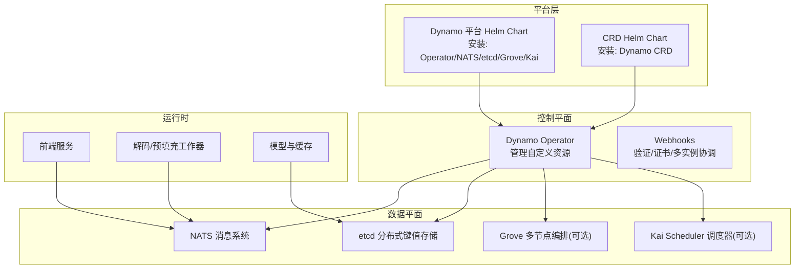
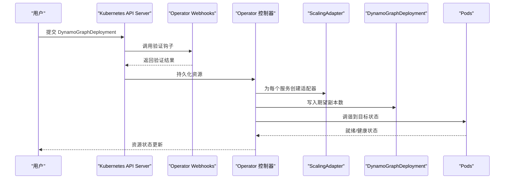
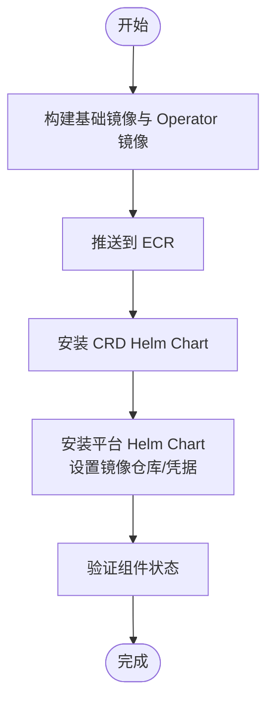
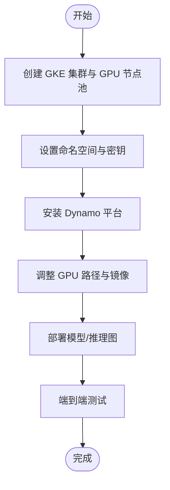
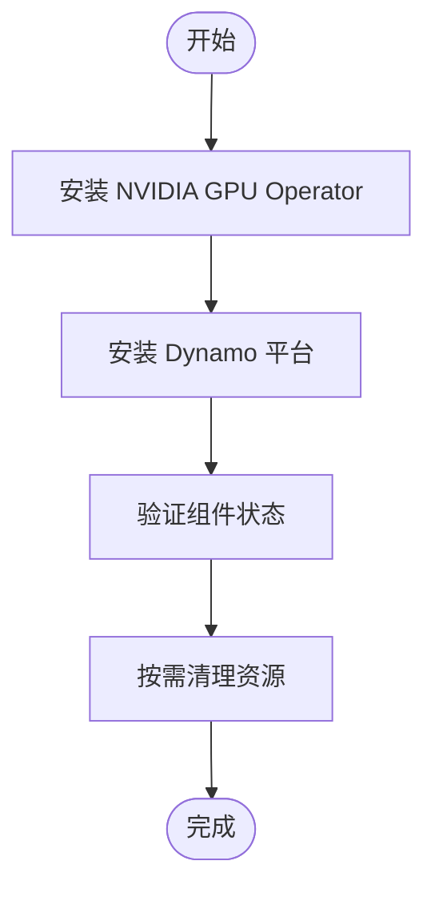
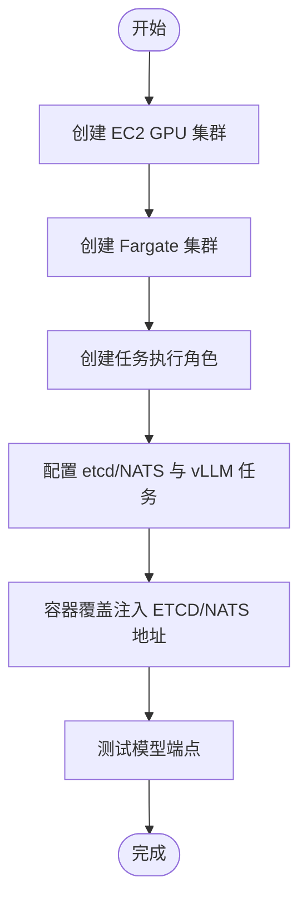
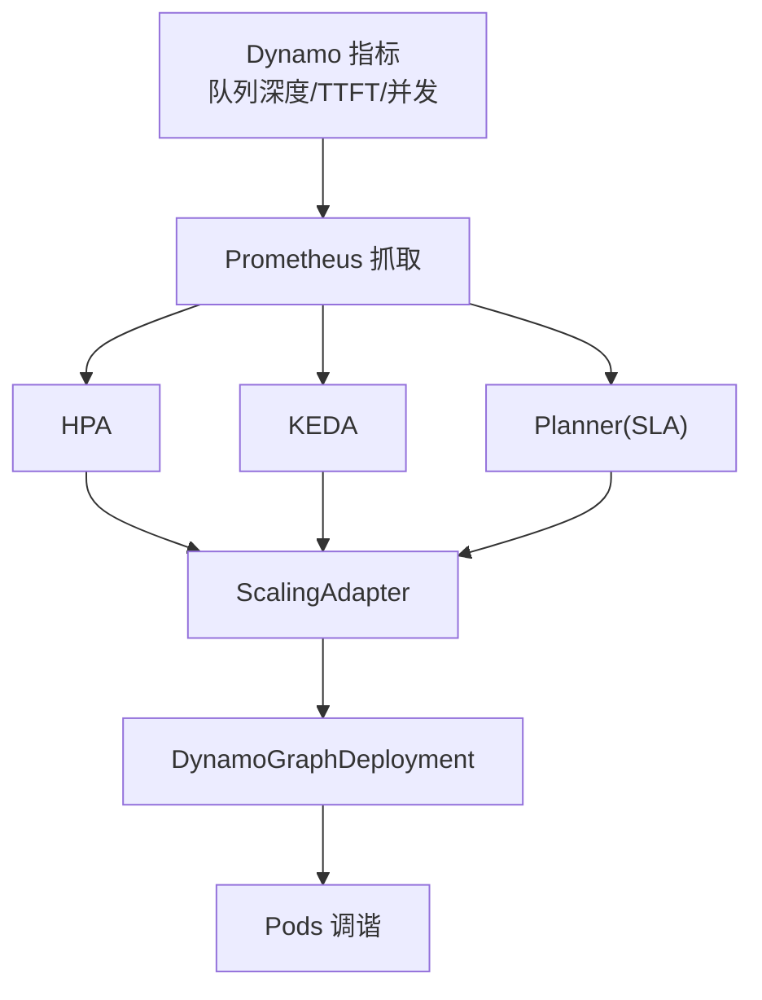
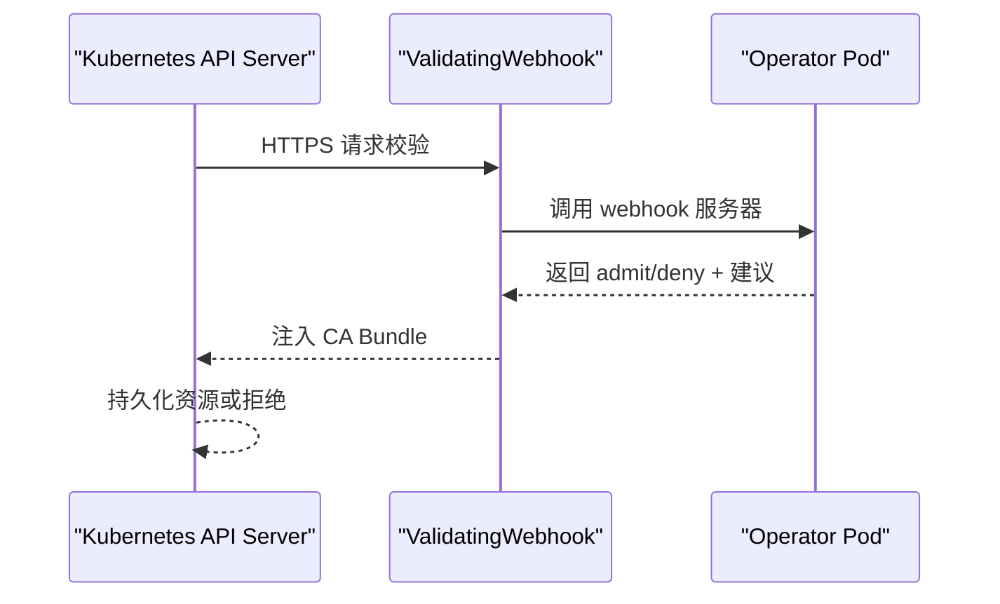
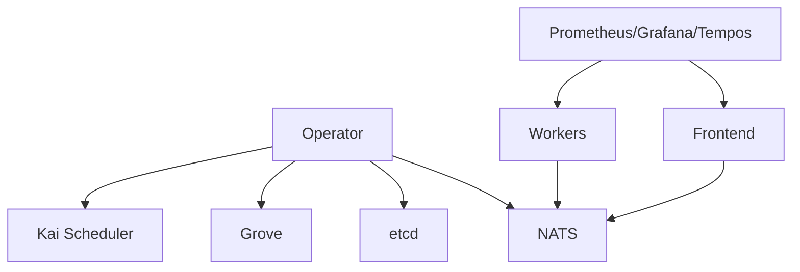

# 生产环境部署

<cite>
**本文档引用的文件**
- [安装指南](file://docs/kubernetes/installation_guide.md)
- [自动扩缩容](file://docs/kubernetes/autoscaling.md)
- [服务发现](file://docs/kubernetes/service_discovery.md)
- [Webhooks](file://docs/kubernetes/webhooks.md)
- [预部署检查脚本](file://deploy/pre-deployment/pre-deployment-check.sh)
- [Dynamo 平台 Helm 图表](file://deploy/helm/charts/platform/README.md)
- [CRD Helm 图表](file://deploy/helm/charts/crds/README.md)
- [EKS 部署示例](file://examples/deployments/EKS/Deploy_Dynamo_Kubernetes_Platform.md)
- [AKS 部署示例](file://examples/deployments/AKS/AKS-deployment.md)
- [GKE 部署示例](file://examples/deployments/GKE/README.md)
- [ECS 部署示例](file://examples/deployments/ECS/README.md)
- [容器镜像构建](file://container/Dockerfile)
- [观测性概览](file://docs/observability/README.md)
- [Dynamo 运行时入口点](file://container/launch_message/runtime.txt)
- [Dynamo 前端入口点](file://container/launch_message/frontend.txt)
</cite>

## 目录
1. [简介](#简介)
2. [项目结构](#项目结构)
3. [核心组件](#核心组件)
4. [架构总览](#架构总览)
5. [详细组件分析](#详细组件分析)
6. [依赖关系分析](#依赖关系分析)
7. [性能考虑](#性能考虑)
8. [故障排查指南](#故障排查指南)
9. [结论](#结论)
10. [附录](#附录)

## 简介
本指南面向在生产环境中部署 Dynamo 的工程团队，覆盖 AWS EKS、Google GKE、Azure AKS、Amazon ECS 四大云平台的部署配置与最佳实践。内容包括高可用架构设计、负载均衡与自动扩缩容、故障转移策略、安全配置与访问控制、监控告警与日志收集、资源规划与成本优化、性能调优以及灾难恢复与备份方案。

## 项目结构
Dynamo 采用 Helm Chart 与 Kubernetes Operator 组合的方式进行平台化部署，核心由以下部分组成：
- 平台 Helm Chart：一键安装 Operator、NATS、etcd、可选的 Grove/Kai 调度器等基础设施组件
- CRD Helm Chart：安装 Dynamo 自定义资源定义，供 Operator 与用户工作负载使用
- Operator：基于 Kubebuilder 构建，负责管理 DynamoGraphDeployment、DynamoComponentDeployment 等资源
- 预部署检查脚本：验证集群连接、默认存储类、GPU 节点与 GPU Operator 状态
- 各云平台部署示例：EKS、GKE、AKS、ECS 的具体操作步骤与注意事项

图表来源
- [Dynamo 平台 Helm 图表](file://deploy/helm/charts/platform/README.md#L24-L33)
- [CRD Helm 图表](file://deploy/helm/charts/crds/README.md#L18-L20)

章节来源
- [Dynamo 平台 Helm 图表](file://deploy/helm/charts/platform/README.md#L24-L33)
- [CRD Helm 图表](file://deploy/helm/charts/crds/README.md#L18-L20)

## 核心组件
- Dynamo Operator：负责 CRD 的生命周期管理、资源校验、服务发现元数据注入、健康检查与就绪探针配置
- NATS：组件间通信的消息总线，支持高吞吐与低延迟
- etcd：持久化状态与配置中心，用于 Operator 协调与元数据存储
- Grove/Kai：可选的多节点推理编排与智能调度组件
- 预部署检查脚本：确保集群具备默认存储类、GPU 节点与 GPU Operator

章节来源
- [安装指南](file://docs/kubernetes/installation_guide.md#L133-L206)
- [Dynamo 平台 Helm 图表](file://deploy/helm/charts/platform/README.md#L26-L33)

## 架构总览
Dynamo 在 Kubernetes 上通过 Helm Chart 一次性部署平台组件，并通过 Operator 管理业务工作负载。Operator 会为每个 DynamoGraphDeployment 创建 ScalingAdapter，配合 HPA/KEDA/Planner 实现事件驱动与 SLA 驱动的自动扩缩容；服务发现通过 Kubernetes EndpointSlices 与 DynamoWorkerMetadata CRD 实现。

图表来源
- [Webhooks](file://docs/kubernetes/webhooks.md#L49-L71)
- [自动扩缩容](file://docs/kubernetes/autoscaling.md#L51-L79)

章节来源
- [Webhooks](file://docs/kubernetes/webhooks.md#L49-L71)
- [自动扩缩容](file://docs/kubernetes/autoscaling.md#L51-L79)

## 详细组件分析

### AWS EKS 部署
- 镜像与仓库
  - 使用 ECR 私有仓库，构建后推送到 ECR
  - 为 Operator 与平台组件构建专用镜像并推送
- 安装平台
  - 先安装 CRD，再安装平台 Helm Chart
  - 通过命名空间隔离与镜像拉取密钥保障安全
- 验证
  - 检查 Operator、NATS、etcd 等核心组件状态

图表来源
- [EKS 部署示例](file://examples/deployments/EKS/Deploy_Dynamo_Kubernetes_Platform.md#L3-L84)

章节来源
- [EKS 部署示例](file://examples/deployments/EKS/Deploy_Dynamo_Kubernetes_Platform.md#L3-L84)

### Google GKE 部署
- 集群准备
  - 创建带 GPU 节点池的 GKE 集群，启用 GPU 自动化
- 安装平台
  - 设置命名空间与 HuggingFace 访问令牌密钥
  - 通过官方文档指引安装平台
- 模型部署
  - 针对 GKE 调整 GPU 驱动路径与镜像来源
  - 使用示例 YAML 部署解耦式推理图

图表来源
- [GKE 部署示例](file://examples/deployments/GKE/README.md#L8-L155)

章节来源
- [GKE 部署示例](file://examples/deployments/GKE/README.md#L8-L155)

### Azure AKS 部署
- GPU Operator
  - 在 AKS 集群上安装 NVIDIA GPU Operator，避免重复安装驱动
- 平台安装
  - 参考 Kubernetes 平台安装指南部署 Dynamo
- 验证与清理
  - 验证核心组件状态，按需卸载 Operator 与集群

图表来源
- [AKS 部署示例](file://examples/deployments/AKS/AKS-deployment.md#L22-L79)

章节来源
- [AKS 部署示例](file://examples/deployments/AKS/AKS-deployment.md#L22-L79)

### Amazon ECS 部署
- 集群与任务
  - EC2 集群承载 vLLM 工作负载，Fargate 集群承载 etcd/NATS
  - 为任务定义创建执行角色并配置网络与安全组
- 任务配置
  - etcd/NATS 作为必需容器，前端/解码/预填充工作器分别配置资源与环境变量
  - 通过容器覆盖注入 ETCD/NATS 地址
- 测试
  - 获取前端任务公网 IP，调用模型端点进行验证

图表来源
- [ECS 部署示例](file://examples/deployments/ECS/README.md#L1-L129)

章节来源
- [ECS 部署示例](file://examples/deployments/ECS/README.md#L1-L129)

### 高可用架构设计
- 多可用区部署：在 EKS/GKE/AKS 中跨 AZ 部署节点池，避免单点故障
- 多副本组件：Operator、NATS、etcd 至少 3 副本，结合就绪/存活探针
- 多租户隔离：通过命名空间限制与 Operator 命名空间限制模式实现
- 服务发现：Kubernetes EndpointSlices + DynamoWorkerMetadata CRD，确保组件健康可见

章节来源
- [服务发现](file://docs/kubernetes/service_discovery.md#L29-L97)
- [Dynamo 平台 Helm 图表](file://deploy/helm/charts/platform/README.md#L41-L82)

### 负载均衡与自动扩缩容
- 负载均衡
  - 前端服务暴露 HTTP 端口，结合 Ingress/Istio 网关实现外部访问
  - 通过 Prometheus/Helm Chart 配置指标端点
- 自动扩缩容
  - HPA：基于 CPU/内存或自定义指标（如 TTFT、队列深度）
  - KEDA：Prometheus 触发器，支持事件驱动与零副本能力
  - Planner：LLM 专用调度器，依据 SLA 与性能指标动态扩容

图表来源
- [自动扩缩容](file://docs/kubernetes/autoscaling.md#L175-L530)

章节来源
- [自动扩缩容](file://docs/kubernetes/autoscaling.md#L175-L530)

### 故障转移与灾难恢复
- 故障转移
  - 通过 HPA/KEDA/Planner 动态迁移请求，结合健康探针与就绪策略
  - 多副本 NATS/etcd 保障控制面高可用
- 灾难恢复
  - 定期备份 etcd 数据与 CRD 资源清单
  - 使用 Helm Chart 快速重建平台组件
  - 结合存储快照与对象存储归档实现长期备份

章节来源
- [安装指南](file://docs/kubernetes/installation_guide.md#L351-L386)

### 安全配置与访问控制
- Webhooks
  - 默认启用验证钩子，失败策略建议使用 Fail，确保严格校验
  - 支持自动/证书管理器/外部证书三种模式，生产推荐 cert-manager
- 多实例协调
  - 集群级与命名空间受限 Operator 通过 Lease 协同，避免冲突
- 凭据与密钥
  - 使用 Kubernetes Secret 管理镜像仓库与 HuggingFace 访问令牌
  - 仅授予最小权限的 ServiceAccount

图表来源
- [Webhooks](file://docs/kubernetes/webhooks.md#L49-L71)

章节来源
- [Webhooks](file://docs/kubernetes/webhooks.md#L83-L100)
- [Webhooks](file://docs/kubernetes/webhooks.md#L194-L240)
- [Webhooks](file://docs/kubernetes/webhooks.md#L243-L294)

### 监控告警与日志收集
- 本地开发栈
  - Docker Compose 提供 Prometheus、Grafana、Tempo、DCGM Exporter、NATS Exporter
- Kubernetes
  - 通过 Helm Chart 配置 Prometheus 抓取与 Grafana 仪表盘
  - 支持结构化日志与 OpenTelemetry Tracing
- 指标与告警
  - Dynamo 前端指标（队列深度、并发、TTFT、ITL）可用于 HPA/KEDA/Planner
  - 结合告警规则与通知渠道实现自动化运维

章节来源
- [观测性概览](file://docs/observability/README.md#L19-L34)
- [观测性概览](file://docs/observability/README.md#L61-L84)

### 资源规划与成本优化
- 节点池规划
  - GPU 节点池按机型与显存规格划分，结合自动伸缩策略
- 存储与网络
  - 使用默认存储类与卷快照，避免不必要的 IOPS 开销
  - Ingress/Istio 网关统一入口，减少暴露面
- 镜像与构建
  - 使用多阶段构建与缓存，减少镜像体积与拉取时间
  - 通过 SCCACHE 优化 Rust/CMake 编译速度

章节来源
- [容器镜像构建](file://container/Dockerfile#L1-L655)

### 性能调优
- 指标导向
  - 以 TTFT、ITL、队列深度为核心指标，结合 Planner/HPA/KEDA 调参
- 资源配额
  - 为前端/解码/预填充服务设置合理的 CPU/GPU 资源请求与限制
- 网络与 RDMA
  - 在支持的平台上启用 UCX/Libfabric，提升多节点通信性能

章节来源
- [自动扩缩容](file://docs/kubernetes/autoscaling.md#L624-L667)

## 依赖关系分析
- 组件耦合
  - Operator 依赖 NATS/etcd 提供控制面能力
  - 业务工作负载依赖服务发现与健康探针
- 外部依赖
  - 云厂商 GPU Operator（GKE/AKS）、ECS 执行角色（ECS）
  - Prometheus/Grafana/Tempos（观测性）

图表来源
- [Dynamo 平台 Helm 图表](file://deploy/helm/charts/platform/README.md#L26-L33)
- [观测性概览](file://docs/observability/README.md#L61-L84)

章节来源
- [Dynamo 平台 Helm 图表](file://deploy/helm/charts/platform/README.md#L26-L33)
- [观测性概览](file://docs/observability/README.md#L61-L84)

## 性能考虑
- 指标优先：优先使用 Dynamo 原生指标（队列深度、TTFT、ITL）指导扩缩容
- 稳定窗口：为 HPA/KEDA 配置合理的稳定窗口，避免抖动
- 最小权限：仅暴露必要端口，使用网络策略限制访问
- 成本控制：结合自动伸缩与 Spot 实例（云平台支持时），平衡性能与成本

## 故障排查指南
- 预部署检查
  - 使用脚本检查 kubectl 连接、默认存储类、GPU 节点与 GPU Operator 状态
- Webhook 排障
  - 检查 ValidatingWebhookConfiguration、证书注入、Operator 日志
- 平台卸载
  - 通过 Helm 卸载平台与 CRD，清理残留资源

章节来源
- [预部署检查脚本](file://deploy/pre-deployment/pre-deployment-check.sh#L41-L177)
- [Webhooks](file://docs/kubernetes/webhooks.md#L444-L489)
- [安装指南](file://docs/kubernetes/installation_guide.md#L351-L386)

## 结论
通过 Helm Chart 与 Operator 的组合，Dynamo 能够在多云环境中实现一致的生产级部署体验。结合事件驱动与 SLA 驱动的自动扩缩容、严格的 Webhooks 校验、完善的观测性体系与高可用架构，可在保证性能与成本的同时，满足企业级可靠性与安全性要求。

## 附录
- 入口点与运行时
  - 运行时入口点：/opt/nvidia/nvidia_entrypoint.sh
  - 前端入口点：/epp（Gateway API Inference Extension）
- 文档索引
  - 安装与升级：docs/kubernetes/installation_guide.md
  - 自动扩缩容：docs/kubernetes/autoscaling.md
  - 服务发现：docs/kubernetes/service_discovery.md
  - Webhooks：docs/kubernetes/webhooks.md
  - 观测性：docs/observability/README.md

章节来源
- [Dynamo 运行时入口点](file://container/launch_message/runtime.txt)
- [Dynamo 前端入口点](file://container/launch_message/frontend.txt)
- [安装指南](file://docs/kubernetes/installation_guide.md#L1-L386)
- [自动扩缩容](file://docs/kubernetes/autoscaling.md#L1-L732)
- [服务发现](file://docs/kubernetes/service_discovery.md#L1-L115)
- [Webhooks](file://docs/kubernetes/webhooks.md#L1-L699)
- [观测性概览](file://docs/observability/README.md#L1-L100)