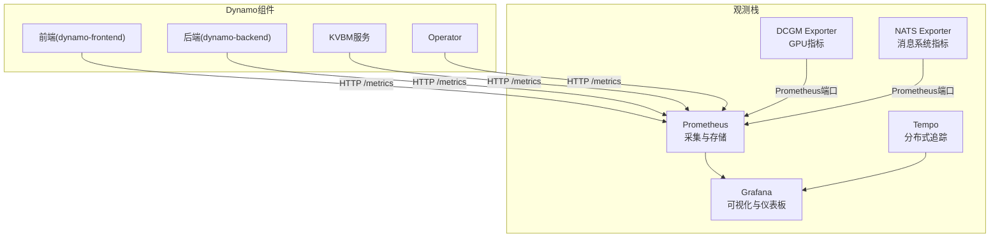
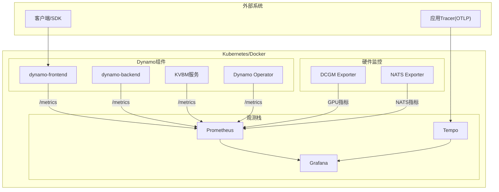
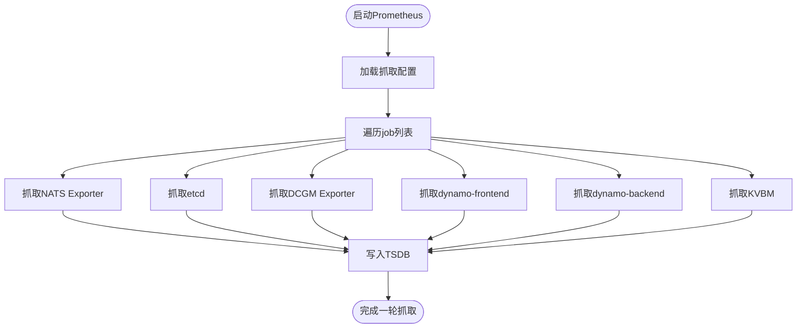
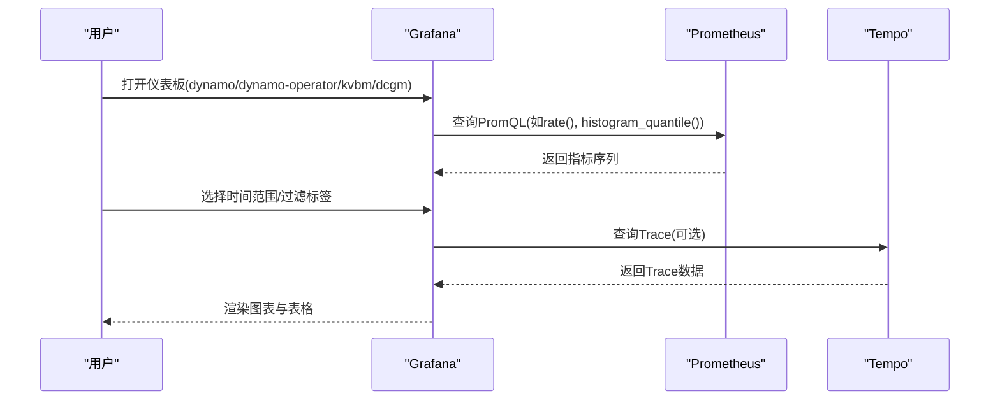
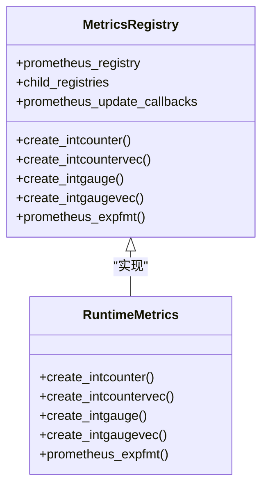
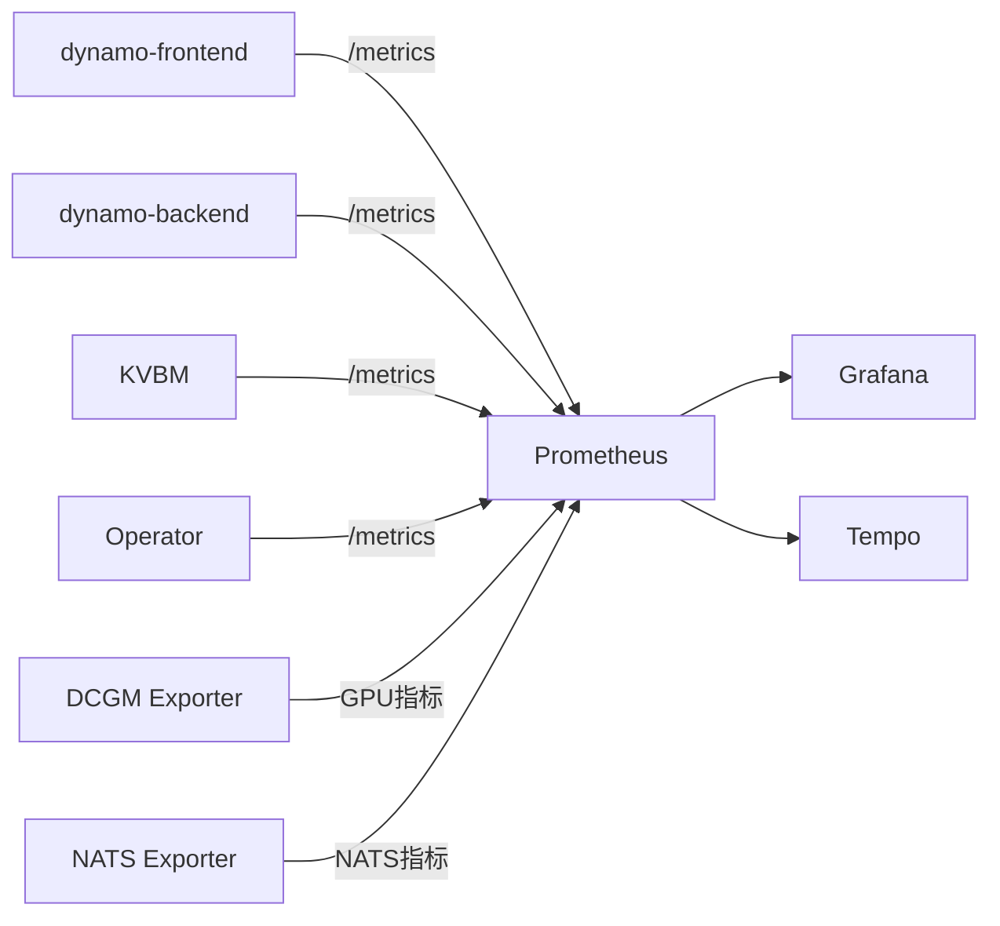

# 监控与告警

<cite>
**本文引用的文件**
- [deploy/observability/prometheus.yml](file://deploy/observability/prometheus.yml)
- [deploy/observability/grafana-datasources.yml](file://deploy/observability/grafana-datasources.yml)
- [deploy/observability/tempo-datasource.yml](file://deploy/observability/tempo-datasource.yml)
- [deploy/observability/grafana_dashboards/dashboard-providers.yml](file://deploy/observability/grafana_dashboards/dashboard-providers.yml)
- [deploy/observability/grafana_dashboards/dynamo.json](file://deploy/observability/grafana_dashboards/dynamo.json)
- [deploy/observability/grafana_dashboards/dynamo-operator.json](file://deploy/observability/grafana_dashboards/dynamo-operator.json)
- [deploy/observability/grafana_dashboards/kvbm.json](file://deploy/observability/grafana_dashboards/kvbm.json)
- [deploy/observability/grafana_dashboards/dcgm-metrics.json](file://deploy/observability/grafana_dashboards/dcgm-metrics.json)
- [deploy/docker-observability.yml](file://deploy/docker-observability.yml)
- [lib/runtime/src/metrics.rs](file://lib/runtime/src/metrics.rs)
- [deploy/operator/internal/controller/testing/prometheus/prometheusrule.yaml](file://deploy/operator/internal/controller/testing/prometheus/prometheusrule.yaml)
</cite>

## 目录
1. [简介](#简介)
2. [项目结构](#项目结构)
3. [核心组件](#核心组件)
4. [架构总览](#架构总览)
5. [详细组件分析](#详细组件分析)
6. [依赖关系分析](#依赖关系分析)
7. [性能考量](#性能考量)
8. [故障排查指南](#故障排查指南)
9. [结论](#结论)
10. [附录](#附录)

## 简介
本指南面向Dynamo生产环境，提供端到端的监控与告警配置方案，覆盖以下方面：
- Prometheus指标采集：服务端点暴露、采集器配置、指标命名与标签规范
- Grafana仪表板：内置面板与数据源配置、关键业务与硬件指标可视化
- 分布式追踪：Tempo后端与OTLP接收、Grafana Tempo数据源集成
- 告警规则：基于Prometheus Rule的告警规则定义与升级策略
- 自定义与业务指标：如何在运行时注册与导出自定义指标
- 日志聚合：建议的集中化日志采集与查询入口
- 容量规划与性能基线：指标选择、阈值设定与基线建立方法

## 项目结构
Dynamo的可观测性由一组容器编排文件与预置仪表板组成，核心包括：
- Prometheus：指标采集与持久化
- Grafana：可视化与仪表板
- Tempo：分布式追踪后端
- DCGM Exporter：GPU硬件指标导出
- NATS Exporter：消息系统指标导出

图表来源
- [deploy/docker-observability.yml](file://deploy/docker-observability.yml#L24-L84)
- [deploy/observability/prometheus.yml](file://deploy/observability/prometheus.yml#L20-L62)

章节来源
- [deploy/docker-observability.yml](file://deploy/docker-observability.yml#L10-L137)
- [deploy/observability/prometheus.yml](file://deploy/observability/prometheus.yml#L16-L62)

## 核心组件
- 指标采集器
  - DCGM Exporter：导出GPU利用率、温度、功耗等硬件指标
  - NATS Exporter：导出NATS服务器的连接、订阅、JetStream等指标
  - Prometheus：按job配置抓取上述目标，并持久化TSDB
- 可视化与仪表板
  - Grafana：作为统一入口，接入Prometheus与Tempo数据源
  - 预置仪表板：dynamo、dynamo-operator、kvbm、dcgm-metrics等
- 分布式追踪
  - Tempo：接收OTLP gRPC/HTTP，提供查询与服务图能力
- 运行时指标导出
  - 运行时通过统一的指标注册与导出接口，生成Prometheus文本格式

章节来源
- [deploy/observability/prometheus.yml](file://deploy/observability/prometheus.yml#L20-L62)
- [deploy/docker-observability.yml](file://deploy/docker-observability.yml#L24-L99)
- [lib/runtime/src/metrics.rs](file://lib/runtime/src/metrics.rs#L487-L538)

## 架构总览
下图展示生产环境典型部署：Prometheus从多个job抓取指标，Grafana消费Prometheus与Tempo；运行时组件在各自进程内暴露/metrics端点。

图表来源
- [deploy/docker-observability.yml](file://deploy/docker-observability.yml#L24-L99)
- [deploy/observability/prometheus.yml](file://deploy/observability/prometheus.yml#L20-L62)

## 详细组件分析

### Prometheus 指标采集配置
- 抓取间隔与评估周期
  - 全局抓取间隔与评估间隔已在配置中设定
- 关键job
  - nats-prometheus-exporter：抓取NATS服务器指标
  - etcd-server：抓取etcd健康与性能指标
  - dcgm-exporter：抓取GPU硬件指标
  - dynamo-frontend：抓取前端请求总量、延迟、吞吐等
  - dynamo-backend：抓取后端处理字节、延迟等
  - kvbm-metrics：抓取KVBM缓存命中与搬移速率
- 本地开发注意事项
  - 通过host.docker.internal映射宿主机端口，便于本地调试

图表来源
- [deploy/observability/prometheus.yml](file://deploy/observability/prometheus.yml#L16-L62)

章节来源
- [deploy/observability/prometheus.yml](file://deploy/observability/prometheus.yml#L16-L62)

### Grafana 数据源与仪表板
- 数据源
  - Prometheus数据源指向本地Prometheus实例
  - Tempo数据源指向本地Tempo实例
- 仪表板提供者
  - 从挂载目录读取JSON仪表板，支持热更新
- 预置仪表板
  - dynamo：前端请求、首Token时间、请求时延、序列长度、GPU利用率与功耗、组件字节数
  - dynamo-operator：Operator的重均衡速率、持续时间、错误率、Webhook状态、资源库存
  - kvbm：主机/磁盘缓存命中率、块搬移速率
  - dcgm-metrics：GPU利用率、显存使用、温度、功耗、时钟频率、引擎活动、PCIe带宽

图表来源
- [deploy/observability/grafana-datasources.yml](file://deploy/observability/grafana-datasources.yml#L18-L23)
- [deploy/observability/tempo-datasource.yml](file://deploy/observability/tempo-datasource.yml#L6-L27)
- [deploy/observability/grafana_dashboards/dashboard-providers.yml](file://deploy/observability/grafana_dashboards/dashboard-providers.yml#L18-L28)

章节来源
- [deploy/observability/grafana-datasources.yml](file://deploy/observability/grafana-datasources.yml#L18-L23)
- [deploy/observability/tempo-datasource.yml](file://deploy/observability/tempo-datasource.yml#L6-L27)
- [deploy/observability/grafana_dashboards/dashboard-providers.yml](file://deploy/observability/grafana_dashboards/dashboard-providers.yml#L18-L28)
- [deploy/observability/grafana_dashboards/dynamo.json](file://deploy/observability/grafana_dashboards/dynamo.json#L24-L120)
- [deploy/observability/grafana_dashboards/dynamo-operator.json](file://deploy/observability/grafana_dashboards/dynamo-operator.json#L24-L130)
- [deploy/observability/grafana_dashboards/kvbm.json](file://deploy/observability/grafana_dashboards/kvbm.json#L24-L140)
- [deploy/observability/grafana_dashboards/dcgm-metrics.json](file://deploy/observability/grafana_dashboards/dcgm-metrics.json#L24-L120)

### 分布式追踪与Tempo
- 接收协议
  - OTLP gRPC/HTTP，端口映射已配置
- Grafana集成
  - Tempo数据源启用搜索、服务图、节点图等特性
- 使用建议
  - 在应用侧以OTLP导出Span，结合Grafana TraceQL进行检索与关联

章节来源
- [deploy/docker-observability.yml](file://deploy/docker-observability.yml#L86-L99)
- [deploy/observability/tempo-datasource.yml](file://deploy/observability/tempo-datasource.yml#L14-L27)

### 运行时指标导出与自定义指标
- 指标注册与导出
  - 提供统一的指标创建函数，支持计数器、直方图、度量器等
  - 支持自动标签(namespace、component、endpoint)与常量标签
  - 通过/prometheus文本格式输出，供Prometheus抓取
- 自定义指标采集方法
  - 在业务代码中调用指标创建接口，注册到当前层级或子层级
  - 通过组合导出来合并子树指标，避免重复与冲突
- 业务指标建议
  - 请求总量/失败率、首Token/间隔Token延迟、请求时延分位、输入/输出序列长度
  - 组件间字节数、队列长度、并发请求数、重试/超时次数

图表来源
- [lib/runtime/src/metrics.rs](file://lib/runtime/src/metrics.rs#L487-L538)
- [lib/runtime/src/metrics.rs](file://lib/runtime/src/metrics.rs#L605-L722)

章节来源
- [lib/runtime/src/metrics.rs](file://lib/runtime/src/metrics.rs#L202-L235)
- [lib/runtime/src/metrics.rs](file://lib/runtime/src/metrics.rs#L487-L538)
- [lib/runtime/src/metrics.rs](file://lib/runtime/src/metrics.rs#L605-L722)

### 告警规则与升级策略
- 规则定义
  - Prometheus Rule支持规则组、告警表达式、持续时间、标签与注解
- 升级策略
  - 建议采用“先静默、再降级、最后熔断”的策略：首次触发静默，确认误报则降低阈值或调整窗口；若持续告警，考虑降级非关键路径或临时限流；极端情况下熔断对外接口
- 通知渠道
  - 结合Alertmanager与Grafana告警通道，支持Webhook、邮件、IM等
- 建议规则类型
  - CPU/内存/网络/存储使用率与饱和度
  - GPU利用率/温度/功耗阈值
  - NATS/etcd健康与延迟
  - KVBM命中率与搬移速率异常
  - Dynamo组件请求失败率、P95/P99延迟

章节来源
- [deploy/operator/internal/controller/testing/prometheus/prometheusrule.yaml](file://deploy/operator/internal/controller/testing/prometheus/prometheusrule.yaml#L53-L153)

## 依赖关系分析
- 组件耦合
  - Prometheus依赖各Exporter与组件/metrics端点
  - Grafana依赖Prometheus与Tempo数据源
  - 运行时指标通过统一注册表导出，避免跨层级冲突
- 外部依赖
  - DCGM Exporter需要GPU驱动与权限
  - NATS Exporter依赖NATS服务可达性
- 潜在环路
  - 无直接循环依赖，但需避免Prometheus对自身/metrics的抓取（示例配置已注释）

图表来源
- [deploy/observability/prometheus.yml](file://deploy/observability/prometheus.yml#L20-L62)
- [deploy/docker-observability.yml](file://deploy/docker-observability.yml#L24-L99)

章节来源
- [deploy/observability/prometheus.yml](file://deploy/observability/prometheus.yml#L20-L62)
- [deploy/docker-observability.yml](file://deploy/docker-observability.yml#L24-L99)

## 性能考量
- 抓取与存储
  - 合理设置抓取间隔，避免过密导致Prometheus压力过大
  - 对高频指标使用直方图/摘要并设置合理桶，控制Series数量
- 可视化
  - 仪表板默认最小刷新间隔可按需下调，但需平衡UI与后端负载
- 追踪
  - OTLP采样策略与批量大小需与链路深度匹配，避免追踪风暴
- GPU监控
  - DCGM Exporter端口需避免冲突，确保多节点唯一映射

## 故障排查指南
- Prometheus无法抓取
  - 检查目标可达性与端口映射
  - 校验抓取间隔与超时设置
- 指标缺失
  - 确认/metrics端点是否正确导出
  - 检查指标命名与标签是否符合预期
- Grafana无法访问
  - 检查数据源URL与凭据
  - 确认仪表板提供者配置与挂载目录
- 追踪不可见
  - 校验OTLP端口映射与应用侧导出配置
  - 使用TraceQL验证时间范围与过滤条件

章节来源
- [deploy/observability/prometheus.yml](file://deploy/observability/prometheus.yml#L16-L62)
- [deploy/observability/grafana-datasources.yml](file://deploy/observability/grafana-datasources.yml#L18-L23)
- [deploy/observability/tempo-datasource.yml](file://deploy/observability/tempo-datasource.yml#L6-L27)
- [deploy/docker-observability.yml](file://deploy/docker-observability.yml#L74-L99)

## 结论
通过上述配置，Dynamo生产环境具备完善的指标采集、可视化与分布式追踪能力。建议在上线前完成指标基线建立、阈值校准与告警演练，并持续优化抓取策略与仪表板细节，以保障系统稳定与可观测性。

## 附录

### 关键性能指标清单
- CPU/内存/网络/存储
  - 系统级使用率、饱和度、错误与丢包
- GPU
  - 利用率、温度、功耗、显存使用、时钟频率、引擎活动、PCIe带宽
- NATS/etcd
  - 连接数、订阅数、JetStream指标、健康状态
- KVBM
  - 主机/磁盘缓存命中率、块搬移速率
- Dynamo组件
  - 请求总量/失败率、首Token/间隔Token延迟、请求时延分位、输入/输出序列长度、组件字节数

章节来源
- [deploy/observability/grafana_dashboards/dcgm-metrics.json](file://deploy/observability/grafana_dashboards/dcgm-metrics.json#L108-L433)
- [deploy/observability/grafana_dashboards/dynamo.json](file://deploy/observability/grafana_dashboards/dynamo.json#L24-L502)
- [deploy/observability/grafana_dashboards/kvbm.json](file://deploy/observability/grafana_dashboards/kvbm.json#L24-L800)

### 告警阈值与升级策略建议
- 阈值设定
  - 基于历史基线与容量规划，设置安全水位与预警水位
- 升级策略
  - 静默→降级→熔断，配合通知渠道分级推送
- 规则示例
  - 延迟P95超过SLA、失败率突增、GPU温度接近上限、KVBM命中率骤降

章节来源
- [deploy/operator/internal/controller/testing/prometheus/prometheusrule.yaml](file://deploy/operator/internal/controller/testing/prometheus/prometheusrule.yaml#L53-L153)