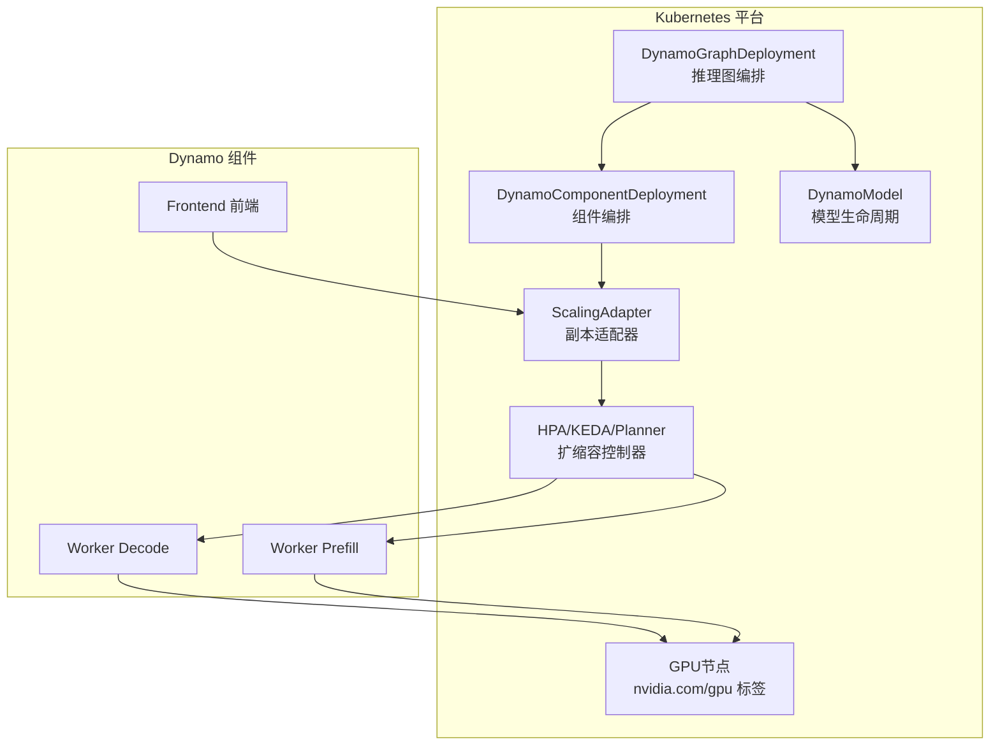
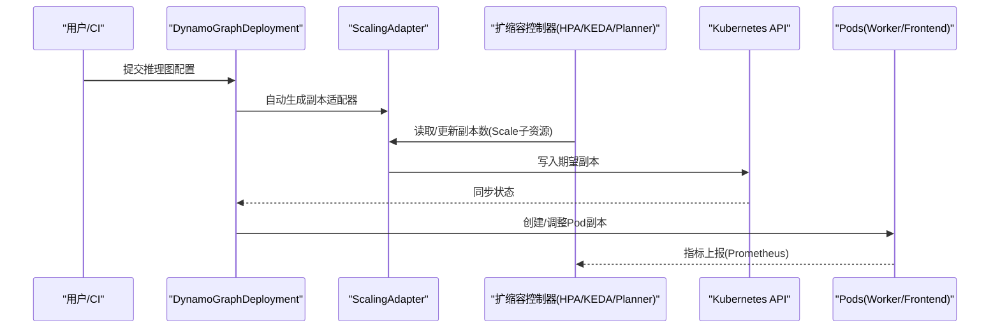
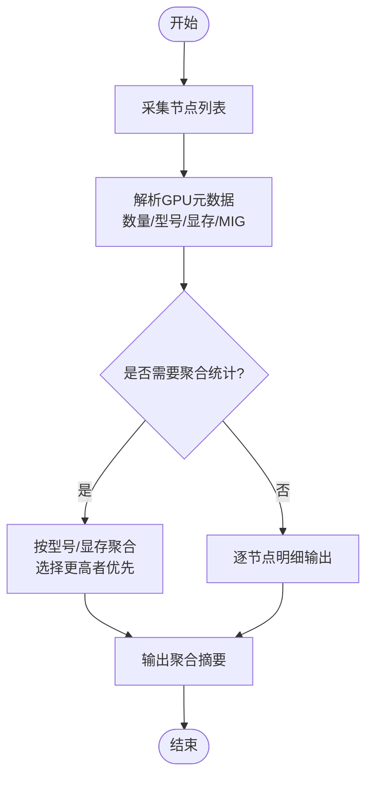
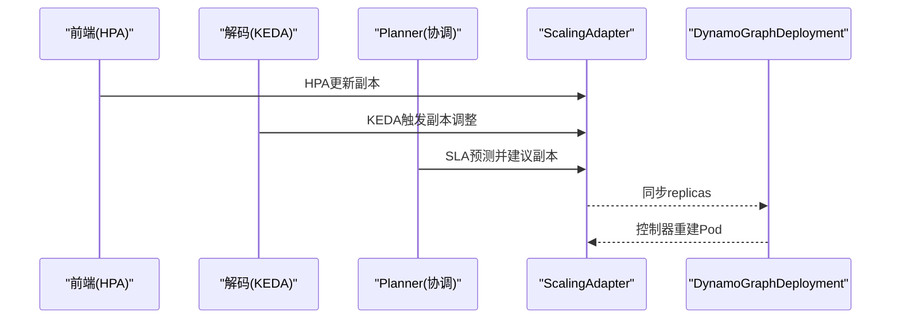
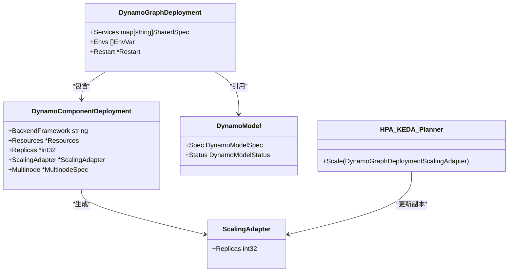

# 资源优化与成本控制

<cite>
**本文引用的文件**
- [README.md](file://README.md)
- [dynamo_model_types.go](file://deploy/operator/api/v1alpha1/dynamo_model_types.go)
- [dynamocomponentdeployment_types.go](file://deploy/operator/api/v1alpha1/dynamocomponentdeployment_types.go)
- [dynamographdeployment_types.go](file://deploy/operator/api/v1alpha1/dynamographdeployment_types.go)
- [autoscaling.md](file://docs/kubernetes/autoscaling.md)
- [gpu_inventory.py](file://deploy/utils/gpu_inventory.py)
- [dynamo_operator.md](file://docs/kubernetes/dynamo_operator.md)
- [metrics.md](file://docs/observability/metrics.md)
</cite>

## 目录
1. [简介](#简介)
2. [项目结构](#项目结构)
3. [核心组件](#核心组件)
4. [架构总览](#架构总览)
5. [详细组件分析](#详细组件分析)
6. [依赖关系分析](#依赖关系分析)
7. [性能与成本考量](#性能与成本考量)
8. [故障排查指南](#故障排查指南)
9. [结论](#结论)
10. [附录](#附录)

## 简介
本指南面向Dynamo生产环境，围绕“资源优化与成本控制”目标，系统阐述GPU实例类型选择、自动扩缩容策略、资源限制配置、成本分析与预算控制、资源利用率监控与瓶颈识别、性能调优、批量作业调度与资源抢占、预留实例策略、存储与网络优化、计算资源池化以及成本分摊与资源审计等主题。文档以仓库中的Operator CRD定义、自动扩缩容指南、GPU库存采集脚本与可观测性指标文档为基础，结合部署与运维最佳实践，形成可落地的生产级方案。

## 项目结构
Dynamo通过Kubernetes Operator管理推理图（Graph）与组件（Component），核心由以下几类文件支撑：
- 自定义资源定义（CRD）：描述DynamoGraphDeployment、DynamoComponentDeployment、DynamoModel等资源的期望状态与行为约束
- 自动扩缩容指南：定义如何通过ScalingAdapter与HPA/KEDA/Planner进行事件驱动与SLA驱动的弹性伸缩
- 运维工具：如GPU库存采集脚本，用于集群GPU盘点与型号/显存聚合统计
- 可观测性：前端与后端组件指标、标签体系与查询建议，支撑成本与性能分析

图表来源
- [dynamographdeployment_types.go](file://deploy/operator/api/v1alpha1/dynamographdeployment_types.go#L47-L69)
- [dynamocomponentdeployment_types.go](file://deploy/operator/api/v1alpha1/dynamocomponentdeployment_types.go#L39-L48)
- [dynamo_model_types.go](file://deploy/operator/api/v1alpha1/dynamo_model_types.go#L29-L49)
- [autoscaling.md](file://docs/kubernetes/autoscaling.md#L38-L79)

章节来源
- [README.md](file://README.md#L18-L51)
- [dynamographdeployment_types.go](file://deploy/operator/api/v1alpha1/dynamographdeployment_types.go#L47-L69)
- [dynamocomponentdeployment_types.go](file://deploy/operator/api/v1alpha1/dynamocomponentdeployment_types.go#L39-L48)
- [dynamo_model_types.go](file://deploy/operator/api/v1alpha1/dynamo_model_types.go#L29-L49)

## 核心组件
- DynamoGraphDeployment（DGD）：描述完整推理图的期望状态，包含服务集合、环境变量、重启策略等
- DynamoComponentDeployment（DCD）：描述单个组件的资源、副本数、探针、多节点拓扑、缩放适配器等
- DynamoModel（DM）：描述模型的标识、来源、就绪状态与端点发现
- ScalingAdapter（SA）：为每个服务自动生成，暴露Scale子资源，作为扩缩容控制器的统一入口
- 扩缩容控制器：HPA、KEDA、Planner，分别基于资源使用、外部指标或SLA驱动决策
- GPU库存采集工具：收集节点GPU数量、型号、显存与MIG能力，辅助机型选型与容量规划

章节来源
- [dynamographdeployment_types.go](file://deploy/operator/api/v1alpha1/dynamographdeployment_types.go#L47-L69)
- [dynamocomponentdeployment_types.go](file://deploy/operator/api/v1alpha1/dynamocomponentdeployment_types.go#L39-L133)
- [dynamo_model_types.go](file://deploy/operator/api/v1alpha1/dynamo_model_types.go#L29-L91)
- [autoscaling.md](file://docs/kubernetes/autoscaling.md#L38-L79)
- [gpu_inventory.py](file://deploy/utils/gpu_inventory.py#L42-L127)

## 架构总览
Dynamo在Kubernetes上通过Operator将用户声明式配置转化为实际工作负载，并通过ScalingAdapter与外部扩缩容控制器协同，实现按需弹性与成本优化。前端与后端组件分别暴露指标，便于Prometheus抓取与Grafana可视化，支撑成本与性能分析。

图表来源
- [autoscaling.md](file://docs/kubernetes/autoscaling.md#L51-L79)
- [dynamocomponentdeployment_types.go](file://deploy/operator/api/v1alpha1/dynamocomponentdeployment_types.go#L123-L127)

章节来源
- [dynamo_operator.md](file://docs/kubernetes/dynamo_operator.md#L1-L224)
- [autoscaling.md](file://docs/kubernetes/autoscaling.md#L38-L79)

## 详细组件分析

### GPU实例类型选择与容量规划
- 通过GPU库存采集脚本对节点进行盘点，提取GPU数量、产品型号、显存与MIG能力，支持聚合统计与按节点明细输出
- 结合DGD/DCD中对资源请求与限制的配置，评估每节点可承载的推理任务规模
- 在多节点场景下，利用多节点拓扑参数控制总GPU数与节点数，平衡吞吐与延迟

图表来源
- [gpu_inventory.py](file://deploy/utils/gpu_inventory.py#L152-L190)
- [gpu_inventory.py](file://deploy/utils/gpu_inventory.py#L239-L296)

章节来源
- [gpu_inventory.py](file://deploy/utils/gpu_inventory.py#L42-L127)
- [gpu_inventory.py](file://deploy/utils/gpu_inventory.py#L152-L190)
- [gpu_inventory.py](file://deploy/utils/gpu_inventory.py#L239-L296)

### 自动扩缩容策略与资源限制
- 使用ScalingAdapter作为副本管理的唯一真相，避免直接修改DGD中的replicas字段
- 针对不同服务采用差异化扩缩容策略：前端可用HPA基于CPU/内存；解码服务可用KEDA/Prometheus基于队列深度或TTFT；预填服务可配合Planner进行SLA驱动的协调扩缩
- 通过资源请求与限制明确GPU/CPU/内存边界，防止资源争抢与突发导致的抖动

图表来源
- [autoscaling.md](file://docs/kubernetes/autoscaling.md#L148-L174)
- [autoscaling.md](file://docs/kubernetes/autoscaling.md#L175-L380)
- [autoscaling.md](file://docs/kubernetes/autoscaling.md#L381-L530)

章节来源
- [autoscaling.md](file://docs/kubernetes/autoscaling.md#L38-L79)
- [autoscaling.md](file://docs/kubernetes/autoscaling.md#L148-L174)
- [autoscaling.md](file://docs/kubernetes/autoscaling.md#L175-L380)
- [autoscaling.md](file://docs/kubernetes/autoscaling.md#L381-L530)

### 成本分析工具与预算控制
- 利用Dynamo指标（前端/组件/引擎）与标签（dynamo_namespace、model等）在Prometheus中建立成本相关指标（如请求时延、并发、吞吐）
- 通过Grafana仪表盘对关键指标进行可视化，结合业务SLA阈值设定告警，实现预算预警
- 将指标与计费系统对接，按命名空间/模型维度进行成本归集与分摊

章节来源
- [metrics.md](file://docs/observability/metrics.md#L101-L224)
- [dynamo_operator.md](file://docs/kubernetes/dynamo_operator.md#L134-L159)

### 资源利用率监控、瓶颈识别与性能调优
- 关键指标：前端队列长度、并发请求数、首Token时间、令牌间时延、请求时长等
- 通过指标对比与趋势分析定位瓶颈（CPU/内存/网络/显存/IO）
- 结合多节点拓扑与资源限制，微调副本数、批大小、序列长度等参数，提升吞吐与稳定性

章节来源
- [metrics.md](file://docs/observability/metrics.md#L132-L175)
- [dynamocomponentdeployment_types.go](file://deploy/operator/api/v1alpha1/dynamocomponentdeployment_types.go#L135-L142)

### 批量作业调度、资源抢占与预留实例
- 批量作业可通过独立DGD/DCD进行隔离部署，设置专用命名空间与标签，避免与在线流量争抢资源
- 利用节点选择器与亲和性策略，将高优先级在线服务与低优先级离线任务分离
- 对于可预测的峰值，结合HPA/KEDA的稳定窗口与最大副本上限，避免过度扩缩；对长期稳定负载，考虑预留实例或Spot实例组合降低成本

章节来源
- [dynamographdeployment_types.go](file://deploy/operator/api/v1alpha1/dynamographdeployment_types.go#L47-L69)
- [dynamocomponentdeployment_types.go](file://deploy/operator/api/v1alpha1/dynamocomponentdeployment_types.go#L50-L133)
- [autoscaling.md](file://docs/kubernetes/autoscaling.md#L624-L667)

### 存储优化、网络带宽节省与计算资源池化
- 存储：通过PVC与共享内存配置，减少重复加载与缓存复制；结合模型缓存与KV缓存策略降低I/O压力
- 网络：利用NIXL等加速数据传输路径，减少跨节点通信开销；在多节点部署中合理划分拓扑，降低跨节点KV传递
- 计算资源池化：通过多租户命名空间与资源配额，统一调度GPU/CPU/内存；结合ScalingAdapter实现池内弹性

章节来源
- [dynamographdeployment_types.go](file://deploy/operator/api/v1alpha1/dynamographdeployment_types.go#L49-L53)
- [dynamocomponentdeployment_types.go](file://deploy/operator/api/v1alpha1/dynamocomponentdeployment_types.go#L100-L110)
- [README.md](file://README.md#L40-L46)

### 成本分摊与资源审计
- 通过标签（dynamo_namespace、model、组件名）对指标进行分组，结合计费系统实现按模型/命名空间/组件的成本分摊
- 审计：定期导出GPU库存、资源使用与扩缩容历史，核对预算与实际消耗；对异常波动进行根因分析

章节来源
- [metrics.md](file://docs/observability/metrics.md#L21-L22)
- [gpu_inventory.py](file://deploy/utils/gpu_inventory.py#L420-L490)

## 依赖关系分析
DGD/DCD/DM三类CRD构成Dynamo编排的核心，ScalingAdapter作为扩缩容入口，HPA/KEDA/Planner负责弹性决策，Prometheus/Grafana负责观测与告警，GPU库存脚本提供容量规划依据。

图表来源
- [dynamographdeployment_types.go](file://deploy/operator/api/v1alpha1/dynamographdeployment_types.go#L47-L69)
- [dynamocomponentdeployment_types.go](file://deploy/operator/api/v1alpha1/dynamocomponentdeployment_types.go#L39-L133)
- [dynamo_model_types.go](file://deploy/operator/api/v1alpha1/dynamo_model_types.go#L29-L91)
- [autoscaling.md](file://docs/kubernetes/autoscaling.md#L38-L79)

章节来源
- [dynamographdeployment_types.go](file://deploy/operator/api/v1alpha1/dynamographdeployment_types.go#L47-L69)
- [dynamocomponentdeployment_types.go](file://deploy/operator/api/v1alpha1/dynamocomponentdeployment_types.go#L39-L133)
- [dynamo_model_types.go](file://deploy/operator/api/v1alpha1/dynamo_model_types.go#L29-L91)
- [autoscaling.md](file://docs/kubernetes/autoscaling.md#L38-L79)

## 性能与成本考量
- GPU实例选型：优先选择高显存/高吞吐的GPU型号，结合库存脚本聚合统计，确定单节点最优GPU数量
- 弹性策略：前端HPA保障CPU/内存安全，解码KEDA基于队列深度/TTFT弹性，预填与解码协同由Planner进行SLA优化
- 资源限制：明确GPU/CPU/内存请求与限制，避免超卖与资源饥饿；通过稳定窗口与上下限控制抖动
- 观测与告警：以Prometheus/Grafana为核心，建立成本与性能双维度看板，结合预算阈值告警

章节来源
- [gpu_inventory.py](file://deploy/utils/gpu_inventory.py#L387-L418)
- [autoscaling.md](file://docs/kubernetes/autoscaling.md#L624-L667)
- [metrics.md](file://docs/observability/metrics.md#L132-L175)

## 故障排查指南
- 适配器未创建：检查DGD状态与Operator日志，确认ScalingAdapter是否被正确生成
- 扩缩容不生效：检查HPA/KEDA状态、外部指标可用性与查询表达式，确认dynamo_namespace过滤正确
- 指标缺失：验证Frontend/Backend组件的系统端口与指标端点，确保Prometheus已抓取
- 快速定位：使用GPU库存脚本输出节点明细与聚合摘要，核对机型与显存配置是否符合预期

章节来源
- [autoscaling.md](file://docs/kubernetes/autoscaling.md#L668-L732)
- [metrics.md](file://docs/observability/metrics.md#L32-L60)
- [gpu_inventory.py](file://deploy/utils/gpu_inventory.py#L420-L490)

## 结论
通过将Dynamo Operator的CRD编排、ScalingAdapter与HPA/KEDA/Planner的弹性机制、GPU库存盘点与指标可观测性有机结合，可在保证SLA的前提下实现资源的高效利用与成本可控。建议在生产中建立标准化的扩缩容策略、成本分摊与审计流程，并持续以指标驱动优化迭代。

## 附录
- 参考文档与示例：DGD示例、HPA/KEDA配置、Planner部署、GPU库存脚本用法等

章节来源
- [README.md](file://README.md#L182-L202)
- [autoscaling.md](file://docs/kubernetes/autoscaling.md#L1-L732)
- [gpu_inventory.py](file://deploy/utils/gpu_inventory.py#L420-L490)