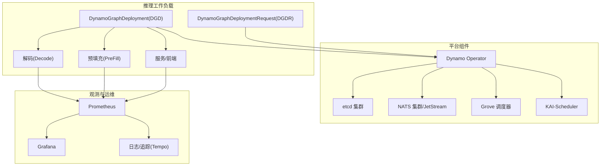
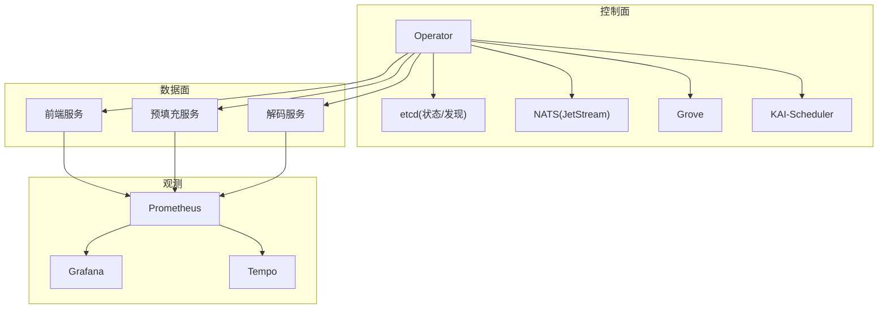
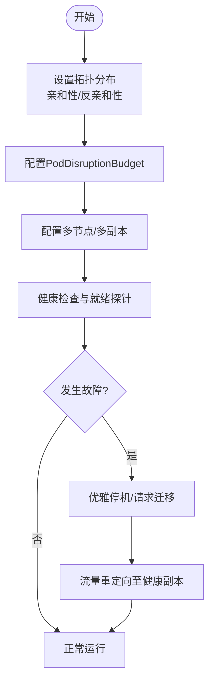
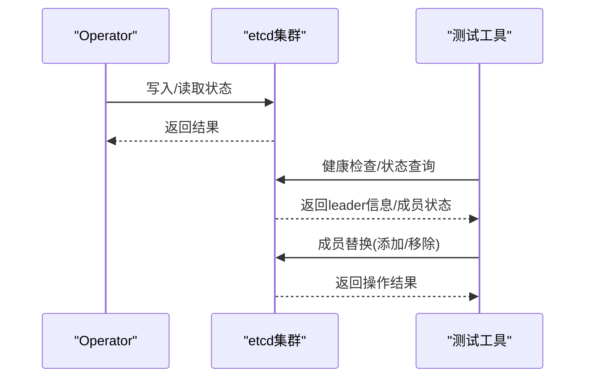
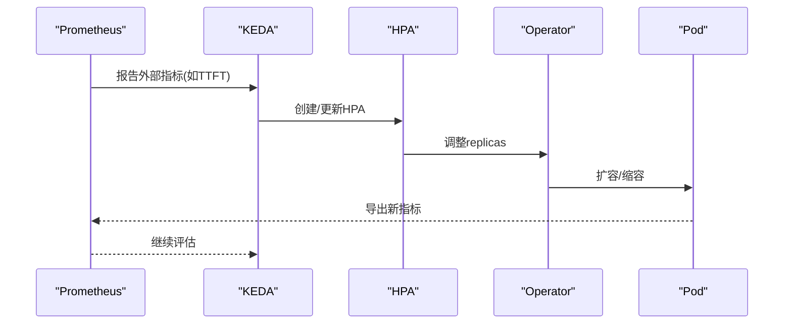
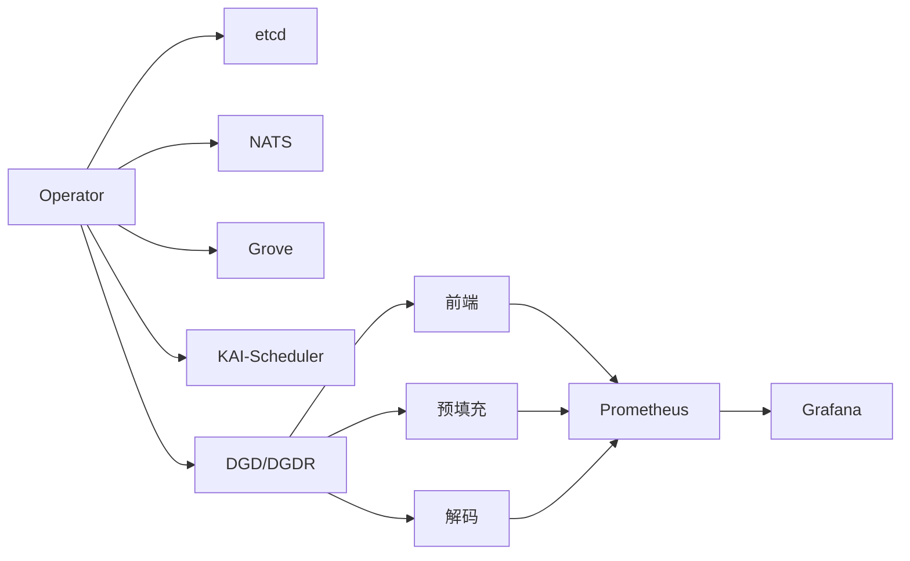
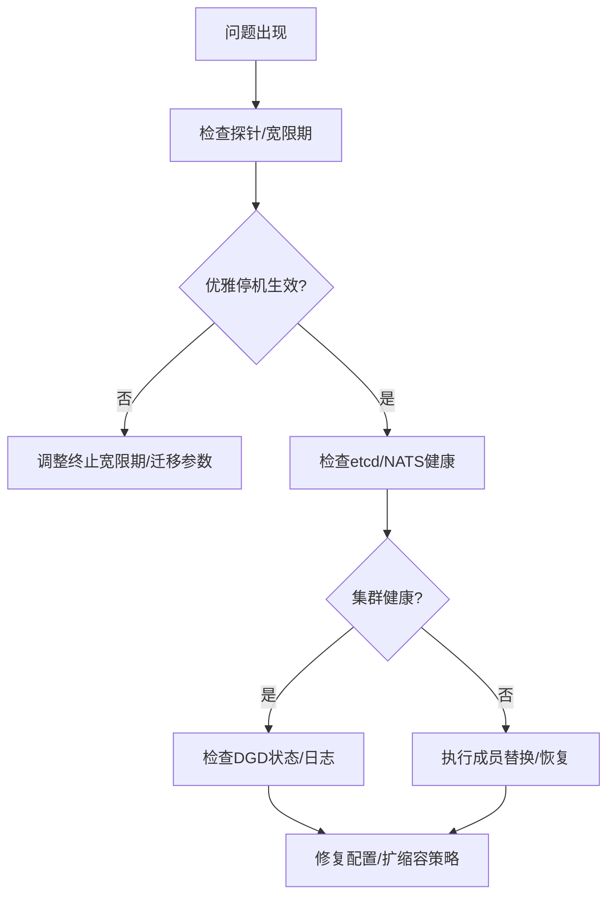

# 高可用性架构

<cite>
**本文引用的文件**
- [deploy/helm/README.md](file://deploy/helm/README.md)
- [deploy/operator/README.md](file://deploy/operator/README.md)
- [deploy/nats-server.conf](file://deploy/nats-server.conf)
- [deploy/sanity_check.py](file://deploy/sanity_check.py)
- [docs/kubernetes/deployment/multinode-deployment.md](file://docs/kubernetes/deployment/multinode-deployment.md)
- [docs/kubernetes/autoscaling.md](file://docs/kubernetes/autoscaling.md)
- [docs/fault_tolerance/graceful_shutdown.md](file://docs/fault_tolerance/graceful_shutdown.md)
- [docs/observability/prometheus-grafana.md](file://docs/observability/prometheus-grafana.md)
- [deploy/helm/charts/platform/values.yaml](file://deploy/helm/charts/platform/values.yaml)
- [examples/backends/vllm/deploy/agg.yaml](file://examples/backends/vllm/deploy/agg.yaml)
- [deploy/observability/prometheus.yml](file://deploy/observability/prometheus.yml)
- [deploy/observability/grafana-datasources.yml](file://deploy/observability/grafana-datasources.yml)
- [deploy/utils/dynamo_deployment.py](file://deploy/utils/dynamo_deployment.py)
- [tests/fault_tolerance/etcd_ha/utils.py](file://tests/fault_tolerance/etcd_ha/utils.py)
- [lib/runtime/src/transports/etcd/connector.rs](file://lib/runtime/src/transports/etcd/connector.rs)
</cite>

## 目录
1. [引言](#引言)
2. [项目结构](#项目结构)
3. [核心组件](#核心组件)
4. [架构总览](#架构总览)
5. [详细组件分析](#详细组件分析)
6. [依赖关系分析](#依赖关系分析)
7. [性能考量](#性能考量)
8. [故障排查指南](#故障排查指南)
9. [结论](#结论)
10. [附录](#附录)

## 引言
本方案面向Dynamo在Kubernetes上的高可用性部署，围绕多可用区部署、跨区域容灾与自动故障转移、负载均衡与健康检查、流量分发策略、Pod亲和性与反亲和性、污点容忍、etcd集群高可用、NATS集群配置与持久化、持久化存储、滚动更新与蓝绿/金丝雀发布、以及监控告警与自动恢复机制进行系统化设计与落地指导。目标是构建具备强一致性、弹性伸缩、可观测与可恢复能力的生产级推理平台。

## 项目结构
Dynamo通过Helm Chart统一安装平台组件（Operator、etcd、NATS、Grove、Kai Scheduler等），并通过自定义资源（DGD/DGDR）声明式管理推理工作负载；观测体系由Prometheus/Grafana/Tempo构成；多节点与多可用区调度通过Grove/KAI-Scheduler与拓扑感知亲和性实现；故障处理通过优雅停机与迁移保障请求不丢失。

图示来源
- [deploy/helm/README.md](file://deploy/helm/README.md#L18-L23)
- [deploy/operator/README.md](file://deploy/operator/README.md#L1-L37)
- [deploy/helm/charts/platform/values.yaml](file://deploy/helm/charts/platform/values.yaml#L20-L31)
- [docs/kubernetes/deployment/multinode-deployment.md](file://docs/kubernetes/deployment/multinode-deployment.md#L21-L48)

章节来源
- [deploy/helm/README.md](file://deploy/helm/README.md#L18-L23)
- [deploy/operator/README.md](file://deploy/operator/README.md#L1-L37)
- [deploy/helm/charts/platform/values.yaml](file://deploy/helm/charts/platform/values.yaml#L20-L31)

## 核心组件
- Dynamo Operator：负责DGD/DGDR生命周期管理、自动创建Scaling Adapter、与etcd/NATS交互、集成Grove/KAI-Scheduler进行高级调度。
- etcd：作为Operator状态存储与服务发现后端，支持HA部署与PVC持久化。
- NATS：消息总线与JetStream持久化，支持集群模式与PVC存储，用于Operator内部通信与事件流。
- Grove/KAI-Scheduler：网络拓扑感知的gang调度与自动扩缩容，提升AI工作负载的资源利用率与稳定性。
- Prometheus/Grafana/Tempo：指标采集、可视化与分布式追踪，支撑SLA驱动的自适应扩缩容与故障定位。
- 多节点/多可用区：通过拓扑感知亲和性、PodDisruptionBudget与多副本部署实现跨可用区容灾。

章节来源
- [deploy/operator/README.md](file://deploy/operator/README.md#L1-L37)
- [deploy/helm/charts/platform/values.yaml](file://deploy/helm/charts/platform/values.yaml#L233-L287)
- [deploy/nats-server.conf](file://deploy/nats-server.conf#L1-L14)
- [docs/kubernetes/deployment/multinode-deployment.md](file://docs/kubernetes/deployment/multinode-deployment.md#L21-L48)
- [docs/observability/prometheus-grafana.md](file://docs/observability/prometheus-grafana.md#L1-L113)

## 架构总览
下图展示Dynamo高可用架构的关键交互路径：Operator协调DGD/DGDR，通过etcd保存状态、通过NATS/JetStream传递事件；Grove/KAI-Scheduler进行拓扑感知调度；Prometheus/Grafana/Tempo提供观测与告警；多节点部署结合Pod亲和性与PDB实现跨可用区容灾。

图示来源
- [deploy/helm/charts/platform/values.yaml](file://deploy/helm/charts/platform/values.yaml#L233-L287)
- [deploy/nats-server.conf](file://deploy/nats-server.conf#L1-L14)
- [docs/kubernetes/deployment/multinode-deployment.md](file://docs/kubernetes/deployment/multinode-deployment.md#L21-L48)
- [docs/observability/prometheus-grafana.md](file://docs/observability/prometheus-grafana.md#L1-L113)

## 详细组件分析

### 多可用区部署与跨区域容灾
- 可用区感知与拓扑分布
  - 使用拓扑键（如kubernetes.io/hostname、topology.kubernetes.io/zone）进行亲和性与拓扑分布约束，确保Pod均匀分布在多个可用区。
  - 通过PodDisruptionBudget（PDB）限制同时中断数量，保障关键服务在维护窗口内的可用性。
- 多节点与多副本
  - 通过DGD中services的replicas与multinode.nodeCount组合，实现跨节点与跨可用区的资源扩展。
  - 建议每个可用区至少部署1个主副本，并启用PDB以避免同时中断导致的服务不可用。
- 自动故障转移
  - 结合Kubernetes就绪探针与优雅停机，当节点或Pod异常时，自动将流量切换到健康副本。
  - 解码服务支持请求迁移（迁移上限>0）时，可立即停止并迁移进行中的请求，避免丢包。

图示来源
- [docs/kubernetes/deployment/multinode-deployment.md](file://docs/kubernetes/deployment/multinode-deployment.md#L68-L178)
- [docs/fault_tolerance/graceful_shutdown.md](file://docs/fault_tolerance/graceful_shutdown.md#L197-L227)

章节来源
- [docs/kubernetes/deployment/multinode-deployment.md](file://docs/kubernetes/deployment/multinode-deployment.md#L68-L178)
- [docs/fault_tolerance/graceful_shutdown.md](file://docs/fault_tolerance/graceful_shutdown.md#L197-L227)

### 负载均衡器配置、健康检查与流量分发
- 负载均衡与入口
  - 前端服务暴露HTTP端口，结合Ingress或Service类型（LoadBalancer/ClusterIP）实现外部访问与内部路由。
  - 对于多可用区部署，建议使用支持跨可用区的LB实现（如云厂商提供的LB），并开启健康检查与会话亲和性（按需）。
- 健康检查
  - 使用liveness/readiness探针检测进程健康状态；在优雅停机期间，探针应返回失败以阻止新流量进入。
  - 结合Prometheus指标（队列深度、TTFT、ITL）进行外部健康检查与扩缩容决策。
- 流量分发策略
  - 基于服务发现与DNS解析实现就近访问；结合拓扑感知亲和性减少跨可用区流量。
  - 对于长请求场景，适当延长终止宽限期（terminationGracePeriodSeconds）以允许请求完成。

章节来源
- [examples/backends/vllm/deploy/agg.yaml](file://examples/backends/vllm/deploy/agg.yaml#L10-L26)
- [docs/observability/prometheus-grafana.md](file://docs/observability/prometheus-grafana.md#L1-L113)
- [docs/kubernetes/autoscaling.md](file://docs/kubernetes/autoscaling.md#L175-L380)

### Pod亲和性、反亲和性与污点容忍
- 亲和性（Affinity）
  - preferredDuringSchedulingIgnoredDuringExecution：优先将Pod调度到指定可用区或节点标签匹配的节点上。
  - requiredDuringSchedulingIgnoredDuringExecution：强制要求Pod必须满足某些节点标签条件（如GPU节点、特定AZ）。
- 反亲和性（Anti-Affinity）
  - podAntiAffinity：避免同一服务的多个副本在同一可用区或同一主机上，降低单点故障风险。
- 污点容忍（Tolerations）
  - 在operator、etcd、NATS等关键组件上配置容忍特定污点（如NoSchedule/NoExecute），确保在节点驱逐或维护时仍能调度。

章节来源
- [deploy/helm/charts/platform/values.yaml](file://deploy/helm/charts/platform/values.yaml#L54-L58)
- [deploy/helm/charts/platform/values.yaml](file://deploy/helm/charts/platform/values.yaml#L283-L287)
- [deploy/helm/charts/platform/values.yaml](file://deploy/helm/charts/platform/values.yaml#L606-L610)

### etcd集群高可用
- 集群规模与选举
  - 建议使用奇数个副本（3/5）以保证多数派选举；单节点仅用于开发测试。
  - 通过PVC持久化数据目录，确保重启后数据不丢失。
- 运维与恢复
  - 启用PDB以限制同时中断；在升级前执行预检与备份。
  - 支持动态成员替换与健康检查，确保故障节点被及时剔除并重建。

图示来源
- [tests/fault_tolerance/etcd_ha/utils.py](file://tests/fault_tolerance/etcd_ha/utils.py#L42-L125)
- [tests/fault_tolerance/etcd_ha/utils.py](file://tests/fault_tolerance/etcd_ha/utils.py#L227-L317)
- [lib/runtime/src/transports/etcd/connector.rs](file://lib/runtime/src/transports/etcd/connector.rs#L40-L74)

章节来源
- [tests/fault_tolerance/etcd_ha/utils.py](file://tests/fault_tolerance/etcd_ha/utils.py#L42-L125)
- [tests/fault_tolerance/etcd_ha/utils.py](file://tests/fault_tolerance/etcd_ha/utils.py#L227-L317)
- [lib/runtime/src/transports/etcd/connector.rs](file://lib/runtime/src/transports/etcd/connector.rs#L40-L74)

### NATS集群配置与持久化
- 集群与JetStream
  - 启用NATS集群模式与JetStream持久化存储；通过PVC挂载文件存储，确保消息持久化与跨重启恢复。
  - 配置监控端口与可选的Prometheus导出器，便于观测NATS健康状态。
- 安全与连接
  - 可选TLS与mTLS配置，结合证书管理（自管或cert-manager）保障传输安全。
- 高可用部署
  - 为NATS配置PDB与拓扑分布亲和性，避免单点故障；在升级时注意配置热更新与滚动重启策略。

章节来源
- [deploy/nats-server.conf](file://deploy/nats-server.conf#L1-L14)
- [deploy/helm/charts/platform/values.yaml](file://deploy/helm/charts/platform/values.yaml#L289-L490)
- [deploy/helm/charts/platform/values.yaml](file://deploy/helm/charts/platform/values.yaml#L630-L634)

### 持久化存储实施方案
- etcd
  - 使用PVC挂载持久卷，设置合理容量与存储类；启用PDB与备份策略。
- NATS JetStream
  - 通过PVC为JetStream文件存储分配持久卷，确保消息与流在重启后不丢失。
- 其他
  - 编译缓存、模型缓存等可通过PVC或CSI卷挂载，结合回收策略与配额管理。

章节来源
- [deploy/helm/charts/platform/values.yaml](file://deploy/helm/charts/platform/values.yaml#L244-L251)
- [deploy/helm/charts/platform/values.yaml](file://deploy/helm/charts/platform/values.yaml#L322-L340)

### 滚动更新、蓝绿部署与金丝雀发布
- 滚动更新
  - 使用Deployment/StatefulSet的滚动更新策略，设置最大不可用/最大同时扩容，配合探针与PDB保障平滑过渡。
- 蓝绿/金丝雀
  - 通过多版本服务与流量切换（Ingress/Service）实现蓝绿；或通过KEDA/Helm ScaledObject基于指标进行金丝雀流量注入与逐步放量。
  - 结合Prometheus指标（TTFT/队列深度）与外部指标适配器，实现自动化流量切分与回滚。

章节来源
- [docs/kubernetes/autoscaling.md](file://docs/kubernetes/autoscaling.md#L381-L529)
- [docs/kubernetes/autoscaling.md](file://docs/kubernetes/autoscaling.md#L531-L582)

### 监控告警与自动恢复
- 指标采集与可视化
  - Prometheus抓取前端/后端/系统指标；Grafana展示关键SLA指标（TTFT、ITL、队列深度、并发请求数）。
- 告警策略
  - 队列深度阈值、TTFT超限、解码延迟、节点/Pod异常、etcd/NATS健康状态异常等触发告警。
- 自动恢复
  - 结合HPA/KEDA与Operator控制器，自动扩缩容；对etcd/NATS异常执行自动重连与成员替换；对Pod异常执行滚动重启与迁移。

图示来源
- [docs/kubernetes/autoscaling.md](file://docs/kubernetes/autoscaling.md#L175-L380)
- [deploy/observability/prometheus.yml](file://deploy/observability/prometheus.yml#L16-L63)
- [deploy/observability/grafana-datasources.yml](file://deploy/observability/grafana-datasources.yml#L18-L24)

章节来源
- [docs/observability/prometheus-grafana.md](file://docs/observability/prometheus-grafana.md#L1-L113)
- [deploy/observability/prometheus.yml](file://deploy/observability/prometheus.yml#L16-L63)
- [deploy/observability/grafana-datasources.yml](file://deploy/observability/grafana-datasources.yml#L18-L24)

## 依赖关系分析
- 控制面依赖
  - Operator依赖etcd与NATS；Grove/KAI-Scheduler提供高级调度能力；Prometheus/Grafana/Tempo提供观测与告警。
- 数据面依赖
  - 前端/预填充/解码服务依赖Operator生成的Scaling Adapter与拓扑分布策略。
- 升级与兼容
  - Helm Chart提供版本化配置；Operator支持Webhook校验与证书管理；多后端（vLLM/SGLang/TensorRT-LLM）通过DGD自动注入分布式参数。

图示来源
- [deploy/helm/README.md](file://deploy/helm/README.md#L18-L23)
- [deploy/helm/charts/platform/values.yaml](file://deploy/helm/charts/platform/values.yaml#L233-L287)
- [docs/kubernetes/deployment/multinode-deployment.md](file://docs/kubernetes/deployment/multinode-deployment.md#L21-L48)

章节来源
- [deploy/helm/README.md](file://deploy/helm/README.md#L18-L23)
- [deploy/helm/charts/platform/values.yaml](file://deploy/helm/charts/platform/values.yaml#L233-L287)

## 性能考量
- 网络拓扑与带宽
  - 多节点部署建议使用高速网络（InfiniBand/RoCE），减少跨节点通信延迟。
- 资源规划
  - 根据tp-size与节点GPU数合理规划总GPU数；为编译缓存与模型缓存预留PVC空间。
- 探针与宽限期
  - 为长请求场景设置较长的终止宽限期，避免在关闭时打断请求。
- 观测与调优
  - 基于TTFT/ITL/队列深度等指标进行自适应扩缩容，避免过度扩容造成资源浪费。

章节来源
- [docs/kubernetes/deployment/multinode-deployment.md](file://docs/kubernetes/deployment/multinode-deployment.md#L138-L178)
- [docs/kubernetes/autoscaling.md](file://docs/kubernetes/autoscaling.md#L624-L667)

## 故障排查指南
- 健康检查与优雅停机
  - 检查探针配置与日志输出；确认终止宽限期是否足够；验证解码服务迁移参数。
- etcd/NATS健康
  - 使用测试工具检查leader状态与成员列表；关注PVC与存储可用性；必要时执行成员替换。
- 部署与等待
  - 使用部署客户端等待DGD就绪，查看状态条件与组件准备情况；必要时导出Pod日志进行诊断。

图示来源
- [docs/fault_tolerance/graceful_shutdown.md](file://docs/fault_tolerance/graceful_shutdown.md#L197-L227)
- [tests/fault_tolerance/etcd_ha/utils.py](file://tests/fault_tolerance/etcd_ha/utils.py#L227-L317)
- [deploy/utils/dynamo_deployment.py](file://deploy/utils/dynamo_deployment.py#L287-L415)

章节来源
- [docs/fault_tolerance/graceful_shutdown.md](file://docs/fault_tolerance/graceful_shutdown.md#L197-L227)
- [tests/fault_tolerance/etcd_ha/utils.py](file://tests/fault_tolerance/etcd_ha/utils.py#L227-L317)
- [deploy/utils/dynamo_deployment.py](file://deploy/utils/dynamo_deployment.py#L287-L415)

## 结论
通过将Operator、etcd、NATS、Grove/KAI-Scheduler与Prometheus/Grafana/Tempo有机整合，Dynamo可在多可用区与跨区域环境下实现高可用部署与自动故障转移。结合拓扑感知亲和性、PDB、优雅停机与请求迁移、以及基于SLA的自适应扩缩容，可显著提升系统的可靠性与用户体验。建议在生产环境中启用持久化存储、完善的监控告警与定期演练，持续优化性能与成本。

## 附录
- 快速开始与环境准备
  - 使用Helm Chart安装平台组件；配置Prometheus/Grafana/Tempo；准备GPU节点与高速网络。
- 示例参考
  - vLLM聚合部署示例展示了前端与解码服务的声明式配置与镜像选择。

章节来源
- [deploy/helm/README.md](file://deploy/helm/README.md#L18-L23)
- [examples/backends/vllm/deploy/agg.yaml](file://examples/backends/vllm/deploy/agg.yaml#L1-L35)
- [deploy/observability/prometheus-grafana.md](file://docs/observability/prometheus-grafana.md#L26-L75)