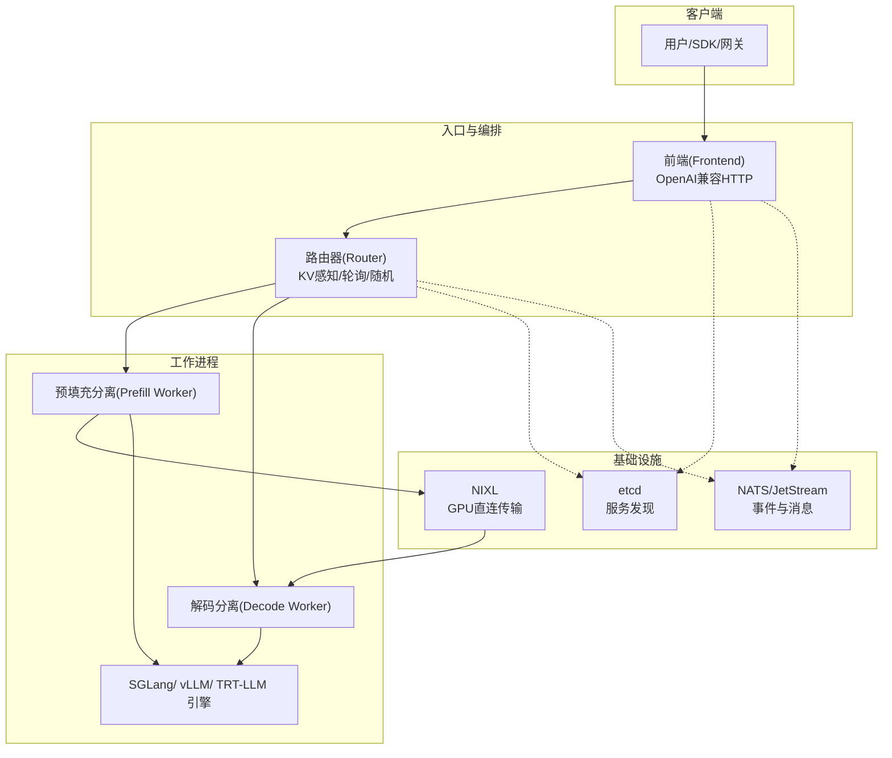
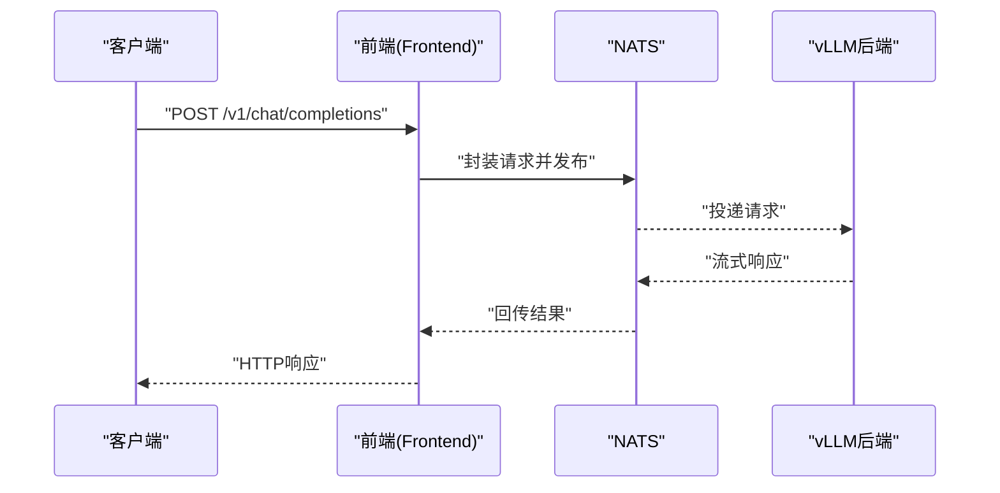
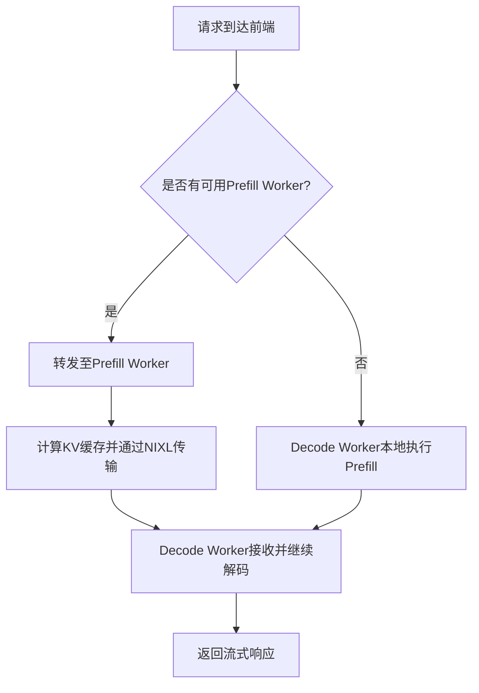
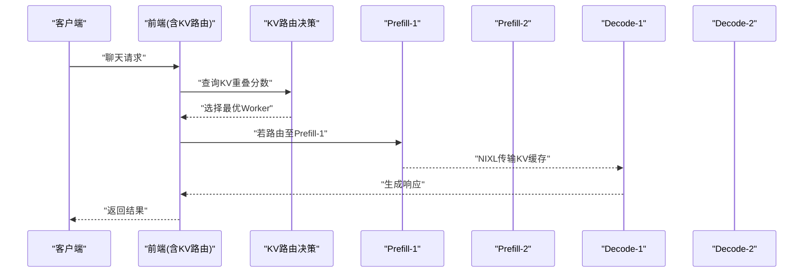
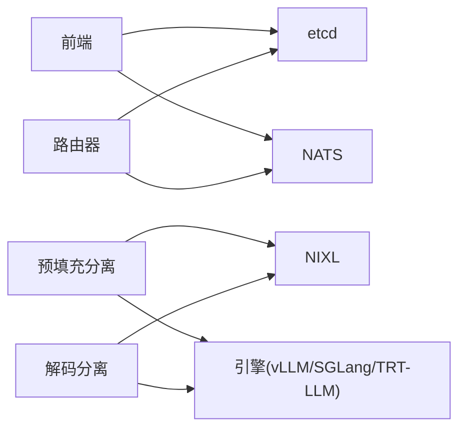

# 示例和最佳实践

<cite>
**本文引用的文件**
- [README.md](file://README.md)
- [examples/README.md](file://examples/README.md)
- [examples/basics/quickstart/README.md](file://examples/basics/quickstart/README.md)
- [examples/basics/disaggregated_serving/README.md](file://examples/basics/disaggregated_serving/README.md)
- [examples/basics/multinode/README.md](file://examples/basics/multinode/README.md)
- [examples/backends/vllm/launch/agg.sh](file://examples/backends/vllm/launch/agg.sh)
- [examples/backends/sglang/launch/disagg.sh](file://examples/backends/sglang/launch/disagg.sh)
- [examples/backends/trtllm/launch/disagg.sh](file://examples/backends/trtllm/launch/disagg.sh)
- [examples/multimodal/launch/audio_disagg.sh](file://examples/multimodal/launch/audio_disagg.sh)
- [docs/performance/tuning.md](file://docs/performance/tuning.md)
- [docs/benchmarks/benchmarking.md](file://docs/benchmarks/benchmarking.md)
- [docs/backends/vllm/README.md](file://docs/backends/vllm/README.md)
- [docs/backends/sglang/README.md](file://docs/backends/sglang/README.md)
- [docs/backends/trtllm/README.md](file://docs/backends/trtllm/README.md)
- [docs/multimodal/index.md](file://docs/multimodal/index.md)
</cite>

## 目录
1. [简介](#简介)
2. [项目结构](#项目结构)
3. [核心组件](#核心组件)
4. [架构总览](#架构总览)
5. [详细组件分析](#详细组件分析)
6. [依赖关系分析](#依赖关系分析)
7. [性能考虑](#性能考虑)
8. [故障排查指南](#故障排查指南)
9. [结论](#结论)
10. [附录](#附录)

## 简介
本文件面向希望在本地、多节点与生产环境中高效部署与运行Dynamo的工程师与平台团队，提供从基础使用到高级配置的完整示例集合，覆盖单机开发、多节点部署与生产环境的典型场景；深入解释主流模型（如Llama、Qwen、DeepSeek）与多后端（vLLM、SGLang、TensorRT-LLM）的集成与部署要点；阐述多模态应用的实现路径与性能优化策略；给出从数据预处理到模型推理的端到端工作流；提供性能调优的实际案例与效果对比；并总结安全配置、资源管理与成本控制的最佳实践。

## 项目结构
Dynamo示例与最佳实践主要分布在以下目录：
- examples：包含快速入门、解耦服务、多节点KV路由、多后端（vLLM/SGLang/TRT-LLM）、多模态等示例
- docs：包含性能调优、基准测试、各后端集成指南与多模态说明
- benchmarks：提供AIPerf基准工具链与可视化脚本
- deploy：包含容器化、Kubernetes平台安装与观测性配置

```mermaid
graph TB
A["examples/README.md"] --> B["examples/basics/"]
A --> C["examples/backends/"]
A --> D["examples/deployments/"]
A --> E["examples/multimodal/"]
B --> B1["quickstart/README.md"]
B --> B2["disaggregated_serving/README.md"]
B --> B3["multinode/README.md"]
C --> C1["vllm/launch/*.sh"]
C --> C2["sglang/launch/*.sh"]
C --> C3["trtllm/launch/*.sh"]
D --> D1["EKS/"]
D --> D2["AKS/"]
D --> D3["GKE/"]
D --> D4["router_standalone*/"]
E --> E1["launch/*.sh"]
E --> E2["components/"]
E --> E3["utils/"]
F["docs/performance/tuning.md"] --> G["docs/benchmarks/benchmarking.md"]
F --> H["docs/backends/vllm/README.md"]
F --> I["docs/backends/sglang/README.md"]
F --> J["docs/backends/trtllm/README.md"]
F --> K["docs/multimodal/index.md"]
```

图示来源
- [examples/README.md](file://examples/README.md#L1-L87)
- [examples/basics/quickstart/README.md](file://examples/basics/quickstart/README.md#L1-L162)
- [examples/basics/disaggregated_serving/README.md](file://examples/basics/disaggregated_serving/README.md#L1-L223)
- [examples/basics/multinode/README.md](file://examples/basics/multinode/README.md#L1-L515)
- [examples/backends/vllm/launch/agg.sh](file://examples/backends/vllm/launch/agg.sh#L1-L33)
- [examples/backends/sglang/launch/disagg.sh](file://examples/backends/sglang/launch/disagg.sh#L1-L89)
- [examples/backends/trtllm/launch/disagg.sh](file://examples/backends/trtllm/launch/disagg.sh#L1-L82)
- [examples/multimodal/launch/audio_disagg.sh](file://examples/multimodal/launch/audio_disagg.sh#L1-L99)
- [docs/performance/tuning.md](file://docs/performance/tuning.md#L1-L149)
- [docs/benchmarks/benchmarking.md](file://docs/benchmarks/benchmarking.md#L1-L542)
- [docs/backends/vllm/README.md](file://docs/backends/vllm/README.md#L1-L204)
- [docs/backends/sglang/README.md](file://docs/backends/sglang/README.md#L1-L278)
- [docs/backends/trtllm/README.md](file://docs/backends/trtllm/README.md#L1-L300)
- [docs/multimodal/index.md](file://docs/multimodal/index.md#L1-L214)

章节来源
- [examples/README.md](file://examples/README.md#L1-L87)
- [README.md](file://README.md#L1-L367)

## 核心组件
- 前端（Frontend）：内置OpenAI兼容HTTP API服务器、预处理器与路由器，统一接入层
- 路由器（Router）：支持KV感知路由、轮询、随机等模式，按缓存重用度智能分发请求
- 工作进程（Workers）：vLLM/SGLang/TRT-LLM引擎实例，可聚合或解耦（Prefill/Decode）
- 传输与发现（NIXL/etcd/NATS）：跨GPU零拷贝KV缓存传输、服务注册与事件发布
- 多模态组件：编码器、处理器、专用前端，支持图像/视频/音频输入

章节来源
- [README.md](file://README.md#L137-L181)
- [docs/backends/vllm/README.md](file://docs/backends/vllm/README.md#L32-L46)
- [docs/backends/sglang/README.md](file://docs/backends/sglang/README.md#L31-L43)
- [docs/backends/trtllm/README.md](file://docs/backends/trtllm/README.md#L48-L68)
- [docs/multimodal/index.md](file://docs/multimodal/index.md#L67-L214)

## 架构总览
Dynamo通过“请求平面”与“事件平面”解耦：前端负责HTTP接入与路由决策；后端以消息总线（NATS）与服务发现（etcd）连接各组件；解耦服务将Prefill与Decode分离，结合NIXL进行GPU间KV缓存传输，最大化吞吐与降低延迟。

图示来源
- [README.md](file://README.md#L225-L243)
- [examples/basics/disaggregated_serving/README.md](file://examples/basics/disaggregated_serving/README.md#L43-L57)
- [examples/basics/multinode/README.md](file://examples/basics/multinode/README.md#L18-L51)

## 详细组件分析

### 快速入门（单机聚合）
- 场景：本地单机快速验证，无需外部依赖
- 步骤：启动etcd/NATS → 启动vLLM后端 → 启动前端 → curl或OpenAI客户端测试
- 关键点：本地开发可用文件存储替代etcd；vLLM禁用KV事件以避免NATS依赖

图示来源
- [examples/basics/quickstart/README.md](file://examples/basics/quickstart/README.md#L23-L34)
- [examples/basics/quickstart/README.md](file://examples/basics/quickstart/README.md#L74-L85)

章节来源
- [examples/basics/quickstart/README.md](file://examples/basics/quickstart/README.md#L1-L162)
- [README.md](file://README.md#L137-L181)

### 解耦服务（Prefill/Decode分离）
- 场景：提升资源利用率与可扩展性，消除长前缀阻塞
- 步骤：分别启动Decode与Prefill工作进程，设置NIXL端口与可见GPU，前端自动发现
- 关键点：NIXL零拷贝传输KV缓存；日志级别提高便于观察调度

图示来源
- [examples/basics/disaggregated_serving/README.md](file://examples/basics/disaggregated_serving/README.md#L43-L57)
- [examples/basics/disaggregated_serving/README.md](file://examples/basics/disaggregated_serving/README.md#L183-L203)

章节来源
- [examples/basics/disaggregated_serving/README.md](file://examples/basics/disaggregated_serving/README.md#L1-L223)

### 多节点KV感知路由
- 场景：跨节点高可用与负载均衡，基于KV缓存重用度智能路由
- 步骤：设置etcd/NATS访问地址、固定跨节点引导端口、在不同节点启动两套副本
- 关键点：页面大小需一致；启用调试日志观察重叠分数与路由选择；支持轮询/随机作为备选

图示来源
- [examples/basics/multinode/README.md](file://examples/basics/multinode/README.md#L18-L51)
- [examples/basics/multinode/README.md](file://examples/basics/multinode/README.md#L380-L406)

章节来源
- [examples/basics/multinode/README.md](file://examples/basics/multinode/README.md#L1-L515)

### vLLM 集成与示例
- 支持特性矩阵：解耦服务、KV感知路由、SLA规划器、KVBM、LMCache、提示嵌入等
- 单机示例：聚合/聚合+KV路由/解耦/解耦+KV路由/数据并行注意力/专家并行等
- 关键参数：模型名、是否预填充分离、指标端口、KV传输后端、提示嵌入开关等

章节来源
- [docs/backends/vllm/README.md](file://docs/backends/vllm/README.md#L32-L46)
- [docs/backends/vllm/README.md](file://docs/backends/vllm/README.md#L88-L134)
- [examples/backends/vllm/launch/agg.sh](file://examples/backends/vllm/launch/agg.sh#L1-L33)

### SGLang 集成与示例
- 支持特性矩阵：解耦服务、KV感知路由、SLA规划器、多模态等
- 单机示例：聚合/聚合+KV路由/嵌入模型/解耦/解耦+KV路由/专家并行等
- 关键参数：模型路径、张量并行、信任远程代码、分隔引导端口、分隔模式、传输后端等

章节来源
- [docs/backends/sglang/README.md](file://docs/backends/sglang/README.md#L31-L43)
- [docs/backends/sglang/README.md](file://docs/backends/sglang/README.md#L162-L237)
- [examples/backends/sglang/launch/disagg.sh](file://examples/backends/sglang/launch/disagg.sh#L1-L89)

### TensorRT-LLM 集成与示例
- 支持特性矩阵：解耦服务、KV感知路由、SLA规划器、KVBM、WideEP、DP秩路由等
- 单机示例：聚合/聚合+KV路由/解耦/解耦+KV路由/MTP+DeepSeek R1等
- 关键参数：引擎配置文件、模型路径、服务模型名、模态类型、传输后端（UCX/NIXL）等

章节来源
- [docs/backends/trtllm/README.md](file://docs/backends/trtllm/README.md#L48-L68)
- [docs/backends/trtllm/README.md](file://docs/backends/trtllm/README.md#L110-L160)
- [examples/backends/trtllm/launch/disagg.sh](file://examples/backends/trtllm/launch/disagg.sh#L1-L82)

### 多模态应用与性能优化
- 支持矩阵：vLLM全栈支持；TRT-LLM图像支持，音频/视频实验中；SGLang图像支持
- 架构模式：EPD（聚合）、E/PD（编码分离）、E/P/D（完全解耦）、EP/D（传统解耦）
- 性能优化：页面大小、批大小、最大token数、块大小、KV缓存命中率、NIXL带宽利用

章节来源
- [docs/multimodal/index.md](file://docs/multimodal/index.md#L38-L78)
- [examples/multimodal/launch/audio_disagg.sh](file://examples/multimodal/launch/audio_disagg.sh#L1-L99)

## 依赖关系分析
- 组件内聚与耦合：前端与路由器对etcd/NATS依赖强；后端引擎通过消息总线与前端交互；NIXL仅在解耦场景下用于GPU直连传输
- 外部依赖：etcd（服务发现）、NATS（事件与消息）、容器镜像（各后端运行时）
- 可观测性：Prometheus/Grafana、日志、追踪（OTel）

图示来源
- [README.md](file://README.md#L225-L243)
- [examples/basics/disaggregated_serving/README.md](file://examples/basics/disaggregated_serving/README.md#L173-L180)

章节来源
- [README.md](file://README.md#L225-L243)

## 性能考虑
- 解耦收益与参数调优：并行映射（节点内TP、跨节点PP）、预填充分离数量、批大小与最大token数、块大小
- KV缓存策略：块大小过小导致碎片与传输效率低，过大导致前缀缓存命中率下降；根据模型密度选择合适块大小
- 负载条件：低负载建议聚合；中高负载结合TTFT与ITL SLA调整预填充分离数量与批策略
- 基准测试：使用AIPerf进行并发扫描，生成可视化图表对比不同拓扑与后端

章节来源
- [docs/performance/tuning.md](file://docs/performance/tuning.md#L18-L149)
- [docs/benchmarks/benchmarking.md](file://docs/benchmarks/benchmarking.md#L16-L542)

## 故障排查指南
- 服务发现与消息：检查etcd健康状态与NATS连接；确认前端与工作进程均能访问
- NIXL传输：确保跨节点GPU通信正常（NVLink/IB/RoCE），启用CUDA IPC
- 路由问题：确认前端以KV模式启动、工作进程正确发布KV事件、日志显示重叠分数
- 请求迁移与取消：根据后端能力矩阵启用迁移限制；断开客户端触发取消释放资源

章节来源
- [examples/basics/multinode/README.md](file://examples/basics/multinode/README.md#L437-L465)
- [docs/backends/vllm/README.md](file://docs/backends/vllm/README.md#L182-L204)
- [docs/backends/sglang/README.md](file://docs/backends/sglang/README.md#L72-L87)
- [docs/backends/trtllm/README.md](file://docs/backends/trtllm/README.md#L192-L218)

## 结论
Dynamo通过解耦服务、KV感知路由与NIXL传输，在单机与多节点环境下实现了高吞吐、低延迟的生成式AI推理。结合AIPerf基准工具与详尽的示例脚本，用户可以快速完成从本地验证到生产部署的全流程，并依据负载特征与SLA要求进行精细化参数调优与资源规划。

## 附录
- 安全配置：多模态处理需显式启用；最小权限原则；网络隔离与只读根文件系统
- 资源管理：GPU可见设备划分、批大小与块大小权衡、KV缓存容量与命中率监控
- 成本控制：按需扩缩容、跨节点资源复用、冷热数据分离与缓存策略