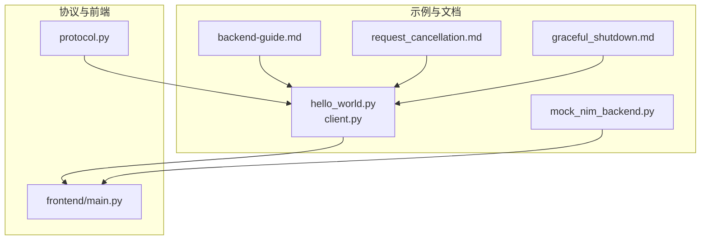
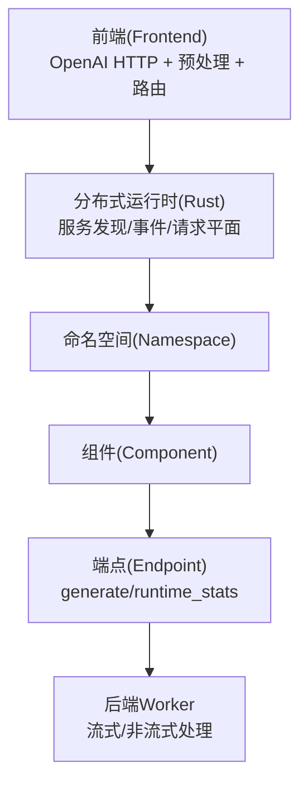
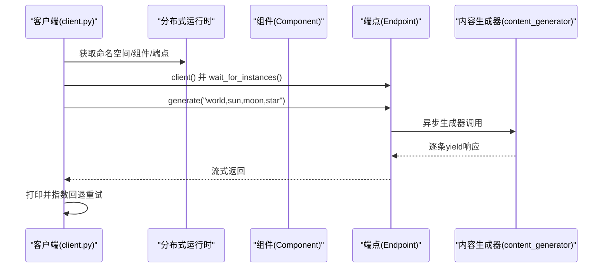
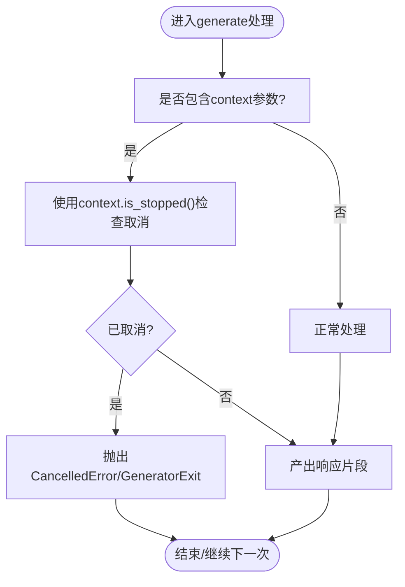
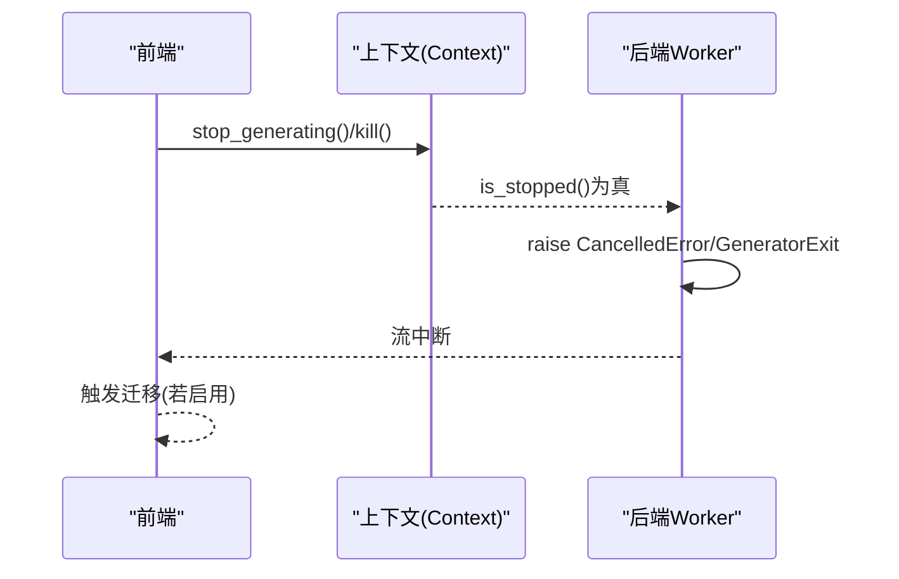
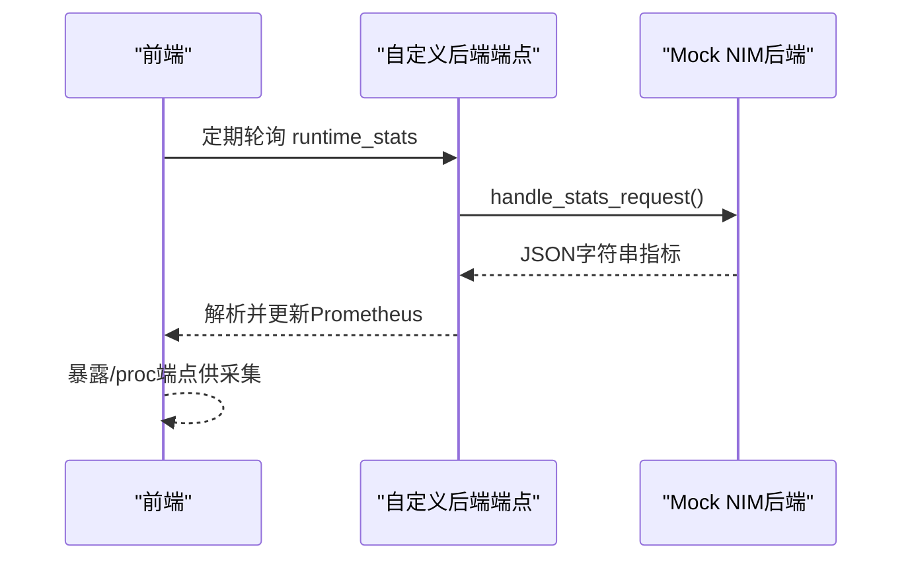
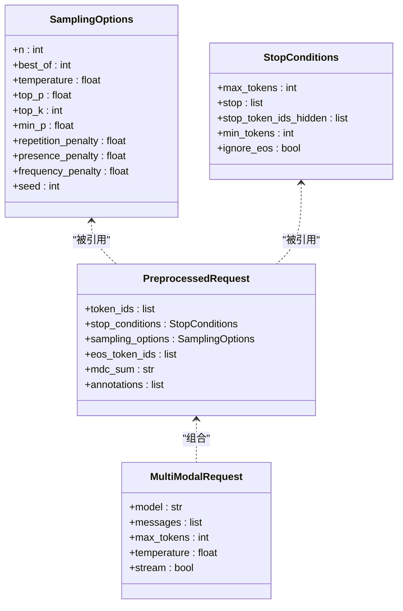
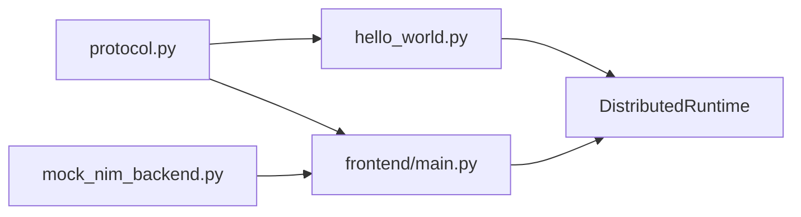

# 自定义后端开发

<cite>
**本文引用的文件**
- [backend-guide.md](file://docs/development/backend-guide.md)
- [hello_world.py](file://examples/custom_backend/hello_world/hello_world.py)
- [client.py](file://examples/custom_backend/hello_world/client.py)
- [README.md](file://examples/custom_backend/hello_world/README.md)
- [protocol.py](file://components/src/dynamo/sglang/protocol.py)
- [frontend/main.py](file://components/src/dynamo/frontend/main.py)
- [request_cancellation.md](file://docs/fault_tolerance/request_cancellation.md)
- [graceful_shutdown.md](file://docs/fault_tolerance/graceful_shutdown.md)
- [architecture.md](file://docs/design_docs/architecture.md)
- [glossary.md](file://docs/reference/glossary.md)
- [mock_nim_backend.py](file://examples/custom_backend/nim/mock_nim_backend.py)
- [README.md](file://examples/custom_backend/nim/README.md)
- [server.py](file://examples/custom_backend/cancellation/server.py)
- [README.md](file://examples/custom_backend/cancellation/README.md)
</cite>

## 目录
1. [简介](#简介)
2. [项目结构](#项目结构)
3. [核心组件](#核心组件)
4. [架构总览](#架构总览)
5. [详细组件分析](#详细组件分析)
6. [依赖关系分析](#依赖关系分析)
7. [性能考虑](#性能考虑)
8. [故障排查指南](#故障排查指南)
9. [结论](#结论)
10. [附录](#附录)

## 简介
本指南面向希望在Dynamo平台上开发“自定义推理后端”的工程师，系统讲解如何遵循Dynamo规范实现一个Python后端服务，覆盖从接口定义、服务注册、请求处理、响应格式、错误处理、取消机制、长连接与迁移、与外部服务（如NIM）集成、性能优化与资源管理、调试与测试到部署的全流程。

## 项目结构
Dynamo采用“Rust高性能内核 + Python可扩展接口”的混合架构。与自定义后端开发直接相关的目录与文件包括：
- 文档与开发指南：docs/development/backend-guide.md
- 示例后端：examples/custom_backend/hello_world
- 协议与类型：components/src/dynamo/sglang/protocol.py
- 前端入口与参数：components/src/dynamo/frontend/main.py
- 取消与优雅停机：docs/fault_tolerance/request_cancellation.md、docs/fault_tolerance/graceful_shutdown.md
- 架构与术语：docs/design_docs/architecture.md、docs/reference/glossary.md
- 外部服务集成示例：examples/custom_backend/nim/mock_nim_backend.py
- 请求取消演示：examples/custom_backend/cancellation/server.py

**图表来源**
- [hello_world.py](file://examples/custom_backend/hello_world/hello_world.py#L1-L43)
- [client.py](file://examples/custom_backend/hello_world/client.py#L1-L66)
- [mock_nim_backend.py](file://examples/custom_backend/nim/mock_nim_backend.py#L1-L135)
- [backend-guide.md](file://docs/development/backend-guide.md#L1-L164)
- [protocol.py](file://components/src/dynamo/sglang/protocol.py#L1-L134)
- [frontend/main.py](file://components/src/dynamo/frontend/main.py#L1-L469)
- [request_cancellation.md](file://docs/fault_tolerance/request_cancellation.md#L1-L89)
- [graceful_shutdown.md](file://docs/fault_tolerance/graceful_shutdown.md#L1-L275)

**章节来源**
- [backend-guide.md](file://docs/development/backend-guide.md#L1-L164)
- [architecture.md](file://docs/design_docs/architecture.md#L1-L114)
- [glossary.md](file://docs/reference/glossary.md#L1-L88)

## 核心组件
- 分布式运行时（DistributedRuntime）：负责服务发现、消息传递、生命周期管理。支持静态（NATS）与动态（etcd+NATS）模式。
- 组件（Component）与端点（Endpoint）：逻辑分组与网络可访问API；同一命名空间+组件+端点可有多个实例用于负载均衡。
- 后端服务（Worker）：通过装饰器注册自身，绑定请求处理器，暴露流式或非流式端点。
- 前端（Frontend）：OpenAI兼容HTTP服务、预处理、路由与指标聚合，支持自定义后端指标轮询。

**章节来源**
- [backend-guide.md](file://docs/development/backend-guide.md#L13-L57)
- [frontend/main.py](file://components/src/dynamo/frontend/main.py#L88-L327)
- [glossary.md](file://docs/reference/glossary.md#L6-L32)

## 架构总览
Dynamo采用“事件平面+请求平面”解耦的消息与数据传输模型，支持TCP/HTTP/NATS等请求平面，以及NATS/ZMQ等事件平面。后端以Worker形式注册到命名空间/组件/端点，前端通过路由选择最优Worker进行请求下发。

**图表来源**
- [architecture.md](file://docs/design_docs/architecture.md#L19-L70)
- [frontend/main.py](file://components/src/dynamo/frontend/main.py#L361-L371)
- [glossary.md](file://docs/reference/glossary.md#L6-L32)

## 详细组件分析

### Hello World 后端：从零到一的完整实现
该示例展示了最小可用后端：定义端点、注册Worker、启动服务、客户端连接与流式消费。

- 接口定义与端点装饰
  - 使用装饰器声明输入/输出类型，并实现异步生成器函数，逐条产出响应。
- Worker注册与服务发布
  - 在Worker中获取命名空间、组件、端点对象，调用serve_endpoint绑定处理函数。
- 客户端连接与重试
  - 客户端通过runtime定位目标端点，等待实例上线，发起请求并流式读取结果；对异常进行指数回退重试。

**图表来源**
- [hello_world.py](file://examples/custom_backend/hello_world/hello_world.py#L16-L37)
- [client.py](file://examples/custom_backend/hello_world/client.py#L23-L61)

**章节来源**
- [hello_world.py](file://examples/custom_backend/hello_world/hello_world.py#L1-L43)
- [client.py](file://examples/custom_backend/hello_world/client.py#L1-L66)
- [README.md](file://examples/custom_backend/hello_world/README.md#L49-L83)

### 请求处理、响应格式与错误处理
- 请求处理
  - 后端端点应实现异步生成器，按需产出字节/字符串片段，前端自动拼接为流式响应。
  - 若需要上下文感知（如取消），可在签名中接受context参数。
- 响应格式
  - 对于OpenAI兼容场景，建议遵循OpenAI Chat Completion或Completions响应结构；对于内部指标端点，返回JSON字符串以适配前端解析。
- 错误处理
  - 前端将Rust侧错误转换为HTTP错误；Python侧可通过抛出HttpError指定状态码与消息。
  - 对于过载/拒绝场景，前端返回503以触发客户端重试。

**图表来源**
- [backend-guide.md](file://docs/development/backend-guide.md#L143-L163)
- [request_cancellation.md](file://docs/fault_tolerance/request_cancellation.md#L50-L89)

**章节来源**
- [backend-guide.md](file://docs/development/backend-guide.md#L68-L78)
- [frontend/main.py](file://components/src/dynamo/frontend/main.py#L159-L187)
- [request_cancellation.md](file://docs/fault_tolerance/request_cancellation.md#L1-L89)

### 取消机制与长连接
- 取消传播
  - 前端收到客户端取消信号后，会向后端Worker传播context；Worker应在每次产出前检查context.is_stopped()并在必要时中断。
- 长连接与迁移
  - 对于解耦的decode阶段，若启用迁移（migration_limit>0），Worker可立即关闭并允许前端将未完成请求迁移到其他实例，避免丢包。
  - 对于prefill阶段，通常需要等待完成以避免浪费计算。

**图表来源**
- [graceful_shutdown.md](file://docs/fault_tolerance/graceful_shutdown.md#L89-L110)
- [request_cancellation.md](file://docs/fault_tolerance/request_cancellation.md#L50-L89)

**章节来源**
- [graceful_shutdown.md](file://docs/fault_tolerance/graceful_shutdown.md#L89-L110)
- [request_cancellation.md](file://docs/fault_tolerance/request_cancellation.md#L50-L89)

### 与外部服务（如NIM）集成
- 指标轮询
  - 前端支持配置自定义后端指标端点与轮询间隔，周期性拉取指标并注入Prometheus。
- 端点命名与返回格式
  - 后端端点采用“namespace.component.endpoint”命名；返回JSON字符串，包含版本、时间戳、度量项等字段。
- 动态/静态模式
  - 支持静态（仅NATS）与动态（etcd+服务发现）两种模式，后端与前端均可自动适配。

**图表来源**
- [frontend/main.py](file://components/src/dynamo/frontend/main.py#L274-L288)
- [mock_nim_backend.py](file://examples/custom_backend/nim/mock_nim_backend.py#L33-L66)

**章节来源**
- [README.md](file://examples/custom_backend/nim/README.md#L1-L75)
- [mock_nim_backend.py](file://examples/custom_backend/nim/mock_nim_backend.py#L1-L135)
- [frontend/main.py](file://components/src/dynamo/frontend/main.py#L274-L288)

### 协议与数据模型
- 标准LLM协议类型
  - 包含采样参数、停止条件、预处理请求、多模态消息等结构，便于跨引擎复用。
- 多模态请求
  - 支持文本、图片、视频URL等组合消息，便于构建视觉/多模态推理后端。

**图表来源**
- [protocol.py](file://components/src/dynamo/sglang/protocol.py#L27-L48)
- [protocol.py](file://components/src/dynamo/sglang/protocol.py#L100-L112)

**章节来源**
- [protocol.py](file://components/src/dynamo/sglang/protocol.py#L1-L134)

### 请求取消演示（概念验证）
- 直连与代理两种拓扑
  - 直连：客户端→后端；代理：客户端→中间服务器→后端。
- 取消流程
  - 客户端调用stop_generating()，中间服务器透传context，后端检测is_stopped()并优雅退出。

**章节来源**
- [README.md](file://examples/custom_backend/cancellation/README.md#L1-L92)
- [server.py](file://examples/custom_backend/cancellation/server.py#L1-L53)

## 依赖关系分析
- 运行时依赖
  - 后端依赖DistributedRuntime进行服务注册与通信；前端依赖DistributedRuntime进行路由与健康监控。
- 协议依赖
  - 后端可复用标准协议类型，确保与前端/其他组件的互操作性。
- 外部依赖
  - etcd（动态发现）、NATS（消息/事件）、HTTP/TCP（请求平面）。

**图表来源**
- [hello_world.py](file://examples/custom_backend/hello_world/hello_world.py#L9-L37)
- [frontend/main.py](file://components/src/dynamo/frontend/main.py#L361-L371)
- [protocol.py](file://components/src/dynamo/sglang/protocol.py#L1-L134)
- [mock_nim_backend.py](file://examples/custom_backend/nim/mock_nim_backend.py#L69-L105)

**章节来源**
- [frontend/main.py](file://components/src/dynamo/frontend/main.py#L361-L371)
- [glossary.md](file://docs/reference/glossary.md#L6-L32)

## 性能考虑
- 选择合适的请求平面
  - TCP通常更快，HTTP便于调试，NATS适合事件驱动场景。
- 合理设置KV缓存块大小与路由策略
  - 提升命中率与吞吐，降低TTFT与ITL。
- 指标轮询与监控
  - 使用前端指标轮询功能收集后端指标，结合Prometheus/Grafana观测系统表现。
- 资源管理
  - 严格清理临时文件、释放引擎资源，避免内存泄漏。

[本节为通用指导，不直接分析具体文件]

## 故障排查指南
- 常见问题
  - 端点不可达：确认命名空间/组件/端点一致且后端已注册。
  - 取消无效：确保后端在每次产出前检查context.is_stopped()。
  - 指标未显示：检查自定义后端端点返回格式与轮询间隔配置。
- 日志与诊断
  - 后端启用日志记录，前端打印关键配置与错误映射。
  - 使用指数回退重试策略提升鲁棒性。

**章节来源**
- [frontend/main.py](file://components/src/dynamo/frontend/main.py#L329-L469)
- [request_cancellation.md](file://docs/fault_tolerance/request_cancellation.md#L50-L89)
- [README.md](file://examples/custom_backend/nim/README.md#L42-L53)

## 结论
通过遵循Dynamo的分布式运行时与协议规范，开发者可以快速实现自定义推理后端。建议从Hello World示例起步，逐步引入取消、迁移、指标轮询与多模态能力，并结合前端参数与运维最佳实践，构建高可用、可观测、可扩展的推理服务。

[本节为总结，不直接分析具体文件]

## 附录

### 开发、测试与部署流程（建议）
- 开发
  - 基于hello_world示例编写端点与Worker，使用uvloop与asyncio。
- 测试
  - 使用指数回退重试与异常捕获模拟真实环境；对取消路径进行单元/集成测试。
- 部署
  - 使用Kubernetes平台或静态模式（NATS+file存储）进行本地验证；生产环境建议启用etcd与事件平面。

**章节来源**
- [README.md](file://examples/custom_backend/hello_world/README.md#L95-L114)
- [frontend/main.py](file://components/src/dynamo/frontend/main.py#L290-L315)