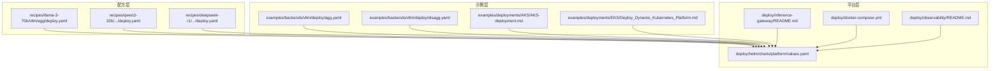
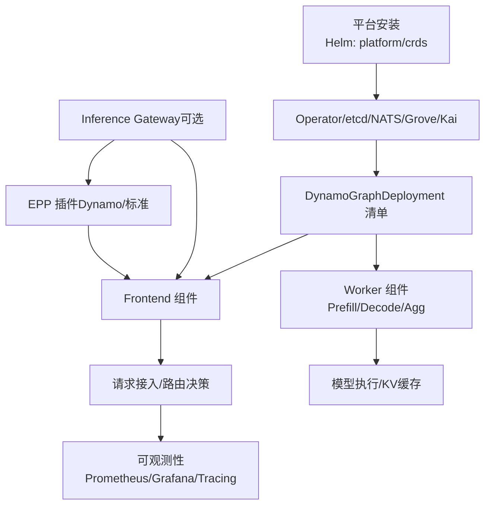
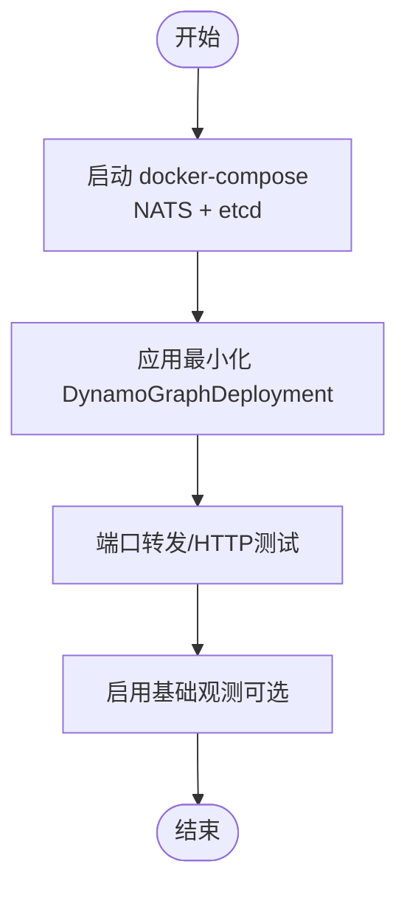
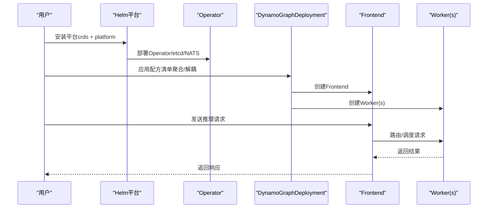
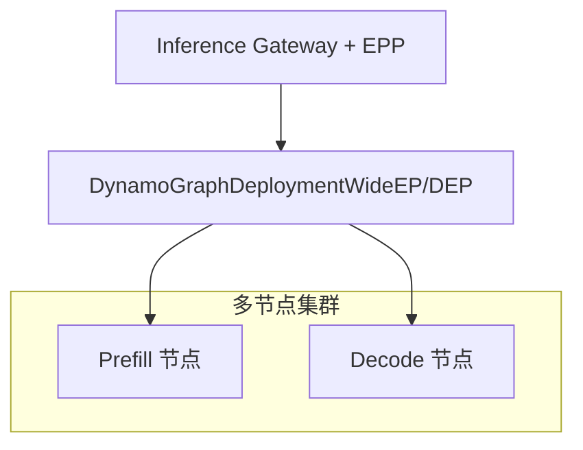
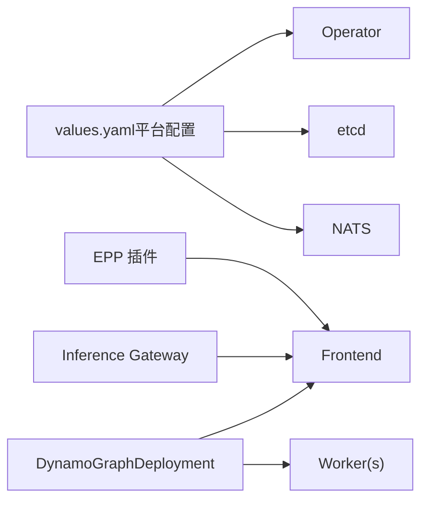

# 配方集锦

<cite>
**本文引用的文件**
- [recipes/README.md](file://recipes/README.md)
- [recipes/llama-3-70b/vllm/agg/deploy.yaml](file://recipes/llama-3-70b/vllm/agg/deploy.yaml)
- [examples/backends/vllm/deploy/agg.yaml](file://examples/backends/vllm/deploy/agg.yaml)
- [examples/backends/vllm/deploy/disagg.yaml](file://examples/backends/vllm/deploy/disagg.yaml)
- [deploy/docker-compose.yml](file://deploy/docker-compose.yml)
- [deploy/helm/README.md](file://deploy/helm/README.md)
- [deploy/helm/charts/platform/values.yaml](file://deploy/helm/charts/platform/values.yaml)
- [deploy/inference-gateway/README.md](file://deploy/inference-gateway/README.md)
- [examples/deployments/AKS/AKS-deployment.md](file://examples/deployments/AKS/AKS-deployment.md)
- [examples/deployments/EKS/Deploy_Dynamo_Kubernetes_Platform.md](file://examples/deployments/EKS/Deploy_Dynamo_Kubernetes_Platform.md)
- [deploy/observability/README.md](file://deploy/observability/README.md)
</cite>

## 目录
1. [简介](#简介)
2. [项目结构](#项目结构)
3. [核心组件](#核心组件)
4. [架构总览](#架构总览)
5. [详细组件分析](#详细组件分析)
6. [依赖关系分析](#依赖关系分析)
7. [性能与成本考量](#性能与成本考量)
8. [故障排查指南](#故障排查指南)
9. [结论](#结论)
10. [附录](#附录)

## 简介
本“配方集锦”面向希望在Kubernetes上快速落地Dynamo推理平台的工程团队，系统性整理了社区贡献的高质量部署配方与最佳实践。内容覆盖从小规模测试环境到中等规模生产环境，以及超大规模推理集群的完整方案；并提供针对不同模型规模、后端框架（vLLM、TensorRT-LLM、SGLang）与部署模式（聚合/解耦、单机/多机、WideEP/DEP）的可复用模板与参数调优建议。读者可据此完成从平台安装、模型部署、路由策略、可观测性到网关集成的全链路落地。

## 项目结构
围绕“配方”的核心目录与文件如下：
- recipes：生产就绪的配方集合，按模型/后端/部署模式组织，包含DynamoGraphDeployment清单、模型缓存PVC与下载作业、基准测试作业等
- examples：示例与演示，涵盖Kubernetes快速入门、多云平台部署步骤、后端示例清单
- deploy：平台级部署与工具，包含Helm图表、本地开发compose、观测性配置、Inference Gateway集成
- docs：官方文档入口，提供设计原理、运维指南、后端特性说明等

**图示来源**
- [recipes/llama-3-70b/vllm/agg/deploy.yaml](file://recipes/llama-3-70b/vllm/agg/deploy.yaml#L1-L55)
- [examples/backends/vllm/deploy/agg.yaml](file://examples/backends/vllm/deploy/agg.yaml#L1-L35)
- [examples/backends/vllm/deploy/disagg.yaml](file://examples/backends/vllm/deploy/disagg.yaml#L1-L56)
- [deploy/helm/charts/platform/values.yaml](file://deploy/helm/charts/platform/values.yaml#L1-L732)
- [deploy/inference-gateway/README.md](file://deploy/inference-gateway/README.md#L1-L415)
- [deploy/docker-compose.yml](file://deploy/docker-compose.yml#L1-L36)
- [deploy/observability/README.md](file://deploy/observability/README.md#L1-L4)

**章节来源**
- [recipes/README.md](file://recipes/README.md#L1-L321)
- [deploy/helm/README.md](file://deploy/helm/README.md#L1-L23)

## 核心组件
- DynamoGraphDeployment：平台核心CRD，描述推理图的拓扑、服务组件、资源配额、镜像版本等
- 平台组件（Helm）：Operator、NATS、etcd、Grove、Kai Scheduler等，通过Helm图表统一安装与管理
- 模型缓存与下载：PVC + Job，确保模型持久化与首次拉取
- 基准与验证：AIPerf等基准作业，用于吞吐/延迟/成本评估
- 网关集成：Inference Gateway（kGateway）与EPP插件，实现路由前移与智能选路

**章节来源**
- [recipes/README.md](file://recipes/README.md#L46-L61)
- [deploy/helm/README.md](file://deploy/helm/README.md#L20-L23)
- [deploy/inference-gateway/README.md](file://deploy/inference-gateway/README.md#L1-L415)

## 架构总览
下图展示从平台安装到模型部署、路由与观测的整体流程，以及可选的Inference Gateway集成路径。

**图示来源**
- [deploy/helm/charts/platform/values.yaml](file://deploy/helm/charts/platform/values.yaml#L19-L28)
- [examples/backends/vllm/deploy/agg.yaml](file://examples/backends/vllm/deploy/agg.yaml#L4-L35)
- [examples/backends/vllm/deploy/disagg.yaml](file://examples/backends/vllm/deploy/disagg.yaml#L4-L56)
- [deploy/inference-gateway/README.md](file://deploy/inference-gateway/README.md#L1-L415)
- [deploy/observability/README.md](file://deploy/observability/README.md#L1-L4)

## 详细组件分析

### 小规模测试环境（本地或单节点）
- 适用场景：本地开发、Demo演示、轻量压测
- 推荐方案：使用docker-compose快速拉起NATS与etcd，结合最小化DynamoGraphDeployment进行验证
- 关键要点：
  - 使用docker-compose提供的NATS与etcd作为内部基础设施
  - 在DynamoGraphDeployment中设置较小的GPU副本数与资源限制
  - 可直接使用examples中的简单聚合示例进行快速验证

**图示来源**
- [deploy/docker-compose.yml](file://deploy/docker-compose.yml#L1-L36)
- [examples/backends/vllm/deploy/agg.yaml](file://examples/backends/vllm/deploy/agg.yaml#L4-L35)

**章节来源**
- [deploy/docker-compose.yml](file://deploy/docker-compose.yml#L1-L36)
- [examples/backends/vllm/deploy/agg.yaml](file://examples/backends/vllm/deploy/agg.yaml#L1-L35)

### 中等规模生产环境（Kubernetes，单集群）
- 适用场景：中小团队、多模型并行、需要可观测性与路由能力
- 推荐方案：Helm安装Dynamo平台，基于recipes中的聚合/解耦配方部署
- 关键要点：
  - 使用Helm图表安装Operator、NATS、etcd等核心组件
  - 选择vLLM/TensorRT-LLM/SGLang之一，并根据模型规模选择聚合或解耦
  - 通过Inference Gateway（可选）提升路由智能化与负载均衡能力
  - 配置模型缓存PVC与下载作业，确保模型可用性

**图示来源**
- [deploy/helm/README.md](file://deploy/helm/README.md#L20-L23)
- [deploy/helm/charts/platform/values.yaml](file://deploy/helm/charts/platform/values.yaml#L19-L28)
- [examples/backends/vllm/deploy/disagg.yaml](file://examples/backends/vllm/deploy/disagg.yaml#L4-L56)

**章节来源**
- [deploy/helm/README.md](file://deploy/helm/README.md#L1-L23)
- [deploy/helm/charts/platform/values.yaml](file://deploy/helm/charts/platform/values.yaml#L19-L28)
- [examples/backends/vllm/deploy/agg.yaml](file://examples/backends/vllm/deploy/agg.yaml#L1-L35)
- [examples/backends/vllm/deploy/disagg.yaml](file://examples/backends/vllm/deploy/disagg.yaml#L1-L56)

### 超大规模推理集群（多节点、WideEP/DEP）
- 适用场景：超大模型（如DeepSeek-R1、GPT-OSS-120B）、高并发、跨节点解耦
- 推荐方案：采用WideEP/DEP解耦架构，按节点角色拆分Prefill/Decode Worker，结合多机部署
- 关键要点：
  - 使用recipes中的WideEP/DEP示例作为模板，调整GPU数量与副本数
  - 明确Prefill/Decode节点的网络与存储规划
  - 结合Inference Gateway与KV感知路由，最大化复用已缓存上下文

**图示来源**
- [recipes/README.md](file://recipes/README.md#L35-L38)
- [deploy/inference-gateway/README.md](file://deploy/inference-gateway/README.md#L1-L415)

**章节来源**
- [recipes/README.md](file://recipes/README.md#L18-L40)
- [deploy/inference-gateway/README.md](file://deploy/inference-gateway/README.md#L1-L415)

### 预配置部署方案对比与选择标准
- 聚合 vs 解耦
  - 聚合：部署简单、延迟低、适合中小模型或低并发
  - 解耦：资源利用率高、扩展性强、适合大模型与高并发
- 后端框架
  - vLLM：生态成熟、易用、默认推荐
  - TensorRT-LLM：推理性能上限高、配置复杂度较高
  - SGLang：实验性特性丰富、适合前沿探索
- 路由模式
  - 轮询：简单直接
  - KV感知：基于缓存命中重用，降低重复计算
- 网关集成
  - Dynamo EPP：将路由前移到网关，结合KV感知算法
  - 标准EPP：黑盒路由，适合单一Dynamo图

**章节来源**
- [recipes/README.md](file://recipes/README.md#L10-L45)
- [deploy/inference-gateway/README.md](file://deploy/inference-gateway/README.md#L1-L415)

### 配置文件与启动脚本清单
- 平台安装
  - Helm图表：platform、crds
  - 关键值：Operator镜像、NATS/etcd开关、发现后端（kubernetes/etcd）
- 模型部署
  - DynamoGraphDeployment清单：Frontend/Worker定义、镜像、资源、环境变量
  - 模型缓存：PVC + 下载Job
- 网关集成
  - Inference Gateway安装与EPP部署
  - 可选：自定义EPP镜像构建与发布
- 观测性
  - Prometheus/Grafana/Tracing配置入口

**章节来源**
- [deploy/helm/charts/platform/values.yaml](file://deploy/helm/charts/platform/values.yaml#L19-L28)
- [examples/backends/vllm/deploy/agg.yaml](file://examples/backends/vllm/deploy/agg.yaml#L4-L35)
- [examples/backends/vllm/deploy/disagg.yaml](file://examples/backends/vllm/deploy/disagg.yaml#L4-L56)
- [deploy/inference-gateway/README.md](file://deploy/inference-gateway/README.md#L113-L140)
- [deploy/observability/README.md](file://deploy/observability/README.md#L1-L4)

## 依赖关系分析
- Helm图表依赖：platform依赖operator、etcd、nats等子组件；crds负责安装CRD
- DynamoGraphDeployment依赖：Frontend负责路由与接入，Worker负责执行；两者通过NATS/etcd通信
- 网关依赖：Inference Gateway需与Dynamo Operator协作，EPP插件与Dynamo前端配合

**图示来源**
- [deploy/helm/charts/platform/values.yaml](file://deploy/helm/charts/platform/values.yaml#L19-L28)
- [examples/backends/vllm/deploy/agg.yaml](file://examples/backends/vllm/deploy/agg.yaml#L4-L35)
- [examples/backends/vllm/deploy/disagg.yaml](file://examples/backends/vllm/deploy/disagg.yaml#L4-L56)
- [deploy/inference-gateway/README.md](file://deploy/inference-gateway/README.md#L1-L415)

**章节来源**
- [deploy/helm/README.md](file://deploy/helm/README.md#L20-L23)
- [deploy/helm/charts/platform/values.yaml](file://deploy/helm/charts/platform/values.yaml#L19-L28)

## 性能与成本考量
- 性能
  - 解耦优于聚合：减少重复prefill，提高吞吐
  - KV感知路由：显著降低重复计算，提升长上下文场景性能
  - 多机WideEP/DEP：水平扩展Decode节点，满足高并发
- 成本
  - GPU利用率：解耦与KV复用可提升利用率
  - 存储与网络：模型缓存PVC与跨节点通信开销需纳入预算
  - 运维成本：Inference Gateway与Operator维护、升级与监控

[本节为通用指导，不直接分析具体文件]

## 故障排查指南
- 平台安装
  - Helm安装失败：检查镜像拉取密钥、命名空间、存储类
  - Operator未就绪：查看Pod日志与事件，确认NATS/etcd连通性
- 模型部署
  - Pod Pending：检查GPU节点、资源配额、存储类
  - 模型下载失败：校验HF Token、网络连通性、Job日志
  - Worker启动异常：核对驱动/CUDA版本、镜像标签、私有仓库凭据
- 网关集成
  - EPP无法选择最优Worker：检查KV块大小、路由阈值、是否启用KV事件
  - 请求路由错误：确认HttpRoute与InferencePool配置一致

**章节来源**
- [recipes/README.md](file://recipes/README.md#L272-L294)
- [deploy/inference-gateway/README.md](file://deploy/inference-gateway/README.md#L366-L394)

## 结论
通过recipes与examples提供的标准化配方，结合Helm平台与Inference Gateway，可在不同规模与场景下快速落地Dynamo推理平台。建议以聚合方案起步，逐步过渡到解耦与多机WideEP/DEP，并引入KV感知路由与网关集成以获得更好的性能与可运维性。

[本节为总结性内容，不直接分析具体文件]

## 附录

### 多云平台部署速查
- AKS：GPU节点池、GPU Operator、Dynamo Operator、验证Pod状态
- EKS：从源码构建镜像、ECR推送、Helm安装平台、验证Pod状态

**章节来源**
- [examples/deployments/AKS/AKS-deployment.md](file://examples/deployments/AKS/AKS-deployment.md#L1-L79)
- [examples/deployments/EKS/Deploy_Dynamo_Kubernetes_Platform.md](file://examples/deployments/EKS/Deploy_Dynamo_Kubernetes_Platform.md#L1-L96)

### 参考配方清单（路径）
- Llama-3-70B vLLM 聚合：[recipes/llama-3-70b/vllm/agg/deploy.yaml](file://recipes/llama-3-70b/vllm/agg/deploy.yaml)
- Qwen3-32B vLLM 解耦：[recipes/qwen3-32b/.../deploy.yaml](file://recipes/README.md#L56-L60)
- DeepSeek-R1 TRT-LLM WideEP：[recipes/deepseek-r1/.../deploy.yaml](file://recipes/README.md#L35-L38)
- 示例聚合/解耦清单：
  - [examples/backends/vllm/deploy/agg.yaml](file://examples/backends/vllm/deploy/agg.yaml)
  - [examples/backends/vllm/deploy/disagg.yaml](file://examples/backends/vllm/deploy/disagg.yaml)