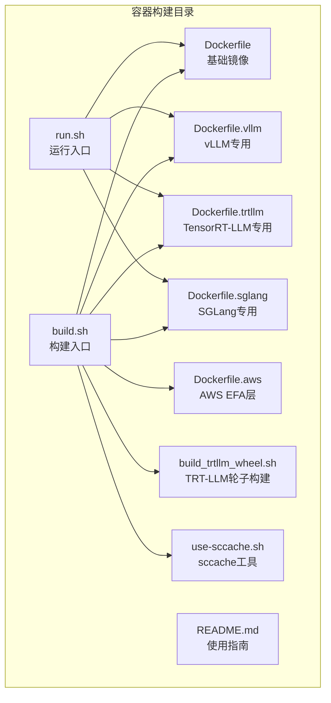
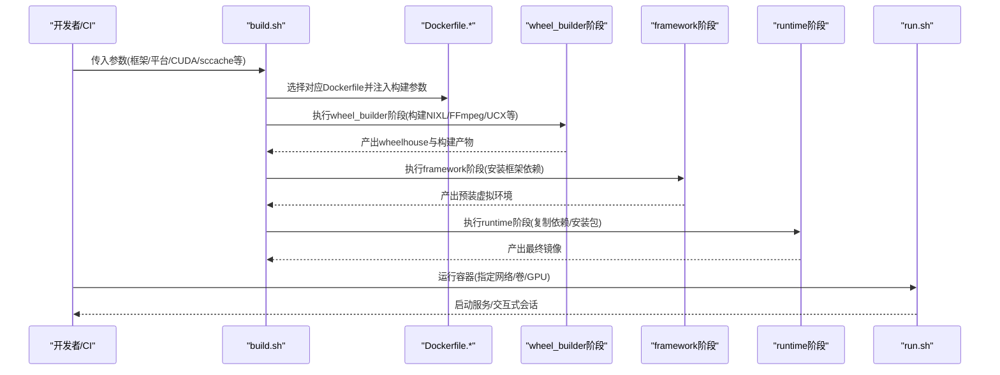
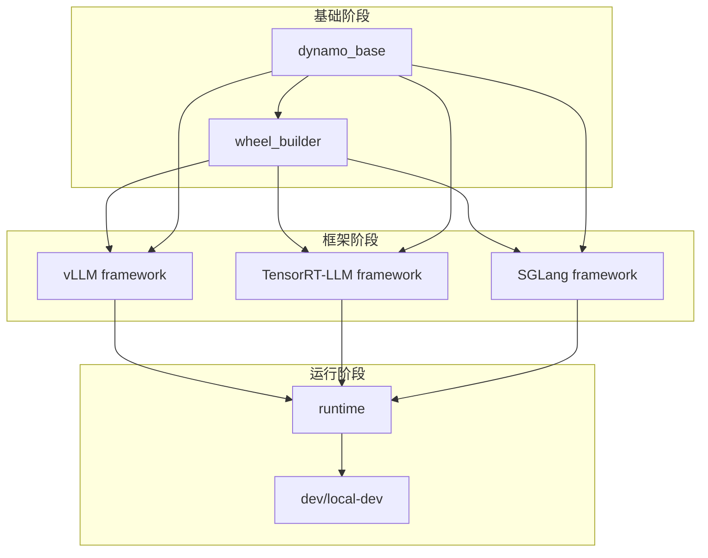
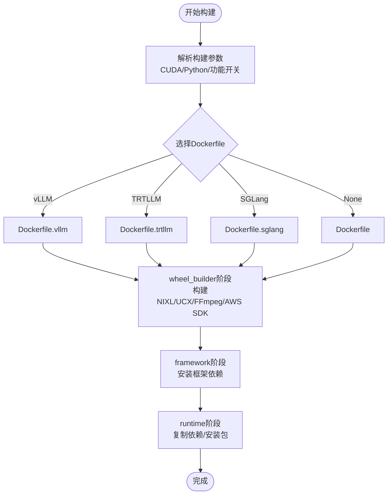
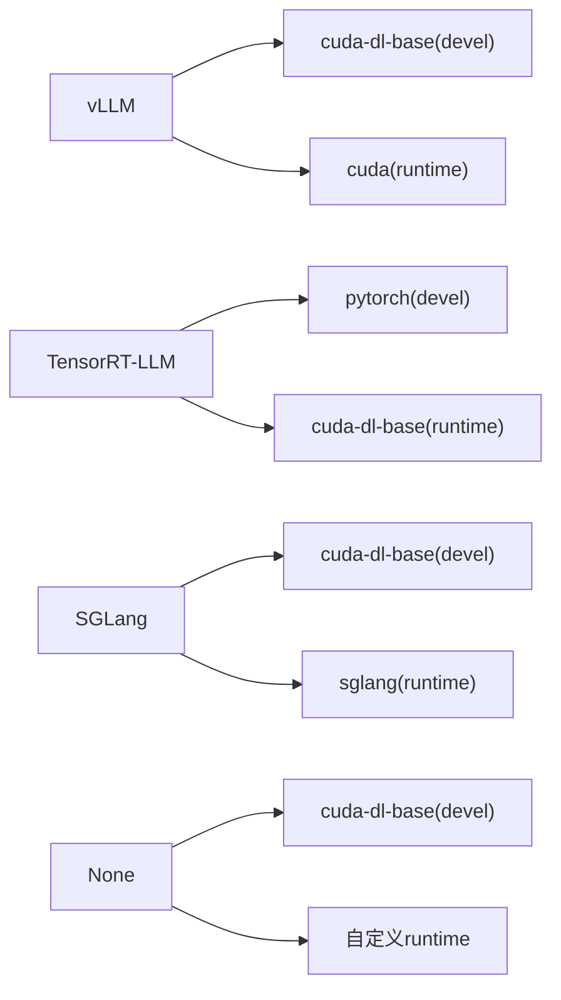

# Docker镜像构建

<cite>
**本文档引用的文件**
- [Dockerfile](file://container/Dockerfile)
- [Dockerfile.vllm](file://container/Dockerfile.vllm)
- [Dockerfile.trtllm](file://container/Dockerfile.trtllm)
- [Dockerfile.sglang](file://container/Dockerfile.sglang)
- [Dockerfile.aws](file://container/Dockerfile.aws)
- [build.sh](file://container/build.sh)
- [build_trtllm_wheel.sh](file://container/build_trtllm_wheel.sh)
- [use-sccache.sh](file://container/use-sccache.sh)
- [run.sh](file://container/run.sh)
- [README.md](file://container/README.md)
</cite>

## 目录
1. [简介](#简介)
2. [项目结构](#项目结构)
3. [核心组件](#核心组件)
4. [架构总览](#架构总览)
5. [详细组件分析](#详细组件分析)
6. [依赖关系分析](#依赖关系分析)
7. [性能考虑](#性能考虑)
8. [故障排除指南](#故障排除指南)
9. [结论](#结论)
10. [附录](#附录)

## 简介
本文件面向Dynamo项目的Docker镜像构建，系统性阐述多阶段构建架构与各阶段职责，对比不同推理框架专用Dockerfile的差异与特性，详解构建参数配置（CUDA版本选择、Python环境、系统库依赖），解析构建缓存策略、sccache优化与增量构建机制，并提供完整的构建脚本使用指南（开发环境、生产环境与CI/CD集成），最后给出构建故障排查、性能优化与镜像大小控制的最佳实践。

## 项目结构
容器化构建相关的核心文件位于`container/`目录，包含：
- 多个Dockerfile：基础镜像与各推理框架专用镜像
- 构建脚本：集中式构建入口与TRT-LLM轮子构建脚本
- 运行脚本：容器运行时管理
- sccache辅助脚本：安装与统计
- AWS EFA支持层：在现有镜像基础上叠加EFA能力

**图表来源**
- [Dockerfile](file://container/Dockerfile#L1-L655)
- [Dockerfile.vllm](file://container/Dockerfile.vllm#L1-L864)
- [Dockerfile.trtllm](file://container/Dockerfile.trtllm#L1-L885)
- [Dockerfile.sglang](file://container/Dockerfile.sglang#L1-L600)
- [Dockerfile.aws](file://container/Dockerfile.aws#L1-L91)
- [build.sh](file://container/build.sh#L1-L1140)
- [build_trtllm_wheel.sh](file://container/build_trtllm_wheel.sh#L1-L122)
- [use-sccache.sh](file://container/use-sccache.sh#L1-L87)
- [run.sh](file://container/run.sh#L1-L412)
- [README.md](file://container/README.md#L1-L411)

**章节来源**
- [README.md](file://container/README.md#L1-L411)

## 核心组件
- 多阶段构建架构：统一的dynamo_base、wheel_builder、runtime等阶段在多个Dockerfile中复用，确保层缓存与去重。
- 推理框架专用镜像：vLLM、TensorRT-LLM、SGLang各自定义framework阶段与runtime阶段，满足不同框架的依赖与运行需求。
- 构建脚本：集中处理框架选择、CUDA版本、sccache、缓存、标签生成与AWS EFA扩展。
- 运行脚本：封装GPU访问、网络模式、卷挂载、用户权限等运行时配置。
- sccache优化：通过use-sccache.sh实现二进制安装与统计输出，提升编译缓存命中率。

**章节来源**
- [Dockerfile](file://container/Dockerfile#L1-L655)
- [Dockerfile.vllm](file://container/Dockerfile.vllm#L1-L864)
- [Dockerfile.trtllm](file://container/Dockerfile.trtllm#L1-L885)
- [Dockerfile.sglang](file://container/Dockerfile.sglang#L1-L600)
- [build.sh](file://container/build.sh#L1-L1140)
- [use-sccache.sh](file://container/use-sccache.sh#L1-L87)
- [run.sh](file://container/run.sh#L1-L412)

## 架构总览
Dynamo的容器构建采用“共享基础层 + 框架特化层”的多阶段设计，核心流程如下：

**图表来源**
- [build.sh](file://container/build.sh#L580-L601)
- [Dockerfile](file://container/Dockerfile#L108-L452)
- [Dockerfile.vllm](file://container/Dockerfile.vllm#L500-L800)
- [Dockerfile.trtllm](file://container/Dockerfile.trtllm#L480-L885)
- [Dockerfile.sglang](file://container/Dockerfile.sglang#L460-L600)
- [run.sh](file://container/run.sh#L380-L412)

## 详细组件分析

### 多阶段构建架构
- dynamo_base：安装uv、NATS、etcd、Rust工具链，准备CUDA与HPCX配置，为后续阶段提供基础环境。
- wheel_builder：基于manylinux镜像，安装GCC工具集、Protobuf、RDMA/UCX、gdrcopy、FFmpeg、AWS SDK C++等，构建NIXL与Dynamo轮子，产出wheelhouse与构建产物。
- framework：针对特定框架安装依赖（如vLLM的FlashInfer、DeepGEMM；TRT-LLM的PyTorch与TensorRT；SGLang的Python包），生成预装虚拟环境。
- runtime：从runtime镜像开始，复制CUDA、NATS、etcd、UCX、NIXL、wheelhouse与虚拟环境，安装Dynamo运行时包，设置非root用户与启动入口。
- dev/local-dev：在runtime基础上叠加开发工具、编辑器、Rust工具链与源码，支持交互式开发与调试。

**图表来源**
- [Dockerfile](file://container/Dockerfile#L63-L452)
- [Dockerfile.vllm](file://container/Dockerfile.vllm#L90-L800)
- [Dockerfile.trtllm](file://container/Dockerfile.trtllm#L96-L885)
- [Dockerfile.sglang](file://container/Dockerfile.sglang#L77-L600)

**章节来源**
- [Dockerfile](file://container/Dockerfile#L63-L452)
- [Dockerfile.vllm](file://container/Dockerfile.vllm#L90-L800)
- [Dockerfile.trtllm](file://container/Dockerfile.trtllm#L96-L885)
- [Dockerfile.sglang](file://container/Dockerfile.sglang#L77-L600)

### 不同推理框架专用Dockerfile的差异与特点
- vLLM专用镜像
  - 特点：集成FlashInfer、DeepGEMM优化，CUDA版本随框架选择动态调整，支持CUDA 13路径。
  - 依赖：vLLM、flashinfer、DeepGEMM、NVIDIA NCCL/CuDNN等。
  - 运行时：预拷贝CUDA开发工具、NATS/etcd、UCX/NIXL、wheelhouse，安装Dynamo与基准测试依赖。
- TensorRT-LLM专用镜像
  - 特点：从NGC PyTorch镜像继承CUDA/NCCL/PyTorch生态，通过自定义wheel或NGC镜像安装TensorRT-LLM，解决ABI兼容问题。
  - 依赖：PyTorch、Triton、NCCL、CUDA工具链、OpenMPI/HPCX、cuSPARSELt等。
  - 运行时：复制CUDA、NATS/etcd、UCX/NIXL、wheelhouse，安装Dynamo与测试依赖。
- SGLang专用镜像
  - 特点：基于上游SGLang runtime镜像，安装Dynamo与NIXL，自动安装CUDA对应版本的NCCL/CuDNN。
  - 依赖：SGLang、NVIDIA NCCL/CuDNN、Python包。
  - 运行时：安装Dynamo、NIXL、SGlang，设置强制关闭请求标志，适配非root用户。

**章节来源**
- [Dockerfile.vllm](file://container/Dockerfile.vllm#L500-L800)
- [Dockerfile.trtllm](file://container/Dockerfile.trtllm#L480-L885)
- [Dockerfile.sglang](file://container/Dockerfile.sglang#L460-L600)

### 构建参数配置
- 基础镜像与标签
  - 通过build.sh选择框架对应的BASE_IMAGE与BASE_IMAGE_TAG，CUDA版本可通过--cuda-version覆盖默认值。
- Python与Rust环境
  - Python版本固定为3.12；Rust版本1.90.0，目标架构由ARCH/ARCH_ALT决定。
- CUDA与框架版本
  - vLLM：CUDA 12.9或13.0路径；TRT-LLM：CUDA 13.1路径；SGLang：CUDA 12.9或13.0路径。
- 功能开关
  - KVBM、GPU内存服务、媒体处理（NIXL/FFMPEG）可按需启用。
- sccache配置
  - 需要S3桶与区域，脚本自动下载对应架构的sccache二进制并设置包装器。

**章节来源**
- [build.sh](file://container/build.sh#L146-L502)
- [Dockerfile](file://container/Dockerfile#L24-L51)
- [Dockerfile.vllm](file://container/Dockerfile.vllm#L73-L85)
- [Dockerfile.trtllm](file://container/Dockerfile.trtllm#L44-L66)
- [Dockerfile.sglang](file://container/Dockerfile.sglang#L44-L57)

### 构建缓存策略、sccache优化与增量构建
- 层缓存复用
  - 多个Dockerfile共享dynamo_base与wheel_builder阶段，确保相同依赖只构建一次。
- sccache优化
  - 在wheel_builder与framework阶段启用sccache，对C/C++/Rust编译进行缓存；use-sccache.sh负责安装与统计展示。
- 增量构建
  - 通过分层安装系统依赖、源码复制顺序与wheelhouse复用，减少无关变更导致的重建。
- 缓存输入
  - build.sh支持--cache-from/--cache-to与--no-cache，便于CI/CD集成与本地加速。

**图表来源**
- [build.sh](file://container/build.sh#L580-L601)
- [Dockerfile](file://container/Dockerfile#L108-L452)
- [Dockerfile.vllm](file://container/Dockerfile.vllm#L500-L800)
- [Dockerfile.trtllm](file://container/Dockerfile.trtllm#L480-L885)
- [Dockerfile.sglang](file://container/Dockerfile.sglang#L460-L600)

**章节来源**
- [use-sccache.sh](file://container/use-sccache.sh#L1-L87)
- [build.sh](file://container/build.sh#L318-L343)

### 完整构建脚本使用指南
- 开发环境构建
  - 使用--target local-dev或dev，结合--mount-workspace挂载工作区，推荐非root用户开发。
- 生产环境构建
  - 使用--target runtime，镜像以非root用户运行，适合部署。
- CI/CD集成
  - 支持--cache-from/--cache-to、--no-cache、--push、--dry-run等参数，便于流水线复用缓存与推送镜像。
- AWS EFA集成
  - 通过--make-efa在runtime或dev基础上叠加EFA支持，自动安装aws-ofi-nccl与libfabric。

**章节来源**
- [build.sh](file://container/build.sh#L504-L568)
- [Dockerfile.aws](file://container/Dockerfile.aws#L1-L91)
- [README.md](file://container/README.md#L115-L222)

## 依赖关系分析
- 框架到基础镜像映射
  - vLLM → cuda-dl-base(devel) + cuda(runtime)
  - TRT-LLM → pytorch(devel) + cuda-dl-base(runtime)
  - SGLang → cuda-dl-base(devel) + sglang(runtime)
  - None → cuda-dl-base(devel) + 自定义runtime
- 依赖传递
  - wheel_builder阶段构建NIXL/UCX/FFmpeg/AWS SDK，runtime阶段复制至最终镜像。
  - framework阶段安装框架特定依赖（如vLLM的flashinfer、TRT-LLM的PyTorch/Triton）。

**图表来源**
- [build.sh](file://container/build.sh#L124-L144)

**章节来源**
- [build.sh](file://container/build.sh#L124-L144)

## 性能考虑
- 编译性能
  - 合理设置CARGO_BUILD_JOBS与MAX_JOBS，利用多核并行；启用sccache显著降低重复编译时间。
- 运行性能
  - CUDA设备序号与驱动能力配置，避免NVML参数不一致导致的错误；正确链接CUDA库符号。
- 镜像大小控制
  - 分层安装系统依赖，仅复制必要文件；使用manylinux镜像构建wheel并auditwheel修复；移除不必要的开发包与调试符号。

[本节为通用指导，无需具体文件分析]

## 故障排除指南
- CUDA版本不匹配
  - 症状：编译或运行时报CUDA库找不到/符号不匹配。
  - 处理：确认--cuda-version与框架默认值一致；检查wheel_builder中的CUDA路径与runtime镜像CUDA版本。
- sccache未生效
  - 症状：编译时间长，缓存命中率低。
  - 处理：确认--use-sccache、--sccache-bucket、--sccache-region已设置；检查AWS凭证；查看use-sccache.sh统计输出。
- 权限问题（非root）
  - 症状：容器内写入失败或组权限不足。
  - 处理：使用--mount-workspace挂载宿主机目录；确保umask 002生效；必要时--user指定UID/GID。
- EFA安装失败
  - 症状：aws-ofi-nccl安装报错或无法发现RDMA设备。
  - 处理：确认Docker运行时具备必要内核模块与ulimit配置；检查EFA版本与内核匹配。

**章节来源**
- [build.sh](file://container/build.sh#L494-L501)
- [use-sccache.sh](file://container/use-sccache.sh#L53-L60)
- [run.sh](file://container/run.sh#L317-L338)
- [Dockerfile.aws](file://container/Dockerfile.aws#L37-L47)

## 结论
Dynamo的容器构建通过多阶段架构实现了高度复用与可维护性，配合build.sh集中化参数管理与sccache优化，既满足开发效率也兼顾生产部署需求。不同推理框架的专用Dockerfile在共享基础之上实现差异化定制，确保框架依赖与运行时环境的精确控制。建议在CI/CD中充分利用缓存与并行构建，在生产环境中坚持非root运行与最小化镜像策略。

[本节为总结，无需具体文件分析]

## 附录

### 构建与运行命令示例
- 构建vLLM开发镜像
  - ./build.sh --framework vllm --target local-dev
- 构建TensorRT-LLM生产镜像
  - ./build.sh --framework trtllm --target runtime
- 运行非root容器
  - ./run.sh --image dynamo:latest-vllm-runtime -v $HOME/.cache:/home/dynamo/.cache
- 启用sccache（CI场景）
  - ./build.sh --use-sccache --sccache-bucket your-bucket --sccache-region us-west-2

**章节来源**
- [README.md](file://container/README.md#L115-L273)
- [build.sh](file://container/build.sh#L504-L568)