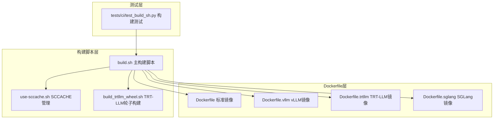
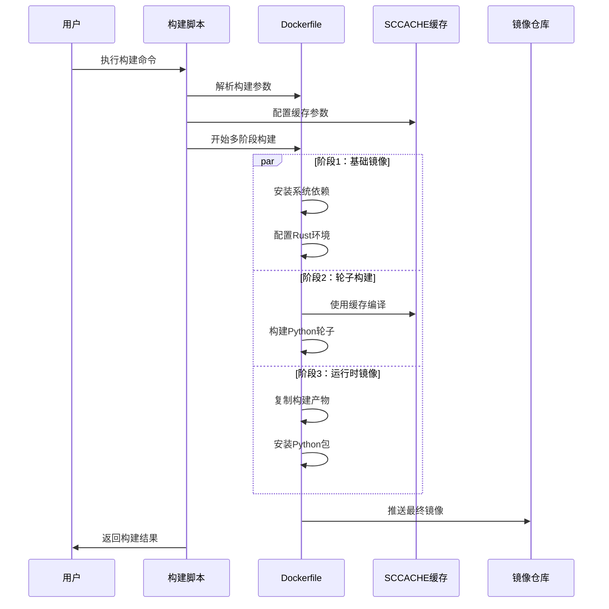
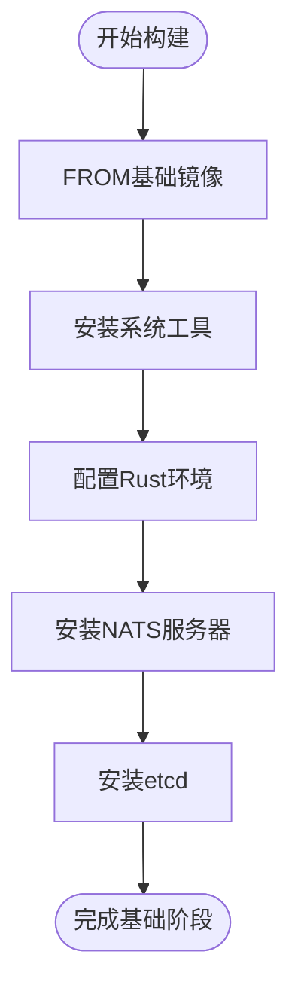
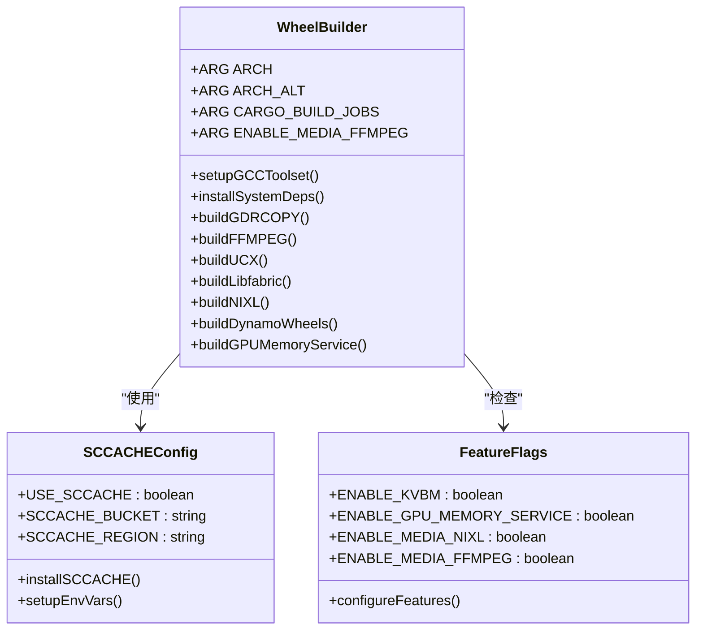
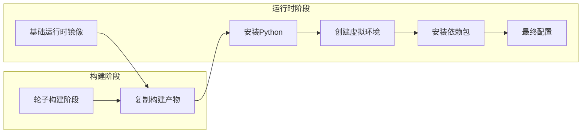
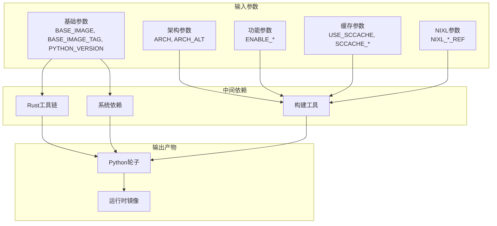
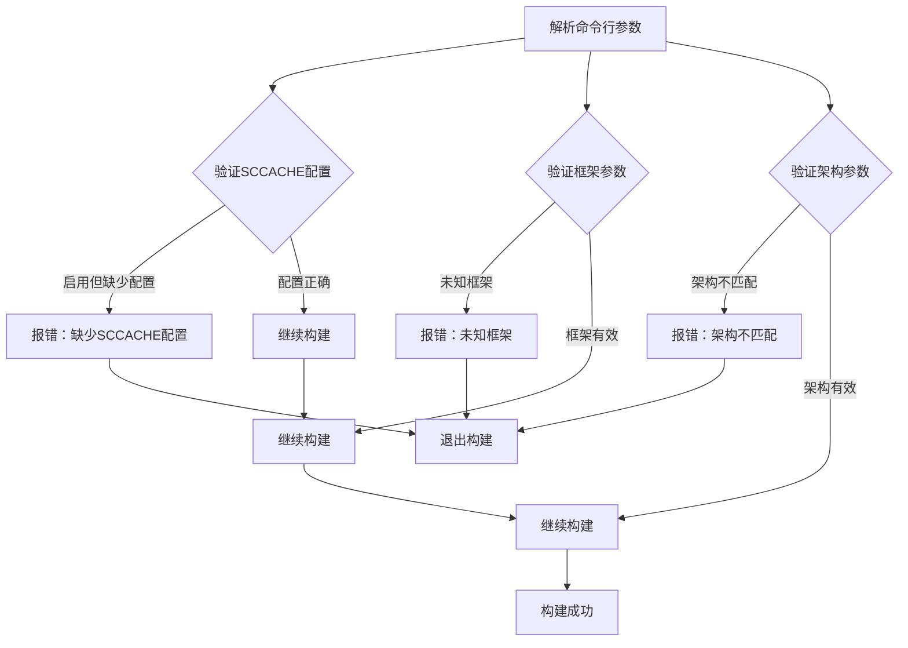

# 构建参数配置

<cite>
**本文档引用的文件**
- [container/Dockerfile](file://container/Dockerfile)
- [container/Dockerfile.vllm](file://container/Dockerfile.vllm)
- [container/Dockerfile.trtllm](file://container/Dockerfile.trtllm)
- [container/Dockerfile.sglang](file://container/Dockerfile.sglang)
- [container/build.sh](file://container/build.sh)
- [container/use-sccache.sh](file://container/use-sccache.sh)
- [container/build_trtllm_wheel.sh](file://container/build_trtllm_wheel.sh)
- [tests/ci/test_build_sh.py](file://tests/ci/test_build_sh.py)
- [container/deps/requirements.txt](file://container/deps/requirements.txt)
</cite>

## 目录
1. [简介](#简介)
2. [项目结构](#项目结构)
3. [核心组件](#核心组件)
4. [架构概览](#架构概览)
5. [详细组件分析](#详细组件分析)
6. [依赖关系分析](#依赖关系分析)
7. [性能考虑](#性能考虑)
8. [故障排除指南](#故障排除指南)
9. [结论](#结论)

## 简介

本文档详细介绍了Dynamo项目的Docker构建参数配置，涵盖了所有构建参数的作用、默认值和使用场景。Dynamo是一个高性能的推理服务框架，支持多种后端引擎（vLLM、TensorRT-LLM、SGLang），并通过容器化构建实现跨平台部署。

该构建系统采用多阶段Docker构建，支持多种架构（x86_64和ARM64/aarch64），并集成了SCCACHE缓存优化、NIXL网络加速库以及媒体处理功能。构建参数主要分为以下几类：

- 基础镜像参数：BASE_IMAGE、BASE_IMAGE_TAG
- Python版本配置：PYTHON_VERSION
- 功能开关参数：ENABLE_KVBM、ENABLE_GPU_MEMORY_SERVICE、ENABLE_MEDIA_NIXL、ENABLE_MEDIA_FFMPEG
- 架构参数：ARCH、ARCH_ALT
- 缓存配置参数：USE_SCCACHE、SCCACHE_BUCKET、SCCACHE_REGION
- NIXL相关参数：NIXL_UCX_REF、NIXL_REF、NIXL_GDRCOPY_REF、NIXL_LIBFABRIC_REF
- 性能参数：CARGO_BUILD_JOBS

## 项目结构

Dynamo的构建系统采用模块化设计，主要包含以下关键组件：

**图表来源**
- [container/build.sh](file://container/build.sh#L1-L1140)
- [container/Dockerfile](file://container/Dockerfile#L1-L655)
- [container/Dockerfile.vllm](file://container/Dockerfile.vllm#L1-L864)
- [container/Dockerfile.trtllm](file://container/Dockerfile.trtllm#L1-L885)
- [container/Dockerfile.sglang](file://container/Dockerfile.sglang#L1-L600)

## 核心组件

### 基础镜像参数

| 参数名 | 类型 | 默认值 | 作用描述 |
|--------|------|--------|----------|
| BASE_IMAGE | 字符串 | 无（必需） | 指定基础镜像名称 |
| BASE_IMAGE_TAG | 字符串 | 无（必需） | 指定基础镜像标签 |
| EPP_IMAGE | 字串 | us-central1-docker.pkg.dev/k8s-staging-images/gateway-api-inference-extension/epp:v0.5.1 | 前端入口点镜像 |

基础镜像参数是构建过程中的关键输入，必须在构建时明确指定。不同的后端框架使用不同的基础镜像：

- **vLLM框架**：nvcr.io/nvidia/cuda-dl-base:25.06-cuda12.9-devel-ubuntu24.04
- **TensorRT-LLM框架**：nvcr.io/nvidia/pytorch:25.12-py3
- **SGLang框架**：nvcr.io/nvidia/cuda-dl-base:25.06-cuda12.9-devel-ubuntu24.04
- **None框架**：nvcr.io/nvidia/cuda-dl-base:25.01-cuda12.8-devel-ubuntu24.04

### Python版本配置

| 参数名 | 类型 | 默认值 | 作用描述 |
|--------|------|--------|----------|
| PYTHON_VERSION | 字符串 | 3.12 | 指定Python版本 |

Python版本配置影响整个构建环境的一致性，包括系统Python、虚拟环境以及各种依赖包的兼容性。

### 功能开关参数

| 参数名 | 类型 | 默认值 | 作用描述 | 使用场景 |
|--------|------|--------|----------|----------|
| ENABLE_KVBM | 布尔值 | false | 启用KV缓存块管理器 | 需要KV缓存优化的场景 |
| ENABLE_GPU_MEMORY_SERVICE | 布尔值 | false | 启用GPU内存服务 | 需要GPU内存管理的场景 |
| ENABLE_MEDIA_NIXL | 布尔值 | false | 启用NIXL媒体处理 | 需要高性能媒体处理的场景 |
| ENABLE_MEDIA_FFMPEG | 布尔值 | false | 启用FFMPEG媒体处理 | 需要FFMPEG功能的场景 |

这些功能开关通过条件编译控制，只在启用时进行相应的构建和安装。

### 架构参数

| 参数名 | 类型 | 默认值 | 作用描述 | 支持架构 |
|--------|------|--------|----------|----------|
| ARCH | 字符串 | amd64 | 包装后缀标识（amd64/arm64） | amd64/arm64 |
| ARCH_ALT | 字符串 | x86_64 | Rust目标和manylinux后缀 | x86_64/aarch64 |

架构参数确保了跨平台构建的兼容性，特别是在ARM64/aarch64平台上的支持。

### SCCACHE缓存配置

| 参数名 | 类型 | 默认值 | 作用描述 |
|--------|------|--------|----------|
| USE_SCCACHE | 布尔值 | false | 启用SCCACHE缓存 |
| SCCACHE_BUCKET | 字符串 | 空字符串 | S3存储桶名称 |
| SCCACHE_REGION | 字符串 | 空字符串 | S3区域 |

SCCACHE通过分布式缓存显著提升编译性能，特别适用于频繁的增量构建。

### NIXL相关参数

| 参数名 | 类型 | 默认值 | 作用描述 |
|--------|------|--------|----------|
| NIXL_UCX_REF | 字符串 | 1.20.0 | UCX版本引用 |
| NIXL_REF | 字符串 | 0.9.0 | NIXL主版本 |
| NIXL_GDRCOPY_REF | 字符串 | v2.5.1 | GDRCOPY版本 |
| NIXL_LIBFABRIC_REF | 字符串 | v2.3.0 | Libfabric版本 |

这些参数控制NIXL网络加速库的各个组件版本，确保网络通信的稳定性和性能。

### 构建作业数

| 参数名 | 类型 | 默认值 | 作用描述 |
|--------|------|--------|----------|
| CARGO_BUILD_JOBS | 整数 | 16 | Rust编译并行作业数 |

构建作业数直接影响编译速度和资源消耗，在多核环境中可以适当增加以提升性能。

**章节来源**
- [container/Dockerfile](file://container/Dockerfile#L24-L57)
- [container/Dockerfile.vllm](file://container/Dockerfile.vllm#L39-L71)
- [container/Dockerfile.trtllm](file://container/Dockerfile.trtllm#L34-L65)
- [container/Dockerfile.sglang](file://container/Dockerfile.sglang#L34-L71)
- [container/build.sh](file://container/build.sh#L146-L151)
- [container/build.sh](file://container/build.sh#L162-L166)
- [container/build.sh](file://container/build.sh#L168-L172)

## 架构概览

Dynamo的构建架构采用多阶段Docker构建模式，确保构建过程的模块化和可维护性：

**图表来源**
- [container/build.sh](file://container/build.sh#L581-L601)
- [container/Dockerfile](file://container/Dockerfile#L108-L451)
- [container/use-sccache.sh](file://container/use-sccache.sh#L37-L51)

## 详细组件分析

### 基础镜像阶段分析

基础镜像阶段负责设置基本的运行环境和工具链：

**图表来源**
- [container/Dockerfile](file://container/Dockerfile#L63-L104)
- [container/Dockerfile.vllm](file://container/Dockerfile.vllm#L90-L131)
- [container/Dockerfile.trtllm](file://container/Dockerfile.trtllm#L96-L137)
- [container/Dockerfile.sglang](file://container/Dockerfile.sglang#L77-L118)

### 轮子构建阶段分析

轮子构建阶段是整个构建过程的核心，负责编译和打包所有组件：

**图表来源**
- [container/Dockerfile](file://container/Dockerfile#L113-L451)
- [container/Dockerfile.vllm](file://container/Dockerfile.vllm#L140-L498)
- [container/Dockerfile.trtllm](file://container/Dockerfile.trtllm#L146-L479)
- [container/Dockerfile.sglang](file://container/Dockerfile.sglang#L127-L459)

### 运行时镜像阶段分析

运行时镜像阶段专注于创建轻量级的生产环境：

**图表来源**
- [container/Dockerfile](file://container/Dockerfile#L454-L547)
- [container/Dockerfile.vllm](file://container/Dockerfile.vllm#L606-L800)
- [container/Dockerfile.trtllm](file://container/Dockerfile.trtllm#L641-L885)
- [container/Dockerfile.sglang](file://container/Dockerfile.sglang#L465-L600)

**章节来源**
- [container/Dockerfile](file://container/Dockerfile#L63-L547)
- [container/Dockerfile.vllm](file://container/Dockerfile.vllm#L90-L800)
- [container/Dockerfile.trtllm](file://container/Dockerfile.trtllm#L96-L885)
- [container/Dockerfile.sglang](file://container/Dockerfile.sglang#L77-L600)

## 依赖关系分析

### 构建参数依赖关系

**图表来源**
- [container/build.sh](file://container/build.sh#L173-L501)
- [container/Dockerfile](file://container/Dockerfile#L24-L57)

### 版本兼容性矩阵

| 组件 | 支持CUDA版本 | 推荐Python版本 | 关键依赖版本 |
|------|-------------|---------------|-------------|
| vLLM框架 | 12.9, 13.0 | 3.12 | v0.14.1, v0.5.3 |
| TensorRT-LLM | 13.1 | 3.12 | 1.3.0rc1 |
| SGLang框架 | 12.9, 13.0 | 3.12 | v0.5.8 |
| 标准框架 | 12.8, 12.9, 13.0 | 3.12 | 最新稳定版 |

**章节来源**
- [container/build.sh](file://container/build.sh#L124-L144)
- [container/Dockerfile.vllm](file://container/Dockerfile.vllm#L78-L84)
- [container/Dockerfile.trtllm](file://container/Dockerfile.trtllm#L44-L54)
- [container/Dockerfile.sglang](file://container/Dockerfile.sglang#L44-L45)

## 性能考虑

### SCCACHE缓存优化策略

SCCACHE通过以下方式提升构建性能：

1. **分布式缓存**：利用S3存储桶实现跨机器的缓存共享
2. **智能命中**：基于源码哈希的精确缓存命中
3. **增量构建**：支持快速的增量编译

缓存配置最佳实践：
- 设置合适的SCCACHE_S3_KEY_PREFIX区分不同架构
- 在CI/CD环境中启用缓存以提升构建速度
- 定期清理过期缓存以释放存储空间

### 并行构建优化

构建作业数（CARGO_BUILD_JOBS）对性能的影响：

| 作业数 | 内存消耗 | CPU利用率 | 适用场景 |
|--------|----------|-----------|----------|
| 1-4 | 低 | 20-40% | 低配服务器 |
| 5-8 | 中等 | 60-80% | 开发工作站 |
| 9-16 | 高 | 80-100% | 高配服务器 |
| >16 | 很高 | 100% | 专用构建集群 |

### 架构特定优化

ARM64/aarch64平台的特殊考虑：
- 使用ARCH=arm64和ARCH_ALT=aarch64参数
- 注意某些依赖包的ARM64兼容性
- 调整并行度以适应硬件限制

**章节来源**
- [container/use-sccache.sh](file://container/use-sccache.sh#L10-L10)
- [container/Dockerfile](file://container/Dockerfile#L128-L128)
- [container/build.sh](file://container/build.sh#L581-L586)

## 故障排除指南

### 常见构建错误及解决方案

| 错误类型 | 错误信息 | 可能原因 | 解决方案 |
|----------|----------|----------|----------|
| 缓存配置错误 | SCCACHE_BUCKET/REGION缺失 | 未正确配置SCCACHE | 添加--sccache-bucket和--sccache-region参数 |
| CUDA版本不匹配 | Invalid CUDA_MAJOR | CUDA版本与期望不符 | 检查CUDA版本并调整基础镜像 |
| 架构不兼容 | Unsupported architecture | 架构参数配置错误 | 确保ARCH和ARCH_ALT匹配 |
| 权限问题 | Permission denied | 文件权限设置错误 | 检查用户ID和组ID配置 |
| 依赖冲突 | 依赖版本冲突 | 依赖版本不兼容 | 更新requirements.txt或调整版本约束 |

### 参数验证机制

构建脚本提供了完整的参数验证：

**图表来源**
- [container/build.sh](file://container/build.sh#L493-L501)
- [container/build.sh](file://container/build.sh#L433-L436)
- [container/build.sh](file://container/build.sh#L570-L577)

### 调试技巧

1. **Dry Run模式**：使用--dry-run参数预览构建命令
2. **详细日志**：添加--verbose参数获取更多调试信息
3. **缓存统计**：使用use-sccache.sh show-stats查看缓存使用情况
4. **分阶段构建**：使用--target参数仅构建特定阶段

**章节来源**
- [container/build.sh](file://container/build.sh#L529-L568)
- [container/use-sccache.sh](file://container/use-sccache.sh#L53-L60)
- [tests/ci/test_build_sh.py](file://tests/ci/test_build_sh.py#L166-L465)

## 结论

Dynamo的Docker构建参数配置系统设计精良，具有以下特点：

1. **模块化设计**：通过多阶段构建实现清晰的职责分离
2. **跨平台支持**：全面支持x86_64和ARM64/aarch64架构
3. **性能优化**：集成SCCACHE缓存和并行构建机制
4. **灵活配置**：丰富的功能开关满足不同使用场景
5. **严格验证**：完善的参数验证和错误处理机制

推荐的最佳实践：
- 在生产环境中启用SCCACHE缓存以提升构建效率
- 根据硬件配置合理设置CARGO_BUILD_JOBS参数
- 使用架构参数确保跨平台兼容性
- 定期更新NIXL相关参数以获得最新功能和性能改进
- 建立完善的测试流程验证构建配置的正确性

通过合理配置这些构建参数，可以显著提升Dynamo项目的构建效率和部署质量，为用户提供稳定可靠的推理服务。