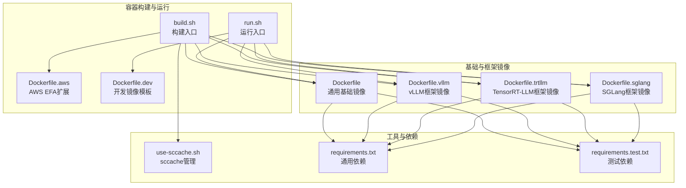
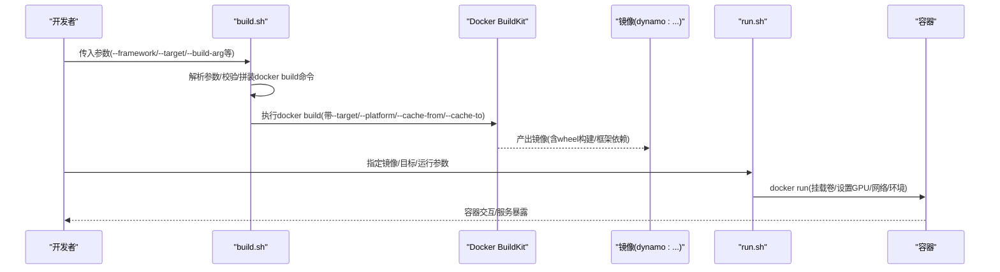
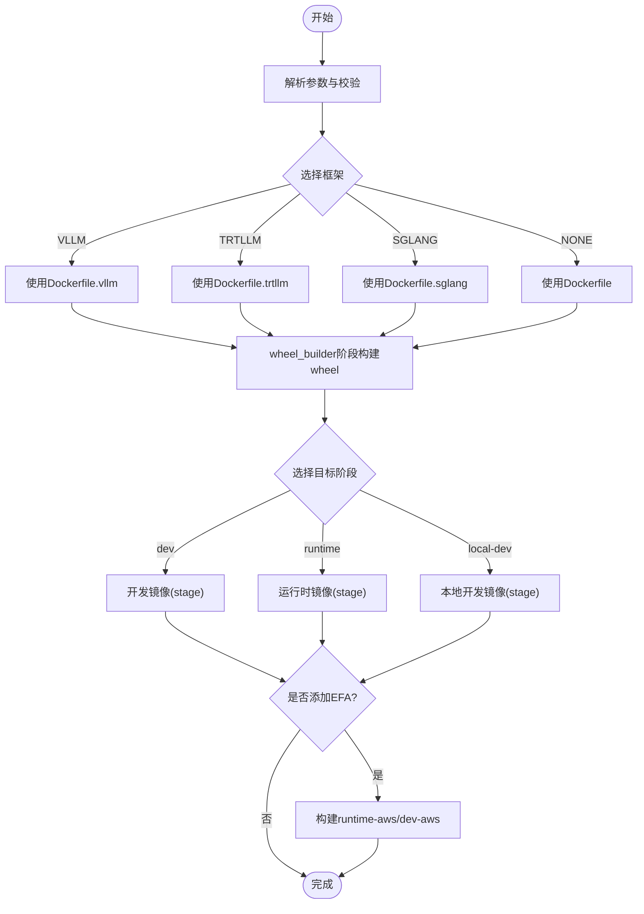
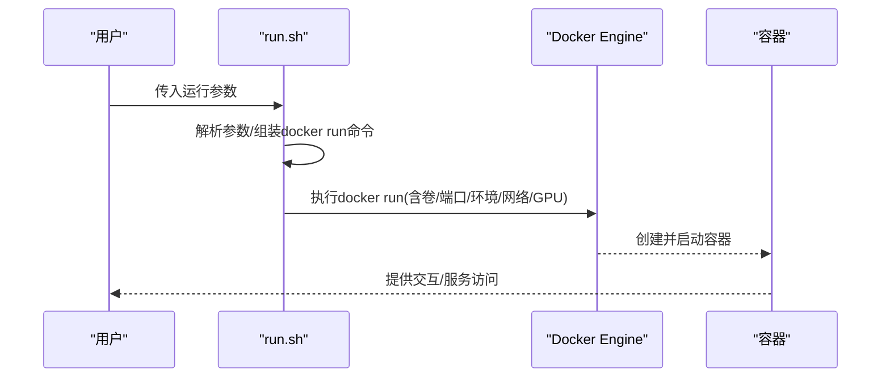
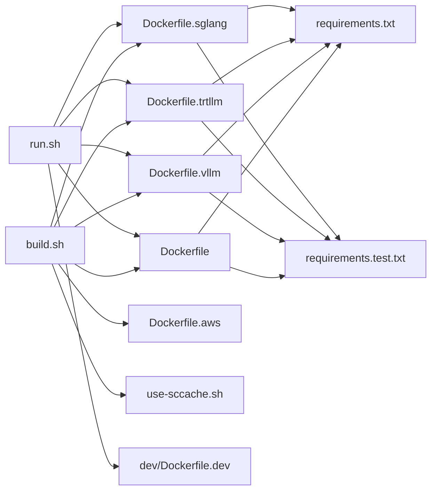

# 构建脚本使用

<cite>
**本文档引用的文件**
- [container/build.sh](file://container/build.sh)
- [container/run.sh](file://container/run.sh)
- [container/Dockerfile](file://container/Dockerfile)
- [container/Dockerfile.vllm](file://container/Dockerfile.vllm)
- [container/Dockerfile.trtllm](file://container/Dockerfile.trtllm)
- [container/Dockerfile.sglang](file://container/Dockerfile.sglang)
- [container/Dockerfile.aws](file://container/Dockerfile.aws)
- [container/dev/Dockerfile.dev](file://container/dev/Dockerfile.dev)
- [container/use-sccache.sh](file://container/use-sccache.sh)
- [container/deps/requirements.txt](file://container/deps/requirements.txt)
- [container/deps/requirements.test.txt](file://container/deps/requirements.test.txt)
</cite>

## 目录
1. [简介](#简介)
2. [项目结构](#项目结构)
3. [核心组件](#核心组件)
4. [架构总览](#架构总览)
5. [详细组件分析](#详细组件分析)
6. [依赖关系分析](#依赖关系分析)
7. [性能考虑](#性能考虑)
8. [故障排除指南](#故障排除指南)
9. [结论](#结论)
10. [附录](#附录)

## 简介
本文件面向Dynamo项目的容器化构建与运行，系统性解析build.sh与run.sh两大脚本的工作原理、参数体系、构建流程与错误处理机制，并结合多框架Dockerfile（vLLM、TensorRT-LLM、SGLang）与AWS EFA扩展层，给出开发、生产与CI/CD三类场景的完整使用指南。文档同时覆盖构建缓存策略、增量构建、版本标签生成、sccache加速、以及跨平台（x86_64/aarch64）与多CUDA版本支持等关键主题。

## 项目结构
Dynamo容器化相关代码集中在container目录，核心文件包括：
- 构建入口：build.sh（Bash脚本）
- 运行入口：run.sh（Bash脚本）
- 基础镜像与多框架镜像：Dockerfile、Dockerfile.vllm、Dockerfile.trtllm、Dockerfile.sglang
- AWS EFA扩展：Dockerfile.aws
- 开发镜像模板：dev/Dockerfile.dev
- 编译缓存工具：use-sccache.sh
- 依赖清单：container/deps/requirements.txt、requirements.test.txt

图表来源
- [container/build.sh](file://container/build.sh#L1-L1140)
- [container/run.sh](file://container/run.sh#L1-L412)
- [container/Dockerfile](file://container/Dockerfile#L1-L655)
- [container/Dockerfile.vllm](file://container/Dockerfile.vllm#L1-L864)
- [container/Dockerfile.trtllm](file://container/Dockerfile.trtllm#L1-L885)
- [container/Dockerfile.sglang](file://container/Dockerfile.sglang#L1-L600)
- [container/Dockerfile.aws](file://container/Dockerfile.aws#L1-L91)
- [container/dev/Dockerfile.dev](file://container/dev/Dockerfile.dev#L1-L472)
- [container/use-sccache.sh](file://container/use-sccache.sh#L1-L87)
- [container/deps/requirements.txt](file://container/deps/requirements.txt#L1-L63)
- [container/deps/requirements.test.txt](file://container/deps/requirements.test.txt#L1-L37)

章节来源
- [container/build.sh](file://container/build.sh#L1-L1140)
- [container/run.sh](file://container/run.sh#L1-L412)
- [container/Dockerfile](file://container/Dockerfile#L1-L655)
- [container/Dockerfile.vllm](file://container/Dockerfile.vllm#L1-L864)
- [container/Dockerfile.trtllm](file://container/Dockerfile.trtllm#L1-L885)
- [container/Dockerfile.sglang](file://container/Dockerfile.sglang#L1-L600)
- [container/Dockerfile.aws](file://container/Dockerfile.aws#L1-L91)
- [container/dev/Dockerfile.dev](file://container/dev/Dockerfile.dev#L1-L472)
- [container/use-sccache.sh](file://container/use-sccache.sh#L1-L87)
- [container/deps/requirements.txt](file://container/deps/requirements.txt#L1-L63)
- [container/deps/requirements.test.txt](file://container/deps/requirements.test.txt#L1-L37)

## 核心组件
- 构建脚本build.sh
  - 功能：解析参数、选择框架与目标阶段、拼装docker build命令、处理TRT-LLM安装策略、AWS EFA扩展、sccache配置、版本标签与Git元数据注入。
  - 关键特性：多框架适配、多架构支持（x86_64/arm64）、可选推送与缓存、Dry-run模式、错误校验与帮助信息。
- 运行脚本run.sh
  - 功能：解析容器运行参数、挂载工作区与HuggingFace缓存、设置GPU与网络、注入环境变量、执行docker run。
  - 关键特性：交互式运行、特权模式、用户/组映射、NIXL GDS支持、端口映射与卷挂载。
- 多框架Dockerfile
  - Dockerfile：通用基础镜像与wheel构建流水线。
  - Dockerfile.vllm：vLLM框架专用，含框架开发与运行时阶段。
  - Dockerfile.trtllm：TensorRT-LLM框架专用，含框架构建与运行时阶段。
  - Dockerfile.sglang：SGLang框架专用，含运行时阶段。
  - Dockerfile.aws：在任意框架运行时或开发镜像上叠加AWS EFA支持。
  - dev/Dockerfile.dev：统一的开发镜像模板，支持root与非root两种目标。
- 工具与依赖
  - use-sccache.sh：sccache安装与统计展示。
  - requirements.txt / requirements.test.txt：Python依赖清单，约束版本以保证可重复构建。

章节来源
- [container/build.sh](file://container/build.sh#L173-L502)
- [container/run.sh](file://container/run.sh#L51-L340)
- [container/Dockerfile](file://container/Dockerfile#L1-L655)
- [container/Dockerfile.vllm](file://container/Dockerfile.vllm#L1-L864)
- [container/Dockerfile.trtllm](file://container/Dockerfile.trtllm#L1-L885)
- [container/Dockerfile.sglang](file://container/Dockerfile.sglang#L1-L600)
- [container/Dockerfile.aws](file://container/Dockerfile.aws#L1-L91)
- [container/dev/Dockerfile.dev](file://container/dev/Dockerfile.dev#L1-L472)
- [container/use-sccache.sh](file://container/use-sccache.sh#L1-L87)
- [container/deps/requirements.txt](file://container/deps/requirements.txt#L1-L63)
- [container/deps/requirements.test.txt](file://container/deps/requirements.test.txt#L1-L37)

## 架构总览
下图展示从build.sh到各框架镜像的构建路径，以及run.sh对容器运行期的控制流。

图表来源
- [container/build.sh](file://container/build.sh#L579-L651)
- [container/run.sh](file://container/run.sh#L379-L412)
- [container/Dockerfile](file://container/Dockerfile#L1-L655)
- [container/Dockerfile.vllm](file://container/Dockerfile.vllm#L1-L864)
- [container/Dockerfile.trtllm](file://container/Dockerfile.trtllm#L1-L885)
- [container/Dockerfile.sglang](file://container/Dockerfile.sglang#L1-L600)

## 详细组件分析

### 构建脚本 build.sh 详解
- 版本与标签生成
  - 自动从Git提取短提交哈希与最近标签/发布分支，生成语义化版本号与镜像标签；支持--no-tag-latest禁用latest别名标签。
- 框架与目标选择
  - 支持VLLM、TRTLLM、NONE、SGLANG四种框架；默认VLLM；--target指定构建阶段（如dev/runtime/local-dev等）。
- 平台与架构
  - --platform控制目标平台；当为linux/arm64时自动注入ARCH/ARCH_ALT构建参数。
- 基础镜像与CUDA版本
  - 各框架有对应的基础镜像与运行时镜像标签；CUDA 13场景下会覆盖基础与运行时标签。
- TRT-LLM安装策略
  - 三种方式互斥且可组合：下载wheel、安装预构建wheel目录、从源码构建wheel；支持私有索引与commit指定。
- AWS EFA扩展
  - 通过--make-efa在任意框架的runtime或dev阶段之上叠加EFA安装层，生成runtime-aws或dev-aws目标镜像。
- sccache缓存
  - 可启用USE_SCCACHE并通过S3桶与区域进行编译缓存；Dockerfile中按需安装并设置RUSTC_WRAPPER等。
- 缓存与推送
  - 支持--cache-from/--cache-to、--no-cache、--push、--no-load；--dry-run仅打印命令不执行。
- 日志与错误
  - 使用set -e与自定义error函数；帮助信息详尽，缺失参数时报错并退出。

图表来源
- [container/build.sh](file://container/build.sh#L173-L502)
- [container/build.sh](file://container/build.sh#L610-L648)
- [container/Dockerfile.vllm](file://container/Dockerfile.vllm#L500-L800)
- [container/Dockerfile.trtllm](file://container/Dockerfile.trtllm#L480-L885)
- [container/Dockerfile.sglang](file://container/Dockerfile.sglang#L460-L600)
- [container/Dockerfile](file://container/Dockerfile#L1-L655)

章节来源
- [container/build.sh](file://container/build.sh#L24-L58)
- [container/build.sh](file://container/build.sh#L173-L502)
- [container/build.sh](file://container/build.sh#L610-L648)
- [container/Dockerfile.vllm](file://container/Dockerfile.vllm#L500-L800)
- [container/Dockerfile.trtllm](file://container/Dockerfile.trtllm#L480-L885)
- [container/Dockerfile.sglang](file://container/Dockerfile.sglang#L460-L600)
- [container/Dockerfile](file://container/Dockerfile#L1-L655)

### 运行脚本 run.sh 详解
- 参数解析
  - 支持--framework/--image/--target/--name/--gpus/--runtime/--entrypoint/--workdir/--privileged/--rm/-v/-p/-e/--mount-workspace/--use-nixl-gds/--network/--user/--dry-run等。
- 镜像与目标
  - 默认基于latest镜像，若指定--target则追加后缀；--image可直接指定镜像名。
- 卷与缓存
  - --mount-workspace自动挂载/workspace与/tmp、/mnt，并根据需要设置HF_HOME；--use-nixl-gds挂载/runner/udev并添加IPC_LOCK能力。
- GPU与网络
  - --gpus=all|none控制设备可见性；--network支持host/bridge/none/container:...；--runtime指定容器运行时。
- 用户与权限
  - --user支持用户名或UID[:GID]；当覆盖用户时自动添加GID 0以避免大目录挂载的昂贵chown。
- 执行流程
  - 组装docker run命令并执行；--dry-run仅打印命令。

图表来源
- [container/run.sh](file://container/run.sh#L51-L340)
- [container/run.sh](file://container/run.sh#L381-L412)

章节来源
- [container/run.sh](file://container/run.sh#L51-L340)
- [container/run.sh](file://container/run.sh#L381-L412)

### 多框架Dockerfile与构建流程
- 通用基础与wheel构建
  - Dockerfile定义基础阶段、wheel_builder阶段（manylinux环境构建Rust/C/C++与Python wheel），以及runtime与frontend阶段。
- vLLM框架
  - Dockerfile.vllm包含framework开发阶段（构建vLLM及相关优化库）与runtime运行时阶段；支持CUDA 13与DeepGEMM/FlashInfer/LMCache等可选组件。
- TensorRT-LLM框架
  - Dockerfile.trtllm包含framework构建阶段（从NGC PyTorch镜像复制依赖，安装TRT-LLM与TensorRT），以及runtime运行时阶段；支持从wheel目录、wheel镜像或索引安装。
- SGLang框架
  - Dockerfile.sglang以lmsysorg/sglang为基础，安装Dynamo相关wheel与依赖，支持CUDA 12/13的NVIDIA包重装。
- AWS EFA扩展
  - Dockerfile.aws在runtime或dev基础上安装EFA驱动与aws-ofi-nccl插件，生成runtime-aws与dev-aws两个目标。
- 开发镜像模板
  - dev/Dockerfile.dev提供dynamo_tools工具层与dev/local-dev两套目标，统一了开发体验与权限模型。

章节来源
- [container/Dockerfile](file://container/Dockerfile#L1-L655)
- [container/Dockerfile.vllm](file://container/Dockerfile.vllm#L1-L864)
- [container/Dockerfile.trtllm](file://container/Dockerfile.trtllm#L1-L885)
- [container/Dockerfile.sglang](file://container/Dockerfile.sglang#L1-L600)
- [container/Dockerfile.aws](file://container/Dockerfile.aws#L1-L91)
- [container/dev/Dockerfile.dev](file://container/dev/Dockerfile.dev#L1-L472)

### sccache缓存与增量构建
- sccache安装与统计
  - use-sccache.sh提供install/show-stats命令；build.sh在启用USE_SCCACHE时传递SCCACHE_BUCKET/SCCACHE_REGION并设置RUSTC_WRAPPER。
- Dockerfile中的缓存策略
  - wheel_builder阶段复用manylinux镜像缓存；FFmpeg/UCX/Libfabric/NIXL构建均支持SCCACHE_S3_KEY_PREFIX；各阶段末尾调用show-stats输出统计。
- 增量构建建议
  - 使用--cache-from/--cache-to提升缓存命中；--no-cache仅在需要强制重建时使用；合理组织COPY顺序以最大化层缓存。

章节来源
- [container/use-sccache.sh](file://container/use-sccache.sh#L1-L87)
- [container/Dockerfile](file://container/Dockerfile#L225-L237)
- [container/Dockerfile.vllm](file://container/Dockerfile.vllm#L255-L262)
- [container/Dockerfile.trtllm](file://container/Dockerfile.trtllm#L257-L264)
- [container/Dockerfile.sglang](file://container/Dockerfile.sglang#L238-L245)

### 版本标签与Git元数据
- 标签生成策略
  - 优先使用精确匹配的Git标签；否则回退到最新release分支；若仍无，则使用默认版本；最终将提交哈希注入到镜像环境变量DYNAMO_COMMIT_SHA。
- 版本号格式
  - 当存在标签时使用vX.Y.Z；否则使用X.Y.Z.dev+commit_id；可通过--tag显式覆盖。

章节来源
- [container/build.sh](file://container/build.sh#L28-L58)
- [container/Dockerfile](file://container/Dockerfile#L543-L544)
- [container/Dockerfile.vllm](file://container/Dockerfile.vllm#L596-L597)
- [container/Dockerfile.trtllm](file://container/Dockerfile.trtllm#L641-L642)
- [container/Dockerfile.sglang](file://container/Dockerfile.sglang#L465-L466)

### CI/CD集成要点
- 构建参数建议
  - CI中推荐固定--platform与--target，开启--cache-from/--cache-to，必要时--push至制品库；使用--dry-run验证命令正确性。
- TRT-LLM安装
  - 在CI中优先使用--tensorrtllm-pip-wheel-dir或--tensorrtllm-index-url，减少源码构建时间；如需特定commit，配合--tensorrtllm-commit。
- sccache
  - 在CI中配置AWS凭证并启用--use-sccache，结合--sccache-bucket/--sccache-region；注意SCCACHE_S3_KEY_PREFIX由脚本自动设置。
- 测试与发布
  - run.sh可配合--mount-workspace与--use-nixl-gds进行端到端测试；发布前使用--no-tag-latest避免污染latest标签。

章节来源
- [container/build.sh](file://container/build.sh#L173-L502)
- [container/build.sh](file://container/build.sh#L610-L648)
- [container/use-sccache.sh](file://container/use-sccache.sh#L22-L27)

## 依赖关系分析
- 构建期依赖
  - build.sh依赖各Dockerfile与use-sccache.sh；Dockerfile系列依赖requirements.txt与requirements.test.txt。
- 运行期依赖
  - run.sh依赖Docker守护进程与nvidia-container-runtime；--gpus与--runtime参数直接影响容器行为。
- 跨框架一致性
  - 多个Dockerfile共享dynamo_base与wheel_builder阶段，确保工具链与缓存一致；dev/Dockerfile.dev作为统一模板被各框架镜像复用。

图表来源
- [container/build.sh](file://container/build.sh#L1-L1140)
- [container/run.sh](file://container/run.sh#L1-L412)
- [container/Dockerfile](file://container/Dockerfile#L1-L655)
- [container/Dockerfile.vllm](file://container/Dockerfile.vllm#L1-L864)
- [container/Dockerfile.trtllm](file://container/Dockerfile.trtllm#L1-L885)
- [container/Dockerfile.sglang](file://container/Dockerfile.sglang#L1-L600)
- [container/Dockerfile.aws](file://container/Dockerfile.aws#L1-L91)
- [container/dev/Dockerfile.dev](file://container/dev/Dockerfile.dev#L1-L472)
- [container/use-sccache.sh](file://container/use-sccache.sh#L1-L87)
- [container/deps/requirements.txt](file://container/deps/requirements.txt#L1-L63)
- [container/deps/requirements.test.txt](file://container/deps/requirements.test.txt#L1-L37)

章节来源
- [container/build.sh](file://container/build.sh#L1-L1140)
- [container/run.sh](file://container/run.sh#L1-L412)
- [container/Dockerfile](file://container/Dockerfile#L1-L655)
- [container/Dockerfile.vllm](file://container/Dockerfile.vllm#L1-L864)
- [container/Dockerfile.trtllm](file://container/Dockerfile.trtllm#L1-L885)
- [container/Dockerfile.sglang](file://container/Dockerfile.sglang#L1-L600)
- [container/Dockerfile.aws](file://container/Dockerfile.aws#L1-L91)
- [container/dev/Dockerfile.dev](file://container/dev/Dockerfile.dev#L1-L472)
- [container/use-sccache.sh](file://container/use-sccache.sh#L1-L87)
- [container/deps/requirements.txt](file://container/deps/requirements.txt#L1-L63)
- [container/deps/requirements.test.txt](file://container/deps/requirements.test.txt#L1-L37)

## 性能考虑
- 层缓存与COPY顺序
  - 将稳定不变的依赖（如系统包、工具链）放在前面，源码与变更频繁的内容靠后，最大化缓存命中率。
- 并行与作业数
  - vLLM框架支持--vllm-max-jobs调整编译并行度；wheel_builder阶段默认CARGO_BUILD_JOBS=16。
- sccache与S3缓存
  - 在CI中启用sccache可显著缩短重复编译时间；注意S3桶与区域配置正确性。
- 架构与平台
  - arm64场景下自动注入ARCH/ARCH_ALT参数，确保二进制兼容与缓存键一致。

章节来源
- [container/Dockerfile.vllm](file://container/Dockerfile.vllm#L564-L565)
- [container/Dockerfile](file://container/Dockerfile#L118-L119)
- [container/build.sh](file://container/build.sh#L581-L586)

## 故障排除指南
- 常见错误与诊断
  - 未知框架/目标：检查--framework与--target是否在允许集合内；参考帮助信息。
  - 缺少参数：如--use-sccache未提供--sccache-bucket/--sccache-region会报错；--uid/--gid仅允许与local-dev相关目标。
  - TRT-LLM安装意图冲突：当同时提供多种安装方式时，脚本无法推断意图，需明确其一。
  - 无wheel文件：--tensorrtllm-pip-wheel-dir目录为空或多个wheel时会警告并选择首个。
  - CUDA版本不匹配：TRT-LLM与NGC PyTorch存在ABI差异，需使用wheel镜像或从源码构建。
  - EFA安装失败：检查EFA版本与网络连通性；确保宿主机已安装内核模块与限制配置。
- 诊断步骤
  - 使用--dry-run查看实际docker命令；启用--no-cache定位缓存问题；检查SCCACHE相关环境变量。
  - 在Dockerfile中观察sccache统计输出，确认缓存命中情况。
- 相关文件定位
  - 错误处理与帮助：build.sh中的error/missing_requirement/show_help
  - TRT-LLM安装意图判定：build.sh中的determine_user_intention_trtllm
  - EFA安装流程：Dockerfile.aws与build.sh中的build_aws_with_header

章节来源
- [container/build.sh](file://container/build.sh#L570-L577)
- [container/build.sh](file://container/build.sh#L798-L800)
- [container/build.sh](file://container/build.sh#L610-L648)
- [container/Dockerfile.aws](file://container/Dockerfile.aws#L37-L47)

## 结论
Dynamo的容器构建体系通过build.sh与多框架Dockerfile实现了高度可配置的构建流程，结合run.sh提供了灵活的运行期控制。通过sccache、分层缓存与多架构支持，可在开发、生产与CI/CD环境中实现高效、可重复且可扩展的镜像构建与部署。

## 附录
- 构建命令示例（不含具体代码内容）
  - 开发镜像（vLLM，默认CUDA 12.9）
    - ./container/build.sh --framework vllm --target dev
  - 生产镜像（TensorRT-LLM，CUDA 13）
    - ./container/build.sh --framework trtllm --target runtime --cuda-version 13.0
  - 开发镜像（SGLang，启用KVBM与GPU内存服务）
    - ./container/build.sh --framework sglang --target dev --enable-kvbm --enable-gpu-memory-service
  - 本地开发镜像（非root，映射UID/GID）
    - ./container/build.sh --framework vllm --target local-dev --uid 1000 --gid 1000
  - CI构建（启用sccache，推送镜像）
    - ./container/build.sh --framework vllm --target runtime --use-sccache --sccache-bucket my-bucket --sccache-region us-west-2 --push
  - 添加AWS EFA支持
    - ./container/build.sh --framework vllm --target runtime --make-efa
  - 指定TRT-LLM安装方式
    - 从wheel目录：./container/build.sh --framework trtllm --target runtime --tensorrtllm-pip-wheel-dir /path/to/dir
    - 从索引安装：./container/build.sh --framework trtllm --target runtime --tensorrtllm-index-url https://pypi.example.com --tensorrtllm-pip-wheel tensorrt-llm==1.3.0rc1
    - 从源码构建：./container/build.sh --framework trtllm --target framework --tensorrtllm-git-url https://github.com/example/tensorrt-llm.git --tensorrtllm-commit abcdef123456
  - 运行容器示例
    - 交互式运行并挂载工作区
      - ./container/run.sh --framework vllm --mount-workspace --interactive
    - 指定GPU与网络
      - ./container/run.sh --framework trtllm --gpus 0,1 --network bridge
    - 使用NIXL GDS
      - ./container/run.sh --framework sglang --use-nixl-gds --mount-workspace
    - 指定用户与组
      - ./container/run.sh --framework vllm --user 1000:0

章节来源
- [container/build.sh](file://container/build.sh#L529-L568)
- [container/run.sh](file://container/run.sh#L342-L368)