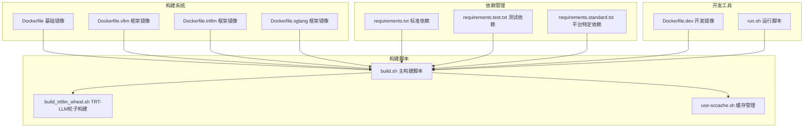
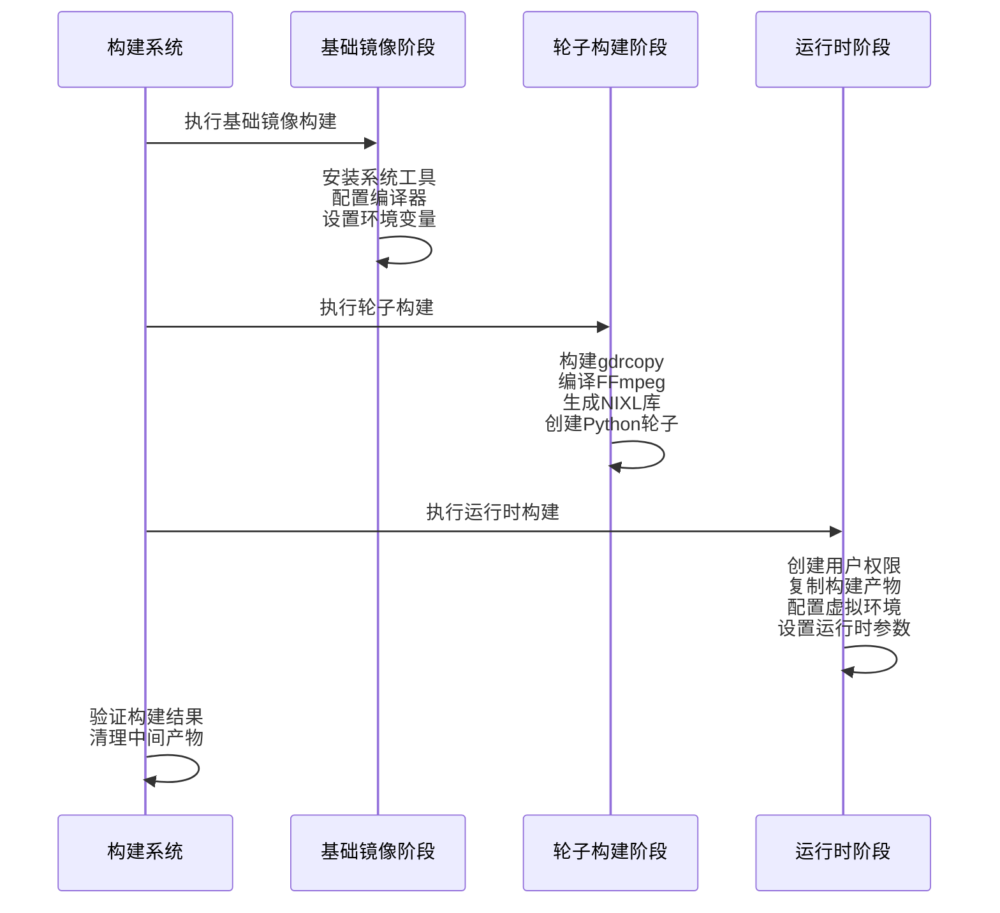
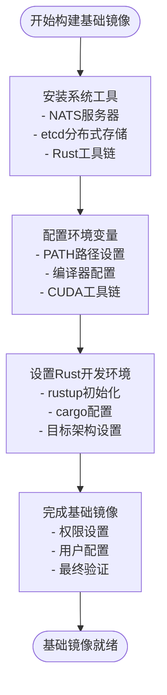
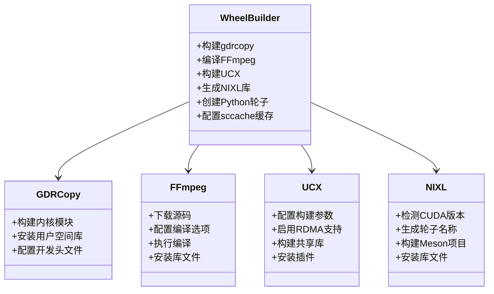
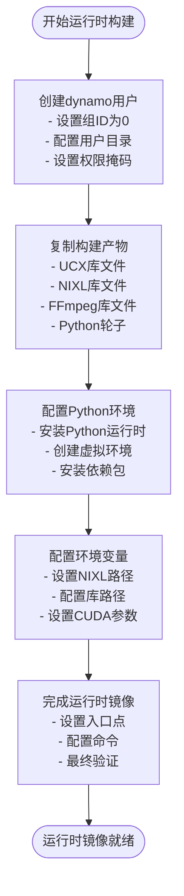
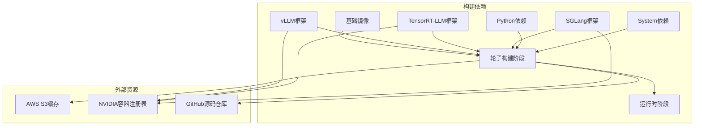
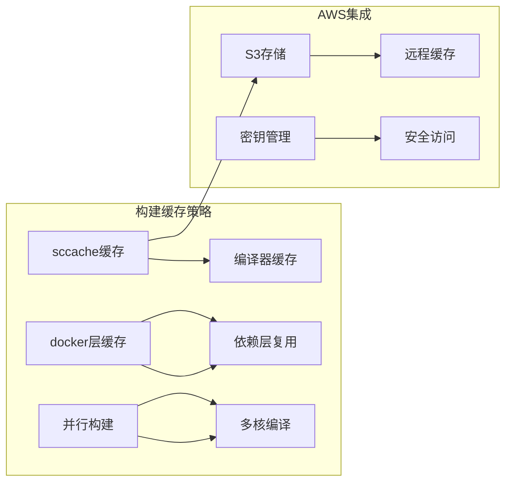

# 构建阶段详解

<cite>
**本文档引用的文件**
- [Dockerfile](file://container/Dockerfile)
- [Dockerfile.vllm](file://container/Dockerfile.vllm)
- [Dockerfile.trtllm](file://container/Dockerfile.trtllm)
- [Dockerfile.sglang](file://container/Dockerfile.sglang)
- [build.sh](file://container/build.sh)
- [build_trtllm_wheel.sh](file://container/build_trtllm_wheel.sh)
- [use-sccache.sh](file://container/use-sccache.sh)
- [requirements.txt](file://container/deps/requirements.txt)
- [requirements.test.txt](file://container/deps/requirements.test.txt)
- [requirements.standard.txt](file://container/deps/requirements.standard.txt)
- [Dockerfile.dev](file://container/dev/Dockerfile.dev)
- [run.sh](file://container/run.sh)
</cite>

## 目录
1. [简介](#简介)
2. [项目结构](#项目结构)
3. [核心组件](#核心组件)
4. [架构概览](#架构概览)
5. [详细组件分析](#详细组件分析)
6. [依赖分析](#依赖分析)
7. [性能考虑](#性能考虑)
8. [故障排除指南](#故障排除指南)
9. [结论](#结论)

## 简介

Dynamo项目的Docker构建系统采用多阶段构建架构，通过三个核心阶段实现高效的容器化部署。该系统支持多种推理框架（vLLM、TensorRT-LLM、SGLang），并提供了灵活的构建参数配置和优化策略。

本技术文档深入解析了Dynamo Docker构建阶段的详细实现，包括基础镜像阶段、轮子构建阶段和运行时阶段的功能、依赖关系和输出产物。文档还涵盖了构建参数的应用方式、环境变量配置、数据传递机制以及故障排查指南。

## 项目结构

Dynamo项目的容器化构建系统主要由以下核心组件构成：

**图表来源**
- [Dockerfile](file://container/Dockerfile#L1-L655)
- [build.sh](file://container/build.sh#L1-L800)

**章节来源**
- [Dockerfile](file://container/Dockerfile#L1-L655)
- [build.sh](file://container/build.sh#L1-L800)

## 核心组件

Dynamo构建系统的三个核心阶段各自承担不同的职责：

### 阶段一：dynamo_base 基础镜像阶段

基础镜像阶段负责安装系统工具、编译器和基础依赖，为后续构建提供基础设施支持。

**主要功能**：
- 安装NATS服务器和etcd分布式键值存储
- 配置Rust开发环境（rustup、cargo）
- 设置CUDA工具链和编译器环境
- 提供通用的系统依赖包

**关键特性**：
- 支持x86_64和aarch64架构
- 集成现代版本的protoc编译器
- 预配置GCC工具集14（CUDA兼容）

### 阶段二：wheel_builder 轮子构建阶段

轮子构建阶段专注于构建NIXL库、FFmpeg和Python轮子，这是整个构建流程的核心。

**主要功能**：
- 构建和安装gdrcopy内核模块
- 编译FFmpeg媒体处理库
- 构建UCX高性能通信库
- 生成NIXL网络接口库
- 创建Python轮子文件

**关键特性**：
- 支持sccache缓存加速编译
- 针对不同CUDA版本（12/13）生成特定轮子
- 集成多种媒体处理后端

### 阶段三：runtime 运行时阶段

运行时阶段配置最终的生产环境，包含所有必需的运行时依赖和配置。

**主要功能**：
- 创建dynamo用户和组权限
- 复制构建好的库和轮子文件
- 安装Python虚拟环境
- 配置环境变量和路径

**关键特性**：
- OpenShift兼容的用户权限模型
- 优化的文件权限和所有权管理
- 支持多种框架的运行时需求

**章节来源**
- [Dockerfile](file://container/Dockerfile#L63-L655)
- [Dockerfile.vllm](file://container/Dockerfile.vllm#L90-L800)
- [Dockerfile.trtllm](file://container/Dockerfile.trtllm#L96-L885)
- [Dockerfile.sglang](file://container/Dockerfile.sglang#L77-L600)

## 架构概览

Dynamo的多阶段构建架构确保了构建效率和运行时性能的最佳平衡：

**图表来源**
- [Dockerfile](file://container/Dockerfile#L63-L655)
- [build.sh](file://container/build.sh#L580-L655)

**章节来源**
- [Dockerfile](file://container/Dockerfile#L1-L655)
- [build.sh](file://container/build.sh#L1-L800)

## 详细组件分析

### dynamo_base 基础镜像阶段

基础镜像阶段是整个构建系统的基础，负责提供统一的开发环境。

**图表来源**
- [Dockerfile](file://container/Dockerfile#L63-L131)

**关键实现细节**：
- 使用`ghcr.io/astral-sh/uv:latest`作为包管理器
- 支持多架构构建（amd64/arm64）
- 集成现代版本的protoc编译器
- 预配置GCC工具集14以确保CUDA兼容性

**章节来源**
- [Dockerfile](file://container/Dockerfile#L63-L131)

### wheel_builder 轮子构建阶段

轮子构建阶段是构建系统的核心，负责生成所有必要的二进制依赖。

**图表来源**
- [Dockerfile](file://container/Dockerfile#L113-L451)

**构建流程详解**：

1. **GDRCopy构建**：从GitHub克隆源码，使用CUDA路径构建RPM包，然后安装内核模块和用户空间库。

2. **FFmpeg编译**：下载指定版本源码，配置禁用GPL和非免费组件，启用共享库构建，最后安装到系统路径。

3. **UCX构建**：配置OpenUCX支持RDMA、verbs、EFA等特性，构建共享库并安装插件。

4. **NIXL生成**：检测CUDA主版本号，生成对应的轮子名称，使用Meson构建系统编译并安装。

**章节来源**
- [Dockerfile](file://container/Dockerfile#L217-L384)

### runtime 运行时阶段

运行时阶段专注于创建最终的生产环境镜像。

**图表来源**
- [Dockerfile](file://container/Dockerfile#L454-L547)

**关键配置**：
- OpenShift兼容的用户权限模型（UID 1000，GID 0）
- 分层权限管理，避免递归chown操作
- 统一的环境变量配置
- 优化的库路径设置

**章节来源**
- [Dockerfile](file://container/Dockerfile#L454-L547)

## 依赖分析

Dynamo构建系统的依赖关系复杂而精心设计，确保了构建效率和运行时性能。

**图表来源**
- [Dockerfile](file://container/Dockerfile#L1-L655)
- [build.sh](file://container/build.sh#L1-L800)

**依赖管理策略**：

1. **分层缓存**：通过多阶段构建实现Docker层缓存，避免重复构建
2. **条件依赖**：根据构建参数动态安装依赖
3. **版本锁定**：使用精确版本号确保可重现性
4. **平台适配**：针对不同架构和CUDA版本定制依赖

**章节来源**
- [requirements.txt](file://container/deps/requirements.txt#L1-L63)
- [requirements.test.txt](file://container/deps/requirements.test.txt#L1-L37)
- [requirements.standard.txt](file://container/deps/requirements.standard.txt#L1-L13)

## 性能考虑

Dynamo构建系统采用了多项性能优化策略：

### 缓存优化

**关键优化措施**：
- **sccache集成**：通过use-sccache.sh脚本实现编译缓存
- **Docker层缓存**：合理组织Dockerfile指令顺序
- **并行编译**：利用多核CPU进行并行构建
- **远程缓存**：使用AWS S3存储构建缓存

### 构建参数优化

| 参数名称 | 默认值 | 用途 | 性能影响 |
|---------|--------|------|----------|
| CARGO_BUILD_JOBS | 16 | Rust并行编译任务数 | 直接影响编译速度 |
| ARCH | amd64 | 目标架构 | 影响依赖包选择 |
| ARCH_ALT | x86_64 | Rust目标架构 | 影响二进制兼容性 |
| USE_SCCACHE | false | 启用编译缓存 | 显著提升重复构建速度 |

**章节来源**
- [build.sh](file://container/build.sh#L168-L501)
- [use-sccache.sh](file://container/use-sccache.sh#L1-L87)

## 故障排除指南

### 常见构建问题及解决方案

#### 1. 编译器版本不兼容

**问题症状**：
- CUDA编译错误
- GCC版本不匹配
- 构建失败

**解决方案**：
- 确保使用GCC工具集14
- 检查CUDA版本兼容性
- 验证编译器路径配置

#### 2. 依赖包安装失败

**问题症状**：
- apt包安装超时
- 依赖冲突
- 网络连接问题

**解决方案**：
- 使用镜像源替代官方源
- 清理apt缓存
- 检查网络连接和代理设置

#### 3. sccache缓存问题

**问题症状**：
- 编译时间异常延长
- 缓存未生效
- S3访问权限错误

**解决方案**：
- 验证AWS凭据配置
- 检查S3桶权限
- 清理损坏的缓存条目

#### 4. 权限和用户配置问题

**问题症状**：
- 文件权限错误
- 用户ID不匹配
- OpenShift部署失败

**解决方案**：
- 确认用户组ID设置为0
- 验证文件所有权
- 检查umask配置

**章节来源**
- [Dockerfile](file://container/Dockerfile#L459-L470)
- [build.sh](file://container/build.sh#L173-L501)

### 调试工具和技巧

1. **Dry Run模式**：使用`--dry-run`参数预览构建命令
2. **详细日志**：启用`set -x`显示所有执行命令
3. **缓存检查**：使用`sccache --show-stats`查看缓存统计
4. **依赖树分析**：使用`docker history`查看镜像层历史

## 结论

Dynamo的多阶段Docker构建系统展现了现代容器化应用的最佳实践。通过精心设计的三个核心阶段，系统实现了：

1. **高效构建**：通过分层缓存和并行编译显著提升构建速度
2. **灵活配置**：支持多种框架和架构的动态配置
3. **可靠部署**：提供生产就绪的运行时环境
4. **易于维护**：清晰的代码结构和完善的故障排除机制

该构建系统不仅满足了当前的开发和部署需求，还为未来的扩展和优化奠定了坚实基础。通过持续改进缓存策略、优化依赖管理和增强监控能力，Dynamo构建系统将继续为AI推理服务提供强大的容器化支持。