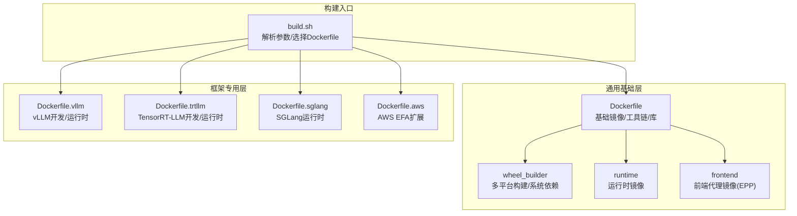
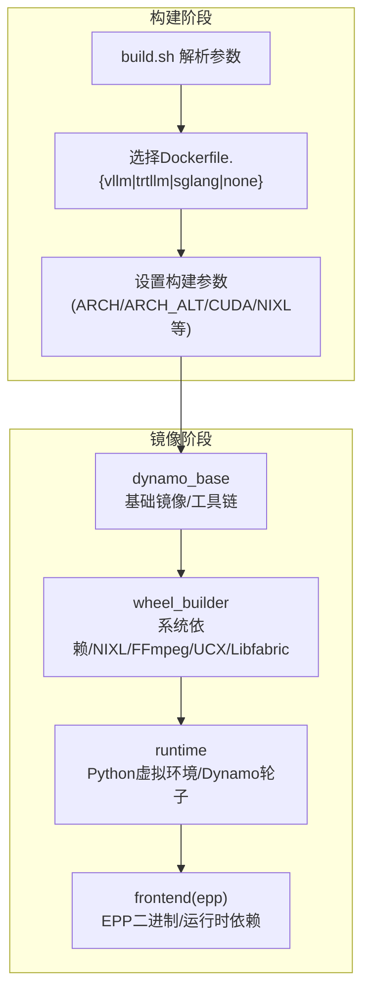
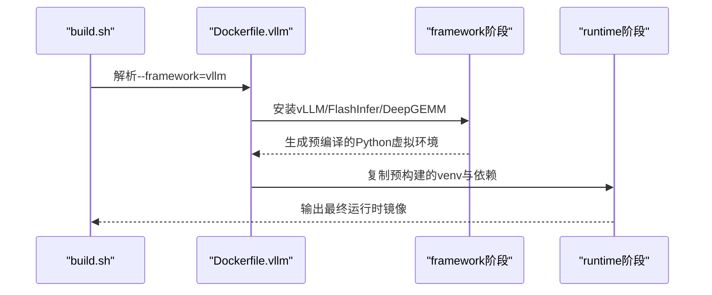
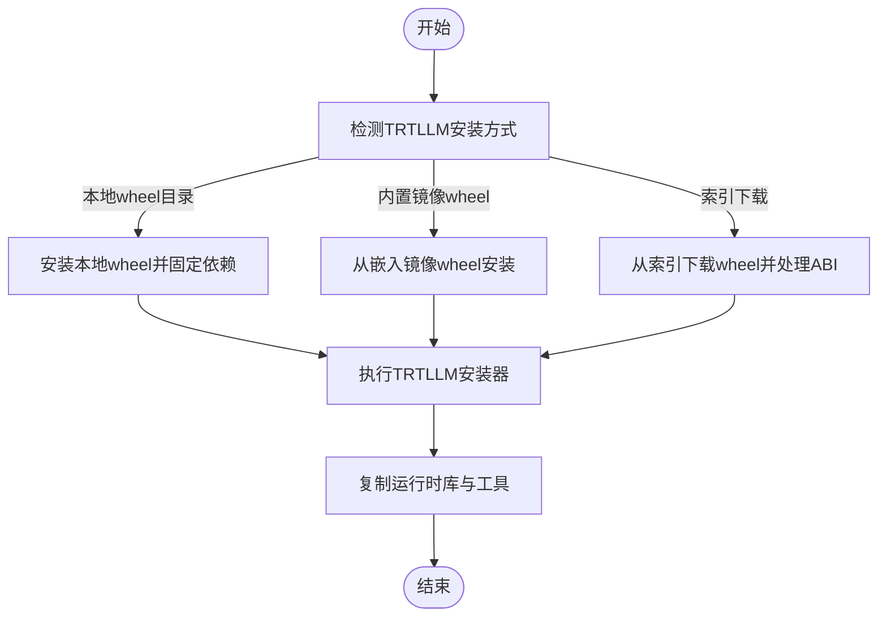
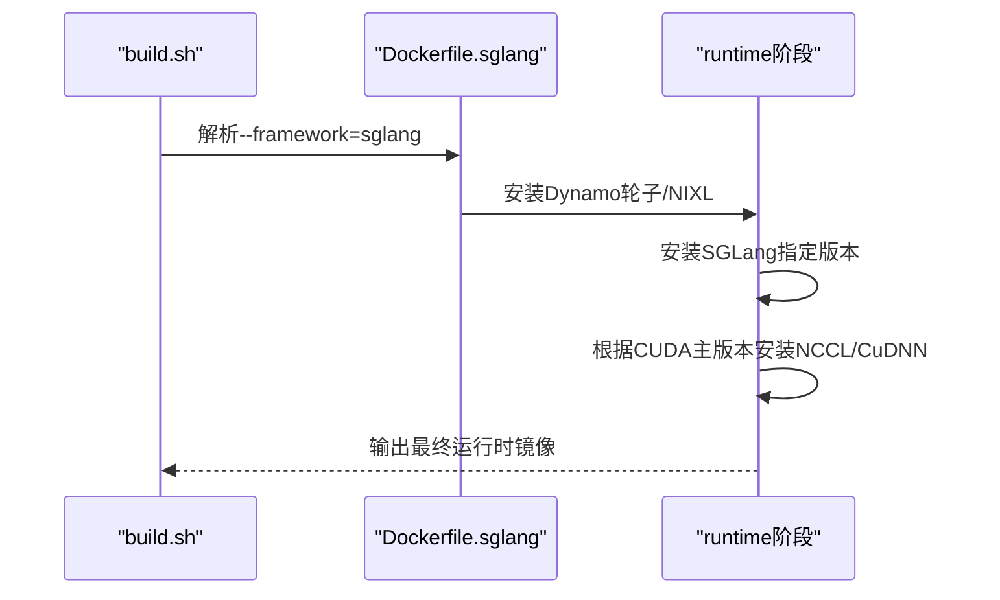
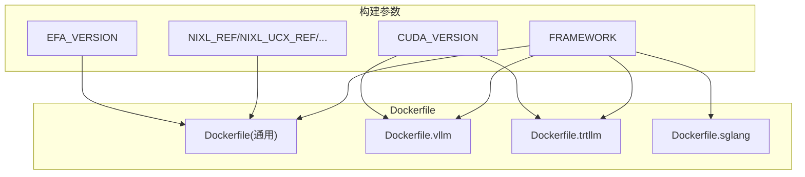

# 框架专用镜像

<cite>
**本文引用的文件**
- [container/Dockerfile](file://container/Dockerfile)
- [container/Dockerfile.vllm](file://container/Dockerfile.vllm)
- [container/Dockerfile.trtllm](file://container/Dockerfile.trtllm)
- [container/Dockerfile.sglang](file://container/Dockerfile.sglang)
- [container/Dockerfile.aws](file://container/Dockerfile.aws)
- [container/Dockerfile.docs](file://container/Dockerfile.docs)
- [container/build.sh](file://container/build.sh)
- [container/run.sh](file://container/run.sh)
- [container/use-sccache.sh](file://container/use-sccache.sh)
- [container/deps/requirements.txt](file://container/deps/requirements.txt)
- [container/deps/requirements.standard.txt](file://container/deps/requirements.standard.txt)
- [container/deps/requirements.test.txt](file://container/deps/requirements.test.txt)
- [container/deps/vllm/install_vllm.sh](file://container/deps/vllm/install_vllm.sh)
- [deploy/inference-gateway/epp/Dockerfile](file://deploy/inference-gateway/epp/Dockerfile)
</cite>

## 目录
1. [简介](#简介)
2. [项目结构](#项目结构)
3. [核心组件](#核心组件)
4. [架构总览](#架构总览)
5. [详细组件分析](#详细组件分析)
6. [依赖关系分析](#依赖关系分析)
7. [性能考虑](#性能考虑)
8. [故障排查指南](#故障排查指南)
9. [结论](#结论)
10. [附录](#附录)

## 简介
本文件面向Dynamo框架的容器化部署，系统性阐述vLLM、TensorRT-LLM、SGLang与EPP（前端代理）专用Docker镜像的差异化配置与特性。重点包括：
- 各框架镜像的构建参数（--build-arg FRAMEWORK=）如何影响镜像内容与目标阶段
- 针对不同后端的依赖安装、编译与运行时配置
- 启动配置、环境变量与运行时优化策略
- 性能调优参数与资源限制建议
- 框架选择指南与最佳实践
- 常见问题与故障排查方法

## 项目结构
Dynamo的容器化由统一的构建脚本驱动，通过--framework参数选择不同的Dockerfile与目标阶段：
- 主镜像：container/Dockerfile（通用基础层）
- 框架镜像：container/Dockerfile.{vllm|trtllm|sglang}
- AWS EFA扩展：container/Dockerfile.aws
- 文档镜像：container/Dockerfile.docs
- 前端代理EPP：deploy/inference-gateway/epp/Dockerfile

**图表来源**
- [container/build.sh](file://container/build.sh#L592-L601)
- [container/Dockerfile](file://container/Dockerfile#L63-L654)
- [container/Dockerfile.vllm](file://container/Dockerfile.vllm#L90-L800)
- [container/Dockerfile.trtllm](file://container/Dockerfile.trtllm#L96-L885)
- [container/Dockerfile.sglang](file://container/Dockerfile.sglang#L77-L600)
- [container/Dockerfile.aws](file://container/Dockerfile.aws#L26-L91)

**章节来源**
- [container/build.sh](file://container/build.sh#L592-L601)
- [container/Dockerfile](file://container/Dockerfile#L63-L654)

## 核心组件
- 构建脚本（build.sh）：解析--framework、--target、--build-arg等参数，动态选择对应Dockerfile与目标阶段，并注入版本、CUDA、NIXL等构建参数。
- 通用Dockerfile：定义基础镜像、系统工具链、wheel_builder阶段（多平台构建、系统依赖、NIXL/FFmpeg/UCX/Libfabric构建）、runtime阶段（Python虚拟环境、Dynamo轮子安装）与前端代理阶段（EPP）。
- 框架专用Dockerfile：在通用基础上，针对vLLM、TensorRT-LLM、SGLang分别进行框架依赖安装、编译与运行时优化。
- AWS EFA扩展：在现有镜像上叠加EFA支持（libfabric与aws-ofi-nccl）。
- 运行脚本（run.sh）：封装docker run命令，提供GPU、网络、卷挂载、环境变量等运行时参数。

**章节来源**
- [container/build.sh](file://container/build.sh#L173-L502)
- [container/Dockerfile](file://container/Dockerfile#L17-L654)
- [container/Dockerfile.vllm](file://container/Dockerfile.vllm#L32-L800)
- [container/Dockerfile.trtllm](file://container/Dockerfile.trtllm#L32-L885)
- [container/Dockerfile.sglang](file://container/Dockerfile.sglang#L32-L600)
- [container/Dockerfile.aws](file://container/Dockerfile.aws#L14-L91)
- [container/run.sh](file://container/run.sh#L51-L340)

## 架构总览
Dynamo容器化采用“通用基础层 + 框架专用层”的双层设计，确保：
- 共享基础层（系统工具、编译器、NIXL/UCX/Libfabric/FFmpeg）以提升缓存命中率与构建效率
- 框架层按需安装框架依赖与运行时，避免相互污染
- EPP作为前端代理独立镜像，便于在Kubernetes中与后端解耦

**图表来源**
- [container/build.sh](file://container/build.sh#L592-L601)
- [container/Dockerfile](file://container/Dockerfile#L63-L654)

## 详细组件分析

### vLLM专用镜像（Dockerfile.vllm）
- 构建参数要点
  - CUDA版本与运行时镜像：默认CUDA 12.9，支持CUDA 13覆盖逻辑
  - vLLM版本与FlashInfer/LMCache/DeepGEMM引用
  - 构建并发控制（MAX_JOBS）
- 依赖安装流程
  - 在framework阶段使用install_vllm.sh从PyPI或GitHub安装vLLM及其加速组件
  - 安装DeepGEMM与EP内核（用于特定后端优化）
- 运行时优化
  - 设置CUDA_DEVICE_ORDER为PCI_BUS_ID，避免NVML设备ID不一致导致的错误
  - 复制CUDA开发工具与头文件到运行时，保证JIT编译与工具可用
  - 预拷贝torch、vLLM、flashinfer等大型包分层，提升拉取效率
- 环境变量
  - CUDA_DEVICE_ORDER、CPATH（帮助nvcc定位头文件）

**图表来源**
- [container/build.sh](file://container/build.sh#L593-L594)
- [container/Dockerfile.vllm](file://container/Dockerfile.vllm#L519-L800)
- [container/deps/vllm/install_vllm.sh](file://container/deps/vllm/install_vllm.sh#L14-L178)

**章节来源**
- [container/Dockerfile.vllm](file://container/Dockerfile.vllm#L73-L82)
- [container/Dockerfile.vllm](file://container/Dockerfile.vllm#L554-L582)
- [container/Dockerfile.vllm](file://container/Dockerfile.vllm#L606-L792)
- [container/deps/vllm/install_vllm.sh](file://container/deps/vllm/install_vllm.sh#L14-L178)

### TensorRT-LLM专用镜像（Dockerfile.trtllm）
- 构建参数要点
  - PyTorch基础镜像与CUDA 13.1运行时镜像
  - TRTLLM安装方式：本地wheel目录、内置镜像wheel或从索引下载
  - 与NGC PyTorch的ABI兼容性处理（卸载冲突的TensorRT并使用TRTLLM自带安装器）
- 依赖安装流程
  - 从NGC PyTorch镜像复制torch、torchvision、flash-attn等依赖
  - 安装flashinfer-python并根据选择安装TRTLLM wheel
  - 执行TRTLLM安装器完成TensorRT安装
- 运行时优化
  - 复制CUDA工具链、OpenMPI、HPCX、NCCL、CUSPARSE等运行时库
  - 设置OMPI_MCA_coll_ucc_enable=0以规避pickle库问题
  - 创建非root用户并设置umask 002，确保组写权限

**图表来源**
- [container/Dockerfile.trtllm](file://container/Dockerfile.trtllm#L558-L621)
- [container/Dockerfile.trtllm](file://container/Dockerfile.trtllm#L641-L885)

**章节来源**
- [container/Dockerfile.trtllm](file://container/Dockerfile.trtllm#L44-L55)
- [container/Dockerfile.trtllm](file://container/Dockerfile.trtllm#L558-L621)
- [container/Dockerfile.trtllm](file://container/Dockerfile.trtllm#L641-L758)

### SGLang专用镜像（Dockerfile.sglang）
- 构建参数要点
  - 使用lmsysorg/sglang官方运行时镜像作为基础
  - 提取并设置SGLang版本号用于依赖安装
- 依赖安装流程
  - 安装Dynamo轮子与NIXL wheel
  - 安装SGLang指定版本，并根据CUDA主版本安装对应的NCCL/CuDNN等包
- 运行时优化
  - 设置SGLANG_FORCE_SHUTDOWN=1，启用强制关闭未完成请求
  - 在/workspace下创建符号链接，使SGLang与Dynamo共享工作区

**图表来源**
- [container/build.sh](file://container/build.sh#L599-L600)
- [container/Dockerfile.sglang](file://container/Dockerfile.sglang#L465-L600)

**章节来源**
- [container/Dockerfile.sglang](file://container/Dockerfile.sglang#L44-L45)
- [container/Dockerfile.sglang](file://container/Dockerfile.sglang#L517-L563)

### EPP（前端代理）镜像（deploy/inference-gateway/epp/Dockerfile）
- 构建流程
  - Go构建阶段：启用CGO，链接Dynamo FFI库，生成可执行文件
  - 运行时阶段：仅包含运行时依赖（证书、C++标准库），非root用户运行
- 集成方式
  - 通过ConfigMap在Kubernetes中挂载EPP配置
  - 与后端框架镜像解耦，便于独立升级与运维

**图表来源**
- [deploy/inference-gateway/epp/Dockerfile](file://deploy/inference-gateway/epp/Dockerfile#L30-L93)

**章节来源**
- [deploy/inference-gateway/epp/Dockerfile](file://deploy/inference-gateway/epp/Dockerfile#L18-L93)

## 依赖关系分析
- 构建参数传递链路
  - build.sh解析--framework/--target/--build-arg，动态选择Dockerfile并注入BASE_IMAGE、BASE_IMAGE_TAG、CUDA_VERSION、NIXL_*、EFA_VERSION等参数
  - 各Dockerfile读取这些参数，决定基础镜像、CUDA版本、依赖安装策略
- 依赖层次
  - 通用依赖：NATS、Etcd、Rust、Protobuf、GCC Toolset、UCX、Libfabric、gdrcopy、FFmpeg
  - 框架依赖：vLLM/FlashInfer/DeepGEMM、TensorRT-LLM/PyTorch、SGLang
  - 运行时依赖：Python虚拟环境、Dynamo轮子、NIXL插件、系统库

**图表来源**
- [container/build.sh](file://container/build.sh#L592-L601)
- [container/Dockerfile](file://container/Dockerfile#L24-L58)
- [container/Dockerfile.vllm](file://container/Dockerfile.vllm#L73-L84)
- [container/Dockerfile.trtllm](file://container/Dockerfile.trtllm#L44-L65)
- [container/Dockerfile.sglang](file://container/Dockerfile.sglang#L44-L56)

**章节来源**
- [container/build.sh](file://container/build.sh#L592-L601)
- [container/Dockerfile](file://container/Dockerfile#L24-L58)

## 性能考虑
- 编译缓存与并行度
  - sccache：通过--use-sccache与--sccache-bucket/--sccache-region启用，显著缩短重复编译时间
  - 并行编译：vLLM的MAX_JOBS参数控制编译并行度
- 运行时优化
  - vLLM：CUDA_DEVICE_ORDER=PCI_BUS_ID；预拷贝torch/vLLM/flashinfer等大包分层
  - TRTLLM：复制CUDA工具链、OpenMPI/HPCX、NCCL/CUSPARSE等运行时库；设置OMPI_MCA_coll_ucc_enable=0
  - SGLang：强制关闭未完成请求，减少资源占用
- 资源限制
  - run.sh默认设置--shm-size=10G、ulimit、--ipc=host、--ulimit nofile等，满足推理场景内存与句柄需求

**章节来源**
- [container/use-sccache.sh](file://container/use-sccache.sh#L13-L87)
- [container/Dockerfile.vllm](file://container/Dockerfile.vllm#L564-L567)
- [container/Dockerfile.trtllm](file://container/Dockerfile.trtllm#L649-L670)
- [container/Dockerfile.sglang](file://container/Dockerfile.sglang#L577-L577)
- [container/run.sh](file://container/run.sh#L386-L410)

## 故障排查指南
- 构建阶段
  - CUDA版本不匹配：检查--cuda-version与框架默认CUDA映射（如vLLM 13.x覆盖逻辑）
  - sccache配置缺失：启用--use-sccache必须同时提供--sccache-bucket与--sccache-region
  - TRTLLM ABI不兼容：确认使用的TRTLLM版本是否在ABI不兼容列表中，必要时使用内置镜像wheel
- 运行阶段
  - NVML设备ID不一致：确保设置CUDA_DEVICE_ORDER=PCI_BUS_ID
  - OpenMPI/UCC问题：TRTLLM场景下设置OMPI_MCA_coll_ucc_enable=0
  - 权限问题：使用非root用户时注意组写权限（umask 002），必要时添加--group-add 0
- 常见错误定位
  - 通过run.sh的--dry-run打印实际docker命令，核对GPU、网络、卷挂载与环境变量
  - 检查Dockerfile中对应阶段的安装日志与返回码

**章节来源**
- [container/build.sh](file://container/build.sh#L494-L501)
- [container/Dockerfile.vllm](file://container/Dockerfile.vllm#L612-L614)
- [container/Dockerfile.trtllm](file://container/Dockerfile.trtllm#L649-L649)
- [container/run.sh](file://container/run.sh#L196-L340)

## 结论
Dynamo的框架专用镜像通过统一的构建脚本与模块化的Dockerfile设计，在保证构建效率的同时实现了对vLLM、TensorRT-LLM、SGLang与EPP的精细化支持。合理利用构建参数、运行时优化与资源限制，可在不同硬件与部署环境下获得稳定且高性能的推理服务。

## 附录

### 框架选择指南
- vLLM：适合需要高吞吐、灵活优化（FlashInfer/DeepGEMM）与广泛生态支持的场景
- TensorRT-LLM：适合追求极致性能与低延迟的生产部署，需关注ABI兼容性
- SGLang：适合需要与SGLang生态深度集成的应用，运行时开销较低
- EPP：作为前端代理，独立部署于Kubernetes，负责路由与安全策略

**章节来源**
- [container/build.sh](file://container/build.sh#L67-L69)
- [container/Dockerfile.vllm](file://container/Dockerfile.vllm#L73-L84)
- [container/Dockerfile.trtllm](file://container/Dockerfile.trtllm#L44-L55)
- [container/Dockerfile.sglang](file://container/Dockerfile.sglang#L44-L45)

### 最佳实践清单
- 明确--framework与--cuda-version，避免隐式版本不匹配
- 在ARM64或CUDA 13场景下，优先使用框架默认覆盖逻辑
- 启用sccache并配置S3存储，提升重复构建速度
- 运行时设置合理的shm与ulimit，避免OOM与句柄不足
- 使用run.sh统一管理容器运行参数，便于调试与复现

**章节来源**
- [container/build.sh](file://container/build.sh#L448-L464)
- [container/use-sccache.sh](file://container/use-sccache.sh#L22-L28)
- [container/run.sh](file://container/run.sh#L386-L410)