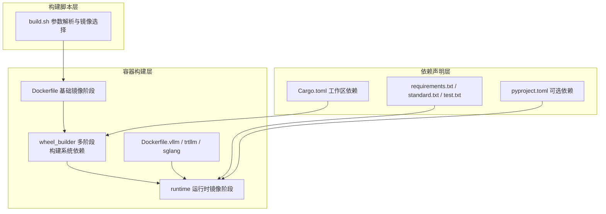
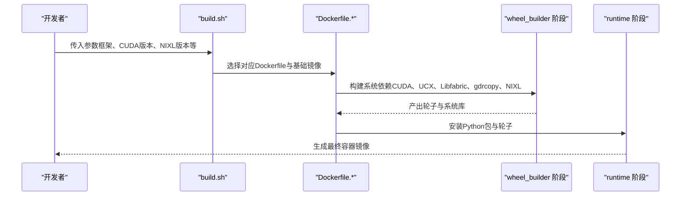
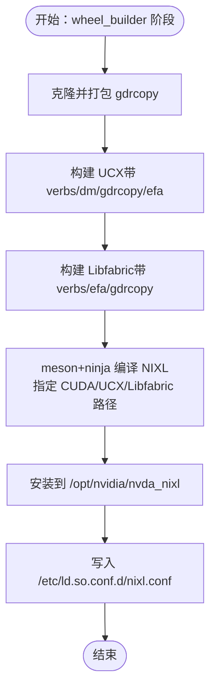
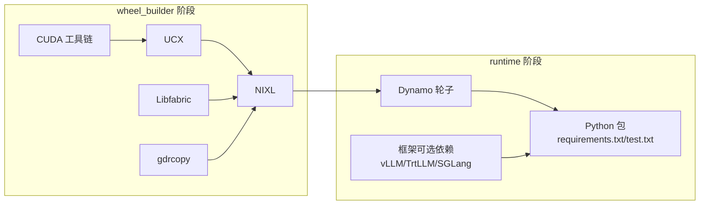

# 依赖管理

<cite>
**本文引用的文件**
- [container/deps/requirements.txt](file://container/deps/requirements.txt)
- [container/deps/requirements.standard.txt](file://container/deps/requirements.standard.txt)
- [container/deps/requirements.test.txt](file://container/deps/requirements.test.txt)
- [container/Dockerfile](file://container/Dockerfile)
- [container/Dockerfile.vllm](file://container/Dockerfile.vllm)
- [container/Dockerfile.trtllm](file://container/Dockerfile.trtllm)
- [container/Dockerfile.sglang](file://container/Dockerfile.sglang)
- [container/build.sh](file://container/build.sh)
- [container/deps/vllm/install_vllm.sh](file://container/deps/vllm/install_vllm.sh)
- [container/deps/trtllm/install_nixl.sh](file://container/deps/trtllm/install_nixl.sh)
- [pyproject.toml](file://pyproject.toml)
- [Cargo.toml](file://Cargo.toml)
- [lib/bindings/python/pyproject.toml](file://lib/bindings/python/pyproject.toml)
- [lib/gpu_memory_service/pyproject.toml](file://lib/gpu_memory_service/pyproject.toml)
</cite>

## 目录
1. [简介](#简介)
2. [项目结构](#项目结构)
3. [核心组件](#核心组件)
4. [架构总览](#架构总览)
5. [详细组件分析](#详细组件分析)
6. [依赖关系分析](#依赖关系分析)
7. [性能考量](#性能考量)
8. [故障排查指南](#故障排查指南)
9. [结论](#结论)
10. [附录](#附录)

## 简介
本文件系统化梳理Dynamo容器的依赖管理体系，覆盖Python依赖（requirements.txt、requirements.standard.txt、requirements.test.txt）、GPU相关依赖（CUDA、cuDNN、NCCL）与NVIDIA NIXL库的编译与集成、不同推理框架（vLLM、TensorRT-LLM、SGLang）的系统依赖与库版本要求，并提供依赖冲突解决、版本兼容性检查、升级策略、依赖更新流程、安全扫描与漏洞修复的最佳实践。

## 项目结构
Dynamo容器依赖管理由以下层次构成：
- 容器构建层：通过多阶段Dockerfile在wheel_builder阶段构建系统级依赖（CUDA、UCX、Libfabric、gdrcopy、NIXL），在runtime阶段安装Python包与轮子。
- 依赖声明层：通过requirements.txt、requirements.standard.txt、requirements.test.txt声明Python依赖；通过pyproject.toml与Cargo.toml声明Rust与Python可选依赖。
- 框架适配层：针对不同推理框架（vLLM、TensorRT-LLM、SGLang）在Dockerfile中注入对应的CUDA/cuDNN/NCCL与第三方库版本。
- 构建脚本层：build.sh统一解析参数、选择基础镜像与目标阶段、传递NIXL与EFA等构建参数。

图表来源
- [container/Dockerfile](file://container/Dockerfile#L1-L655)
- [container/Dockerfile.vllm](file://container/Dockerfile.vllm#L1-L800)
- [container/Dockerfile.trtllm](file://container/Dockerfile.trtllm#L1-L885)
- [container/Dockerfile.sglang](file://container/Dockerfile.sglang#L1-L600)
- [container/build.sh](file://container/build.sh#L1-L1140)
- [pyproject.toml](file://pyproject.toml#L50-L67)
- [Cargo.toml](file://Cargo.toml#L1-L142)

章节来源
- [container/Dockerfile](file://container/Dockerfile#L1-L655)
- [container/Dockerfile.vllm](file://container/Dockerfile.vllm#L1-L800)
- [container/Dockerfile.trtllm](file://container/Dockerfile.trtllm#L1-L885)
- [container/Dockerfile.sglang](file://container/Dockerfile.sglang#L1-L600)
- [container/build.sh](file://container/build.sh#L1-L1140)
- [pyproject.toml](file://pyproject.toml#L50-L67)
- [Cargo.toml](file://Cargo.toml#L1-L142)

## 核心组件
- Python依赖清单
  - requirements.txt：通用运行时依赖，含版本固定与上限约束策略，明确CUDA相关包的平台差异处理。
  - requirements.standard.txt：CUDA相关系统包（如ucx-py-cu12）的平台变体约束。
  - requirements.test.txt：测试与基准依赖，含boto3、datasets、nats-py等。
- 推理框架可选依赖
  - vLLM：包含nixl[cu12]与vllm[flashinfer,runai]。
  - TensorRT-LLM：包含tensorrt-llm。
  - SGLang：包含sglang与cupy-cuda12x。
- Rust工作区依赖
  - 统一在Cargo.toml中声明，包含OpenTelemetry、Tokio、Axum等生态库。
- 构建与安装脚本
  - install_vllm.sh：按CUDA版本安装vLLM、FlashInfer、DeepGEMM与EP内核。
  - install_nixl.sh：为TensorRT-LLM安装NIXL（当前x86仅支持）。

章节来源
- [container/deps/requirements.txt](file://container/deps/requirements.txt#L1-L63)
- [container/deps/requirements.standard.txt](file://container/deps/requirements.standard.txt#L1-L13)
- [container/deps/requirements.test.txt](file://container/deps/requirements.test.txt#L1-L37)
- [pyproject.toml](file://pyproject.toml#L50-L67)
- [Cargo.toml](file://Cargo.toml#L45-L128)
- [container/deps/vllm/install_vllm.sh](file://container/deps/vllm/install_vllm.sh#L1-L178)
- [container/deps/trtllm/install_nixl.sh](file://container/deps/trtllm/install_nixl.sh#L1-L81)

## 架构总览
Dynamo容器依赖管理采用“多阶段构建 + 显式版本约束 + 框架特化”的设计：
- 多阶段构建：wheel_builder阶段集中安装系统依赖（CUDA、UCX、Libfabric、gdrcopy、NIXL），runtime阶段仅安装Python包与轮子，确保镜像最小化与可复现。
- 版本约束策略：对纯Python包使用==，对平台相关包使用<=或<，避免>=引入未知未来版本导致的不兼容。
- 框架特化：不同Dockerfile针对vLLM、TensorRT-LLM、SGLang设置不同的CUDA/cuDNN/NCCL版本与第三方库版本。

图表来源
- [container/build.sh](file://container/build.sh#L592-L601)
- [container/Dockerfile](file://container/Dockerfile#L113-L452)
- [container/Dockerfile.vllm](file://container/Dockerfile.vllm#L140-L517)
- [container/Dockerfile.trtllm](file://container/Dockerfile.trtllm#L146-L480)
- [container/Dockerfile.sglang](file://container/Dockerfile.sglang#L127-L460)

## 详细组件分析

### Python依赖管理策略
- 版本固定与上限策略
  - 纯Python包使用==以保证可复现。
  - 平台相关包（如grpcio-tools、kubernetes_asyncio、nvidia-ml-py、protobuf等）使用<=或<，以适配不同平台与CUDA版本差异。
  - 明确禁止>=，防止引入未经测试的未来版本。
- CUDA相关包的平台差异
  - requirements.standard.txt中的ucx-py-cu12标注为CUDA 12变体，版本上限可能随平台/架构变化。
- 框架版本约束
  - transformers使用>=4.56.0以满足所有框架需求。
  - pydantic使用>=2.11.4,<2.13以兼容vLLM依赖。
- 测试依赖
  - requirements.test.txt包含pytest系列、boto3、datasets、nats-py等，用于LoRA测试、数据集加载与对象存储验证。

章节来源
- [container/deps/requirements.txt](file://container/deps/requirements.txt#L4-L62)
- [container/deps/requirements.standard.txt](file://container/deps/requirements.standard.txt#L4-L12)
- [container/deps/requirements.test.txt](file://container/deps/requirements.test.txt#L4-L36)

### GPU相关依赖：CUDA、cuDNN、NCCL
- CUDA版本与镜像
  - vLLM：CUDA 12.9（基础镜像标签含cuda12.9-devel，运行时镜像为12.9.1-runtime）。
  - SGLang：CUDA 12.9（基础镜像标签含cuda12.9-devel，运行时镜像为v0.5.8-cu130-runtime）。
  - TensorRT-LLM：CUDA 13.1（基础镜像为ngc/pytorch 25.12-py3，运行时镜像为25.12-cuda13.1-runtime-ubuntu24.04）。
- cuDNN与NCCL
  - vLLM：使用CUDA 12.9运行时镜像自带的cuDNN与NCCL。
  - SGLang：根据CUDA主版本安装对应cuDNN与NCCL（CUDA 12安装nvidia-cudnn-cu12与nvidia-nccl-cu12；CUDA 13安装nvidia-cudnn-cu13与nvidia-nccl-cu13）。
  - TensorRT-LLM：从NGC PyTorch镜像复制cuSPARSELt等库，并在运行时镜像中安装libnccl.so符号链接。
- RDMA/UCX/Libfabric
  - wheel_builder阶段安装libibverbs、rdma-core、hwloc等RDMA依赖，并构建UCX与Libfabric，供NIXL与框架使用。

章节来源
- [container/Dockerfile.vllm](file://container/Dockerfile.vllm#L73-L84)
- [container/Dockerfile.sglang](file://container/Dockerfile.sglang#L44-L45)
- [container/Dockerfile.trtllm](file://container/Dockerfile.trtllm#L46-L47)
- [container/Dockerfile.sglang](file://container/Dockerfile.sglang#L756-L757)
- [container/Dockerfile.vllm](file://container/Dockerfile.vllm#L625-L627)
- [container/Dockerfile.trtllm](file://container/Dockerfile.trtllm#L756-L757)

### NVIDIA NIXL库的编译与集成
- 编译流程
  - wheel_builder阶段：克隆gdrcopy并打包安装内核模块与开发头文件；构建UCX与Libfabric；使用meson+ninja编译NIXL，指定CUDA路径、UCX与Libfabric路径。
  - 安装后写入/etc/ld.so.conf.d/与环境变量，确保运行时可加载。
- 集成方式
  - 将NIXL库与插件目录复制到runtime镜像；在Dockerfile中设置LD_LIBRARY_PATH包含NIXL与UCX库。
  - vLLM与SGLang在安装阶段额外安装nixl[cu12]可选依赖。
- TensorRT-LLM专用安装
  - 提供install_nixl.sh脚本，基于UCX与Meson构建NIXL插件（当前x86平台可用，ARM64临时禁用）。

图表来源
- [container/Dockerfile](file://container/Dockerfile#L217-L384)
- [container/Dockerfile.vllm](file://container/Dockerfile.vllm#L247-L426)
- [container/Dockerfile.trtllm](file://container/Dockerfile.trtllm#L250-L406)
- [container/Dockerfile.sglang](file://container/Dockerfile.sglang#L358-L387)
- [container/deps/trtllm/install_nixl.sh](file://container/deps/trtllm/install_nixl.sh#L38-L78)

章节来源
- [container/Dockerfile](file://container/Dockerfile#L217-L384)
- [container/Dockerfile.vllm](file://container/Dockerfile.vllm#L247-L426)
- [container/Dockerfile.trtllm](file://container/Dockerfile.trtllm#L250-L406)
- [container/Dockerfile.sglang](file://container/Dockerfile.sglang#L358-L387)
- [container/deps/trtllm/install_nixl.sh](file://container/deps/trtllm/install_nixl.sh#L38-L78)

### 不同推理框架的系统依赖与库版本要求
- vLLM
  - 基础镜像：cuda-dl-base（CUDA 12.9或13.0），运行时镜像：cuda:12.9.1-runtime-ubuntu24.04。
  - 通过install_vllm.sh安装vLLM、FlashInfer、DeepGEMM与EP内核；CUDA 12使用PyPI发布版，CUDA 13从GitHub下载wheel。
  - 运行时镜像复制CUDA工具链与头文件，设置CUDA_DEVICE_ORDER以避免NVML错误。
- TensorRT-LLM
  - 基础镜像：ngc/pytorch:25.12-py3，运行时镜像：cuda-dl-base:25.12-cuda13.1-runtime-ubuntu24.04。
  - 从NGC PyTorch镜像复制PyTorch、Triton、cuSPARSELt等；安装libnccl.so符号链接；安装AWS SDK C++以支持NIXL对象后端。
  - 支持从本地wheel目录、嵌入镜像wheel或从索引URL安装TensorRT-LLM。
- SGLang
  - 基础镜像：cuda-dl-base（CUDA 12.9或13.0），运行时镜像：lmsysorg/sglang:v0.5.8-runtime。
  - 安装sglang并根据CUDA主版本强制重装对应cuDNN与NCCL；启用SGLANG_FORCE_SHUTDOWN以支持强制关闭。

章节来源
- [container/Dockerfile.vllm](file://container/Dockerfile.vllm#L73-L84)
- [container/deps/vllm/install_vllm.sh](file://container/deps/vllm/install_vllm.sh#L14-L177)
- [container/Dockerfile.trtllm](file://container/Dockerfile.trtllm#L46-L47)
- [container/Dockerfile.trtllm](file://container/Dockerfile.trtllm#L558-L620)
- [container/Dockerfile.sglang](file://container/Dockerfile.sglang#L44-L45)
- [container/Dockerfile.sglang](file://container/Dockerfile.sglang#L547-L563)

### 依赖冲突解决与版本兼容性检查
- 版本固定优先：对已知稳定且广泛使用的包使用==，减少上游变更带来的破坏性影响。
- 平台差异处理：对grpcio-tools、kubernetes_asyncio、nvidia-ml-py等使用<=或<，并在不同架构/平台下验证。
- 框架版本对齐：通过transformers>=4.56.0与pydantic>=2.11.4,<2.13满足vLLM、TensorRT-LLM、SGLang的共同依赖。
- CUDA版本一致性：确保基础镜像、运行时镜像与NIXL、UCX、Libfabric的CUDA主版本一致；必要时在安装阶段强制重装匹配的cuDNN/NCCL。
- 依赖冲突定位：利用uv pip install的报错信息定位冲突包，结合requirements.txt中的上限版本进行回退或替换。

章节来源
- [container/deps/requirements.txt](file://container/deps/requirements.txt#L4-L62)
- [container/Dockerfile.vllm](file://container/Dockerfile.vllm#L625-L627)
- [container/Dockerfile.sglang](file://container/Dockerfile.sglang#L547-L563)

### 升级策略
- 渐进式升级：先在wheel_builder阶段升级系统依赖（如UCX、Libfabric、gdrcopy），再在runtime阶段升级Python包，最后验证框架安装。
- 版本锁定与回滚：对CUDA/cuDNN/NCCL与框架版本进行组合锁定，出现问题时回滚到上一个稳定组合。
- 可选依赖分离：将框架可选依赖（vLLM、TensorRT-LLM、SGLang）拆分为独立安装路径，便于单独升级与测试。

章节来源
- [container/Dockerfile](file://container/Dockerfile#L397-L452)
- [container/Dockerfile.vllm](file://container/Dockerfile.vllm#L557-L581)
- [container/Dockerfile.trtllm](file://container/Dockerfile.trtllm#L558-L620)
- [container/Dockerfile.sglang](file://container/Dockerfile.sglang#L517-L543)

### 依赖更新流程、安全扫描与漏洞修复
- 依赖更新流程
  - 在requirements.txt中调整版本范围或固定版本；在pyproject.toml中更新可选依赖版本；在Cargo.toml中更新Rust依赖。
  - 使用build.sh的--dry-run验证构建命令；在wheel_builder阶段验证系统依赖兼容性。
  - 针对不同框架分别测试安装与运行，确保无冲突。
- 安全扫描与漏洞修复
  - 使用uv pip install --requirement时结合缓存与离线源，减少外部依赖暴露面。
  - 对于需要访问Git仓库的依赖，通过build.sh传入GITHUB_TOKEN/GITLAB_TOKEN以避免公开凭据泄露。
  - 在CI中集成安全扫描工具（如OSV、Trivy）对镜像层进行扫描，重点关注CUDA驱动、系统库与第三方Python包。

章节来源
- [container/build.sh](file://container/build.sh#L653-L659)
- [container/Dockerfile](file://container/Dockerfile#L613-L618)
- [container/Dockerfile.vllm](file://container/Dockerfile.vllm#L570-L581)
- [container/Dockerfile.trtllm](file://container/Dockerfile.trtllm#L594-L602)

## 依赖关系分析
Dynamo的依赖关系由容器构建阶段、Python依赖清单与可选框架依赖共同决定：

图表来源
- [container/Dockerfile](file://container/Dockerfile#L123-L384)
- [container/Dockerfile.vllm](file://container/Dockerfile.vllm#L163-L426)
- [container/Dockerfile.trtllm](file://container/Dockerfile.trtllm#L169-L406)
- [container/Dockerfile.sglang](file://container/Dockerfile.sglang#L150-L387)
- [pyproject.toml](file://pyproject.toml#L50-L67)

章节来源
- [container/Dockerfile](file://container/Dockerfile#L123-L384)
- [container/Dockerfile.vllm](file://container/Dockerfile.vllm#L163-L426)
- [container/Dockerfile.trtllm](file://container/Dockerfile.trtllm#L169-L406)
- [container/Dockerfile.sglang](file://container/Dockerfile.sglang#L150-L387)
- [pyproject.toml](file://pyproject.toml#L50-L67)

## 性能考量
- 构建缓存与分层：多阶段构建与分层缓存显著提升重复构建速度；wheel_builder阶段的系统依赖构建应尽量复用。
- 并行编译：通过CARGO_BUILD_JOBS、MAX_JOBS等参数控制并行度；结合sccache（可选）加速Rust/C/C++编译。
- 运行时库路径：确保LD_LIBRARY_PATH包含NIXL、UCX、CUDA等库，避免动态加载失败导致的性能回退。
- CUDA版本与内核：根据GPU架构设置TORCH_CUDA_ARCH_LIST，确保EP内核与FlashInfer针对目标硬件优化。

章节来源
- [container/Dockerfile](file://container/Dockerfile#L128-L132)
- [container/Dockerfile.vllm](file://container/Dockerfile.vllm#L556-L562)
- [container/deps/vllm/install_vllm.sh](file://container/deps/vllm/install_vllm.sh#L23-L27)

## 故障排查指南
- 依赖安装失败
  - 检查requirements.txt中的上限版本是否与平台匹配；必要时降低版本或切换架构。
  - 对于CUDA相关包，确认基础镜像与运行时镜像的CUDA主版本一致。
- NIXL/UCX/Libfabric加载失败
  - 确认wheel_builder阶段已正确安装并写入ldconfig；检查runtime阶段是否复制了库文件与插件。
  - 核对LD_LIBRARY_PATH是否包含NIXL_LIB_DIR与UCX库路径。
- 框架安装异常
  - vLLM：检查CUDA版本与wheel来源（PyPI vs GitHub），确保FlashInfer与DeepGEMM版本匹配。
  - TensorRT-LLM：确认从NGC PyTorch镜像复制的库完整性，NCCL符号链接正确。
  - SGLang：根据CUDA主版本强制重装对应cuDNN与NCCL。
- 构建脚本问题
  - 使用--dry-run验证build.sh生成的docker build命令；检查--use-sccache所需的AWS凭据与S3桶配置。

章节来源
- [container/Dockerfile](file://container/Dockerfile#L382-L384)
- [container/Dockerfile.vllm](file://container/Dockerfile.vllm#L583-L585)
- [container/Dockerfile.trtllm](file://container/Dockerfile.trtllm#L756-L757)
- [container/Dockerfile.sglang](file://container/Dockerfile.sglang#L556-L563)
- [container/build.sh](file://container/build.sh#L367-L501)

## 结论
Dynamo容器依赖管理通过严格的版本约束策略、多阶段构建与框架特化配置，实现了在不同推理框架与CUDA版本下的可复现与高性能部署。建议在日常维护中坚持渐进式升级、严格的安全扫描与兼容性验证，确保生产环境的稳定性与安全性。

## 附录
- 关键文件路径
  - Python依赖清单：container/deps/requirements.txt、requirements.standard.txt、requirements.test.txt
  - 框架可选依赖：pyproject.toml [project.optional-dependencies]
  - Rust依赖：Cargo.toml [workspace.dependencies]
  - 构建脚本：container/build.sh
  - 框架安装脚本：container/deps/vllm/install_vllm.sh、container/deps/trtllm/install_nixl.sh
  - 容器定义：container/Dockerfile、Dockerfile.vllm、Dockerfile.trtllm、Dockerfile.sglang