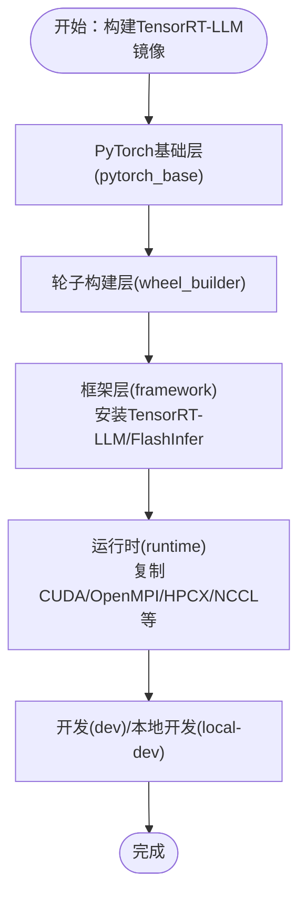

# 容器化部署

<cite>
**本文档引用的文件**
- [container/Dockerfile](file://container/Dockerfile)
- [container/Dockerfile.vllm](file://container/Dockerfile.vllm)
- [container/Dockerfile.sglang](file://container/Dockerfile.sglang)
- [container/Dockerfile.trtllm](file://container/Dockerfile.trtllm)
- [container/Dockerfile.aws](file://container/Dockerfile.aws)
- [container/Dockerfile.docs](file://container/Dockerfile.docs)
- [container/build.sh](file://container/build.sh)
- [container/run.sh](file://container/run.sh)
- [container/README.md](file://container/README.md)
- [container/use-sccache.sh](file://container/use-sccache.sh)
- [container/deps/requirements.txt](file://container/deps/requirements.txt)
- [container/deps/requirements.standard.txt](file://container/deps/requirements.standard.txt)
- [container/deps/requirements.test.txt](file://container/deps/requirements.test.txt)
</cite>

## 目录
1. [简介](#简介)
2. [项目结构](#项目结构)
3. [核心组件](#核心组件)
4. [架构总览](#架构总览)
5. [详细组件分析](#详细组件分析)
6. [依赖关系分析](#依赖关系分析)
7. [性能考虑](#性能考虑)
8. [故障排查指南](#故障排查指南)
9. [结论](#结论)
10. [附录](#附录)

## 简介
本指南面向需要在本地或CI/CD环境中构建与运行Dynamo容器的工程师，系统讲解Docker镜像构建流程、多阶段构建策略、构建参数配置、依赖管理、不同后端框架（vLLM、SGLang、TensorRT-LLM）的专用Dockerfile变体、容器运行时配置（环境变量、资源限制、网络）、构建脚本使用方法、镜像优化技巧、安全与合规、以及调试与日志收集最佳实践。

## 项目结构
容器化相关的核心文件位于`container/`目录，包含：
- 多个Dockerfile：基础镜像与各框架专用变体
- 构建与运行脚本：build.sh、run.sh
- 依赖清单：requirements.txt、requirements.test.txt、requirements.standard.txt
- 辅助工具：use-sccache.sh
- 文档：README.md


图表来源
- [container/Dockerfile](file://container/Dockerfile#L1-L655)
- [container/Dockerfile.vllm](file://container/Dockerfile.vllm#L1-L800)
- [container/Dockerfile.sglang](file://container/Dockerfile.sglang#L1-L600)
- [container/Dockerfile.trtllm](file://container/Dockerfile.trtllm#L1-L885)
- [container/Dockerfile.aws](file://container/Dockerfile.aws#L1-L91)
- [container/Dockerfile.docs](file://container/Dockerfile.docs#L1-L54)
- [container/build.sh](file://container/build.sh#L1-L1140)
- [container/run.sh](file://container/run.sh#L1-L412)
- [container/use-sccache.sh](file://container/use-sccache.sh#L1-L87)
- [container/deps/requirements.txt](file://container/deps/requirements.txt#L1-L63)
- [container/deps/requirements.test.txt](file://container/deps/requirements.test.txt#L1-L37)
- [container/deps/requirements.standard.txt](file://container/deps/requirements.standard.txt#L1-L13)
- [container/README.md](file://container/README.md#L1-L411)

章节来源
- [container/README.md](file://container/README.md#L1-L411)

## 核心组件
- 多阶段构建：基础层(dynamo_base)、轮子构建层(wheel_builder)、框架开发层(framework)、运行时(runtime)、开发(dev)、本地开发(local-dev)、前端(frontend)等。
- 框架专用Dockerfile：针对vLLM、SGLang、TensorRT-LLM分别定义了独立的构建与运行阶段，确保CUDA版本、依赖库与框架特性匹配。
- 构建脚本：build.sh负责解析参数、选择框架、设置构建参数、目标阶段、缓存策略、sccache配置等；run.sh负责容器运行时的GPU、网络、卷挂载、用户与权限等。
- 依赖管理：通过requirements.txt、requirements.test.txt、requirements.standard.txt统一管理Python依赖版本与平台差异。
- 缓存加速：use-sccache.sh支持sccache，结合Docker构建缓存提升编译速度。

章节来源
- [container/Dockerfile](file://container/Dockerfile#L1-L655)
- [container/Dockerfile.vllm](file://container/Dockerfile.vllm#L1-L800)
- [container/Dockerfile.sglang](file://container/Dockerfile.sglang#L1-L600)
- [container/Dockerfile.trtllm](file://container/Dockerfile.trtllm#L1-L885)
- [container/build.sh](file://container/build.sh#L1-L1140)
- [container/run.sh](file://container/run.sh#L1-L412)
- [container/deps/requirements.txt](file://container/deps/requirements.txt#L1-L63)
- [container/deps/requirements.test.txt](file://container/deps/requirements.test.txt#L1-L37)
- [container/deps/requirements.standard.txt](file://container/deps/requirements.standard.txt#L1-L13)
- [container/use-sccache.sh](file://container/use-sccache.sh#L1-L87)

## 架构总览
Dynamo容器化采用多阶段构建，核心流程如下：
- 基础层(dynamo_base)：安装uv、NATS、etcd、Rust工具链，准备CUDA与系统依赖。
- 轮子构建层(wheel_builder)：在manylinux环境中构建Python轮子与NIXL、UCX、libfabric、FFmpeg等二进制组件。
- 框架开发层(framework)：为vLLM/SGLang/TensorRT-LLM分别安装对应框架与优化库。
- 运行时(runtime)：复制CUDA、NATS、etcd、UCX、NIXL、轮子到轻量运行时镜像，创建非root用户dynamo。
- 开发(dev)/本地开发(local-dev)：在runtime基础上添加开发工具、编辑安装源码、用户UID/GID映射。
- 前端(frontend)：集成EPP与Dynamo运行时，用于Kubernetes网关部署。

```mermaid
graph TB
A[dynamo_base<br/>安装uv/NATS/etcd/Rust/CUDA] --> B[wheel_builder<br/>manylinux构建轮子与二进制]
B --> C[runtime<br/>复制CUDA/NATS/etcd/UCX/NIXL/轮子]
A --> D[framework(vLLM/SGLang/TRTLLM)<br/>安装框架与优化库]
D --> C
C --> E[dev/local-dev<br/>添加开发工具/源码/用户映射]
C --> F[frontend<br/>集成EPP与Dynamo运行时]
```

图表来源
- [container/Dockerfile](file://container/Dockerfile#L63-L547)
- [container/Dockerfile.vllm](file://container/Dockerfile.vllm#L90-L799)
- [container/Dockerfile.sglang](file://container/Dockerfile.sglang#L77-L598)
- [container/Dockerfile.trtllm](file://container/Dockerfile.trtllm#L96-L800)

## 详细组件分析

### 多阶段构建策略与分层缓存
- 分层设计：基础层仅做系统级准备；轮子构建层隔离编译环境；运行时层最小化依赖；开发层叠加工具与源码。
- 层缓存优化：按“稳定不变”到“频繁变化”的顺序COPY，先COPY pyproject.toml等锁定文件，再COPY源码，以最大化利用Docker层缓存。
- 组件复用：UCX、libfabric、NIXL、FFmpeg在wheel_builder中构建并复制到runtime，避免重复编译。

章节来源
- [container/Dockerfile](file://container/Dockerfile#L397-L441)
- [container/Dockerfile.vllm](file://container/Dockerfile.vllm#L448-L491)
- [container/Dockerfile.sglang](file://container/Dockerfile.sglang#L409-L452)
- [container/Dockerfile.trtllm](file://container/Dockerfile.trtllm#L428-L472)

### 构建参数与环境变量
- 关键构建参数（ARG）：BASE_IMAGE、BASE_IMAGE_TAG、PYTHON_VERSION、ENABLE_KVBM、ENABLE_GPU_MEMORY_SERVICE、ENABLE_MEDIA_NIXL、ENABLE_MEDIA_FFMPEG、CARGO_BUILD_JOBS、ARCH/ARCH_ALT、USE_SCCACHE、SCCACHE_BUCKET、SCCACHE_REGION、NIXL_*、CUDA_VERSION等。
- 运行时环境变量：DYNAMO_COMMIT_SHA、CUDA_DEVICE_ORDER、NIXL_*、PATH、LD_LIBRARY_PATH等。
- 版本推导：build.sh根据git tag/分支与提交ID生成镜像版本标签，便于溯源。

章节来源
- [container/Dockerfile](file://container/Dockerfile#L24-L51)
- [container/Dockerfile.vllm](file://container/Dockerfile.vllm#L73-L84)
- [container/Dockerfile.sglang](file://container/Dockerfile.sglang#L34-L56)
- [container/Dockerfile.trtllm](file://container/Dockerfile.trtllm#L34-L54)
- [container/build.sh](file://container/build.sh#L28-L58)

### 不同后端框架的专用Dockerfile变体

#### vLLM专用Dockerfile（Dockerfile.vllm）
- 特点：基于cuda-dl-base作为基础镜像，预装vLLM、DeepGEMM、FlashInfer、NIXL等；CUDA版本与运行时镜像可按CUDA 12/13自动切换。
- 运行时优化：复制CUDA开发工具、NATS/etcd、UCX/NIXL、轮子与vLLM虚拟环境，设置CUDA_DEVICE_ORDER以避免NVML错误。
- 依赖安装：通过wheel_builder生成的轮子与requirements.txt安装运行时依赖。


图表来源
- [container/Dockerfile.vllm](file://container/Dockerfile.vllm#L90-L799)

章节来源
- [container/Dockerfile.vllm](file://container/Dockerfile.vllm#L1-L800)

#### SGLang专用Dockerfile（Dockerfile.sglang）
- 特点：基于lmsysorg/sglang运行时镜像，安装SGLang与NIXL；针对SGLang运行时镜像进行NCCL/CuDNN等包的强制重装以适配CUDA版本。
- 运行时：启用SGLANG_FORCE_SHUTDOWN，设置NIXL路径与库路径，复制轮子与基准工具。


图表来源
- [container/Dockerfile.sglang](file://container/Dockerfile.sglang#L77-L598)

章节来源
- [container/Dockerfile.sglang](file://container/Dockerfile.sglang#L1-L600)

#### TensorRT-LLM专用Dockerfile（Dockerfile.trtllm）
- 特点：基于NGC PyTorch镜像构建框架层，随后在cuda-dl-base运行时镜像中安装TensorRT-LLM与相关库；处理NGC PyTorch与TensorRT-LLM的ABI兼容问题。
- 运行时：复制CUDA、OpenMPI、HPCX、NCCL、cuSPARSELt等，设置TRITON_*与CUDA工具路径，修复pickle问题。



图表来源
- [container/Dockerfile.trtllm](file://container/Dockerfile.trtllm#L87-L800)

章节来源
- [container/Dockerfile.trtllm](file://container/Dockerfile.trtllm#L1-L885)

### 容器运行时配置
- GPU访问：默认通过nvidia runtime与--gpus all启用GPU；可设置CUDA_VISIBLE_DEVICES、CUDA_DEVICE_ORDER等。
- 用户与权限：默认以非root用户dynamo运行，GID 0保证组写权限；支持--user覆盖UID/GID。
- 网络模式：host（默认，高性能）、bridge（隔离）、none（受限功能）、container:name（共享网络）。
- 资源限制：--shm-size、--ulimit memlock/stack/no-file、--ipc host、--cap-add CAP_SYS_PTRANCE等。
- 卷挂载：支持挂载工作区、HuggingFace缓存、/tmp、/mnt等；--mount-workspace自动挂载/workspace并设置HF缓存。

章节来源
- [container/run.sh](file://container/run.sh#L1-L412)
- [container/README.md](file://container/README.md#L275-L353)

### 构建脚本使用说明

#### build.sh（镜像构建）
- 功能：解析框架、目标阶段、CUDA版本、sccache、缓存、标签等参数，调用docker build。
- 关键选项：
  - --framework：vllm/trtllm/sglang/none，默认vllm
  - --target：dev/runtime/local-dev/frontend，默认dev
  - --cuda-version：设置CUDA版本，影响基础镜像与运行时镜像标签
  - --enable-kvbm/--enable-gpu-memory-service/--enable-media-nixl/--enable-media-ffmpeg：功能开关
  - --use-sccache/--sccache-bucket/--sccache-region：启用sccache并指定S3存储
  - --cache-from/--cache-to：外部缓存
  - --dry-run：仅打印命令不执行
- TRTLLM特殊逻辑：支持从本地wheel目录、Artifactory下载或源码构建三种方式，自动处理ABI兼容性。


图表来源
- [container/build.sh](file://container/build.sh#L173-L502)

章节来源
- [container/build.sh](file://container/build.sh#L1-L1140)

#### run.sh（容器运行）
- 功能：封装docker run，自动配置GPU、网络、卷、用户、资源限制等。
- 关键选项：
  - --image：镜像名
  - --framework：框架类型
  - --mount-workspace：挂载工作区与缓存
  - --network：host/bridge/none/container:name
  - --gpus：all/none/设备列表
  - --user：覆盖运行用户
  - -v/-p/-e：自定义卷/端口/环境变量
  - --dry-run：仅打印命令
- 默认行为：非root用户dynamo，共享主机GPU，host网络，较大共享内存与文件描述符限制。


图表来源
- [container/run.sh](file://container/run.sh#L51-L340)

章节来源
- [container/run.sh](file://container/run.sh#L1-L412)

### 依赖管理与版本控制
- requirements.txt：通用依赖（FastAPI、PyYAML、Prometheus、Transformers等），采用严格版本约束策略，避免>=导致的不可重现构建。
- requirements.test.txt：测试相关依赖（pytest系列、boto3、datasets等），保持平台兼容性。
- requirements.standard.txt：CUDA相关平台差异依赖（如ucx-py-cu12），按平台/架构设定上限。
- 通过uv venv与pip安装，确保Python环境一致性与可复现性。

章节来源
- [container/deps/requirements.txt](file://container/deps/requirements.txt#L1-L63)
- [container/deps/requirements.test.txt](file://container/deps/requirements.test.txt#L1-L37)
- [container/deps/requirements.standard.txt](file://container/deps/requirements.standard.txt#L1-L13)

### 镜像优化技巧
- 多阶段构建：将编译与运行分离，减少最终镜像体积。
- 层缓存：先COPY锁定文件，再COPY源码；合理组织COPY顺序。
- sccache：通过use-sccache.sh与build.sh配合，利用S3缓存加速Rust/C/C++编译。
- 组件复用：UCX、NIXL、FFmpeg在wheel_builder构建后复制到runtime，避免重复编译。
- 轻量化运行时：runtime阶段仅保留必要库与轮子，移除开发工具与构建依赖。

章节来源
- [container/use-sccache.sh](file://container/use-sccache.sh#L1-L87)
- [container/Dockerfile](file://container/Dockerfile#L225-L237)
- [container/Dockerfile.vllm](file://container/Dockerfile.vllm#L375-L395)
- [container/Dockerfile.sglang](file://container/Dockerfile.sglang#L358-L387)
- [container/Dockerfile.trtllm](file://container/Dockerfile.trtllm#L377-L406)

### 安全配置、权限管理与合规
- 非root运行：默认以dynamo用户运行，GID 0确保组写权限；--user可覆盖UID/GID。
- 权限模型：通过umask 002与组写权限策略，避免大规模chown操作；COPY --chmod与chmod g+w组合使用。
- 合规与许可证：ATTRIBUTION*与LICENSE文件随容器分发，满足开源合规要求。
- 网络隔离：支持bridge/none/container共享模式，生产建议host或bridge并限制端口暴露。

章节来源
- [container/Dockerfile](file://container/Dockerfile#L459-L470)
- [container/Dockerfile.vllm](file://container/Dockerfile.vllm#L643-L653)
- [container/Dockerfile.sglang](file://container/Dockerfile.sglang#L481-L491)
- [container/Dockerfile.trtllm](file://container/Dockerfile.trtllm#L695-L705)
- [container/README.md](file://container/README.md#L275-L353)

### CI/CD集成建议
- 触发条件：主干推送、发布分支、PR变更。
- 步骤建议：
  1) 构建：build.sh --framework vllm --target runtime --no-cache --push
  2) 测试：run.sh --image ... --network bridge --mount-workspace -- python -m pytest ...
  3) 扫描：镜像扫描（Snyk/Trivy）与许可证检查
  4) 发布：打标签（含commit SHA）并推送至镜像仓库
- 缓存策略：使用--cache-from/--cache-to与sccache S3桶，提升流水线效率。

章节来源
- [container/build.sh](file://container/build.sh#L319-L343)
- [container/run.sh](file://container/run.sh#L298-L302)

## 依赖关系分析
Dockerfile之间存在严格的依赖关系与共享阶段，确保多框架镜像的一致性与可维护性。


图表来源
- [container/Dockerfile](file://container/Dockerfile#L63-L547)
- [container/Dockerfile.vllm](file://container/Dockerfile.vllm#L518-L799)
- [container/Dockerfile.sglang](file://container/Dockerfile.sglang#L77-L598)
- [container/Dockerfile.trtllm](file://container/Dockerfile.trtllm#L494-L800)
- [container/Dockerfile.aws](file://container/Dockerfile.aws#L26-L90)

章节来源
- [container/Dockerfile](file://container/Dockerfile#L1-L655)
- [container/Dockerfile.vllm](file://container/Dockerfile.vllm#L1-L800)
- [container/Dockerfile.sglang](file://container/Dockerfile.sglang#L1-L600)
- [container/Dockerfile.trtllm](file://container/Dockerfile.trtllm#L1-L885)
- [container/Dockerfile.aws](file://container/Dockerfile.aws#L1-L91)

## 性能考虑
- 编译加速：启用sccache并配置S3缓存，显著缩短Rust/C/C++编译时间。
- 运行时性能：CUDA_DEVICE_ORDER=PCI_BUS_ID避免NVML错误；host网络降低延迟；增大共享内存与文件描述符。
- 依赖精简：仅在runtime复制必要库与轮子，减小镜像体积与启动时间。
- 并行构建：合理设置CARGO_BUILD_JOBS与MAX_JOBS，充分利用CPU核数。

章节来源
- [container/build.sh](file://container/build.sh#L367-L385)
- [container/Dockerfile](file://container/Dockerfile#L543-L547)
- [container/Dockerfile.vllm](file://container/Dockerfile.vllm#L612-L614)
- [container/run.sh](file://container/run.sh#L392-L396)

## 故障排查指南
- 构建失败（CUDA/NCCL/ABI不兼容）：检查CUDA版本与框架镜像标签是否匹配；TRTLLM需注意与NGC PyTorch的ABI兼容性。
- 运行时NVML错误：确认CUDA_DEVICE_ORDER设置与CUDA_VISIBLE_DEVICES配置。
- 网络问题：host模式下注意端口冲突；bridge模式下使用-p暴露端口；none模式功能受限。
- 权限问题：非root运行时注意组写权限；必要时使用--user覆盖UID/GID。
- 日志收集：容器内使用标准输出/错误输出；结合宿主机日志系统（如journald/fluentd）集中收集。
- 调试：使用run.sh -it进入交互式会话；必要时使用--privileged或额外-cap添加能力。

章节来源
- [container/Dockerfile.trtllm](file://container/Dockerfile.trtllm#L567-L620)
- [container/Dockerfile.vllm](file://container/Dockerfile.vllm#L612-L614)
- [container/run.sh](file://container/run.sh#L270-L320)
- [container/README.md](file://container/README.md#L275-L353)

## 结论
Dynamo容器化方案通过多阶段构建、严格的依赖管理与灵活的运行时配置，实现了对vLLM、SGLang、TensorRT-LLM三大后端的统一支持。结合build.sh与run.sh，既能满足本地开发与CI/CD自动化需求，又能保障生产环境的安全与性能。建议在实际部署中遵循本文档的参数配置、安全策略与故障排查建议，确保镜像构建与运行的稳定性与可维护性。

## 附录
- 文档与参考：详见container/README.md中的使用示例与网络模式对比表。
- 其他镜像：Dockerfile.docs用于文档站点构建，Dockerfile.aws用于在AWS EFA环境下扩展镜像。

章节来源
- [container/README.md](file://container/README.md#L1-L411)
- [container/Dockerfile.docs](file://container/Dockerfile.docs#L1-L54)
- [container/Dockerfile.aws](file://container/Dockerfile.aws#L1-L91)