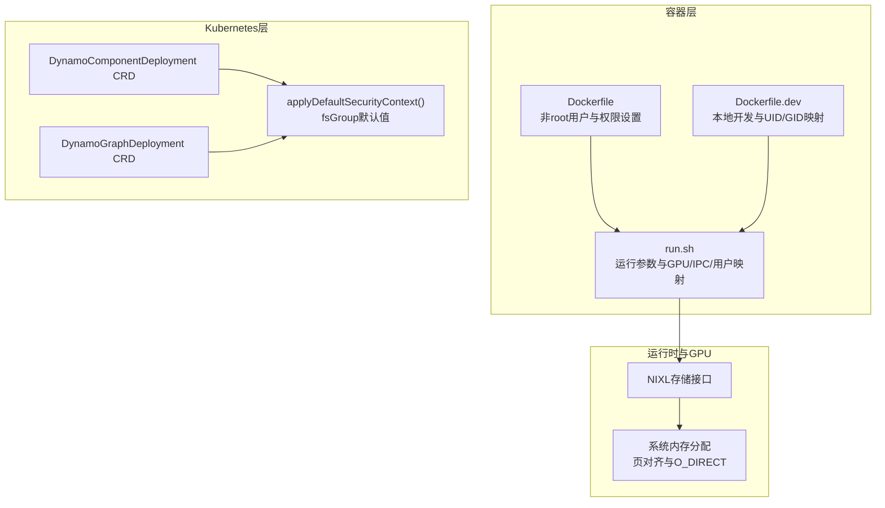
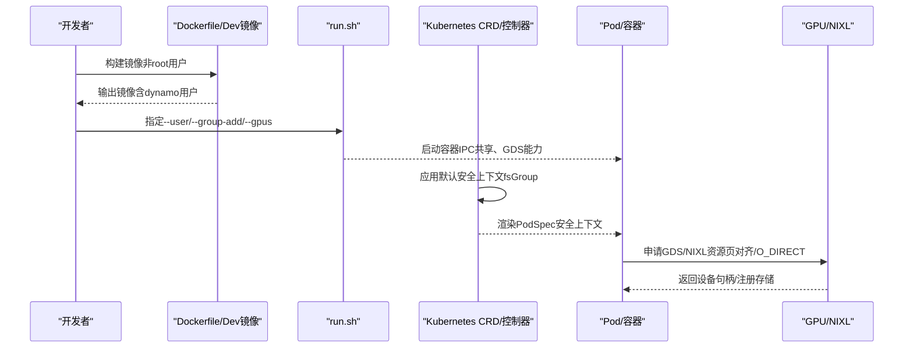
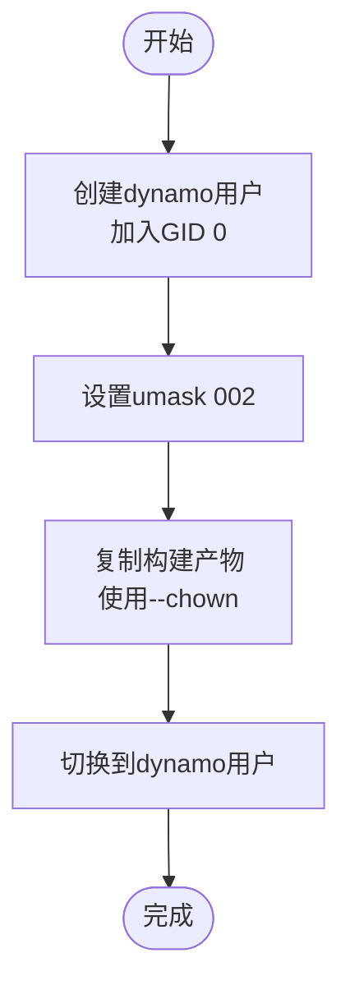
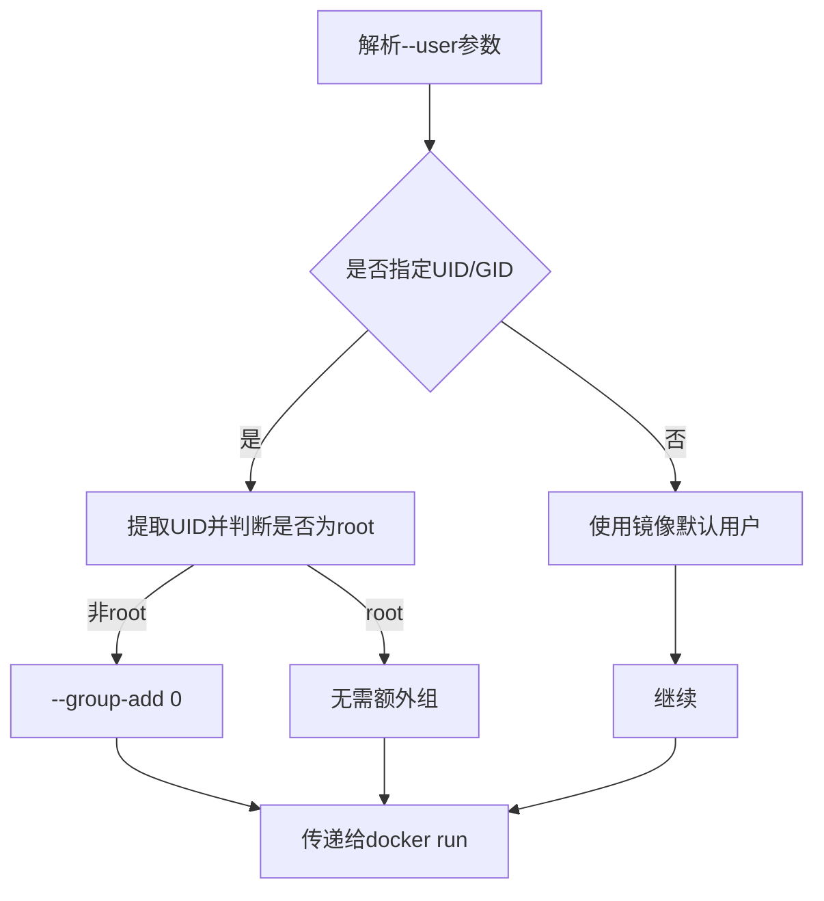
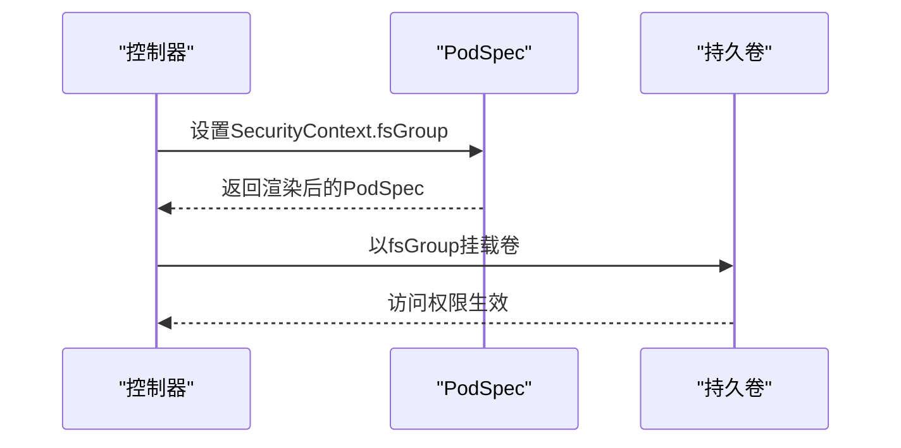
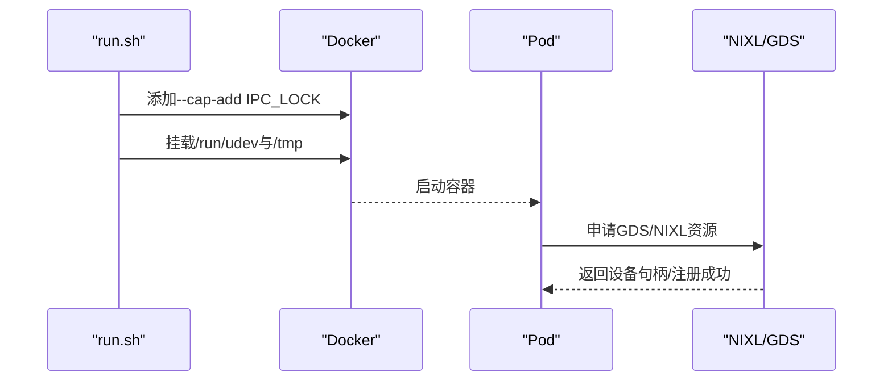
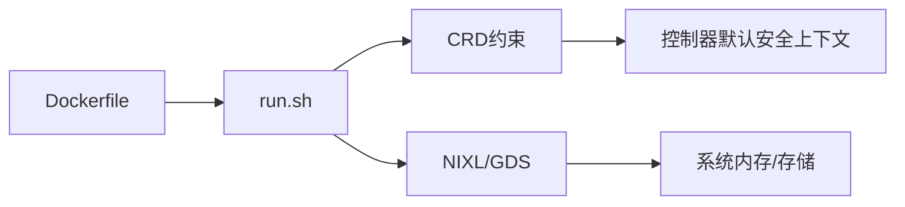

# 容器安全配置

<cite>
**本文档引用的文件**
- [container/Dockerfile](file://container/Dockerfile)
- [container/dev/Dockerfile.dev](file://container/dev/Dockerfile.dev)
- [container/run.sh](file://container/run.sh)
- [deploy/operator/internal/dynamo/graph.go](file://deploy/operator/internal/dynamo/graph.go)
- [deploy/operator/config/crd/bases/nvidia.com_dynamocomponentdeployments.yaml](file://deploy/operator/config/crd/bases/nvidia.com_dynamocomponentdeployments.yaml)
- [deploy/operator/config/crd/bases/nvidia.com_dynamographdeployments.yaml](file://deploy/operator/config/crd/bases/nvidia.com_dynamographdeployments.yaml)
- [lib/llm/src/block_manager/storage/nixl.rs](file://lib/llm/src/block_manager/storage/nixl.rs)
- [lib/memory/src/system.rs](file://lib/memory/src/system.rs)
- [lib/memory/src/prelude.rs](file://lib/memory/src/prelude.rs)
- [tests/fault_tolerance/hardware/fault_injection_service/helpers/cuda_fault_injection.py](file://tests/fault_tolerance/hardware/fault_injection_service/helpers/cuda_fault_injection.py)
- [deploy/pre-deployment/nixl/build_and_deploy.sh](file://deploy/pre-deployment/nixl/build_and_deploy.sh)
- [SECURITY.md](file://SECURITY.md)
</cite>

## 目录
1. [简介](#简介)
2. [项目结构](#项目结构)
3. [核心组件](#核心组件)
4. [架构总览](#架构总览)
5. [详细组件分析](#详细组件分析)
6. [依赖关系分析](#依赖关系分析)
7. [性能考量](#性能考量)
8. [故障排查指南](#故障排查指南)
9. [结论](#结论)
10. [附录](#附录)

## 简介
本指南面向Dynamo容器平台的安全配置与最佳实践，聚焦于非root用户运行、UID/GID映射与组权限、文件系统访问控制、只读根文件系统、安全上下文、GPU设备访问与权限控制、容器镜像安全扫描与合规检查，以及安全事件响应、日志审计与监控告警策略。文档基于仓库中现有的容器构建脚本、Kubernetes CRD定义、运行时配置与测试工具进行归纳总结，帮助读者在开发与生产环境中建立可操作的安全基线。

## 项目结构
Dynamo围绕容器化运行与Kubernetes部署展开，相关安全配置主要分布在以下位置：
- 容器镜像构建：container/Dockerfile与container/dev/Dockerfile.dev，定义非root用户创建、权限设置与运行时入口点
- 运行时脚本：container/run.sh，提供GPU、网络、IPC、用户与组等运行参数
- Kubernetes安全上下文：CRD中对Windows平台的限制与默认fsGroup设置逻辑
- GPU/NIXL相关实现：内存与存储模块对NIXL/GDS能力的使用
- 预部署检查：NIXL相关部署脚本中的Docker可用性检查
- 安全披露流程：SECURITY.md

**图表来源**
- [container/Dockerfile](file://container/Dockerfile#L459-L470)
- [container/dev/Dockerfile.dev](file://container/dev/Dockerfile.dev#L415-L436)
- [container/run.sh](file://container/run.sh#L386-L410)
- [deploy/operator/internal/dynamo/graph.go](file://deploy/operator/internal/dynamo/graph.go#L865-L882)
- [deploy/operator/config/crd/bases/nvidia.com_dynamocomponentdeployments.yaml](file://deploy/operator/config/crd/bases/nvidia.com_dynamocomponentdeployments.yaml#L7927-L7948)
- [deploy/operator/config/crd/bases/nvidia.com_dynamographdeployments.yaml](file://deploy/operator/config/crd/bases/nvidia.com_dynamographdeployments.yaml#L8136-L8156)
- [lib/llm/src/block_manager/storage/nixl.rs](file://lib/llm/src/block_manager/storage/nixl.rs#L371-L414)
- [lib/memory/src/system.rs](file://lib/memory/src/system.rs#L31-L36)

**章节来源**
- [container/Dockerfile](file://container/Dockerfile#L459-L470)
- [container/dev/Dockerfile.dev](file://container/dev/Dockerfile.dev#L415-L436)
- [container/run.sh](file://container/run.sh#L386-L410)
- [deploy/operator/internal/dynamo/graph.go](file://deploy/operator/internal/dynamo/graph.go#L865-L882)

## 核心组件
- 非root用户与权限模型
  - 运行时镜像通过创建dynamo用户并设置组0（兼容OpenShift）来避免以root运行，同时通过umask 002确保新建文件具有组写权限，减少递归chown/chmod的需要
  - 开发镜像支持本地开发的UID/GID重映射，便于Dev Container工作流
- 用户与组权限映射
  - run.sh在覆盖用户时会自动补充GID 0，避免因容器覆盖用户导致的组写权限丢失
- 文件系统访问控制
  - 通过fsGroup默认值解决卷权限问题；镜像内采用COPY --chown与受控权限设置，避免大规模递归变更
- GPU与NIXL/GDS访问
  - run.sh支持NVIDIA GPUDirect Storage（GDS）所需的挂载与CAP_SYS_PTRACE、IPC_LOCK等能力
  - 内存/存储模块要求4KB页对齐与O_DIRECT，以满足GDS要求
- 安全上下文与最小权限
  - CRD对Windows平台禁用特权字段与部分capabilities，体现最小权限原则
  - 默认仅设置fsGroup，不强制runAsNonRoot以保持向后兼容

**章节来源**
- [container/Dockerfile](file://container/Dockerfile#L459-L470)
- [container/dev/Dockerfile.dev](file://container/dev/Dockerfile.dev#L415-L436)
- [container/run.sh](file://container/run.sh#L304-L337)
- [lib/memory/src/system.rs](file://lib/memory/src/system.rs#L31-L36)
- [deploy/operator/config/crd/bases/nvidia.com_dynamocomponentdeployments.yaml](file://deploy/operator/config/crd/bases/nvidia.com_dynamocomponentdeployments.yaml#L7927-L7948)
- [deploy/operator/config/crd/bases/nvidia.com_dynamographdeployments.yaml](file://deploy/operator/config/crd/bases/nvidia.com_dynamographdeployments.yaml#L8136-L8156)
- [deploy/operator/internal/dynamo/graph.go](file://deploy/operator/internal/dynamo/graph.go#L865-L882)

## 架构总览
下图展示从容器构建到Kubernetes部署的安全配置链路，强调非root运行、权限映射与GPU访问的关键节点。

**图表来源**
- [container/Dockerfile](file://container/Dockerfile#L459-L470)
- [container/dev/Dockerfile.dev](file://container/dev/Dockerfile.dev#L415-L436)
- [container/run.sh](file://container/run.sh#L386-L410)
- [deploy/operator/internal/dynamo/graph.go](file://deploy/operator/internal/dynamo/graph.go#L865-L882)
- [lib/llm/src/block_manager/storage/nixl.rs](file://lib/llm/src/block_manager/storage/nixl.rs#L371-L414)

## 详细组件分析

### 非root用户执行与权限模型
- 镜像内用户与组
  - 运行时镜像创建dynamo用户并将其加入GID 0，确保与宿主挂载目录的组写权限一致
  - 使用umask 002统一新文件的组写权限，避免后续递归chmod/chown
- 开发镜像的UID/GID映射
  - 支持通过USER_UID/USER_GID参数在本地开发镜像中重映射用户，便于VS Code Dev Containers工作流
- 权限设置原则
  - 优先使用COPY --chown与受控权限，避免大规模递归操作

**图表来源**
- [container/Dockerfile](file://container/Dockerfile#L459-L470)
- [container/dev/Dockerfile.dev](file://container/dev/Dockerfile.dev#L415-L436)

**章节来源**
- [container/Dockerfile](file://container/Dockerfile#L459-L470)
- [container/dev/Dockerfile.dev](file://container/dev/Dockerfile.dev#L415-L436)

### 用户权限管理：UID/GID映射与组权限
- 覆盖用户时的组回退
  - 当通过--user覆盖容器用户时，run.sh自动添加GID 0，保证组写权限不丢失
- 组权限一致性
  - 镜像内所有挂载目录均以dynamo用户拥有且组写权限开放，避免大规模权限修复

**图表来源**
- [container/run.sh](file://container/run.sh#L321-L337)

**章节来源**
- [container/run.sh](file://container/run.sh#L321-L337)

### 文件系统访问控制与最小权限
- 卷权限与fsGroup
  - 控制器默认设置fsGroup以解决卷权限问题，不强制runAsNonRoot以保持兼容
- 镜像内权限策略
  - 通过COPY --chown与受控chmod，避免递归操作带来的性能与稳定性问题

**图表来源**
- [deploy/operator/internal/dynamo/graph.go](file://deploy/operator/internal/dynamo/graph.go#L865-L882)

**章节来源**
- [deploy/operator/internal/dynamo/graph.go](file://deploy/operator/internal/dynamo/graph.go#L865-L882)

### 只读根文件系统与安全上下文
- 最小权限原则
  - CRD对Windows平台禁用特权模式、capabilities、只读根文件系统等字段，体现最小权限
  - 默认仅设置fsGroup，避免强制非root运行破坏现有镜像兼容性

**章节来源**
- [deploy/operator/config/crd/bases/nvidia.com_dynamocomponentdeployments.yaml](file://deploy/operator/config/crd/bases/nvidia.com_dynamocomponentdeployments.yaml#L7927-L7948)
- [deploy/operator/config/crd/bases/nvidia.com_dynamographdeployments.yaml](file://deploy/operator/config/crd/bases/nvidia.com_dynamographdeployments.yaml#L8136-L8156)

### GPU设备访问与NIXL/GDS权限控制
- 运行时能力与挂载
  - run.sh支持NIXL GDS：添加IPC_LOCK能力、挂载/run/udev与/tmp（必要时），用于GDS注册与设备访问
- 内核/页对齐与O_DIRECT
  - 系统内存分配要求4KB页对齐与O_DIRECT，以满足GDS传输要求
- 设备ID与注册
  - NIXL存储接口通过CUDA上下文或文件描述符作为设备ID，完成注册与解绑

**图表来源**
- [container/run.sh](file://container/run.sh#L304-L316)
- [lib/memory/src/system.rs](file://lib/memory/src/system.rs#L31-L36)
- [lib/llm/src/block_manager/storage/nixl.rs](file://lib/llm/src/block_manager/storage/nixl.rs#L371-L414)

**章节来源**
- [container/run.sh](file://container/run.sh#L304-L316)
- [lib/memory/src/system.rs](file://lib/memory/src/system.rs#L31-L36)
- [lib/llm/src/block_manager/storage/nixl.rs](file://lib/llm/src/block_manager/storage/nixl.rs#L371-L414)

### 容器镜像安全扫描与合规检查
- 预部署检查
  - NIXL部署脚本包含Docker可用性检查，提示用户需加入docker组或修复daemon状态
- 建议流程
  - 在CI中集成镜像扫描（如Clair、Trivy）与SBOM生成
  - 对关键依赖进行漏洞扫描与合规性检查
  - 将扫描结果纳入发布门禁

**章节来源**
- [deploy/pre-deployment/nixl/build_and_deploy.sh](file://deploy/pre-deployment/nixl/build_and_deploy.sh#L58-L78)

### 安全事件响应、日志审计与监控告警
- 审计策略
  - 通过环境变量初始化审计策略，支持启用审计与强制日志
- 日志与可观测性
  - 文档提供了JSONL日志格式与Grafana Alloy收集器的安装步骤，便于与Loki集成
- 建议实践
  - 在生产中启用审计sink，结合Prometheus/Grafana进行告警
  - 对敏感环境变量（如LD_PRELOAD）进行检测与告警

**章节来源**
- [lib/llm/src/audit/config.rs](file://lib/llm/src/audit/config.rs#L15-L27)
- [fern/pages/kubernetes/observability/logging.md](file://fern/pages/kubernetes/observability/logging.md#L44-L82)
- [tests/fault_tolerance/hardware/fault_injection_service/helpers/cuda_fault_injection.py](file://tests/fault_tolerance/hardware/fault_injection_service/helpers/cuda_fault_injection.py#L285-L308)

## 依赖关系分析
- 容器构建与运行
  - Dockerfile定义非root用户与权限；run.sh负责运行时参数注入（GPU、IPC、用户映射、GDS）
- Kubernetes安全上下文
  - CRD对Windows平台字段限制与控制器默认fsGroup设置共同构成安全基线
- GPU/NIXL栈
  - 内存/存储模块对页对齐与O_DIRECT的要求，直接影响运行时能力与挂载需求

**图表来源**
- [container/Dockerfile](file://container/Dockerfile#L459-L470)
- [container/run.sh](file://container/run.sh#L386-L410)
- [deploy/operator/internal/dynamo/graph.go](file://deploy/operator/internal/dynamo/graph.go#L865-L882)
- [lib/memory/src/system.rs](file://lib/memory/src/system.rs#L31-L36)

**章节来源**
- [container/Dockerfile](file://container/Dockerfile#L459-L470)
- [container/run.sh](file://container/run.sh#L386-L410)
- [deploy/operator/internal/dynamo/graph.go](file://deploy/operator/internal/dynamo/graph.go#L865-L882)
- [lib/memory/src/system.rs](file://lib/memory/src/system.rs#L31-L36)

## 性能考量
- 避免递归权限变更
  - 镜像构建阶段使用COPY --chown与受控权限，避免在容器启动时进行大规模chown/chmod
- 组写权限与缓存
  - umask 002与组0确保新文件具备组写权限，减少后续权限修复开销
- GPU访问路径
  - GDS需要/tmp与/run/udev挂载，合理规划卷挂载可降低I/O延迟

[本节为通用建议，无需特定文件引用]

## 故障排查指南
- Docker可用性与权限
  - 预部署脚本提示需将用户加入docker组或修复daemon状态
- GPU访问失败
  - 确认已启用GDS相关挂载与能力；检查/proc驱动路径是否可访问
- 审计与日志
  - 检查审计sink环境变量与日志格式（JSONL）配置

**章节来源**
- [deploy/pre-deployment/nixl/build_and_deploy.sh](file://deploy/pre-deployment/nixl/build_and_deploy.sh#L58-L78)
- [tests/fault_tolerance/hardware/fault_injection_service/helpers/cuda_fault_injection.py](file://tests/fault_tolerance/hardware/fault_injection_service/helpers/cuda_fault_injection.py#L169-L198)
- [lib/llm/src/audit/config.rs](file://lib/llm/src/audit/config.rs#L15-L27)

## 结论
Dynamo在容器安全方面采取了渐进式改进：镜像层面采用非root用户与受控权限、运行时通过fsGroup解决卷权限、Kubernetes层面以最小权限原则约束CRD字段、GPU访问通过明确的能力与挂载满足NIXL/GDS要求。建议在CI中引入镜像扫描与合规检查，在生产中启用审计与日志采集，形成闭环的安全运营体系。

## 附录
- 安全披露渠道
  - 通过NVIDIA官方PSIRT邮箱或表单提交潜在漏洞，附带复现步骤与影响评估

**章节来源**
- [SECURITY.md](file://SECURITY.md#L18-L32)