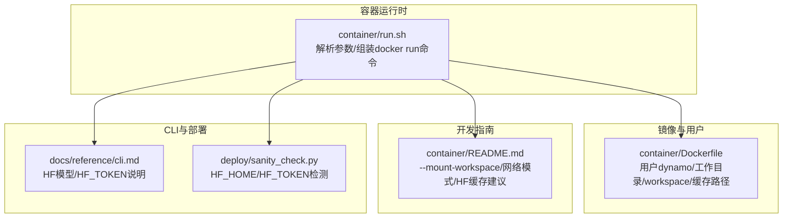
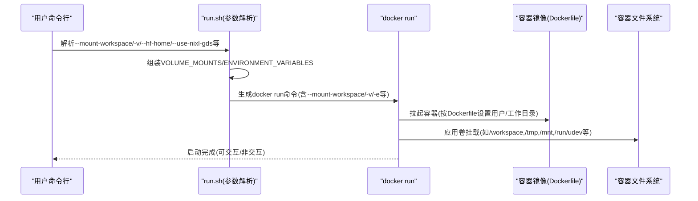
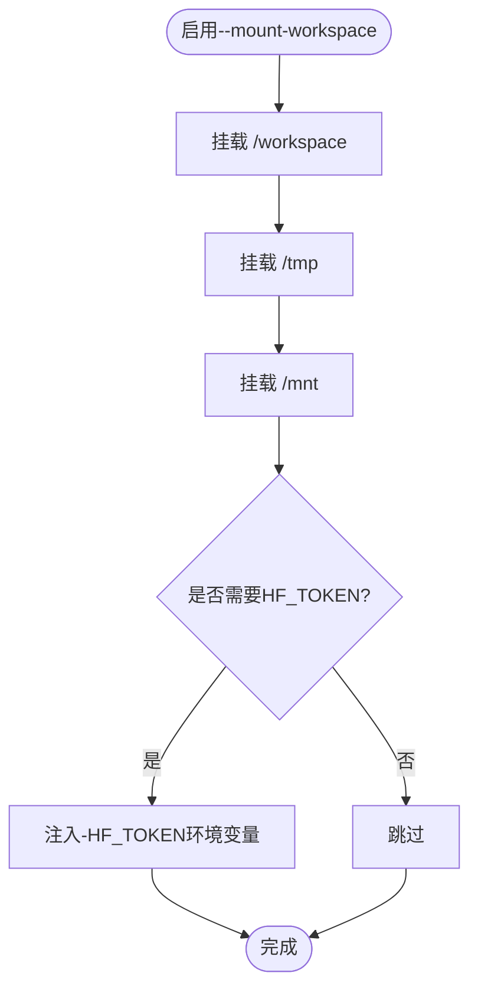
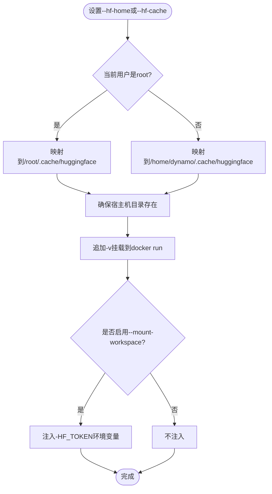
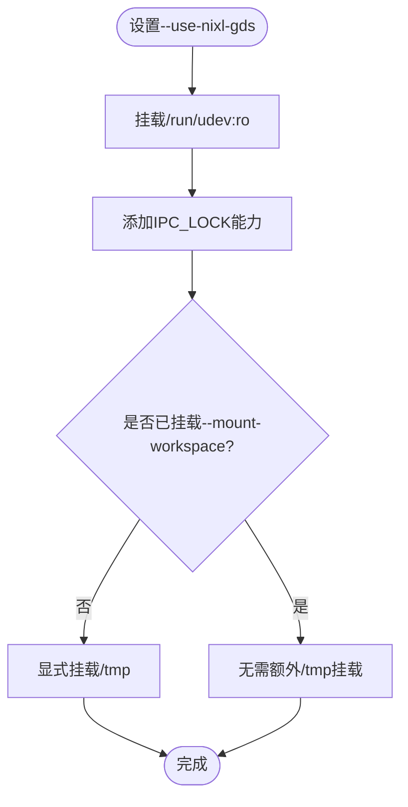
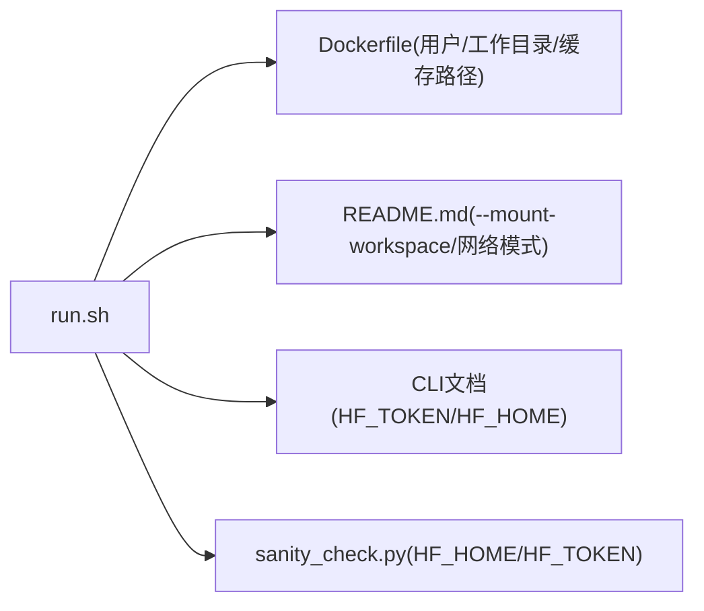

# 卷挂载和数据持久化

<cite>
**本文档引用的文件**
- [container/run.sh](file://container/run.sh)
- [container/README.md](file://container/README.md)
- [container/Dockerfile](file://container/Dockerfile)
- [docs/reference/cli.md](file://docs/reference/cli.md)
- [deploy/sanity_check.py](file://deploy/sanity_check.py)
</cite>

## 目录
1. [简介](#简介)
2. [项目结构](#项目结构)
3. [核心组件](#核心组件)
4. [架构总览](#架构总览)
5. [详细组件分析](#详细组件分析)
6. [依赖关系分析](#依赖关系分析)
7. [性能考量](#性能考量)
8. [故障排查指南](#故障排查指南)
9. [结论](#结论)

## 简介
本指南聚焦于Dynamo容器的卷挂载与数据持久化，系统讲解以下主题：
- -v参数的使用方法与挂载格式规范
- 工作空间挂载(--mount-workspace)的功能与必要性
- HuggingFace缓存挂载(--hf-home/--hf-cache)的实现细节与用户权限处理
- HF_TOKEN环境变量的自动设置
- NVIDIA GPUDirect Storage(GDS)所需的特殊挂载与能力
- 实际挂载场景示例与常见问题排查

## 项目结构
围绕卷挂载与持久化，相关的关键位置如下：
- 容器运行时：container/run.sh负责解析命令行参数、组装docker run命令并注入卷挂载与环境变量
- 开发指南：container/README.md提供--mount-workspace、网络模式、HF缓存等使用建议
- 镜像定义：container/Dockerfile定义了用户(dynamo)、工作目录(/workspace)与缓存目录(/home/dynamo/.cache)
- CLI参考：docs/reference/cli.md说明HF模型下载与HF_TOKEN在开发中的作用
- 健康检查：deploy/sanity_check.py展示HF_HOME/HF_TOKEN在部署检测中的体现

**图表来源**
- [container/run.sh](file://container/run.sh#L147-L179)
- [container/Dockerfile](file://container/Dockerfile#L459-L470)
- [container/README.md](file://container/README.md#L223-L274)
- [docs/reference/cli.md](file://docs/reference/cli.md#L33-L35)
- [deploy/sanity_check.py](file://deploy/sanity_check.py#L1773-L1775)

**章节来源**
- [container/run.sh](file://container/run.sh#L147-L179)
- [container/README.md](file://container/README.md#L223-L274)
- [container/Dockerfile](file://container/Dockerfile#L459-L470)
- [docs/reference/cli.md](file://docs/reference/cli.md#L33-L35)
- [deploy/sanity_check.py](file://deploy/sanity_check.py#L1773-L1775)

## 核心组件
- 参数解析与挂载组装
  - -v参数：支持多次传入，将原始挂载字符串追加到VOLUME_MOUNTS中
  - --mount-workspace：自动添加/workspace、/tmp、/mnt三处挂载，并在需要时设置HF_TOKEN环境变量
  - --hf-home/--hf-cache：指定HuggingFace缓存目录，脚本会根据当前用户(root或非root)映射到容器内的不同路径
  - --use-nixl-gds：启用GDS相关挂载与能力，包括/run/udev只读挂载与/tmp临时目录挂载
- 用户与组权限
  - 当显式指定--user时，脚本会为非root用户自动添加GID 0的补充组，避免大体积挂载工作区导致昂贵的chown修复
- 运行时参数
  - GPU/GPU字符串、交互模式、特权模式、网络模式、工作目录、IPC共享内存、ulimit等

**章节来源**
- [container/run.sh](file://container/run.sh#L147-L179)
- [container/run.sh](file://container/run.sh#L258-L282)
- [container/run.sh](file://container/run.sh#L304-L316)
- [container/run.sh](file://container/run.sh#L321-L337)

## 架构总览
下图展示了从命令行参数到docker run执行的整体流程，以及与卷挂载、环境变量、GDS能力的关系。

**图表来源**
- [container/run.sh](file://container/run.sh#L147-L179)
- [container/run.sh](file://container/run.sh#L258-L282)
- [container/run.sh](file://container/run.sh#L304-L316)
- [container/Dockerfile](file://container/Dockerfile#L459-L470)

## 详细组件分析

### -v参数与挂载格式规范
- 支持多次传入，每次追加一个完整的-v参数片段
- 格式遵循docker run -v的通用语法，例如：
  - 主机路径:容器路径
  - 主机路径:容器路径:ro(只读)
  - 使用绝对路径更稳妥
- 建议
  - 对于HF缓存，优先使用--hf-home明确映射
  - 对于开发工作区，推荐使用--mount-workspace自动挂载常用目录
  - 对于GDS，确保--mount-workspace或显式挂载/tmp

**章节来源**
- [container/run.sh](file://container/run.sh#L147-L153)
- [container/README.md](file://container/README.md#L241-L273)

### 工作空间挂载(--mount-workspace)
- 自动挂载
  - /workspace: 将容器源码所在上级目录绑定到容器内/workspace，便于本地修改即时生效
  - /tmp: 临时文件与中间产物的共享
  - /mnt: 示例中用于多节点演示的挂载点
- 必要性
  - 在本地开发与调试中，通过bind mount覆盖镜像内代码，提升迭代效率
  - 与HF_TOKEN联动：当启用--mount-workspace时，脚本会自动注入-HF_TOKEN环境变量，便于下载受保护模型
- 注意事项
  - 大型工作区挂载可能带来权限与性能问题，结合--user与--group-add策略优化

**图表来源**
- [container/run.sh](file://container/run.sh#L258-L268)

**章节来源**
- [container/run.sh](file://container/run.sh#L258-L268)
- [container/README.md](file://container/README.md#L64-L70)

### HuggingFace缓存挂载(--hf-home/--hf-cache)
- 目录映射规则
  - 若当前用户为root，则映射到容器内/root/.cache/huggingface
  - 若当前用户为普通用户，则映射到/home/dynamo/.cache/huggingface
- 自动创建与权限
  - 脚本会在宿主机上创建指定目录(若不存在)，保证后续挂载可用
- HF_TOKEN环境变量
  - 当启用--mount-workspace时，脚本会自动添加-HF_TOKEN环境变量，便于访问受保护模型
- CLI参考
  - 文档指出对需要鉴权的模型需设置HF_TOKEN

**图表来源**
- [container/run.sh](file://container/run.sh#L270-L282)
- [docs/reference/cli.md](file://docs/reference/cli.md#L33-L35)

**章节来源**
- [container/run.sh](file://container/run.sh#L270-L282)
- [docs/reference/cli.md](file://docs/reference/cli.md#L33-L35)
- [deploy/sanity_check.py](file://deploy/sanity_check.py#L1773-L1775)

### NVIDIA GPUDirect Storage(GDS)特殊挂载
- 关键挂载
  - /run/udev:ro：GDS依赖udev事件与设备信息
  - /tmp：KVBM磁盘池在/tmp分配文件，GDS要求该目录被挂载
- 条件逻辑
  - 当设置--use-nixl-gds时：
    - 自动添加/run/udev:ro挂载
    - 添加IPC_LOCK能力
    - 如果未启用--mount-workspace，则显式挂载/tmp
- 适用场景
  - 需要高性能存储直通与RDMA加速的推理场景

**图表来源**
- [container/run.sh](file://container/run.sh#L304-L316)

**章节来源**
- [container/run.sh](file://container/run.sh#L304-L316)

### 用户与组权限处理
- 当显式指定--user时，脚本会检测UID，若非root则自动添加--group-add 0，使容器内组写权限保持一致，避免大规模工作区挂载后昂贵的chown修复

**章节来源**
- [container/run.sh](file://container/run.sh#L321-L337)

## 依赖关系分析
- run.sh对Dockerfile的依赖
  - 用户与工作目录：Dockerfile定义了dynamo用户与/workspace工作目录，run.sh的--workdir与用户切换需与之匹配
  - 缓存路径：run.sh根据用户类型映射HF缓存到容器内对应路径
- run.sh对开发指南的依赖
  - --mount-workspace的使用建议与最佳实践来自README
- run.sh对CLI与部署的依赖
  - HF_TOKEN与HF_HOME在CLI文档与健康检查脚本中有体现

**图表来源**
- [container/run.sh](file://container/run.sh#L258-L282)
- [container/Dockerfile](file://container/Dockerfile#L459-L470)
- [container/README.md](file://container/README.md#L223-L274)
- [docs/reference/cli.md](file://docs/reference/cli.md#L33-L35)
- [deploy/sanity_check.py](file://deploy/sanity_check.py#L1773-L1775)

**章节来源**
- [container/run.sh](file://container/run.sh#L258-L282)
- [container/Dockerfile](file://container/Dockerfile#L459-L470)
- [container/README.md](file://container/README.md#L223-L274)
- [docs/reference/cli.md](file://docs/reference/cli.md#L33-L35)
- [deploy/sanity_check.py](file://deploy/sanity_check.py#L1773-L1775)

## 性能考量
- 挂载粒度
  - 仅挂载必要目录，避免将整个根文件系统挂载到容器内，减少I/O开销与锁竞争
- 临时目录
  - /tmp在GDS场景中至关重要；KVBM磁盘池也常在/tmp分配文件，务必挂载
- 权限与写入
  - 使用--group-add 0避免大规模chown带来的性能损耗
- 网络与端口
  - host网络模式通常更适合GPU推理；桥接网络适合隔离但需注意端口发布

[本节为通用指导，不直接分析具体文件]

## 故障排查指南
- HF模型下载失败
  - 确认设置了HF_TOKEN且值有效
  - 使用--hf-home明确映射缓存目录，并确保宿主机目录存在
  - 受保护模型需在环境变量中设置HF_TOKEN
- 权限问题
  - 显式指定--user时，确认容器内组写权限正常；必要时使用--group-add 0
- GDS无法启动
  - 确保启用了--use-nixl-gds
  - 确认/run/udev:ro与/tmp已挂载
  - 如未使用--mount-workspace，需手动挂载/tmp
- 端口冲突
  - host网络模式下，同一主机仅允许单一NATS/etcd实例；如需多实例，请改用bridge并使用-p发布端口

**章节来源**
- [docs/reference/cli.md](file://docs/reference/cli.md#L33-L35)
- [container/run.sh](file://container/run.sh#L304-L316)
- [container/README.md](file://container/README.md#L275-L352)

## 结论
- -v参数支持多次传入，遵循docker标准挂载语法
- --mount-workspace是本地开发的推荐方案，自动挂载/workspace、/tmp、/mnt，并在需要时注入HF_TOKEN
- --hf-home/--hf-cache将宿主机缓存目录映射到容器内对应用户缓存路径，脚本会自动创建宿主机目录
- GDS场景必须挂载/run/udev:ro与/tmp，可通过--use-nixl-gds自动处理
- 结合--user与--group-add策略可显著降低大规模工作区挂载后的权限与性能问题