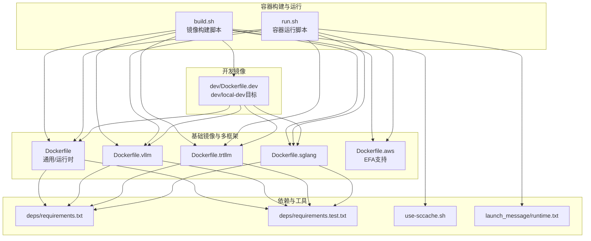
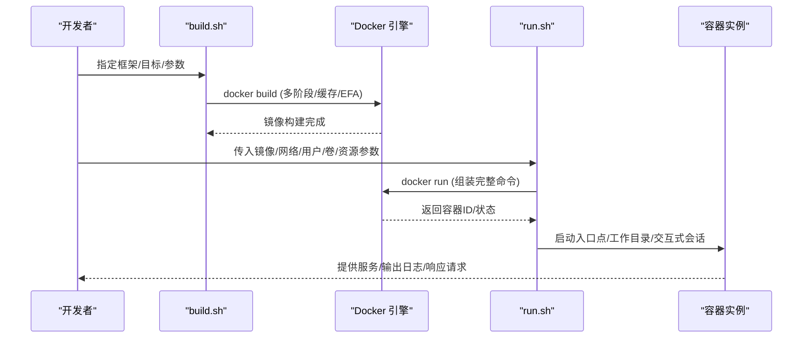
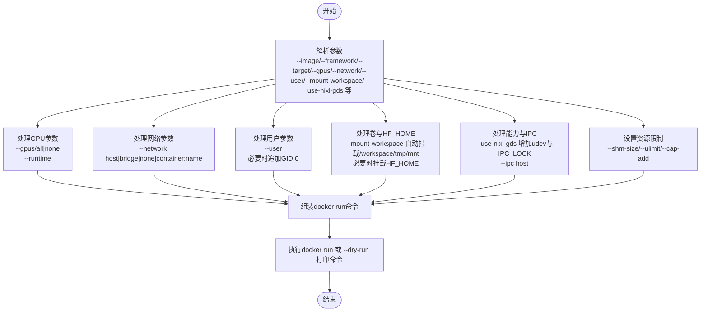
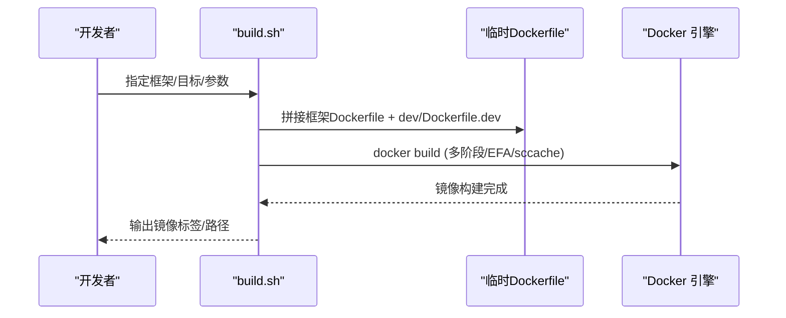
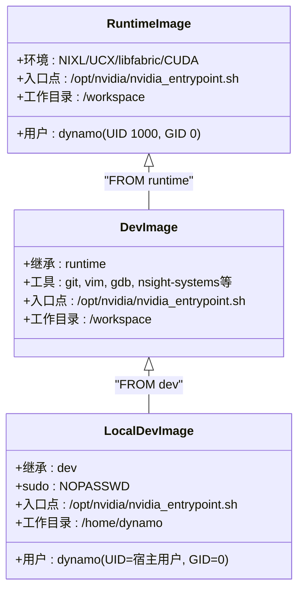
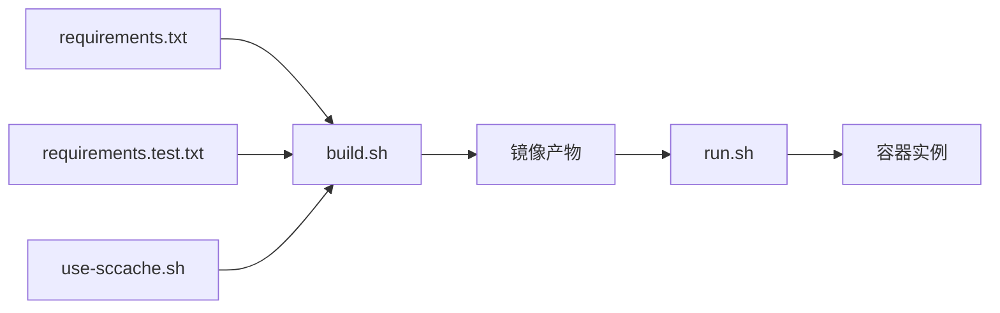

# 容器运行时管理

<cite>
**本文引用的文件**
- [run.sh](file://container/run.sh)
- [build.sh](file://container/build.sh)
- [Dockerfile](file://container/Dockerfile)
- [Dockerfile.vllm](file://container/Dockerfile.vllm)
- [Dockerfile.trtllm](file://container/Dockerfile.trtllm)
- [Dockerfile.sglang](file://container/Dockerfile.sglang)
- [Dockerfile.aws](file://container/Dockerfile.aws)
- [Dockerfile.dev](file://container/dev/Dockerfile.dev)
- [requirements.txt](file://container/deps/requirements.txt)
- [requirements.test.txt](file://container/deps/requirements.test.txt)
- [use-sccache.sh](file://container/use-sccache.sh)
- [runtime.txt](file://container/launch_message/runtime.txt)
- [README.md](file://container/README.md)
</cite>

## 目录
1. [简介](#简介)
2. [项目结构](#项目结构)
3. [核心组件](#核心组件)
4. [架构总览](#架构总览)
5. [详细组件分析](#详细组件分析)
6. [依赖关系分析](#依赖关系分析)
7. [性能考虑](#性能考虑)
8. [故障排查指南](#故障排查指南)
9. [结论](#结论)
10. [附录](#附录)

## 简介
本指南围绕Dynamo容器运行时管理，系统讲解run.sh脚本的功能与用法，涵盖GPU访问配置、用户权限管理、网络模式选择；对比不同运行目标（runtime、dev、local-dev）的差异与适用场景；阐述容器用户管理机制（非root用户执行、UID/GID映射与权限控制）；解释网络配置选项（host、bridge、none等）及其使用场景与限制；并提供容器资源管理（内存限制、文件描述符、IPC设置）以及调试技巧、日志收集与故障排查方法。内容以仓库现有实现为依据，确保可操作性与准确性。

## 项目结构
容器相关的核心文件集中在container目录：
- 构建与运行脚本：build.sh、run.sh
- 多框架Dockerfile：Dockerfile（通用）、Dockerfile.vllm、Dockerfile.trtllm、Dockerfile.sglang、Dockerfile.aws
- 开发镜像：dev/Dockerfile.dev
- 依赖清单：deps/requirements.txt、deps/requirements.test.txt
- 缓存加速：use-sccache.sh
- 启动提示：launch_message/runtime.txt
- 使用说明：README.md

图表来源
- [build.sh](file://container/build.sh#L1-L120)
- [run.sh](file://container/run.sh#L1-L120)
- [Dockerfile](file://container/Dockerfile#L1-L120)
- [Dockerfile.vllm](file://container/Dockerfile.vllm#L1-L120)
- [Dockerfile.trtllm](file://container/Dockerfile.trtllm#L1-L120)
- [Dockerfile.sglang](file://container/Dockerfile.sglang#L1-L120)
- [Dockerfile.aws](file://container/Dockerfile.aws#L1-L91)
- [Dockerfile.dev](file://container/dev/Dockerfile.dev#L1-L120)
- [requirements.txt](file://container/deps/requirements.txt#L1-L63)
- [requirements.test.txt](file://container/deps/requirements.test.txt#L1-L37)
- [use-sccache.sh](file://container/use-sccache.sh#L1-L87)
- [runtime.txt](file://container/launch_message/runtime.txt#L1-L55)

章节来源
- [README.md](file://container/README.md#L1-L120)

## 核心组件
- run.sh：容器运行时管理器，负责GPU访问、卷挂载、环境变量、网络模式、用户切换、交互式会话、资源限制等。支持dry-run预演，便于理解底层docker run命令。
- build.sh：镜像构建器，支持多框架（vLLM、TensorRT-LLM、SGLang、NONE），多目标（runtime、dev、local-dev、frontend），并提供EFA扩展层构建。
- Dockerfile系列：定义多阶段构建（dynamo_base、wheel_builder、framework、runtime、dev、local-dev），统一用户与权限策略，安装NIXL/UCX/etcd/NATS等组件。
- dev/Dockerfile.dev：在runtime基础上叠加开发者工具链与编辑安装能力，提供dev与local-dev两个目标，后者支持UID/GID映射。
- 依赖清单：requirements.txt与requirements.test.txt，约束Python包版本，保证构建一致性与可复现性。
- use-sccache.sh：sccache安装与统计展示脚本，配合build.sh启用编译缓存。
- runtime.txt：runtime镜像启动提示信息，指导如何快速开始推理示例。

章节来源
- [run.sh](file://container/run.sh#L1-L120)
- [build.sh](file://container/build.sh#L1-L120)
- [Dockerfile](file://container/Dockerfile#L450-L550)
- [Dockerfile.dev](file://container/dev/Dockerfile.dev#L170-L395)
- [requirements.txt](file://container/deps/requirements.txt#L1-L63)
- [requirements.test.txt](file://container/deps/requirements.test.txt#L1-L37)
- [use-sccache.sh](file://container/use-sccache.sh#L1-L87)
- [runtime.txt](file://container/launch_message/runtime.txt#L1-L55)

## 架构总览
容器运行时管理由“构建—运行—调试”三层组成：
- 构建层：build.sh根据框架与目标生成临时拼接的Dockerfile，调用docker build完成多阶段构建；支持EFA扩展层。
- 运行层：run.sh解析参数，组装docker run命令，注入GPU、网络、用户、卷、资源限制等；支持dry-run。
- 调试层：通过日志、端口映射、网络模式、交互式终端、资源限制等手段进行问题定位与优化。

图表来源
- [build.sh](file://container/build.sh#L580-L650)
- [run.sh](file://container/run.sh#L380-L410)

## 详细组件分析

### run.sh：容器运行时管理器
- 功能概览
  - 解析参数：--image、--framework、--target、--name、--gpus、--network、--user、--mount-workspace、--use-nixl-gds、--entrypoint、--workdir、--runtime、--privileged、--rm、-v/-p/-e、-it、--dry-run等。
  - 组装docker run命令：GPU字符串、交互式、自动清理、网络模式、运行时、共享内存、ulimit、环境变量、卷挂载、端口映射、工作目录、能力、IPC、用户与组添加、名称、入口点、镜像与剩余参数。
  - 特殊处理：
    - --mount-workspace：绑定挂载宿主/workspace与/tmp、/mnt，必要时挂载/HF_HOME到容器内默认缓存路径。
    - --use-nixl-gds：增加udev只读挂载与IPC_LOCK能力，必要时强制挂载/tmp。
    - --network none：禁用GPU运行时，避免nvidia-container-toolkit不兼容。
    - --user：若覆盖用户且非root，则追加GID 0以保持对根组可写目录的访问。
- GPU访问配置
  - 默认启用所有GPU；当--gpus为none时，移除--runtime与GPU参数，适配无GPU场景。
  - --runtime可指定nvidia以外的容器运行时（如runc），但默认使用nvidia。
- 用户权限管理
  - 支持--user指定用户名或UID[:GID]；若覆盖用户且非root，追加--group-add 0，避免因Docker丢弃补充组导致权限问题。
  - 与--mount-workspace结合时，HF_HOME会映射到容器内对应用户缓存目录。
- 网络模式
  - --network host（默认）：高性能，直接共享主机网络；注意端口冲突与安全风险。
  - --network bridge：隔离网络，可通过-p暴露特定端口。
  - --network none：完全隔离，功能受限（模型下载、外部API、分布式等不可用）。
  - --network container:name：与指定容器共享网络命名空间。
- 资源管理
  - --shm-size=10G：共享内存大小。
  - --ulimit memlock=-1、stack=67108864：解锁锁存内存与栈大小。
  - --ulimit nofile=65536:65536：提高文件描述符上限。
  - --ipc host：启用共享内存IPC。
  - --cap-add CAP_SYS_PTRACE：调试能力。
  - --cap-add IPC_LOCK：NVIDIA GPUDirect Storage所需。
- 交互与调试
  - -it：交互式终端，适合shell、调试与开发。
  - --dry-run：仅打印docker命令，不实际执行，便于审计与定制。

图表来源
- [run.sh](file://container/run.sh#L51-L410)

章节来源
- [run.sh](file://container/run.sh#L51-L410)
- [README.md](file://container/README.md#L223-L411)

### build.sh：镜像构建器
- 功能概览
  - 支持框架：vLLM、TensorRT-LLM、SGLang、NONE，默认vLLM。
  - 支持目标：runtime、dev、local-dev、frontend。
  - 多阶段拼接：将选定框架Dockerfile与dev/Dockerfile.dev拼接为临时Dockerfile，再执行构建。
  - EFA扩展：通过--make-efa在runtime或dev基础上添加AWS EFA支持。
  - sccache：可选启用，需要AWS凭证与桶/区域参数。
  - 版本标签：基于git tag/分支/提交号生成镜像标签。
- 关键流程
  - 参数解析与校验（框架、平台、UID/GID、构建参数、缓存、推送等）。
  - 选择框架对应的Dockerfile（vllm/trtllm/sglang或通用Dockerfile）。
  - 设置构建参数（BASE_IMAGE/TAG、CUDA版本、NIXL版本、EFA版本等）。
  - 拼接临时Dockerfile并执行docker build（支持--dry-run）。
  - 可选构建EFA层（runtime-aws或dev-aws）。
- 与run.sh的关系
  - run.sh依赖build.sh生成的镜像；build.sh通过--target选择runtime/dev/local-dev等目标，run.sh通过--image选择具体镜像。

图表来源
- [build.sh](file://container/build.sh#L580-L650)
- [Dockerfile.dev](file://container/dev/Dockerfile.dev#L20-L40)

章节来源
- [build.sh](file://container/build.sh#L173-L502)
- [Dockerfile.dev](file://container/dev/Dockerfile.dev#L1-L120)

### Dockerfile系列：多阶段与用户管理
- 多阶段设计
  - dynamo_base：安装uv、NATS、etcd、Rust工具链等。
  - wheel_builder：manylinux基础，构建UCX、libfabric、gdrcopy、NIXL、Rust/C/C++扩展轮子。
  - framework/runtime：复制wheel与构建产物，创建Python虚拟环境，安装Dynamo及相关轮子。
  - dev/local-dev：在runtime基础上叠加开发者工具链、编辑安装、UID/GID映射与sudo权限。
- 用户与权限
  - 统一创建dynamo用户（UID 1000，GID 0），用于runtime与dev镜像，提升OpenShift兼容性。
  - 通过umask 002与COPY --chmod=775、chmod g+w确保组可写，避免递归chown带来的性能损耗。
  - dev/local-dev目标中，local-dev通过usermod将UID/GID映射到宿主用户，保留sudo权限，便于VS Code Dev Container等场景。
- 环境变量与库路径
  - NIXL、UCX、libfabric、CUDA等路径在runtime与dev阶段分别设置，确保编译与运行时链接一致。
- 入口点与工作目录
  - runtime镜像入口点为/opt/nvidia/nvidia_entrypoint.sh，工作目录/workspace或挂载目录。

图表来源
- [Dockerfile](file://container/Dockerfile#L450-L550)
- [Dockerfile.dev](file://container/dev/Dockerfile.dev#L177-L472)

章节来源
- [Dockerfile](file://container/Dockerfile#L450-L550)
- [Dockerfile.vllm](file://container/Dockerfile.vllm#L1-L120)
- [Dockerfile.trtllm](file://container/Dockerfile.trtllm#L1-L120)
- [Dockerfile.sglang](file://container/Dockerfile.sglang#L1-L120)
- [Dockerfile.dev](file://container/dev/Dockerfile.dev#L177-L472)

### 不同运行目标（runtime、dev、local-dev）对比与适用场景
- runtime
  - 非root用户（dynamo，UID 1000，GID 0）运行，适用于生产部署与基准测试。
  - 适合与run.sh配合，通过--mount-workspace挂载本地代码与缓存，减少镜像体积。
- dev
  - 以root运行，包含大量开发者工具链，适合传统开发与CI场景。
  - 仍可使用--mount-workspace挂载本地代码，便于热更新。
- local-dev
  - 非root用户，但UID/GID与宿主用户匹配，适合VS Code Dev Container等现代开发体验。
  - 保留sudo权限，便于在容器内执行需要特权的操作。
  - 通过--user可覆盖用户，但建议配合--mount-workspace使用以避免权限问题。

章节来源
- [README.md](file://container/README.md#L92-L114)
- [Dockerfile.dev](file://container/dev/Dockerfile.dev#L396-L472)

### 网络配置选项详解
- host（默认）
  - 性能最高，直接共享主机网络；适合GPU密集型推理与高带宽服务。
  - 注意：与宿主共享端口，同一时间只能运行一个NATS/etcd实例。
- bridge
  - 网络隔离，通过-p暴露特定端口；适合CI与需要端口控制的场景。
- none
  - 完全隔离，功能受限（无法下载模型、访问外部API、分布式通信等）。
  - 仅适用于离线/预下载模型与严格隔离环境。
- container:name
  - 与指定容器共享网络命名空间，适合sidecar、服务网格与多容器协作。
- 自定义网络
  - 通过docker network create创建自定义网络，结合--network network-name使用。

章节来源
- [run.sh](file://container/run.sh#L180-L187)
- [README.md](file://container/README.md#L275-L353)

### 容器资源管理
- 内存与共享内存
  - --shm-size=10G：满足大模型推理与分布式通信需求。
  - --ulimit memlock=-1：允许锁定内存，避免OOM。
  - --ulimit stack=67108864：增大栈大小，避免深度递归或大对象初始化失败。
- 文件描述符
  - --ulimit nofile=65536:65536：提高并发连接与文件句柄上限。
- IPC设置
  - --ipc host：启用共享内存IPC，利于多进程/多容器间通信。
- 调试能力
  - --cap-add CAP_SYS_PTRACE：允许调试与跟踪。
  - --cap-add IPC_LOCK：NVIDIA GPUDirect Storage所需。

章节来源
- [run.sh](file://container/run.sh#L390-L405)

### 调试技巧、日志收集与故障排查
- 调试技巧
  - 使用--dry-run查看run.sh生成的docker run命令，便于审计与修改。
  - 使用--mount-workspace挂载本地代码，结合-itt进行交互式调试。
  - 在bridge网络下通过-p暴露端口，便于外部工具接入。
- 日志收集
  - runtime镜像启动提示包含基本使用说明，可在容器内查看runtime.txt。
  - 通过docker logs或容器内日志输出定位问题。
- 故障排查
  - GPU不可用：检查--gpus与--runtime；当--gpus=none时自动移除--runtime。
  - 权限问题：使用--user时若非root，run.sh会追加GID 0；local-dev建议与--mount-workspace配合。
  - 网络问题：确认--network模式是否符合预期；none模式功能受限。
  - 编译/构建问题：build.sh支持--no-cache与--dry-run；sccache需正确配置AWS凭证与桶/区域。

章节来源
- [run.sh](file://container/run.sh#L196-L203)
- [runtime.txt](file://container/launch_message/runtime.txt#L1-L55)
- [use-sccache.sh](file://container/use-sccache.sh#L22-L35)

## 依赖关系分析
- 构建依赖
  - requirements.txt与requirements.test.txt约束Python依赖版本，确保构建一致性。
  - use-sccache.sh提供sccache安装与统计，build.sh可启用以加速编译。
- 运行依赖
  - Dockerfile系列统一安装NIXL、UCX、libfabric、CUDA等运行时库，确保推理后端正常工作。
  - dev/Dockerfile.dev在runtime基础上叠加开发者工具链，支持编辑安装与调试。

图表来源
- [requirements.txt](file://container/deps/requirements.txt#L1-L63)
- [requirements.test.txt](file://container/deps/requirements.test.txt#L1-L37)
- [use-sccache.sh](file://container/use-sccache.sh#L1-L87)
- [build.sh](file://container/build.sh#L580-L650)
- [run.sh](file://container/run.sh#L380-L410)

章节来源
- [requirements.txt](file://container/deps/requirements.txt#L1-L63)
- [requirements.test.txt](file://container/deps/requirements.test.txt#L1-L37)
- [use-sccache.sh](file://container/use-sccache.sh#L1-L87)
- [build.sh](file://container/build.sh#L580-L650)
- [run.sh](file://container/run.sh#L380-L410)

## 性能考虑
- 构建性能
  - 多阶段构建与layer缓存：dynamo_base、wheel_builder、framework、runtime分层，最大化缓存命中率。
  - sccache：启用后可显著缩短C/C++/Rust编译时间，需正确配置AWS S3存储桶与区域。
- 运行性能
  - host网络：最小化网络开销，适合GPU推理与高吞吐服务。
  - bridge网络：隔离与可控端口暴露，适合CI与多服务编排。
  - none网络：完全隔离，不推荐用于推理服务。
- 资源配置
  - 合理设置--shm-size、--ulimit、--ipc host，避免内存与文件句柄不足导致性能退化。
  - 避免不必要的递归chown，采用组可写策略与umask 002，降低权限调整成本。

章节来源
- [Dockerfile](file://container/Dockerfile#L450-L550)
- [Dockerfile.dev](file://container/dev/Dockerfile.dev#L1-L120)
- [use-sccache.sh](file://container/use-sccache.sh#L1-L87)
- [run.sh](file://container/run.sh#L390-L405)

## 故障排查指南
- 常见问题与解决思路
  - 无法拉取/安装依赖：检查requirements.txt版本约束与网络连通性；必要时使用--no-cache重建。
  - 编译失败：确认GCC版本与CUDA版本兼容；启用sccache并检查AWS凭证与桶/区域配置。
  - GPU不可用：确认--gpus与--runtime；在无GPU场景下将--gpus设为none。
  - 权限问题：使用--user时若非root，run.sh会追加GID 0；local-dev建议与--mount-workspace配合。
  - 网络不通：核对--network模式；none模式功能受限；bridge模式需通过-p暴露端口。
  - 调试困难：使用--dry-run查看docker run命令；在dev/local-dev镜像中使用-itt进入交互式终端。
- 工具与脚本
  - run.sh：--dry-run、--mount-workspace、--network、--user、--gpus、--ulimit等。
  - build.sh：--no-cache、--dry-run、--make-efa、--use-sccache、--sccache-bucket、--sccache-region等。
  - use-sccache.sh：install、show-stats等。

章节来源
- [run.sh](file://container/run.sh#L196-L203)
- [build.sh](file://container/build.sh#L367-L402)
- [use-sccache.sh](file://container/use-sccache.sh#L13-L35)

## 结论
Dynamo容器运行时管理通过run.sh与build.sh实现了从构建到运行的一体化流程，结合多阶段Dockerfile与dev/Dockerfile.dev，提供了runtime、dev、local-dev三种目标以适配不同场景。其在GPU访问、用户权限、网络模式与资源管理方面具备完善的配置能力，并通过--dry-run、--mount-workspace、--network等选项为调试与排障提供了便利。遵循本文建议，可在保证安全性与可维护性的前提下，高效地进行开发、测试与生产部署。

## 附录
- 快速参考
  - 构建镜像：./build.sh --framework vllm --target runtime
  - 运行容器：./run.sh --image dynamo:latest-vllm-runtime -it
  - 本地开发：./run.sh --image dynamo:latest-vllm-local-dev --mount-workspace -it
  - CI隔离：./run.sh --image dynamo:latest-vllm --network bridge -v $HOME/.cache:/home/dynamo/.cache
  - 无GPU：./run.sh --image dynamo:latest-vllm-runtime --gpus none
  - 调试：./run.sh --dry-run

章节来源
- [README.md](file://container/README.md#L115-L411)