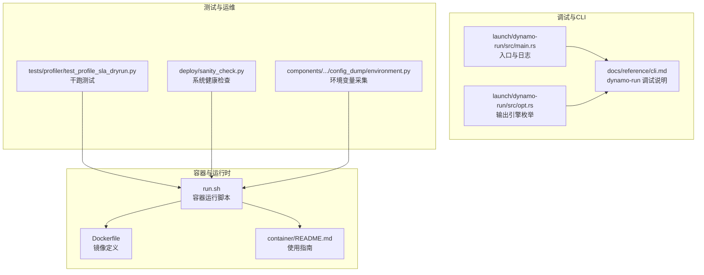
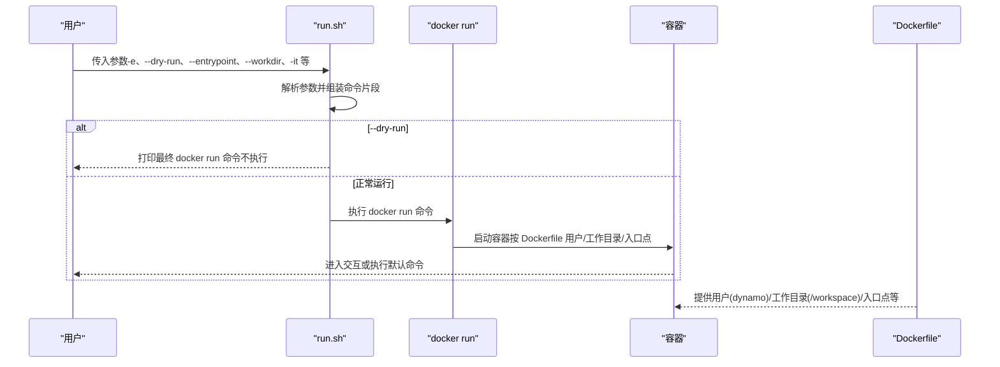
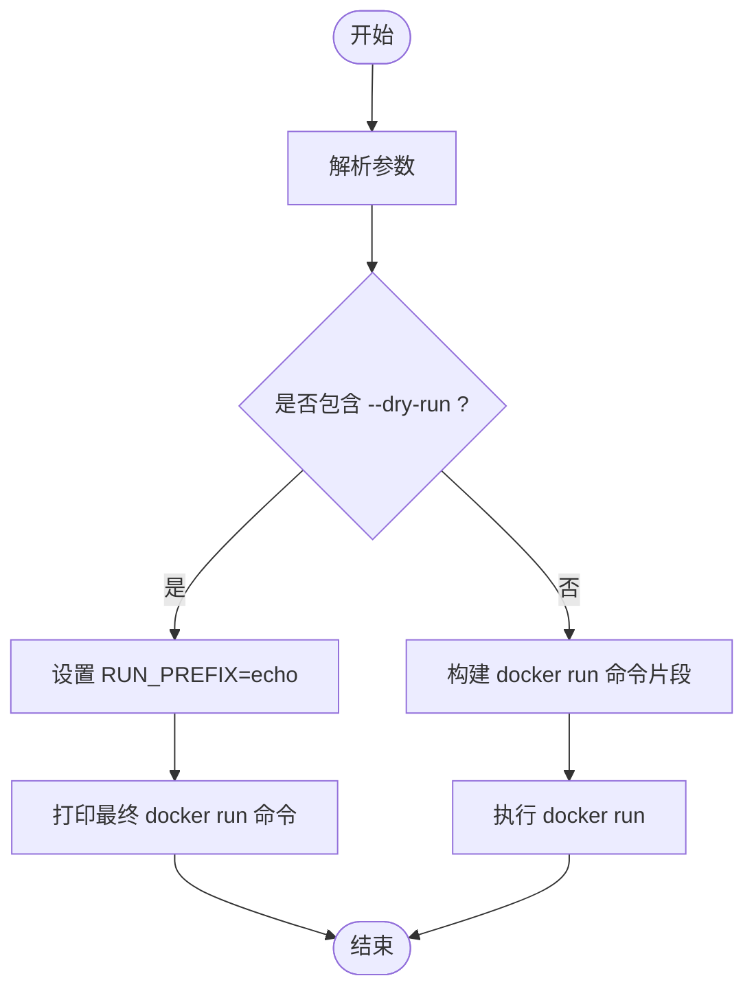
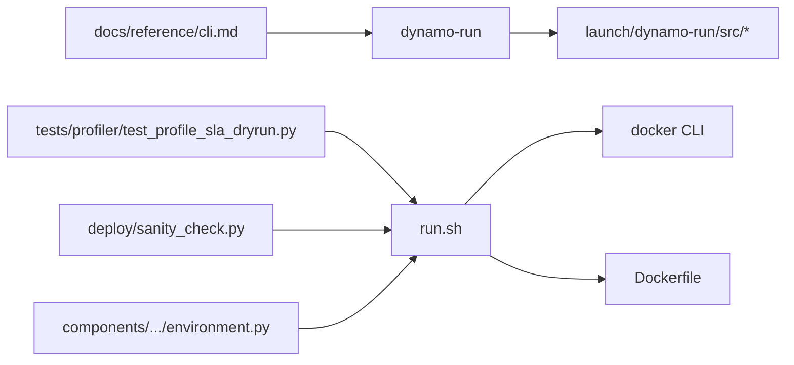

# 环境变量和调试

<cite>
**本文引用的文件**
- [container/run.sh](file://container/run.sh)
- [container/Dockerfile](file://container/Dockerfile)
- [container/README.md](file://container/README.md)
- [docs/reference/cli.md](file://docs/reference/cli.md)
- [launch/dynamo-run/src/main.rs](file://launch/dynamo-run/src/main.rs)
- [launch/dynamo-run/src/opt.rs](file://launch/dynamo-run/src/opt.rs)
- [tests/profiler/test_profile_sla_dryrun.py](file://tests/profiler/test_profile_sla_dryrun.py)
- [deploy/sanity_check.py](file://deploy/sanity_check.py)
- [components/src/dynamo/common/config_dump/environment.py](file://components/src/dynamo/common/config_dump/environment.py)
</cite>

## 目录
1. [简介](#简介)
2. [项目结构与定位](#项目结构与定位)
3. [核心组件](#核心组件)
4. [架构总览](#架构总览)
5. [详细组件分析](#详细组件分析)
6. [依赖关系分析](#依赖关系分析)
7. [性能考量](#性能考量)
8. [故障排查指南](#故障排查指南)
9. [结论](#结论)

## 简介
本指南聚焦于Dynamo容器环境变量与调试能力，围绕以下关键主题展开：
- 使用 -e 参数设置容器环境变量的方法与最佳实践
- --dry-run 预览将要执行的 docker run 命令而不实际运行容器
- --entrypoint 覆盖容器入口点的使用方法与适用场景
- --workdir 设置容器内工作目录的重要性
- 容器调试的实用技巧：交互式运行（-it）、日志收集与故障排查
- 常见问题的诊断步骤与解决方案

## 项目结构与定位
Dynamo通过容器化实现开发与部署的一致性，相关工具集中在 container 目录，运行时脚本 run.sh 提供对 docker run 的封装；同时，CLI 文档与运行时源码展示了日志与调试能力；测试与运维脚本提供了干跑与健康检查等实用能力。

图表来源
- [container/run.sh](file://container/run.sh#L1-L412)
- [container/Dockerfile](file://container/Dockerfile#L1-L655)
- [container/README.md](file://container/README.md#L1-L411)
- [docs/reference/cli.md](file://docs/reference/cli.md#L1-L409)
- [launch/dynamo-run/src/main.rs](file://launch/dynamo-run/src/main.rs#L1-L136)
- [launch/dynamo-run/src/opt.rs](file://launch/dynamo-run/src/opt.rs#L1-L63)
- [tests/profiler/test_profile_sla_dryrun.py](file://tests/profiler/test_profile_sla_dryrun.py#L1-L508)
- [deploy/sanity_check.py](file://deploy/sanity_check.py#L423-L526)
- [components/src/dynamo/common/config_dump/environment.py](file://components/src/dynamo/common/config_dump/environment.py#L59-L106)

章节来源
- [container/README.md](file://container/README.md#L223-L411)

## 核心组件
- 运行脚本 run.sh：解析并拼装 docker run 命令，支持 -e、--dry-run、--entrypoint、--workdir、-it 等参数，并在必要时打印最终命令。
- Dockerfile：定义镜像构建阶段、用户与工作目录、环境变量与入口点等，为容器运行提供基础。
- CLI 文档与运行时源码：展示日志级别控制、调试特性（如 tokio-console）以及 Rust 侧的运行流程。
- 测试与运维：提供干跑测试与健康检查脚本，辅助验证与排障。

章节来源
- [container/run.sh](file://container/run.sh#L51-L412)
- [container/Dockerfile](file://container/Dockerfile#L454-L547)
- [docs/reference/cli.md](file://docs/reference/cli.md#L400-L409)
- [launch/dynamo-run/src/main.rs](file://launch/dynamo-run/src/main.rs#L31-L61)

## 架构总览
下图展示 run.sh 如何解析参数并生成 docker run 命令，以及与 Dockerfile 中的工作目录、入口点、用户等的关系。

图表来源
- [container/run.sh](file://container/run.sh#L51-L412)
- [container/Dockerfile](file://container/Dockerfile#L454-L547)

## 详细组件分析

### 环境变量设置（-e 参数）
- 作用：向 docker run 注入环境变量，支持多次传入以设置多个变量。
- 实现机制：run.sh 将 -e 参数累积到 ENVIRONMENT_VARIABLES 变量中，最终拼接到 docker run 命令行。
- 最佳实践：
  - 在本地开发时，优先通过 -e 指定模型下载路径、缓存目录、日志级别等。
  - 对于敏感信息（如令牌），建议结合卷挂载或密钥管理，避免直接暴露在命令行。
  - 多个变量可连续使用 -e，例如 -e KEY1=VAL1 -e KEY2=VAL2。
- 示例参考（命令行形态）：
  - 在 run.sh 使用 -e 设置变量
  - 在容器内通过 Python 等方式读取环境变量进行行为控制

章节来源
- [container/run.sh](file://container/run.sh#L163-L170)
- [container/run.sh](file://container/run.sh#L396-L396)
- [container/README.md](file://container/README.md#L259-L260)

### 干跑（--dry-run）
- 作用：仅打印将要执行的 docker run 命令，不真正启动容器，便于预检与审计。
- 实现机制：run.sh 在解析到 --dry-run 时设置 RUN_PREFIX=echo，并输出提示信息。
- 使用场景：
  - CI/CD 预审：确保生成的 docker run 命令符合预期
  - 安全审计：避免误操作执行高风险命令
  - 参数组合验证：确认 -e、-v、-p、--entrypoint、--workdir 等组合是否正确
- 注意事项：
  - --dry-run 不会检查镜像是否存在或网络权限，需配合其他校验
  - 输出的命令是 run.sh 组合后的最终结果，便于复制到 shell 手工执行

图表来源
- [container/run.sh](file://container/run.sh#L196-L203)
- [container/run.sh](file://container/run.sh#L382-L412)

章节来源
- [container/run.sh](file://container/run.sh#L196-L203)
- [container/run.sh](file://container/run.sh#L382-L412)
- [container/README.md](file://container/README.md#L262-L263)

### 覆盖入口点（--entrypoint）
- 作用：指定容器启动时执行的命令，覆盖镜像默认 ENTRYPOINT。
- 实现机制：run.sh 将 --entrypoint 参数拼接为 --entrypoint ${ENTRYPOINT}，最终传给 docker run。
- 使用场景：
  - 临时进入交互式 shell：--entrypoint /bin/bash
  - 指定自定义启动脚本或服务进程
  - 与 -it 结合进行调试
- 注意事项：
  - 若镜像 ENTRYPOINT 未设置，--entrypoint 通常与 CMD 组合生效
  - 与 CMD 的关系遵循 Docker 规范，建议结合镜像的 ENTRYPOINT/CMD 设计理解

章节来源
- [container/run.sh](file://container/run.sh#L115-L122)
- [container/run.sh](file://container/run.sh#L407-L407)
- [container/Dockerfile](file://container/Dockerfile#L546-L547)

### 设置工作目录（--workdir）
- 作用：设置容器内默认工作目录，影响命令执行、相对路径访问与日志落盘位置。
- 实现机制：run.sh 将 --workdir 解析为 WORKDIR，并在 docker run 中以 -w "$WORKDIR" 传递。
- 重要性：
  - 保证脚本与数据的相对路径一致性
  - 便于在容器内进行本地开发与调试
  - 与 --mount-workspace 卷挂载配合，实现热更新与持久化
- 默认值：run.sh 默认工作目录为 /workspace，与 Dockerfile 中的 WORKDIR 一致

章节来源
- [container/run.sh](file://container/run.sh#L123-L130)
- [container/run.sh](file://container/run.sh#L399-L399)
- [container/Dockerfile](file://container/Dockerfile#L69-L69)

### 交互式调试（-it）
- 作用：分配伪终端并保持标准输入打开，适合交互式 shell、调试与快速试验。
- 实现机制：run.sh 将 -it 作为标志注入 docker run，使容器前台运行并可接收键盘输入。
- 使用建议：
  - 与 --entrypoint /bin/bash 组合，进入容器交互环境
  - 与 --mount-workspace 卷挂载结合，实现实时代码编辑
  - 在 CI/CD 中避免使用 -it，除非确有交互需求

章节来源
- [container/run.sh](file://container/run.sh#L171-L173)
- [container/README.md](file://container/README.md#L111-L111)

### 日志与调试能力
- CLI 日志级别：通过 DYN_LOG 或 -v/-vv 控制日志详细程度，便于定位问题。
- Rust 运行时调试：支持 tokio-console 功能，便于观察异步任务与调度。
- 环境变量采集：运行时可采集与过滤环境变量，辅助问题复现与审计。

章节来源
- [docs/reference/cli.md](file://docs/reference/cli.md#L13-L19)
- [docs/reference/cli.md](file://docs/reference/cli.md#L400-L409)
- [launch/dynamo-run/src/main.rs](file://launch/dynamo-run/src/main.rs#L31-L61)
- [launch/dynamo-run/src/opt.rs](file://launch/dynamo-run/src/opt.rs#L1-L63)
- [components/src/dynamo/common/config_dump/environment.py](file://components/src/dynamo/common/config_dump/environment.py#L59-L106)

### 干跑测试与验证
- 测试用例：通过测试框架在 dry-run 模式下验证配置与参数组合，确保不会触发真实部署。
- 应用场景：性能剖析、资源规划、部署前验证等。

章节来源
- [tests/profiler/test_profile_sla_dryrun.py](file://tests/profiler/test_profile_sla_dryrun.py#L142-L213)

## 依赖关系分析
- run.sh 依赖 Docker 引擎与 docker CLI，负责参数解析与命令拼装
- Dockerfile 决定容器默认用户、工作目录、入口点与环境变量，影响 run.sh 的默认行为
- CLI 文档与运行时源码提供日志与调试能力，辅助定位问题
- 测试与运维脚本提供干跑与健康检查，保障运行稳定性

图表来源
- [container/run.sh](file://container/run.sh#L386-L412)
- [container/Dockerfile](file://container/Dockerfile#L454-L547)
- [docs/reference/cli.md](file://docs/reference/cli.md#L400-L409)
- [launch/dynamo-run/src/main.rs](file://launch/dynamo-run/src/main.rs#L31-L61)
- [tests/profiler/test_profile_sla_dryrun.py](file://tests/profiler/test_profile_sla_dryrun.py#L142-L213)
- [deploy/sanity_check.py](file://deploy/sanity_check.py#L423-L526)
- [components/src/dynamo/common/config_dump/environment.py](file://components/src/dynamo/common/config_dump/environment.py#L59-L106)

## 性能考量
- 干跑有助于减少不必要的容器启动与资源消耗，适合在 CI/CD 中进行参数与配置验证
- 合理设置工作目录与卷挂载，避免频繁 I/O 与路径解析开销
- 使用 -it 交互式调试时注意前台进程占用，避免阻塞自动化流程

## 故障排查指南
- 共享内存与卷挂载
  - /dev/shm 大小不足会导致推理失败或异常退出，可通过健康检查脚本检测并告警
  - 卷挂载路径不一致可能导致找不到模型或缓存目录
- GPU 与 CUDA 版本
  - 通过健康检查脚本收集 nvidia-smi、nvcc、CUDA_VERSION 等信息，核对版本匹配
- 容器重启与事件
  - 关注容器事件（如 BackOff、CrashLoopBackOff、FailedMount）以定位挂载或依赖问题
- 环境变量与敏感信息
  - 使用环境变量采集工具识别潜在敏感项，避免泄露
- 日志与调试
  - 使用 -v/-vv 或 DYN_LOG 调整日志级别
  - 在 Rust 运行时启用 tokio-console 观察异步行为

章节来源
- [deploy/sanity_check.py](file://deploy/sanity_check.py#L505-L526)
- [deploy/sanity_check.py](file://deploy/sanity_check.py#L919-L1164)
- [tests/fault_tolerance/deploy/checkers.py](file://tests/fault_tolerance/deploy/checkers.py#L193-L213)
- [tests/fault_tolerance/deploy/k8s_utils.py](file://tests/fault_tolerance/deploy/k8s_utils.py#L146-L169)
- [docs/reference/cli.md](file://docs/reference/cli.md#L13-L19)
- [docs/reference/cli.md](file://docs/reference/cli.md#L400-L409)
- [components/src/dynamo/common/config_dump/environment.py](file://components/src/dynamo/common/config_dump/environment.py#L59-L106)

## 结论
- 使用 -e 设置环境变量时，建议结合卷挂载与密钥管理，避免明文暴露
- 通过 --dry-run 预览 docker run 命令，确保参数组合正确后再执行
- --entrypoint 与 -it 组合可用于交互式调试，但需注意与 CMD 的关系
- --workdir 与 --mount-workspace 卷挂载配合，提升开发效率与一致性
- 利用日志与 tokio-console、健康检查与干跑测试，形成完整的调试与排障闭环