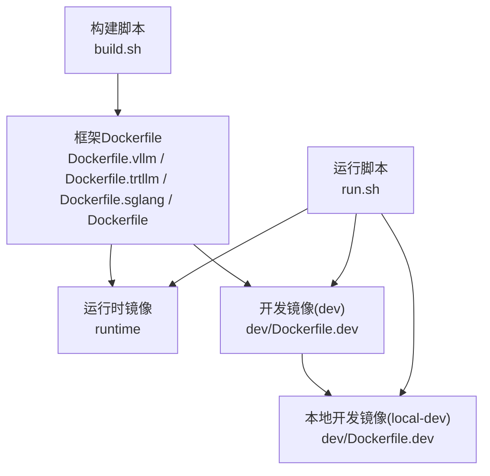
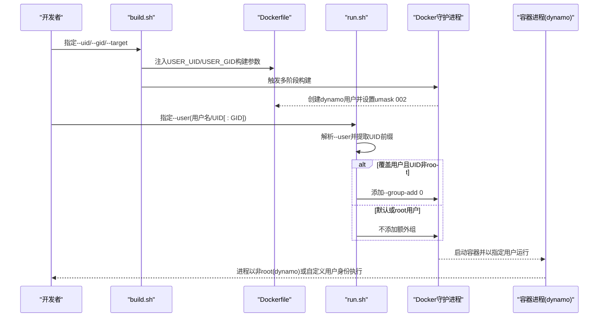
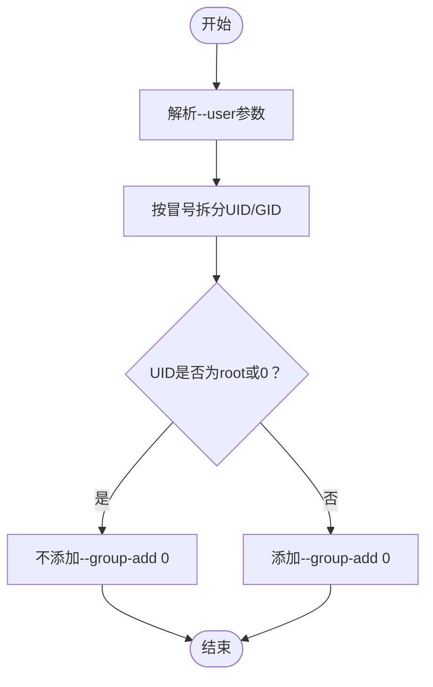
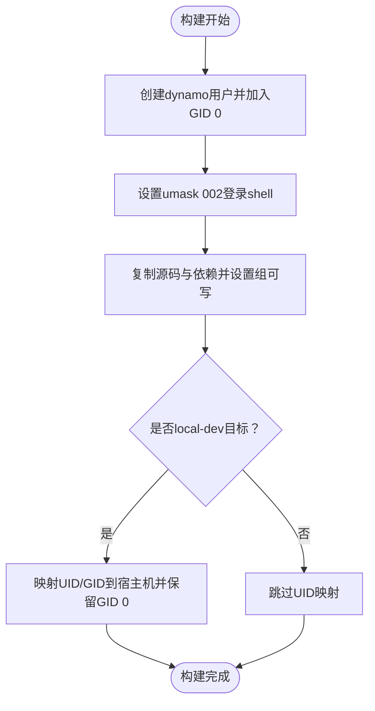
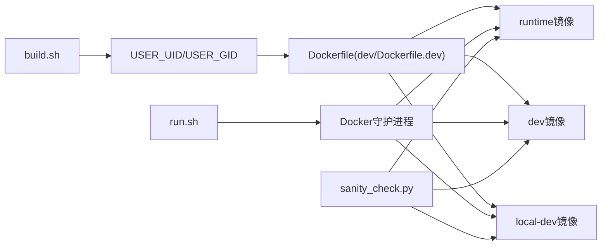

# 用户和权限管理

<cite>
**本文引用的文件**
- [container/Dockerfile](file://container/Dockerfile)
- [container/Dockerfile.vllm](file://container/Dockerfile.vllm)
- [container/Dockerfile.sglang](file://container/Dockerfile.sglang)
- [container/dev/Dockerfile.dev](file://container/dev/Dockerfile.dev)
- [container/run.sh](file://container/run.sh)
- [container/build.sh](file://container/build.sh)
- [container/README.md](file://container/README.md)
- [deploy/sanity_check.py](file://deploy/sanity_check.py)
</cite>

## 目录
1. [简介](#简介)
2. [项目结构与角色定位](#项目结构与角色定位)
3. [核心组件与职责](#核心组件与职责)
4. [架构总览](#架构总览)
5. [详细组件分析](#详细组件分析)
6. [依赖关系分析](#依赖关系分析)
7. [性能与安全考量](#性能与安全考量)
8. [故障排查指南](#故障排查指南)
9. [结论](#结论)
10. [附录：使用示例与最佳实践](#附录使用示例与最佳实践)

## 简介
本指南聚焦于Dynamo容器中的“用户与权限管理”，系统阐述以下主题：
- 容器用户切换机制与--user参数的使用方法及格式规范（用户名、数值UID、含组信息的格式）
- 非root用户执行的安全性考虑与权限控制机制
- UID/GID映射的工作原理（用户ID解析、组添加策略、root组回退机制）
- 当覆盖用户时Docker如何处理补充组，以及为何需要手动添加root组（GID 0）以保持对root拥有的组可写目录的访问
- 实际使用示例与最佳实践建议

## 项目结构与角色定位
- 容器镜像构建与运行由多阶段Dockerfile与脚本共同完成，目标是为不同工作流提供一致且安全的运行环境。
- 运行时默认以非root用户执行，确保生产安全性；开发场景支持root或非root用户，兼顾易用性与隔离性。

图表来源
- [container/build.sh](file://container/build.sh#L1-L120)
- [container/Dockerfile.vllm](file://container/Dockerfile.vllm#L1-L120)
- [container/Dockerfile.sglang](file://container/Dockerfile.sglang#L1-L120)
- [container/Dockerfile](file://container/Dockerfile#L450-L655)
- [container/dev/Dockerfile.dev](file://container/dev/Dockerfile.dev#L1-L120)
- [container/run.sh](file://container/run.sh#L180-L412)

章节来源
- [container/README.md](file://container/README.md#L1-L120)

## 核心组件与职责
- 构建脚本（build.sh）
  - 负责选择框架镜像、注入构建参数（如USER_UID/USER_GID）、生成临时拼接Dockerfile并触发多阶段构建。
  - 支持--uid/--gid仅在local-dev/local-dev-aws目标生效，避免误用。
- 运行脚本（run.sh）
  - 解析--user参数，识别用户名/数值UID及可选的组/GID，并在覆盖用户时自动追加--group-add 0，以恢复对root拥有的组可写目录的访问。
  - 提供交互式会话、GPU挂载、网络模式、端口映射等运行期配置。
- 框架Dockerfile
  - 在runtime阶段创建非root用户（dynamo），设置umask 002，使新建文件/目录具备组可写权限，减少递归chown开销。
  - vLLM/SGLang等在构建阶段明确路径需组可写，以兼容不同UID的开发者。
- 开发镜像（dev/Dockerfile.dev）
  - 提供root开发镜像（dev）与非root本地开发镜像（local-dev），后者通过USER_UID/USER_GID将容器内用户UID/GID映射到宿主机，同时保留GID 0以保持组可写能力。
- 权限检查工具（sanity_check.py）
  - 在部署/验证阶段检测文件是否“有效可写”（含所有权与权限位），辅助定位root权限与NFS等环境下的写入问题。

章节来源
- [container/build.sh](file://container/build.sh#L270-L300)
- [container/build.sh](file://container/build.sh#L1015-L1030)
- [container/run.sh](file://container/run.sh#L187-L340)
- [container/run.sh](file://container/run.sh#L326-L337)
- [container/Dockerfile](file://container/Dockerfile#L458-L470)
- [container/Dockerfile](file://container/Dockerfile#L507-L515)
- [container/Dockerfile.vllm](file://container/Dockerfile.vllm#L17-L31)
- [container/Dockerfile.sglang](file://container/Dockerfile.sglang#L17-L31)
- [container/dev/Dockerfile.dev](file://container/dev/Dockerfile.dev#L415-L433)
- [deploy/sanity_check.py](file://deploy/sanity_check.py#L1419-L1436)

## 架构总览
下图展示从构建到运行的关键权限路径与决策点，突出--user覆盖、组回退与umask策略。

图表来源
- [container/build.sh](file://container/build.sh#L270-L300)
- [container/build.sh](file://container/build.sh#L1015-L1030)
- [container/Dockerfile](file://container/Dockerfile#L458-L470)
- [container/Dockerfile](file://container/Dockerfile#L507-L515)
- [container/run.sh](file://container/run.sh#L187-L340)
- [container/run.sh](file://container/run.sh#L326-L337)

## 详细组件分析

### 组件A：--user参数解析与组回退策略
- 参数格式
  - 支持三种形式：用户名（如root）、数值UID（如0）、带组/GID的格式（如1000:0）。
  - run.sh会截取UID部分（冒号前），用于判断是否需要添加root组（GID 0）。
- 组回退机制
  - 当通过--user覆盖用户时，Docker会丢弃镜像中预设的补充组。为保证对root拥有的组可写目录（例如/workspace、/opt/dynamo等）仍可写，脚本会自动添加--group-add 0。
  - 仅当UID既不是root也不是0时才添加，避免对root用户重复添加造成冗余。

图表来源
- [container/run.sh](file://container/run.sh#L187-L340)
- [container/run.sh](file://container/run.sh#L326-L337)

章节来源
- [container/run.sh](file://container/run.sh#L356-L357)
- [container/run.sh](file://container/run.sh#L326-L337)

### 组件B：镜像构建期的用户与权限策略
- 用户创建与组归属
  - runtime阶段创建dynamo用户并将其加入GID 0，确保组可写能力。
  - dev/Dockerfile.dev在local-dev目标中，将容器内用户UID/GID映射到宿主机，同时保留GID 0，避免因递归chown导致的性能问题。
- umask 002策略
  - 通过登录shell加载/etc/profile.d/00-umask.sh设置umask 002，使新建文件/目录具备组可写权限，显著降低后续chmod -R的耗时。
  - vLLM/SGLang等在构建阶段明确指出若干路径必须组可写，以适配不同UID的开发者。
- 路径组可写约定
  - vLLM：/workspace、/home/dynamo、/opt/dynamo/venv
  - SGLang：/workspace、/home/dynamo、/home/dynamo/.local
  - 采用COPY --chmod与chmod g+w（非递归）的方式，避免大规模递归操作。

图表来源
- [container/Dockerfile](file://container/Dockerfile#L458-L470)
- [container/Dockerfile](file://container/Dockerfile#L507-L515)
- [container/Dockerfile.vllm](file://container/Dockerfile.vllm#L17-L31)
- [container/Dockerfile.sglang](file://container/Dockerfile.sglang#L17-L31)
- [container/dev/Dockerfile.dev](file://container/dev/Dockerfile.dev#L415-L433)

章节来源
- [container/Dockerfile](file://container/Dockerfile#L458-L470)
- [container/Dockerfile](file://container/Dockerfile#L507-L515)
- [container/Dockerfile.vllm](file://container/Dockerfile.vllm#L17-L31)
- [container/Dockerfile.sglang](file://container/Dockerfile.sglang#L17-L31)
- [container/dev/Dockerfile.dev](file://container/dev/Dockerfile.dev#L415-L433)

### 组件C：运行期用户切换与安全边界
- 默认运行用户
  - runtime镜像默认以非root用户（dynamo，UID 1000，GID 0）启动，提升生产安全性。
- 覆盖用户的影响
  - 使用--user覆盖后，Docker会丢弃镜像中的补充组。run.sh通过--group-add 0恢复对root拥有的组可写目录的访问。
- 安全边界
  - 生产环境优先使用runtime镜像与非root用户；开发场景可使用dev或local-dev镜像，但应避免在生产镜像上启用特权或不必要的capabilities。

章节来源
- [container/README.md](file://container/README.md#L110-L113)
- [container/run.sh](file://container/run.sh#L326-L337)

### 组件D：权限检查与NFS/根回退注意事项
- 有效性可写判定
  - 先检查os.access是否可写，再检查是否拥有文件（可chmod），最后考虑root用户（注意NFS可能进行root回退）。
- 用途
  - 帮助在部署/验证阶段快速定位权限问题，尤其是跨节点挂载与NFS环境。

章节来源
- [deploy/sanity_check.py](file://deploy/sanity_check.py#L1419-L1436)

## 依赖关系分析
- 构建脚本依赖Dockerfile的多阶段结构与构建参数（USER_UID/USER_GID），并在local-dev目标下注入UID/GID映射。
- 运行脚本依赖Docker的用户覆盖语义与组回退行为，通过--group-add 0补偿。
- 镜像层依赖umask 002与组可写约定，减少运行期权限修复成本。
- 权限检查工具作为部署后置校验，辅助定位复杂环境（如NFS）下的写入问题。

图表来源
- [container/build.sh](file://container/build.sh#L270-L300)
- [container/Dockerfile](file://container/Dockerfile#L458-L470)
- [container/dev/Dockerfile.dev](file://container/dev/Dockerfile.dev#L415-L433)
- [container/run.sh](file://container/run.sh#L187-L340)
- [deploy/sanity_check.py](file://deploy/sanity_check.py#L1419-L1436)

章节来源
- [container/build.sh](file://container/build.sh#L270-L300)
- [container/dev/Dockerfile.dev](file://container/dev/Dockerfile.dev#L415-L433)
- [container/run.sh](file://container/run.sh#L187-L340)
- [deploy/sanity_check.py](file://deploy/sanity_check.py#L1419-L1436)

## 性能与安全考量
- 性能
  - 通过umask 002与组可写约定，避免递归chmod -R带来的数分钟级开销。
  - local-dev镜像中避免递归chown/chmod，改用COPY --chmod与少量非递归chmod，显著缩短容器启动时间。
- 安全
  - 生产镜像默认非root运行，降低攻击面。
  - 开发镜像提供root或非root两种模式，但应遵循最小权限原则，避免特权容器与不必要的capabilities。

章节来源
- [container/Dockerfile.vllm](file://container/Dockerfile.vllm#L17-L31)
- [container/Dockerfile.sglang](file://container/Dockerfile.sglang#L17-L31)
- [container/dev/Dockerfile.dev](file://container/dev/Dockerfile.dev#L415-L433)
- [container/README.md](file://container/README.md#L110-L113)

## 故障排查指南
- 问题：覆盖--user后无法写入root拥有的组可写目录
  - 现象：容器内对/workspace、/opt/dynamo等目录写入失败
  - 原因：Docker在覆盖用户时会丢弃镜像中的补充组
  - 处理：run.sh已自动添加--group-add 0；若仍失败，确认--user格式正确且未显式移除GID 0
- 问题：NFS挂载下写入受限
  - 现象：root用户在NFS上写入被拒绝或权限异常
  - 原因：NFS可能进行root回退（root squash）
  - 处理：在sanity_check.py中检查“有效可写”判定逻辑，必要时调整导出策略或使用非root用户
- 问题：本地开发镜像权限错乱
  - 现象：宿主机与容器内UID/GID不一致导致权限冲突
  - 处理：使用--uid/--gid配合local-dev目标，或通过--mount-workspace挂载宿主机目录，避免递归chown

章节来源
- [container/run.sh](file://container/run.sh#L326-L337)
- [deploy/sanity_check.py](file://deploy/sanity_check.py#L1419-L1436)

## 结论
Dynamo通过“构建期用户与组策略 + 运行期用户覆盖与组回退 + umask 002与组可写约定”的组合，实现了在保证生产安全的同时，兼顾开发效率与跨平台一致性。理解--user参数的解析规则、组回退机制与UID/GID映射，是稳定运行与排障的关键。

## 附录：使用示例与最佳实践

- 使用示例
  - 以非root用户运行runtime镜像（推荐用于生产）
    - 参考：[container/README.md](file://container/README.md#L268-L270)
  - 以特定用户名运行（覆盖默认用户）
    - 参考：[container/README.md](file://container/README.md#L271-L273)
  - 本地开发镜像（非root，UID/GID映射）
    - 参考：[container/README.md](file://container/README.md#L126-L129)
  - 开发镜像（root，谨慎使用）
    - 参考：[container/README.md](file://container/README.md#L131-L133)

- 最佳实践
  - 生产优先使用runtime镜像与非root用户
  - 开发使用local-dev镜像并通过--mount-workspace挂载宿主机目录，避免递归chown
  - 如需覆盖--user，请确保目标目录对GID 0可写，或允许run.sh自动添加--group-add 0
  - 在NFS等共享存储环境中，关注root回退与权限位，必要时调整导出策略或使用非root用户

章节来源
- [container/README.md](file://container/README.md#L110-L133)
- [container/README.md](file://container/README.md#L268-L273)