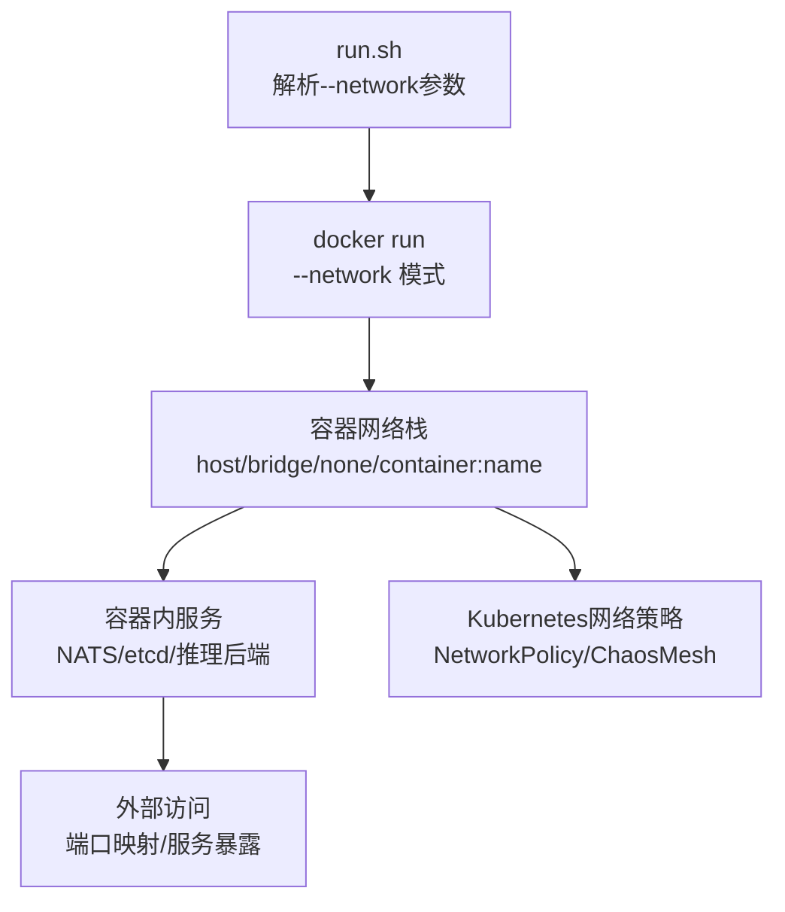
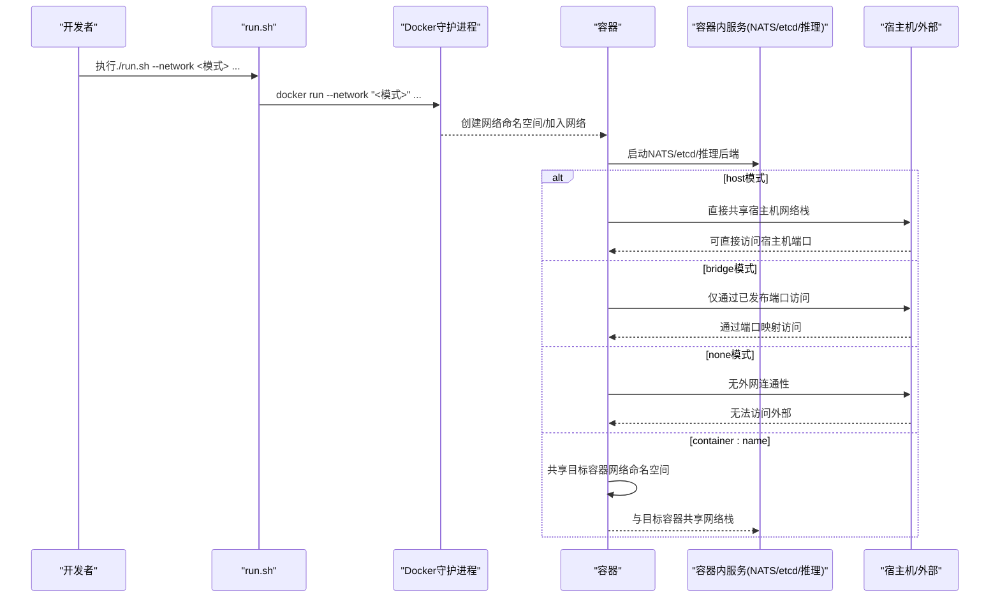
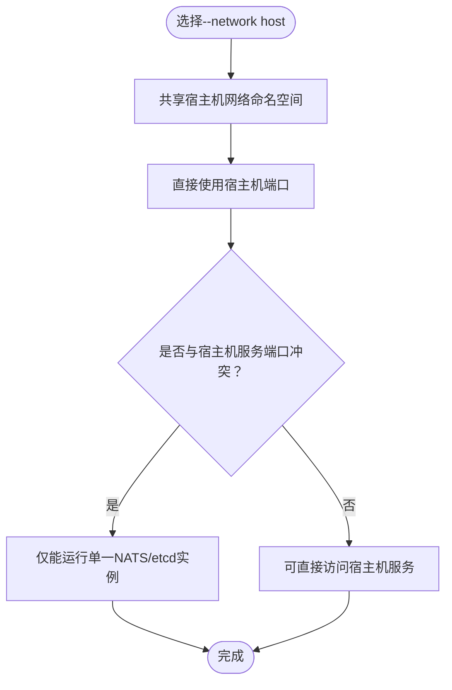
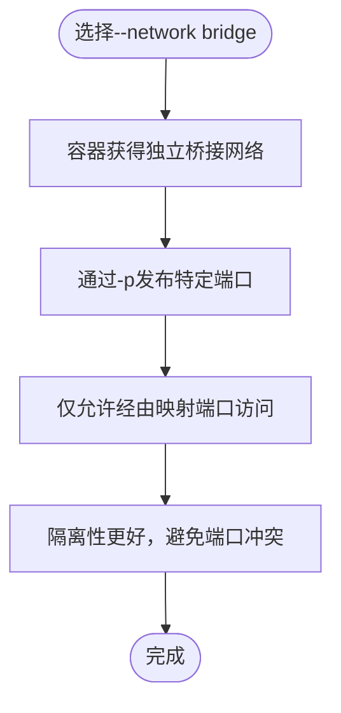
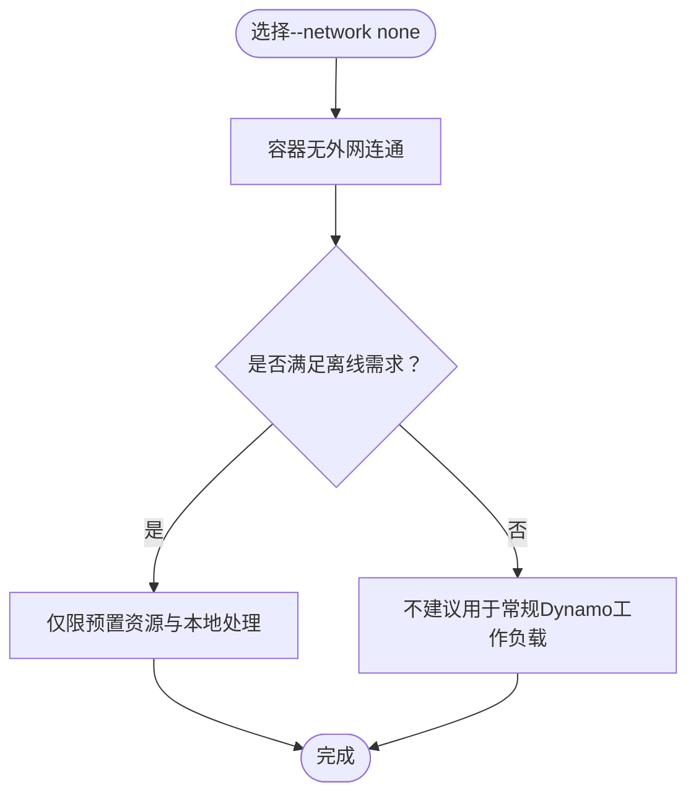
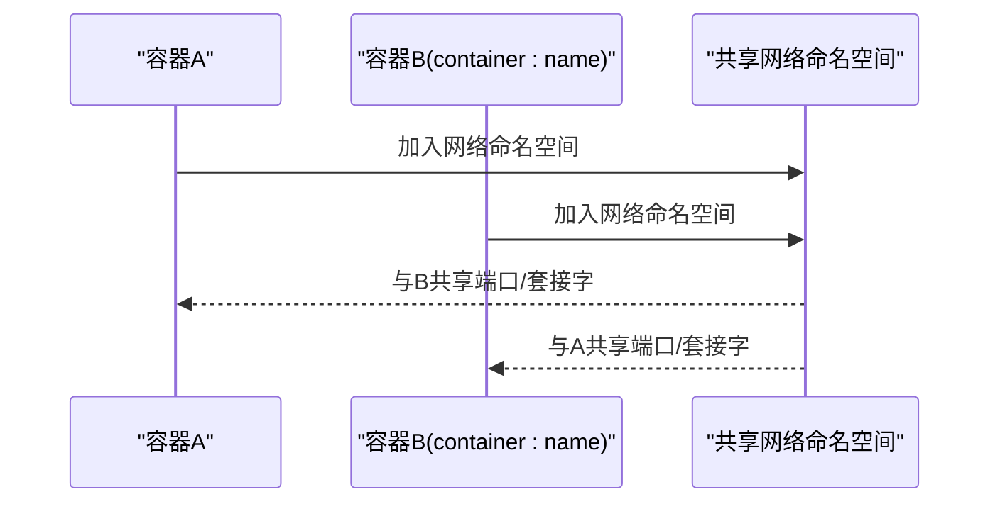
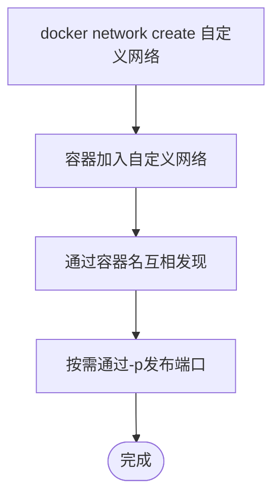
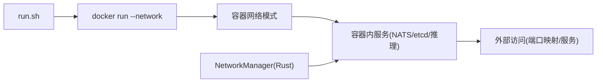

# 网络配置选项

<cite>
**本文引用的文件**
- [container/README.md](file://container/README.md)
- [container/run.sh](file://container/run.sh)
- [container/Dockerfile](file://container/Dockerfile)
- [deploy/docker-compose.yml](file://deploy/docker-compose.yml)
- [examples/backends/sglang/slurm_jobs/submit_disagg.sh](file://examples/backends/sglang/slurm_jobs/submit_disagg.sh)
- [lib/runtime/src/pipeline/network/manager.rs](file://lib/runtime/src/pipeline/network/manager.rs)
- [tests/fault_tolerance/hardware/fault_injection_service/api_service/main.py](file://tests/fault_tolerance/hardware/fault_injection_service/api_service/main.py)
- [examples/basics/kubernetes/shared_frontend/README.md](file://examples/basics/kubernetes/shared_frontend/README.md)
</cite>

## 目录
1. [简介](#简介)
2. [项目结构](#项目结构)
3. [核心组件](#核心组件)
4. [架构总览](#架构总览)
5. [详细组件分析](#详细组件分析)
6. [依赖关系分析](#依赖关系分析)
7. [性能考量](#性能考量)
8. [故障排查指南](#故障排查指南)
9. [结论](#结论)
10. [附录](#附录)

## 简介
本指南聚焦于Dynamo容器的网络配置选项，围绕run.sh脚本支持的--network参数展开，系统性讲解四种网络模式：host（默认）、bridge（隔离）、none（无网络，功能受限）、container:name（共享网络），并结合容器运行时、Docker Compose示例、Kubernetes部署与内部网络管理模块，帮助读者在开发、测试与生产环境中做出合理选择。

## 项目结构
与网络配置直接相关的文件与职责如下：
- container/README.md：提供run.sh的网络模式说明、用例与注意事项
- container/run.sh：解析--network等参数，并将网络模式传递给docker run
- container/Dockerfile：基础镜像包含NATS、etcd等服务，便于本地开发与测试
- deploy/docker-compose.yml：演示桥接网络与端口映射的实际应用
- examples/backends/sglang/slurm_jobs/submit_disagg.sh：展示跨节点网络接口参数（间接体现网络规划）
- lib/runtime/src/pipeline/network/manager.rs：运行时网络抽象与客户端/服务器创建逻辑
- tests/fault_tolerance/hardware/fault_injection_service/api_service/main.py：Kubernetes网络策略注入示例（网络隔离与分区）
- examples/basics/kubernetes/shared_frontend/README.md：Kubernetes部署与端口转发示例

图表来源
- [container/run.sh](file://container/run.sh#L180-L187)
- [container/run.sh](file://container/run.sh#L390-L390)
- [container/Dockerfile](file://container/Dockerfile#L74-L86)
- [deploy/docker-compose.yml](file://deploy/docker-compose.yml#L7-L36)
- [tests/fault_tolerance/hardware/fault_injection_service/api_service/main.py](file://tests/fault_tolerance/hardware/fault_injection_service/api_service/main.py#L615-L640)

章节来源
- [container/README.md](file://container/README.md#L275-L342)
- [container/run.sh](file://container/run.sh#L180-L187)
- [container/run.sh](file://container/run.sh#L390-L390)

## 核心组件
- run.sh网络参数解析
  - --network接收host、bridge、none或container:name等模式，默认host
  - 将NETWORK变量传入docker run的--network字段
- 容器内基础设施
  - 镜像内置NATS与etcd，便于本地开发与测试
- Docker Compose桥接网络
  - 使用bridge驱动定义server网络，服务通过端口映射对外暴露
- 运行时网络抽象
  - NetworkManager集中管理网络配置、创建请求平面服务器与客户端，屏蔽传输细节

章节来源
- [container/run.sh](file://container/run.sh#L180-L187)
- [container/run.sh](file://container/run.sh#L390-L390)
- [container/Dockerfile](file://container/Dockerfile#L74-L86)
- [deploy/docker-compose.yml](file://deploy/docker-compose.yml#L7-L36)
- [lib/runtime/src/pipeline/network/manager.rs](file://lib/runtime/src/pipeline/network/manager.rs#L153-L159)

## 架构总览
下图展示了从命令行到容器网络再到外部访问的整体流程，涵盖host/bridge/none/container:name四类模式的关键差异与影响面。

图表来源
- [container/run.sh](file://container/run.sh#L180-L187)
- [container/run.sh](file://container/run.sh#L390-L390)
- [container/README.md](file://container/README.md#L275-L342)

## 详细组件分析

### host模式（默认）
- 行为特征
  - 容器直接共享宿主机网络命名空间，端口完全透传
  - 适合高吞吐ML推理与需要直接访问宿主机服务的场景
- 适用场景
  - ML/GPU工作负载（默认）
  - 需要直接访问宿主机NATS/etcd等服务
  - 对网络延迟敏感的高性能服务
- 限制与注意事项
  - 宿主机端口冲突：同一宿主机上只能运行一个NATS（4222）或etcd（2379）实例
  - 安全性相对较低，容器与宿主机共享网络栈
- 实际用例
  - 开发环境：直接复用宿主机服务，无需额外端口映射
  - 生产环境：在专用节点上部署，避免端口冲突

图表来源
- [container/README.md](file://container/README.md#L279-L291)
- [container/Dockerfile](file://container/Dockerfile#L74-L86)

章节来源
- [container/README.md](file://container/README.md#L279-L291)
- [container/Dockerfile](file://container/Dockerfile#L74-L86)

### bridge模式（隔离）
- 行为特征
  - 容器拥有独立的桥接网络命名空间，可通过-p/--port显式发布端口
  - 适合需要端口控制与隔离的CI/测试与一般Web服务
- 适用场景
  - CI/CD流水线要求完全隔离
  - 需要精确控制对外暴露的端口
  - 多个容器在同一主机上运行且避免端口冲突
- 与host模式对比
  - 性能略低（需NAT/端口转发开销）
  - 更高的安全性与隔离度
- 实际用例
  - 测试环境：通过-p发布必要端口，避免与宿主机服务冲突
  - 多实例部署：每个容器使用不同端口映射

图表来源
- [container/README.md](file://container/README.md#L293-L304)
- [container/run.sh](file://container/run.sh#L155-L161)

章节来源
- [container/README.md](file://container/README.md#L293-L304)
- [container/run.sh](file://container/run.sh#L155-L161)

### none模式（无网络，功能受限）
- 行为特征
  - 容器完全无外网连通性，无法访问外部API、下载模型或与外部监控系统通信
- 适用场景
  - 纯本地处理、预下载模型的离线环境
  - 严格空气间隙的安全隔离（需预先准备所有资源）
- 风险提示
  - Dynamo绝大多数功能将受限（模型下载、分布式推理、监控日志、调试工具等）
- 实际用例
  - 离线审计、合规环境下的纯本地推理

图表来源
- [container/README.md](file://container/README.md#L306-L324)

章节来源
- [container/README.md](file://container/README.md#L306-L324)

### container:name模式（共享网络）
- 行为特征
  - 容器与指定目标容器共享网络命名空间，常用于sidecar或服务网格
- 适用场景
  - 日志/监控/缓存等sidecar与主业务容器共享网络
  - 服务网格架构中共享网络栈
- 注意事项
  - 与目标容器共享端口与套接字，需谨慎规划端口分配
- 实际用例
  - 与已有容器（如redis）共享网络以简化通信

图表来源
- [container/README.md](file://container/README.md#L325-L333)

章节来源
- [container/README.md](file://container/README.md#L325-L333)

### 自定义网络（多容器应用）
- 行为特征
  - 通过docker network create创建自定义网络，容器加入该网络实现服务发现与互通
- 适用场景
  - 多容器应用、基于容器名的服务发现
- 实践要点
  - 在compose中定义networks.driver: bridge，并在services中引用同一网络

图表来源
- [container/README.md](file://container/README.md#L335-L342)
- [deploy/docker-compose.yml](file://deploy/docker-compose.yml#L7-L36)

章节来源
- [container/README.md](file://container/README.md#L335-L342)
- [deploy/docker-compose.yml](file://deploy/docker-compose.yml#L7-L36)

## 依赖关系分析
- run.sh对docker run的封装
  - 解析--network并将值传入--network参数
- 容器内服务与网络的关系
  - 镜像内置NATS/etcd，便于本地开发；host模式下可直接复用宿主机服务
- 外部访问路径
  - host模式：直接使用宿主机端口
  - bridge模式：通过-p发布端口映射到宿主机
  - none模式：无外网连通
- 运行时网络抽象
  - NetworkManager负责请求平面的服务器/客户端创建，隐藏底层传输细节，与容器网络模式解耦

图表来源
- [container/run.sh](file://container/run.sh#L390-L390)
- [container/Dockerfile](file://container/Dockerfile#L74-L86)
- [lib/runtime/src/pipeline/network/manager.rs](file://lib/runtime/src/pipeline/network/manager.rs#L153-L159)

章节来源
- [container/run.sh](file://container/run.sh#L390-L390)
- [container/Dockerfile](file://container/Dockerfile#L74-L86)
- [lib/runtime/src/pipeline/network/manager.rs](file://lib/runtime/src/pipeline/network/manager.rs#L153-L159)

## 性能考量
- host模式
  - 无NAT与端口转发开销，延迟最低，适合高吞吐推理
  - 需注意端口冲突与安全隔离问题
- bridge模式
  - 存在NAT/端口转发开销，性能略低于host
  - 提供更好的隔离与可控的端口暴露
- none模式
  - 无外网连通，不涉及网络性能问题，但功能受限
- container:name模式
  - 共享网络命名空间，避免跨容器网络开销，适合sidecar
- 自定义网络
  - 通过bridge驱动实现容器间互通，性能接近host，便于多容器编排

章节来源
- [container/README.md](file://container/README.md#L344-L352)

## 故障排查指南
- 端口冲突（host模式）
  - 症状：启动NATS/etcd失败，提示端口已被占用
  - 原因：host模式共享宿主机网络，同一宿主机仅能运行一个NATS/etcd实例
  - 解决：改用bridge模式并通过-p发布端口，或在不同宿主机运行
- 无法访问外部（none模式）
  - 症状：模型下载失败、外部API不可达、监控日志无法上报
  - 原因：none模式完全断网
  - 解决：改为host/bridge或自定义网络，确保必要端口映射
- 端口映射错误（bridge模式）
  - 症状：通过localhost无法访问容器服务
  - 原因：未正确使用-p/--port发布端口
  - 解决：确认-p host_port:container_port配置与容器监听端口一致
- Kubernetes网络策略（高级）
  - 症状：容器间通信被阻断
  - 原因：NetworkPolicy限制了入站/出站流量
  - 解决：检查NetworkPolicy规则，必要时调整allow列表或使用ChaosMesh进行分区注入测试

章节来源
- [container/README.md](file://container/README.md#L291-L291)
- [container/README.md](file://container/README.md#L306-L324)
- [container/README.md](file://container/README.md#L304-L304)
- [tests/fault_tolerance/hardware/fault_injection_service/api_service/main.py](file://tests/fault_tolerance/hardware/fault_injection_service/api_service/main.py#L615-L640)

## 结论
- host模式适合高性能ML推理与需要直接访问宿主机服务的场景，但需关注端口冲突与安全隔离
- bridge模式提供更好的隔离与可控的端口暴露，适用于CI/测试与一般Web服务
- none模式仅适用于严格离线与预置资源的场景，常规Dynamo工作负载不建议使用
- container:name模式适合sidecar与服务网格，共享网络命名空间提升效率
- 自定义网络便于多容器编排与服务发现，推荐在复杂应用中使用

## 附录

### 不同环境下的最佳实践
- 开发环境
  - 推荐：host模式（快速复用宿主机NATS/etcd），或bridge模式（隔离与可控端口）
  - 示例参考：容器开发指南中的网络配置段落
- 测试环境
  - 推荐：bridge模式，通过-p发布必要端口，避免与宿主机服务冲突
  - 示例参考：CI测试工作流中使用bridge网络的说明
- 生产环境
  - 推荐：根据部署平台选择合适模式
  - Kubernetes：使用NetworkPolicy与Service暴露，结合Sidecar模式
  - Docker Compose：使用bridge网络与端口映射，配合持久化存储

章节来源
- [container/README.md](file://container/README.md#L354-L411)
- [deploy/docker-compose.yml](file://deploy/docker-compose.yml#L7-L36)
- [examples/basics/kubernetes/shared_frontend/README.md](file://examples/basics/kubernetes/shared_frontend/README.md#L17-L25)