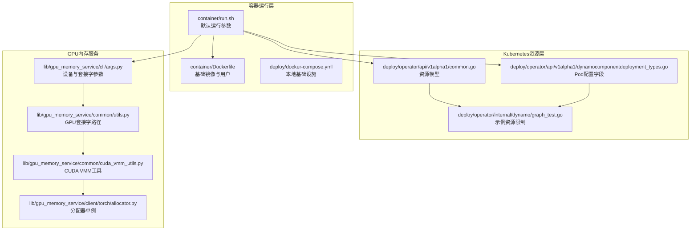
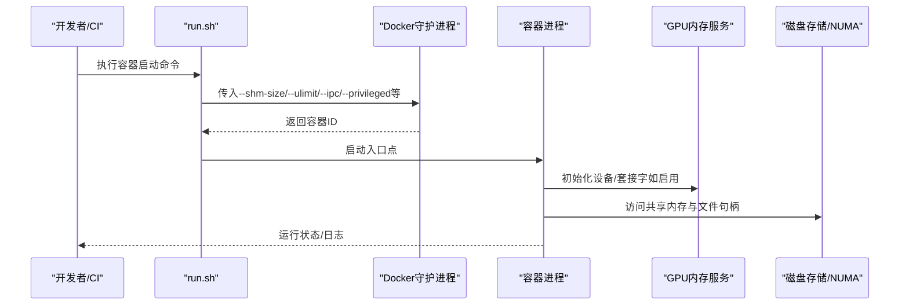
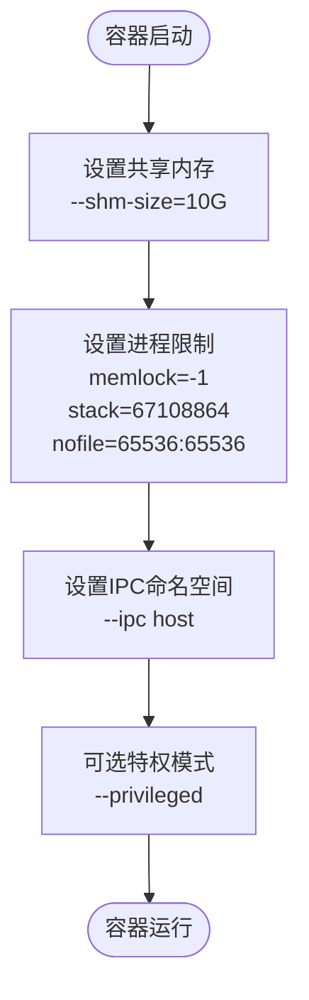
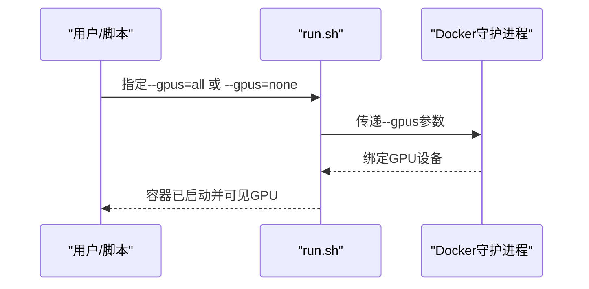
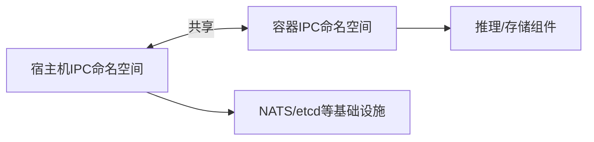
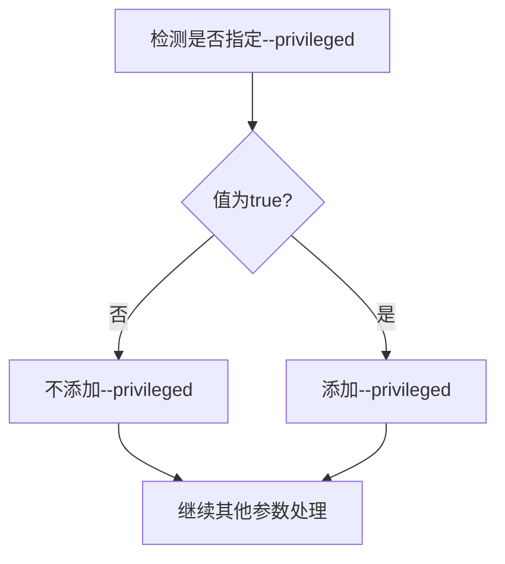
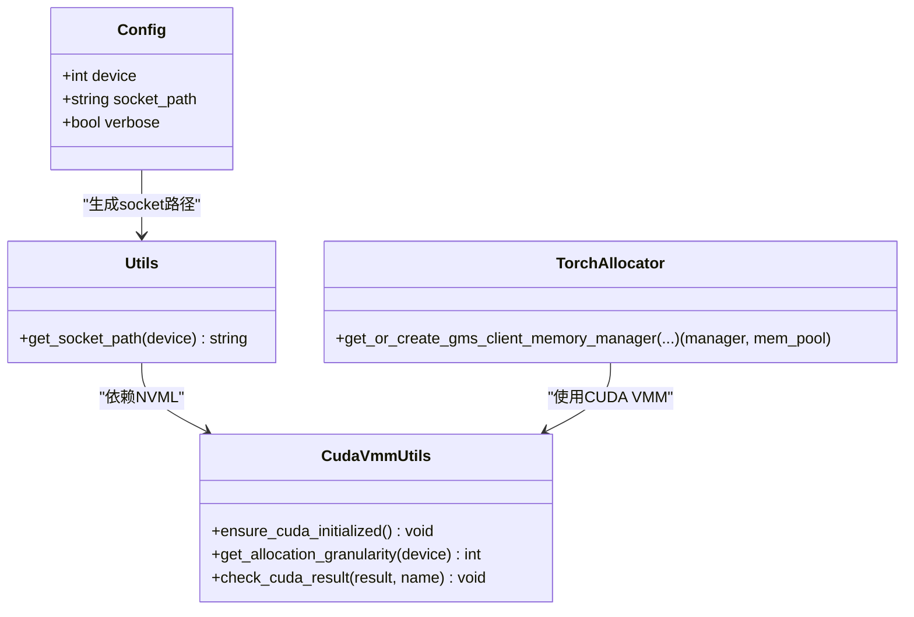
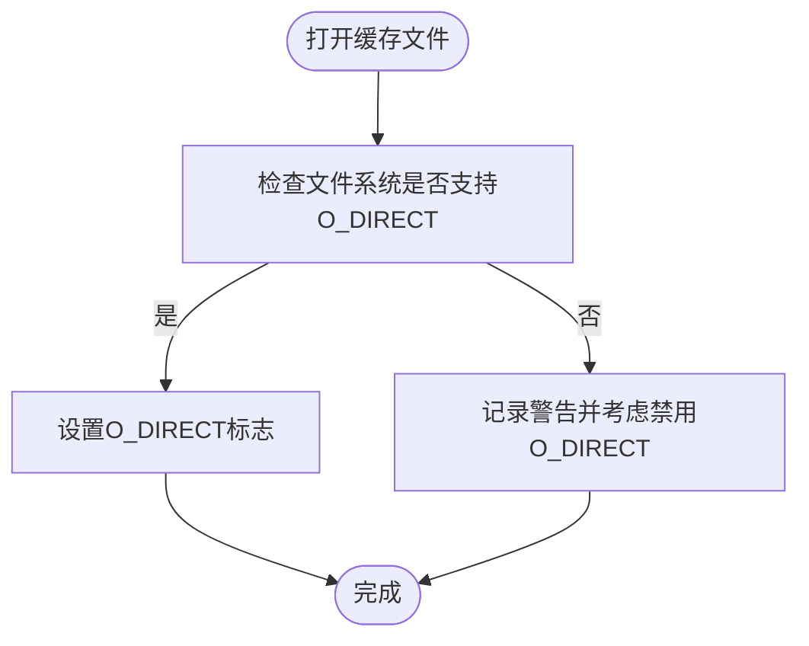
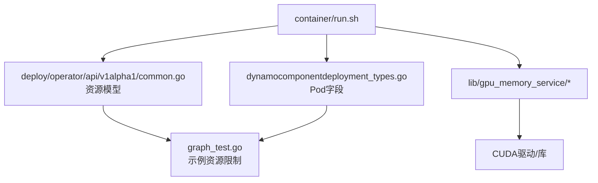

# 资源控制和限制

<cite>
**本文引用的文件**
- [container/run.sh](file://container/run.sh)
- [container/Dockerfile](file://container/Dockerfile)
- [deploy/docker-compose.yml](file://deploy/docker-compose.yml)
- [deploy/operator/api/v1alpha1/common.go](file://deploy/operator/api/v1alpha1/common.go)
- [deploy/operator/api/v1alpha1/dynamocomponentdeployment_types.go](file://deploy/operator/api/v1alpha1/dynamocomponentdeployment_types.go)
- [deploy/operator/internal/dynamo/graph_test.go](file://deploy/operator/internal/dynamo/graph_test.go)
- [lib/gpu_memory_service/cli/args.py](file://lib/gpu_memory_service/cli/args.py)
- [lib/gpu_memory_service/common/utils.py](file://lib/gpu_memory_service/common/utils.py)
- [lib/gpu_memory_service/common/cuda_vmm_utils.py](file://lib/gpu_memory_service/common/cuda_vmm_utils.py)
- [lib/gpu_memory_service/client/torch/allocator.py](file://lib/gpu_memory_service/client/torch/allocator.py)
- [lib/llm/src/block_manager/storage/disk.rs](file://lib/llm/src/block_manager/storage/disk.rs)
- [lib/llm/src/block_manager/numa_allocator.rs](file://lib/llm/src/block_manager/numa_allocator.rs)
- [examples/backends/vllm/launch/dsr1_dep.sh](file://examples/backends/vllm/launch/dsr1_dep.sh)
- [examples/backends/sglang/slurm_jobs/submit_disagg.sh](file://examples/backends/sglang/slurm_jobs/submit_disagg.sh)
</cite>

## 目录
1. [简介](#简介)
2. [项目结构](#项目结构)
3. [核心组件](#核心组件)
4. [架构总览](#架构总览)
5. [详细组件分析](#详细组件分析)
6. [依赖关系分析](#依赖关系分析)
7. [性能考量](#性能考量)
8. [故障排查指南](#故障排查指南)
9. [结论](#结论)
10. [附录](#附录)

## 简介
本指南聚焦于Dynamo在容器运行时的资源控制与限制，覆盖以下关键主题：
- 共享内存（--shm-size）与进程限制（--ulimit）的配置与影响
- GPU资源管理（--gpus 参数）及在不同后端中的使用
- IPC命名空间（--ipc host）与主机IPC模式的适用场景
- 特权模式（--privileged）的启用条件与安全注意事项
- 性能影响分析与调优建议（内存、文件描述符、GPU资源）

本指南面向开发者与运维人员，既提供高层理解，也包含可操作的调优建议。

## 项目结构
围绕资源控制与限制，相关实现分布在以下位置：
- 容器启动脚本：定义默认的共享内存、ulimit、IPC、特权模式等运行参数
- 容器镜像构建：基础镜像与运行时环境配置
- Kubernetes CRD与控制器：资源请求/限制、GPU类型、共享内存等声明式配置
- GPU内存服务：设备选择、套接字路径、CUDA VMM工具函数
- 存储与NUMA：磁盘直通与NUMA节点亲和性

**图表来源**
- [container/run.sh](file://container/run.sh#L386-L410)
- [container/Dockerfile](file://container/Dockerfile#L454-L547)
- [deploy/docker-compose.yml](file://deploy/docker-compose.yml#L1-L36)
- [deploy/operator/api/v1alpha1/common.go](file://deploy/operator/api/v1alpha1/common.go#L72-L101)
- [deploy/operator/api/v1alpha1/dynamocomponentdeployment_types.go](file://deploy/operator/api/v1alpha1/dynamocomponentdeployment_types.go#L100-L110)
- [deploy/operator/internal/dynamo/graph_test.go](file://deploy/operator/internal/dynamo/graph_test.go#L2148-L2165)
- [lib/gpu_memory_service/cli/args.py](file://lib/gpu_memory_service/cli/args.py#L15-L58)
- [lib/gpu_memory_service/common/utils.py](file://lib/gpu_memory_service/common/utils.py#L9-L27)
- [lib/gpu_memory_service/common/cuda_vmm_utils.py](file://lib/gpu_memory_service/common/cuda_vmm_utils.py#L13-L46)
- [lib/gpu_memory_service/client/torch/allocator.py](file://lib/gpu_memory_service/client/torch/allocator.py#L28-L43)

**章节来源**
- [container/run.sh](file://container/run.sh#L386-L410)
- [container/Dockerfile](file://container/Dockerfile#L454-L547)
- [deploy/docker-compose.yml](file://deploy/docker-compose.yml#L1-L36)
- [deploy/operator/api/v1alpha1/common.go](file://deploy/operator/api/v1alpha1/common.go#L72-L101)
- [deploy/operator/api/v1alpha1/dynamocomponentdeployment_types.go](file://deploy/operator/api/v1alpha1/dynamocomponentdeployment_types.go#L100-L110)
- [deploy/operator/internal/dynamo/graph_test.go](file://deploy/operator/internal/dynamo/graph_test.go#L2148-L2165)

## 核心组件
- 运行时参数与默认值
  - 共享内存：--shm-size=10G
  - 进程限制：--ulimit memlock=-1、--ulimit stack=67108864、--ulimit nofile=65536:65536
  - IPC命名空间：--ipc host
  - 特权模式：--privileged（按需启用）
  - 网络模式：默认host，支持bridge/none/container:name
- GPU资源管理
  - --gpus=all（默认）、--gpus=none（禁用GPU）
  - 在Kubernetes中通过资源请求/限制与GPU类型声明
- 存储与NUMA
  - 磁盘直通（O_DIRECT）与NUMA节点亲和性
- GPU内存服务
  - 设备选择、套接字路径稳定化、CUDA VMM工具与PyTorch分配器集成

**章节来源**
- [container/run.sh](file://container/run.sh#L391-L402)
- [container/run.sh](file://container/run.sh#L240-L244)
- [container/run.sh](file://container/run.sh#L284-L296)
- [container/run.sh](file://container/run.sh#L351-L357)
- [deploy/operator/api/v1alpha1/common.go](file://deploy/operator/api/v1alpha1/common.go#L72-L101)
- [lib/gpu_memory_service/cli/args.py](file://lib/gpu_memory_service/cli/args.py#L15-L58)
- [lib/gpu_memory_service/common/utils.py](file://lib/gpu_memory_service/common/utils.py#L9-L27)
- [lib/llm/src/block_manager/storage/disk.rs](file://lib/llm/src/block_manager/storage/disk.rs#L268-L298)
- [lib/llm/src/block_manager/numa_allocator.rs](file://lib/llm/src/block_manager/numa_allocator.rs#L51-L87)

## 架构总览
下图展示容器运行时参数如何影响系统资源与后端行为：

**图表来源**
- [container/run.sh](file://container/run.sh#L386-L410)
- [lib/gpu_memory_service/cli/args.py](file://lib/gpu_memory_service/cli/args.py#L24-L58)
- [lib/gpu_memory_service/common/utils.py](file://lib/gpu_memory_service/common/utils.py#L9-L27)
- [lib/llm/src/block_manager/storage/disk.rs](file://lib/llm/src/block_manager/storage/disk.rs#L268-L298)

## 详细组件分析

### 共享内存与进程限制（--shm-size与--ulimit）
- 默认共享内存大小为10G，满足大模型推理与多线程工作负载的共享内存需求
- 进程限制：
  - memlock=-1：允许锁定任意大小的内存页，避免OOM或分页导致的性能抖动
  - stack=67108864（64MB）：提升线程栈上限，适合深度堆栈的推理/编译场景
  - nofile=65536:65536：同时设置软硬限制，确保高并发I/O与文件句柄消耗场景稳定
- 这些默认值在容器启动脚本中集中配置，便于统一管控与审计

**图表来源**
- [container/run.sh](file://container/run.sh#L391-L402)
- [container/run.sh](file://container/run.sh#L284-L296)

**章节来源**
- [container/run.sh](file://container/run.sh#L391-L402)

### GPU资源管理（--gpus）
- 命令行参数
  - --gpus=all（默认）：启用所有可用GPU
  - --gpus=none：禁用GPU支持，仅CPU模式
- 在Kubernetes中
  - 通过资源请求/限制声明GPU数量与类型（默认nvidia.com/gpu）
  - 支持自定义GPU类型（例如Intel Xe）
- 示例与外部工具
  - vLLM与SGLang示例脚本中使用--gpus-per-node等参数进行多节点/多GPU调度

**图表来源**
- [container/run.sh](file://container/run.sh#L98-L106)
- [container/run.sh](file://container/run.sh#L240-L244)
- [container/run.sh](file://container/run.sh#L346-L350)
- [examples/backends/vllm/launch/dsr1_dep.sh](file://examples/backends/vllm/launch/dsr1_dep.sh#L25-L64)
- [examples/backends/sglang/slurm_jobs/submit_disagg.sh](file://examples/backends/sglang/slurm_jobs/submit_disagg.sh#L88-L88)
- [deploy/operator/api/v1alpha1/common.go](file://deploy/operator/api/v1alpha1/common.go#L82-L87)
- [deploy/operator/internal/dynamo/graph_test.go](file://deploy/operator/internal/dynamo/graph_test.go#L2153-L2157)

**章节来源**
- [container/run.sh](file://container/run.sh#L98-L106)
- [container/run.sh](file://container/run.sh#L240-L244)
- [container/run.sh](file://container/run.sh#L346-L350)
- [examples/backends/vllm/launch/dsr1_dep.sh](file://examples/backends/vllm/launch/dsr1_dep.sh#L25-L64)
- [examples/backends/sglang/slurm_jobs/submit_disagg.sh](file://examples/backends/sglang/slurm_jobs/submit_disagg.sh#L88-L88)
- [deploy/operator/api/v1alpha1/common.go](file://deploy/operator/api/v1alpha1/common.go#L82-L87)
- [deploy/operator/internal/dynamo/graph_test.go](file://deploy/operator/internal/dynamo/graph_test.go#L2153-L2157)

### IPC命名空间与主机IPC模式（--ipc host）
- --ipc host：容器与宿主机共享IPC命名空间，有利于高性能通信（如共享内存段、消息队列）
- 使用场景
  - 多进程/多线程推理框架需要高效共享内存
  - 与宿主机其他组件（如NATS、etcd）直接通信
- 注意事项
  - 共享IPC会降低隔离性，需结合安全策略与最小权限原则

**图表来源**
- [container/run.sh](file://container/run.sh#L401-L402)
- [deploy/docker-compose.yml](file://deploy/docker-compose.yml#L12-L36)

**章节来源**
- [container/run.sh](file://container/run.sh#L401-L402)
- [deploy/docker-compose.yml](file://deploy/docker-compose.yml#L12-L36)

### 特权模式（--privileged）
- 启用条件
  - 明确指定--privileged=true时生效；默认不启用
- 安全考虑
  - 开启特权模式会放宽内核安全约束，可能带来容器逃逸风险
  - 仅在必要时启用，且应配合最小权限原则与安全基线
- 用户与组
  - 当自定义用户运行容器时，脚本会自动添加必要的补充组以保持目录写权限

**图表来源**
- [container/run.sh](file://container/run.sh#L284-L296)

**章节来源**
- [container/run.sh](file://container/run.sh#L131-L138)
- [container/run.sh](file://container/run.sh#L284-L296)
- [container/run.sh](file://container/run.sh#L327-L337)

### GPU内存服务（GMS）
- 设备与套接字
  - 通过--device指定目标GPU，套接字路径基于GPU UUID稳定化
- CUDA VMM工具
  - 提供初始化检查、错误处理与分配粒度查询
- PyTorch集成
  - 分配器单例管理，支持RW/RO锁模式与超时控制

**图表来源**
- [lib/gpu_memory_service/cli/args.py](file://lib/gpu_memory_service/cli/args.py#L15-L58)
- [lib/gpu_memory_service/common/utils.py](file://lib/gpu_memory_service/common/utils.py#L9-L27)
- [lib/gpu_memory_service/common/cuda_vmm_utils.py](file://lib/gpu_memory_service/common/cuda_vmm_utils.py#L13-L46)
- [lib/gpu_memory_service/client/torch/allocator.py](file://lib/gpu_memory_service/client/torch/allocator.py#L28-L43)

**章节来源**
- [lib/gpu_memory_service/cli/args.py](file://lib/gpu_memory_service/cli/args.py#L15-L58)
- [lib/gpu_memory_service/common/utils.py](file://lib/gpu_memory_service/common/utils.py#L9-L27)
- [lib/gpu_memory_service/common/cuda_vmm_utils.py](file://lib/gpu_memory_service/common/cuda_vmm_utils.py#L13-L46)
- [lib/gpu_memory_service/client/torch/allocator.py](file://lib/gpu_memory_service/client/torch/allocator.py#L28-L43)

### 存储与NUMA（磁盘直通与NUMA节点亲和）
- 磁盘直通（O_DIRECT）
  - 在支持的文件系统上启用O_DIRECT以减少页缓存开销，提升GPU DirectStorage性能
  - 若失败，建议通过配置项禁用O_DIRECT以保证稳定性
- NUMA亲和
  - 通过nvidia-smi拓扑获取GPU最近CPU的NUMA节点，优化内存访问路径

**图表来源**
- [lib/llm/src/block_manager/storage/disk.rs](file://lib/llm/src/block_manager/storage/disk.rs#L268-L298)

**章节来源**
- [lib/llm/src/block_manager/storage/disk.rs](file://lib/llm/src/block_manager/storage/disk.rs#L268-L298)
- [lib/llm/src/block_manager/numa_allocator.rs](file://lib/llm/src/block_manager/numa_allocator.rs#L51-L87)

## 依赖关系分析
- 容器运行脚本与Kubernetes资源模型的耦合
  - run.sh中的GPU、IPC、ulimit等参数与Kubernetes资源请求/限制共同决定容器能力
- GPU内存服务与CUDA驱动的依赖
  - GMS依赖NVML与CUDA驱动API，确保设备可见与内存分配正确

**图表来源**
- [container/run.sh](file://container/run.sh#L386-L410)
- [deploy/operator/api/v1alpha1/common.go](file://deploy/operator/api/v1alpha1/common.go#L72-L101)
- [deploy/operator/api/v1alpha1/dynamocomponentdeployment_types.go](file://deploy/operator/api/v1alpha1/dynamocomponentdeployment_types.go#L100-L110)
- [deploy/operator/internal/dynamo/graph_test.go](file://deploy/operator/internal/dynamo/graph_test.go#L2148-L2165)
- [lib/gpu_memory_service/common/utils.py](file://lib/gpu_memory_service/common/utils.py#L9-L27)

**章节来源**
- [container/run.sh](file://container/run.sh#L386-L410)
- [deploy/operator/api/v1alpha1/common.go](file://deploy/operator/api/v1alpha1/common.go#L72-L101)
- [deploy/operator/api/v1alpha1/dynamocomponentdeployment_types.go](file://deploy/operator/api/v1alpha1/dynamocomponentdeployment_types.go#L100-L110)
- [deploy/operator/internal/dynamo/graph_test.go](file://deploy/operator/internal/dynamo/graph_test.go#L2148-L2165)

## 性能考量
- 内存
  - 10G共享内存足以支撑大模型推理与多线程场景；若出现内存压力，可适当增大
  - memlock=-1避免锁页失败导致的性能抖动
- 文件描述符
  - nofile=65536:65536满足高并发I/O；若遇到“Too many open files”，可进一步提升
- 线程栈
  - stack=67108864应对深度堆栈；如无异常可维持默认
- GPU
  - --gpus=all默认启用全部GPU；在多任务/多容器共存场景，建议显式限定GPU范围
  - 在Kubernetes中合理设置requests/limits，避免过度竞争
- IPC
  - --ipc host提升跨进程通信效率；若隔离性优先，可改用默认IPC命名空间
- 存储与NUMA
  - O_DIRECT提升GPU DirectStorage性能；若文件系统不支持，可禁用以保证稳定性
  - NUMA亲和有助于降低跨NUMA访问延迟

[本节为通用性能指导，无需特定文件引用]

## 故障排查指南
- 共享内存不足
  - 症状：容器启动后内存不足或共享内存段创建失败
  - 排查：检查--shm-size与宿主机tmpfs大小；确认容器内应用未超出限制
- 文件描述符耗尽
  - 症状：高并发场景报“Too many open files”
  - 排查：提高nofile软硬限制；检查应用文件句柄泄漏
- memlock受限
  - 症状：锁页失败或OOM
  - 排查：确认memlock=-1；必要时调整宿主机limits.conf
- GPU不可见或绑定失败
  - 症状：--gpus=none或容器内看不到GPU
  - 排查：确认nvidia-container-toolkit安装与运行时配置；检查--gpus参数
- IPC问题
  - 症状：进程间通信异常
  - 排查：确认--ipc host与宿主机IPC命名空间一致性；必要时回退到默认IPC
- GPU内存服务连接失败
  - 症状：GMS套接字路径错误或设备不可用
  - 排查：确认--device与UUID稳定化路径；检查NVML与CUDA驱动版本

**章节来源**
- [container/run.sh](file://container/run.sh#L391-L402)
- [container/run.sh](file://container/run.sh#L240-L244)
- [lib/gpu_memory_service/common/utils.py](file://lib/gpu_memory_service/common/utils.py#L9-L27)
- [lib/gpu_memory_service/common/cuda_vmm_utils.py](file://lib/gpu_memory_service/common/cuda_vmm_utils.py#L13-L46)

## 结论
Dynamo在容器层面提供了完善的资源控制与限制机制：通过默认的共享内存、ulimit、IPC与GPU参数，兼顾性能与稳定性；在Kubernetes中可通过资源模型进一步精细化管理。结合GPU内存服务、磁盘直通与NUMA亲和，可在多场景下获得更优的吞吐与延迟表现。建议在生产环境中遵循最小权限原则，按需启用特权模式与主机IPC，并根据实际负载动态调整资源限制。

[本节为总结性内容，无需特定文件引用]

## 附录
- 常用参数速查
  - --shm-size：共享内存大小（默认10G）
  - --ulimit memlock：锁页大小（默认-1）
  - --ulimit stack：线程栈大小（默认67108864）
  - --ulimit nofile：文件描述符软硬限制（默认65536:65536）
  - --gpus：GPU选择（all/none）
  - --ipc host：主机IPC命名空间
  - --privileged：特权模式（谨慎启用）

[本节为参考性内容，无需特定文件引用]