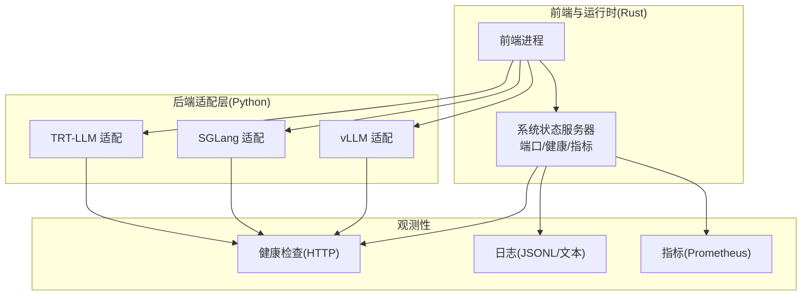
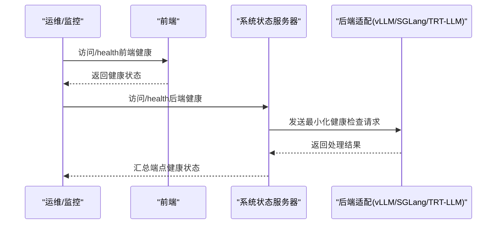
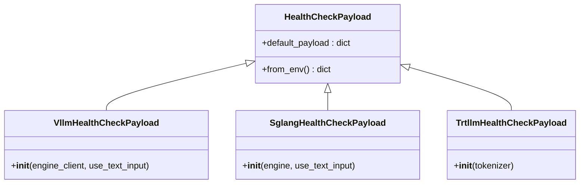
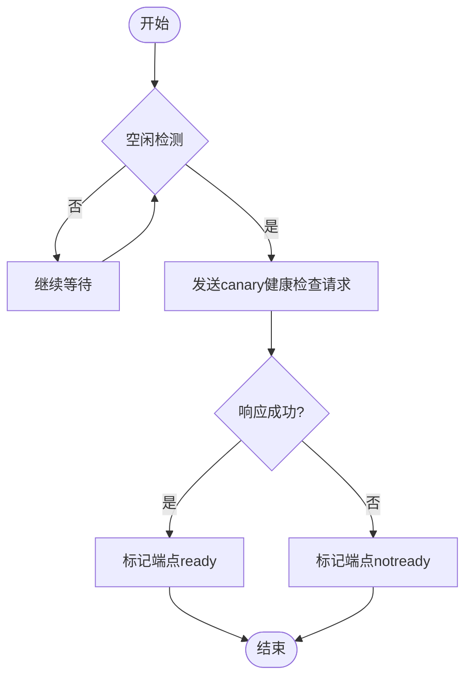
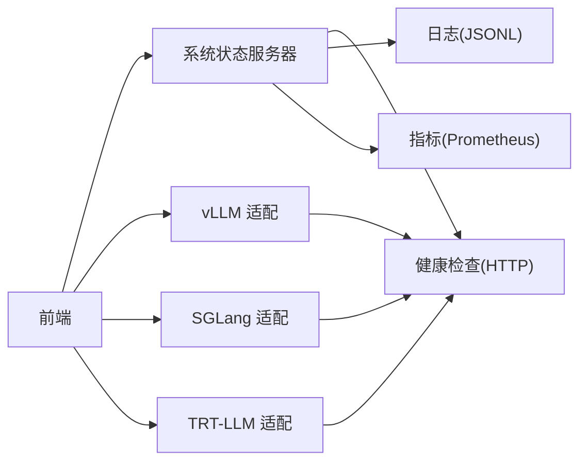

# 常见问题诊断

<cite>
**本文引用的文件**
- [components/src/dynamo/sglang/health_check.py](file://components/src/dynamo/sglang/health_check.py)
- [components/src/dynamo/trtllm/health_check.py](file://components/src/dynamo/trtllm/health_check.py)
- [components/src/dynamo/vllm/health_check.py](file://components/src/dynamo/vllm/health_check.py)
- [docs/observability/health-checks.md](file://docs/observability/health-checks.md)
- [docs/observability/logging.md](file://docs/observability/logging.md)
- [docs/observability/metrics.md](file://docs/observability/metrics.md)
- [deploy/sanity_check.py](file://deploy/sanity_check.py)
- [deploy/pre-deployment/pre-deployment-check.sh](file://deploy/pre-deployment/pre-deployment-check.sh)
- [docs/reference/support-matrix.md](file://docs/reference/support-matrix.md)
- [tests/fault_tolerance/test_vllm_health_check.py](file://tests/fault_tolerance/test_vllm_health_check.py)
- [docs/design_docs/architecture.md](file://docs/design_docs/architecture.md)
- [lib/rust/src/config/environment_names.rs](file://lib/rust/src/config/environment_names.rs)
- [lib/rust/src/config.rs](file://lib/rust/src/config.rs)
- [components/src/dynamo/common/config_dump/environment.py](file://components/src/dynamo/common/config_dump/environment.py)
</cite>

## 目录
1. [简介](#简介)
2. [项目结构](#项目结构)
3. [核心组件](#核心组件)
4. [架构总览](#架构总览)
5. [详细组件分析](#详细组件分析)
6. [依赖关系分析](#依赖关系分析)
7. [性能考量](#性能考量)
8. [故障排除指南](#故障排除指南)
9. [结论](#结论)
10. [附录](#附录)

## 简介
本指南面向Dynamo在生产与开发环境中的常见问题诊断，覆盖启动失败、连接异常、性能下降等典型场景。内容基于仓库内健康检查、日志、指标、预部署检查与支持矩阵等文档与实现，提供系统化的症状观察、日志分析、系统状态检查、根因分析方法、问题分类与优先级策略，并给出可执行的诊断命令、检查清单与验证方法，帮助快速定位并解决问题。

## 项目结构
Dynamo由多语言混合架构组成：前端与运行时以Rust实现，后端适配层（vLLM/SGLang/TRT-LLM）以Python实现；观测性能力（健康检查、日志、指标）贯穿各组件。关键位置如下：
- 健康检查payload定义：各后端适配层提供最小化payload用于快速自检
- 观测性文档：健康检查、日志、指标的使用说明与配置项
- 预部署脚本：Kubernetes集群前置条件校验
- 运行时配置：系统服务端口、健康状态路径、canary健康检查参数等
- 支持矩阵：硬件/软件兼容性与版本约束

**图表来源**
- [docs/design_docs/architecture.md](file://docs/design_docs/architecture.md#L19-L70)
- [docs/observability/health-checks.md](file://docs/observability/health-checks.md#L8-L26)
- [docs/observability/logging.md](file://docs/observability/logging.md#L8-L27)
- [docs/observability/metrics.md](file://docs/observability/metrics.md#L8-L22)

**章节来源**
- [docs/design_docs/architecture.md](file://docs/design_docs/architecture.md#L19-L70)

## 核心组件
- 健康检查payload（后端适配层）
  - vLLM/SGLang/TRT-LLM分别提供最小化请求payload，确保端到端链路可用且开销极低
  - payload包含采样参数、停止条件、输入类型（文本或token_ids），并尽量复用模型BOS token
- 系统状态服务器与canary健康检查
  - 可通过环境变量启用/禁用、设置初始健康状态、声明需要就绪的端点集合
  - 可配置空闲等待时间与请求超时，避免干扰正常流量
- 日志与指标
  - 结构化JSONL日志，支持trace/span上下文与可选span事件
  - Prometheus指标端点，按命名空间/组件/端点分层统计
- 预部署检查
  - Kubernetes集群连通性、默认存储类、GPU节点、GPU Operator状态
- 支持矩阵
  - 后端框架版本、CUDA驱动要求、硬件与平台兼容性

**章节来源**
- [components/src/dynamo/vllm/health_check.py](file://components/src/dynamo/vllm/health_check.py#L52-L121)
- [components/src/dynamo/sglang/health_check.py](file://components/src/dynamo/sglang/health_check.py#L50-L121)
- [components/src/dynamo/trtllm/health_check.py](file://components/src/dynamo/trtllm/health_check.py#L51-L92)
- [docs/observability/health-checks.md](file://docs/observability/health-checks.md#L14-L26)
- [docs/observability/logging.md](file://docs/observability/logging.md#L15-L27)
- [docs/observability/metrics.md](file://docs/observability/metrics.md#L16-L22)
- [deploy/pre-deployment/pre-deployment-check.sh](file://deploy/pre-deployment/pre-deployment-check.sh#L41-L177)
- [docs/reference/support-matrix.md](file://docs/reference/support-matrix.md#L13-L113)

## 架构总览
Dynamo采用分布式运行时，前端负责接入与路由，后端适配层对接不同推理引擎，系统状态服务器统一暴露健康检查与指标。canary健康检查在空闲期对关键端点进行轻量探测，避免误报与性能影响。

**图表来源**
- [docs/observability/health-checks.md](file://docs/observability/health-checks.md#L49-L217)

**章节来源**
- [docs/observability/health-checks.md](file://docs/observability/health-checks.md#L8-L217)

## 详细组件分析

### 健康检查payload设计（vLLM/SGLang/TRT-LLM）
- 设计原则
  - 最小化payload：仅包含生成1个token所需的必要字段
  - 采样与停止条件：温度、top_p/top_k、EOS忽略、最大新token数等
  - 输入形式：优先使用模型BOS token构造token_ids，或文本prompt
  - 预填充(worker)与解码(worker)两类payload差异：后者需满足预处理请求格式
- 典型问题
  - BOS token提取失败：回退为默认值，可能造成首token异常
  - 输入类型不匹配：文本vstoken_ids导致解析错误
  - 端点未就绪：canary健康检查返回notready，需检查端点注册与监听

**图表来源**
- [components/src/dynamo/vllm/health_check.py](file://components/src/dynamo/vllm/health_check.py#L82-L121)
- [components/src/dynamo/sglang/health_check.py](file://components/src/dynamo/sglang/health_check.py#L50-L121)
- [components/src/dynamo/trtllm/health_check.py](file://components/src/dynamo/trtllm/health_check.py#L51-L92)

**章节来源**
- [components/src/dynamo/vllm/health_check.py](file://components/src/dynamo/vllm/health_check.py#L52-L121)
- [components/src/dynamo/sglang/health_check.py](file://components/src/dynamo/sglang/health_check.py#L50-L121)
- [components/src/dynamo/trtllm/health_check.py](file://components/src/dynamo/trtllm/health_check.py#L51-L92)

### canary健康检查与系统状态服务器
- 关键配置
  - DYN_SYSTEM_PORT：系统状态服务器端口
  - DYN_SYSTEM_STARTING_HEALTH_STATUS：初始健康状态（ready/notready）
  - DYN_SYSTEM_HEALTH_PATH/DYN_SYSTEM_LIVE_PATH：健康/存活端点路径
  - DYN_SYSTEM_USE_ENDPOINT_HEALTH_STATUS：声明就绪所需端点列表
  - DYN_HEALTH_CHECK_ENABLED：是否启用canary健康检查
  - DYN_CANARY_WAIT_TIME：空闲等待秒数
  - DYN_HEALTH_CHECK_REQUEST_TIMEOUT：请求超时秒数
- 行为特征
  - 空闲触发：无活跃请求时才发送canary请求
  - 轻量payload：单token生成，避免对生产流量造成影响
  - 失败处理：超时或连接失败标记端点不健康

**图表来源**
- [docs/observability/health-checks.md](file://docs/observability/health-checks.md#L219-L345)
- [lib/rust/src/config/environment_names.rs](file://lib/rust/src/config/environment_names.rs#L391-L401)

**章节来源**
- [docs/observability/health-checks.md](file://docs/observability/health-checks.md#L14-L217)
- [lib/rust/src/config/environment_names.rs](file://lib/rust/src/config/environment_names.rs#L391-L401)
- [lib/rust/src/config.rs](file://lib/rust/src/config.rs#L598-L662)

### 日志与指标
- 日志
  - JSONL格式：便于采集与关联trace_id/span_id
  - 可选span事件：开启后记录span进入/退出事件
  - 可按模块设置日志级别，便于定位问题
- 指标
  - 后端组件：请求总数、处理时延直方图、并发请求数、字节数等
  - 前端：队列长度、首token时延、输出token总量、迁移次数等
  - 分层维度：命名空间/组件/端点，便于聚合与告警

**章节来源**
- [docs/observability/logging.md](file://docs/observability/logging.md#L15-L118)
- [docs/observability/metrics.md](file://docs/observability/metrics.md#L16-L156)

### 预部署检查（Kubernetes）
- 检查项
  - kubectl连通性与集群信息
  - 默认StorageClass存在且唯一
  - 集群存在带GPU标签的节点
  - GPU Operator已安装且至少部分Pod处于Running
- 输出
  - 逐项通过/失败汇总，失败项提供修复建议与示例命令

**章节来源**
- [deploy/pre-deployment/pre-deployment-check.sh](file://deploy/pre-deployment/pre-deployment-check.sh#L41-L177)

### 支持矩阵与版本兼容
- 后端框架版本随Dynamo发布版本更新
- CUDA与驱动最低版本要求随后端版本变化
- 硬件与平台兼容性（GPU架构、操作系统、CPU架构）

**章节来源**
- [docs/reference/support-matrix.md](file://docs/reference/support-matrix.md#L13-L113)

## 依赖关系分析
- 组件耦合
  - 前端依赖系统状态服务器提供的健康/指标端点
  - 后端适配层依赖各自引擎的最小化payload完成自检
  - canary健康检查依赖系统状态服务器配置与端点注册
- 外部依赖
  - Kubernetes集群（GPU Operator、默认存储类）
  - CUDA/驱动版本与后端框架版本匹配
  - 日志/指标采集栈（如Loki/Prometheus/Grafana）

**图表来源**
- [docs/observability/health-checks.md](file://docs/observability/health-checks.md#L8-L26)
- [docs/design_docs/architecture.md](file://docs/design_docs/architecture.md#L19-L70)

**章节来源**
- [docs/observability/health-checks.md](file://docs/observability/health-checks.md#L8-L26)
- [docs/design_docs/architecture.md](file://docs/design_docs/architecture.md#L19-L70)

## 性能考量
- canary健康检查频率与超时应与业务负载匹配，避免过度探测
- 日志级别与span事件开关会影响性能，建议在问题定位阶段开启，定位后恢复
- 指标粒度与标签数量需平衡可观测性与存储成本
- 端到端时延由前端队列、预填充、解码等阶段构成，需分层定位瓶颈

[本节为通用指导，无需特定文件引用]

## 故障排除指南

### 一、启动失败
- 症状
  - 前端/后端进程无法启动或立即退出
  - 系统状态服务器未监听指定端口
- 诊断步骤
  - 使用预部署检查脚本确认集群前置条件
  - 查看系统状态服务器端口与健康路径配置
  - 开启结构化日志，捕获启动阶段的关键错误
- 常见原因
  - 缺少默认存储类或GPU Operator未就绪
  - 环境变量冲突或端口占用
  - CUDA/驱动版本与后端框架不匹配
- 验证方法
  - 执行预部署检查并修正失败项
  - 临时提升日志级别，重试启动并观察错误堆栈
  - 对照支持矩阵核对CUDA/驱动版本

**章节来源**
- [deploy/pre-deployment/pre-deployment-check.sh](file://deploy/pre-deployment/pre-deployment-check.sh#L41-L177)
- [docs/observability/logging.md](file://docs/observability/logging.md#L15-L27)
- [docs/reference/support-matrix.md](file://docs/reference/support-matrix.md#L78-L113)

### 二、连接异常
- 症状
  - curl访问/health返回notready或503
  - 前端无法连接后端端点
- 诊断步骤
  - 检查系统状态服务器端口与健康路径
  - 确认DYN_SYSTEM_USE_ENDPOINT_HEALTH_STATUS包含目标端点
  - 观察canary健康检查日志，判断端点是否被标记为notready
- 常见原因
  - 端点未注册或监听失败
  - 端口被防火墙阻断
  - 端点未就绪（模型加载中）
- 验证方法
  - 在后端容器内直接访问/health，确认端点可达
  - 使用最小化payload手动发送请求，验证端点逻辑

**章节来源**
- [docs/observability/health-checks.md](file://docs/observability/health-checks.md#L14-L217)
- [lib/rust/src/config/environment_names.rs](file://lib/rust/src/config/environment_names.rs#L391-L401)

### 三、性能下降
- 症状
  - 首token时延升高、并发队列增长、吞吐下降
- 诊断步骤
  - 查看前端与后端指标，区分队列等待与实际处理耗时
  - 检查canary健康检查是否频繁超时
  - 核对日志中是否有重试、迁移、OOM等异常
- 常见原因
  - KV缓存命中率低、内存压力大
  - 端点未就绪导致反复探测
  - 网络/传输层瓶颈
- 验证方法
  - 降低canary频率或关闭，对比指标变化
  - 逐步缩小日志范围，定位热点函数或通道

**章节来源**
- [docs/observability/metrics.md](file://docs/observability/metrics.md#L101-L156)
- [docs/observability/logging.md](file://docs/observability/logging.md#L97-L118)
- [docs/observability/health-checks.md](file://docs/observability/health-checks.md#L219-L345)

### 四、根因分析技术
- 组件间通信问题
  - 使用canary健康检查与日志trace关联，确认端点可达性与响应时延
  - 对比前端/后端指标，判断是网络/队列还是计算瓶颈
- 资源争用
  - 关注GPU显存/CPU内存、磁盘IO与网络带宽指标
  - 检查是否存在大量重试/迁移导致的额外开销
- 配置错误
  - 核对环境变量（系统端口、健康路径、端点列表、canary参数）
  - 对照支持矩阵确认CUDA/驱动/后端版本兼容

**章节来源**
- [lib/rust/src/config/environment_names.rs](file://lib/rust/src/config/environment_names.rs#L391-L401)
- [components/src/dynamo/common/config_dump/environment.py](file://components/src/dynamo/common/config_dump/environment.py#L59-L92)

### 五、问题分类与优先级
- P0：系统不可用（前端/后端无法启动、端口不可达、canary持续超时）
- P1：功能异常（健康检查返回notready、请求失败、指标异常）
- P2：性能退化（首token时延上升、队列增长、吞吐下降）
- P3：体验问题（日志噪声、告警过多、可观测性缺失）

[本节为通用指导，无需特定文件引用]

### 六、诊断命令与检查清单
- 健康检查
  - curl -s http://localhost:8000/health
  - curl -s http://localhost:8081/health
- 指标
  - curl -s http://localhost:8081/metrics | grep dynamo_component
  - curl -s http://localhost:8000/metrics
- 日志
  - 设置DYN_LOGGING_JSONL=true与DYN_LOG=debug
  - 通过x-request-id关联请求全链路日志
- 预部署检查
  - ./deploy/pre-deployment/pre-deployment-check.sh

**章节来源**
- [docs/observability/health-checks.md](file://docs/observability/health-checks.md#L27-L47)
- [docs/observability/metrics.md](file://docs/observability/metrics.md#L23-L59)
- [docs/observability/logging.md](file://docs/observability/logging.md#L34-L47)
- [deploy/pre-deployment/pre-deployment-check.sh](file://deploy/pre-deployment/pre-deployment-check.sh#L238-L284)

### 七、验证方法
- 端到端验证
  - 使用最小化payload发送请求，确认端点返回
  - 观察canary健康检查日志，确认探测成功
- 回归验证
  - 修改环境变量（如DYN_CANARY_WAIT_TIME、DYN_HEALTH_CHECK_REQUEST_TIMEOUT）后重复验证
- 场景回归
  - 结合测试用例思路，模拟后端进程被终止等场景，验证迁移与恢复

**章节来源**
- [tests/fault_tolerance/test_vllm_health_check.py](file://tests/fault_tolerance/test_vllm_health_check.py#L128-L237)

## 结论
通过系统化的健康检查、日志与指标观测，结合预部署检查与支持矩阵核对，Dynamo能够快速定位启动失败、连接异常与性能下降等问题。建议在问题定位阶段适度提升可观测性配置，在问题解决后恢复至生产最优配置，同时建立定期巡检与canary健康检查策略，持续保障系统稳定性。

[本节为总结，无需特定文件引用]

## 附录

### A. 环境变量速查
- 系统状态与健康检查
  - DYN_SYSTEM_PORT、DYN_SYSTEM_HEALTH_PATH、DYN_SYSTEM_LIVE_PATH、DYN_SYSTEM_USE_ENDPOINT_HEALTH_STATUS、DYN_SYSTEM_STARTING_HEALTH_STATUS
  - DYN_HEALTH_CHECK_ENABLED、DYN_CANARY_WAIT_TIME、DYN_HEALTH_CHECK_REQUEST_TIMEOUT
- 日志
  - DYN_LOGGING_JSONL、DYN_LOG、DYN_LOGGING_SPAN_EVENTS、OTEL_EXPORT_ENABLED、OTEL_EXPORTER_OTLP_TRACES_ENDPOINT
- 指标
  - DYN_SYSTEM_PORT、DYN_HTTP_PORT

**章节来源**
- [docs/observability/health-checks.md](file://docs/observability/health-checks.md#L14-L26)
- [docs/observability/logging.md](file://docs/observability/logging.md#L15-L27)
- [docs/observability/metrics.md](file://docs/observability/metrics.md#L16-L22)