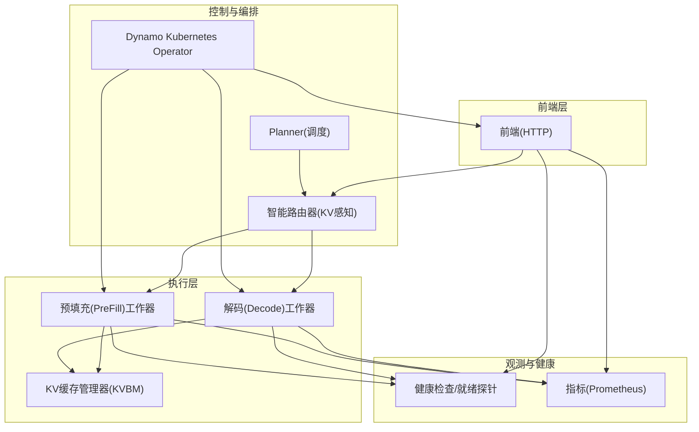
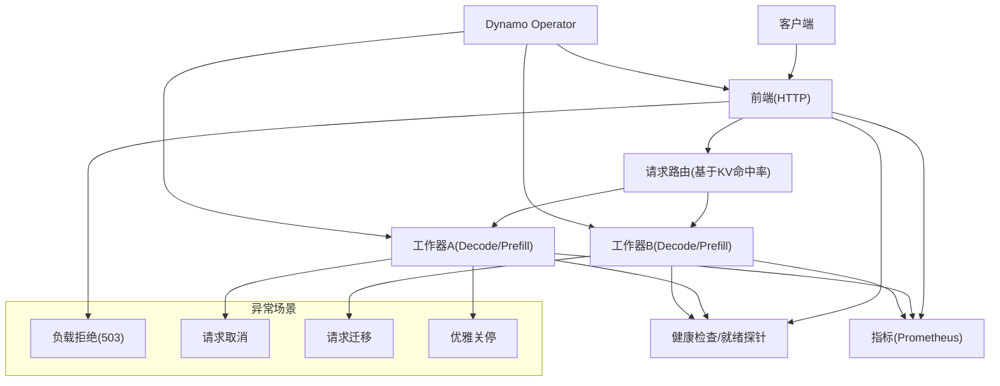
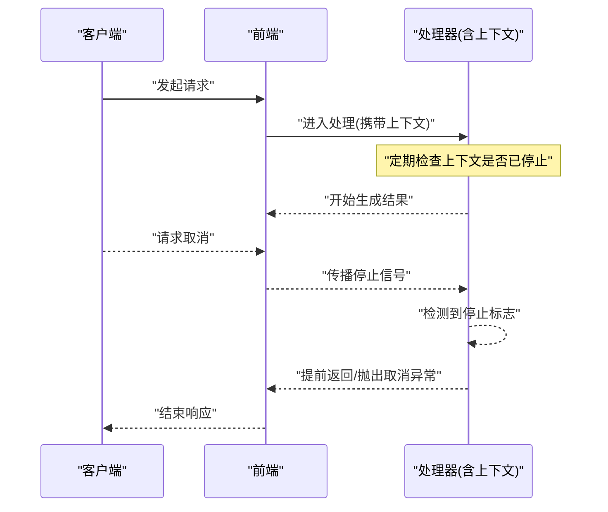
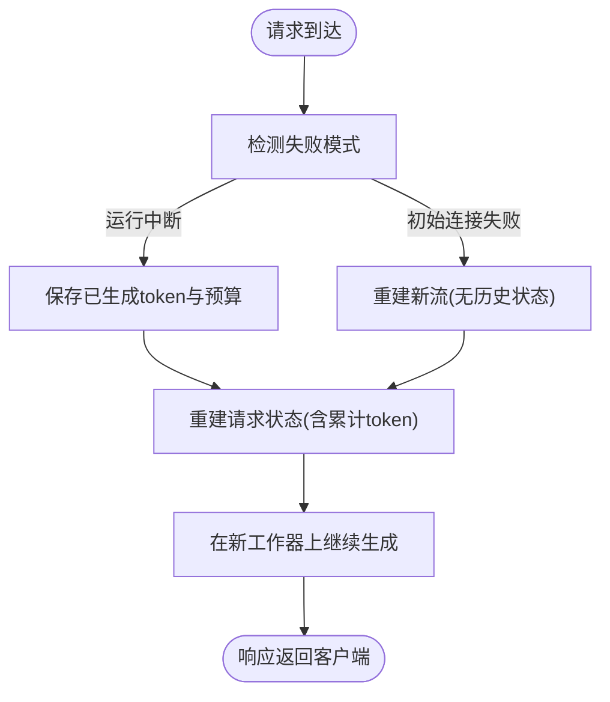
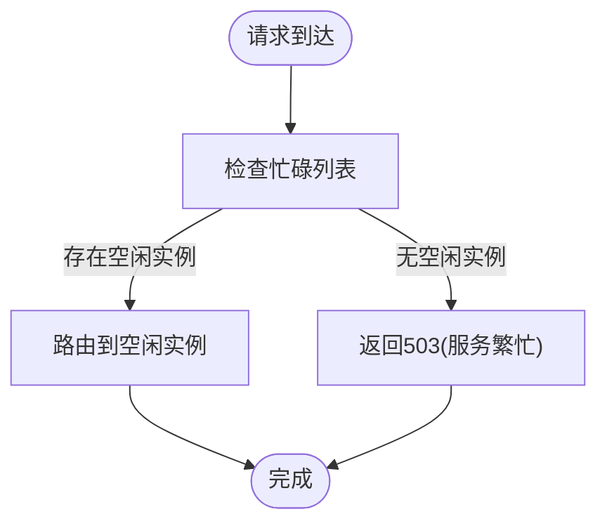
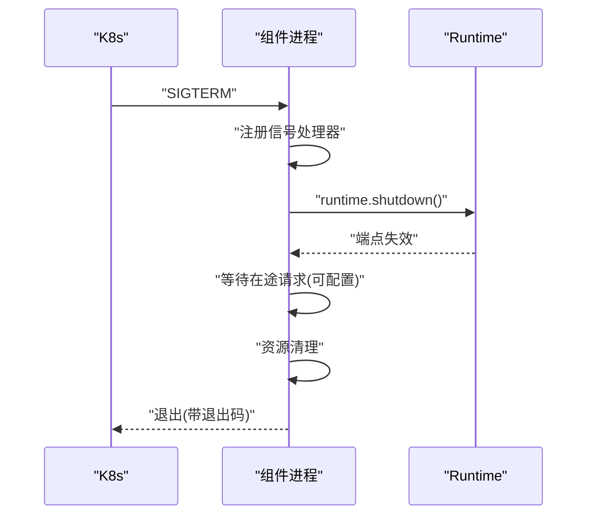
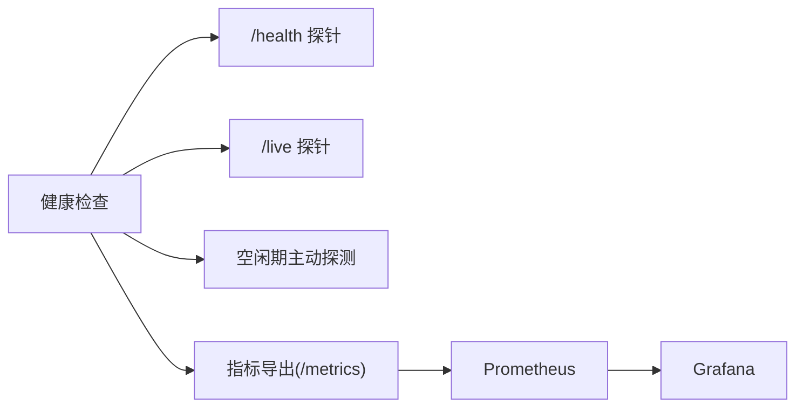
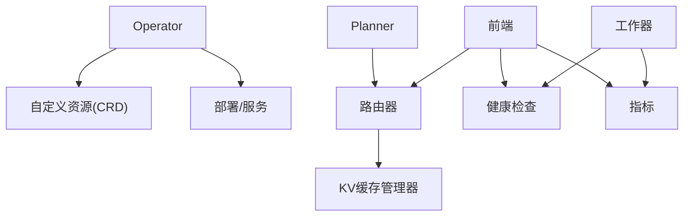

# 应急响应预案

<cite>
**本文引用的文件**
- [graceful_shutdown.md](file://docs/fault_tolerance/graceful_shutdown.md)
- [request_cancellation.md](file://docs/fault_tolerance/request_cancellation.md)
- [request_migration.md](file://docs/fault_tolerance/request_migration.md)
- [request_rejection.md](file://docs/fault_tolerance/request_rejection.md)
- [testing.md](file://docs/fault_tolerance/testing.md)
- [architecture.md](file://docs/design_docs/architecture.md)
- [dynamo_operator.md](file://docs/kubernetes/dynamo_operator.md)
- [health-checks.md](file://docs/observability/health-checks.md)
- [metrics.md](file://docs/observability/metrics.md)
- [vllm 健康检查实现](file://components/src/dynamo/vllm/health_check.py)
- [trtllm 健康检查实现](file://components/src/dynamo/trtllm/health_check.py)
- [sglang 健康检查实现](file://components/src/dynamo/sglang/health_check.py)
- [安全漏洞报告指南](file://SECURITY.md)
</cite>

## 目录
1. [引言](#引言)
2. [项目结构与总体架构](#项目结构与总体架构)
3. [核心组件与能力](#核心组件与能力)
4. [架构总览](#架构总览)
5. [详细组件分析](#详细组件分析)
6. [依赖关系分析](#依赖关系分析)
7. [性能与容量规划](#性能与容量规划)
8. [故障隔离与降级策略](#故障隔离与降级策略)
9. [数据安全与一致性保障](#数据安全与一致性保障)
10. [恢复与回滚流程](#恢复与回滚流程)
11. [故障级别与升级机制](#故障级别与升级机制)
12. [应急联系人与通知流程](#应急联系人与通知流程)
13. [平衡故障处理与业务影响](#平衡故障处理与业务影响)
14. [结论](#结论)

## 引言
本预案面向Dynamo在生产环境中的应急响应，目标是建立一套完整的“预防-准备-响应-恢复-复盘”闭环：确保在发生硬件/软件/网络等各类故障时，能够快速隔离风险、保护数据、维持业务连续性，并在最短时间内完成系统恢复与事后分析。

## 项目结构与总体架构
Dynamo采用模块化设计，前端负责请求接入与路由，后端支持多引擎（vLLM/SGLang/TensorRT-LLM），通过事件平面与智能路由器实现分布式推理与KV缓存优化。该架构为应急响应提供了天然的可扩展性与可观测性基础。

图表来源
- [architecture.md](file://docs/design_docs/architecture.md#L61-L67)
- [dynamo_operator.md](file://docs/kubernetes/dynamo_operator.md#L17-L21)

章节来源
- [architecture.md](file://docs/design_docs/architecture.md#L19-L67)
- [dynamo_operator.md](file://docs/kubernetes/dynamo_operator.md#L1-L224)

## 核心组件与能力
- 请求取消：通过上下文传播取消信号，避免无效计算，降低资源浪费。
- 请求迁移：在工作器失败时无缝续传部分生成状态，保障用户无感。
- 负载拒绝：在过载时主动拒绝新请求，防止级联故障与内存溢出。
- 优雅关停：统一信号处理、端点失效、请求等待与资源清理，配合K8s终止窗口。
- 健康检查与可观测性：统一健康/就绪探针、指标暴露与告警，支撑快速定位。
- 测试框架：覆盖取消、迁移、etcd高可用、硬件故障注入等场景，保障预案有效性。

章节来源
- [request_cancellation.md](file://docs/fault_tolerance/request_cancellation.md#L1-L89)
- [request_migration.md](file://docs/fault_tolerance/request_migration.md#L1-L137)
- [request_rejection.md](file://docs/fault_tolerance/request_rejection.md#L1-L329)
- [graceful_shutdown.md](file://docs/fault_tolerance/graceful_shutdown.md#L18-L275)
- [health-checks.md](file://docs/observability/health-checks.md#L6-L345)
- [metrics.md](file://docs/observability/metrics.md#L6-L224)
- [testing.md](file://docs/fault_tolerance/testing.md#L18-L504)

## 架构总览
下图展示生产环境中的关键组件与应急路径：前端负责接入与限流；路由器根据KV命中率与负载进行分流；工作器通过健康检查与指标监控；Operator负责部署与生命周期管理；测试框架用于演练与验证。

图表来源
- [request_rejection.md](file://docs/fault_tolerance/request_rejection.md#L32-L52)
- [request_cancellation.md](file://docs/fault_tolerance/request_cancellation.md#L5-L32)
- [request_migration.md](file://docs/fault_tolerance/request_migration.md#L9-L20)
- [graceful_shutdown.md](file://docs/fault_tolerance/graceful_shutdown.md#L31-L50)
- [health-checks.md](file://docs/observability/health-checks.md#L14-L26)
- [metrics.md](file://docs/observability/metrics.md#L16-L22)

## 详细组件分析

### 请求取消（Cancellation）
- 设计要点：通过上下文trait提供统一的停止/杀死语义，支持父子链路自动传播，适用于多级请求链路。
- 关键行为：支持同步检查与异步等待，避免在已取消请求上继续昂贵计算。
- 使用建议：在长耗时阶段前检查取消状态；对外出站请求可传递同一上下文以联动取消。

图表来源
- [request_cancellation.md](file://docs/fault_tolerance/request_cancellation.md#L50-L89)

章节来源
- [request_cancellation.md](file://docs/fault_tolerance/request_cancellation.md#L1-L89)

### 请求迁移（Migration）
- 设计要点：迁移器位于处理管道中，拦截请求/响应，检测失败并重建请求状态在新工作器上继续。
- 状态管理：累积生成的token序列与剩余预算，保证迁移后无缝续传。
- 场景覆盖：初始连接失败与运行中断连两种，均透明对客户端可见。
- 指标监控：提供迁移总数与类型标签，便于告警与趋势分析。

图表来源
- [request_migration.md](file://docs/fault_tolerance/request_migration.md#L44-L90)

章节来源
- [request_migration.md](file://docs/fault_tolerance/request_migration.md#L1-L137)

### 负载拒绝（Load Shedding）
- 触发条件：当所有工作器超过阈值（KV块利用率或预填充token数）时，前端返回503并提示重试。
- 阈值配置：可通过启动参数与动态API设置，支持按模型维度调整。
- 运行时调整：结合HPA触发时机，在扩容前通过拒绝缓冲压力。
- 指标监控：提供拒绝总量与队列长度等指标，支持Grafana告警。

图表来源
- [request_rejection.md](file://docs/fault_tolerance/request_rejection.md#L160-L184)

章节来源
- [request_rejection.md](file://docs/fault_tolerance/request_rejection.md#L1-L329)

### 优雅关停（Graceful Shutdown）
- 信号处理：统一接收SIGTERM/SIGINT，调用runtime关闭端点，等待在途请求完成或立即返回。
- 组件差异：预填充/解码/路由器等组件根据职责设定不同的等待策略；解码在允许迁移时可立即关停以让迁移接管。
- 资源清理：各组件在finally块中清理临时目录、引擎与连接。
- Kubernetes集成：利用terminationGracePeriodSeconds与健康探针，确保平滑终止与重启。

图表来源
- [graceful_shutdown.md](file://docs/fault_tolerance/graceful_shutdown.md#L31-L50)
- [graceful_shutdown.md](file://docs/fault_tolerance/graceful_shutdown.md#L197-L227)

章节来源
- [graceful_shutdown.md](file://docs/fault_tolerance/graceful_shutdown.md#L18-L275)

### 健康检查与可观测性
- 健康/就绪探针：统一的/health与/liveness接口，支持端点就绪前置条件与K8s集成。
- 主动探测（Canary）：空闲期发送轻量请求验证端点可用性，避免误判。
- 指标体系：前端/组件/引擎指标统一以dynamo_*前缀暴露，便于Prometheus抓取与Grafana可视化。
- 后端特定payload：vLLM/SGLang/TRT-LLM分别提供最小化健康检查负载，确保低开销验证。

图表来源
- [health-checks.md](file://docs/observability/health-checks.md#L14-L26)
- [metrics.md](file://docs/observability/metrics.md#L16-L22)
- [vllm 健康检查实现](file://components/src/dynamo/vllm/health_check.py#L52-L121)
- [trtllm 健康检查实现](file://components/src/dynamo/trtllm/health_check.py#L51-L92)
- [sglang 健康检查实现](file://components/src/dynamo/sglang/health_check.py#L50-L121)

章节来源
- [health-checks.md](file://docs/observability/health-checks.md#L6-L345)
- [metrics.md](file://docs/observability/metrics.md#L6-L224)
- [vllm 健康检查实现](file://components/src/dynamo/vllm/health_check.py#L1-L121)
- [trtllm 健康检查实现](file://components/src/dynamo/trtllm/health_check.py#L1-L92)
- [sglang 健康检查实现](file://components/src/dynamo/sglang/health_check.py#L1-L121)

## 依赖关系分析
- 控制面依赖：Operator负责CRD管理与部署协调，Planner驱动调度，路由器依赖KVBM与模型配置。
- 数据面依赖：前端依赖后端工作器注册信息与健康状态；工作器依赖KV缓存与引擎。
- 可观测性依赖：健康检查与指标作为运维入口，测试框架作为预案验证工具。

图表来源
- [dynamo_operator.md](file://docs/kubernetes/dynamo_operator.md#L103-L118)
- [metrics.md](file://docs/observability/metrics.md#L90-L99)

章节来源
- [dynamo_operator.md](file://docs/kubernetes/dynamo_operator.md#L1-L224)
- [metrics.md](file://docs/observability/metrics.md#L90-L99)

## 性能与容量规划
- 终止窗口：根据平均请求时长与最长生成时间设置K8s终止宽限期，避免强制杀进程导致请求中断。
- 拒绝阈值：保守阈值优先低延迟，激进阈值优先吞吐；结合HPA触发点预留缓冲。
- 资源预留：为健康检查与指标采集预留CPU/内存，避免额外负载放大。

[本节为通用指导，无需具体文件分析]

## 故障隔离与降级策略
- 组件降级：当某类工作器不可用时，将流量切换至其他副本或备用节点；必要时暂时屏蔽该组件端点。
- 流量切换：通过健康检查失败与就绪探针失效，使K8s停止向故障实例转发流量。
- 资源回收：在关停前释放引擎、连接与临时文件，缩短重启时间；对长时间占用的资源进行超时控制。

章节来源
- [graceful_shutdown.md](file://docs/fault_tolerance/graceful_shutdown.md#L111-L153)
- [health-checks.md](file://docs/observability/health-checks.md#L147-L217)

## 数据安全与一致性保障
- 请求取消：在取消点前的数据不被写入下游，避免脏数据；取消后尽快释放资源。
- 请求迁移：仅在成功生成token后才纳入累计状态，迁移前后token不重复、不丢失。
- 负载拒绝：对503响应的客户端实施指数退避，避免雪崩式重试放大系统压力。
- 优雅关停：确保端点失效后再清理资源，避免半完成状态对外暴露。

章节来源
- [request_cancellation.md](file://docs/fault_tolerance/request_cancellation.md#L1-L89)
- [request_migration.md](file://docs/fault_tolerance/request_migration.md#L30-L90)
- [request_rejection.md](file://docs/fault_tolerance/request_rejection.md#L160-L206)
- [graceful_shutdown.md](file://docs/fault_tolerance/graceful_shutdown.md#L111-L153)

## 恢复与回滚流程
- 状态检查：通过健康检查与指标确认组件可用性与负载水平。
- 一致性验证：核对迁移前后token序列与剩余预算，确保无重复/丢失。
- 业务连续性：在恢复期间启用冗余副本与热备实例，优先保障关键模型。
- 回滚策略：若升级引入问题，回退到上一个稳定版本并恢复旧配置；回滚前先关停当前实例，再启动旧版实例。

章节来源
- [request_migration.md](file://docs/fault_tolerance/request_migration.md#L112-L137)
- [graceful_shutdown.md](file://docs/fault_tolerance/graceful_shutdown.md#L197-L227)
- [metrics.md](file://docs/observability/metrics.md#L101-L175)

## 故障级别与升级机制
- 一级故障：单实例/单组件异常（如GPU过热/网络分区）。处置：隔离实例、迁移请求、补充副本。
- 二级故障：多实例/多组件同时异常（如etcd主从切换/大规模网络分区）。处置：启用备用集群、扩大副本、限制新流量。
- 三级故障：核心控制面异常（如Operator/调度异常）。处置：人工接管、回退到稳定配置、启用只读模式。
- 升级机制：分级发布、灰度验证、自动回滚；升级前进行压测与演练。

章节来源
- [testing.md](file://docs/fault_tolerance/testing.md#L186-L201)
- [dynamo_operator.md](file://docs/kubernetes/dynamo_operator.md#L58-L90)

## 应急联系人与通知流程
- 一线值班：负责故障发现、初步处置与升级。
- 二线专家：负责复杂故障根因分析与修复方案制定。
- 三线架构师：负责跨域问题协调与系统性改进。
- 通知渠道：IM群组/电话/邮件；故障升级需记录时间线与处置步骤。
- 安全漏洞：遵循安全披露流程，加密上报并跟踪修复进度。

章节来源
- [SECURITY.md](file://SECURITY.md#L18-L32)

## 平衡故障处理与业务影响
- 以用户为中心：优先保障高优模型与关键业务；对非关键流量采取拒绝或降级。
- 以系统为中心：通过健康检查与指标快速识别瓶颈，避免过度扩容造成资源浪费。
- 以流程为中心：标准化处置步骤与演练频率，降低首次响应时间与误操作概率。

[本节为通用指导，无需具体文件分析]

## 结论
通过将请求取消、迁移、负载拒绝与优雅关停等能力与健康检查、指标监控、Operator编排相结合，Dynamo可在生产环境中实现高可用与低影响的应急响应。建议将本文预案纳入SOP，定期演练并持续优化阈值与流程，以应对不断演进的业务与技术挑战。