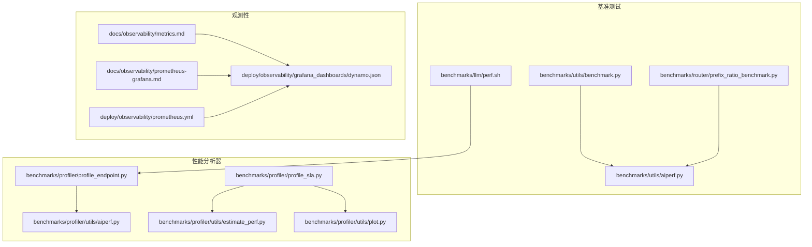
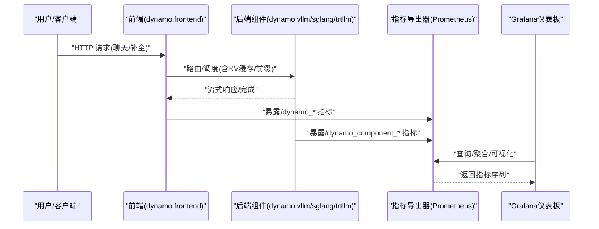
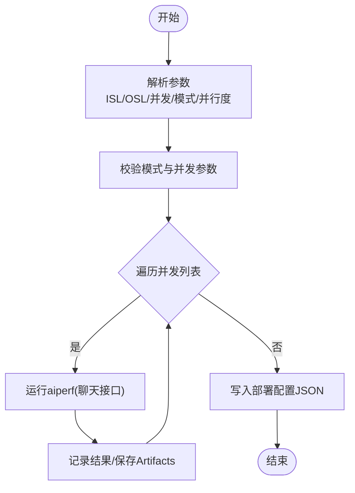
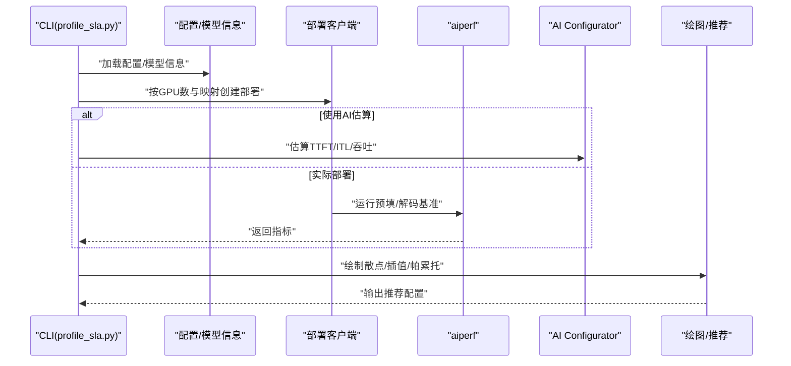
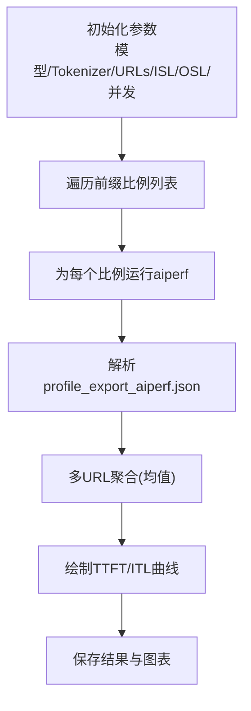
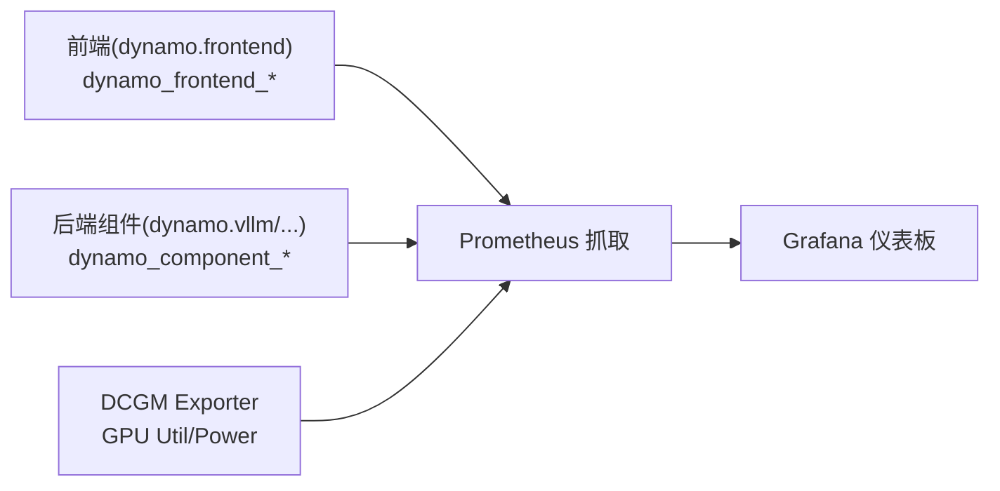
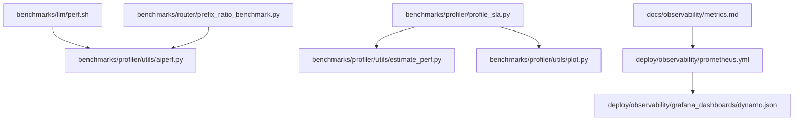

# 性能瓶颈分析

<cite>
**本文档引用的文件**
- [benchmarks/llm/perf.sh](file://benchmarks/llm/perf.sh)
- [benchmarks/utils/benchmark.py](file://benchmarks/utils/benchmark.py)
- [benchmarks/profiler/profile_endpoint.py](file://benchmarks/profiler/profile_endpoint.py)
- [benchmarks/profiler/profile_sla.py](file://benchmarks/profiler/profile_sla.py)
- [benchmarks/router/prefix_ratio_benchmark.py](file://benchmarks/router/prefix_ratio_benchmark.py)
- [benchmarks/profiler/utils/aiperf.py](file://benchmarks/profiler/utils/aiperf.py)
- [benchmarks/profiler/utils/estimate_perf.py](file://benchmarks/profiler/utils/estimate_perf.py)
- [benchmarks/profiler/utils/plot.py](file://benchmarks/profiler/utils/plot.py)
- [benchmarks/utils/aiperf.py](file://benchmarks/utils/aiperf.py)
- [benchmarks/utils/plot.py](file://benchmarks/utils/plot.py)
- [benchmarks/multimodal/local_media_server.py](file://benchmarks/multimodal/local_media_server.py)
- [docs/observability/metrics.md](file://docs/observability/metrics.md)
- [docs/observability/prometheus-grafana.md](file://docs/observability/prometheus-grafana.md)
- [deploy/observability/grafana_dashboards/dynamo.json](file://deploy/observability/grafana_dashboards/dynamo.json)
- [deploy/observability/prometheus.yml](file://deploy/observability/prometheus.yml)
</cite>

## 目录
1. [简介](#简介)
2. [项目结构](#项目结构)
3. [核心组件](#核心组件)
4. [架构总览](#架构总览)
5. [详细组件分析](#详细组件分析)
6. [依赖关系分析](#依赖关系分析)
7. [性能考虑](#性能考虑)
8. [故障排查指南](#故障排查指南)
9. [结论](#结论)
10. [附录](#附录)

## 简介
本指南面向Dynamo系统的性能瓶颈分析与优化，覆盖CPU、内存、GPU与网络四个层面的性能分析方法，系统性讲解性能指标监控与数据分析技术（关键指标识别、趋势分析、异常检测），并提供从系统调用到资源利用率评估的完整瓶颈定位流程，以及可操作的优化策略与实施建议。文档同时介绍性能测试工具（如aiperf）的使用、基准测试设置与对比分析方法，并说明如何基于监控数据进行容量规划。

## 项目结构
Dynamo仓库围绕“基准测试与性能分析”提供了多条路径：
- 基准脚本：用于端到端吞吐/延迟测试与并发扫描
- Profiler：面向预填（prefill）与解码（decode）阶段的SLA驱动性能分析
- 路由器基准：前缀比例对TTFT/ITL的影响测试
- 观测性：指标定义、可视化与仪表板配置
- 多模态：媒体服务器示例，便于消除外部网络因素影响

**图表来源**
- [benchmarks/llm/perf.sh](file://benchmarks/llm/perf.sh#L1-L271)
- [benchmarks/utils/benchmark.py](file://benchmarks/utils/benchmark.py#L1-L103)
- [benchmarks/router/prefix_ratio_benchmark.py](file://benchmarks/router/prefix_ratio_benchmark.py#L1-L506)
- [benchmarks/utils/aiperf.py](file://benchmarks/utils/aiperf.py#L1-L114)
- [benchmarks/profiler/profile_endpoint.py](file://benchmarks/profiler/profile_endpoint.py#L1-L124)
- [benchmarks/profiler/profile_sla.py](file://benchmarks/profiler/profile_sla.py#L1-L786)
- [benchmarks/profiler/utils/aiperf.py](file://benchmarks/profiler/utils/aiperf.py#L1-L374)
- [benchmarks/profiler/utils/estimate_perf.py](file://benchmarks/profiler/utils/estimate_perf.py#L1-L234)
- [benchmarks/profiler/utils/plot.py](file://benchmarks/profiler/utils/plot.py#L1-L347)
- [docs/observability/metrics.md](file://docs/observability/metrics.md#L1-L224)
- [docs/observability/prometheus-grafana.md](file://docs/observability/prometheus-grafana.md#L1-L113)
- [deploy/observability/grafana_dashboards/dynamo.json](file://deploy/observability/grafana_dashboards/dynamo.json#L1-L800)
- [deploy/observability/prometheus.yml](file://deploy/observability/prometheus.yml#L1-L63)

**章节来源**
- [benchmarks/llm/perf.sh](file://benchmarks/llm/perf.sh#L1-L271)
- [benchmarks/utils/benchmark.py](file://benchmarks/utils/benchmark.py#L1-L103)
- [benchmarks/router/prefix_ratio_benchmark.py](file://benchmarks/router/prefix_ratio_benchmark.py#L1-L506)
- [benchmarks/utils/aiperf.py](file://benchmarks/utils/aiperf.py#L1-L114)
- [benchmarks/profiler/profile_endpoint.py](file://benchmarks/profiler/profile_endpoint.py#L1-L124)
- [benchmarks/profiler/profile_sla.py](file://benchmarks/profiler/profile_sla.py#L1-L786)
- [benchmarks/profiler/utils/aiperf.py](file://benchmarks/profiler/utils/aiperf.py#L1-L374)
- [benchmarks/profiler/utils/estimate_perf.py](file://benchmarks/profiler/utils/estimate_perf.py#L1-L234)
- [benchmarks/profiler/utils/plot.py](file://benchmarks/profiler/utils/plot.py#L1-L347)
- [docs/observability/metrics.md](file://docs/observability/metrics.md#L1-L224)
- [docs/observability/prometheus-grafana.md](file://docs/observability/prometheus-grafana.md#L1-L113)
- [deploy/observability/grafana_dashboards/dynamo.json](file://deploy/observability/grafana_dashboards/dynamo.json#L1-L800)
- [deploy/observability/prometheus.yml](file://deploy/observability/prometheus.yml#L1-L63)

## 核心组件
- 基准脚本与工具
  - 统一的LLM基准入口，支持并发扫描、ISL/OSL参数化、部署模式选择与结果归档
  - aiperf封装：统一构建命令、执行与结果解析，支持预填/解码两类场景
  - 可视化工具：解析aiperf输出，生成时序图、效率图与帕累托曲线
- 性能分析器（SLA驱动）
  - 预填/解码阶段独立建模，支持注意力数据并行（DEP）测量修正
  - AI Configurator估算模块，用于无部署的快速性能预测
  - 结果可视化：TTFT/ITL随ISL/并发度变化的拟合与3D表面图
- 观测性与监控
  - 指标体系：前端/后端/引擎指标，含请求量、时延、吞吐、字节等
  - 可视化：Grafana仪表板与Prometheus抓取配置
- 路由器与多模态
  - 前缀比例对TTFT/ITL影响的路由器基准
  - 本地媒体服务器示例，便于排除网络因素干扰

**章节来源**
- [benchmarks/llm/perf.sh](file://benchmarks/llm/perf.sh#L1-L271)
- [benchmarks/utils/aiperf.py](file://benchmarks/utils/aiperf.py#L1-L114)
- [benchmarks/profiler/utils/aiperf.py](file://benchmarks/profiler/utils/aiperf.py#L1-L374)
- [benchmarks/profiler/utils/estimate_perf.py](file://benchmarks/profiler/utils/estimate_perf.py#L1-L234)
- [benchmarks/profiler/utils/plot.py](file://benchmarks/profiler/utils/plot.py#L1-L347)
- [docs/observability/metrics.md](file://docs/observability/metrics.md#L1-L224)
- [docs/observability/prometheus-grafana.md](file://docs/observability/prometheus-grafana.md#L1-L113)
- [deploy/observability/grafana_dashboards/dynamo.json](file://deploy/observability/grafana_dashboards/dynamo.json#L1-L800)

## 架构总览
下图展示从“请求发起”到“性能指标采集”的全链路：

**图表来源**
- [docs/observability/metrics.md](file://docs/observability/metrics.md#L101-L150)
- [docs/observability/prometheus-grafana.md](file://docs/observability/prometheus-grafana.md#L26-L75)
- [deploy/observability/prometheus.yml](file://deploy/observability/prometheus.yml#L36-L50)
- [deploy/observability/grafana_dashboards/dynamo.json](file://deploy/observability/grafana_dashboards/dynamo.json#L106-L116)

## 详细组件分析

### 组件A：LLM基准脚本（并发扫描与部署模式）
- 功能要点
  - 参数化ISL/OSL、并发列表、部署模式（聚合/拆分）、并行度（TP/DP）
  - 使用aiperf进行端到端吞吐/时延测试，自动保存部署配置与结果
  - 支持警告提示与幂等目录管理
- 关键流程
  - 解析参数与校验
  - 逐并发运行aiperf
  - 写入部署配置JSON
- 性能意义
  - 提供可重复、可对比的端到端吞吐/时延基线，支撑后续分析与优化

**图表来源**
- [benchmarks/llm/perf.sh](file://benchmarks/llm/perf.sh#L61-L242)

**章节来源**
- [benchmarks/llm/perf.sh](file://benchmarks/llm/perf.sh#L1-L271)

### 组件B：性能分析器（预填/解码SLA驱动）
- 功能要点
  - 预填/解码阶段分别建模，支持注意力数据并行（DEP）修正
  - 可选AI Configurator估算，避免部署开销
  - 自动绘制TTFT/ITL与ISL/并发度关系图，生成帕累托曲线
- 关键流程
  - 读取配置与模型信息
  - 遍历GPU数量与并行映射组合
  - 生成部署/估算结果
  - 可视化与推荐（满足SLA的最高吞吐/GPU）

**图表来源**
- [benchmarks/profiler/profile_sla.py](file://benchmarks/profiler/profile_sla.py#L134-L786)
- [benchmarks/profiler/utils/aiperf.py](file://benchmarks/profiler/utils/aiperf.py#L211-L311)
- [benchmarks/profiler/utils/estimate_perf.py](file://benchmarks/profiler/utils/estimate_perf.py#L76-L133)
- [benchmarks/profiler/utils/plot.py](file://benchmarks/profiler/utils/plot.py#L38-L134)

**章节来源**
- [benchmarks/profiler/profile_sla.py](file://benchmarks/profiler/profile_sla.py#L1-L786)
- [benchmarks/profiler/utils/aiperf.py](file://benchmarks/profiler/utils/aiperf.py#L1-L374)
- [benchmarks/profiler/utils/estimate_perf.py](file://benchmarks/profiler/utils/estimate_perf.py#L1-L234)
- [benchmarks/profiler/utils/plot.py](file://benchmarks/profiler/utils/plot.py#L1-L347)

### 组件C：路由器前缀比例基准
- 功能要点
  - 控制前缀比例，固定ISL/OSL，扫描不同前缀比例下的TTFT/ITL
  - 支持多URL并行基准，结果聚合与绘图
- 分析价值
  - 量化前缀命中对TTFT/ITL的影响，指导KV缓存与路由策略

**图表来源**
- [benchmarks/router/prefix_ratio_benchmark.py](file://benchmarks/router/prefix_ratio_benchmark.py#L120-L302)

**章节来源**
- [benchmarks/router/prefix_ratio_benchmark.py](file://benchmarks/router/prefix_ratio_benchmark.py#L1-L506)

### 组件D：观测性与监控
- 指标类别
  - 前端：请求总量、排队/在途请求数、TTFT/ITL、输入/输出长度、迁移次数等
  - 后端组件：在途请求、请求/响应字节、处理时延、运行时长等
  - 引擎指标：透传至后端引擎（如vLLM/SGLang/TRT-LLM）
- 可视化
  - Grafana仪表板包含请求速率、TTFT/ITL、字节速率、DCGM GPU利用率等面板
  - Prometheus抓取配置示例，支持多目标（前端、后端、DCGM等）

**图表来源**
- [docs/observability/metrics.md](file://docs/observability/metrics.md#L101-L175)
- [deploy/observability/grafana_dashboards/dynamo.json](file://deploy/observability/grafana_dashboards/dynamo.json#L106-L116)
- [deploy/observability/prometheus.yml](file://deploy/observability/prometheus.yml#L36-L50)

**章节来源**
- [docs/observability/metrics.md](file://docs/observability/metrics.md#L1-L224)
- [docs/observability/prometheus-grafana.md](file://docs/observability/prometheus-grafana.md#L1-L113)
- [deploy/observability/grafana_dashboards/dynamo.json](file://deploy/observability/grafana_dashboards/dynamo.json#L1-L800)
- [deploy/observability/prometheus.yml](file://deploy/observability/prometheus.yml#L1-L63)

## 依赖关系分析
- 工具链依赖
  - aiperf作为统一的性能测试与指标采集工具，贯穿基准脚本、路由器基准与性能分析器
  - 可视化依赖Prometheus抓取与Grafana面板
- 组件耦合
  - profile_sla.py依赖配置修改器、AI Configurator估算器与绘图模块
  - 基准脚本与路由器基准共享aiperf封装逻辑
- 外部集成
  - DCGM Exporter提供GPU利用率/功耗指标，便于CPU/GPU协同分析

**图表来源**
- [benchmarks/llm/perf.sh](file://benchmarks/llm/perf.sh#L205-L242)
- [benchmarks/router/prefix_ratio_benchmark.py](file://benchmarks/router/prefix_ratio_benchmark.py#L120-L302)
- [benchmarks/profiler/profile_sla.py](file://benchmarks/profiler/profile_sla.py#L1-L786)
- [benchmarks/profiler/utils/estimate_perf.py](file://benchmarks/profiler/utils/estimate_perf.py#L1-L234)
- [benchmarks/profiler/utils/plot.py](file://benchmarks/profiler/utils/plot.py#L1-L347)
- [docs/observability/metrics.md](file://docs/observability/metrics.md#L1-L224)
- [deploy/observability/prometheus.yml](file://deploy/observability/prometheus.yml#L1-L63)
- [deploy/observability/grafana_dashboards/dynamo.json](file://deploy/observability/grafana_dashboards/dynamo.json#L1-L800)

**章节来源**
- [benchmarks/llm/perf.sh](file://benchmarks/llm/perf.sh#L1-L271)
- [benchmarks/router/prefix_ratio_benchmark.py](file://benchmarks/router/prefix_ratio_benchmark.py#L1-L506)
- [benchmarks/profiler/profile_sla.py](file://benchmarks/profiler/profile_sla.py#L1-L786)
- [benchmarks/profiler/utils/estimate_perf.py](file://benchmarks/profiler/utils/estimate_perf.py#L1-L234)
- [benchmarks/profiler/utils/plot.py](file://benchmarks/profiler/utils/plot.py#L1-L347)
- [docs/observability/metrics.md](file://docs/observability/metrics.md#L1-L224)
- [deploy/observability/prometheus.yml](file://deploy/observability/prometheus.yml#L1-L63)
- [deploy/observability/grafana_dashboards/dynamo.json](file://deploy/observability/grafana_dashboards/dynamo.json#L1-L800)

## 性能考虑
- CPU层面
  - 前端排队与HTTP队列时间（dynamo_frontend_queued_requests）反映CPU调度与网络栈压力；与在途时间（dynamo_frontend_inflight_requests）对比可识别排队瓶颈
  - 并发扫描中，请求到达率与处理时延呈非线性关系，需关注CPU上下文切换与阻塞
- 内存层面
  - KV缓存大小与最大批大小（dynamo_frontend_model_max_num_batched_tokens、dynamo_frontend_model_total_kv_blocks）直接影响显存占用与吞吐
  - 建议结合AI Configurator估算的最大批大小进行容量规划
- GPU层面
  - DCGM指标（GPU利用率、功耗）用于识别GPU饱和与热节流
  - 预填/解码阶段的TTFT/ITL与ISL/并发度关系图可辅助确定最优并行映射
- 网络层面
  - 前端/后端字节速率（dynamo_component_request_bytes_total、dynamo_component_response_bytes_total）可用于识别带宽瓶颈
  - 多模态场景可通过本地媒体服务器消除外部网络抖动影响

[本节为通用指导，无需特定文件来源]

## 故障排查指南
- 指标缺失或不更新
  - 检查Prometheus抓取配置与目标可达性
  - 确认DYN_SYSTEM_PORT/DYN_HTTP_PORT已正确设置且未被防火墙拦截
- 指标异常
  - 对比dynamo_frontend_queued_requests与dynamo_frontend_inflight_requests，若排队占比过高，优先优化后端处理时延
  - 若DCGM GPU利用率低但功耗高，可能存在核显/电源限制或热节流
- 基准失败
  - 检查aiperf命令构建与随机种子一致性，确保预填/解码warmup一致
  - 在多URL并行基准中，确认请求分配均衡与结果聚合逻辑

**章节来源**
- [docs/observability/prometheus-grafana.md](file://docs/observability/prometheus-grafana.md#L94-L107)
- [deploy/observability/prometheus.yml](file://deploy/observability/prometheus.yml#L36-L50)
- [benchmarks/profiler/utils/aiperf.py](file://benchmarks/profiler/utils/aiperf.py#L313-L374)
- [benchmarks/router/prefix_ratio_benchmark.py](file://benchmarks/router/prefix_ratio_benchmark.py#L243-L302)

## 结论
通过统一的aiperf基准与SLA驱动的性能分析器，结合完善的观测性指标与可视化，Dynamo能够系统性地定位CPU、内存、GPU与网络层面的性能瓶颈。建议以并发扫描与前缀比例基准为起点，配合指标面板与插值分析，形成从“发现问题—定位瓶颈—验证优化—容量规划”的闭环。

[本节为总结性内容，无需特定文件来源]

## 附录

### A. 性能指标监控与数据分析清单
- 关键指标
  - 前端：请求总量、排队/在途请求数、TTFT/ITL、输入/输出长度、迁移次数
  - 后端：在途请求、请求/响应字节、处理时延、运行时长
  - GPU：利用率、功耗、温度
- 数据分析
  - 时间序列：并发扫描中的时延与吞吐趋势
  - 相关性：排队时延与在途时延的差异
  - 插值与拟合：ISL/并发度对TTFT/ITL的影响面
  - 异常检测：基于阈值与滑动窗口的离群点识别

**章节来源**
- [docs/observability/metrics.md](file://docs/observability/metrics.md#L101-L175)
- [benchmarks/utils/plot.py](file://benchmarks/utils/plot.py#L12-L90)
- [benchmarks/profiler/utils/plot.py](file://benchmarks/profiler/utils/plot.py#L136-L297)

### B. 瓶颈定位流程（系统调用与资源利用率）
- 步骤
  - 明确SLA目标（TTFT/ITL）
  - 并发扫描与ISL/OSL插值，识别饱和点
  - 对比排队时延与在途时延，判断CPU瓶颈
  - 查看GPU利用率与功耗，判断GPU瓶颈
  - 校验KV缓存与批大小，评估内存瓶颈
  - 排除网络抖动（多模态场景使用本地媒体服务器）
- 输出
  - 推荐配置（并行映射、GPU数、并发）
  - 可视化报告与容量规划建议

**章节来源**
- [benchmarks/profiler/profile_sla.py](file://benchmarks/profiler/profile_sla.py#L222-L786)
- [benchmarks/router/prefix_ratio_benchmark.py](file://benchmarks/router/prefix_ratio_benchmark.py#L1-L506)
- [benchmarks/multimodal/local_media_server.py](file://benchmarks/multimodal/local_media_server.py#L1-L115)

### C. 性能测试工具与基准设置
- aiperf命令构建
  - 预填：固定ISL，输出长度小且恒定
  - 解码：固定ISL/OSL，按并发批量发送
- 并发扫描
  - 通过环境变量或脚本参数控制并发级别
- 结果解析
  - 解析profile_export_aiperf.json，提取TTFT/ITL/吞吐等指标
- 可视化
  - 生成时序图、效率图、帕累托曲线与3D插值表面

**章节来源**
- [benchmarks/utils/aiperf.py](file://benchmarks/utils/aiperf.py#L36-L114)
- [benchmarks/profiler/utils/aiperf.py](file://benchmarks/profiler/utils/aiperf.py#L40-L154)
- [benchmarks/utils/plot.py](file://benchmarks/utils/plot.py#L263-L432)
- [benchmarks/profiler/utils/plot.py](file://benchmarks/profiler/utils/plot.py#L38-L134)

### D. 容量规划与对比分析
- 基于成本的帕累托分析
  - 将吞吐转换为每千次请求的成本，识别不同SLA下的最优配置
- 对比分析
  - 不同并行映射、GPU数、并发度的TTFT/ITL与吞吐对比
  - 前缀比例对TTFT/ITL的影响，指导KV缓存策略

**章节来源**
- [benchmarks/profiler/utils/plot.py](file://benchmarks/profiler/utils/plot.py#L299-L347)
- [benchmarks/router/prefix_ratio_benchmark.py](file://benchmarks/router/prefix_ratio_benchmark.py#L304-L506)