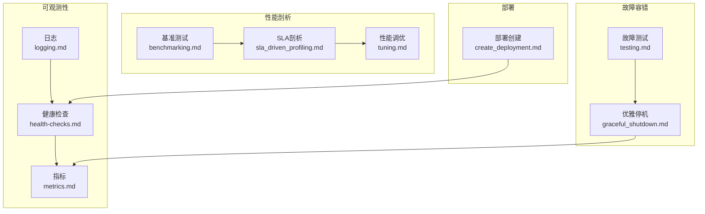
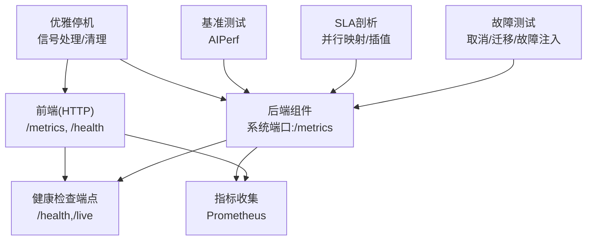
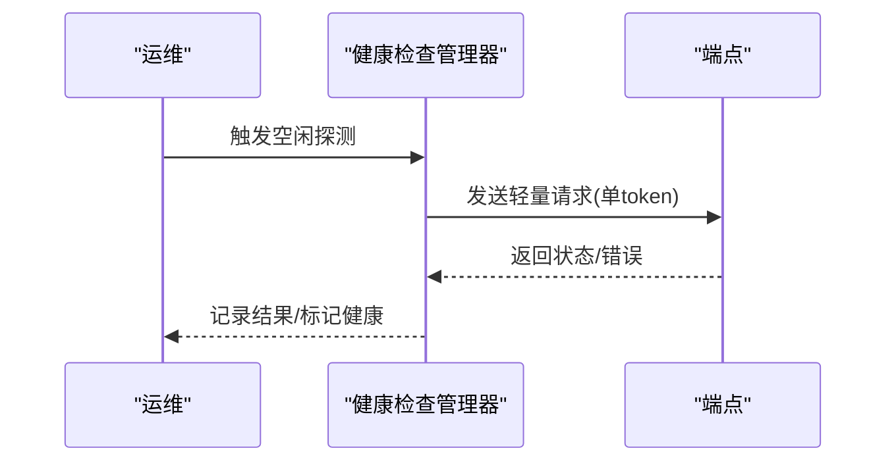
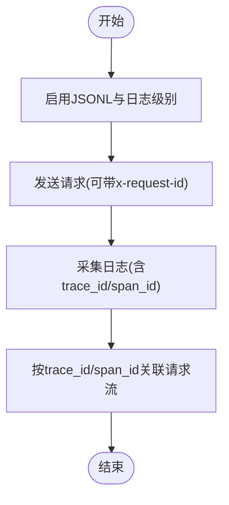
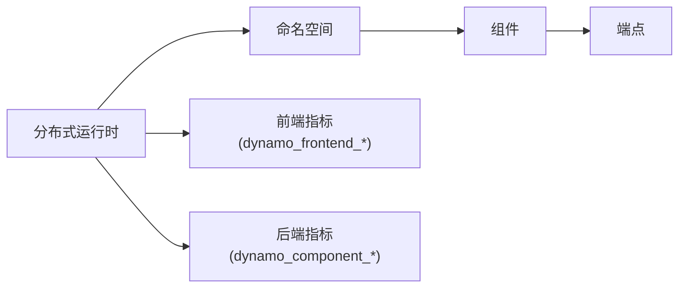
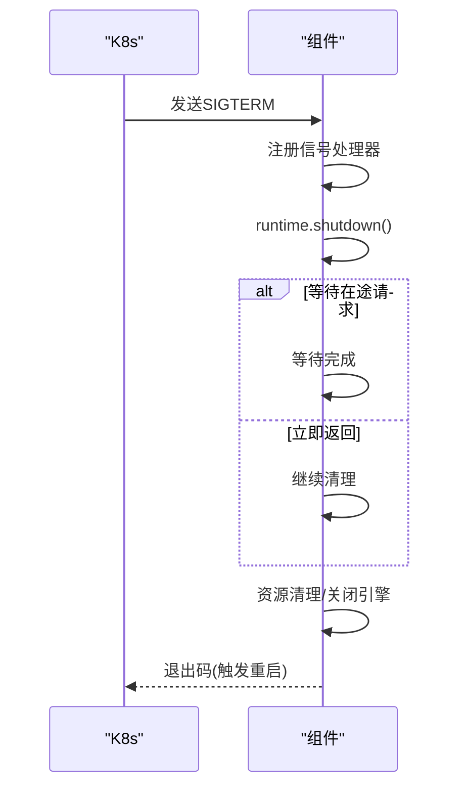
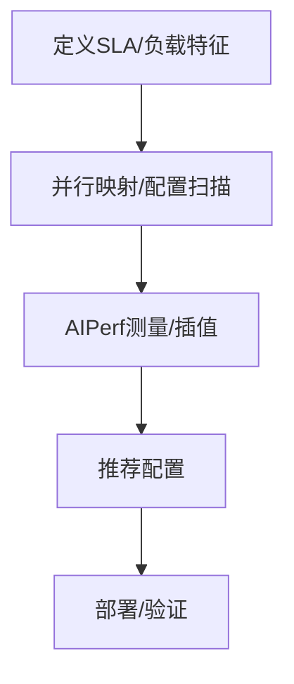
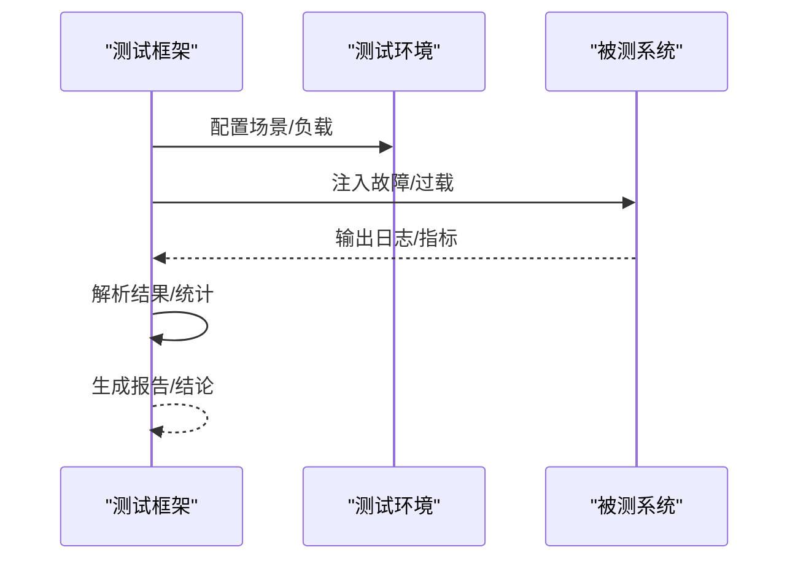
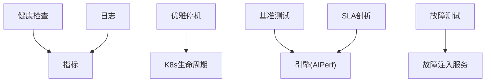
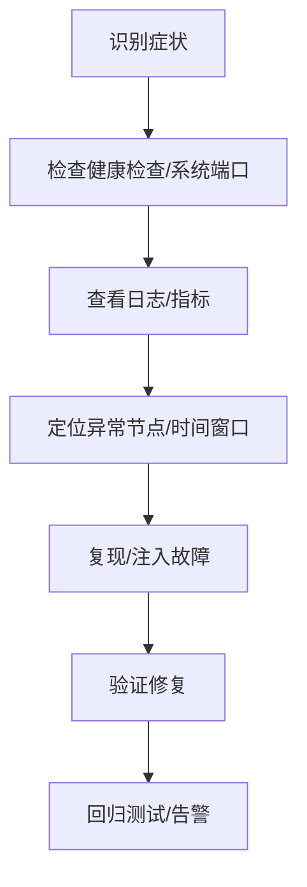

# 故障排查

<cite>
**本文引用的文件**
- [健康检查.md](file://docs/observability/health-checks.md)
- [日志.md](file://docs/observability/logging.md)
- [指标.md](file://docs/observability/metrics.md)
- [优雅停机.md](file://docs/fault_tolerance/graceful_shutdown.md)
- [测试.md](file://docs/fault_tolerance/testing.md)
- [部署创建.md](file://docs/kubernetes/deployment/create_deployment.md)
- [性能调优.md](file://docs/performance/tuning.md)
- [基准测试.md](file://docs/benchmarks/benchmarking.md)
- [SLA驱动的剖析.md](file://docs/benchmarks/sla_driven_profiling.md)
- [graceful_shutdown.md](file://docs/fault_tolerance/graceful_shutdown.md)
- [health-checks.md](file://docs/observability/health-checks.md)
- [logging.md](file://docs/observability/logging.md)
- [metrics.md](file://docs/observability/metrics.md)
- [testing.md](file://docs/fault_tolerance/testing.md)
- [create_deployment.md](file://docs/kubernetes/deployment/create_deployment.md)
- [tuning.md](file://docs/performance/tuning.md)
- [benchmarking.md](file://docs/benchmarks/benchmarking.md)
- [sla_driven_profiling.md](file://docs/benchmarks/sla_driven_profiling.md)
- [managed_process.py](file://tests/utils/managed_process.py)
- [parse_results.py](file://tests/fault_tolerance/deploy/parse_results.py)
- [legacy_parse_results.py](file://tests/fault_tolerance/deploy/legacy_parse_results.py)
- [tcp_client.rs](file://lib/runtime/src/pipeline/network/tcp_client.rs)
- [http_router.rs](file://lib/runtime/src/pipeline/network/egress/http_router.rs)
- [logging.rs](file://lib/runtime/src/logging.rs)
- [tracker.rs](file://lib/runtime/src/utils/tasks/tracker.rs)
- [planner_core.py](file://components/src/dynamo/planner/utils/planner_core.py)
</cite>

## 目录
1. [简介](#简介)
2. [项目结构](#项目结构)
3. [核心组件](#核心组件)
4. [架构总览](#架构总览)
5. [详细组件分析](#详细组件分析)
6. [依赖关系分析](#依赖关系分析)
7. [性能考量](#性能考量)
8. [故障排查指南](#故障排查指南)
9. [结论](#结论)
10. [附录](#附录)

## 简介
本指南面向Dynamo平台的运维与开发人员，提供系统化的故障排查方法论与实操步骤，覆盖启动失败、性能下降与连接异常三类高频问题；并给出根因分析流程、日志与指标分析技巧、应急响应预案（紧急停机、数据回滚与系统恢复）、性能瓶颈定位方法（CPU/内存/GPU/网络）以及预防性维护与风险评估建议。

## 项目结构
Dynamo在可观测性、故障容错、性能剖析与Kubernetes部署方面提供了完善的文档与工具链，便于快速定位与解决问题：
- 可观测性：健康检查、日志、指标、分布式追踪
- 故障容错：优雅停机、请求迁移/取消、硬件/网络故障注入测试
- 性能剖析：AIPerf基准、SLA驱动剖析、参数调优
- 部署参考：Kubernetes部署模板与最佳实践

**图表来源**
- [健康检查.md](file://docs/observability/health-checks.md#L1-L345)
- [日志.md](file://docs/observability/logging.md#L1-L263)
- [指标.md](file://docs/observability/metrics.md#L1-L224)
- [优雅停机.md](file://docs/fault_tolerance/graceful_shutdown.md#L1-L275)
- [测试.md](file://docs/fault_tolerance/testing.md#L1-L504)
- [基准测试.md](file://docs/benchmarks/benchmarking.md#L1-L542)
- [SLA驱动的剖析.md](file://docs/benchmarks/sla_driven_profiling.md#L1-L637)
- [性能调优.md](file://docs/performance/tuning.md#L1-L149)
- [部署创建.md](file://docs/kubernetes/deployment/create_deployment.md#L1-L260)

**章节来源**
- [健康检查.md](file://docs/observability/health-checks.md#L1-L345)
- [日志.md](file://docs/observability/logging.md#L1-L263)
- [指标.md](file://docs/observability/metrics.md#L1-L224)
- [优雅停机.md](file://docs/fault_tolerance/graceful_shutdown.md#L1-L275)
- [测试.md](file://docs/fault_tolerance/testing.md#L1-L504)
- [基准测试.md](file://docs/benchmarks/benchmarking.md#L1-L542)
- [SLA驱动的剖析.md](file://docs/benchmarks/sla_driven_profiling.md#L1-L637)
- [性能调优.md](file://docs/performance/tuning.md#L1-L149)
- [部署创建.md](file://docs/kubernetes/deployment/create_deployment.md#L1-L260)

## 核心组件
- 健康检查：通过HTTP端点与可选的主动“金丝雀”健康检查，检测组件就绪状态与端点可用性，并支持超时与等待时间配置。
- 日志：支持文本与JSONL格式，可带trace/span上下文，便于跨服务关联与追踪。
- 指标：统一暴露Prometheus格式指标，前端/后端/组件/端点多层级维度，便于告警与可视化。
- 优雅停机：统一信号处理与资源清理流程，支持按场景选择是否等待在途请求完成。
- 基准与剖析：AIPerf与SLA驱动剖析，自动搜索最优并行映射与引擎配置。
- 测试框架：覆盖请求取消、迁移、etcd高可用、硬件故障注入等场景，支持端到端部署测试与结果解析。

**章节来源**
- [健康检查.md](file://docs/observability/health-checks.md#L14-L345)
- [日志.md](file://docs/observability/logging.md#L15-L263)
- [指标.md](file://docs/observability/metrics.md#L16-L224)
- [优雅停机.md](file://docs/fault_tolerance/graceful_shutdown.md#L31-L275)
- [基准测试.md](file://docs/benchmarks/benchmarking.md#L16-L542)
- [SLA驱动的剖析.md](file://docs/benchmarks/sla_driven_profiling.md#L1-L637)
- [测试.md](file://docs/fault_tolerance/testing.md#L22-L504)

## 架构总览
下图展示Dynamo关键组件在故障排查中的交互关系：前端负责入口与指标，后端组件提供健康检查与系统状态端口，测试框架用于模拟故障与验证恢复，剖析工具用于性能优化。

**图表来源**
- [健康检查.md](file://docs/observability/health-checks.md#L49-L217)
- [指标.md](file://docs/observability/metrics.md#L32-L154)
- [优雅停机.md](file://docs/fault_tolerance/graceful_shutdown.md#L31-L195)
- [基准测试.md](file://docs/benchmarks/benchmarking.md#L64-L196)
- [SLA驱动的剖析.md](file://docs/benchmarks/sla_driven_profiling.md#L86-L106)
- [测试.md](file://docs/fault_tolerance/testing.md#L65-L315)

## 详细组件分析

### 健康检查与可观察性
- 端点与状态：前端与后端分别提供健康/存活端点，后端可通过环境变量控制初始状态与就绪所需端点集合。
- 主动健康检查（金丝雀）：空闲期触发轻量请求探测端点，避免业务流量干扰；支持超时与等待时间配置。
- 故障排查要点：
  - 超时：增大请求超时或检查网络连通性。
  - 日志过多：增大等待时间或在开发禁用。
  - 未运行：确认开关已启用、就绪端点列表包含目标端点、工作进程确实在提供该端点。

**图表来源**
- [健康检查.md](file://docs/observability/health-checks.md#L219-L339)

**章节来源**
- [健康检查.md](file://docs/observability/health-checks.md#L14-L345)

### 日志与追踪
- 结构化日志：支持JSONL输出，包含trace_id/span_id，便于跨服务串联请求路径。
- 追踪上下文：通过OpenTelemetry兼容ID，可在无外部追踪后端时也具备基本关联能力。
- 故障排查要点：
  - 启用JSONL与适当日志级别，结合x-request-id进行请求级关联。
  - 使用trace_id/span_id在日志中定位上下游节点耗时与异常。

**图表来源**
- [日志.md](file://docs/observability/logging.md#L97-L253)

**章节来源**
- [日志.md](file://docs/observability/logging.md#L15-L263)

### 指标与告警
- 指标层次：全局/命名空间/组件/端点四层，前端与后端分别暴露不同指标集。
- 关键指标：请求数、处理时延、并发队列长度、吞吐、迁移次数、拒绝次数等。
- 故障排查要点：
  - 前端：关注排队时长、首Token时延、并发与队列。
  - 后端：关注在途请求、字节输入/输出、运行时长、端点耗时分布。

**图表来源**
- [指标.md](file://docs/observability/metrics.md#L90-L154)

**章节来源**
- [指标.md](file://docs/observability/metrics.md#L16-L224)

### 优雅停机与资源清理
- 信号处理：统一注册SIGTERM/SIGINT，触发优雅停机流程。
- 端点引流：根据配置决定是否等待在途请求完成，Decode Worker可结合迁移策略。
- 清理流程：各后端实现特定清理逻辑（释放临时目录、关闭引擎等），确保干净重启。
- 故障停机：致命错误时主动发起优雅停机并强制退出以触发重启。

**图表来源**
- [graceful_shutdown.md](file://docs/fault_tolerance/graceful_shutdown.md#L31-L195)

**章节来源**
- [优雅停机.md](file://docs/fault_tolerance/graceful_shutdown.md#L31-L275)

### 基准测试与性能剖析
- AIPerf基准：支持客户端/服务端两种模式，可对比不同部署、后端、模型与硬件配置。
- SLA驱动剖析：声明式定义SLA，自动搜索并推荐并行映射与引擎配置，生成插值数据辅助规划。
- 调优建议：根据剖析结果调整并行度、批大小、块大小、最大token数等参数。

**图表来源**
- [sla_driven_profiling.md](file://docs/benchmarks/sla_driven_profiling.md#L86-L106)
- [基准测试.md](file://docs/benchmarks/benchmarking.md#L64-L196)

**章节来源**
- [基准测试.md](file://docs/benchmarks/benchmarking.md#L16-L542)
- [SLA驱动的剖析.md](file://docs/benchmarks/sla_driven_profiling.md#L1-L637)
- [性能调优.md](file://docs/performance/tuning.md#L18-L149)

### 故障测试框架
- 场景覆盖：请求取消、迁移、etcd高可用、硬件故障注入（GPU/网络分区）。
- 端到端测试：定义标准/过载/恢复三阶段，解析结果统计成功率、延迟分位数等。
- 工具与API：可编程客户端、故障注入服务API、结果解析脚本。

**图表来源**
- [测试.md](file://docs/fault_tolerance/testing.md#L312-L384)

**章节来源**
- [测试.md](file://docs/fault_tolerance/testing.md#L22-L504)
- [parse_results.py](file://tests/fault_tolerance/deploy/parse_results.py#L741-L801)
- [legacy_parse_results.py](file://tests/fault_tolerance/deploy/legacy_parse_results.py#L283-L316)

## 依赖关系分析
- 组件耦合：
  - 健康检查依赖系统端口与端点注册状态。
  - 指标与日志共同支撑可观测性，前者用于告警，后者用于根因定位。
  - 优雅停机与Kubernetes生命周期集成，影响Pod终止与重启行为。
  - 基准与剖析依赖真实/仿真引擎，受硬件与配置约束。
- 外部依赖：
  - Kubernetes：Pod生命周期、探针、命名空间与资源限制。
  - Prometheus/Grafana：指标采集与可视化。
  - 故障注入服务：GPU/XID/网络分区模拟。

**图表来源**
- [健康检查.md](file://docs/observability/health-checks.md#L14-L345)
- [指标.md](file://docs/observability/metrics.md#L16-L224)
- [日志.md](file://docs/observability/logging.md#L15-L263)
- [优雅停机.md](file://docs/fault_tolerance/graceful_shutdown.md#L197-L275)
- [基准测试.md](file://docs/benchmarks/benchmarking.md#L64-L196)
- [SLA驱动的剖析.md](file://docs/benchmarks/sla_driven_profiling.md#L108-L146)
- [测试.md](file://docs/fault_tolerance/testing.md#L202-L315)

**章节来源**
- [健康检查.md](file://docs/observability/health-checks.md#L14-L345)
- [指标.md](file://docs/observability/metrics.md#L16-L224)
- [日志.md](file://docs/observability/logging.md#L15-L263)
- [优雅停机.md](file://docs/fault_tolerance/graceful_shutdown.md#L197-L275)
- [基准测试.md](file://docs/benchmarks/benchmarking.md#L64-L196)
- [SLA驱动的剖析.md](file://docs/benchmarks/sla_driven_profiling.md#L108-L146)
- [测试.md](file://docs/fault_tolerance/testing.md#L202-L315)

## 性能考量
- 并行映射与引擎数量：根据模型规模与通信开销选择TP/PP组合，避免过度并行导致通信开销主导。
- 批大小与最大token：预填优先时小批大token，解码优先时大批小token；块大小影响KV缓存命中率与碎片。
- 路由与前缀缓存：合理设置本地预填长度与最大KV缓存，降低解码ITL与提升吞吐。
- 网络与存储：服务端基准测试消除端侧转发开销，获得更真实的集群内性能。

**章节来源**
- [性能调优.md](file://docs/performance/tuning.md#L31-L149)
- [基准测试.md](file://docs/benchmarks/benchmarking.md#L311-L489)

## 故障排查指南

### 一、问题识别与分类
- 启动失败
  - 症状：组件无法启动、健康检查长期不可用、系统端口未监听。
  - 关注点：日志级别、健康检查开关、端口占用、镜像拉取、K8s探针配置。
- 性能下降
  - 症状：请求时延升高、吞吐下降、排队增长、迁移/拒绝增多。
  - 关注点：指标趋势、并发与队列、后端在途请求、KV缓存命中率。
- 连接异常
  - 症状：连接超时、握手失败、路由不通、端口不可达。
  - 关注点：TCP连接池健康、网络分区、DNS/服务发现、防火墙策略。

**章节来源**
- [健康检查.md](file://docs/observability/health-checks.md#L14-L345)
- [指标.md](file://docs/observability/metrics.md#L101-L224)
- [tcp_client.rs](file://lib/runtime/src/pipeline/network/tcp_client.rs#L357-L387)

### 二、根因分析流程
- 步骤1：确认症状范围（单实例/全集群）
- 步骤2：检查健康检查与系统端口
- 步骤3：核对日志与指标，定位异常节点与时间窗口
- 步骤4：复现/注入故障，验证修复方案
- 步骤5：回归测试与监控告警

**图表来源**
- [health-checks.md](file://docs/observability/health-checks.md#L14-L345)
- [logging.md](file://docs/observability/logging.md#L15-L263)
- [metrics.md](file://docs/observability/metrics.md#L16-L224)

### 三、日志分析技巧
- 启用JSONL与trace/span上下文，使用x-request-id关联请求。
- 结合健康检查与指标，定位异常时间段内的错误日志。
- 利用任务跟踪器的错误聚合/采样策略，减少噪声并保留关键异常。

**章节来源**
- [日志.md](file://docs/observability/logging.md#L97-L253)
- [logging.rs](file://lib/runtime/src/logging.rs#L1015-L1401)
- [tracker.rs](file://lib/runtime/src/utils/tasks/tracker.rs#L1009-L6263)

### 四、性能日志与指标分析
- 前端：排队时长、首Token时延、并发与队列、迁移/拒绝计数。
- 后端：在途请求、请求耗时分布、字节输入/输出、运行时长。
- 观察指标变化趋势，结合负载与配置变更，判断是否为容量不足或参数不当。

**章节来源**
- [指标.md](file://docs/observability/metrics.md#L101-L224)
- [planner_core.py](file://components/src/dynamo/planner/utils/planner_core.py#L503-L563)

### 五、调试信息提取
- 健康检查：检查端点返回状态与超时日志。
- 连接池：过滤不健康连接，记录丢弃原因。
- 基准测试：导出AIPerf原始数据与可视化图表，定位瓶颈。

**章节来源**
- [health-checks.md](file://docs/observability/health-checks.md#L219-L339)
- [tcp_client.rs](file://lib/runtime/src/pipeline/network/tcp_client.rs#L357-L387)
- [benchmarking.md](file://docs/benchmarks/benchmarking.md#L185-L308)

### 六、应急响应预案
- 紧急停机
  - 触发优雅停机：发送SIGTERM，等待在途请求完成或按配置立即返回。
  - 强制停机：致命错误时主动发起停机并退出，触发K8s重启。
- 数据回滚
  - 通过版本化部署与只读回滚策略，确保配置与模型版本可回退。
- 系统恢复
  - 逐步扩容/缩容，观察健康检查与指标恢复情况；必要时启用降级策略（如禁用非关键端点）。

**章节来源**
- [graceful_shutdown.md](file://docs/fault_tolerance/graceful_shutdown.md#L154-L195)
- [graceful_shutdown.md](file://docs/fault_tolerance/graceful_shutdown.md#L197-L275)

### 七、性能瓶颈定位方法
- CPU/内存
  - 观察指标中的并发与队列，结合日志中的GC/内存压力事件。
- GPU
  - 通过剖析工具与AIPerf测量TTFT/ITL，评估并行映射与批大小。
- 网络
  - 使用服务端基准测试消除端侧转发误差，定位网络抖动与丢包。

**章节来源**
- [指标.md](file://docs/observability/metrics.md#L101-L224)
- [sla_driven_profiling.md](file://docs/benchmarks/sla_driven_profiling.md#L86-L106)
- [benchmarking.md](file://docs/benchmarks/benchmarking.md#L311-L489)

### 八、预防性维护与风险评估
- 定期演练：使用故障测试框架定期演练取消/迁移/etcd高可用/硬件故障注入。
- 风险评估：基于历史指标与负载预测，评估容量与SLA满足度，提前预警。
- 配置审计：定期审查健康检查、探针、资源限制与并行映射配置。

**章节来源**
- [测试.md](file://docs/fault_tolerance/testing.md#L456-L504)
- [planner_core.py](file://components/src/dynamo/planner/utils/planner_core.py#L525-L563)

## 结论
通过健康检查、日志与指标三位一体的可观测体系，结合优雅停机、基准测试与剖析工具，Dynamo能够系统化地定位与解决启动失败、性能下降与连接异常等问题。配合故障测试与预防性维护，可显著提升系统的稳定性与可运维性。

## 附录
- 快速检查清单
  - 健康检查端点可用且状态正常
  - 系统端口开放，日志包含trace_id
  - 指标显示排队/在途异常
  - 基准测试/剖析结果与SLA对比
  - 故障注入测试通过，恢复时间达标